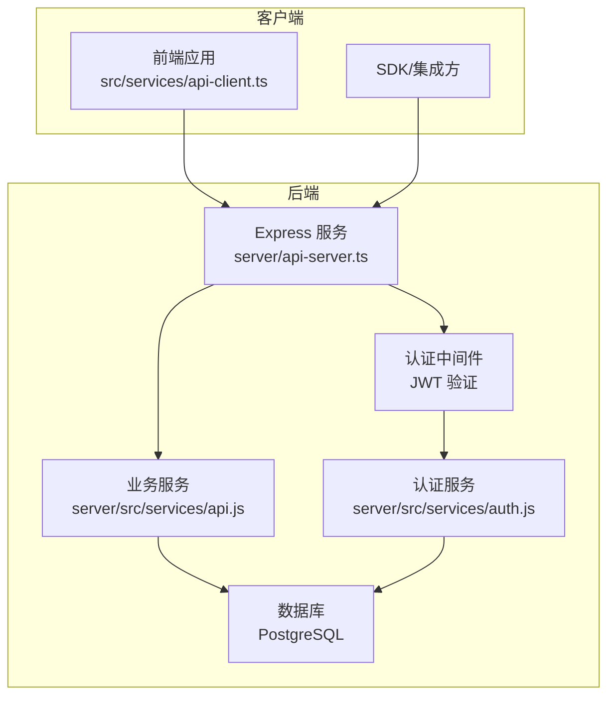
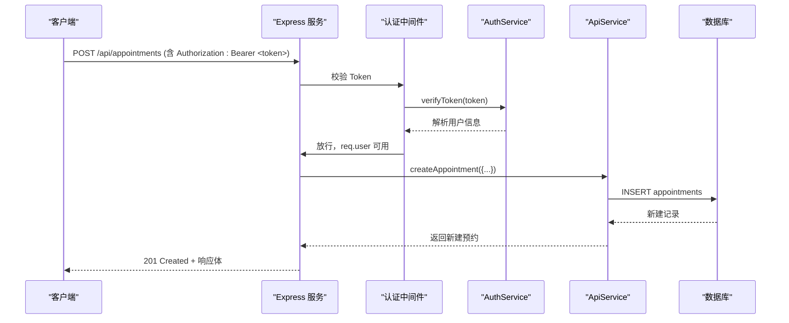
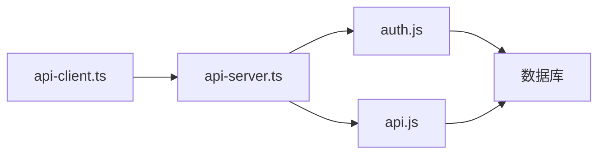
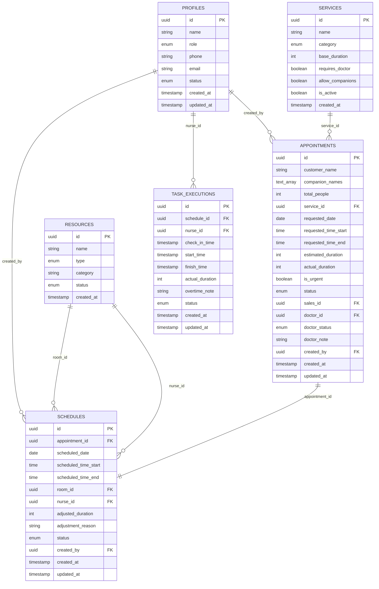
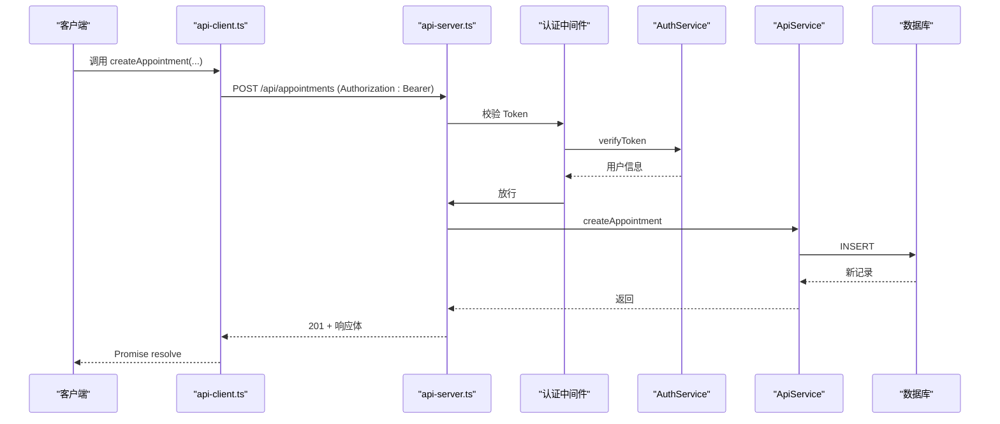

# API参考

<cite>
**本文引用的文件**
- [server/api-server.ts](file://server/api-server.ts)
- [server/src/services/api.js](file://server/src/services/api.js)
- [server/src/services/auth.js](file://server/src/services/auth.js)
- [src/services/api-client.ts](file://src/services/api-client.ts)
- [src/db/api.ts](file://src/db/api.ts)
- [src/types/types.ts](file://src/types/types.ts)
- [supabase/migrations/00001_create_bio_appointment_schema.sql](file://supabase/migrations/00001_create_bio_appointment_schema.sql)
- [test-all-apis.js](file://test-all-apis.js)
</cite>

## 目录
1. [简介](#简介)
2. [项目结构](#项目结构)
3. [核心组件](#核心组件)
4. [架构总览](#架构总览)
5. [详细组件分析](#详细组件分析)
6. [依赖关系分析](#依赖关系分析)
7. [性能考量](#性能考量)
8. [故障排除指南](#故障排除指南)
9. [结论](#结论)
10. [附录](#附录)

## 简介
本文件为 Bio-Appointment 的 API 参考文档，面向前端开发者与第三方集成商，系统梳理所有公开的 RESTful API 端点，包括认证、用户、预约、排班、任务执行、资源、仪表盘统计、资源可用性以及钉钉集成等模块。文档提供：
- 每个端点的 HTTP 方法、URL 路径、请求头（尤其是认证头 Authorization: Bearer <token>）
- 详细的请求体与响应体 JSON Schema（基于类型定义与服务实现）
- 明确的认证要求（JWT）与常见错误码（401、403、404、500）
- 基于真实实现与调用示例的请求/响应样例路径

## 项目结构
后端采用 Express 服务，统一在 /api 前缀下提供 REST 接口；认证中间件对 /api 下所有路由生效；业务逻辑由 ApiService 与 AuthService 提供，类型定义来自 src/types/types.ts。

图表来源
- [server/api-server.ts](file://server/api-server.ts#L118-L148)
- [server/src/services/api.js](file://server/src/services/api.js#L1-L374)
- [server/src/services/auth.js](file://server/src/services/auth.js#L1-L284)

章节来源
- [server/api-server.ts](file://server/api-server.ts#L1-L118)
- [src/services/api-client.ts](file://src/services/api-client.ts#L1-L60)

## 核心组件
- 认证中间件：校验 Authorization 头中的 Bearer Token，失败返回 401
- AuthService：生成/刷新/验证 JWT，用户登录/注册/更新密码等
- ApiService：封装 profiles、services、resources、appointments、schedules、task_executions、dashboard 统计、资源可用性等 CRUD 与查询
- 类型系统：src/types/types.ts 定义了所有实体与输入输出类型，确保前后端一致

章节来源
- [server/src/services/auth.js](file://server/src/services/auth.js#L1-L120)
- [server/src/services/api.js](file://server/src/services/api.js#L1-L120)
- [src/types/types.ts](file://src/types/types.ts#L1-L120)

## 架构总览
以下序列图展示典型“创建预约”流程，体现认证、授权与数据持久化链路。

图表来源
- [server/api-server.ts](file://server/api-server.ts#L118-L148)
- [server/src/services/auth.js](file://server/src/services/auth.js#L61-L120)
- [server/src/services/api.js](file://server/src/services/api.js#L147-L164)

## 详细组件分析

### 认证与会话
- 端点
  - POST /api/auth/login
  - POST /api/auth/register
  - POST /api/auth/refresh
  - POST /api/auth/logout
- 认证要求
  - 除登录/注册/刷新外，其他 /api 路由均需 Authorization: Bearer <access_token>
- 错误码
  - 401：无效或过期 token、缺少 token、无效凭据
  - 400：刷新缺少 refresh_token
  - 500：服务器内部错误
- 请求体与响应体（Schema）
  - 登录/注册
    - 请求体：包含用户名/邮箱/密码/全名等（见类型定义）
    - 响应体：包含用户信息与令牌对象
  - 刷新
    - 请求体：{ refreshToken: string }
    - 响应体：{ accessToken: string, refreshToken: string }
  - 登出
    - 请求体：无
    - 响应体：{ success: boolean }
- 示例路径
  - 登录：[server/api-server.ts](file://server/api-server.ts#L56-L85)
  - 刷新：[server/api-server.ts](file://server/api-server.ts#L86-L105)
  - 登出：[server/api-server.ts](file://server/api-server.ts#L106-L116)
  - 客户端调用：[src/services/api-client.ts](file://src/services/api-client.ts#L147-L177)

章节来源
- [server/api-server.ts](file://server/api-server.ts#L56-L116)
- [server/src/services/auth.js](file://server/src/services/auth.js#L1-L120)
- [src/services/api-client.ts](file://src/services/api-client.ts#L147-L177)

### 用户与资料（Profiles）
- 端点
  - GET /api/profiles
  - GET /api/profiles/:id
- 认证要求
  - 需要 Bearer Token
- 错误码
  - 404：用户不存在
  - 500：服务器内部错误
- 请求体与响应体（Schema）
  - GET /api/profiles：返回 Profile 数组
  - GET /api/profiles/:id：返回单个 Profile
- 示例路径
  - 路由实现：[server/api-server.ts](file://server/api-server.ts#L153-L186)
  - 服务实现：[server/src/services/api.js](file://server/src/services/api.js#L10-L48)
  - 类型定义：[src/types/types.ts](file://src/types/types.ts#L23-L41)

章节来源
- [server/api-server.ts](file://server/api-server.ts#L153-L186)
- [server/src/services/api.js](file://server/src/services/api.js#L10-L48)
- [src/types/types.ts](file://src/types/types.ts#L23-L41)

### 服务（Services）
- 端点
  - GET /api/services?category=...
- 认证要求
  - 无需 Bearer Token
- 错误码
  - 500：服务器内部错误
- 请求体与响应体（Schema）
  - 查询参数：category（可选）
  - 响应体：Service 数组
- 示例路径
  - 路由实现：[server/api-server.ts](file://server/api-server.ts#L188-L201)
  - 服务实现：[server/src/services/api.js](file://server/src/services/api.js#L49-L71)
  - 类型定义：[src/types/types.ts](file://src/types/types.ts#L97-L106)

章节来源
- [server/api-server.ts](file://server/api-server.ts#L188-L201)
- [server/src/services/api.js](file://server/src/services/api.js#L49-L71)
- [src/types/types.ts](file://src/types/types.ts#L97-L106)

### 资源（Resources）
- 端点
  - GET /api/resources?type=...&status=...
- 认证要求
  - 无需 Bearer Token
- 错误码
  - 500：服务器内部错误
- 请求体与响应体（Schema）
  - 查询参数：type、status（可选）
  - 响应体：Resource 数组
- 示例路径
  - 路由实现：[server/api-server.ts](file://server/api-server.ts#L203-L216)
  - 服务实现：[server/src/services/api.js](file://server/src/services/api.js#L72-L98)
  - 类型定义：[src/types/types.ts](file://src/types/types.ts#L108-L115)

章节来源
- [server/api-server.ts](file://server/api-server.ts#L203-L216)
- [server/src/services/api.js](file://server/src/services/api.js#L72-L98)
- [src/types/types.ts](file://src/types/types.ts#L108-L115)

### 预约（Appointments）
- 端点
  - GET /api/appointments?status=...&date=...&sales_id=...&doctor_id=...
  - POST /api/appointments
- 认证要求
  - 需要 Bearer Token
- 错误码
  - 500：服务器内部错误
- 请求体与响应体（Schema）
  - GET：查询参数过滤，响应体为 Appointment 数组
  - POST：请求体为 CreateAppointmentInput，响应体为新建 Appointment
- 示例路径
  - 路由实现：[server/api-server.ts](file://server/api-server.ts#L218-L268)
  - 服务实现：[server/src/services/api.js](file://server/src/services/api.js#L99-L164)
  - 类型定义：[src/types/types.ts](file://src/types/types.ts#L117-L167)

章节来源
- [server/api-server.ts](file://server/api-server.ts#L218-L268)
- [server/src/services/api.js](file://server/src/services/api.js#L99-L164)
- [src/types/types.ts](file://src/types/types.ts#L117-L167)

### 排班（Schedules）
- 端点
  - GET /api/schedules?date=...&start_date=...&end_date=...&nurse_id=...
- 认证要求
  - 无需 Bearer Token
- 错误码
  - 500：服务器内部错误
- 请求体与响应体（Schema）
  - 查询参数：date、start_date、end_date、nurse_id（可选）
  - 响应体：Schedule 数组（包含关联 appointment、room、nurse、service 名称等）
- 示例路径
  - 路由实现：[server/api-server.ts](file://server/api-server.ts#L405-L418)
  - 服务实现：[server/src/services/api.js](file://server/src/services/api.js#L165-L232)
  - 类型定义：[src/types/types.ts](file://src/types/types.ts#L139-L153)

章节来源
- [server/api-server.ts](file://server/api-server.ts#L405-L418)
- [server/src/services/api.js](file://server/src/services/api.js#L165-L232)
- [src/types/types.ts](file://src/types/types.ts#L139-L153)

### 任务执行（Task Executions）
- 端点
  - GET /api/task-executions?status=...&assigned_to=...
- 认证要求
  - 无需 Bearer Token
- 错误码
  - 500：服务器内部错误
- 请求体与响应体（Schema）
  - 查询参数：status、assigned_to（可选）
  - 响应体：TaskExecution 数组（包含 schedule、nurse 等关联信息）
- 示例路径
  - 路由实现：[server/api-server.ts](file://server/api-server.ts#L421-L433)
  - 服务实现：[server/src/services/api.js](file://server/src/services/api.js#L233-L304)
  - 类型定义：[src/types/types.ts](file://src/types/types.ts#L155-L167)

章节来源
- [server/api-server.ts](file://server/api-server.ts#L421-L433)
- [server/src/services/api.js](file://server/src/services/api.js#L233-L304)
- [src/types/types.ts](file://src/types/types.ts#L155-L167)

### 仪表盘统计（Dashboard Stats）
- 端点
  - GET /api/dashboard/stats?date=YYYY-MM-DD
- 认证要求
  - 无需 Bearer Token
- 错误码
  - 500：服务器内部错误
- 请求体与响应体（Schema）
  - 查询参数：date（可选，默认当天）
  - 响应体：统计聚合对象（总数、待处理、完成数等）
- 示例路径
  - 路由实现：[server/api-server.ts](file://server/api-server.ts#L435-L448)
  - 服务实现：[server/src/services/api.js](file://server/src/services/api.js#L352-L371)
  - 类型定义：[src/types/types.ts](file://src/types/types.ts#L352-L363)

章节来源
- [server/api-server.ts](file://server/api-server.ts#L435-L448)
- [server/src/services/api.js](file://server/src/services/api.js#L352-L371)
- [src/types/types.ts](file://src/types/types.ts#L352-L363)

### 资源可用性（Resource Availability）
- 端点
  - GET /api/resources/availability?date=YYYY-MM-DD&time_start=HH:mm:ss&time_end=HH:mm:ss
- 认证要求
  - 无需 Bearer Token
- 错误码
  - 400：缺少必要参数
  - 500：服务器内部错误
- 请求体与响应体（Schema）
  - 查询参数：date、time_start、time_end（必填）
  - 响应体：{ available_rooms: [...], available_nurses: [...] }
- 示例路径
  - 路由实现：[server/api-server.ts](file://server/api-server.ts#L450-L475)
  - 服务实现：[server/src/services/api.js](file://server/src/services/api.js#L305-L351)
  - 类型定义：[src/types/types.ts](file://src/types/types.ts#L235-L246)

章节来源
- [server/api-server.ts](file://server/api-server.ts#L450-L475)
- [server/src/services/api.js](file://server/src/services/api.js#L305-L351)
- [src/types/types.ts](file://src/types/types.ts#L235-L246)

### 钉钉集成（DingTalk）
- 端点
  - GET /api/dingtalk/config
  - POST /api/dingtalk/config
  - POST /api/dingtalk/sync
  - GET /api/dingtalk/sync/logs?limit=&offset=&status=
- 认证要求
  - 配置与触发同步需要 Bearer Token，且仅超级管理员可操作
- 错误码
  - 401：未授权（缺少 token 或无效）
  - 403：权限不足（非超级管理员）
  - 400：配置未启用、缺少配置、参数缺失
  - 500：服务器内部错误
- 请求体与响应体（Schema）
  - GET /api/dingtalk/config：返回 DingTalkSyncConfig
  - POST /api/dingtalk/config：请求体为 DingTalkSyncConfig 字段集合，响应体为保存后的配置
  - POST /api/dingtalk/sync：请求体包含 sync_type、selected_departments、conflict_strategy，响应体为同步日志标识
  - GET /api/dingtalk/sync/logs：查询参数 limit、offset、status，响应体为 DingTalkSyncLogV2 数组
- 示例路径
  - 路由实现：[server/api-server.ts](file://server/api-server.ts#L477-L647)
  - 类型定义：[src/types/types.ts](file://src/types/types.ts#L289-L321)

章节来源
- [server/api-server.ts](file://server/api-server.ts#L477-L647)
- [src/types/types.ts](file://src/types/types.ts#L289-L321)

### 健康检查
- 端点
  - GET /api/health
- 认证要求
  - 无需 Bearer Token
- 错误码
  - 500：服务器内部错误
- 请求体与响应体（Schema）
  - 响应体：包含健康状态、数据库状态、时间戳
- 示例路径
  - 路由实现：[server/api-server.ts](file://server/api-server.ts#L39-L55)

章节来源
- [server/api-server.ts](file://server/api-server.ts#L39-L55)

## 依赖关系分析
- 认证中间件依赖 AuthService 进行 token 验证，并从数据库加载用户信息
- ApiService 依赖数据库连接与查询工具，封装各实体的 CRUD 与复杂查询
- 前端通过 src/services/api-client.ts 统一发起请求，自动附加 Authorization 头
- 类型系统 src/types/types.ts 为前后端契约，保证请求/响应一致性

图表来源
- [src/services/api-client.ts](file://src/services/api-client.ts#L1-L60)
- [server/api-server.ts](file://server/api-server.ts#L118-L148)
- [server/src/services/auth.js](file://server/src/services/auth.js#L1-L120)
- [server/src/services/api.js](file://server/src/services/api.js#L1-L120)

章节来源
- [src/services/api-client.ts](file://src/services/api-client.ts#L1-L60)
- [server/api-server.ts](file://server/api-server.ts#L118-L148)
- [server/src/services/auth.js](file://server/src/services/auth.js#L1-L120)
- [server/src/services/api.js](file://server/src/services/api.js#L1-L120)

## 性能考量
- 查询过滤：appointments、schedules、task_executions 支持多条件过滤，建议合理使用索引与分页参数
- 资源可用性：并发查询房间与护士可用性，注意数据库负载与锁竞争
- 钉钉同步：涉及外部 API 调用与批量写入，建议异步化与重试机制
- CORS：开发环境允许 http://127.0.0.1:5173，生产请按需收紧

[本节为通用指导，不直接分析具体文件]

## 故障排除指南
- 401 未授权
  - 检查 Authorization 头是否正确携带 Bearer Token
  - 若 token 过期，使用刷新接口获取新 token
- 403 权限不足
  - 钉钉配置与触发同步仅超级管理员可操作
- 404 资源不存在
  - 确认 ID 是否正确，或对应记录是否存在
- 500 服务器内部错误
  - 查看服务端日志，检查数据库连接与查询异常
- 常见问题定位
  - 使用 test-all-apis.js 快速验证健康检查、资源获取与创建预约流程
  - 客户端统一通过 api-client.ts 发起请求，自动附加 Content-Type 与 Authorization

章节来源
- [server/api-server.ts](file://server/api-server.ts#L118-L148)
- [test-all-apis.js](file://test-all-apis.js#L1-L98)
- [src/services/api-client.ts](file://src/services/api-client.ts#L1-L60)

## 结论
本文档基于实际代码实现了对 Bio-Appointment REST API 的系统化梳理，涵盖认证、用户、预约、排班、任务执行、资源、统计、可用性与钉钉集成等模块。建议在集成过程中严格遵循认证要求与 JSON Schema，利用现有测试脚本与类型定义保障一致性与稳定性。

[本节为总结性内容，不直接分析具体文件]

## 附录

### 数据模型概览（基于迁移文件）

图表来源
- [supabase/migrations/00001_create_bio_appointment_schema.sql](file://supabase/migrations/00001_create_bio_appointment_schema.sql#L100-L237)

### 端到端调用流程（创建预约）

图表来源
- [src/services/api-client.ts](file://src/services/api-client.ts#L192-L210)
- [server/api-server.ts](file://server/api-server.ts#L233-L268)
- [server/src/services/auth.js](file://server/src/services/auth.js#L61-L120)
- [server/src/services/api.js](file://server/src/services/api.js#L147-L164)