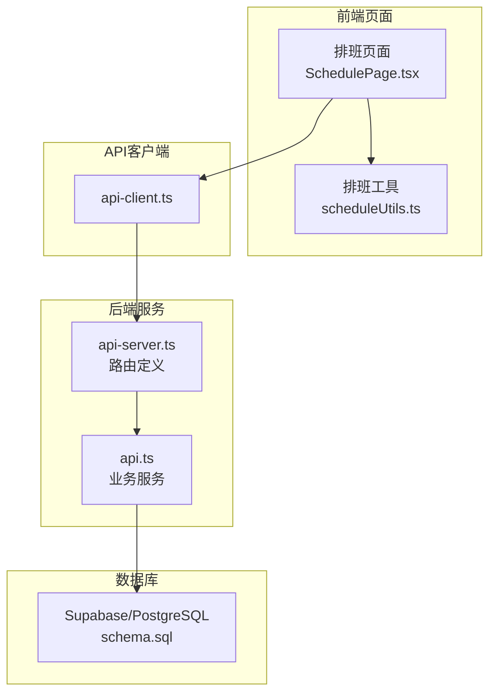
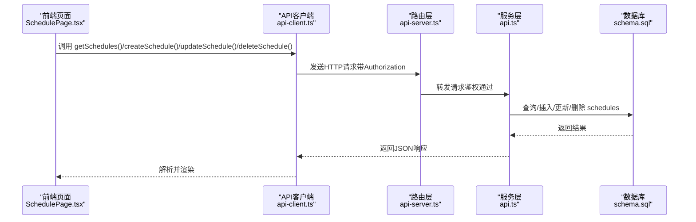
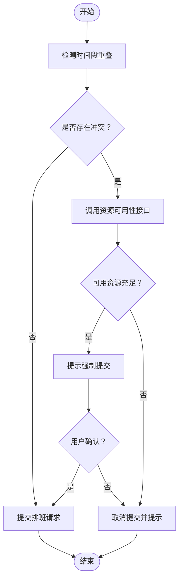
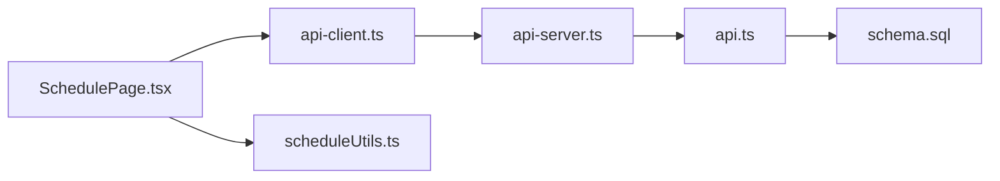

# 排班管理API

<cite>
**本文引用的文件**
- [server/api-server.ts](file://server/api-server.ts)
- [src/services/api.ts](file://src/services/api.ts)
- [src/services/api-client.ts](file://src/services/api-client.ts)
- [src/types/types.ts](file://src/types/types.ts)
- [src/pages/head-nurse/SchedulePage.tsx](file://src/pages/head-nurse/SchedulePage.tsx)
- [src/utils/scheduleUtils.ts](file://src/utils/scheduleUtils.ts)
- [supabase/migrations/00001_create_bio_appointment_schema.sql](file://supabase/migrations/00001_create_bio_appointment_schema.sql)
</cite>

## 目录
1. [简介](#简介)
2. [项目结构](#项目结构)
3. [核心组件](#核心组件)
4. [架构总览](#架构总览)
5. [详细组件分析](#详细组件分析)
6. [依赖分析](#依赖分析)
7. [性能考虑](#性能考虑)
8. [故障排除指南](#故障排除指南)
9. [结论](#结论)
10. [附录](#附录)

## 简介
本文件面向排班管理API的使用者与维护者，系统化梳理排班的创建、查询、更新与删除接口，以及排班与预约之间的关联关系；重点说明排班状态机（draft、published、locked）的流转逻辑；解释GET /api/resources/availability端点如何用于实时检查房间与护士的可用性，防止资源冲突；结合server/api-server.ts中的路由定义与src/services/api-client.ts中的调用模式，提供完整的请求/响应示例与最佳实践建议。同时给出前端在排班页面中集成这些API的指导。

## 项目结构
排班管理API由三层组成：
- 路由层：server/api-server.ts定义REST路由与中间件（鉴权、CORS、错误处理）。
- 服务层：src/services/api.ts封装数据库访问与业务逻辑（查询、创建、更新、删除、可用性检查）。
- 客户端层：src/services/api-client.ts提供统一的HTTP客户端封装与类型定义，供前端页面调用。

图表来源
- [server/api-server.ts](file://server/api-server.ts#L405-L475)
- [src/services/api.ts](file://src/services/api.ts#L240-L325)
- [src/services/api-client.ts](file://src/services/api-client.ts#L1-L120)
- [src/pages/head-nurse/SchedulePage.tsx](file://src/pages/head-nurse/SchedulePage.tsx#L1-L120)
- [src/utils/scheduleUtils.ts](file://src/utils/scheduleUtils.ts#L1-L112)
- [supabase/migrations/00001_create_bio_appointment_schema.sql](file://supabase/migrations/00001_create_bio_appointment_schema.sql#L150-L190)

章节来源
- [server/api-server.ts](file://server/api-server.ts#L405-L475)
- [src/services/api.ts](file://src/services/api.ts#L240-L325)
- [src/services/api-client.ts](file://src/services/api-client.ts#L1-L120)
- [src/pages/head-nurse/SchedulePage.tsx](file://src/pages/head-nurse/SchedulePage.tsx#L1-L120)
- [src/utils/scheduleUtils.ts](file://src/utils/scheduleUtils.ts#L1-L112)
- [supabase/migrations/00001_create_bio_appointment_schema.sql](file://supabase/migrations/00001_create_bio_appointment_schema.sql#L150-L190)

## 核心组件
- 排班状态机：draft（草稿）→ published（已发布）→ locked（已锁定）。草稿阶段允许修改；发布后进入锁定状态，通常用于最终确认与任务执行。
- 排班与预约关联：每个排班对应唯一一个预约，预约状态在创建排班后由“待排班”变为“已排班”，并在任务执行完成后可能进一步流转。
- 资源可用性：通过GET /api/resources/availability实时检查指定日期与时间段内可用的房间与护士，避免冲突。

章节来源
- [src/types/types.ts](file://src/types/types.ts#L17-L20)
- [src/services/api.ts](file://src/services/api.ts#L309-L325)
- [src/pages/head-nurse/SchedulePage.tsx](file://src/pages/head-nurse/SchedulePage.tsx#L200-L238)
- [supabase/migrations/00001_create_bio_appointment_schema.sql](file://supabase/migrations/00001_create_bio_appointment_schema.sql#L150-L190)

## 架构总览
下图展示排班API的关键交互路径：前端通过api-client发起请求，路由层校验鉴权并转发至服务层，服务层执行数据库查询或写入，并返回结果。

图表来源
- [src/services/api-client.ts](file://src/services/api-client.ts#L227-L321)
- [server/api-server.ts](file://server/api-server.ts#L405-L475)
- [src/services/api.ts](file://src/services/api.ts#L240-L325)
- [supabase/migrations/00001_create_bio_appointment_schema.sql](file://supabase/migrations/00001_create_bio_appointment_schema.sql#L150-L190)

## 详细组件分析

### 排班查询接口：GET /api/schedules
- 功能：按条件筛选排班列表，支持按scheduled_date、room_id、nurse_id、status等过滤。
- 请求参数（查询字符串）：
  - scheduled_date：精确日期
  - scheduled_date_from / scheduled_date_to：日期区间
  - room_id：房间ID
  - nurse_id：护士ID
  - status：排班状态（draft/published/locked）
- 响应：排班数组，包含预约、房间、护士等关联信息。
- 示例（请求）：
  - GET /api/schedules?date=2025-06-01&room_id=roomId
- 示例（响应）：
  - 包含字段：id、appointment_id、scheduled_date、scheduled_time_start、scheduled_time_end、room_id、nurse_id、status、created_at、updated_at，以及appointment、room、nurse的关联字段。

章节来源
- [server/api-server.ts](file://server/api-server.ts#L405-L418)
- [src/services/api.ts](file://src/services/api.ts#L240-L303)
- [src/services/api-client.ts](file://src/services/api-client.ts#L227-L241)

### 排班创建接口：POST /api/schedules
- 功能：创建新的排班，初始状态为draft。
- 请求体字段：
  - appointment_id：必须，关联预约
  - scheduled_date：必须，格式YYYY-MM-DD
  - scheduled_time_start / scheduled_time_end：必须，时间格式HH:mm:ss
  - room_id / nurse_id：可选，资源ID
  - adjusted_duration / adjustment_reason：可选，时长调整与原因
- 响应：新建排班对象（状态为draft）。
- 业务校验：
  - 时间段重叠检查：在同一日期与时间段内，同一房间或同一护士不能重复占用（状态非draft时才视为冲突）。
  - 前端建议：在提交前调用GET /api/resources/availability进行预检，或使用前端工具检测冲突。
- 示例（请求）：
  - POST /api/schedules
  - Body: { appointment_id, scheduled_date, scheduled_time_start, scheduled_time_end, room_id, nurse_id }
- 示例（响应）：
  - 返回新建排班对象，状态为draft。

章节来源
- [server/api-server.ts](file://server/api-server.ts#L405-L418)
- [src/services/api.ts](file://src/services/api.ts#L309-L315)
- [src/services/api-client.ts](file://src/services/api-client.ts#L294-L321)
- [src/utils/scheduleUtils.ts](file://src/utils/scheduleUtils.ts#L1-L112)

### 排班更新接口：PUT /api/schedules/:id
- 功能：更新排班信息，支持修改时间、资源、调整时长与原因；可更新状态（例如从draft改为published）。
- 路径参数：
  - id：排班ID
- 请求体字段（部分可选）：
  - scheduled_date / scheduled_time_start / scheduled_time_end
  - room_id / nurse_id
  - adjusted_duration / adjustment_reason
  - status：可设为published或locked（具体取决于业务规则）
- 响应：更新后的排班对象。
- 示例（请求）：
  - PUT /api/schedules/{id}
  - Body: { status: "published" }
- 示例（响应）：
  - 返回更新后的排班对象。

章节来源
- [server/api-server.ts](file://server/api-server.ts#L405-L418)
- [src/services/api.ts](file://src/services/api.ts#L317-L321)
- [src/services/api-client.ts](file://src/services/api-client.ts#L309-L319)

### 排班删除接口：DELETE /api/schedules/:id
- 功能：删除排班（软删除或物理删除，取决于后端实现）。
- 路径参数：
  - id：排班ID
- 响应：无内容或布尔成功标志。
- 示例（请求）：
  - DELETE /api/schedules/{id}

章节来源
- [server/api-server.ts](file://server/api-server.ts#L405-L418)
- [src/services/api.ts](file://src/services/api.ts#L322-L325)
- [src/services/api-client.ts](file://src/services/api-client.ts#L316-L320)

### 资源可用性接口：GET /api/resources/availability
- 功能：根据指定日期与时间段，返回可用的房间与护士列表，避免与已发布/锁定的排班冲突。
- 请求参数（查询字符串）：
  - date：YYYY-MM-DD
  - time_start：HH:mm:ss
  - time_end：HH:mm:ss
- 响应：
  - available_rooms：可用房间数组（包含id、name、category）
  - available_nurses：可用护士数组（包含id、name、full_name）
- 使用场景：
  - 创建/更新排班前的预检
  - 前端在排班页面中动态提示可用资源
- 示例（请求）：
  - GET /api/resources/availability?date=2025-06-01&time_start=09:00:00&time_end=10:30:00
- 示例（响应）：
  - { available_rooms: [...], available_nurses: [...] }

章节来源
- [server/api-server.ts](file://server/api-server.ts#L450-L475)
- [src/services/api.ts](file://src/services/api.ts#L400-L452)
- [src/services/api-client.ts](file://src/services/api-client.ts#L287-L291)

### 排班状态机与流转
- 状态定义：draft（草稿）、published（已发布）、locked（已锁定）
- 流转逻辑（建议）：
  - draft → published：排班创建或编辑完成后，确认发布
  - published → locked：排班最终确认，进入锁定状态，禁止再次修改
- 实现要点：
  - 更新排班状态时需进行权限校验与业务约束（如不允许跨状态逆向修改）
  - 锁定后应阻止后续冲突修改

章节来源
- [src/types/types.ts](file://src/types/types.ts#L17-L20)
- [src/services/api.ts](file://src/services/api.ts#L309-L321)
- [src/pages/head-nurse/SchedulePage.tsx](file://src/pages/head-nurse/SchedulePage.tsx#L200-L238)

### 排班与预约的关联关系
- 关联方式：schedules.appointment_id → appointments.id（一对一）
- 生命周期：
  - 预约创建后状态为“待排班”
  - 创建排班后，预约状态更新为“已排班”
  - 任务执行完成后，预约可能进一步流转为“已完成”等
- 前端行为：
  - 创建排班时自动更新预约状态
  - 编辑排班时可更新时间与资源

章节来源
- [supabase/migrations/00001_create_bio_appointment_schema.sql](file://supabase/migrations/00001_create_bio_appointment_schema.sql#L150-L190)
- [src/services/api.ts](file://src/services/api.ts#L240-L303)
- [src/pages/head-nurse/SchedulePage.tsx](file://src/pages/head-nurse/SchedulePage.tsx#L200-L238)

### 时间段重叠与资源冲突校验
- 前端冲突检测：
  - 使用工具函数检测时间段重叠
  - 对比现有排班，排除当前编辑的排班ID
- 后端可用性检查：
  - 通过GET /api/resources/availability返回可用资源集合
  - 仅考虑状态为published/locked的排班作为冲突依据
- 建议流程：
  - 提交前先调用GET /api/resources/availability进行预检
  - 若存在冲突，提示用户并允许强制提交（由业务决定）

图表来源
- [src/utils/scheduleUtils.ts](file://src/utils/scheduleUtils.ts#L1-L112)
- [src/services/api.ts](file://src/services/api.ts#L400-L452)
- [src/services/api-client.ts](file://src/services/api-client.ts#L287-L291)

## 依赖分析
- 路由依赖：server/api-server.ts依赖src/services/api.ts提供的业务方法。
- 服务依赖：src/services/api.ts依赖数据库连接与SQL查询。
- 前端依赖：src/services/api-client.ts依赖server/api-server.ts暴露的REST端点。
- 类型依赖：src/types/types.ts定义排班、预约、资源等类型，前后端共享。

图表来源
- [src/services/api-client.ts](file://src/services/api-client.ts#L1-L120)
- [server/api-server.ts](file://server/api-server.ts#L405-L475)
- [src/services/api.ts](file://src/services/api.ts#L240-L325)
- [supabase/migrations/00001_create_bio_appointment_schema.sql](file://supabase/migrations/00001_create_bio_appointment_schema.sql#L150-L190)
- [src/pages/head-nurse/SchedulePage.tsx](file://src/pages/head-nurse/SchedulePage.tsx#L1-L120)
- [src/utils/scheduleUtils.ts](file://src/utils/scheduleUtils.ts#L1-L112)

章节来源
- [src/services/api-client.ts](file://src/services/api-client.ts#L1-L120)
- [server/api-server.ts](file://server/api-server.ts#L405-L475)
- [src/services/api.ts](file://src/services/api.ts#L240-L325)
- [supabase/migrations/00001_create_bio_appointment_schema.sql](file://supabase/migrations/00001_create_bio_appointment_schema.sql#L150-L190)
- [src/pages/head-nurse/SchedulePage.tsx](file://src/pages/head-nurse/SchedulePage.tsx#L1-L120)
- [src/utils/scheduleUtils.ts](file://src/utils/scheduleUtils.ts#L1-L112)

## 性能考虑
- 查询优化：
  - schedules表对scheduled_date与scheduled_time_start建立索引，有利于按日期与时间排序查询。
  - 在高频查询场景下，建议限制返回字段与分页（若数据量大）。
- 并发控制：
  - 资源冲突检测建议在提交前进行，减少数据库层面的冲突回滚。
- 前端缓存：
  - 对于静态资源（如可用房间/护士列表）可在前端做短期缓存，降低请求频率。

章节来源
- [supabase/migrations/00001_create_bio_appointment_schema.sql](file://supabase/migrations/00001_create_bio_appointment_schema.sql#L192-L197)

## 故障排除指南
- 鉴权失败：
  - 确认请求头包含有效的Authorization: Bearer <token>。
  - 检查本地存储的令牌是否过期或缺失。
- 参数缺失：
  - 创建/更新排班时缺少必要字段（如scheduled_date、scheduled_time_start、scheduled_time_end）会导致错误。
- 冲突错误：
  - 若提交的时间段与已发布的排班冲突，需先释放资源或调整时间段。
- 数据库异常：
  - 查看服务端错误中间件返回的错误信息，定位具体SQL或业务逻辑问题。

章节来源
- [src/services/api-client.ts](file://src/services/api-client.ts#L27-L42)
- [server/api-server.ts](file://server/api-server.ts#L28-L36)

## 结论
排班管理API围绕“排班状态机”与“资源可用性检查”两大核心能力构建，既满足业务上的草稿→发布→锁定流程，也通过实时可用性接口有效避免资源冲突。结合前端页面的冲突检测与用户提示，可显著提升排班效率与准确性。建议在生产环境中强化状态变更的权限控制与审计日志，并持续优化查询与并发处理策略。

## 附录

### API清单与示例

- GET /api/schedules
  - 查询参数：date、start_date、end_date、nurse_id、room_id、status
  - 示例：GET /api/schedules?date=2025-06-01&room_id=roomId
  - 响应：排班数组（包含预约、房间、护士信息）

- POST /api/schedules
  - 请求体：appointment_id、scheduled_date、scheduled_time_start、scheduled_time_end、room_id、nurse_id、adjusted_duration、adjustment_reason
  - 示例：POST /api/schedules
  - 响应：新建排班对象（状态为draft）

- PUT /api/schedules/:id
  - 请求体：scheduled_date、scheduled_time_start、scheduled_time_end、room_id、nurse_id、adjusted_duration、adjustment_reason、status
  - 示例：PUT /api/schedules/{id}
  - 响应：更新后的排班对象

- DELETE /api/schedules/:id
  - 示例：DELETE /api/schedules/{id}
  - 响应：无内容或布尔成功标志

- GET /api/resources/availability
  - 查询参数：date、time_start、time_end
  - 示例：GET /api/resources/availability?date=2025-06-01&time_start=09:00:00&time_end=10:30:00
  - 响应：{ available_rooms: [...], available_nurses: [...] }

章节来源
- [server/api-server.ts](file://server/api-server.ts#L405-L475)
- [src/services/api.ts](file://src/services/api.ts#L240-L325)
- [src/services/api-client.ts](file://src/services/api-client.ts#L227-L321)

### 前端集成建议
- 在排班页面中：
  - 使用api-client的getSchedules/getResourceAvailability进行数据拉取
  - 使用scheduleUtils的冲突检测函数在提交前进行本地预检
  - 提交时根据业务需要将状态从draft切换为published或locked
- 错误处理：
  - 对HTTP错误与业务错误分别处理，向用户反馈明确信息

章节来源
- [src/pages/head-nurse/SchedulePage.tsx](file://src/pages/head-nurse/SchedulePage.tsx#L1-L120)
- [src/utils/scheduleUtils.ts](file://src/utils/scheduleUtils.ts#L1-L112)
- [src/services/api-client.ts](file://src/services/api-client.ts#L227-L321)