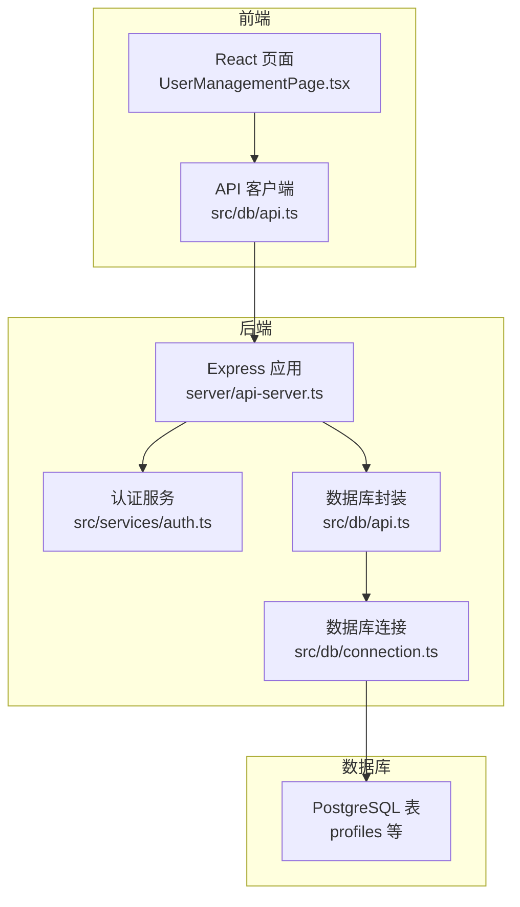
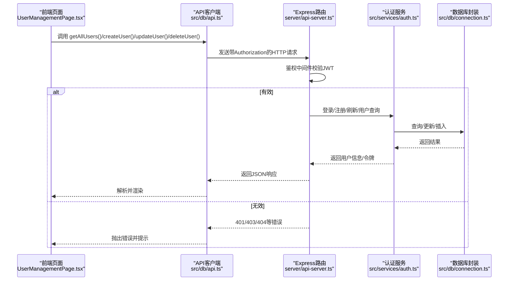
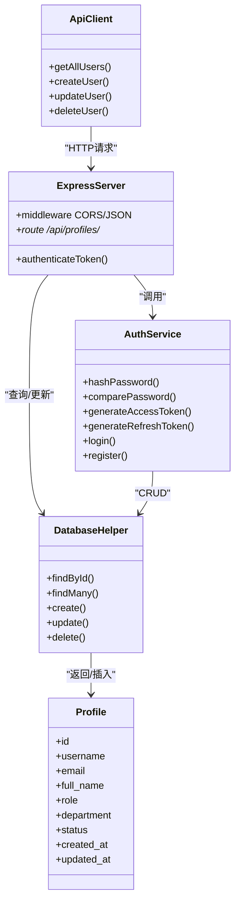

# 用户管理API

<cite>
**本文档引用的文件**
- [server/api-server.ts](file://server/api-server.ts)
- [src/services/auth.ts](file://src/services/auth.ts)
- [src/db/api.ts](file://src/db/api.ts)
- [src/db/connection.ts](file://src/db/connection.ts)
- [src/types/types.ts](file://src/types/types.ts)
- [src/pages/admin/UserManagementPage.tsx](file://src/pages/admin/UserManagementPage.tsx)
- [database/init/02-create-tables.sql](file://database/init/02-create-tables.sql)
- [supabase/migrations/00004_create_user_profiles_and_auth.sql](file://supabase/migrations/00004_create_user_profiles_and_auth.sql)
- [supabase/migrations/00007_update_profiles_structure_and_auth.sql](file://supabase/migrations/00007_update_profiles_structure_and_auth.sql)
</cite>

## 目录
1. [简介](#简介)
2. [项目结构](#项目结构)
3. [核心组件](#核心组件)
4. [架构总览](#架构总览)
5. [详细组件分析](#详细组件分析)
6. [依赖关系分析](#依赖关系分析)
7. [性能考虑](#性能考虑)
8. [故障排除指南](#故障排除指南)
9. [结论](#结论)
10. [附录](#附录)

## 简介
本文件面向前端与后端开发者，系统化梳理“用户管理”相关的RESTful API，覆盖以下端点：
- GET /api/profiles
- POST /api/profiles
- PUT /api/profiles/:id
- DELETE /api/profiles/:id

同时，结合后端服务层与数据库层实现，说明：
- JWT认证机制与请求头规范
- 请求体与响应体的JSON Schema
- 业务逻辑（如默认状态、密码哈希、软删除）
- 错误处理（401未授权、403禁止访问、404用户不存在等）
- 前端在用户列表页与用户管理页的集成最佳实践

## 项目结构
后端采用Express服务，路由位于server/api-server.ts；认证与业务逻辑分别由src/services/auth.ts与src/services/api.ts提供；数据库访问通过src/db/connection.ts与src/db/api.ts封装。

图表来源
- [server/api-server.ts](file://server/api-server.ts#L1-L120)
- [src/services/auth.ts](file://src/services/auth.ts#L1-L120)
- [src/db/api.ts](file://src/db/api.ts#L190-L342)
- [src/db/connection.ts](file://src/db/connection.ts#L1-L120)
- [database/init/02-create-tables.sql](file://database/init/02-create-tables.sql#L1-L40)

章节来源
- [server/api-server.ts](file://server/api-server.ts#L1-L120)
- [src/db/api.ts](file://src/db/api.ts#L190-L342)

## 核心组件
- Express路由与中间件：负责CORS、JSON解析、统一错误处理、JWT鉴权中间件与受保护路由挂载。
- 认证服务AuthService：负责密码哈希、令牌签发与校验、用户查询与权限判断。
- 数据库连接与封装：提供连接池、事务、查询工具与通用CRUD助手类。
- 类型定义：统一前后端数据契约，确保请求/响应字段一致。

章节来源
- [server/api-server.ts](file://server/api-server.ts#L1-L120)
- [src/services/auth.ts](file://src/services/auth.ts#L1-L120)
- [src/db/connection.ts](file://src/db/connection.ts#L1-L120)
- [src/types/types.ts](file://src/types/types.ts#L20-L120)

## 架构总览
用户管理API的调用链路如下：
- 前端通过src/db/api.ts封装的fetch调用后端接口
- Express中间件校验Authorization头中的JWT
- 业务逻辑由ApiService或AuthService处理
- 数据库通过DatabaseHelper或原生SQL完成读写

图表来源
- [server/api-server.ts](file://server/api-server.ts#L118-L151)
- [src/services/auth.ts](file://src/services/auth.ts#L148-L205)
- [src/db/api.ts](file://src/db/api.ts#L190-L342)
- [src/db/connection.ts](file://src/db/connection.ts#L167-L321)

## 详细组件分析

### JWT认证与请求头规范
- Authorization头格式：Bearer <access_token>
- 中间件逻辑：校验Authorization头是否存在、以Bearer开头、解码并验证令牌有效性，随后注入req.user供后续路由使用
- 令牌内容：包含用户ID、邮箱、角色等，过期时间与密钥由环境变量控制

章节来源
- [server/api-server.ts](file://server/api-server.ts#L118-L151)
- [src/services/auth.ts](file://src/services/auth.ts#L17-L40)

### GET /api/profiles（获取用户列表）
- 方法与路径：GET /api/profiles
- 认证：需要JWT
- 查询参数：支持按role/status/department过滤（由服务层实现）
- 响应：数组，元素为用户对象（不含password_hash）

JSON Schema（响应）
- 数组项字段：id, username, email, full_name, role, department, status, created_at, updated_at

业务逻辑
- 默认移除password_hash字段
- 支持按条件筛选与排序

章节来源
- [server/api-server.ts](file://server/api-server.ts#L153-L165)
- [src/services/api.ts](file://src/services/api.ts#L28-L42)
- [src/db/api.ts](file://src/db/api.ts#L382-L402)

### POST /api/profiles（创建用户）
- 方法与路径：POST /api/profiles
- 认证：需要JWT
- 请求体（JSON）：username, password, full_name, role, department（可选）
- 响应：创建后的用户对象（不含password_hash）

业务逻辑
- 密码使用bcrypt哈希存储
- 默认状态为active
- 返回对象移除password_hash

章节来源
- [server/api-server.ts](file://server/api-server.ts#L153-L165)
- [src/services/auth.ts](file://src/services/auth.ts#L118-L143)
- [src/services/api.ts](file://src/services/api.ts#L44-L60)
- [src/db/api.ts](file://src/db/api.ts#L273-L310)

### PUT /api/profiles/:id（更新用户）
- 方法与路径：PUT /api/profiles/:id
- 认证：需要JWT
- 路径参数：id
- 请求体（JSON）：允许字段包括full_name, role, department, status（注意：不允许直接修改password_hash、created_at、updated_at）
- 响应：更新后的用户对象（不含password_hash）

业务逻辑
- 服务层对传入数据进行白名单裁剪，避免敏感字段被修改
- 返回对象移除password_hash

章节来源
- [server/api-server.ts](file://server/api-server.ts#L153-L165)
- [src/services/api.ts](file://src/services/api.ts#L62-L75)
- [src/db/api.ts](file://src/db/api.ts#L224-L271)

### DELETE /api/profiles/:id（删除用户）
- 方法与路径：DELETE /api/profiles/:id
- 认证：需要JWT
- 路径参数：id
- 响应：布尔值表示是否删除成功

业务逻辑
- 服务层执行删除操作并返回结果
- 注意：仓库中用户管理API的删除实现为软删除（将status置为disabled），但当前Express路由实现为物理删除。建议前后端保持一致策略，若采用软删除，请在服务层与路由中统一调整

章节来源
- [server/api-server.ts](file://server/api-server.ts#L153-L165)
- [src/services/api.ts](file://src/services/api.ts#L72-L75)
- [src/db/api.ts](file://src/db/api.ts#L311-L342)

### 与前端页面的集成要点
- 用户列表页：UserManagementPage.tsx通过getAllUsers()拉取用户列表，渲染表格与状态徽章
- 用户管理页：提供创建、编辑、删除对话框，调用createUser()/updateUser()/deleteUser()
- 错误处理：页面toast提示与错误捕获，建议结合后端返回的message字段进行友好提示

章节来源
- [src/pages/admin/UserManagementPage.tsx](file://src/pages/admin/UserManagementPage.tsx#L1-L200)
- [src/db/api.ts](file://src/db/api.ts#L190-L342)

## 依赖关系分析

图表来源
- [server/api-server.ts](file://server/api-server.ts#L118-L165)
- [src/services/auth.ts](file://src/services/auth.ts#L118-L205)
- [src/db/connection.ts](file://src/db/connection.ts#L167-L321)
- [src/db/api.ts](file://src/db/api.ts#L190-L342)
- [src/types/types.ts](file://src/types/types.ts#L20-L120)

章节来源
- [server/api-server.ts](file://server/api-server.ts#L118-L165)
- [src/services/auth.ts](file://src/services/auth.ts#L118-L205)
- [src/db/connection.ts](file://src/db/connection.ts#L167-L321)
- [src/db/api.ts](file://src/db/api.ts#L190-L342)
- [src/types/types.ts](file://src/types/types.ts#L20-L120)

## 性能考虑
- 数据库连接池：通过Pool管理并发连接，减少频繁建立/断开连接的开销
- 查询优化：profiles表具备username、role、status等索引，有利于筛选与排序
- 分页与限制：服务层提供limit/offset能力，建议在前端分页时配合服务端限制
- 缓存：Redis连接初始化可选，若启用可缓存热点数据（如用户列表）

章节来源
- [src/db/connection.ts](file://src/db/connection.ts#L1-L120)
- [database/init/02-create-tables.sql](file://database/init/02-create-tables.sql#L180-L231)

## 故障排除指南
常见错误与处理
- 401 未授权
  - 原因：缺少Authorization头、令牌缺失或格式不正确、令牌无效或过期
  - 处理：重新登录获取令牌，或刷新令牌
- 403 禁止访问
  - 原因：当前用户无权限访问目标资源（例如仅超级管理员可配置）
  - 处理：确认当前用户角色与权限
- 404 用户不存在
  - 原因：查询的用户ID不存在
  - 处理：检查ID或重新加载数据
- 500 内部错误
  - 原因：数据库异常、查询超时、服务异常
  - 处理：查看后端日志，重试或联系管理员

章节来源
- [server/api-server.ts](file://server/api-server.ts#L118-L165)
- [src/services/auth.ts](file://src/services/auth.ts#L148-L205)
- [src/db/api.ts](file://src/db/api.ts#L190-L342)

## 结论
- 用户管理API遵循JWT认证与受保护路由设计，请求头必须携带Bearer令牌
- 服务层对敏感字段进行了白名单裁剪，确保安全
- 建议前后端统一“删除策略”，当前仓库存在软删除与物理删除的差异，应统一为软删除（禁用账户而非物理删除）
- 前端页面已完整集成用户列表与管理功能，建议在生产环境增加更完善的错误提示与重试机制

## 附录

### 数据模型与数据库结构
- profiles表字段概览：id, username, email, full_name, role, department, status, password_hash, created_at, updated_at
- 角色与状态枚举：role包含super_admin、sales、head_nurse、nurse、doctor；status包含active、disabled
- 索引：username、role、status等字段具备索引，提升查询性能

章节来源
- [database/init/02-create-tables.sql](file://database/init/02-create-tables.sql#L1-L40)
- [supabase/migrations/00004_create_user_profiles_and_auth.sql](file://supabase/migrations/00004_create_user_profiles_and_auth.sql#L50-L120)
- [supabase/migrations/00007_update_profiles_structure_and_auth.sql](file://supabase/migrations/00007_update_profiles_structure_and_auth.sql#L25-L84)

### 前端集成最佳实践
- 在用户列表页：使用getAllUsers()拉取数据，结合分页与搜索参数
- 在用户管理页：创建/编辑/删除均通过createUser()/updateUser()/deleteUser()调用，注意错误提示与重试
- 令牌管理：统一从localStorage读取access_token，确保Authorization头正确拼接
- 安全：不要在前端存储明文密码；密码变更通过后端接口完成

章节来源
- [src/pages/admin/UserManagementPage.tsx](file://src/pages/admin/UserManagementPage.tsx#L1-L200)
- [src/db/api.ts](file://src/db/api.ts#L190-L342)