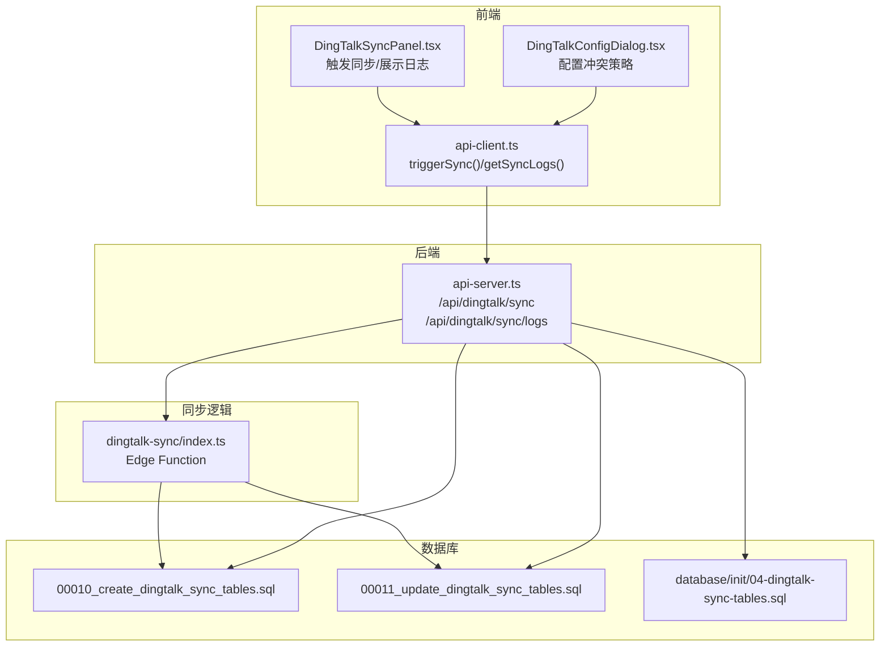
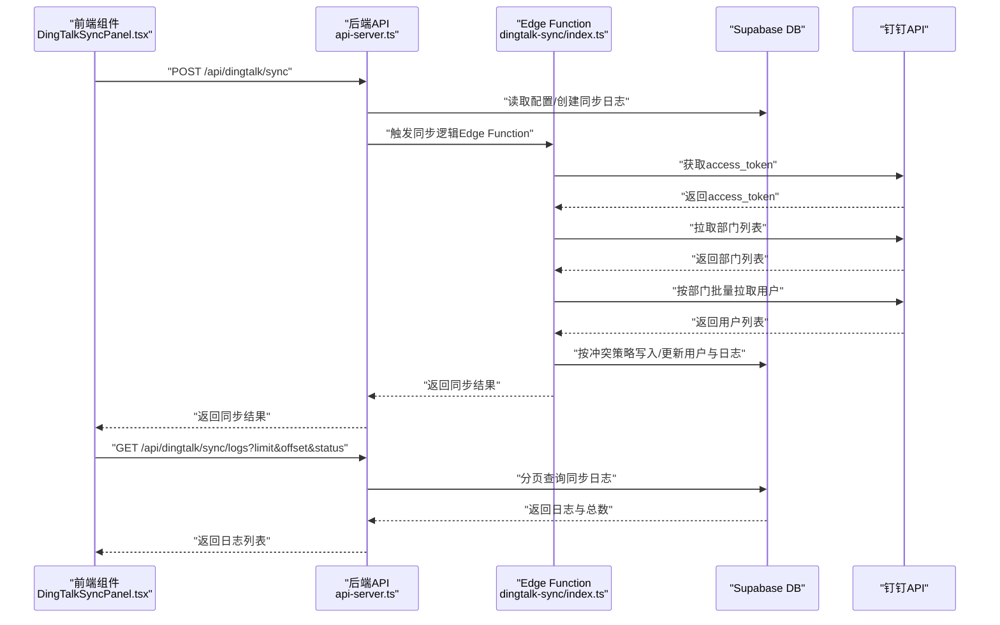
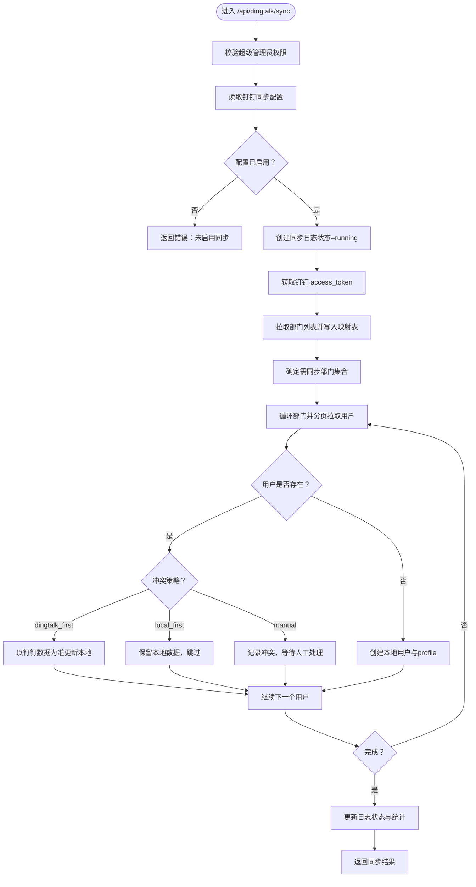
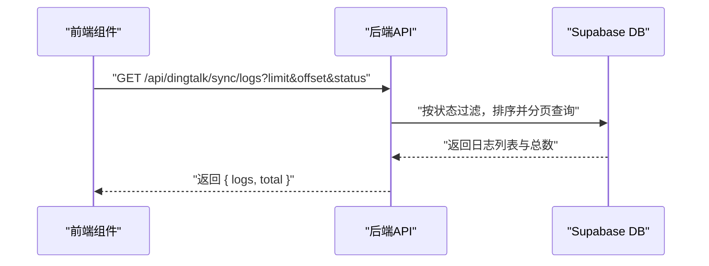
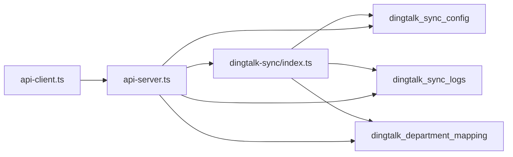

# 钉钉同步API

<cite>
**本文引用的文件**
- [supabase/functions/dingtalk-sync/index.ts](file://supabase/functions/dingtalk-sync/index.ts)
- [server/api-server.ts](file://server/api-server.ts)
- [src/services/api-client.ts](file://src/services/api-client.ts)
- [src/db/api.ts](file://src/db/api.ts)
- [src/components/dingtalk/DingTalkSyncPanel.tsx](file://src/components/dingtalk/DingTalkSyncPanel.tsx)
- [src/components/dingtalk/DingTalkConfigDialog.tsx](file://src/components/dingtalk/DingTalkConfigDialog.tsx)
- [supabase/migrations/00010_create_dingtalk_sync_tables.sql](file://supabase/migrations/00010_create_dingtalk_sync_tables.sql)
- [supabase/migrations/00011_update_dingtalk_sync_tables.sql](file://supabase/migrations/00011_update_dingtalk_sync_tables.sql)
- [database/init/04-dingtalk-sync-tables.sql](file://database/init/04-dingtalk-sync-tables.sql)
- [DINGTALK_CONFIG_COMPLETE.md](file://DINGTALK_CONFIG_COMPLETE.md)
</cite>

## 目录
1. [简介](#简介)
2. [项目结构](#项目结构)
3. [核心组件](#核心组件)
4. [架构总览](#架构总览)
5. [详细组件分析](#详细组件分析)
6. [依赖关系分析](#依赖关系分析)
7. [性能考虑](#性能考虑)
8. [故障排查指南](#故障排查指南)
9. [结论](#结论)
10. [附录](#附录)

## 简介
本文档面向“钉钉同步API”的使用者与维护者，聚焦于以下目标：
- 解释 POST /api/dingtalk/sync 触发同步的实现机制，涵盖 sync_type（manual/auto/incremental）、conflict_strategy（dingtalk_first/local_first/manual）等参数的业务含义与处理逻辑。
- 说明 GET /api/dingtalk/sync/logs 分页查询日志的请求参数（limit、offset、status）与响应结构。
- 结合 src/services/api-client.ts 中的 triggerSync 与 getSyncLogs 方法，给出前端调用示例。
- 关联 supabase/functions/dingtalk-sync/index.ts 中的同步逻辑实现，解释后端同步流程。
- 提供同步冲突解决策略的配置指南与性能优化建议，并引用 DINGTALK_CONFIG_COMPLETE.md 中的数据库表结构说明。

## 项目结构
围绕钉钉同步API的关键文件分布如下：
- 前端调用层：src/services/api-client.ts（封装 /api/dingtalk/sync 与 /api/dingtalk/sync/logs 的调用）
- 前端展示层：src/components/dingtalk/DingTalkSyncPanel.tsx、DingTalkConfigDialog.tsx（触发同步、展示日志、配置冲突策略）
- 后端API：server/api-server.ts（提供 /api/dingtalk/sync 与 /api/dingtalk/sync/logs 的路由实现）
- 同步逻辑（Edge Function）：supabase/functions/dingtalk-sync/index.ts（实现钉钉访问令牌获取、部门与用户拉取、冲突策略处理、日志记录与状态更新）
- 数据库表结构：supabase/migrations/00010_create_dingtalk_sync_tables.sql、00011_update_dingtalk_sync_tables.sql、database/init/04-dingtalk-sync-tables.sql
- 配置说明：DINGTALK_CONFIG_COMPLETE.md

图表来源
- [src/services/api-client.ts](file://src/services/api-client.ts#L354-L381)
- [src/components/dingtalk/DingTalkSyncPanel.tsx](file://src/components/dingtalk/DingTalkSyncPanel.tsx#L66-L103)
- [src/components/dingtalk/DingTalkConfigDialog.tsx](file://src/components/dingtalk/DingTalkConfigDialog.tsx#L257-L281)
- [server/api-server.ts](file://server/api-server.ts#L581-L780)
- [supabase/functions/dingtalk-sync/index.ts](file://supabase/functions/dingtalk-sync/index.ts#L53-L384)
- [supabase/migrations/00010_create_dingtalk_sync_tables.sql](file://supabase/migrations/00010_create_dingtalk_sync_tables.sql#L1-L99)
- [supabase/migrations/00011_update_dingtalk_sync_tables.sql](file://supabase/migrations/00011_update_dingtalk_sync_tables.sql#L1-L35)
- [database/init/04-dingtalk-sync-tables.sql](file://database/init/04-dingtalk-sync-tables.sql#L1-L44)

章节来源
- [src/services/api-client.ts](file://src/services/api-client.ts#L354-L381)
- [server/api-server.ts](file://server/api-server.ts#L581-L780)
- [supabase/functions/dingtalk-sync/index.ts](file://supabase/functions/dingtalk-sync/index.ts#L53-L384)
- [supabase/migrations/00010_create_dingtalk_sync_tables.sql](file://supabase/migrations/00010_create_dingtalk_sync_tables.sql#L1-L99)
- [supabase/migrations/00011_update_dingtalk_sync_tables.sql](file://supabase/migrations/00011_update_dingtalk_sync_tables.sql#L1-L35)
- [database/init/04-dingtalk-sync-tables.sql](file://database/init/04-dingtalk-sync-tables.sql#L1-L44)

## 核心组件
- 同步触发接口：POST /api/dingtalk/sync
  - 参数：sync_type、selected_departments、conflict_strategy
  - 行为：校验权限与配置，创建同步日志，拉取钉钉部门与用户，按冲突策略处理，更新日志状态与统计
- 同步日志查询接口：GET /api/dingtalk/sync/logs
  - 参数：limit、offset、status
  - 行为：分页返回同步日志，包含总数统计
- 前端调用封装：src/services/api-client.ts
  - triggerSync(params)：封装 POST /api/dingtalk/sync
  - getSyncLogs(params)：封装 GET /api/dingtalk/sync/logs
- 前端展示组件：DingTalkSyncPanel.tsx、DingTalkConfigDialog.tsx
  - 触发同步、展示日志、配置冲突策略
- 同步逻辑实现：supabase/functions/dingtalk-sync/index.ts
  - Edge Function 实现同步全流程（令牌获取、部门/用户拉取、冲突策略、日志与统计）

章节来源
- [src/services/api-client.ts](file://src/services/api-client.ts#L354-L381)
- [server/api-server.ts](file://server/api-server.ts#L581-L780)
- [server/api-server.ts](file://server/api-server.ts#L862-L903)
- [supabase/functions/dingtalk-sync/index.ts](file://supabase/functions/dingtalk-sync/index.ts#L53-L384)
- [src/components/dingtalk/DingTalkSyncPanel.tsx](file://src/components/dingtalk/DingTalkSyncPanel.tsx#L66-L103)
- [src/components/dingtalk/DingTalkConfigDialog.tsx](file://src/components/dingtalk/DingTalkConfigDialog.tsx#L257-L281)

## 架构总览
下图展示了从前端到后端再到Edge Function与数据库的整体调用链路与数据流。

图表来源
- [server/api-server.ts](file://server/api-server.ts#L581-L780)
- [supabase/functions/dingtalk-sync/index.ts](file://supabase/functions/dingtalk-sync/index.ts#L126-L336)
- [server/api-server.ts](file://server/api-server.ts#L862-L903)

## 详细组件分析

### POST /api/dingtalk/sync 同步触发
- 请求路径：POST /api/dingtalk/sync
- 权限要求：仅超级管理员可触发
- 请求体参数
  - sync_type：'manual' | 'auto' | 'incremental'
  - selected_departments：字符串数组（可选），指定需同步的部门ID集合；为空则默认同步全部
  - conflict_strategy：'dingtalk_first' | 'local_first' | 'manual'（可选），优先使用配置中的策略
- 处理流程
  - 校验用户身份与角色
  - 读取钉钉同步配置，校验是否启用
  - 创建同步日志（状态为 running）
  - 获取钉钉 access_token
  - 拉取部门列表并写入部门映射表
  - 计算需同步的部门集合（若未指定则全量）
  - 分页拉取用户，逐条处理：
    - 若用户已存在：按冲突策略决定更新或跳过
    - 若用户不存在：创建本地用户与 profile
  - 更新同步日志状态与统计（success/partial/failed），记录失败详情
  - 更新配置的 last_sync_at
- 响应
  - 包含同步日志ID、最终状态、总用户数、成功/失败/跳过数量、失败详情等

图表来源
- [server/api-server.ts](file://server/api-server.ts#L581-L780)
- [supabase/functions/dingtalk-sync/index.ts](file://supabase/functions/dingtalk-sync/index.ts#L126-L336)

章节来源
- [server/api-server.ts](file://server/api-server.ts#L581-L780)
- [supabase/functions/dingtalk-sync/index.ts](file://supabase/functions/dingtalk-sync/index.ts#L91-L125)
- [supabase/functions/dingtalk-sync/index.ts](file://supabase/functions/dingtalk-sync/index.ts#L126-L336)

### GET /api/dingtalk/sync/logs 分页查询
- 请求路径：GET /api/dingtalk/sync/logs
- 查询参数
  - limit：每页条数，默认20
  - offset：偏移量，默认0
  - status：过滤状态，可选值：pending、running、success、failed、partial
- 响应结构
  - logs：日志数组，包含同步类型、状态、开始/结束时间、统计信息、创建人等
  - total：满足条件的日志总数

图表来源
- [server/api-server.ts](file://server/api-server.ts#L862-L903)

章节来源
- [server/api-server.ts](file://server/api-server.ts#L862-L903)

### 前端调用示例
- 触发同步
  - 使用 api-client.ts 的 triggerSync(params)
  - 示例参数：sync_type='manual'，selected_departments=配置中选择的部门列表，conflict_strategy=配置中的策略
- 查询日志
  - 使用 api-client.ts 的 getSyncLogs({ limit, offset, status })
  - 常用场景：分页加载最近日志，按状态筛选

章节来源
- [src/services/api-client.ts](file://src/services/api-client.ts#L354-L381)
- [src/components/dingtalk/DingTalkSyncPanel.tsx](file://src/components/dingtalk/DingTalkSyncPanel.tsx#L66-L103)

### 冲突解决策略与业务含义
- dingtalk_first：以钉钉数据为准，更新本地用户信息（如姓名、部门等）
- local_first：保留本地数据，跳过更新
- manual：记录冲突，等待人工处理（跳过更新）
- 策略来源优先级：请求体参数 > 配置表中的默认策略

章节来源
- [supabase/functions/dingtalk-sync/index.ts](file://supabase/functions/dingtalk-sync/index.ts#L227-L250)
- [server/api-server.ts](file://server/api-server.ts#L734-L755)
- [src/components/dingtalk/DingTalkConfigDialog.tsx](file://src/components/dingtalk/DingTalkConfigDialog.tsx#L257-L281)

### 数据库表结构与枚举
- dingtalk_sync_config：存储钉钉应用配置、同步开关、默认冲突策略、选择的部门、最后同步时间等
- dingtalk_sync_logs：存储每次同步的元数据、统计与错误信息
- dingtalk_department_mapping：存储钉钉部门与本地映射关系
- 枚举类型：sync_status、sync_type、conflict_strategy

章节来源
- [supabase/migrations/00010_create_dingtalk_sync_tables.sql](file://supabase/migrations/00010_create_dingtalk_sync_tables.sql#L1-L99)
- [supabase/migrations/00011_update_dingtalk_sync_tables.sql](file://supabase/migrations/00011_update_dingtalk_sync_tables.sql#L1-L35)
- [database/init/04-dingtalk-sync-tables.sql](file://database/init/04-dingtalk-sync-tables.sql#L1-L44)

## 依赖关系分析
- 前端依赖后端API，后端通过 Edge Function 调用钉钉API并写入数据库
- 同步日志表与配置表为同步流程的核心数据载体
- 冲突策略由配置表默认值与请求体参数共同决定

图表来源
- [src/services/api-client.ts](file://src/services/api-client.ts#L354-L381)
- [server/api-server.ts](file://server/api-server.ts#L581-L780)
- [supabase/functions/dingtalk-sync/index.ts](file://supabase/functions/dingtalk-sync/index.ts#L91-L125)
- [supabase/migrations/00010_create_dingtalk_sync_tables.sql](file://supabase/migrations/00010_create_dingtalk_sync_tables.sql#L1-L99)

章节来源
- [src/services/api-client.ts](file://src/services/api-client.ts#L354-L381)
- [server/api-server.ts](file://server/api-server.ts#L581-L780)
- [supabase/functions/dingtalk-sync/index.ts](file://supabase/functions/dingtalk-sync/index.ts#L91-L125)

## 性能考虑
- 分页与批量处理
  - 用户分页拉取采用游标分页，避免一次性请求过大
  - 部门与用户的批量写入使用 upsert/ON CONFLICT，减少重复插入
- 并发与速率限制
  - 钉钉API存在频率限制，建议在 Edge Function 中增加必要的退避与重试策略（当前实现未显式体现，建议补充）
- 数据库写入
  - 使用 upsert/ON CONFLICT 减少主键冲突带来的写入成本
  - 对常用查询字段建立索引（迁移脚本已包含索引说明）
- 前端体验
  - 分页查询 limit/offset 控制单次返回量，避免阻塞
  - 日志列表按时间倒序展示，便于快速定位最新同步

[本节为通用性能建议，不直接分析具体文件]

## 故障排查指南
- 常见错误与定位
  - 未提供认证信息或认证失败：检查 Authorization 头与令牌有效性
  - 权限不足：仅超级管理员可触发同步
  - 未找到钉钉配置或同步未启用：检查 dingtalk_sync_config
  - 获取 access_token 失败：检查 app_key/app_secret 配置
  - 钉钉API返回错误：查看日志 details.error_message
- 日志查询
  - 使用 status 过滤（pending/running/success/failed/partial）快速定位异常
  - 使用 limit/offset 分页查看历史记录
- 前端调试
  - 通过 DingTalkSyncPanel 触发同步，观察 toast 提示与日志刷新
  - 在 DingTalkConfigDialog 中调整冲突策略并重新同步

章节来源
- [server/api-server.ts](file://server/api-server.ts#L581-L780)
- [server/api-server.ts](file://server/api-server.ts#L862-L903)
- [supabase/functions/dingtalk-sync/index.ts](file://supabase/functions/dingtalk-sync/index.ts#L355-L384)
- [src/components/dingtalk/DingTalkSyncPanel.tsx](file://src/components/dingtalk/DingTalkSyncPanel.tsx#L66-L103)

## 结论
- POST /api/dingtalk/sync 提供了灵活的同步入口，支持手动、自动与增量模式，并通过冲突策略保障数据一致性
- GET /api/dingtalk/sync/logs 提供完善的分页与过滤能力，便于运维与审计
- 前端通过 api-client.ts 封装调用，配合 UI 组件实现一键触发与可视化日志展示
- 数据库层面通过枚举与表结构约束，确保同步流程的可追溯性与可维护性
- 建议在 Edge Function 层面完善重试与限速策略，进一步提升稳定性与性能

[本节为总结性内容，不直接分析具体文件]

## 附录

### API 定义与参数说明
- POST /api/dingtalk/sync
  - 请求体参数
    - sync_type：'manual' | 'auto' | 'incremental'
    - selected_departments：字符串数组（可选）
    - conflict_strategy：'dingtalk_first' | 'local_first' | 'manual'（可选）
  - 响应字段
    - success：布尔
    - data.sync_log_id：同步日志ID
    - data.status：同步最终状态
    - data.total_users、data.success_count、data.failed_count、data.skipped_count
    - data.failed_details：失败详情数组
- GET /api/dingtalk/sync/logs
  - 查询参数
    - limit：数字，默认20
    - offset：数字，默认0
    - status：'pending' | 'running' | 'success' | 'failed' | 'partial'
  - 响应字段
    - logs：日志数组
    - total：总数

章节来源
- [src/services/api-client.ts](file://src/services/api-client.ts#L354-L381)
- [server/api-server.ts](file://server/api-server.ts#L862-L903)

### 冲突策略配置指南
- 在前端配置面板中设置冲突策略（以钉钉数据为准/保留本地数据/手动处理）
- 策略优先级：请求体参数 > 配置表默认策略
- 建议
  - 生产环境建议使用 dingtalk_first，确保组织架构与人员信息与钉钉一致
  - 若本地已有定制化信息，可选择 local_first 或 manual

章节来源
- [src/components/dingtalk/DingTalkConfigDialog.tsx](file://src/components/dingtalk/DingTalkConfigDialog.tsx#L257-L281)
- [supabase/functions/dingtalk-sync/index.ts](file://supabase/functions/dingtalk-sync/index.ts#L227-L250)
- [server/api-server.ts](file://server/api-server.ts#L734-L755)

### 数据库表结构参考
- dingtalk_sync_config：包含 app_key、app_secret、agent_id、corp_id、sync_enabled、auto_sync_enabled、sync_schedule、sync_time、conflict_strategy、selected_departments、last_sync_at 等
- dingtalk_sync_logs：包含 sync_type、status、total_users、success_count、failed_count、skipped_count、error_message、details、started_at、completed_at、created_by 等
- dingtalk_department_mapping：包含 dingtalk_dept_id、dingtalk_dept_name、parent_id、order_num、enabled 等

章节来源
- [supabase/migrations/00010_create_dingtalk_sync_tables.sql](file://supabase/migrations/00010_create_dingtalk_sync_tables.sql#L1-L99)
- [supabase/migrations/00011_update_dingtalk_sync_tables.sql](file://supabase/migrations/00011_update_dingtalk_sync_tables.sql#L1-L35)
- [database/init/04-dingtalk-sync-tables.sql](file://database/init/04-dingtalk-sync-tables.sql#L1-L44)
- [DINGTALK_CONFIG_COMPLETE.md](file://DINGTALK_CONFIG_COMPLETE.md#L1-L210)