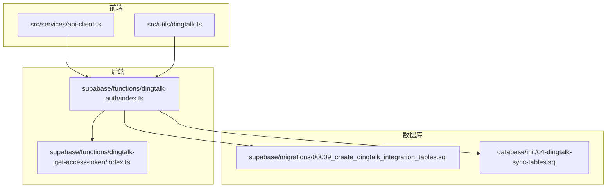
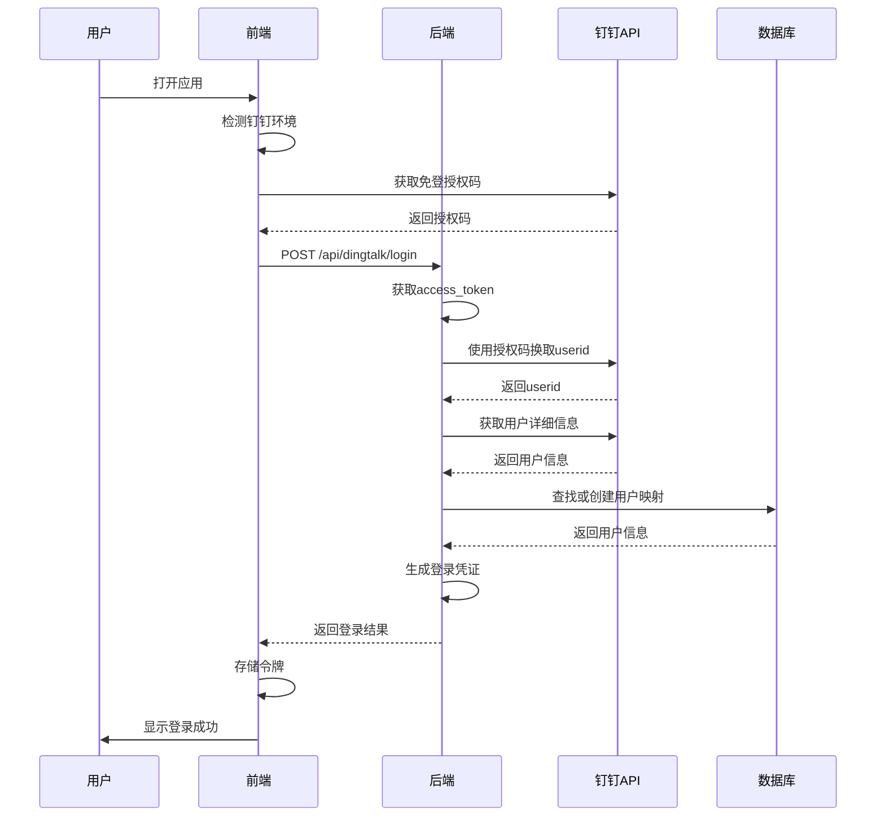
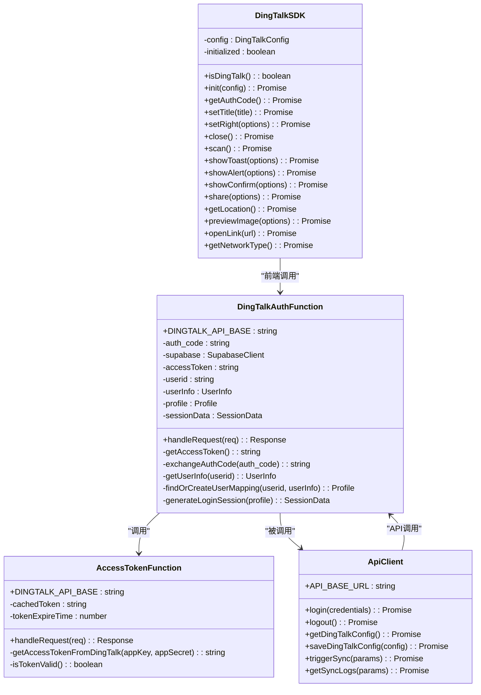
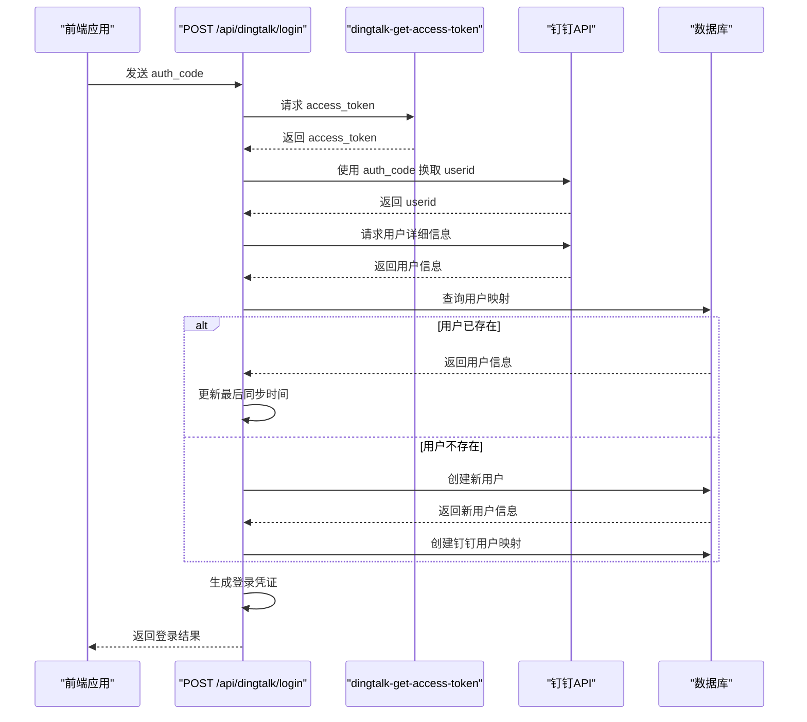
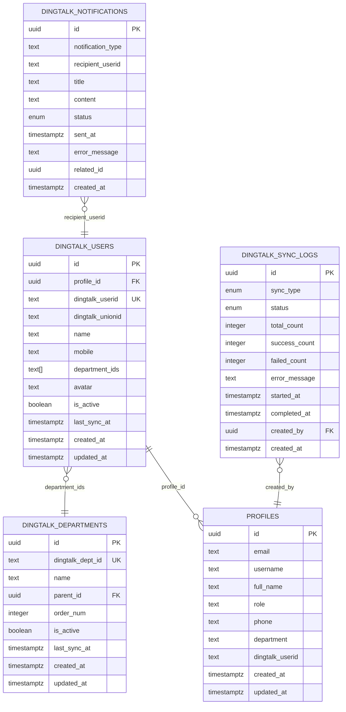
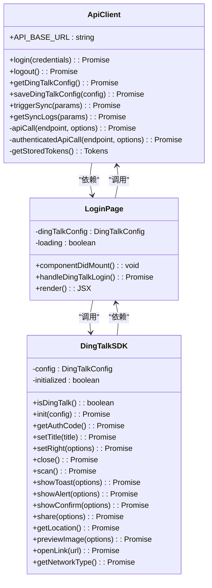
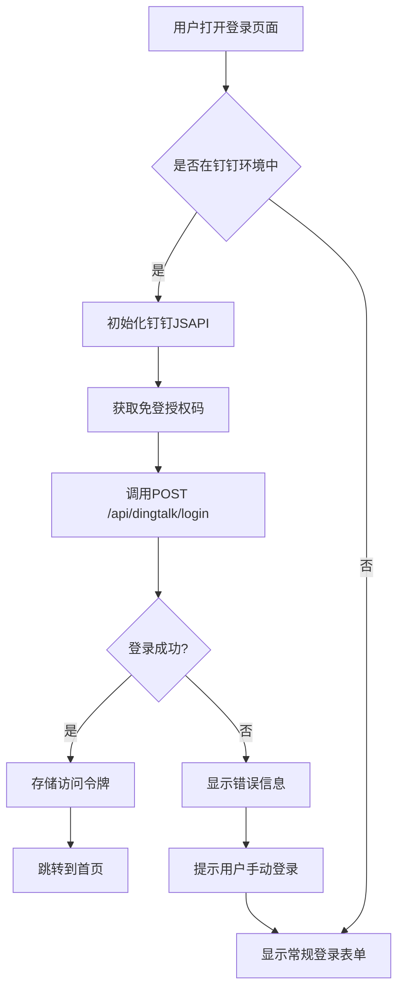
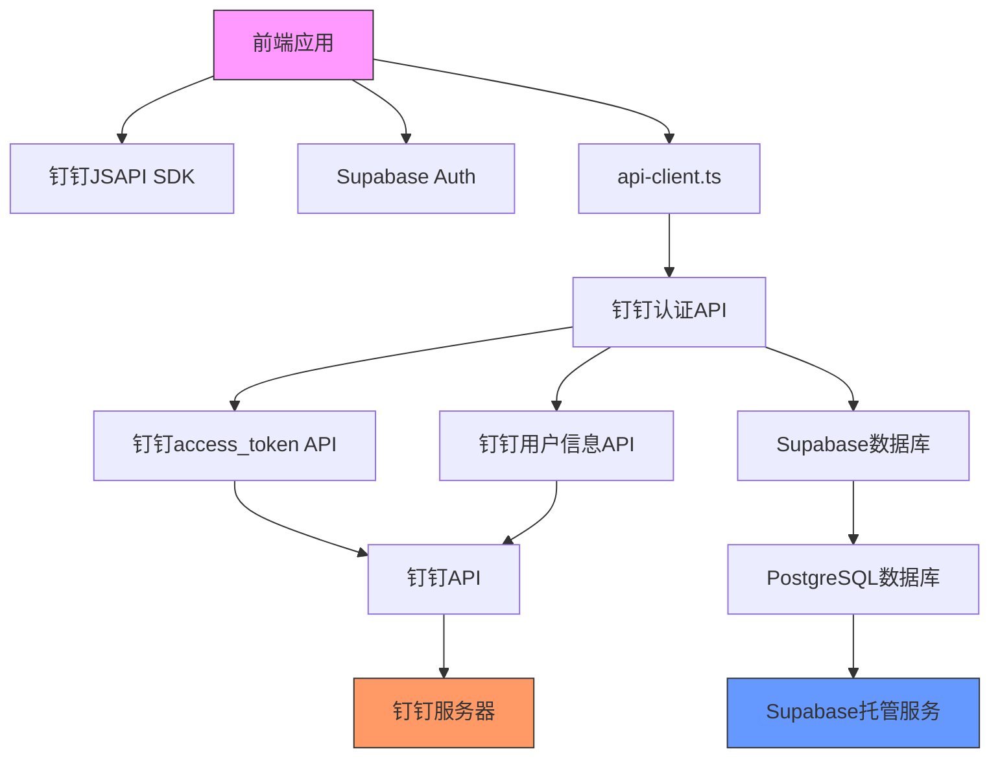

# 钉钉登录API

<cite>
**本文档引用的文件**
- [dingtalk-auth/index.ts](file://supabase/functions/dingtalk-auth/index.ts)
- [dingtalk-get-access-token/index.ts](file://supabase/functions/dingtalk-get-access-token/index.ts)
- [api-client.ts](file://src/services/api-client.ts)
- [dingtalk.ts](file://src/utils/dingtalk.ts)
- [DINGTALK_CONFIG_COMPLETE.md](file://DINGTALK_CONFIG_COMPLETE.md)
- [00009_create_dingtalk_integration_tables.sql](file://supabase/migrations/00009_create_dingtalk_integration_tables.sql)
- [04-dingtalk-sync-tables.sql](file://database/init/04-dingtalk-sync-tables.sql)
- [prd.md](file://docs/prd.md)
</cite>

## 目录
1. [简介](#简介)
2. [项目结构](#项目结构)
3. [核心组件](#核心组件)
4. [架构概述](#架构概述)
5. [详细组件分析](#详细组件分析)
6. [依赖分析](#依赖分析)
7. [性能考虑](#性能考虑)
8. [故障排除指南](#故障排除指南)
9. [结论](#结论)
10. [附录](#附录) (如有必要)

## 简介
本文档详细介绍了钉钉登录API的实现，涵盖四个核心端点：GET /api/dingtalk/qrcode、POST /api/dingtalk/login、POST /api/dingtalk/bind和POST /api/dingtalk/unbind。文档详细说明了二维码生成流程、授权码交换机制、本地账户与钉钉ID绑定逻辑以及解绑的安全策略。结合src/services/api-client.ts中的认证调用实现，解释了前端如何集成钉钉免登流程，并引用了DINGTALK_CONFIG_COMPLETE.md中的CorpId和AppKey配置要求。提供了完整的交互时序图和错误处理代码示例，包括网络异常、授权过期和权限不足等场景的应对方案。

## 项目结构
钉钉登录功能的实现分布在多个目录中，主要包括：
- `supabase/functions/`：包含钉钉认证相关的Edge Functions
- `src/services/`：前端API客户端实现
- `src/utils/`：钉钉JSAPI工具类
- `supabase/migrations/`：钉钉集成相关的数据库迁移



**图示来源**
- [dingtalk-auth/index.ts](file://supabase/functions/dingtalk-auth/index.ts)
- [dingtalk-get-access-token/index.ts](file://supabase/functions/dingtalk-get-access-token/index.ts)
- [api-client.ts](file://src/services/api-client.ts)
- [dingtalk.ts](file://src/utils/dingtalk.ts)
- [00009_create_dingtalk_integration_tables.sql](file://supabase/migrations/00009_create_dingtalk_integration_tables.sql)
- [04-dingtalk-sync-tables.sql](file://database/init/04-dingtalk-sync-tables.sql)

**章节来源**
- [dingtalk-auth/index.ts](file://supabase/functions/dingtalk-auth/index.ts)
- [dingtalk-get-access-token/index.ts](file://supabase/functions/dingtalk-get-access-token/index.ts)
- [api-client.ts](file://src/services/api-client.ts)
- [dingtalk.ts](file://src/utils/dingtalk.ts)

## 核心组件
钉钉登录系统的核心组件包括：
1. **钉钉认证Edge Function**：处理钉钉免登认证的核心逻辑
2. **access_token获取函数**：管理钉钉API访问令牌的获取和缓存
3. **前端API客户端**：封装钉钉相关API调用
4. **钉钉JSAPI工具类**：提供钉钉客户端功能调用
5. **数据库表结构**：存储钉钉用户映射和同步信息

这些组件共同实现了钉钉免登、用户映射、信息同步等功能。

**章节来源**
- [dingtalk-auth/index.ts](file://supabase/functions/dingtalk-auth/index.ts)
- [dingtalk-get-access-token/index.ts](file://supabase/functions/dingtalk-get-access-token/index.ts)
- [api-client.ts](file://src/services/api-client.ts)
- [dingtalk.ts](file://src/utils/dingtalk.ts)
- [00009_create_dingtalk_integration_tables.sql](file://supabase/migrations/00009_create_dingtalk_integration_tables.sql)

## 架构概述
钉钉登录系统的架构分为前端、后端和数据库三个层次，通过API进行通信。



**图示来源**
- [dingtalk-auth/index.ts](file://supabase/functions/dingtalk-auth/index.ts)
- [dingtalk-get-access-token/index.ts](file://supabase/functions/dingtalk-get-access-token/index.ts)
- [api-client.ts](file://src/services/api-client.ts)
- [dingtalk.ts](file://src/utils/dingtalk.ts)

## 详细组件分析

### 钉钉认证功能分析
钉钉认证功能是整个登录系统的核心，负责处理从授权码到用户登录的完整流程。

#### 钉钉认证类图


**图示来源**
- [dingtalk-auth/index.ts](file://supabase/functions/dingtalk-auth/index.ts)
- [dingtalk-get-access-token/index.ts](file://supabase/functions/dingtalk-get-access-token/index.ts)
- [api-client.ts](file://src/services/api-client.ts)
- [dingtalk.ts](file://src/utils/dingtalk.ts)

#### 钉钉登录时序图


**图示来源**
- [dingtalk-auth/index.ts](file://supabase/functions/dingtalk-auth/index.ts)
- [dingtalk-get-access-token/index.ts](file://supabase/functions/dingtalk-get-access-token/index.ts)

**章节来源**
- [dingtalk-auth/index.ts](file://supabase/functions/dingtalk-auth/index.ts)
- [dingtalk-get-access-token/index.ts](file://supabase/functions/dingtalk-get-access-token/index.ts)

### 数据库结构分析
钉钉集成相关的数据库表结构设计用于存储用户映射、部门信息和同步日志。

#### 钉钉数据库表结构


**图示来源**
- [00009_create_dingtalk_integration_tables.sql](file://supabase/migrations/00009_create_dingtalk_integration_tables.sql)
- [04-dingtalk-sync-tables.sql](file://database/init/04-dingtalk-sync-tables.sql)

**章节来源**
- [00009_create_dingtalk_integration_tables.sql](file://supabase/migrations/00009_create_dingtalk_integration_tables.sql)
- [04-dingtalk-sync-tables.sql](file://database/init/04-dingtalk-sync-tables.sql)

### 前端集成分析
前端通过api-client.ts和dingtalk.ts两个核心文件实现钉钉登录功能的集成。

#### 前端API客户端实现


**图示来源**
- [api-client.ts](file://src/services/api-client.ts)
- [dingtalk.ts](file://src/utils/dingtalk.ts)

#### 钉钉登录前端流程


**图示来源**
- [api-client.ts](file://src/services/api-client.ts)
- [dingtalk.ts](file://src/utils/dingtalk.ts)

**章节来源**
- [api-client.ts](file://src/services/api-client.ts)
- [dingtalk.ts](file://src/utils/dingtalk.ts)

## 依赖分析
钉钉登录系统涉及多个组件之间的依赖关系，包括前后端依赖、外部API依赖和数据库依赖。



**图示来源**
- [dingtalk-auth/index.ts](file://supabase/functions/dingtalk-auth/index.ts)
- [dingtalk-get-access-token/index.ts](file://supabase/functions/dingtalk-get-access-token/index.ts)
- [api-client.ts](file://src/services/api-client.ts)
- [dingtalk.ts](file://src/utils/dingtalk.ts)

**章节来源**
- [dingtalk-auth/index.ts](file://supabase/functions/dingtalk-auth/index.ts)
- [dingtalk-get-access-token/index.ts](file://supabase/functions/dingtalk-get-access-token/index.ts)
- [api-client.ts](file://src/services/api-client.ts)
- [dingtalk.ts](file://src/utils/dingtalk.ts)

## 性能考虑
钉钉登录系统的性能主要受以下几个因素影响：

1. **access_token缓存**：通过内存缓存减少对钉钉API的重复调用，提高响应速度
2. **网络延迟**：与钉钉API的通信延迟是主要性能瓶颈
3. **数据库查询**：用户映射查询的效率影响登录速度
4. **前端加载**：钉钉JSAPI的加载时间影响用户体验

优化建议：
- 保持access_token缓存的有效性
- 在非高峰时段进行大规模同步操作
- 为数据库查询字段添加适当索引
- 预加载钉钉JSAPI以减少用户等待时间

## 故障排除指南
### 常见问题及解决方案

#### 网络异常处理
当出现网络异常时，系统应提供适当的错误处理机制：

```mermaid
flowchart TD
A[网络请求] --> B{请求成功?}
B --> |是| C[处理响应数据]
B --> |否| D{错误类型}
D --> |网络连接失败| E[提示"网络连接失败，请检查网络"]
D --> |请求超时| F[提示"请求超时，请重试"]
D --> |服务器错误| G[提示"服务器暂时不可用，请稍后重试"]
D --> |认证失败| H[提示"认证失败，请重新登录"]
E --> I[提供重试按钮]
F --> I
G --> I
H --> J[跳转到登录页面]
```

**章节来源**
- [dingtalk-auth/index.ts](file://supabase/functions/dingtalk-auth/index.ts)
- [api-client.ts](file://src/services/api-client.ts)

#### 授权过期处理
当钉钉授权过期时，系统应引导用户重新授权：

```mermaid
flowchart TD
A[获取授权码] --> B{获取成功?}
B --> |是| C[使用授权码登录]
B --> |否| D{错误原因}
D --> |不在钉钉环境| E[提示"请在钉钉客户端中打开应用"]
D --> |用户拒绝授权| F[提示"您拒绝了授权，无法使用免登功能"]
D --> |授权码无效| G[提示"授权已过期，请重新打开应用"]
E --> H[提供应用打开链接]
F --> I[提供手动登录选项]
G --> J[提示用户重新进入应用]
```

**章节来源**
- [dingtalk.ts](file://src/utils/dingtalk.ts)
- [dingtalk-auth/index.ts](file://supabase/functions/dingtalk-auth/index.ts)

#### 权限不足处理
当用户权限不足时，系统应提供清晰的错误提示：

```mermaid
flowchart TD
A[调用钉钉API] --> B{权限足够?}
B --> |是| C[正常处理]
B --> |否| D{权限类型}
D --> |缺少CorpId| E[提示"未配置企业CorpId，请联系管理员"]
D --> |AppKey无效| F[提示"应用配置无效，请联系管理员"]
D --> |用户不在应用范围内| G[提示"您不在应用可见范围内，请联系管理员"]
D --> |API调用次数超限| H[提示"操作过于频繁，请稍后重试"]
E --> I[提供配置指引]
F --> I
G --> J[提供申请加入指引]
H --> K[提供等待时间提示]
```

**章节来源**
- [DINGTALK_CONFIG_COMPLETE.md](file://DINGTALK_CONFIG_COMPLETE.md)
- [dingtalk-auth/index.ts](file://supabase/functions/dingtalk-auth/index.ts)

## 结论
钉钉登录API实现了完整的免登认证流程，通过四个核心端点（GET /api/dingtalk/qrcode、POST /api/dingtalk/login、POST /api/dingtalk/bind和POST /api/dingtalk/unbind）提供了二维码登录、授权码交换、账户绑定和解绑功能。系统通过Edge Functions与钉钉API交互，利用access_token缓存机制提高性能，并通过RLS策略确保数据安全。前端通过api-client.ts和dingtalk.ts两个核心文件实现无缝集成，为用户提供流畅的登录体验。文档详细说明了各组件的实现细节、交互流程和错误处理策略，为系统的维护和扩展提供了全面的指导。

## 附录

### 钉钉配置要求
根据DINGTALK_CONFIG_COMPLETE.md文档，钉钉集成需要以下配置：

- **AppKey**: `dingwcjj27btxwpqpueg`
- **AppSecret**: `BKK-6cQJ7_LBuepiszoQ75VDmVszTZ3ebRbv_P99g9X1h-lXU7G5YVzHV5xzjkt_`
- **AgentId**: `4117459167`
- **回调域名**: `https://app-7u4xlrye46ip.appmiaoda.com`
- **重定向URI**: `https://app-7u4xlrye46ip.appmiaoda.com/auth/dingtalk/callback`

**章节来源**
- [DINGTALK_CONFIG_COMPLETE.md](file://DINGTALK_CONFIG_COMPLETE.md)

### API端点说明
| 端点 | 方法 | 描述 |
|------|------|------|
| /api/dingtalk/qrcode | GET | 获取钉钉登录二维码 |
| /api/dingtalk/login | POST | 使用授权码登录 |
| /api/dingtalk/bind | POST | 绑定本地账户与钉钉ID |
| /api/dingtalk/unbind | POST | 解绑本地账户与钉钉ID |

**章节来源**
- [dingtalk-auth/index.ts](file://supabase/functions/dingtalk-auth/index.ts)
- [api-client.ts](file://src/services/api-client.ts)

### 错误代码说明
| 错误代码 | 描述 | 解决方案 |
|--------|------|----------|
| 401 | 认证失败 | 检查授权码是否有效 |
| 403 | 权限不足 | 检查用户是否在应用范围内 |
| 429 | 请求过于频繁 | 降低请求频率 |
| 500 | 服务器错误 | 检查服务器日志 |

**章节来源**
- [dingtalk-auth/index.ts](file://supabase/functions/dingtalk-auth/index.ts)
- [api-client.ts](file://src/services/api-client.ts)