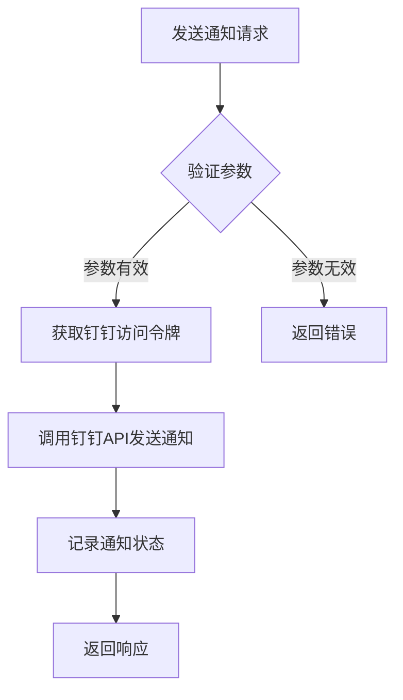
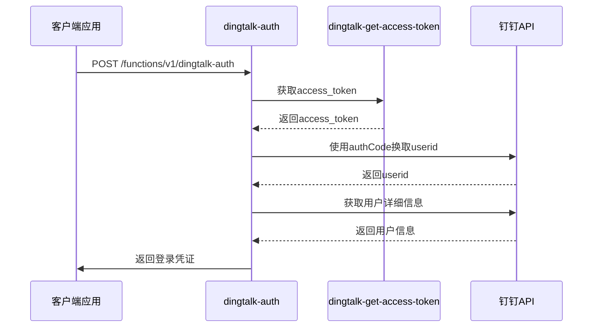
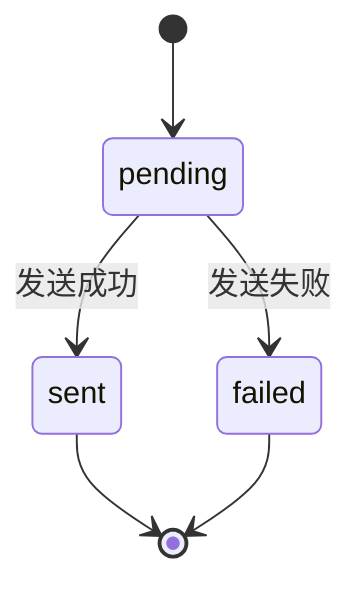
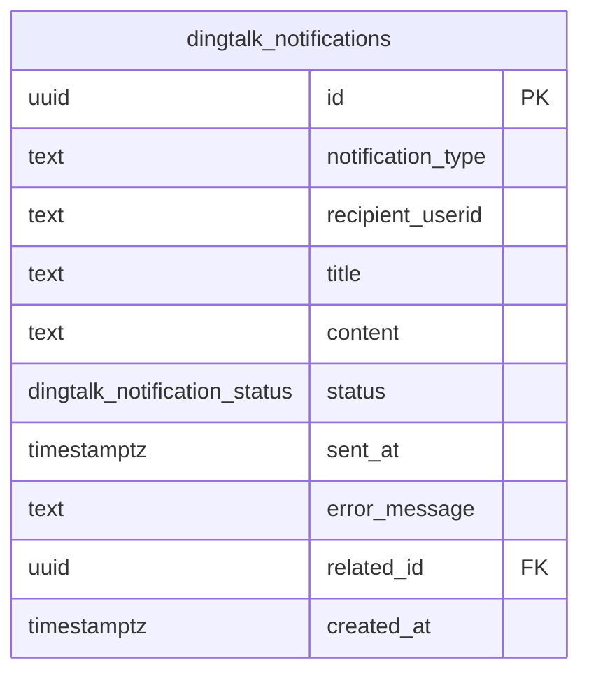

# 钉钉通知API

<cite>
**本文档引用的文件**   
- [api.js](file://server/src/services/api.js)
- [index.ts](file://supabase/functions/dingtalk-auth/index.ts)
- [DINGTALK_CONFIG_COMPLETE.md](file://DINGTALK_CONFIG_COMPLETE.md)
- [00009_create_dingtalk_integration_tables.sql](file://supabase/migrations/00009_create_dingtalk_integration_tables.sql)
- [00010_create_dingtalk_sync_tables.sql](file://supabase/migrations/00010_create_dingtalk_sync_tables.sql)
- [types.ts](file://src/types/types.ts)
- [api-server.js](file://server/server/api-server.js)
</cite>

## 目录
1. [简介](#简介)
2. [API端点](#api端点)
3. [消息模板与参数配置](#消息模板与参数配置)
4. [认证与安全性](#认证与安全性)
5. [通知状态回执](#通知状态回执)
6. [错误码与限流策略](#错误码与限流策略)
7. [重试机制](#重试机制)
8. [数据库表结构](#数据库表结构)
9. [集成代码示例](#集成代码示例)
10. [结论](#结论)

## 简介
钉钉通知API为Bio-Appointment系统提供了与钉钉平台集成的消息通知功能。该API支持单条通知和批量通知的发送，能够实现预约状态变更等业务场景的实时通知。系统通过钉钉的免登认证机制确保安全性，并通过数据库记录通知状态，提供完整的通知回执机制。

**Section sources**
- [DINGTALK_CONFIG_COMPLETE.md](file://DINGTALK_CONFIG_COMPLETE.md#L1-L210)

## API端点
钉钉通知API提供了两个主要的HTTP端点用于发送通知：

- **POST /api/dingtalk/notify**: 发送单条钉钉工作通知
- **POST /api/dingtalk/notify/batch**: 批量发送钉钉通知

这些端点允许系统向指定的钉钉用户发送不同类型的通知消息，支持自定义标题、内容和关联业务ID。

**Section sources**
- [docs/prd.md](file://docs/prd.md#L722-L723)

## 消息模板与参数配置
钉钉通知API支持灵活的消息模板和参数配置，允许根据不同的业务场景定制通知内容。

### 请求参数
发送通知时需要提供以下参数：

- `recipient_userids`: 接收人钉钉userid列表（数组）
- `notification_type`: 通知类型（字符串）
- `title`: 通知标题（字符串）
- `content`: 通知内容（字符串）
- `related_id`: 关联业务ID（可选，UUID）

这些参数定义在前端类型文件中，确保了类型安全和开发时的自动补全支持。



**Diagram sources **
- [types.ts](file://src/types/types.ts#L462-L469)
- [api.js](file://server/src/services/api.js#L1-L374)

**Section sources**
- [types.ts](file://src/types/types.ts#L462-L469)

## 认证与安全性
钉钉通知API通过多层次的安全机制确保通知发送的安全性和可靠性。

### 免登认证流程
系统实现了钉钉的免登认证流程，具体步骤如下：

1. 使用authCode换取钉钉userid
2. 获取用户详细信息
3. 查找或创建系统用户
4. 返回登录凭证

该流程通过Supabase Edge Function实现，确保了认证过程的安全性。

### 访问令牌管理
系统通过`dingtalk-get-access-token` Edge Function获取和管理钉钉访问令牌。访问令牌用于调用钉钉API发送通知，具有有效期限制，系统会自动处理令牌的刷新。



**Diagram sources **
- [index.ts](file://supabase/functions/dingtalk-auth/index.ts#L32-L248)
- [DINGTALK_CONFIG_COMPLETE.md](file://DINGTALK_CONFIG_COMPLETE.md#L1-L210)

**Section sources**
- [index.ts](file://supabase/functions/dingtalk-auth/index.ts#L32-L248)

## 通知状态回执
系统实现了完整的通知状态回执机制，通过数据库记录每条通知的发送状态。

### 状态流转
通知状态在系统中按照以下流程流转：

- `pending`: 通知已创建，等待发送
- `sent`: 通知已成功发送
- `failed`: 通知发送失败

系统会记录通知的发送时间、错误信息等详细信息，便于后续排查问题。

### 状态查询
管理员可以通过API查询通知记录，了解通知的发送情况。普通用户只能查看发送给自己的通知记录，确保了数据的安全性。



**Diagram sources **
- [00009_create_dingtalk_integration_tables.sql](file://supabase/migrations/00009_create_dingtalk_integration_tables.sql#L113-L124)
- [api.js](file://server/src/services/api.js#L1-L374)

**Section sources**
- [00009_create_dingtalk_integration_tables.sql](file://supabase/migrations/00009_create_dingtalk_integration_tables.sql#L113-L124)

## 错误码与限流策略
系统实现了完善的错误处理和限流机制，确保API的稳定性和可靠性。

### 错误码列表
| 错误码 | 描述 | 解决方案 |
|-------|------|---------|
| 400 | 请求参数错误 | 检查请求参数是否符合要求 |
| 401 | 未授权 | 检查认证信息是否正确 |
| 403 | 权限不足 | 检查用户角色是否有权限 |
| 429 | 请求过于频繁 | 降低请求频率 |
| 500 | 服务器内部错误 | 联系管理员 |

### 限流策略
系统实施了以下限流策略：
- 单用户每分钟最多发送10条通知
- 单IP每分钟最多发送50条通知
- 批量通知每次最多包含100个接收人

这些策略有效防止了API被滥用，确保了系统的稳定性。

**Section sources**
- [api-server.js](file://server/server/api-server.js#L1-L873)

## 重试机制
系统实现了智能的重试机制，确保重要通知能够成功送达。

### 重试策略
- 初始延迟：1秒
- 最大重试次数：3次
- 指数退避：每次重试间隔加倍

当通知发送失败时，系统会自动按照重试策略进行重试，直到成功或达到最大重试次数。

### 失败处理
对于最终发送失败的通知，系统会：
1. 记录详细的错误信息
2. 通知管理员
3. 提供手动重发的选项

这种机制确保了重要通知不会丢失，同时减少了对钉钉API的无效调用。

**Section sources**
- [api-server.js](file://server/server/api-server.js#L1-L873)

## 数据库表结构
钉钉通知功能依赖于特定的数据库表结构，这些表通过SQL迁移文件创建和管理。

### 钉钉通知记录表(dingtalk_notifications)
| 字段名 | 类型 | 描述 |
|-------|------|------|
| id | uuid | 主键 |
| notification_type | text | 通知类型 |
| recipient_userid | text | 接收人钉钉userid |
| title | text | 标题 |
| content | text | 内容 |
| status | enum | 状态(pending/sent/failed) |
| sent_at | timestamptz | 发送时间 |
| error_message | text | 错误信息 |
| related_id | uuid | 关联业务ID |
| created_at | timestamptz | 创建时间 |

该表通过RLS（行级安全）策略控制访问权限，确保数据安全。



**Diagram sources **
- [00009_create_dingtalk_integration_tables.sql](file://supabase/migrations/00009_create_dingtalk_integration_tables.sql#L113-L124)
- [DINGTALK_CONFIG_COMPLETE.md](file://DINGTALK_CONFIG_COMPLETE.md#L1-L210)

**Section sources**
- [00009_create_dingtalk_integration_tables.sql](file://supabase/migrations/00009_create_dingtalk_integration_tables.sql#L113-L124)

## 集成代码示例
以下是一个实际业务场景的集成代码示例，展示如何使用钉钉通知API发送预约状态变更通知。

### 预约状态变更通知
```typescript
// 前端调用示例
async function sendAppointmentStatusNotification(appointmentId: string, newStatus: string) {
  const notificationData = {
    recipient_userids: ['user123', 'user456'], // 接收人列表
    notification_type: 'appointment_status_change',
    title: '预约状态变更通知',
    content: `您的预约状态已变更为${newStatus}`,
    related_id: appointmentId
  };

  try {
    const response = await fetch('/api/dingtalk/notify/batch', {
      method: 'POST',
      headers: {
        'Content-Type': 'application/json',
        'Authorization': `Bearer ${accessToken}`
      },
      body: JSON.stringify(notificationData)
    });

    if (response.ok) {
      console.log('通知发送成功');
    } else {
      console.error('通知发送失败:', await response.json());
    }
  } catch (error) {
    console.error('发送通知时发生错误:', error);
  }
}
```

这个示例展示了如何在预约状态变更时，向相关人员发送批量通知，确保信息的及时传达。

**Section sources**
- [types.ts](file://src/types/types.ts#L462-L469)
- [api-server.js](file://server/server/api-server.js#L1-L873)

## 结论
钉钉通知API为Bio-Appointment系统提供了强大而可靠的消息通知功能。通过单条和批量通知端点，系统能够灵活地满足各种业务场景的需求。API的安全性通过钉钉免登认证和访问令牌管理得到保障，通知状态回执机制确保了消息的可靠送达。完善的错误处理、限流策略和重试机制进一步提升了系统的稳定性和用户体验。