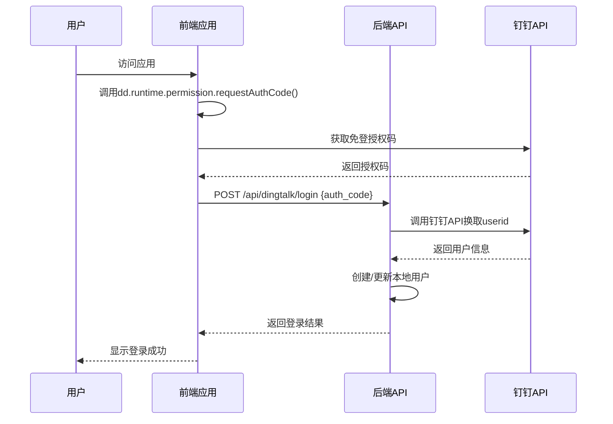
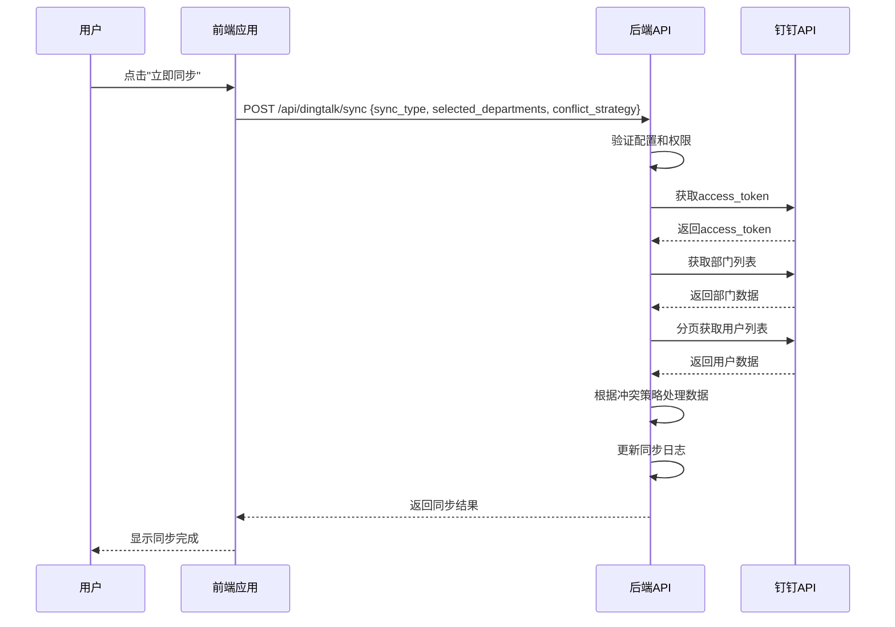
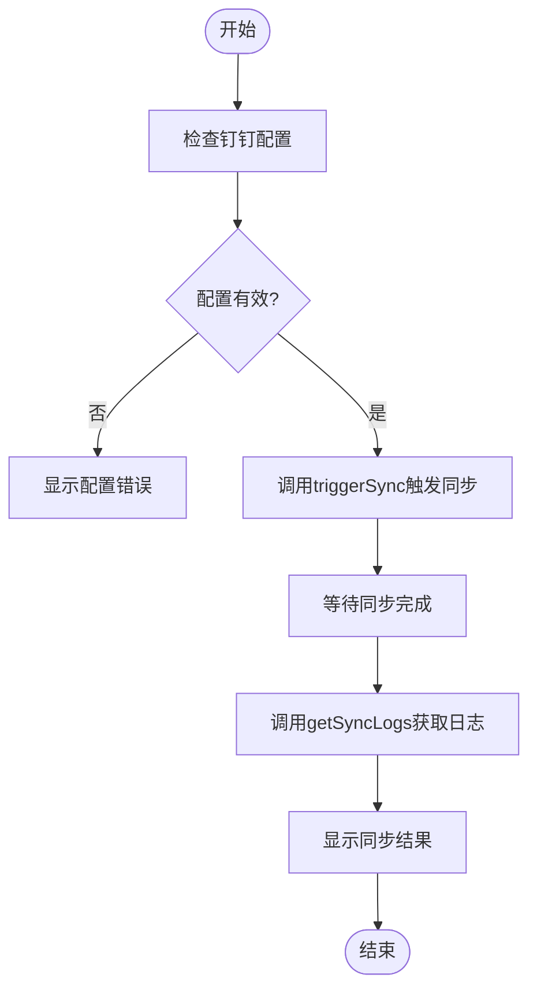

# 钉钉集成API

<cite>
**本文档引用的文件**   
- [DINGTALK_CONFIG_COMPLETE.md](file://DINGTALK_CONFIG_COMPLETE.md)
- [api-client.ts](file://src/services/api-client.ts)
- [dingtalk.ts](file://src/utils/dingtalk.ts)
- [api.ts](file://src/db/api.ts)
- [DingTalkSyncPanel.tsx](file://src/components/dingtalk/DingTalkSyncPanel.tsx)
- [DingTalkSyncLogsTable.tsx](file://src/components/dingtalk/DingTalkSyncLogsTable.tsx)
- [dingtalk-sync/index.ts](file://supabase/functions/dingtalk-sync/index.ts)
- [dingtalk-auth/index.ts](file://supabase/functions/dingtalk-auth/index.ts)
- [00009_create_dingtalk_integration_tables.sql](file://supabase/migrations/00009_create_dingtalk_integration_tables.sql)
- [types.ts](file://src/types/types.ts)
</cite>

## 目录
1. [简介](#简介)
2. [登录模块](#登录模块)
3. [同步模块](#同步模块)
4. [通知模块](#通知模块)
5. [集成示例](#集成示例)

## 简介
钉钉集成API为Bio-Appointment系统提供了与钉钉平台的深度集成能力，主要包含三大功能模块：登录、同步和通知。通过该API，系统能够实现钉钉免登认证、组织架构同步以及消息通知推送功能。本系统已完成了钉钉应用的基础配置，包括AppKey、AppSecret、AgentId等关键参数的设置，并创建了相应的数据库表结构来存储用户映射、部门信息、同步日志和通知记录。

**Section sources**
- [DINGTALK_CONFIG_COMPLETE.md](file://DINGTALK_CONFIG_COMPLETE.md#L1-L210)
- [00009_create_dingtalk_integration_tables.sql](file://supabase/migrations/00009_create_dingtalk_integration_tables.sql#L1-L204)

## 登录模块
登录模块实现了基于钉钉免登功能的用户认证流程，包含二维码生成、授权码交换和账户绑定三个核心环节。系统通过钉钉JSAPI SDK获取免登授权码，然后通过后端接口换取用户信息并完成本地账户的创建或绑定。

### 二维码生成与授权码交换
当用户访问系统时，前端通过钉钉JSAPI SDK调用`getAuthCode()`方法获取免登授权码。该授权码随后通过`POST /api/dingtalk/login`接口发送到后端，后端Edge Function `dingtalk-auth`会使用此授权码向钉钉API发起请求，换取用户的userid信息。整个流程确保了用户无需输入账号密码即可完成身份验证。

**Diagram sources **
- [dingtalk.ts](file://src/utils/dingtalk.ts#L59-L77)
- [dingtalk-auth/index.ts](file://supabase/functions/dingtalk-auth/index.ts#L53-L93)

### 账户绑定与解绑
系统提供了账户绑定和解绑功能，允许用户将钉钉账号与本地系统账户进行关联或解除关联。`POST /api/dingtalk/bind`接口用于绑定钉钉账号，`POST /api/dingtalk/unbind`接口用于解绑。绑定成功后，用户的钉钉userid会被存储在本地数据库的profiles表中，实现两个系统的用户身份映射。

**Section sources**
- [dingtalk-auth/index.ts](file://supabase/functions/dingtalk-auth/index.ts#L167-L202)
- [00009_create_dingtalk_integration_tables.sql](file://supabase/migrations/00009_create_dingtalk_integration_tables.sql#L202-L204)

## 同步模块
同步模块负责将钉钉组织架构中的用户和部门信息同步到本地系统，支持手动触发和自动同步两种模式。该模块通过`POST /api/dingtalk/sync`接口触发同步操作，并通过`GET /api/dingtalk/sync/logs`接口查询同步日志。

### 同步触发与参数
`POST /api/dingtalk/sync`接口用于触发组织架构同步操作。该接口接受三个主要参数：`sync_type`（同步类型）、`selected_departments`（选择的部门）和`conflict_strategy`（冲突解决策略）。`sync_type`可选值为'manual'（手动同步）、'auto'（自动同步）或'incremental'（增量同步）。`conflict_strategy`定义了当钉钉数据与本地数据发生冲突时的处理策略，可选值为'dingtalk_first'（以钉钉数据为准）、'local_first'（以本地数据为准）或'manual'（手动处理）。

**Diagram sources **
- [api-client.ts](file://src/services/api-client.ts#L355-L364)
- [dingtalk-sync/index.ts](file://supabase/functions/dingtalk-sync/index.ts#L110-L355)

### 同步日志查询
`GET /api/dingtalk/sync/logs`接口用于查询同步操作的历史日志，支持分页查询和状态过滤。该接口接受`limit`（每页数量）、`offset`（偏移量）和`status`（状态）三个查询参数。返回的同步日志包含同步类型、状态、总数、成功数、失败数、开始时间、完成时间和操作人等信息。前端组件`DingTalkSyncLogsTable`利用此接口实现了同步日志的表格展示功能。

**Section sources**
- [api-client.ts](file://src/services/api-client.ts#L366-L378)
- [DingTalkSyncLogsTable.tsx](file://src/components/dingtalk/DingTalkSyncLogsTable.tsx#L1-L91)

## 通知模块
通知模块提供了向钉钉用户发送消息通知的功能，支持单个通知和批量通知两种方式。`POST /api/dingtalk/notify`接口用于发送单个通知，`POST /api/dingtalk/notify/batch`接口用于批量发送通知。

### 通知发送
通知功能通过`dingtalk_notifications`表记录发送到钉钉的通知消息。每条通知记录包含通知类型、接收人钉钉userid、标题、内容、状态、发送时间和错误信息等字段。当发送通知时，系统会调用钉钉消息API将消息推送给指定用户，并在本地记录发送结果。前端可以通过查询通知记录来了解通知的发送状态。

**Section sources**
- [00009_create_dingtalk_integration_tables.sql](file://supabase/migrations/00009_create_dingtalk_integration_tables.sql#L113-L124)
- [types.ts](file://src/types/types.ts#L463-L469)

## 集成示例
以下是一个完整的钉钉集成使用示例，展示了如何使用`api-client.ts`中的`triggerSync`和`getSyncLogs`方法实现同步功能。

**Diagram sources **
- [api-client.ts](file://src/services/api-client.ts#L355-L378)
- [DingTalkSyncPanel.tsx](file://src/components/dingtalk/DingTalkSyncPanel.tsx#L66-L103)

**Section sources**
- [api-client.ts](file://src/services/api-client.ts#L355-L381)
- [DINGTALK_CONFIG_COMPLETE.md](file://DINGTALK_CONFIG_COMPLETE.md#L1-L210)