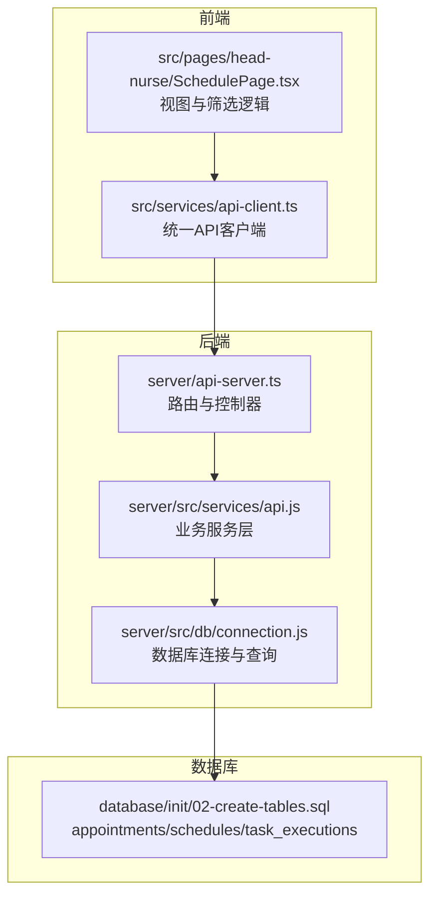
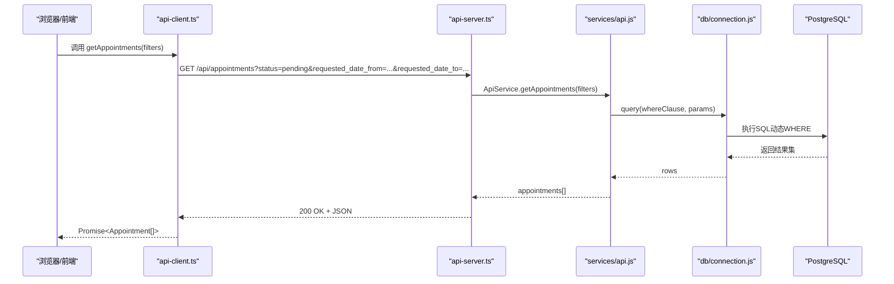
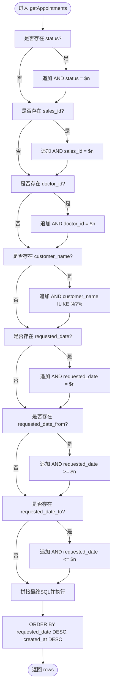
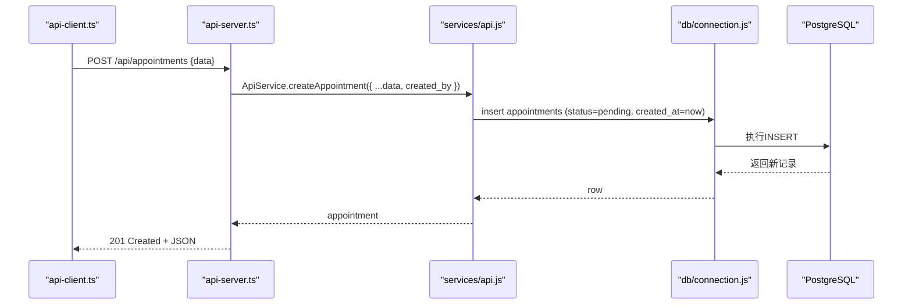
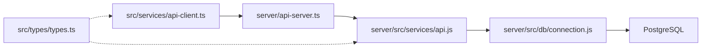

# 预约管理API

<cite>
**本文引用的文件**
- [server/api-server.ts](file://server/api-server.ts)
- [server/src/services/api.js](file://server/src/services/api.js)
- [server/src/db/connection.js](file://server/src/db/connection.js)
- [src/services/api-client.ts](file://src/services/api-client.ts)
- [src/pages/head-nurse/SchedulePage.tsx](file://src/pages/head-nurse/SchedulePage.tsx)
- [test-api-data.cjs](file://test-api-data.cjs)
- [database/init/02-create-tables.sql](file://database/init/02-create-tables.sql)
- [src/types/types.ts](file://src/types/types.ts)
</cite>

## 目录
1. [简介](#简介)
2. [项目结构](#项目结构)
3. [核心组件](#核心组件)
4. [架构总览](#架构总览)
5. [详细组件分析](#详细组件分析)
6. [依赖关系分析](#依赖关系分析)
7. [性能考量](#性能考量)
8. [故障排查指南](#故障排查指南)
9. [结论](#结论)
10. [附录](#附录)

## 简介
本文件面向开发者，系统化梳理“预约管理API”的全生命周期操作，包括：
- GET /api/appointments 的多条件过滤能力（按状态、日期范围等）
- POST /api/appointments 的创建流程与默认状态
- PUT /api/appointments/:id 的更新流程
- DELETE /api/appointments/:id 的删除流程
- 请求参数的过滤逻辑与日/周/月视图的数据获取策略
- 结合测试用例展示实际应用
- 前端调用示例与后端SQL查询构建逻辑

## 项目结构
后端以Express风格的API服务器提供REST接口；前端通过统一的客户端封装进行调用；数据库为PostgreSQL，包含预约、排班、任务执行等核心表。

图表来源
- [server/api-server.ts](file://server/api-server.ts#L219-L251)
- [server/src/services/api.js](file://server/src/services/api.js#L99-L164)
- [server/src/db/connection.js](file://server/src/db/connection.js#L80-L92)
- [database/init/02-create-tables.sql](file://database/init/02-create-tables.sql#L53-L112)

章节来源
- [server/api-server.ts](file://server/api-server.ts#L219-L251)
- [server/src/services/api.js](file://server/src/services/api.js#L99-L164)
- [server/src/db/connection.js](file://server/src/db/connection.js#L80-L92)
- [database/init/02-create-tables.sql](file://database/init/02-create-tables.sql#L53-L112)

## 核心组件
- API服务器路由：负责接收HTTP请求，解析查询参数与请求体，调用业务服务层并返回响应。
- 业务服务层：组装动态WHERE子句，构建SQL查询，执行数据库操作。
- 数据库连接：提供连接池、事务、健康检查与通用查询封装。
- 前端API客户端：封装认证头、URL拼装、错误处理，暴露统一的API方法。
- 类型定义：约束请求/响应字段，确保前后端一致性。

章节来源
- [server/api-server.ts](file://server/api-server.ts#L219-L251)
- [server/src/services/api.js](file://server/src/services/api.js#L99-L164)
- [server/src/db/connection.js](file://server/src/db/connection.js#L80-L92)
- [src/services/api-client.ts](file://src/services/api-client.ts#L178-L210)
- [src/types/types.ts](file://src/types/types.ts#L117-L137)

## 架构总览
下图展示从浏览器到数据库的完整调用链路，以及预约相关的端点与过滤逻辑。

图表来源
- [src/services/api-client.ts](file://src/services/api-client.ts#L178-L190)
- [server/api-server.ts](file://server/api-server.ts#L219-L231)
- [server/src/services/api.js](file://server/src/services/api.js#L99-L164)
- [server/src/db/connection.js](file://server/src/db/connection.js#L80-L92)

## 详细组件分析

### GET /api/appointments（多条件过滤）
- 功能概述：支持按状态、销售/医生ID、客户名、请求日期、日期范围等多种条件过滤。
- 关键过滤参数
  - status：预约状态
  - sales_id：销售人员ID
  - doctor_id：医生ID
  - customer_name：模糊匹配客户名
  - requested_date：精确匹配请求日期
  - requested_date_from / requested_date_to：日期范围闭区间
- 过滤逻辑要点
  - 动态拼接WHERE子句，仅当参数存在时加入对应条件
  - 日期范围使用闭区间比较，便于日/周/月视图
  - 排序优先按请求日期降序，再按创建时间降序
- 日/周/月视图的数据获取策略
  - 日视图：requested_date_from 与 requested_date_to 相同
  - 周视图：计算周一至周日的起止日期
  - 月视图：计算当月第一天与最后一天
- 前端调用示例（节选）
  - 前端页面根据视图模式计算起止日期，并调用 getAppointments({ status: 'pending', requested_date_from, requested_date_to })
  - 参考路径：[src/pages/head-nurse/SchedulePage.tsx](file://src/pages/head-nurse/SchedulePage.tsx#L63-L103)
- SQL构建逻辑（节选）
  - 动态WHERE子句与参数化查询，避免SQL注入
  - 参考路径：[server/src/services/api.js](file://server/src/services/api.js#L99-L164)

图表来源
- [server/src/services/api.js](file://server/src/services/api.js#L99-L164)

章节来源
- [server/src/services/api.js](file://server/src/services/api.js#L99-L164)
- [src/pages/head-nurse/SchedulePage.tsx](file://src/pages/head-nurse/SchedulePage.tsx#L63-L103)
- [test-api-data.cjs](file://test-api-data.cjs#L127-L175)

### POST /api/appointments（创建预约）
- 功能概述：创建新预约，默认状态为 pending，同时写入创建时间与创建人。
- 关键点
  - 默认状态：pending
  - 创建时间：当前时间
  - 创建人：从请求上下文中提取的用户ID
- 前端调用示例（节选）
  - 调用 createAppointment(data)
  - 参考路径：[src/services/api-client.ts](file://src/services/api-client.ts#L192-L200)
- 后端SQL构建逻辑（节选）
  - 使用通用插入封装，自动设置 created_at 与状态
  - 参考路径：[server/src/services/api.js](file://server/src/services/api.js#L150-L164)

图表来源
- [server/api-server.ts](file://server/api-server.ts#L233-L251)
- [server/src/services/api.js](file://server/src/services/api.js#L150-L164)
- [server/src/db/connection.js](file://server/src/db/connection.js#L210-L223)

章节来源
- [server/api-server.ts](file://server/api-server.ts#L233-L251)
- [server/src/services/api.js](file://server/src/services/api.js#L150-L164)
- [src/services/api-client.ts](file://src/services/api-client.ts#L192-L200)

### PUT /api/appointments/:id（更新预约）
- 功能概述：更新指定ID的预约，不允许修改创建/更新时间字段。
- 关键点
  - 更新时排除 created_at、updated_at 字段，避免覆盖
  - 返回更新后的记录或空值
- 前端调用示例（节选）
  - 调用 updateAppointment(id, partialData)
  - 参考路径：[src/services/api-client.ts](file://src/services/api-client.ts#L199-L204)
- 后端SQL构建逻辑（节选）
  - 使用通用更新封装，自动更新 updated_at
  - 参考路径：[server/src/services/api.js](file://server/src/services/api.js#L157-L164)

章节来源
- [server/src/services/api.js](file://server/src/services/api.js#L157-L164)
- [src/services/api-client.ts](file://src/services/api-client.ts#L199-L204)

### DELETE /api/appointments/:id（删除预约）
- 功能概述：删除指定ID的预约，返回是否删除成功。
- 关键点
  - 删除成功返回非空值，否则为空
- 前端调用示例（节选）
  - 调用 deleteAppointment(id)
  - 参考路径：[src/services/api-client.ts](file://src/services/api-client.ts#L206-L210)
- 后端SQL构建逻辑（节选）
  - 使用通用删除封装
  - 参考路径：[server/src/services/api.js](file://server/src/services/api.js#L161-L164)

章节来源
- [server/src/services/api.js](file://server/src/services/api.js#L161-L164)
- [src/services/api-client.ts](file://src/services/api-client.ts#L206-L210)

### 日/周/月视图的数据获取（结合测试用例）
- 测试脚本展示了三种视图模式的日期范围计算与查询参数构造
  - 日视图：requested_date_from 与 requested_date_to 相同
  - 周视图：周一至周日
  - 月视图：当月第一天与最后一天
- 示例参数
  - { status: 'pending', requested_date_from: 'YYYY-MM-DD', requested_date_to: 'YYYY-MM-DD' }
- 参考路径
  - [test-api-data.cjs](file://test-api-data.cjs#L127-L175)
  - [src/pages/head-nurse/SchedulePage.tsx](file://src/pages/head-nurse/SchedulePage.tsx#L63-L103)

章节来源
- [test-api-data.cjs](file://test-api-data.cjs#L127-L175)
- [src/pages/head-nurse/SchedulePage.tsx](file://src/pages/head-nurse/SchedulePage.tsx#L63-L103)

### 前端调用示例（src/services/api-client.ts）
- getAppointments(filters)
  - 将filters转为URL查询字符串，自动添加认证头
  - 参考路径：[src/services/api-client.ts](file://src/services/api-client.ts#L178-L190)
- createAppointment(data)
  - 发送POST请求，携带认证头
  - 参考路径：[src/services/api-client.ts](file://src/services/api-client.ts#L192-L200)
- updateAppointment(id, data)
  - 发送PUT请求
  - 参考路径：[src/services/api-client.ts](file://src/services/api-client.ts#L199-L204)
- deleteAppointment(id)
  - 发送DELETE请求
  - 参考路径：[src/services/api-client.ts](file://src/services/api-client.ts#L206-L210)

章节来源
- [src/services/api-client.ts](file://src/services/api-client.ts#L178-L210)

### 后端SQL查询构建逻辑（server/src/services/api.js）
- getAppointments
  - 动态拼接WHERE子句，支持多条件
  - 使用参数化查询，避免SQL注入
  - 参考路径：[server/src/services/api.js](file://server/src/services/api.js#L99-L164)
- createAppointment
  - 默认状态为 pending，写入创建时间
  - 参考路径：[server/src/services/api.js](file://server/src/services/api.js#L150-L164)

章节来源
- [server/src/services/api.js](file://server/src/services/api.js#L99-L164)

## 依赖关系分析
- 前端API客户端依赖认证令牌，统一在请求头中携带
- API服务器路由依赖业务服务层，业务服务层依赖数据库连接
- 数据库连接提供连接池与通用查询封装
- 类型定义约束请求/响应字段，保证前后端一致性

图表来源
- [src/services/api-client.ts](file://src/services/api-client.ts#L178-L210)
- [server/api-server.ts](file://server/api-server.ts#L219-L251)
- [server/src/services/api.js](file://server/src/services/api.js#L99-L164)
- [server/src/db/connection.js](file://server/src/db/connection.js#L80-L92)
- [src/types/types.ts](file://src/types/types.ts#L117-L137)

章节来源
- [src/services/api-client.ts](file://src/services/api-client.ts#L178-L210)
- [server/api-server.ts](file://server/api-server.ts#L219-L251)
- [server/src/services/api.js](file://server/src/services/api.js#L99-L164)
- [server/src/db/connection.js](file://server/src/db/connection.js#L80-L92)
- [src/types/types.ts](file://src/types/types.ts#L117-L137)

## 性能考量
- 查询索引
  - appointments 表已建立 customer_name、requested_date、status、sales_id、doctor_id、service_id、is_urgent 等索引，有助于提升过滤与排序性能
  - 参考路径：[database/init/02-create-tables.sql](file://database/init/02-create-tables.sql#L198-L205)
- 动态WHERE与参数化
  - 业务服务层通过动态拼接WHERE子句并使用参数化查询，既灵活又安全
  - 参考路径：[server/src/services/api.js](file://server/src/services/api.js#L99-L164)
- 连接池与健康检查
  - 数据库连接提供连接池与健康检查，减少连接开销与异常风险
  - 参考路径：[server/src/db/connection.js](file://server/src/db/connection.js#L31-L61)

章节来源
- [database/init/02-create-tables.sql](file://database/init/02-create-tables.sql#L198-L205)
- [server/src/services/api.js](file://server/src/services/api.js#L99-L164)
- [server/src/db/connection.js](file://server/src/db/connection.js#L31-L61)

## 故障排查指南
- 401/403 认证失败
  - 确认本地存储中存在有效的访问令牌
  - 参考路径：[src/services/api-client.ts](file://src/services/api-client.ts#L45-L57)
- 500 服务器内部错误
  - 检查API服务器路由与业务服务层的错误处理
  - 参考路径：[server/api-server.ts](file://server/api-server.ts#L219-L231)
- SQL查询异常
  - 检查WHERE子句拼接与参数绑定
  - 参考路径：[server/src/services/api.js](file://server/src/services/api.js#L99-L164)
- 数据库连接问题
  - 使用健康检查确认PostgreSQL与Redis连接状态
  - 参考路径：[server/src/db/connection.js](file://server/src/db/connection.js#L115-L141)

章节来源
- [src/services/api-client.ts](file://src/services/api-client.ts#L45-L57)
- [server/api-server.ts](file://server/api-server.ts#L219-L231)
- [server/src/services/api.js](file://server/src/services/api.js#L99-L164)
- [server/src/db/connection.js](file://server/src/db/connection.js#L115-L141)

## 结论
- 预约管理API提供了完善的多条件过滤、创建、更新与删除能力
- 日/周/月视图通过日期范围参数即可轻松实现
- 前端通过统一的API客户端与后端路由解耦，便于维护与扩展
- 数据库层面具备良好的索引与参数化查询，兼顾灵活性与安全性

## 附录

### API端点一览
- GET /api/appointments
  - 查询参数：status、sales_id、doctor_id、customer_name、requested_date、requested_date_from、requested_date_to
  - 返回：预约数组（按 requested_date 降序，再按 created_at 降序）
  - 参考路径：[server/api-server.ts](file://server/api-server.ts#L219-L231)，[server/src/services/api.js](file://server/src/services/api.js#L99-L164)
- POST /api/appointments
  - 请求体：预约创建数据（含服务、时间、人数、是否急单等）
  - 默认状态：pending
  - 返回：新建预约
  - 参考路径：[server/api-server.ts](file://server/api-server.ts#L233-L251)，[server/src/services/api.js](file://server/src/services/api.js#L150-L164)
- PUT /api/appointments/:id
  - 请求体：部分更新字段
  - 返回：更新后的预约或空
  - 参考路径：[server/api-server.ts](file://server/api-server.ts#L251-L260)，[server/src/services/api.js](file://server/src/services/api.js#L157-L164)
- DELETE /api/appointments/:id
  - 返回：是否删除成功
  - 参考路径：[server/api-server.ts](file://server/api-server.ts#L260-L270)，[server/src/services/api.js](file://server/src/services/api.js#L161-L164)

章节来源
- [server/api-server.ts](file://server/api-server.ts#L219-L270)
- [server/src/services/api.js](file://server/src/services/api.js#L99-L164)