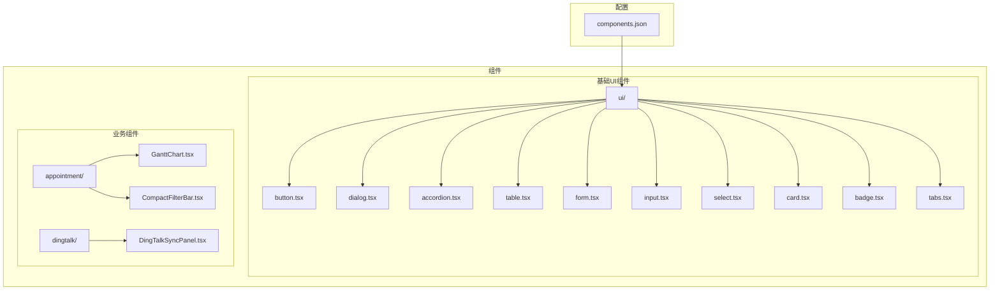
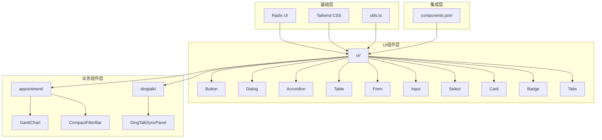
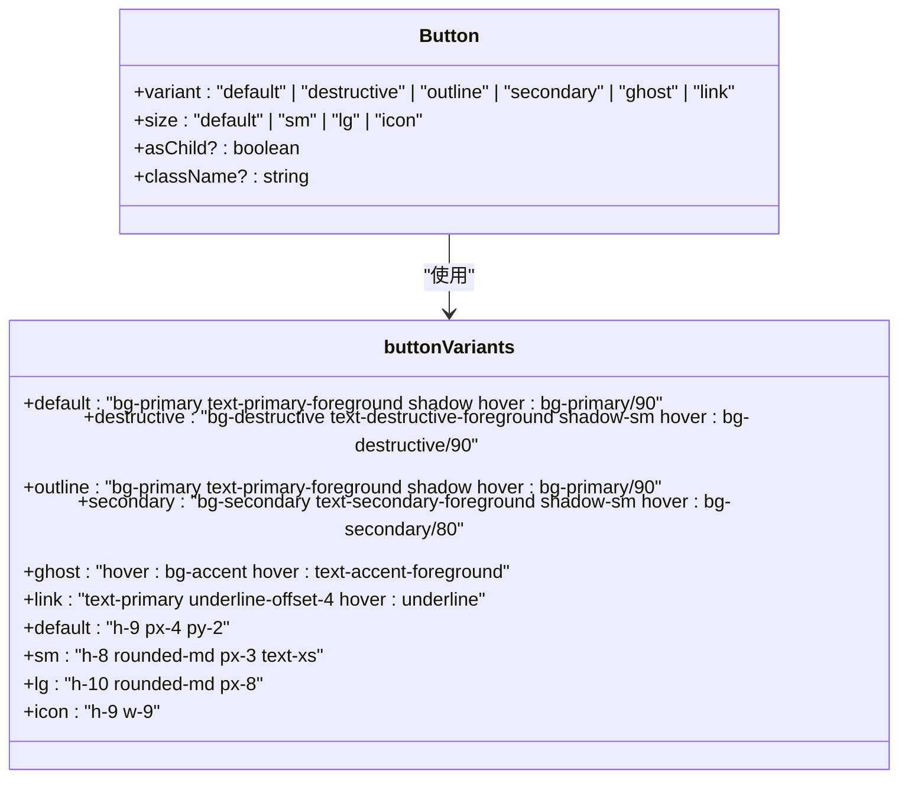
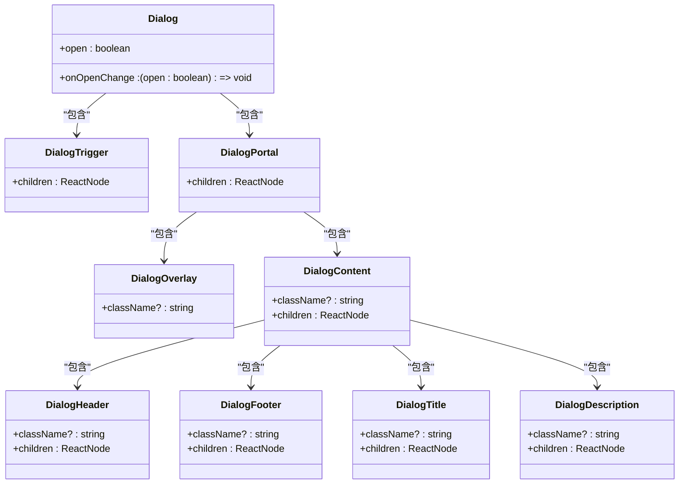
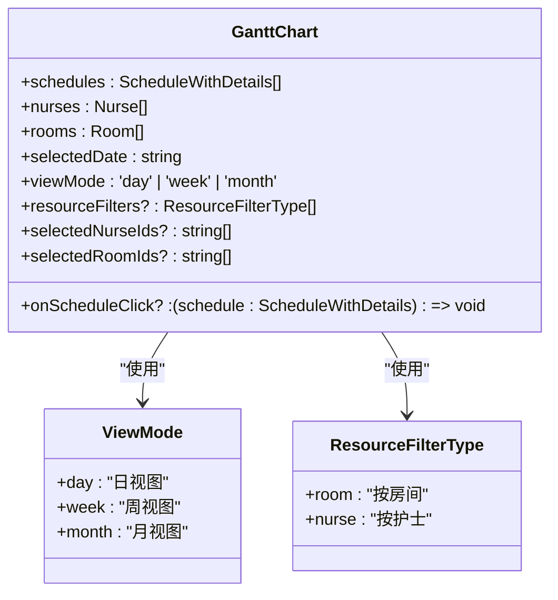
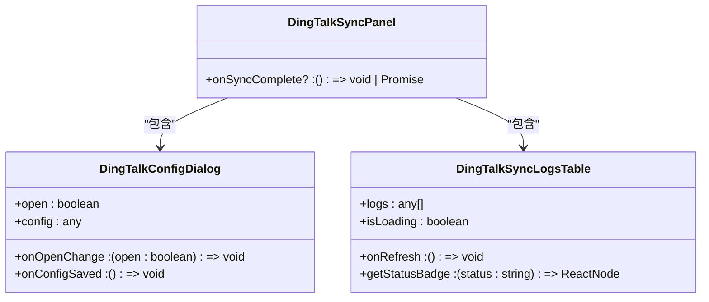
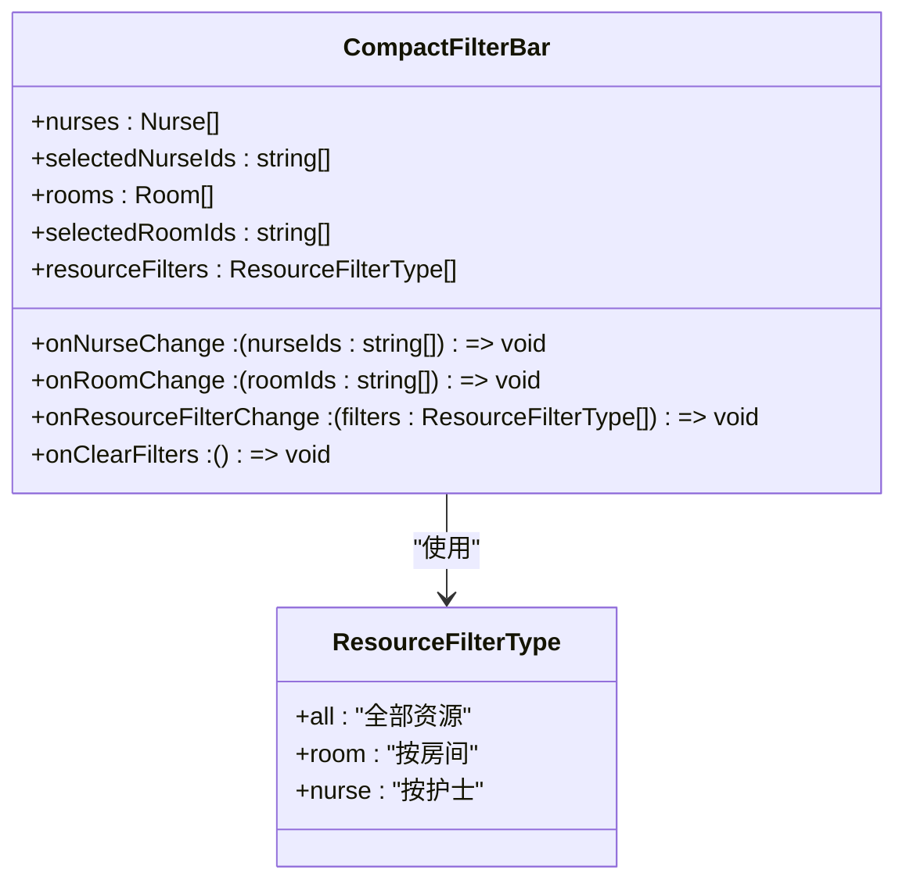
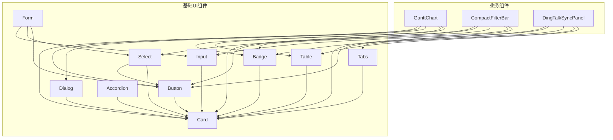

# UI组件库

<cite>
**本文档引用的文件**
- [button.tsx](file://src/components/ui/button.tsx)
- [dialog.tsx](file://src/components/ui/dialog.tsx)
- [GanttChart.tsx](file://src/components/appointment/GanttChart.tsx)
- [DingTalkSyncPanel.tsx](file://src/components/dingtalk/DingTalkSyncPanel.tsx)
- [components.json](file://components.json)
- [accordion.tsx](file://src/components/ui/accordion.tsx)
- [table.tsx](file://src/components/ui/table.tsx)
- [form.tsx](file://src/components/ui/form.tsx)
- [CompactFilterBar.tsx](file://src/components/appointment/CompactFilterBar.tsx)
- [input.tsx](file://src/components/ui/input.tsx)
- [select.tsx](file://src/components/ui/select.tsx)
- [card.tsx](file://src/components/ui/card.tsx)
- [badge.tsx](file://src/components/ui/badge.tsx)
- [tabs.tsx](file://src/components/ui/tabs.tsx)
</cite>

## 目录
1. [简介](#简介)
2. [项目结构](#项目结构)
3. [核心组件](#核心组件)
4. [架构概述](#架构概述)
5. [详细组件分析](#详细组件分析)
6. [依赖分析](#依赖分析)
7. [性能考虑](#性能考虑)
8. [故障排除指南](#故障排除指南)
9. [结论](#结论)
10. [附录](#附录)（如有必要）

## 简介
本文档全面介绍了基于React的UI组件库，该组件库分为基础UI组件和业务组件两大体系。文档详细描述了重要组件的视觉设计、交互行为、支持的属性、触发的事件和插槽，并提供代码示例展示其在不同场景下的用法。同时，文档解释了组件库如何通过components.json与设计工具集成，确保设计与开发的一致性。

## 项目结构
项目结构清晰地分为基础UI组件和业务组件两大类，通过合理的目录组织实现了组件的可维护性和可复用性。



**图源**
- [components.json](file://components.json)
- [src/components/ui/](file://src/components/ui/)
- [src/components/appointment/](file://src/components/appointment/)
- [src/components/dingtalk/](file://src/components/dingtalk/)

**本节来源**
- [components.json](file://components.json)
- [src/components/ui/](file://src/components/ui/)
- [src/components/appointment/](file://src/components/appointment/)
- [src/components/dingtalk/](file://src/components/dingtalk/)

## 核心组件
本组件库包含两大类核心组件：基础UI组件和业务组件。基础UI组件提供通用的界面元素，而业务组件则针对特定业务场景构建。

**本节来源**
- [src/components/ui/button.tsx](file://src/components/ui/button.tsx)
- [src/components/appointment/GanttChart.tsx](file://src/components/appointment/GanttChart.tsx)
- [src/components/dingtalk/DingTalkSyncPanel.tsx](file://src/components/dingtalk/DingTalkSyncPanel.tsx)

## 架构概述
组件库采用分层架构设计，基础UI组件基于Radix UI和Tailwind CSS构建，确保了组件的可访问性和样式一致性。业务组件则在基础组件之上构建，实现了特定业务功能。



**图源**
- [components.json](file://components.json)
- [src/components/ui/](file://src/components/ui/)
- [src/components/appointment/](file://src/components/appointment/)
- [src/components/dingtalk/](file://src/components/dingtalk/)
- [src/lib/utils.ts](file://src/lib/utils.ts)

## 详细组件分析
本节详细分析各个重要组件的设计、行为和使用方法。

### 基础UI组件分析
#### Button组件分析
Button组件是基础UI组件中的核心元素，提供多种变体和尺寸选项。



**图源**
- [button.tsx](file://src/components/ui/button.tsx)

**本节来源**
- [button.tsx](file://src/components/ui/button.tsx)

#### Dialog组件分析
Dialog组件提供模态对话框功能，包含多个子组件以实现完整的对话框体验。



**图源**
- [dialog.tsx](file://src/components/ui/dialog.tsx)

**本节来源**
- [dialog.tsx](file://src/components/ui/dialog.tsx)

#### 表单相关组件分析
表单组件体系基于react-hook-form构建，提供完整的表单处理能力。

```mermaid
classDiagram
class Form {
+children : ReactNode
}
class FormItem {
+children : ReactNode
}
class FormLabel {
+children : ReactNode
}
class FormControl {
+children : ReactNode
}
class FormDescription {
+children : ReactNode
}
class FormMessage {
+children : ReactNode
}
class FormField {
+name : string
+render : (props : { field : ControllerRenderProps }) => ReactNode
}
Form --> FormItem : "包含"
FormItem --> FormLabel : "包含"
FormItem --> FormControl : "包含"
FormItem --> FormDescription : "包含"
FormItem --> FormMessage : "包含"
Form --> FormField : "包含"
```

**图源**
- [form.tsx](file://src/components/ui/form.tsx)

**本节来源**
- [form.tsx](file://src/components/ui/form.tsx)

### 业务组件分析
#### GanttChart组件分析
GanttChart组件是预约管理系统的可视化核心，提供多种视图模式和筛选功能。



**图源**
- [GanttChart.tsx](file://src/components/appointment/GanttChart.tsx)

**本节来源**
- [GanttChart.tsx](file://src/components/appointment/GanttChart.tsx)

#### DingTalkSyncPanel组件分析
DingTalkSyncPanel组件提供钉钉组织架构同步功能，包含配置、同步和日志查看等完整功能。



**图源**
- [DingTalkSyncPanel.tsx](file://src/components/dingtalk/DingTalkSyncPanel.tsx)

**本节来源**
- [DingTalkSyncPanel.tsx](file://src/components/dingtalk/DingTalkSyncPanel.tsx)

#### CompactFilterBar组件分析
CompactFilterBar组件提供紧凑的筛选栏功能，支持护士、房间和资源类型的筛选。



**图源**
- [CompactFilterBar.tsx](file://src/components/appointment/CompactFilterBar.tsx)

**本节来源**
- [CompactFilterBar.tsx](file://src/components/appointment/CompactFilterBar.tsx)

## 依赖分析
组件库的依赖关系清晰，基础组件之间相互独立，业务组件依赖于基础组件。



**图源**
- [src/components/ui/](file://src/components/ui/)
- [src/components/appointment/](file://src/components/appointment/)
- [src/components/dingtalk/](file://src/components/dingtalk/)

**本节来源**
- [src/components/ui/](file://src/components/ui/)
- [src/components/appointment/](file://src/components/appointment/)
- [src/components/dingtalk/](file://src/components/dingtalk/)

## 性能考虑
组件库在性能方面进行了优化，确保在大规模数据场景下的流畅体验。

- **虚拟滚动**: 在长列表场景中使用ScrollArea组件实现虚拟滚动，减少DOM节点数量
- **懒加载**: 对话框组件采用条件渲染，只有在打开时才创建DOM节点
- **memoization**: 使用React.memo对纯组件进行记忆化，避免不必要的重渲染
- **事件委托**: 在表格等复杂组件中使用事件委托，减少事件监听器数量
- **防抖**: 在输入组件中实现防抖，避免频繁的状态更新

**本节来源**
- [src/components/ui/scroll-area.tsx](file://src/components/ui/scroll-area.tsx)
- [src/components/ui/dialog.tsx](file://src/components/ui/dialog.tsx)
- [src/components/ui/input.tsx](file://src/components/ui/input.tsx)

## 故障排除指南
本节提供常见问题的解决方案和最佳实践。

### 组件集成问题
当组件无法正确显示或行为异常时，请检查以下事项：

1. **检查依赖**: 确保所有必要的依赖包已正确安装
2. **检查样式**: 确保Tailwind CSS已正确配置并应用
3. **检查别名**: 确保components.json中的别名配置正确
4. **检查版本**: 确保Radix UI和其他依赖库版本兼容

### 样式问题
当组件样式不符合预期时：

1. **检查components.json**: 确认style配置是否正确
2. **检查Tailwind配置**: 确认tailwind.config.mjs配置是否正确
3. **检查CSS变量**: 确认CSS变量是否正确设置
4. **检查主题**: 确认是否正确应用了主题

### 交互问题
当组件交互行为异常时：

1. **检查事件处理**: 确认事件处理函数是否正确绑定
2. **检查状态管理**: 确认组件状态是否正确更新
3. **检查异步操作**: 确认异步操作是否正确处理
4. **检查错误边界**: 确认是否有未捕获的错误

**本节来源**
- [components.json](file://components.json)
- [tailwind.config.js](file://tailwind.config.js)
- [src/lib/utils.ts](file://src/lib/utils.ts)

## 结论
本文档全面介绍了UI组件库的设计、实现和使用方法。组件库采用分层架构，基础UI组件提供可复用的界面元素，业务组件则针对特定业务场景构建。通过components.json配置文件，实现了与设计工具的集成，确保了设计与开发的一致性。组件库遵循最佳实践，在可访问性、性能和可维护性方面都进行了优化，为构建高质量的用户界面提供了坚实的基础。

## 附录
### 组件使用最佳实践
1. **一致性**: 在整个应用中保持组件使用的一致性
2. **可访问性**: 确保所有组件都符合可访问性标准
3. **响应式**: 确保组件在不同屏幕尺寸下都能正常显示
4. **国际化**: 考虑组件的国际化支持
5. **测试**: 为关键组件编写单元测试和集成测试

### 设计系统集成
components.json文件是连接设计系统和开发实现的桥梁，通过该文件可以：

1. **统一配置**: 集中管理组件库的配置
2. **样式一致**: 确保设计和开发使用相同的样式配置
3. **快速迭代**: 通过配置文件快速调整组件样式
4. **团队协作**: 为设计和开发团队提供共同的参考

**本节来源**
- [components.json](file://components.json)
- [tailwind.config.js](file://tailwind.config.js)
- [src/lib/utils.ts](file://src/lib/utils.ts)