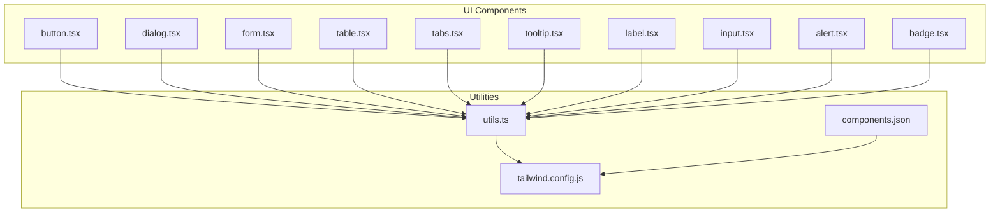
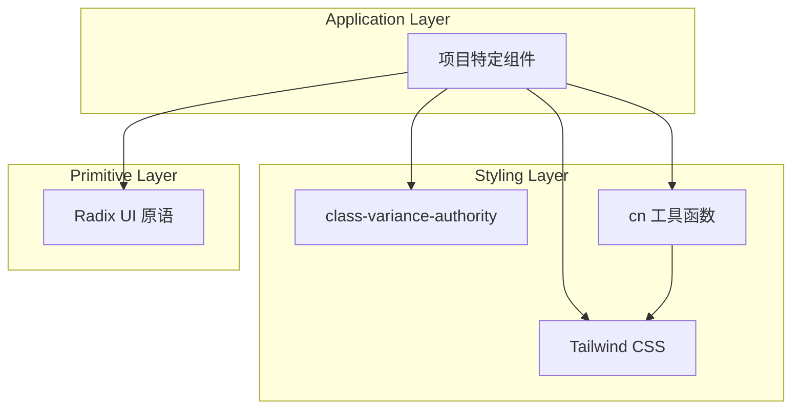
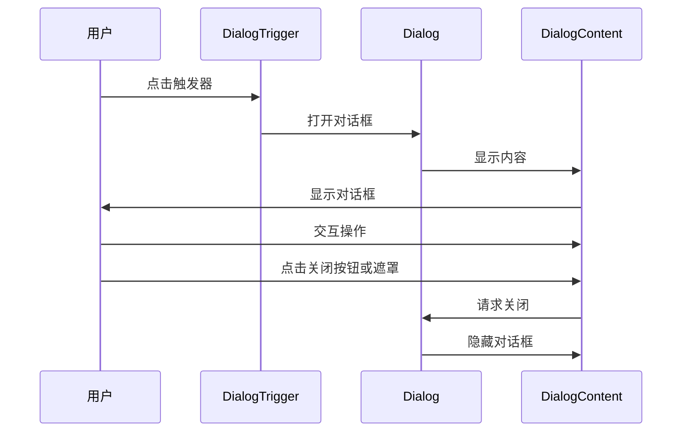
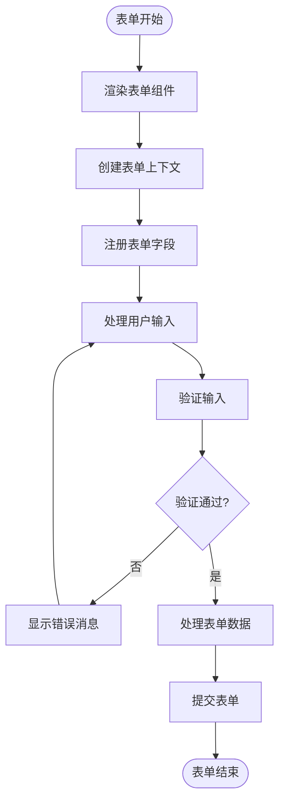
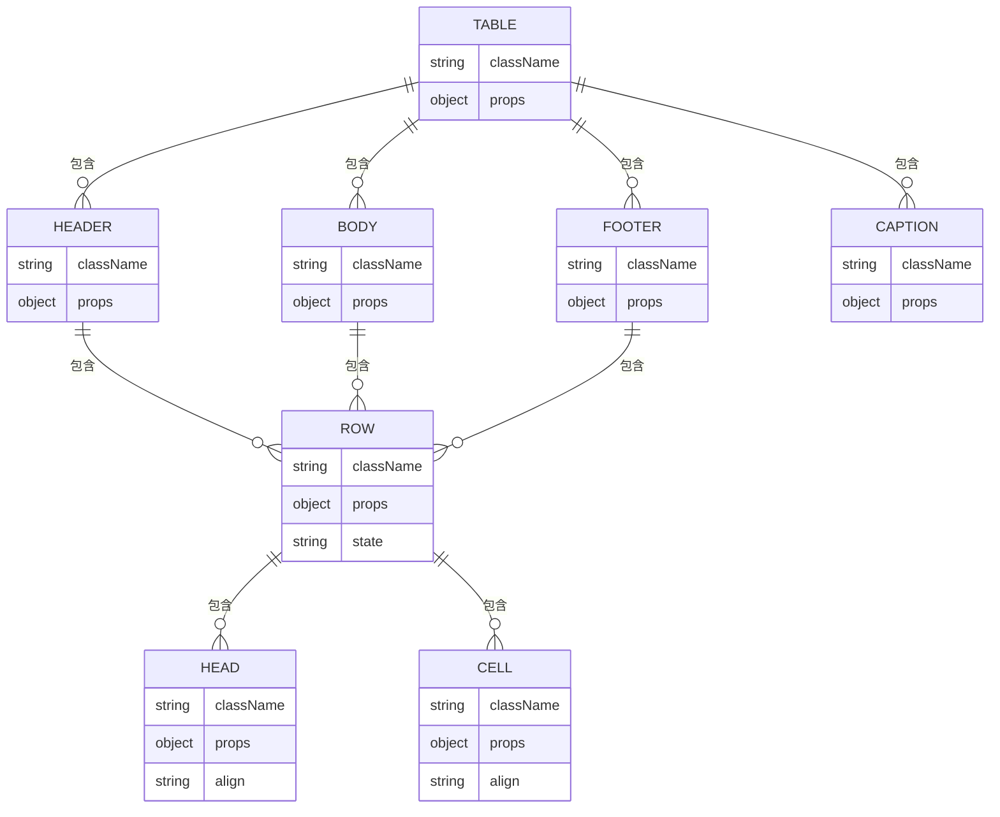
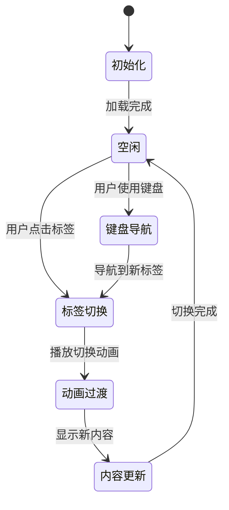
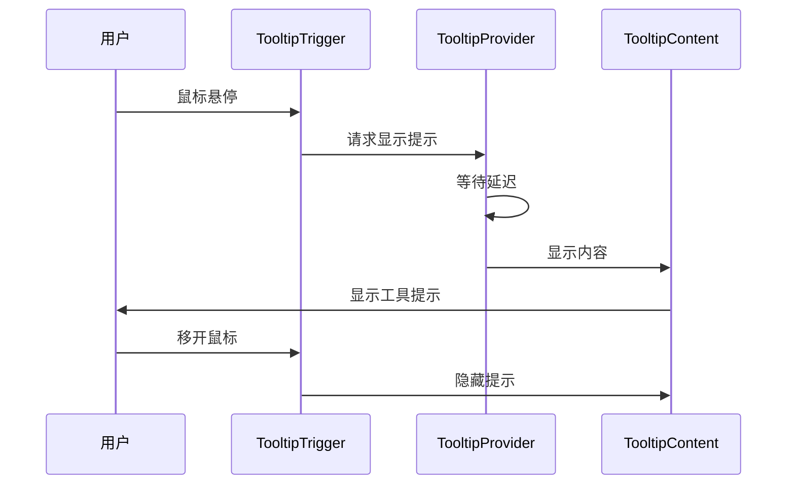
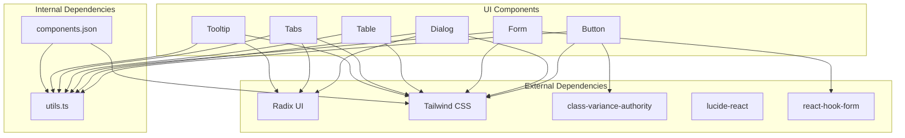

# 基础UI组件

<cite>
**本文档中引用的文件**   
- [button.tsx](file://src/components/ui/button.tsx)
- [dialog.tsx](file://src/components/ui/dialog.tsx)
- [form.tsx](file://src/components/ui/form.tsx)
- [table.tsx](file://src/components/ui/table.tsx)
- [tabs.tsx](file://src/components/ui/tabs.tsx)
- [tooltip.tsx](file://src/components/ui/tooltip.tsx)
- [label.tsx](file://src/components/ui/label.tsx)
- [input.tsx](file://src/components/ui/input.tsx)
- [alert.tsx](file://src/components/ui/alert.tsx)
- [badge.tsx](file://src/components/ui/badge.tsx)
- [utils.ts](file://src/lib/utils.ts)
- [components.json](file://components.json)
- [tailwind.config.js](file://tailwind.config.js)
</cite>

## 目录
1. [简介](#简介)
2. [项目结构](#项目结构)
3. [核心组件](#核心组件)
4. [架构概述](#架构概述)
5. [详细组件分析](#详细组件分析)
6. [依赖分析](#依赖分析)
7. [性能考虑](#性能考虑)
8. [故障排除指南](#故障排除指南)
9. [结论](#结论)
10. [附录](#附录)（如有必要）

## 简介
本文档详细介绍了Bio-Appointment项目中的基础UI组件，这些组件位于`src/components/ui/`目录下。文档重点介绍Button、Dialog、Form、Table、Tabs和Tooltip等核心原子级组件，涵盖其视觉样式、交互行为、支持的props、触发的events和插槽机制。通过实际代码示例展示这些组件在不同业务场景下的使用方式，并解释它们如何通过Tailwind CSS实现主题定制，以及如何通过components.json与设计系统集成，确保开发与设计稿的一致性。

## 项目结构
项目中的UI组件采用模块化设计，所有基础UI组件都位于`src/components/ui/`目录下。每个组件都有独立的文件，遵循一致的命名规范和实现模式。这些组件基于Radix UI构建，结合Tailwind CSS进行样式设计，使用class-variance-authority（cva）管理变体，确保了组件的一致性和可维护性。



**Diagram sources**
- [button.tsx](file://src/components/ui/button.tsx)
- [dialog.tsx](file://src/components/ui/dialog.tsx)
- [form.tsx](file://src/components/ui/form.tsx)
- [table.tsx](file://src/components/ui/table.tsx)
- [tabs.tsx](file://src/components/ui/tabs.tsx)
- [tooltip.tsx](file://src/components/ui/tooltip.tsx)
- [utils.ts](file://src/lib/utils.ts)
- [components.json](file://components.json)
- [tailwind.config.js](file://tailwind.config.js)

**Section sources**
- [src/components/ui/](file://src/components/ui/)
- [components.json](file://components.json)
- [tailwind.config.js](file://tailwind.config.js)

## 核心组件
本项目的基础UI组件库提供了丰富的原子级组件，用于构建一致且可访问的用户界面。这些组件基于Radix UI原语构建，确保了最佳的可访问性和交互行为。所有组件都使用Tailwind CSS进行样式设计，并通过`cn`工具函数合并类名，支持灵活的样式定制。

**Section sources**
- [src/components/ui/](file://src/components/ui/)
- [utils.ts](file://src/lib/utils.ts)

## 架构概述
UI组件架构基于分层设计模式，将组件实现分为三个主要层次：基础原语层（Radix UI）、样式层（Tailwind CSS）和应用层（项目特定实现）。这种架构确保了组件的高度可复用性和一致性，同时允许项目特定的定制。



**Diagram sources**
- [button.tsx](file://src/components/ui/button.tsx)
- [dialog.tsx](file://src/components/ui/dialog.tsx)
- [form.tsx](file://src/components/ui/form.tsx)
- [utils.ts](file://src/lib/utils.ts)

## 详细组件分析
本节将深入分析项目中的核心UI组件，包括Button、Dialog、Form、Table、Tabs和Tooltip。每个组件的分析将涵盖其视觉样式、交互行为、支持的props、触发的events和插槽机制。

### Button组件分析
Button组件是项目中最常用的交互元素之一，提供多种变体和尺寸选项，满足不同的UI需求。

#### 视觉样式和变体
Button组件通过`buttonVariants`常量定义了多种视觉变体，包括：
- **默认**：主色调背景，用于主要操作
- **破坏性**：红色背景，用于删除或危险操作
- **轮廓**：边框样式，用于次要操作
- **次要**：浅色背景，用于辅助操作
- **幽灵**：透明背景，悬停时显示背景
- **链接**：文本链接样式

#### 尺寸选项
Button组件支持四种尺寸：
- **默认**：标准尺寸
- **小号**：较小尺寸，用于紧凑布局
- **大号**：较大尺寸，用于重要操作
- **图标**：正方形尺寸，主要用于图标按钮

#### Props和Events
Button组件支持标准的HTML按钮属性，以及自定义的`variant`、`size`和`asChild`属性。`asChild`属性允许将样式应用到子组件上，实现更灵活的组合。

```mermaid
classDiagram
class Button {
+variant : "default"|"destructive"|"outline"|"secondary"|"ghost"|"link"
+size : "default"|"sm"|"lg"|"icon"
+asChild? : boolean
+className? : string
+onClick? : function
+disabled? : boolean
}
Button --> "cva" : 使用
Button --> "cn" : 使用
Button --> "Slot" : 条件使用
```

**Diagram sources**
- [button.tsx](file://src/components/ui/button.tsx)

**Section sources**
- [button.tsx](file://src/components/ui/button.tsx)

### Dialog组件分析
Dialog组件提供模态对话框功能，用于显示重要信息或获取用户输入。

#### 组件结构
Dialog组件由多个子组件组成，形成一个完整的对话框系统：
- **Dialog**：根组件，管理对话框的打开状态
- **DialogTrigger**：触发对话框打开的元素
- **DialogContent**：对话框的内容区域
- **DialogHeader**：对话框的头部区域
- **DialogTitle**：对话框的标题
- **DialogDescription**：对话框的描述文本
- **DialogFooter**：对话框的底部区域
- **DialogClose**：关闭对话框的按钮

#### 交互行为
Dialog组件实现了标准的模态对话框交互模式：
- 背景遮罩点击可关闭对话框
- ESC键可关闭对话框
- 自动管理焦点，确保可访问性
- 支持动画过渡效果



**Diagram sources**
- [dialog.tsx](file://src/components/ui/dialog.tsx)

**Section sources**
- [dialog.tsx](file://src/components/ui/dialog.tsx)

### Form组件分析
Form组件基于react-hook-form构建，提供了一套完整的表单处理解决方案。

#### 组件组成
Form组件系统由多个协同工作的组件组成：
- **Form**：表单根组件，提供上下文
- **FormField**：字段包装器，连接react-hook-form控制器
- **FormItem**：字段容器，管理布局
- **FormLabel**：字段标签
- **FormControl**：表单控件包装器
- **FormDescription**：字段描述文本
- **FormMessage**：表单验证消息

#### 表单状态管理
Form组件通过React Context和react-hook-form的API管理表单状态，包括：
- 字段值
- 验证状态
- 错误消息
- 提交状态



**Diagram sources**
- [form.tsx](file://src/components/ui/form.tsx)

**Section sources**
- [form.tsx](file://src/components/ui/form.tsx)

### Table组件分析
Table组件提供数据表格功能，用于展示结构化数据。

#### 组件结构
Table组件由多个语义化组件组成：
- **Table**：表格根组件
- **TableHeader**：表头区域
- **TableBody**：表体区域
- **TableFooter**：表脚区域
- **TableRow**：表格行
- **TableHead**：表头单元格
- **TableCell**：表格数据单元格
- **TableCaption**：表格标题

#### 交互特性
Table组件支持以下交互特性：
- 行悬停效果
- 行选择状态
- 响应式设计
- 可访问性支持



**Diagram sources**
- [table.tsx](file://src/components/ui/table.tsx)

**Section sources**
- [table.tsx](file://src/components/ui/table.tsx)

### Tabs组件分析
Tabs组件提供标签页功能，用于组织相关内容。

#### 组件组成
Tabs组件系统包括：
- **Tabs**：标签页根组件
- **TabsList**：标签列表容器
- **TabsTrigger**：标签触发器
- **TabsContent**：标签内容区域

#### 状态管理
Tabs组件管理以下状态：
- 当前激活的标签
- 标签间的切换动画
- 键盘导航支持



**Diagram sources**
- [tabs.tsx](file://src/components/ui/tabs.tsx)

**Section sources**
- [tabs.tsx](file://src/components/ui/tabs.tsx)

### Tooltip组件分析
Tooltip组件提供工具提示功能，用于显示额外的信息。

#### 组件结构
Tooltip组件系统包括：
- **Tooltip**：工具提示根组件
- **TooltipTrigger**：触发器元素
- **TooltipContent**：提示内容
- **TooltipProvider**：提供全局配置

#### 交互行为
Tooltip组件实现以下交互模式：
- 鼠标悬停显示
- 焦点显示（可访问性）
- 延迟显示
- 箭头定位



**Diagram sources**
- [tooltip.tsx](file://src/components/ui/tooltip.tsx)

**Section sources**
- [tooltip.tsx](file://src/components/ui/tooltip.tsx)

## 依赖分析
UI组件库依赖于多个关键的第三方库和项目内部工具，形成了一个完整的生态系统。



**Diagram sources**
- [components.json](file://components.json)
- [tailwind.config.js](file://tailwind.config.js)
- [utils.ts](file://src/lib/utils.ts)

**Section sources**
- [components.json](file://components.json)
- [tailwind.config.js](file://tailwind.config.js)
- [src/lib/utils.ts](file://src/lib/utils.ts)

## 性能考虑
在使用这些UI组件时，需要注意以下性能优化建议：

1. **按需导入**：只导入实际使用的组件，避免不必要的代码打包
2. **避免过度嵌套**：合理使用组件组合，避免深层嵌套导致的性能问题
3. **虚拟滚动**：对于大型数据表格，考虑实现虚拟滚动
4. **懒加载**：对于不立即显示的对话框内容，使用懒加载
5. **memoization**：对于复杂的表单或表格，使用React.memo进行优化

## 故障排除指南
在使用UI组件时可能遇到的常见问题及解决方案：

1. **样式不生效**：检查tailwind.config.js配置和components.json设置
2. **交互无响应**：确保组件正确使用，特别是Dialog和Tabs的状态管理
3. **可访问性问题**：检查ARIA属性和键盘导航支持
4. **响应式问题**：验证Tailwind CSS断点设置和媒体查询

**Section sources**
- [tailwind.config.js](file://tailwind.config.js)
- [components.json](file://components.json)

## 结论
本文档详细介绍了Bio-Appointment项目的基础UI组件系统。该系统基于现代前端最佳实践构建，提供了丰富、一致且可访问的UI组件。通过Radix UI原语、Tailwind CSS样式和项目特定的封装，这些组件既保持了高度的可复用性，又满足了项目的特定需求。建议在开发中优先使用这些基础组件，以确保UI的一致性和质量。