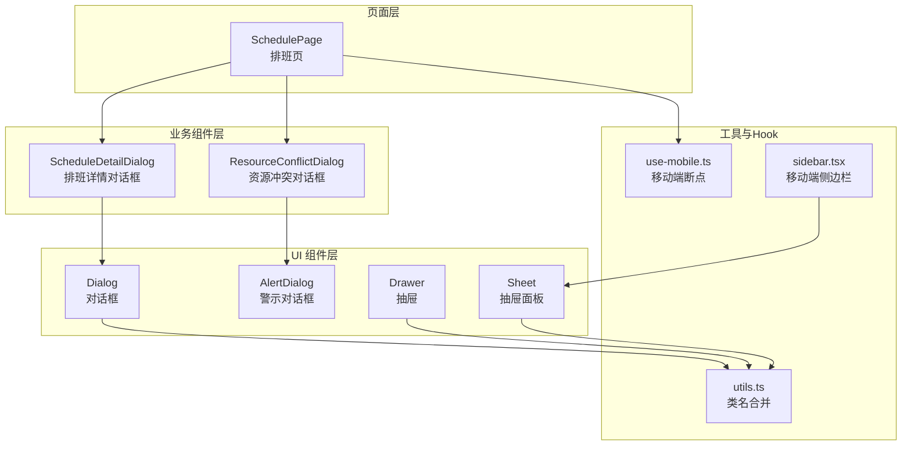
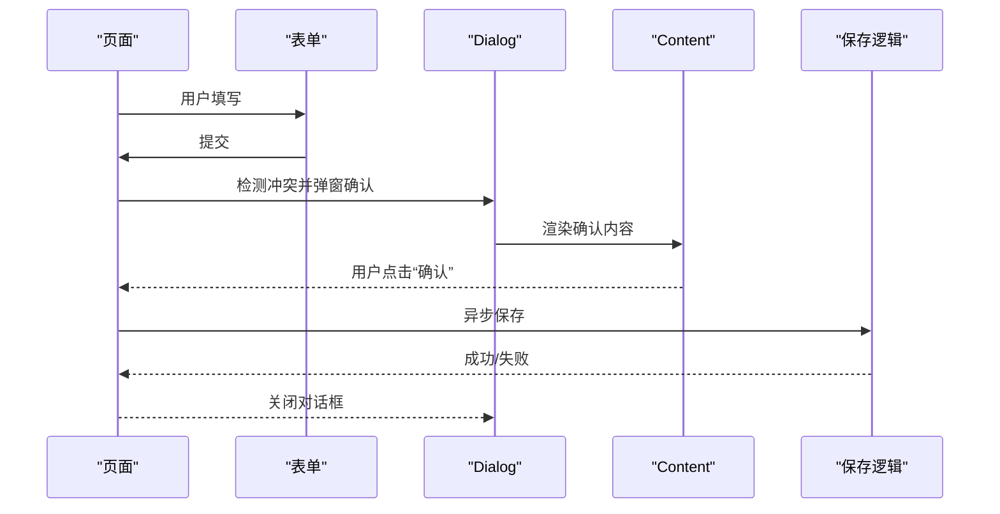
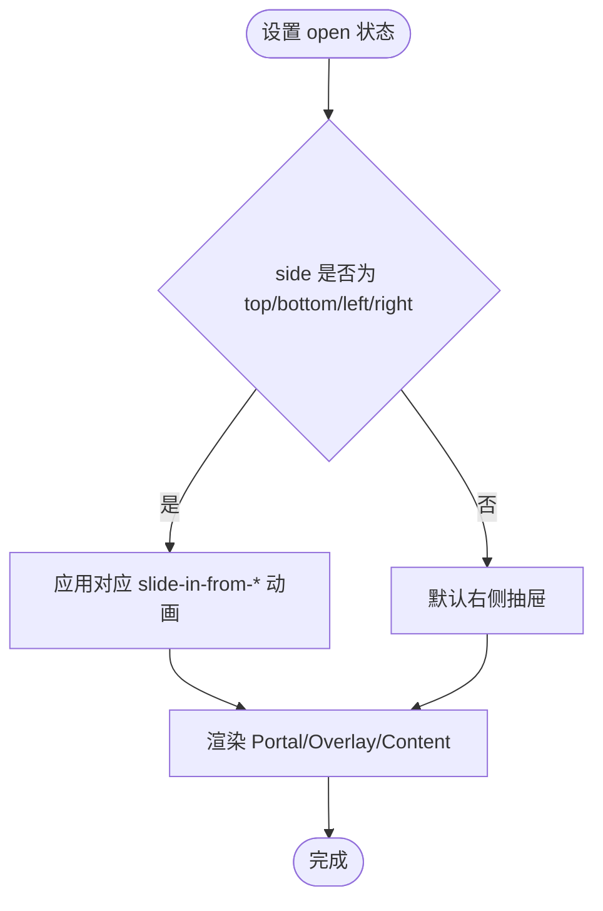
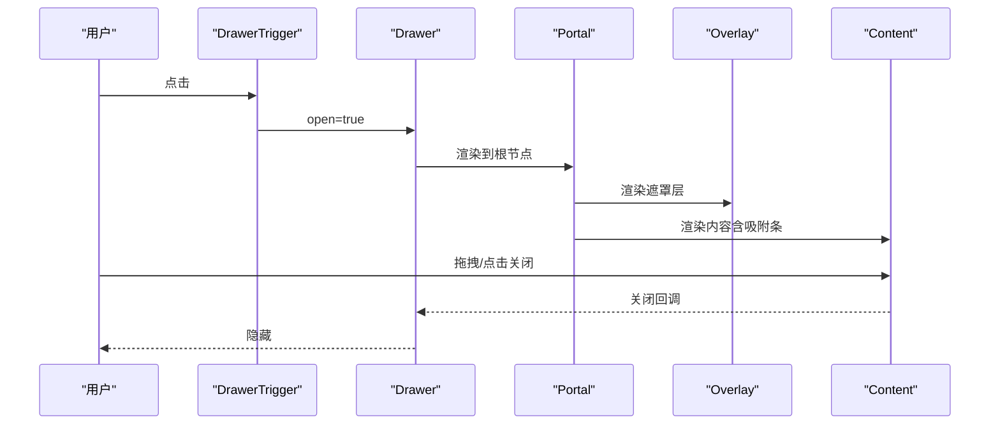
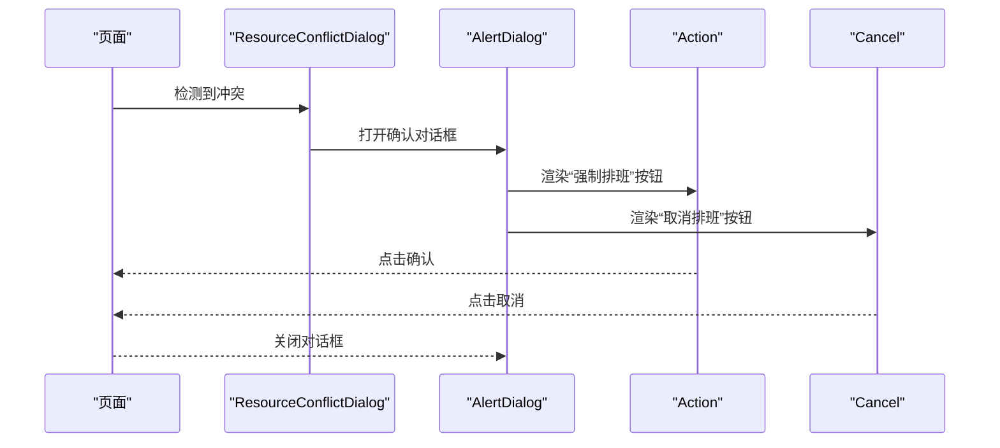
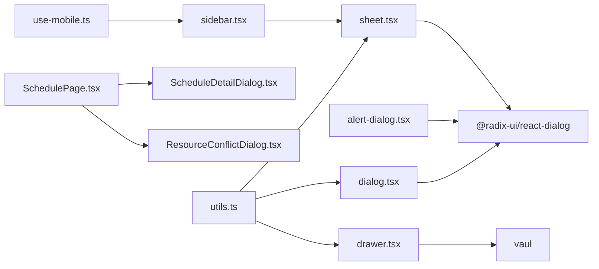

# 对话框组件 (Dialog)

<cite>
**本文引用的文件**
- [dialog.tsx](file://src/components/ui/dialog.tsx)
- [sheet.tsx](file://src/components/ui/sheet.tsx)
- [drawer.tsx](file://src/components/ui/drawer.tsx)
- [alert-dialog.tsx](file://src/components/ui/alert-dialog.tsx)
- [ScheduleDetailDialog.tsx](file://src/components/appointment/ScheduleDetailDialog.tsx)
- [ResourceConflictDialog.tsx](file://src/components/appointment/ResourceConflictDialog.tsx)
- [SchedulePage.tsx](file://src/pages/head-nurse/SchedulePage.tsx)
- [use-mobile.ts](file://src/hooks/use-mobile.ts)
- [utils.ts](file://src/lib/utils.ts)
- [sidebar.tsx](file://src/components/ui/sidebar.tsx)
</cite>

## 目录
1. [简介](#简介)
2. [项目结构](#项目结构)
3. [核心组件](#核心组件)
4. [架构总览](#架构总览)
5. [组件详解](#组件详解)
6. [依赖关系分析](#依赖关系分析)
7. [性能考量](#性能考量)
8. [故障排查指南](#故障排查指南)
9. [结论](#结论)
10. [附录](#附录)

## 简介
本文件系统性梳理项目中的三种模态交互组件：Dialog（对话框）、Sheet（抽屉面板）与 Drawer（抽屉），覆盖触发机制、打开/关闭动画、遮罩层行为、受控与非受控模式、核心 props、事件回调、嵌套表单与异步提交、响应式布局、移动端适配策略、Portal 层级管理、无障碍访问与滚动穿透解决方案等。同时结合实际业务场景（如 ScheduleDetailDialog、ResourceConflictDialog）给出实践建议与最佳实践。

## 项目结构
- 组件层位于 src/components/ui，分别封装了 Dialog、Sheet、Drawer 及 AlertDialog 等基础 UI 组件。
- 业务层位于 src/components/appointment，包含 ScheduleDetailDialog、ResourceConflictDialog 等业务对话框。
- 页面层位于 src/pages/head-nurse，SchedulePage.tsx 展示了如何在真实业务中组织表单、检测冲突、弹窗确认与异步提交。
- 工具与 Hook：src/lib/utils 提供类名合并工具；src/hooks/use-mobile 提供移动端断点判断；src/components/ui/sidebar.tsx 展示了在移动端以 Sheet 承载侧边栏的实践。



图表来源
- [dialog.tsx](file://src/components/ui/dialog.tsx#L1-L136)
- [sheet.tsx](file://src/components/ui/sheet.tsx#L1-L141)
- [drawer.tsx](file://src/components/ui/drawer.tsx#L1-L131)
- [alert-dialog.tsx](file://src/components/ui/alert-dialog.tsx#L1-L156)
- [ScheduleDetailDialog.tsx](file://src/components/appointment/ScheduleDetailDialog.tsx#L1-L175)
- [ResourceConflictDialog.tsx](file://src/components/appointment/ResourceConflictDialog.tsx#L1-L93)
- [SchedulePage.tsx](file://src/pages/head-nurse/SchedulePage.tsx#L1-L200)
- [use-mobile.ts](file://src/hooks/use-mobile.ts#L1-L19)
- [utils.ts](file://src/lib/utils.ts#L1-L40)
- [sidebar.tsx](file://src/components/ui/sidebar.tsx#L181-L204)

章节来源
- [dialog.tsx](file://src/components/ui/dialog.tsx#L1-L136)
- [sheet.tsx](file://src/components/ui/sheet.tsx#L1-L141)
- [drawer.tsx](file://src/components/ui/drawer.tsx#L1-L131)
- [alert-dialog.tsx](file://src/components/ui/alert-dialog.tsx#L1-L156)
- [ScheduleDetailDialog.tsx](file://src/components/appointment/ScheduleDetailDialog.tsx#L1-L175)
- [ResourceConflictDialog.tsx](file://src/components/appointment/ResourceConflictDialog.tsx#L1-L93)
- [SchedulePage.tsx](file://src/pages/head-nurse/SchedulePage.tsx#L1-L200)
- [use-mobile.ts](file://src/hooks/use-mobile.ts#L1-L19)
- [utils.ts](file://src/lib/utils.ts#L1-L40)
- [sidebar.tsx](file://src/components/ui/sidebar.tsx#L181-L204)

## 核心组件
- Dialog：基于 Radix UI 的可访问性对话框，支持受控/非受控模式、Portal 层级、遮罩层动画与关闭按钮。
- Sheet：基于 Radix UI 的抽屉面板，支持从 top/bottom/left/right 多方向滑入，适合移动端或侧边导航。
- Drawer：基于 vaul 的抽屉，支持手势拖拽、吸附条、多方向定位，适合移动端场景。
- AlertDialog：用于关键操作确认（如强制排班），与 AlertDialogContent/Action/Cancel 等组合使用。

章节来源
- [dialog.tsx](file://src/components/ui/dialog.tsx#L1-L136)
- [sheet.tsx](file://src/components/ui/sheet.tsx#L1-L141)
- [drawer.tsx](file://src/components/ui/drawer.tsx#L1-L131)
- [alert-dialog.tsx](file://src/components/ui/alert-dialog.tsx#L1-L156)

## 架构总览
三种模态组件均采用 Portal 将内容挂载到文档根节点，确保层级与 z-index 正确，避免被父容器裁剪或层级覆盖。Dialog 与 AlertDialog 使用 Radix UI 的 Root/Portal/Overlay/Content 结构；Sheet 使用 Radix UI 的变体（cva）控制方向；Drawer 使用 vaul 库实现手势与吸附。

```mermaid
sequenceDiagram
participant U as "用户"
participant BTN as "触发按钮"
participant DLG as "Dialog/Sheet/Drawer"
participant PORTAL as "Portal"
participant OVER as "遮罩层 Overlay"
participant CONTENT as "内容 Content"
U->>BTN : 点击
BTN->>DLG : 设置 open=true 或调用 open
DLG->>PORTAL : 渲染到文档根节点
PORTAL->>OVER : 渲染遮罩层
PORTAL->>CONTENT : 渲染内容区域
U->>CONTENT : 操作提交/确认/关闭
CONTENT-->>DLG : 关闭回调
DLG-->>U : 隐藏并清理焦点
```

图表来源
- [dialog.tsx](file://src/components/ui/dialog.tsx#L1-L136)
- [sheet.tsx](file://src/components/ui/sheet.tsx#L1-L141)
- [drawer.tsx](file://src/components/ui/drawer.tsx#L1-L131)

## 组件详解

### Dialog（对话框）
- 触发机制：通过 DialogTrigger 包裹按钮，点击后由 Dialog 控制 open 状态。
- 打开/关闭动画：通过 data-state 属性驱动 fade-in/zoom-in 与 fade-out/zoom-out 动画。
- 遮罩层行为：Overlay 固定全屏，带透明度与淡入淡出过渡。
- 受控/非受控：通过 open/onOpenChange 实现受控；若仅传入 open 则为非受控。
- 核心 props：
  - open：布尔值，控制是否显示
  - onOpenChange：回调，接收布尔值，用于更新外部状态
  - 其他：Portal、Overlay、Content、Title、Description、Header/Footer 等子组件按需组合
- 事件回调：
  - onOpenAutoFocus：Radix UI 原生回调，控制打开时自动聚焦元素
  - onCloseAutoFocus：Radix UI 原生回调，控制关闭时返回焦点元素
- 无障碍与滚动：
  - 内置自动焦点管理（onOpenAutoFocus/onCloseAutoFocus）
  - 遮罩层阻止背景滚动（由 Radix UI 行为保证）
- 示例路径：
  - [ScheduleDetailDialog.tsx](file://src/components/appointment/ScheduleDetailDialog.tsx#L60-L172)
  - [SchedulePage.tsx 中的表单与提交流程](file://src/pages/head-nurse/SchedulePage.tsx#L167-L200)



图表来源
- [ScheduleDetailDialog.tsx](file://src/components/appointment/ScheduleDetailDialog.tsx#L60-L172)
- [SchedulePage.tsx](file://src/pages/head-nurse/SchedulePage.tsx#L167-L200)

章节来源
- [dialog.tsx](file://src/components/ui/dialog.tsx#L1-L136)
- [ScheduleDetailDialog.tsx](file://src/components/appointment/ScheduleDetailDialog.tsx#L1-L175)
- [SchedulePage.tsx](file://src/pages/head-nurse/SchedulePage.tsx#L167-L200)

### Sheet（抽屉面板）
- 触发机制：SheetTrigger 包裹按钮，open/onOpenChange 控制显示。
- 方向控制：通过 side 参数选择 top/bottom/left/right，配合 slide-in/out 动画。
- 受控/非受控：open/onOpenChange 实现受控；默认右侧抽屉。
- 核心 props：
  - open、onOpenChange：受控开关
  - side：抽屉方向（top/bottom/left/right）
  - 其他：Portal、Overlay、Content、Header/Footer、Title/Description
- 无障碍与滚动：Overlay 与 Content 均具备 Radix UI 的可访问性行为。
- 移动端适配：在移动端侧边栏中以 Sheet 承载，侧边宽度与样式通过 CSS 变量与类名控制。
- 示例路径：
  - [sidebar.tsx 中的移动端侧边栏实现](file://src/components/ui/sidebar.tsx#L181-L204)



图表来源
- [sheet.tsx](file://src/components/ui/sheet.tsx#L1-L141)
- [sidebar.tsx](file://src/components/ui/sidebar.tsx#L181-L204)

章节来源
- [sheet.tsx](file://src/components/ui/sheet.tsx#L1-L141)
- [sidebar.tsx](file://src/components/ui/sidebar.tsx#L181-L204)

### Drawer（抽屉）
- 触发机制：DrawerTrigger 包裹按钮，open/onOpenChange 控制显示。
- 手势与吸附：基于 vaul，支持从 top/bottom/left/right 拖拽进入，底部提供吸附条。
- 受控/非受控：open/onOpenChange 实现受控。
- 核心 props：
  - open、onOpenChange：受控开关
  - 其他：Portal、Overlay、Content、Header/Footer、Title/Description
- 无障碍与滚动：Overlay 与 Content 均具备 Radix UI 的可访问性行为。
- 示例路径：
  - [drawer.tsx](file://src/components/ui/drawer.tsx#L1-L131)



图表来源
- [drawer.tsx](file://src/components/ui/drawer.tsx#L1-L131)

章节来源
- [drawer.tsx](file://src/components/ui/drawer.tsx#L1-L131)

### AlertDialog（警示对话框）
- 用途：用于关键操作确认（如强制排班），与 Action/Cancel 组合使用。
- 核心 props：
  - open、onOpenChange：受控开关
  - 其他：Portal、Overlay、Content、Header/Footer、Title/Description
- 事件回调：
  - onOpenAutoFocus、onCloseAutoFocus：Radix UI 原生回调
- 示例路径：
  - [ResourceConflictDialog.tsx](file://src/components/appointment/ResourceConflictDialog.tsx#L1-L93)



图表来源
- [alert-dialog.tsx](file://src/components/ui/alert-dialog.tsx#L1-L156)
- [ResourceConflictDialog.tsx](file://src/components/appointment/ResourceConflictDialog.tsx#L1-L93)

章节来源
- [alert-dialog.tsx](file://src/components/ui/alert-dialog.tsx#L1-L156)
- [ResourceConflictDialog.tsx](file://src/components/appointment/ResourceConflictDialog.tsx#L1-L93)

## 依赖关系分析
- 组件依赖：
  - Dialog/AlertDialog 基于 @radix-ui/react-dialog
  - Sheet 基于 @radix-ui/react-dialog，使用 class-variance-authority 控制变体
  - Drawer 基于 vaul
  - 类名合并统一使用 src/lib/utils.ts 的 cn
- 业务依赖：
  - ScheduleDetailDialog 依赖 Dialog 子组件与 ScrollArea
  - ResourceConflictDialog 依赖 AlertDialog 子组件
  - SchedulePage 在业务层组织表单、冲突检测与异步提交
  - sidebar.tsx 在移动端使用 Sheet 承载侧边栏



图表来源
- [utils.ts](file://src/lib/utils.ts#L1-L40)
- [dialog.tsx](file://src/components/ui/dialog.tsx#L1-L136)
- [sheet.tsx](file://src/components/ui/sheet.tsx#L1-L141)
- [drawer.tsx](file://src/components/ui/drawer.tsx#L1-L131)
- [alert-dialog.tsx](file://src/components/ui/alert-dialog.tsx#L1-L156)
- [ScheduleDetailDialog.tsx](file://src/components/appointment/ScheduleDetailDialog.tsx#L1-L175)
- [ResourceConflictDialog.tsx](file://src/components/appointment/ResourceConflictDialog.tsx#L1-L93)
- [SchedulePage.tsx](file://src/pages/head-nurse/SchedulePage.tsx#L1-L200)
- [sidebar.tsx](file://src/components/ui/sidebar.tsx#L181-L204)
- [use-mobile.ts](file://src/hooks/use-mobile.ts#L1-L19)

章节来源
- [utils.ts](file://src/lib/utils.ts#L1-L40)
- [dialog.tsx](file://src/components/ui/dialog.tsx#L1-L136)
- [sheet.tsx](file://src/components/ui/sheet.tsx#L1-L141)
- [drawer.tsx](file://src/components/ui/drawer.tsx#L1-L131)
- [alert-dialog.tsx](file://src/components/ui/alert-dialog.tsx#L1-L156)
- [ScheduleDetailDialog.tsx](file://src/components/appointment/ScheduleDetailDialog.tsx#L1-L175)
- [ResourceConflictDialog.tsx](file://src/components/appointment/ResourceConflictDialog.tsx#L1-L93)
- [SchedulePage.tsx](file://src/pages/head-nurse/SchedulePage.tsx#L1-L200)
- [sidebar.tsx](file://src/components/ui/sidebar.tsx#L181-L204)
- [use-mobile.ts](file://src/hooks/use-mobile.ts#L1-L19)

## 性能考量
- 动画与渲染：
  - Dialog/Sheet/AlertDialog 的动画由 Radix UI 的 data-state 驱动，避免不必要的重绘。
  - SheetContent 使用 cva 控制方向与动画时长，减少分支判断。
- 事件与回调：
  - onOpenAutoFocus/onCloseAutoFocus 仅在需要时使用，避免多余副作用。
- 移动端：
  - Drawer 基于 vaul，手势拖拽在移动端更流畅；Sheet 在 sidebar 中通过 CSS 变量控制宽度，避免频繁重排。
- 代码拆分与懒加载：
  - 业务对话框按需引入，避免首屏加载过多 UI 组件。

[本节为通用指导，无需特定文件来源]

## 故障排查指南
- 滚动穿透（背景可滚动）：
  - 确保使用 Dialog/AlertDialog/Sheet/Drawer 的 Overlay，它们会阻止背景滚动。
  - 若自定义遮罩层，需确保遮罩层固定定位且 z-index 高于页面内容。
- 焦点丢失或无法返回：
  - 使用 onOpenAutoFocus/onCloseAutoFocus 明确指定焦点目标。
  - 确保关闭时焦点回到触发按钮或上一个活动元素。
- Portal 层级异常：
  - 三种组件均通过 Portal 渲染到文档根节点，确保 z-index 顺序正确。
  - 如出现层级错乱，检查父容器是否有 z-index 覆盖。
- 移动端抽屉无法拖拽：
  - 确认 Drawer 使用 vaul，且未被父容器 overflow 隐藏。
  - 检查 DrawerContent 的方向类名与吸附条是否生效。
- 表单提交与异步错误：
  - 在 SchedulePage 中，先检测冲突再提交；提交前校验表单，提交后根据结果提示与关闭对话框。
  - 使用 ResourceConflictDialog 进行二次确认，避免误操作。

章节来源
- [dialog.tsx](file://src/components/ui/dialog.tsx#L1-L136)
- [sheet.tsx](file://src/components/ui/sheet.tsx#L1-L141)
- [drawer.tsx](file://src/components/ui/drawer.tsx#L1-L131)
- [alert-dialog.tsx](file://src/components/ui/alert-dialog.tsx#L1-L156)
- [SchedulePage.tsx](file://src/pages/head-nurse/SchedulePage.tsx#L167-L200)
- [ResourceConflictDialog.tsx](file://src/components/appointment/ResourceConflictDialog.tsx#L1-L93)

## 结论
本项目对 Dialog、Sheet、Drawer 的封装遵循 Radix UI 与 vaul 的可访问性与动画规范，通过 Portal 确保层级正确，结合业务场景实现了嵌套表单、异步提交与冲突确认。在移动端，Sheet 与 Drawer 分别承担侧边栏与抽屉交互，配合 use-mobile Hook 实现响应式适配。建议在复杂业务中优先采用 AlertDialog 进行关键操作确认，并合理使用 onOpenAutoFocus/onCloseAutoFocus 保障无障碍体验。

[本节为总结，无需特定文件来源]

## 附录

### Props 与事件参考（核心）
- Dialog
  - open：受控开关
  - onOpenChange：回调，接收布尔值
  - onOpenAutoFocus：打开时自动聚焦
  - onCloseAutoFocus：关闭时返回焦点
  - 子组件：Portal、Overlay、Content、Title、Description、Header、Footer、Trigger、Close
- Sheet
  - open、onOpenChange：受控开关
  - side：top/bottom/left/right
  - 子组件：Portal、Overlay、Content、Header、Footer、Title、Description、Trigger、Close
- Drawer
  - open、onOpenChange：受控开关
  - 子组件：Portal、Overlay、Content、Header、Footer、Title、Description、Trigger、Close
- AlertDialog
  - open、onOpenChange：受控开关
  - 子组件：Portal、Overlay、Content、Header、Footer、Title、Description、Action、Cancel

章节来源
- [dialog.tsx](file://src/components/ui/dialog.tsx#L1-L136)
- [sheet.tsx](file://src/components/ui/sheet.tsx#L1-L141)
- [drawer.tsx](file://src/components/ui/drawer.tsx#L1-L131)
- [alert-dialog.tsx](file://src/components/ui/alert-dialog.tsx#L1-L156)

### 实战示例路径
- 排班详情对话框（嵌套列表与滚动区域）
  - [ScheduleDetailDialog.tsx](file://src/components/appointment/ScheduleDetailDialog.tsx#L60-L172)
- 资源冲突确认（关键操作警示）
  - [ResourceConflictDialog.tsx](file://src/components/appointment/ResourceConflictDialog.tsx#L1-L93)
- 表单、冲突检测与异步提交
  - [SchedulePage.tsx](file://src/pages/head-nurse/SchedulePage.tsx#L167-L200)
- 移动端侧边栏（Sheet）
  - [sidebar.tsx](file://src/components/ui/sidebar.tsx#L181-L204)
- 移动端断点判断
  - [use-mobile.ts](file://src/hooks/use-mobile.ts#L1-L19)

章节来源
- [ScheduleDetailDialog.tsx](file://src/components/appointment/ScheduleDetailDialog.tsx#L1-L175)
- [ResourceConflictDialog.tsx](file://src/components/appointment/ResourceConflictDialog.tsx#L1-L93)
- [SchedulePage.tsx](file://src/pages/head-nurse/SchedulePage.tsx#L167-L200)
- [sidebar.tsx](file://src/components/ui/sidebar.tsx#L181-L204)
- [use-mobile.ts](file://src/hooks/use-mobile.ts#L1-L19)