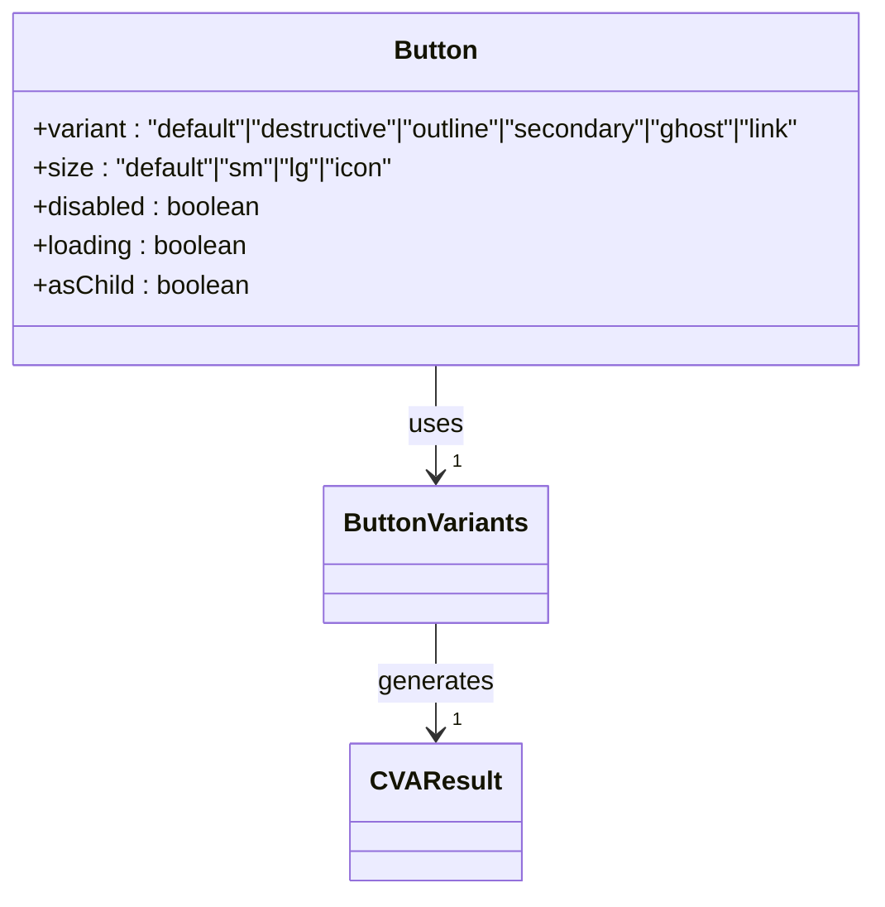
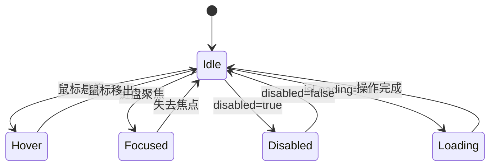
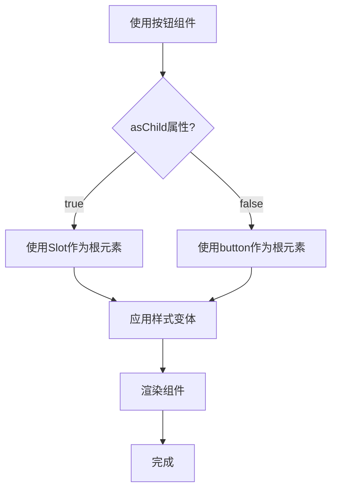

# 按钮组件 (Button)

<cite>
**本文档引用的文件**  
- [button.tsx](file://src/components/ui/button.tsx)
- [utils.ts](file://src/lib/utils.ts)
- [tailwind.config.js](file://tailwind.config.js)
- [LoginPage.tsx](file://src/pages/auth/LoginPage.tsx)
- [CompactFilterBar.tsx](file://src/components/appointment/CompactFilterBar.tsx)
- [DateRangePicker.tsx](file://src/components/appointment/DateRangePicker.tsx)
- [UserManagementPage.tsx](file://src/pages/admin/UserManagementPage.tsx)
- [UnauthorizedPage.tsx](file://src/pages/auth/UnauthorizedPage.tsx)
- [dialog.tsx](file://src/components/ui/dialog.tsx)
- [alert-dialog.tsx](file://src/components/ui/alert-dialog.tsx)
</cite>

## 目录
1. [简介](#简介)
2. [视觉样式](#视觉样式)
3. [交互行为](#交互行为)
4. [可配置属性](#可配置属性)
5. [实际使用示例](#实际使用示例)
6. [主题定制与设计系统集成](#主题定制与设计系统集成)
7. [可访问性支持](#可访问性支持)
8. [性能优化建议](#性能优化建议)
9. [总结](#总结)

## 简介

按钮组件是用户界面中最基本且最重要的交互元素之一，用于触发操作、导航或提交表单。本组件基于React和Tailwind CSS构建，遵循shadcn/ui设计模式，提供了丰富的视觉变体、尺寸选项和交互状态，确保在各种业务场景下都能提供一致且直观的用户体验。

该组件通过`class-variance-authority`（CVA）库实现样式变体管理，结合Tailwind CSS的实用类系统，实现了高度可定制化的同时保持了代码的简洁性和可维护性。组件支持多种变体（variant）、尺寸（size）、禁用状态、加载状态以及图标插槽，能够满足从表单提交到操作确认等各种业务需求。

**Section sources**
- [button.tsx](file://src/components/ui/button.tsx#L1-L58)

## 视觉样式

按钮组件提供了多种视觉变体，每种变体都有其特定的用途和视觉特征。所有变体都共享一组基础样式，包括内联弹性布局、居中对齐、圆角、过渡动画和焦点环等。

### 变体类型

按钮组件支持以下几种主要变体：

- **默认 (default)**：主色调背景，白色文字，带有阴影和悬停效果，用于主要操作
- **危险 (destructive)**：红色背景，白色文字，用于删除或危险操作
- **轮廓 (outline)**：透明背景，主色调边框和文字，简洁的轮廓样式
- **次要 (secondary)**：浅色背景，深色文字，用于次要操作
- **幽灵 (ghost)**：无背景，悬停时显示背景，用于导航或轻量级操作
- **链接 (link)**：类似链接的样式，带下划线，用于导航或辅助操作

这些变体通过Tailwind CSS的颜色变量系统实现，与设计系统的颜色体系完全集成。例如，`bg-primary`引用的是`--primary` CSS变量，确保主题切换时按钮颜色能够同步变化。

### 尺寸选项

按钮组件提供了四种尺寸选项：

- **小号 (sm)**：高度8，较小的内边距和字号，适合紧凑布局
- **默认 (default)**：高度9，标准内边距和字号，通用尺寸
- **大号 (lg)**：高度10，较大的内边距和字号，用于重要操作
- **图标 (icon)**：9x9的正方形，专为仅包含图标的按钮设计



**Diagram sources**
- [button.tsx](file://src/components/ui/button.tsx#L7-L35)

**Section sources**
- [button.tsx](file://src/components/ui/button.tsx#L7-L35)

## 交互行为

按钮组件提供了丰富的交互行为，包括悬停、焦点、禁用和加载状态，确保用户能够清晰地理解按钮的当前状态和预期行为。

### 悬停与焦点状态

所有按钮变体都支持悬停效果，通过`hover:`前缀的Tailwind类实现。例如，`hover:bg-primary/90`表示悬停时背景颜色变为原色的90%透明度。这种设计提供了视觉反馈，让用户知道按钮是可点击的。

焦点状态通过`focus-visible:`前缀的类实现，确保键盘导航用户能够清晰地看到当前聚焦的元素。`focus-visible:ring-1 focus-visible:ring-ring`添加了一个可见的焦点环，其颜色由`--ring`CSS变量定义。

### 禁用状态

当按钮的`disabled`属性为`true`时，按钮会自动应用`disabled:pointer-events-none disabled:opacity-50`类，禁用点击事件并降低透明度至50%。这种视觉反馈清晰地表明按钮当前不可用。

### 加载状态

虽然组件本身不直接支持加载状态，但可以通过外部状态管理轻松实现。在实际使用中，当按钮处于加载状态时，通常会禁用按钮并更改其文本为"加载中..."，同时可能添加一个旋转的加载图标。



**Diagram sources**
- [button.tsx](file://src/components/ui/button.tsx#L8-L9)
- [LoginPage.tsx](file://src/pages/auth/LoginPage.tsx#L123-L129)

**Section sources**
- [button.tsx](file://src/components/ui/button.tsx#L8-L9)
- [LoginPage.tsx](file://src/pages/auth/LoginPage.tsx#L123-L129)

## 可配置属性

按钮组件通过`ButtonProps`接口定义了所有可配置属性，这些属性可以分为基础属性、样式属性和高级属性三类。

### 基础属性

- **type**: 按钮类型（submit、button、reset），用于表单场景
- **onClick**: 点击事件处理器
- **disabled**: 是否禁用按钮
- **className**: 自定义CSS类，用于覆盖或扩展默认样式

### 样式属性

- **variant**: 按钮变体，决定按钮的整体视觉风格
- **size**: 按钮尺寸，影响按钮的高度和内边距
- **asChild**: 是否使用子元素作为根元素，用于包装其他组件

### 高级属性

`asChild`属性是一个高级功能，允许按钮将样式应用到其子元素上。当`asChild`为`true`时，组件会使用`@radix-ui/react-slot`的`Slot`组件作为根元素，而不是原生的`button`元素。这使得按钮的样式可以应用到任何子组件上，同时保留按钮的交互行为。



**Diagram sources**
- [button.tsx](file://src/components/ui/button.tsx#L43-L54)

**Section sources**
- [button.tsx](file://src/components/ui/button.tsx#L37-L58)

## 实际使用示例

按钮组件在项目中被广泛应用于各种业务场景，从表单提交到操作确认，再到导航跳转。

### 表单提交

在登录页面中，按钮用于提交登录表单：

```tsx
<Button
  type="submit"
  className="w-full"
  disabled={isLoading}
>
  {isLoading ? '登录中...' : '登录'}
</Button>
```

这个示例展示了如何结合`type="submit"`实现表单提交，使用`disabled`属性防止重复提交，并根据`isLoading`状态动态更改按钮文本。

### 操作确认

在对话框中，按钮用于确认或取消操作：

```tsx
<DialogFooter>
  <Button variant="outline" onClick={() => setOpen(false)}>
    取消
  </Button>
  <Button onClick={handleConfirm}>确认</Button>
</DialogFooter>
```

这里使用了`outline`变体作为取消按钮，与默认变体的确认按钮形成视觉层次，帮助用户区分主要和次要操作。

### 导航跳转

在未授权页面中，按钮用于导航回首页：

```tsx
<Button
  onClick={() => navigate('/')}
  className="w-full"
>
  <Home className="mr-2 h-4 w-4" />
  返回首页
</Button>
```

这个示例展示了如何在按钮中集成图标，通过`Home`图标和文本的组合提供更丰富的视觉提示。

### 图标按钮

在日期选择器中，按钮仅包含图标：

```tsx
<Button
  variant="outline"
  size="icon"
  className="h-8 w-8"
  onClick={handlePrevious}
>
  <ChevronLeft className="h-4 w-4" />
</Button>
```

使用`size="icon"`创建了一个紧凑的正方形按钮，专为导航箭头等图标设计。

**Section sources**
- [LoginPage.tsx](file://src/pages/auth/LoginPage.tsx#L123-L129)
- [UnauthorizedPage.tsx](file://src/pages/auth/UnauthorizedPage.tsx#L27-L32)
- [DateRangePicker.tsx](file://src/components/appointment/DateRangePicker.tsx#L98-L105)
- [CompactFilterBar.tsx](file://src/components/appointment/CompactFilterBar.tsx#L113-L117)

## 主题定制与设计系统集成

按钮组件通过Tailwind CSS和CSS变量系统实现了深度的主题定制能力，与项目的设计系统完全集成。

### Tailwind CSS配置

在`tailwind.config.js`中，项目定义了完整的颜色体系，包括：

- **主色调 (primary)**：用于主要操作和品牌元素
- **危险色 (destructive)**：用于删除或危险操作
- **中性色 (muted, border, input)**：用于背景、边框和输入框
- **状态色 (urgent, pending, scheduled, confirmed, completed)**：用于表示不同状态

这些颜色通过CSS变量引用，如`hsl(var(--primary))`，允许在运行时动态切换主题。

### 样式变体管理

组件使用`class-variance-authority`（CVA）库管理样式变体。`buttonVariants`函数定义了所有可能的变体组合，并生成相应的CSS类。这种方法将样式逻辑与组件逻辑分离，提高了代码的可维护性。

### 设计系统一致性

按钮组件的设计遵循了项目的设计系统原则：

- **颜色一致性**：使用统一的颜色变量，确保所有组件的颜色协调
- **间距系统**：使用Tailwind的间距类（如`px-4`, `py-2`），遵循8px网格系统
- **圆角系统**：使用`rounded-md`和`rounded-lg`，与设计系统的圆角规范一致
- **阴影系统**：使用`shadow`和`shadow-sm`，提供适度的深度感

```mermaid
erDiagram
THEME_VARIABLES {
string --primary
string --primary-foreground
string --secondary
string --secondary-foreground
string --destructive
string --destructive-foreground
string --border
string --input
string --ring
string --background
string --foreground
}
TAILWIND_CONFIG {
object theme
object extend
object colors
}
BUTTON_COMPONENT {
string variant
string size
boolean disabled
}
THEME_VARIABLES ||--o{ TAILWIND_CONFIG : "defines"
TAILWIND_CONFIG ||--o{ BUTTON_COMPONENT : "styles"
```

**Diagram sources**
- [tailwind.config.js](file://tailwind.config.js#L25-L98)
- [button.tsx](file://src/components/ui/button.tsx#L7-L35)

**Section sources**
- [tailwind.config.js](file://tailwind.config.js#L25-L98)
- [button.tsx](file://src/components/ui/button.tsx#L7-L35)

## 可访问性支持

按钮组件在设计时充分考虑了可访问性（a11y）需求，确保所有用户，包括残障用户，都能有效使用。

### ARIA标签处理

组件正确处理了所有相关的ARIA属性：

- **aria-disabled**: 当`disabled`为`true`时自动应用
- **aria-label**: 支持通过`aria-label`属性提供屏幕阅读器友好的标签
- **aria-describedby**: 支持关联描述元素
- **role**: 对于非按钮元素使用`role="button"`

### 键盘导航

按钮组件支持完整的键盘导航：

- **Tab键**: 可以通过Tab键聚焦到按钮
- **Enter键**: 聚焦时按Enter键触发点击事件
- **Space键**: 聚焦时按Space键触发点击事件
- **焦点环**: 显示清晰的焦点环，帮助键盘用户定位

### 屏幕阅读器支持

通过适当的语义化HTML和ARIA属性，确保屏幕阅读器能够正确识别按钮的类型、状态和功能。例如，危险操作的按钮会被识别为"删除按钮"，禁用的按钮会被识别为"已禁用"。

### 颜色对比度

所有按钮变体都满足WCAG 2.1 AA级对比度要求，确保文本在背景上有足够的对比度。例如，白色文字在主色调背景上的对比度经过计算，确保在各种显示环境下都可读。

**Section sources**
- [button.tsx](file://src/components/ui/button.tsx#L8-L9)
- [ColorSystemDemo.tsx](file://src/pages/ColorSystemDemo.tsx#L165-L168)

## 性能优化建议

为了确保按钮组件的高性能，避免不必要的重渲染，建议遵循以下最佳实践。

### 避免内联函数

在循环中使用按钮时，避免创建内联函数，因为这会导致每次渲染都创建新的函数引用，触发不必要的重渲染：

```tsx
// ❌ 错误做法
{items.map(item => (
  <Button onClick={() => handleDelete(item.id)}>删除</Button>
))}

// ✅ 正确做法
const handleDeleteClick = useCallback((id) => {
  // 处理删除逻辑
}, []);

{items.map(item => (
  <Button onClick={() => handleDeleteClick(item.id)}>删除</Button>
))}
```

### 使用React.memo

对于包含按钮的复杂组件，考虑使用`React.memo`进行记忆化，避免不必要的重渲染：

```tsx
const ActionButtons = React.memo(({ onEdit, onDelete }) => {
  return (
    <div className="flex gap-2">
      <Button variant="outline" onClick={onEdit}>编辑</Button>
      <Button variant="destructive" onClick={onDelete}>删除</Button>
    </div>
  );
});
```

### 懒加载大型组件

当按钮用于触发大型组件的显示时，考虑使用懒加载：

```tsx
const LazyModal = React.lazy(() => import('./LargeModal'));

function Page() {
  const [open, setOpen] = useState(false);
  
  return (
    <>
      <Button onClick={() => setOpen(true)}>打开大型模态框</Button>
      {open && (
        <Suspense fallback={<Spinner />}>
          <LazyModal onClose={() => setOpen(false)} />
        </Suspense>
      )}
    </>
  );
}
```

### 防抖和节流

对于可能频繁触发的操作，使用防抖或节流：

```tsx
import { useDebounceCallback } from 'usehooks-ts';

function SearchButton() {
  const debouncedSearch = useDebounceCallback(handleSearch, 300);
  
  return (
    <Button onClick={debouncedSearch}>搜索</Button>
  );
}
```

**Section sources**
- [use-debounce.ts](file://src/hooks/use-debounce.ts#L1-L15)
- [use-toast.tsx](file://src/hooks/use-toast.tsx#L126-L188)

## 总结

按钮组件是一个功能丰富、高度可定制的UI元素，通过Tailwind CSS和CVA库实现了灵活的样式管理。组件支持多种变体和尺寸，能够满足各种业务场景的需求。通过`asChild`属性，组件还提供了高级的组合能力，可以将按钮样式应用到其他组件上。

在可访问性方面，组件遵循了最佳实践，确保所有用户都能有效使用。通过合理的性能优化建议，可以避免常见的性能问题，确保应用的流畅性。

该组件与项目的设计系统深度集成，通过CSS变量和Tailwind配置实现了主题定制能力，确保了整个应用的视觉一致性。无论是表单提交、操作确认还是导航跳转，按钮组件都提供了可靠且直观的用户体验。

**Section sources**
- [button.tsx](file://src/components/ui/button.tsx#L1-L58)
- [tailwind.config.js](file://tailwind.config.js#L25-L98)
- [LoginPage.tsx](file://src/pages/auth/LoginPage.tsx#L123-L129)