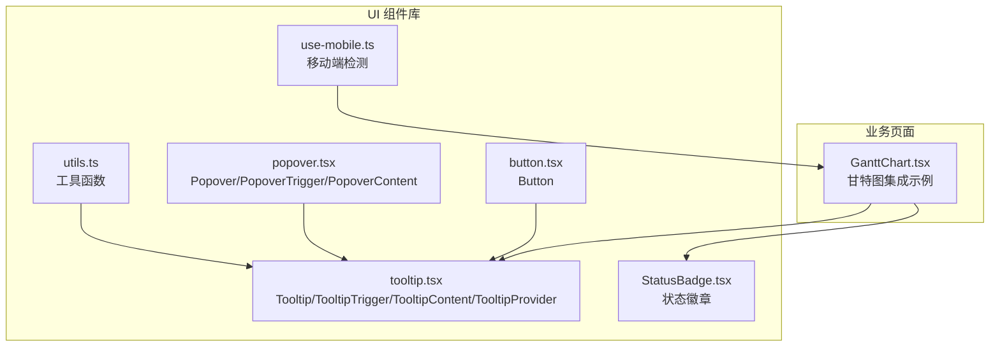
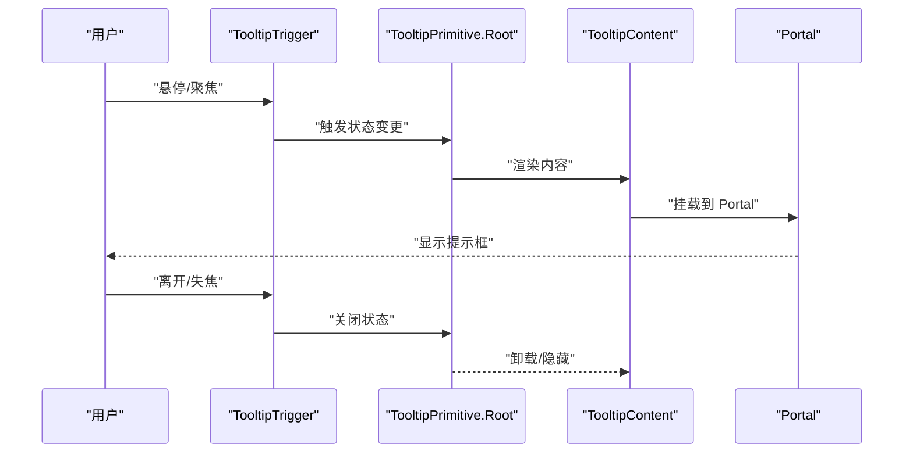
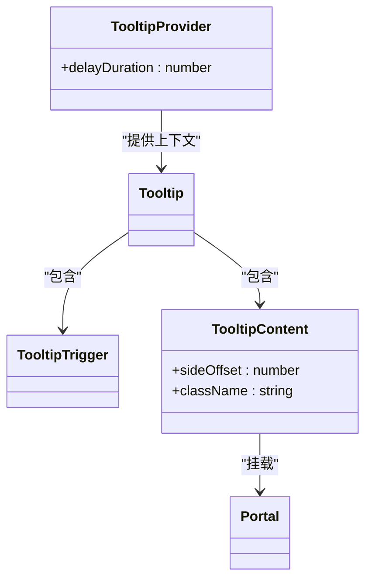
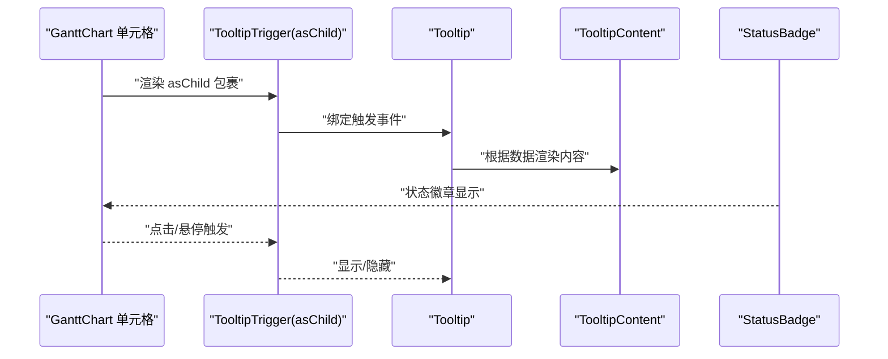
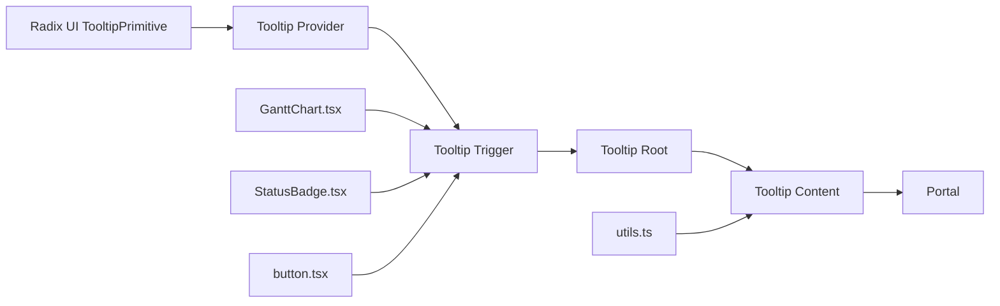

# 提示框组件 (Tooltip)

<cite>
**本文引用的文件**
- [tooltip.tsx](file://src/components/ui/tooltip.tsx)
- [GanttChart.tsx](file://src/components/appointment/GanttChart.tsx)
- [button.tsx](file://src/components/ui/button.tsx)
- [popover.tsx](file://src/components/ui/popover.tsx)
- [StatusBadge.tsx](file://src/components/appointment/StatusBadge.tsx)
- [use-mobile.ts](file://src/hooks/use-mobile.ts)
- [utils.ts](file://src/lib/utils.ts)
</cite>

## 目录
1. [简介](#简介)
2. [项目结构](#项目结构)
3. [核心组件](#核心组件)
4. [架构总览](#架构总览)
5. [详细组件分析](#详细组件分析)
6. [依赖关系分析](#依赖关系分析)
7. [性能考量](#性能考量)
8. [故障排查指南](#故障排查指南)
9. [结论](#结论)
10. [附录](#附录)

## 简介
本文件系统化阐述提示框组件（Tooltip）的设计与使用，覆盖以下关键点：
- 轻量级信息展示能力：用于按钮说明、状态解释等场景，强调“即时、简洁、无干扰”的信息呈现。
- 触发方式：默认基于 hover；也可通过 focus 等键盘可达性路径触发。
- 定位策略：支持 placement（top、right、bottom、left），并提供 sideOffset 控制偏移。
- 延迟显示与关闭：通过 Provider 的 delayDuration 统一控制，避免频繁闪烁。
- 动态内容传递：在复杂布局中（如甘特图）以 asChild 形式包裹交互元素，Tooltip 内容随数据动态变化。
- 移动端适配：触屏设备 hover 失效时的替代方案与最佳实践。
- 可访问性：键盘导航、焦点管理、屏幕阅读器支持。
- 性能优化：避免过度渲染、减少不必要的 Portal 渲染。
- 与其他浮层组件的差异与选型：与 Popover 的区别及适用场景。

## 项目结构
提示框组件位于 UI 组件库中，围绕 Radix UI 的 Tooltip Primitive 构建，提供 Provider、Root、Trigger、Content、Portal 等封装，便于统一延迟、定位与动画。

图表来源
- [tooltip.tsx](file://src/components/ui/tooltip.tsx#L1-L61)
- [popover.tsx](file://src/components/ui/popover.tsx#L1-L47)
- [button.tsx](file://src/components/ui/button.tsx#L1-L58)
- [StatusBadge.tsx](file://src/components/appointment/StatusBadge.tsx#L1-L51)
- [GanttChart.tsx](file://src/components/appointment/GanttChart.tsx#L1-L260)
- [use-mobile.ts](file://src/hooks/use-mobile.ts#L1-L20)
- [utils.ts](file://src/lib/utils.ts#L1-L40)

章节来源
- [tooltip.tsx](file://src/components/ui/tooltip.tsx#L1-L61)
- [GanttChart.tsx](file://src/components/appointment/GanttChart.tsx#L1-L260)

## 核心组件
- TooltipProvider：提供全局延迟配置（delayDuration），并承载 Tooltip 树。
- Tooltip：根容器，包裹 Trigger 与 Content。
- TooltipTrigger：触发器，通常配合 asChild 包裹 Button、Badge 等可交互元素。
- TooltipContent：内容容器，支持 sideOffset、placement（由 Radix 决定）与箭头渲染。
- Portal：将内容挂载到 DOM 末尾，避免层级与定位问题。

章节来源
- [tooltip.tsx](file://src/components/ui/tooltip.tsx#L1-L61)

## 架构总览
Tooltip 的工作流基于 Radix UI 的事件模型：当触发元素进入/离开或获得/失去焦点时，Tooltip 内部状态切换，触发动画与定位计算。

图表来源
- [tooltip.tsx](file://src/components/ui/tooltip.tsx#L1-L61)

## 详细组件分析

### 组件关系与职责
- TooltipProvider：集中设置 delayDuration，统一延迟策略。
- Tooltip：声明式包裹 Trigger 与 Content。
- TooltipTrigger：作为 asChild 的宿主，使 Tooltip 作用于 Button、Badge 等子节点。
- TooltipContent：负责定位、动画、箭头与最大宽度控制。
- Portal：确保内容在全局层级正确渲染，避免被父级裁剪或层级遮挡。

图表来源
- [tooltip.tsx](file://src/components/ui/tooltip.tsx#L1-L61)

章节来源
- [tooltip.tsx](file://src/components/ui/tooltip.tsx#L1-L61)

### 触发方式与键盘可达性
- 默认 hover 触发：适合非触屏设备的即时提示。
- 键盘 focus 触发：通过原生 focus 行为触发，保证屏幕阅读器与键盘用户的可达性。
- 在复杂布局中（如甘特图单元格）使用 asChild，使 Tooltip 作用于内部可点击元素，同时保留键盘可达性。

章节来源
- [GanttChart.tsx](file://src/components/appointment/GanttChart.tsx#L198-L259)
- [button.tsx](file://src/components/ui/button.tsx#L1-L58)

### 定位策略与侧偏移
- placement：通过 Radix 的 side 属性控制（top、right、bottom、left），组件内部已内置对应 slide-in-from-* 动画类，确保从正确方向滑入。
- sideOffset：通过 TooltipContent 的 sideOffset 控制与触发元素的距离。
- 箭头：使用 TooltipPrimitive.Arrow，自动旋转 45° 并对齐触发元素中心。

章节来源
- [tooltip.tsx](file://src/components/ui/tooltip.tsx#L37-L60)

### 延迟显示与关闭逻辑
- Provider 的 delayDuration：统一控制显示延迟，避免频繁闪烁与误触发。
- 关闭时机：鼠标离开触发区域或失焦时关闭，内部通过 data-state 属性驱动动画序列。

章节来源
- [tooltip.tsx](file://src/components/ui/tooltip.tsx#L8-L19)

### 动态内容传递与集成示例
- 与 Button 集成：在 Button 外层包裹 TooltipTrigger，Tooltip 内容展示按钮用途或快捷键提示。
- 与 StatusBadge 集成：将 TooltipTrigger 作为 asChild 传给 Badge，Tooltip 内容展示状态含义或操作说明。
- 与复杂布局集成：在甘特图中，TooltipTrigger 作为 asChild 包裹单元格或卡片，TooltipContent 动态渲染当前排班的客户、时间、护士与房间信息。

图表来源
- [GanttChart.tsx](file://src/components/appointment/GanttChart.tsx#L198-L259)
- [StatusBadge.tsx](file://src/components/appointment/StatusBadge.tsx#L1-L51)
- [tooltip.tsx](file://src/components/ui/tooltip.tsx#L31-L60)

章节来源
- [GanttChart.tsx](file://src/components/appointment/GanttChart.tsx#L198-L259)
- [StatusBadge.tsx](file://src/components/appointment/StatusBadge.tsx#L1-L51)

### 移动端适配问题
- 触屏设备 hover 失效：需要提供替代交互（如长按、点击）。
- 通过 useIsMobile 判断设备类型，可在移动端切换为点击触发或直接在点击时打开更丰富的说明面板。
- 建议：移动端优先使用点击触发，Tooltip 仅作为补充说明；必要时在移动端禁用 hover，改用按钮或图标触发。

章节来源
- [use-mobile.ts](file://src/hooks/use-mobile.ts#L1-L20)

### 可访问性要求
- 键盘可达性：确保 Tooltip 可通过 Tab 聚焦触发，且在失焦时正确关闭。
- 屏幕阅读器：内容应语义清晰，避免仅依赖视觉提示；必要时提供 aria-label 或 aria-describedby。
- 动画与感知：对光敏性用户，建议提供关闭动画或降低动画强度的选项（可通过自定义类名或 Provider 配置实现）。

（本节为通用指导，未直接分析特定文件）

### 与其他浮层组件的差异与选型建议
- Tooltip：轻量、短暂、无遮挡，适合按钮说明、状态解释等短文本提示。
- Popover：可承载复杂内容（表单、菜单、列表），适合需要用户交互的场景。
- 选型建议：
  - 短文本、一次性信息：选择 Tooltip。
  - 需要用户操作或复杂内容：选择 Popover。
  - 两者结合：Tooltip 用于引导，Popover 用于展开详情。

章节来源
- [popover.tsx](file://src/components/ui/popover.tsx#L1-L47)
- [tooltip.tsx](file://src/components/ui/tooltip.tsx#L1-L61)

## 依赖关系分析
- 组件依赖 Radix UI 的 Tooltip Primitive，确保跨浏览器一致的行为与无障碍支持。
- 工具函数 utils.cn 用于合并 Tailwind 类，保证样式可控与可维护。
- 业务组件（如 GanttChart、StatusBadge）通过 asChild 与 TooltipTrigger 组合，形成“触发元素”与“提示内容”的解耦。

图表来源
- [tooltip.tsx](file://src/components/ui/tooltip.tsx#L1-L61)
- [utils.ts](file://src/lib/utils.ts#L1-L40)
- [GanttChart.tsx](file://src/components/appointment/GanttChart.tsx#L1-L260)
- [StatusBadge.tsx](file://src/components/appointment/StatusBadge.tsx#L1-L51)
- [button.tsx](file://src/components/ui/button.tsx#L1-L58)

章节来源
- [tooltip.tsx](file://src/components/ui/tooltip.tsx#L1-L61)
- [utils.ts](file://src/lib/utils.ts#L1-L40)

## 性能考量
- 避免过度渲染：在高频滚动或重绘场景（如甘特图）中，尽量将 TooltipProvider 的范围限制在必要区域，减少不必要的 Portal 渲染。
- 延迟策略：合理设置 delayDuration，避免频繁闪烁与动画抖动。
- 内容最小化：TooltipContent 中仅包含必要信息，避免复杂 DOM 结构导致的重排与重绘。
- 移动端优化：在移动端禁用 hover，改为点击触发，减少事件监听与状态切换成本。

（本节为通用指导，未直接分析特定文件）

## 故障排查指南
- 提示框不显示
  - 检查是否包裹了 TooltipTrigger 且使用 asChild 时目标元素可交互。
  - 确认 Provider 的 delayDuration 是否过大导致延迟明显。
- 定位异常
  - 检查 TooltipContent 的 sideOffset 是否过小导致被裁剪。
  - 确认父级容器是否有 overflow 或 transform 导致 Portal 定位异常。
- 移动端无提示
  - 确认移动端已切换为点击触发或禁用 hover。
  - 检查事件绑定是否正确（asChild 与点击事件）。
- 可访问性问题
  - 确保触发元素具备可聚焦性（如 Button）。
  - 检查 Tooltip 内容是否对屏幕阅读器友好（避免仅依赖颜色或图标）。

章节来源
- [tooltip.tsx](file://src/components/ui/tooltip.tsx#L1-L61)
- [GanttChart.tsx](file://src/components/appointment/GanttChart.tsx#L198-L259)
- [button.tsx](file://src/components/ui/button.tsx#L1-L58)

## 结论
Tooltip 是一个轻量、可组合、可扩展的信息展示组件。通过 Provider 的延迟控制、Trigger 的 asChild 包裹与 Content 的定位与动画，它能够高效地服务于按钮说明、状态解释等场景。在移动端与可访问性方面，建议采用点击触发与键盘可达性优先的策略，并结合 Popover 实现更复杂的交互。通过合理的性能优化与最小化内容设计，可进一步提升用户体验与系统稳定性。

## 附录
- 快速上手要点
  - 在需要提示的元素外层包裹 TooltipTrigger，并使用 asChild 以继承交互行为。
  - 在 Tooltip 内放置 TooltipContent，按需设置 sideOffset 与 placement。
  - 在 Provider 上设置 delayDuration，平衡流畅度与干扰度。
  - 在移动端禁用 hover，改为点击触发或直接在点击时打开更丰富的说明面板。
  - 与 Button、StatusBadge 等组件组合时，确保触发元素具备可聚焦性与语义化标签。