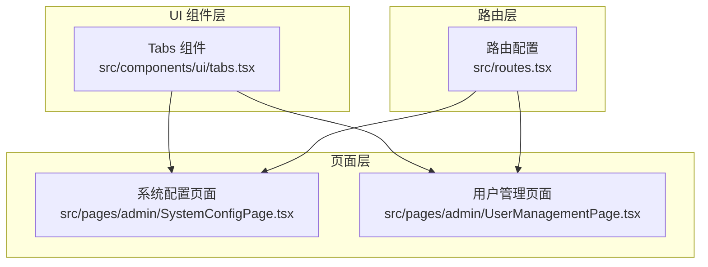
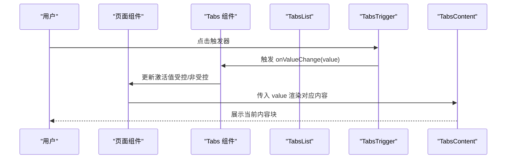
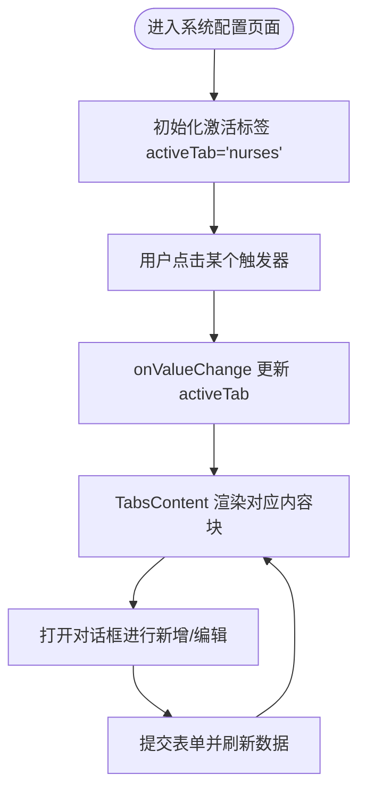
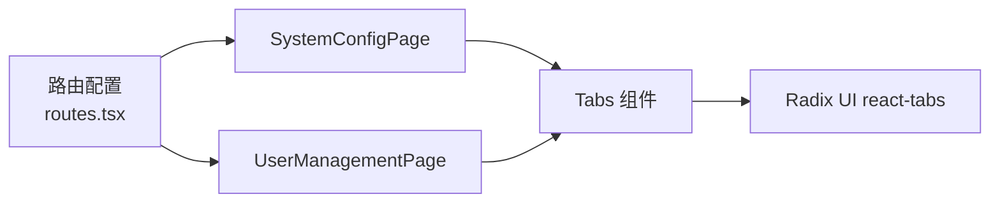

# 标签页组件（Tabs）

<cite>
**本文引用的文件**
- [src/components/ui/tabs.tsx](file://src/components/ui/tabs.tsx)
- [src/pages/admin/SystemConfigPage.tsx](file://src/pages/admin/SystemConfigPage.tsx)
- [src/pages/admin/UserManagementPage.tsx](file://src/pages/admin/UserManagementPage.tsx)
- [src/routes.tsx](file://src/routes.tsx)
- [src/components/common/PageMeta.tsx](file://src/components/common/PageMeta.tsx)
</cite>

## 目录
1. [简介](#简介)
2. [项目结构](#项目结构)
3. [核心组件](#核心组件)
4. [架构总览](#架构总览)
5. [详细组件分析](#详细组件分析)
6. [依赖关系分析](#依赖关系分析)
7. [性能考量](#性能考量)
8. [故障排查指南](#故障排查指南)
9. [结论](#结论)
10. [附录](#附录)

## 简介
本技术文档围绕标签页组件（Tabs）在多视图切换场景中的应用进行系统化说明，重点覆盖以下方面：
- 结构与交互：Tabs、TabsList、TabsTrigger、TabsContent 的职责与协作方式
- 使用模式：受控与非受控模式、动态生成标签、嵌套路由集成、延迟加载内容
- 场景实践：仪表盘与系统配置页面中的典型用法
- 状态管理策略：本地状态、路由状态、全局状态的权衡
- SEO 影响与可访问性：键盘导航、ARIA 属性、SEO 元信息
- 常见问题：内容闪烁、首次渲染优化、无障碍可达性

## 项目结构
本项目采用按功能域分层的组织方式，标签页组件位于通用 UI 组件目录，业务页面在 pages 目录中使用。路由定义集中于 routes.tsx，页面通过 import 引入 UI 组件并组合使用。

图表来源
- [src/components/ui/tabs.tsx](file://src/components/ui/tabs.tsx#L1-L64)
- [src/pages/admin/SystemConfigPage.tsx](file://src/pages/admin/SystemConfigPage.tsx#L293-L312)
- [src/pages/admin/UserManagementPage.tsx](file://src/pages/admin/UserManagementPage.tsx#L340-L350)
- [src/routes.tsx](file://src/routes.tsx#L111-L118)

章节来源
- [src/components/ui/tabs.tsx](file://src/components/ui/tabs.tsx#L1-L64)
- [src/pages/admin/SystemConfigPage.tsx](file://src/pages/admin/SystemConfigPage.tsx#L293-L312)
- [src/pages/admin/UserManagementPage.tsx](file://src/pages/admin/UserManagementPage.tsx#L340-L350)
- [src/routes.tsx](file://src/routes.tsx#L111-L118)

## 核心组件
- Tabs：根容器，负责状态与事件的传递，支持受控/非受控两种模式
- TabsList：触发器容器，承载多个 TabsTrigger
- TabsTrigger：标签触发器，点击切换对应内容
- TabsContent：内容容器，与触发器一一对应，仅展示当前激活内容

这些组件基于 Radix UI 的 react-tabs 实现，提供语义化结构与无障碍能力，同时通过 Tailwind 类名实现主题化样式。

章节来源
- [src/components/ui/tabs.tsx](file://src/components/ui/tabs.tsx#L1-L64)

## 架构总览
标签页在页面中的典型流程：
- 页面初始化时，根据当前状态（本地、路由或全局）决定初始激活标签
- 用户点击 TabsTrigger 切换标签，触发 onValueChange 回调更新状态
- TabsContent 根据 value 渲染对应内容块
- 在需要时，内容块内部可进行懒加载、异步数据获取与缓存

图表来源
- [src/pages/admin/SystemConfigPage.tsx](file://src/pages/admin/SystemConfigPage.tsx#L307-L312)
- [src/components/ui/tabs.tsx](file://src/components/ui/tabs.tsx#L1-L64)

## 详细组件分析

### 结构与交互逻辑
- 触发器与内容的绑定：每个 TabsTrigger 的 value 必须与对应 TabsContent 的 value 一致，用于建立“标签-内容”的映射关系
- 列表布局：TabsList 支持网格布局（如三列），以适应多分类管理场景
- 受控模式：通过 value 与 onValueChange 显式控制当前激活项，适合与路由或全局状态联动
- 非受控模式：通过 defaultValue 初始化，适合简单场景下的本地状态管理

章节来源
- [src/pages/admin/SystemConfigPage.tsx](file://src/pages/admin/SystemConfigPage.tsx#L307-L312)
- [src/pages/admin/UserManagementPage.tsx](file://src/pages/admin/UserManagementPage.tsx#L340-L350)
- [src/components/ui/tabs.tsx](file://src/components/ui/tabs.tsx#L1-L64)

### 受控与非受控模式
- 受控模式（系统配置页面）：使用本地状态 activeTab 并通过 onValueChange 更新；适合需要与路由或全局状态对齐的场景
- 非受控模式（用户管理页面）：使用 defaultValue 初始化，适合无需外部状态同步的简单页面

章节来源
- [src/pages/admin/SystemConfigPage.tsx](file://src/pages/admin/SystemConfigPage.tsx#L50-L56)
- [src/pages/admin/UserManagementPage.tsx](file://src/pages/admin/UserManagementPage.tsx#L340-L350)

### 动态生成标签
- 可根据数据源动态构建 TabsList 与 TabsContent，实现“按类别/模块”自动分组
- 动态生成时需保证每个触发器的 value 唯一且与内容 value 对应
- 可结合条件渲染隐藏空内容或占位符，避免布局抖动

章节来源
- [src/pages/admin/SystemConfigPage.tsx](file://src/pages/admin/SystemConfigPage.tsx#L307-L312)

### 嵌套路由集成
- 路由层提供统一入口，页面内使用 Tabs 进行子视图切换
- 可选方案：将 Tabs 的激活值与 URL 查询参数或路径片段关联，实现深度链接与分享
- 注意：当启用路由联动时，需确保 Tabs 的受控行为与路由状态同步，避免回环更新

章节来源
- [src/routes.tsx](file://src/routes.tsx#L111-L118)
- [src/pages/admin/SystemConfigPage.tsx](file://src/pages/admin/SystemConfigPage.tsx#L307-L312)

### 延迟加载内容
- 内容块内部可按需加载数据（如表格、图表），避免一次性渲染全部内容导致首屏卡顿
- 可结合骨架屏或占位符提升感知性能
- 对于跨标签切换频繁的场景，建议缓存已加载的数据，减少重复请求

章节来源
- [src/pages/admin/UserManagementPage.tsx](file://src/pages/admin/UserManagementPage.tsx#L479-L482)

### SystemConfigPage 中的分类管理
- 使用 Tabs 将“护士管理”“医生管理”“房间管理”三个分类隔离到独立内容块
- 每个内容块内包含卡片、表格、对话框与表单，形成完整的 CRUD 工作流
- 通过 Tabs 的受控模式与本地状态 activeTab 协同，实现分类间的快速切换

图表来源
- [src/pages/admin/SystemConfigPage.tsx](file://src/pages/admin/SystemConfigPage.tsx#L50-L56)
- [src/pages/admin/SystemConfigPage.tsx](file://src/pages/admin/SystemConfigPage.tsx#L307-L312)

章节来源
- [src/pages/admin/SystemConfigPage.tsx](file://src/pages/admin/SystemConfigPage.tsx#L293-L312)

### 状态管理策略
- 本地状态：适合简单页面，使用 useState 管理激活值
- 路由状态：适合需要分享链接或深度链接的场景，可结合 URL 参数或路径片段
- 全局状态：适合跨页面共享的复杂状态，需注意避免不必要的重渲染

章节来源
- [src/pages/admin/SystemConfigPage.tsx](file://src/pages/admin/SystemConfigPage.tsx#L50-L56)
- [src/pages/admin/UserManagementPage.tsx](file://src/pages/admin/UserManagementPage.tsx#L340-L350)

### 可访问性（键盘导航、ARIA 标签）
- Tabs 组件基于 Radix UI，天然支持键盘导航（Tab/Shift+Tab、方向键、Enter/Space）
- 触发器与内容通过语义化结构关联，无需额外 ARIA 属性即可满足无障碍要求
- 如需自定义 ARIA 属性，可在触发器上添加 role、aria-selected 等属性，但通常无需手动添加

章节来源
- [src/components/ui/tabs.tsx](file://src/components/ui/tabs.tsx#L1-L64)

### SEO 影响
- 标签页切换属于前端交互，不会改变页面标题与描述
- 若需针对不同标签页设置不同的 SEO 元信息，可在内容块内部使用 PageMeta 或其他 SEO 组件
- 建议在内容块挂载时动态更新 title 与 description，以提升搜索引擎友好度

章节来源
- [src/components/common/PageMeta.tsx](file://src/components/common/PageMeta.tsx#L1-L20)
- [src/pages/admin/SystemConfigPage.tsx](file://src/pages/admin/SystemConfigPage.tsx#L293-L306)

## 依赖关系分析
- 组件依赖：Tabs 组件依赖 Radix UI 的 react-tabs，提供基础的无障碍与状态管理能力
- 页面依赖：SystemConfigPage 与 UserManagementPage 分别展示了受控与非受控两种使用方式
- 路由依赖：routes.tsx 定义了页面入口，页面内再通过 Tabs 进行子视图切换

图表来源
- [src/routes.tsx](file://src/routes.tsx#L111-L118)
- [src/pages/admin/SystemConfigPage.tsx](file://src/pages/admin/SystemConfigPage.tsx#L293-L312)
- [src/pages/admin/UserManagementPage.tsx](file://src/pages/admin/UserManagementPage.tsx#L340-L350)
- [src/components/ui/tabs.tsx](file://src/components/ui/tabs.tsx#L1-L64)

章节来源
- [src/routes.tsx](file://src/routes.tsx#L111-L118)
- [src/pages/admin/SystemConfigPage.tsx](file://src/pages/admin/SystemConfigPage.tsx#L293-L312)
- [src/pages/admin/UserManagementPage.tsx](file://src/pages/admin/UserManagementPage.tsx#L340-L350)
- [src/components/ui/tabs.tsx](file://src/components/ui/tabs.tsx#L1-L64)

## 性能考量
- 首次渲染优化：避免在 TabsContent 中进行昂贵的同步计算，必要时拆分为独立组件并使用 useMemo/useCallback
- 懒加载策略：对大型内容块（如表格、图表）采用懒加载，减少初始包体积与渲染时间
- 重渲染控制：在受控模式下，确保 onValueChange 的回调稳定，避免因每次渲染都产生新函数导致不必要的重渲染
- 缓存策略：对跨标签切换频繁的数据进行缓存，减少重复请求

## 故障排查指南
- 内容闪烁
  - 现象：切换标签时出现短暂空白或布局抖动
  - 排查要点：检查 TabsContent 的 value 是否与触发器 value 严格一致；确认内容块内部是否在切换时重新请求数据
  - 解决方案：为内容块提供骨架屏或占位符；确保数据加载完成后才渲染真实内容
- 首次激活不正确
  - 现象：页面加载后默认激活的不是预期标签
  - 排查要点：确认 defaultValue 与 value 的使用场景；若使用受控模式，确保初始值与状态一致
- 键盘导航异常
  - 现象：无法通过键盘在触发器之间移动焦点
  - 排查要点：确认未覆盖默认的键盘事件处理；确保触发器可聚焦且未被禁用
- SEO 元信息未更新
  - 现象：切换标签后页面标题/描述未变化
  - 解决方案：在内容块挂载时动态更新 PageMeta 或使用其他 SEO 组件

章节来源
- [src/pages/admin/SystemConfigPage.tsx](file://src/pages/admin/SystemConfigPage.tsx#L293-L312)
- [src/pages/admin/UserManagementPage.tsx](file://src/pages/admin/UserManagementPage.tsx#L340-L350)
- [src/components/common/PageMeta.tsx](file://src/components/common/PageMeta.tsx#L1-L20)

## 结论
标签页组件在多视图切换场景中提供了清晰的结构与良好的可访问性。通过受控/非受控模式、动态生成、嵌套路由与延迟加载等策略，可以在仪表盘与系统配置等复杂页面中实现高效、稳定的用户体验。配合合理的状态管理与 SEO 策略，可进一步提升性能与可发现性。

## 附录
- 最佳实践清单
  - 使用受控模式时，确保 value 与 onValueChange 的一致性
  - 为内容块提供骨架屏或占位符，改善感知性能
  - 对跨标签频繁访问的数据进行缓存
  - 在需要时为不同标签页动态更新 SEO 元信息
  - 保持触发器与内容的 value 严格一一对应，避免错配