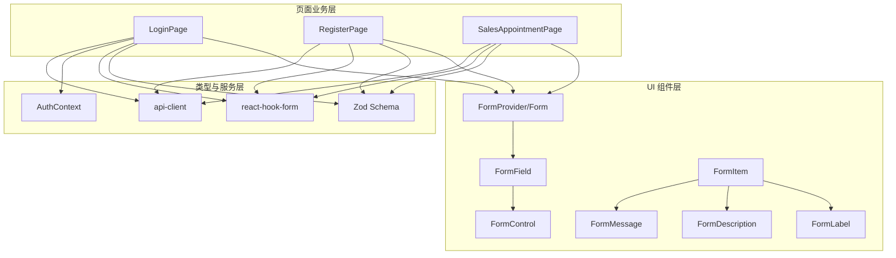
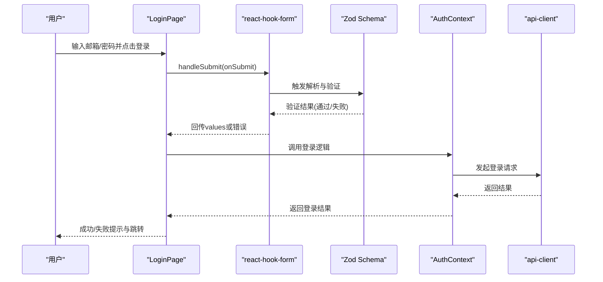
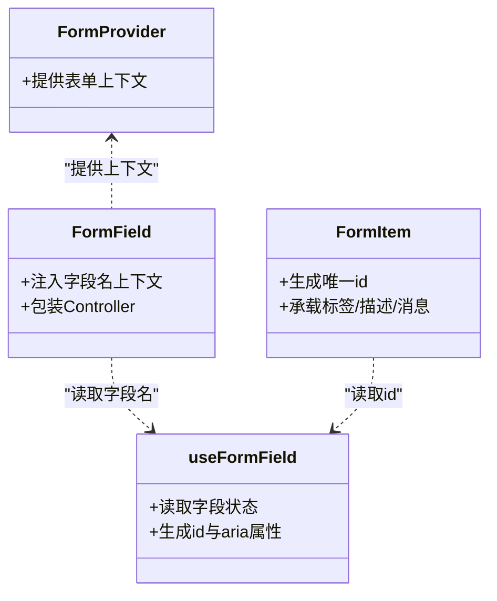
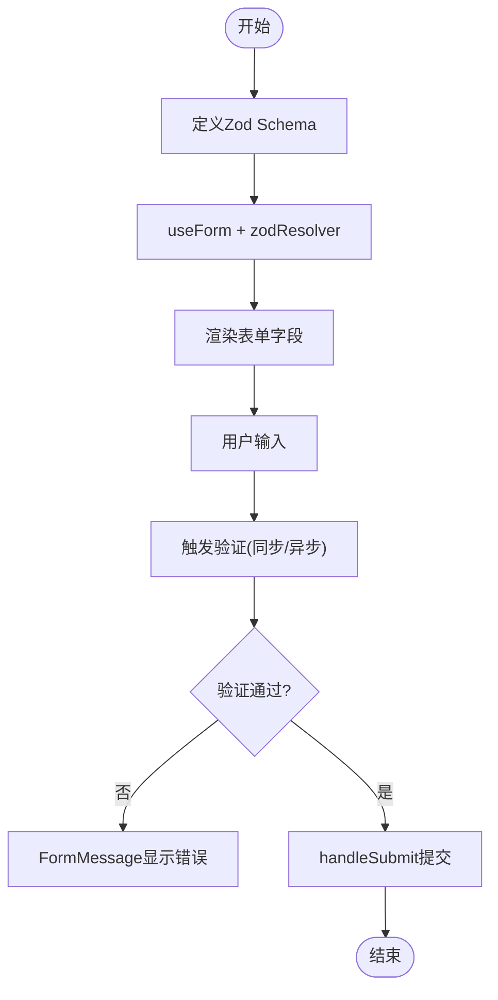
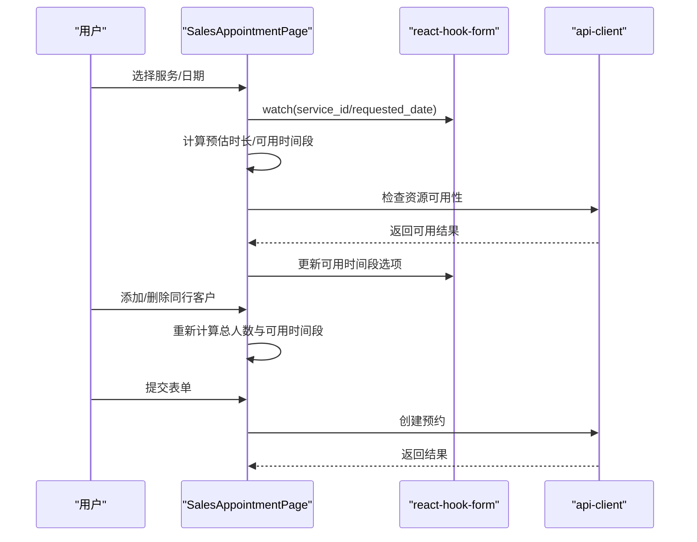
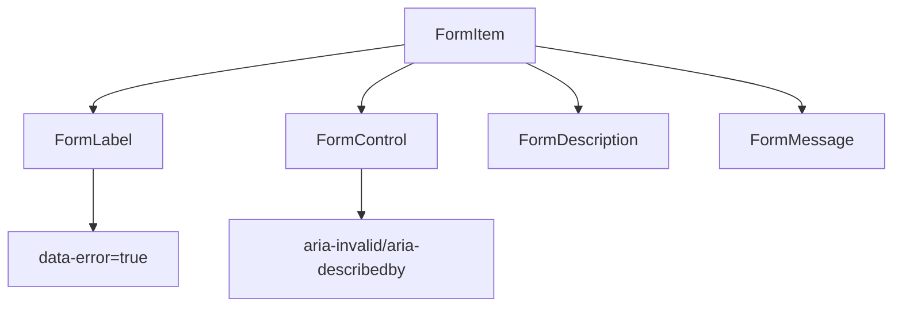
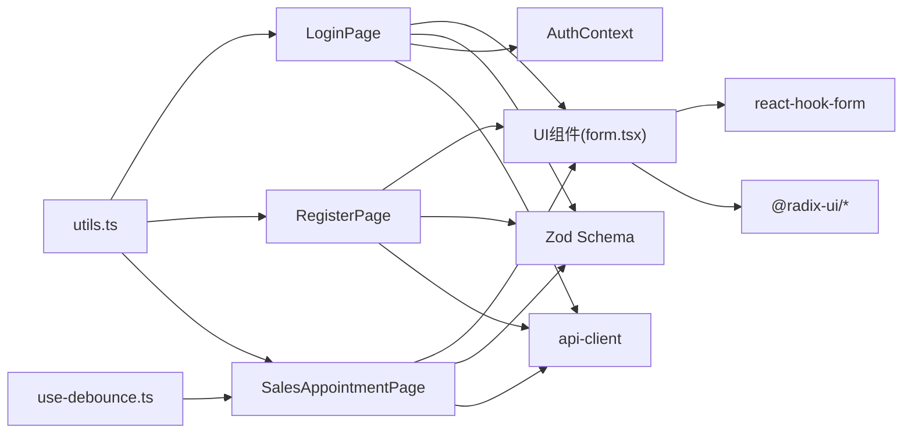

# 表单组件 (Form)

<cite>
**本文引用的文件**
- [src/components/ui/form.tsx](file://src/components/ui/form.tsx)
- [src/components/ui/label.tsx](file://src/components/ui/label.tsx)
- [src/components/ui/input.tsx](file://src/components/ui/input.tsx)
- [src/pages/auth/LoginPage.tsx](file://src/pages/auth/LoginPage.tsx)
- [src/pages/auth/RegisterPage.tsx](file://src/pages/auth/RegisterPage.tsx)
- [src/pages/sales/AppointmentPage.tsx](file://src/pages/sales/AppointmentPage.tsx)
- [src/contexts/AuthContext.tsx](file://src/contexts/AuthContext.tsx)
- [src/lib/utils.ts](file://src/lib/utils.ts)
- [src/hooks/use-debounce.ts](file://src/hooks/use-debounce.ts)
- [src/services/api-client.ts](file://src/services/api-client.ts)
- [src/services/auth.ts](file://src/services/auth.ts)
- [src/services/auth-client.ts](file://src/services/auth-client.ts)
- [src/types/index.ts](file://src/types/index.ts)
- [src/types/types.ts](file://src/types/types.ts)
- [src/routes.tsx](file://src/routes.tsx)
- [src/App.tsx](file://src/App.tsx)
- [package.json](file://package.json)
</cite>

## 目录
1. [简介](#简介)
2. [项目结构](#项目结构)
3. [核心组件](#核心组件)
4. [架构总览](#架构总览)
5. [组件详解](#组件详解)
6. [依赖关系分析](#依赖关系分析)
7. [性能考量](#性能考量)
8. [故障排查指南](#故障排查指南)
9. [结论](#结论)
10. [附录](#附录)

## 简介
本文件系统性阐述基于 React Hook Form 的高性能表单解决方案，围绕 Form、FormField、FormItem、FormLabel、FormControl、FormMessage 等嵌套结构的职责与协作机制进行深入解析。文档同时提供复杂表单验证（如预约信息录入、用户配置）的实际示例路径，覆盖同步与异步校验规则、错误消息渲染、动态字段增删等高级用法；解释与 Zod Schema 的集成方式，确保类型安全；并给出常见问题（字段未受控、验证不触发）的排查建议与性能优化策略（避免重复渲染）。最后结合 LoginPage、RegisterPage 等业务页面说明最佳实践。

## 项目结构
本项目的表单体系由“UI 组件层 + 页面业务层 + 类型与服务层”构成：
- UI 组件层：提供 FormProvider、FormField、FormItem、FormLabel、FormControl、FormMessage 等可复用表单部件，统一管理无障碍属性与错误状态传播。
- 页面业务层：在具体页面中定义 Zod Schema，使用 react-hook-form 实例化表单，结合 UI 组件完成渲染与提交。
- 类型与服务层：通过类型定义与服务接口保障数据一致性与调用规范。

图表来源
- [src/components/ui/form.tsx](file://src/components/ui/form.tsx#L1-L167)
- [src/pages/auth/LoginPage.tsx](file://src/pages/auth/LoginPage.tsx#L1-L158)
- [src/pages/auth/RegisterPage.tsx](file://src/pages/auth/RegisterPage.tsx#L1-L209)
- [src/pages/sales/AppointmentPage.tsx](file://src/pages/sales/AppointmentPage.tsx#L1-L200)
- [src/contexts/AuthContext.tsx](file://src/contexts/AuthContext.tsx#L1-L166)
- [src/services/api-client.ts](file://src/services/api-client.ts)

章节来源
- [src/components/ui/form.tsx](file://src/components/ui/form.tsx#L1-L167)
- [src/pages/auth/LoginPage.tsx](file://src/pages/auth/LoginPage.tsx#L1-L158)
- [src/pages/auth/RegisterPage.tsx](file://src/pages/auth/RegisterPage.tsx#L1-L209)
- [src/pages/sales/AppointmentPage.tsx](file://src/pages/sales/AppointmentPage.tsx#L1-L200)

## 核心组件
- Form：对 FormProvider 的别名，用于向子树提供表单上下文。
- FormField：将字段包装为受控单元，注入字段名称上下文，便于 useFormField 获取状态。
- FormItem：为字段容器提供唯一 id，承载标签、描述与错误消息的关联。
- FormLabel：绑定 htmlFor 到对应表单项 id，错误态样式切换。
- FormControl：将子元素注入 aria-invalid、aria-describedby 等无障碍属性，确保可访问性。
- FormDescription：提供辅助文本，配合 aria-describedby。
- FormMessage：渲染字段错误消息，若无错误则不渲染。

这些组件通过 React Context 在 FormField 与 FormItem 之间传递字段名与 id，useFormField 统一读取字段状态（如 error、ref）并注入到各子组件。

章节来源
- [src/components/ui/form.tsx](file://src/components/ui/form.tsx#L1-L167)

## 架构总览
下面的序列图展示了 LoginPage 中登录表单从用户输入到提交的典型流程，以及与 Zod Schema、react-hook-form、AuthContext 的交互。

图表来源
- [src/pages/auth/LoginPage.tsx](file://src/pages/auth/LoginPage.tsx#L1-L158)
- [src/contexts/AuthContext.tsx](file://src/contexts/AuthContext.tsx#L1-L166)
- [src/services/api-client.ts](file://src/services/api-client.ts)

章节来源
- [src/pages/auth/LoginPage.tsx](file://src/pages/auth/LoginPage.tsx#L1-L158)
- [src/contexts/AuthContext.tsx](file://src/contexts/AuthContext.tsx#L1-L166)

## 组件详解

### FormProvider 与 FormField 协作机制
- FormProvider 将 react-hook-form 的 control、formState 等注入全局上下文。
- FormField 通过 Context 将字段名注入到子树，useFormField 在任意子组件中读取字段状态与 id，保证错误消息、无障碍属性与渲染的一致性。

图表来源
- [src/components/ui/form.tsx](file://src/components/ui/form.tsx#L1-L167)

章节来源
- [src/components/ui/form.tsx](file://src/components/ui/form.tsx#L1-L167)

### 表单验证与 Zod Schema 集成
- LoginPage 使用 Zod 定义邮箱与密码规则，并通过 zodResolver 绑定到 react-hook-form。
- RegisterPage 定义用户名、姓名、密码与确认密码规则，使用 refine 实现跨字段校验（两次密码一致）。
- SalesAppointmentPage 定义预约表单的必填项与日期类型约束，结合 watch 与异步资源可用性检查实现动态校验。

图表来源
- [src/pages/auth/LoginPage.tsx](file://src/pages/auth/LoginPage.tsx#L1-L158)
- [src/pages/auth/RegisterPage.tsx](file://src/pages/auth/RegisterPage.tsx#L1-L209)
- [src/pages/sales/AppointmentPage.tsx](file://src/pages/sales/AppointmentPage.tsx#L1-L200)

章节来源
- [src/pages/auth/LoginPage.tsx](file://src/pages/auth/LoginPage.tsx#L1-L158)
- [src/pages/auth/RegisterPage.tsx](file://src/pages/auth/RegisterPage.tsx#L1-L209)
- [src/pages/sales/AppointmentPage.tsx](file://src/pages/sales/AppointmentPage.tsx#L1-L200)

### 动态字段增删与联动校验
SalesAppointmentPage 展示了动态字段增删与联动校验的高级用法：
- 同行客户字段通过数组管理，动态增删。
- watch 服务项目与日期，动态计算预估时长与可用时间段。
- 异步检查资源可用性，决定是否允许提交。
- 急单模式下对服务类别进行限制。

图表来源
- [src/pages/sales/AppointmentPage.tsx](file://src/pages/sales/AppointmentPage.tsx#L1-L200)
- [src/services/api-client.ts](file://src/services/api-client.ts)

章节来源
- [src/pages/sales/AppointmentPage.tsx](file://src/pages/sales/AppointmentPage.tsx#L1-L200)

### 无障碍与错误消息渲染
- FormLabel 通过 htmlFor 关联 FormItem 的 id，错误态时改变颜色。
- FormControl 自动注入 aria-invalid 与 aria-describedby，将描述与错误消息串联。
- FormMessage 在无错误时不渲染，减少 DOM 渲染开销。

图表来源
- [src/components/ui/form.tsx](file://src/components/ui/form.tsx#L88-L166)
- [src/components/ui/label.tsx](file://src/components/ui/label.tsx#L1-L25)
- [src/components/ui/input.tsx](file://src/components/ui/input.tsx#L1-L27)

章节来源
- [src/components/ui/form.tsx](file://src/components/ui/form.tsx#L88-L166)
- [src/components/ui/label.tsx](file://src/components/ui/label.tsx#L1-L25)
- [src/components/ui/input.tsx](file://src/components/ui/input.tsx#L1-L27)

### 业务页面最佳实践

#### LoginPage（登录）
- 使用 Zod 定义邮箱与密码规则，resolver 绑定到 react-hook-form。
- 使用 Form、FormField、FormItem、FormLabel、FormControl、FormMessage 组合渲染。
- 提交时调用 AuthContext 的登录逻辑，成功后跳转首页并提示成功。

章节来源
- [src/pages/auth/LoginPage.tsx](file://src/pages/auth/LoginPage.tsx#L1-L158)
- [src/contexts/AuthContext.tsx](file://src/contexts/AuthContext.tsx#L1-L166)

#### RegisterPage（注册）
- 使用 Zod 定义用户名、姓名、密码与确认密码规则，含跨字段校验。
- 使用 Form、FormField、FormItem、FormLabel、FormControl、FormMessage、FormDescription 组合渲染。
- 提交时调用注册 API，成功后提示并跳转登录页。

章节来源
- [src/pages/auth/RegisterPage.tsx](file://src/pages/auth/RegisterPage.tsx#L1-L209)

#### SalesAppointmentPage（预约）
- 使用 Zod 定义预约字段规则，watch 服务项目与日期，动态计算预估时长与可用时间段。
- 异步检查资源可用性，支持急单模式。
- 动态增删同行客户，提交时计算最终参数并调用创建预约 API。

章节来源
- [src/pages/sales/AppointmentPage.tsx](file://src/pages/sales/AppointmentPage.tsx#L1-L200)

## 依赖关系分析
- UI 组件依赖：
  - @radix-ui/react-label：用于无障碍标签。
  - @radix-ui/react-slot：用于透传子元素并注入属性。
  - react-hook-form：提供表单上下文、控制器与状态。
- 页面依赖：
  - Zod：定义强类型 Schema 并与 zodResolver 绑定。
  - react-hook-form：实例化表单、处理提交与验证。
  - 服务层：api-client、auth-client、auth 等负责与后端交互。
  - 类型层：types/index.ts、types/types.ts 提供统一类型定义。
- 工具与钩子：
  - utils.ts：通用样式合并与查询字符串构造。
  - use-debounce.ts：防抖钩子，可用于异步校验优化。

图表来源
- [src/components/ui/form.tsx](file://src/components/ui/form.tsx#L1-L167)
- [src/pages/auth/LoginPage.tsx](file://src/pages/auth/LoginPage.tsx#L1-L158)
- [src/pages/auth/RegisterPage.tsx](file://src/pages/auth/RegisterPage.tsx#L1-L209)
- [src/pages/sales/AppointmentPage.tsx](file://src/pages/sales/AppointmentPage.tsx#L1-L200)
- [src/lib/utils.ts](file://src/lib/utils.ts#L1-L40)
- [src/hooks/use-debounce.ts](file://src/hooks/use-debounce.ts#L1-L15)

章节来源
- [src/components/ui/form.tsx](file://src/components/ui/form.tsx#L1-L167)
- [src/lib/utils.ts](file://src/lib/utils.ts#L1-L40)
- [src/hooks/use-debounce.ts](file://src/hooks/use-debounce.ts#L1-L15)

## 性能考量
- 避免重复渲染：
  - 将渲染逻辑拆分为独立组件，使用 React.memo 或 useMemo 优化昂贵计算。
  - 对于动态字段（如同行客户），尽量只更新受影响区域，避免整体重渲染。
- 异步校验优化：
  - 使用 use-debounce 钩子对高频输入进行防抖，减少 API 请求次数。
  - 合理设置触发时机（如 onBlur、onChangeAfterDelay），平衡体验与性能。
- 无障碍与 DOM 节点最小化：
  - FormMessage 在无错误时不渲染，减少不必要的 DOM 节点。
  - FormControl 仅在需要时注入 aria-* 属性，避免冗余。
- 类型安全与运行时开销：
  - Zod Schema 在编译期提供类型推断，运行时验证成本可控，建议在关键路径保留校验。

[本节为通用性能建议，无需特定文件来源]

## 故障排查指南
- 字段未受控或未触发验证：
  - 确保每个字段均包裹在 FormField 中，并正确传入 control 与 name。
  - 确保 FormControl 作为字段输入的直接父节点，避免被 PopoverTrigger 等容器包裹导致事件丢失。
  - 若使用自定义组件，请确保透传 field 的 onChange、onBlur、value、name 等属性。
- 错误消息不显示：
  - 确认 FormMessage 存在于 FormItem 内且未被条件渲染隐藏。
  - 检查 FormLabel 的 htmlFor 是否指向正确的 FormItem id。
- 日期选择器无法弹出：
  - 将 PopoverTrigger 的子元素直接设为 Button，不要用 FormControl 包裹，避免事件冒泡被拦截。
- 验证类型不匹配：
  - 数字字段应使用 z.number() 并在表单初始化时传入数字，避免字符串导致的类型不一致。
- 提交失败或网络异常：
  - 捕获异常并区分错误类型，提供友好提示；必要时降级处理（如保留部分数据）。

章节来源
- [src/pages/sales/AppointmentPage.tsx](file://src/pages/sales/AppointmentPage.tsx#L1-L200)
- [src/components/ui/form.tsx](file://src/components/ui/form.tsx#L88-L166)
- [src/pages/auth/LoginPage.tsx](file://src/pages/auth/LoginPage.tsx#L1-L158)
- [src/pages/auth/RegisterPage.tsx](file://src/pages/auth/RegisterPage.tsx#L1-L209)

## 结论
本项目通过 FormProvider、FormField、FormItem、FormLabel、FormControl、FormMessage 等组件构建了高内聚、低耦合的表单体系，结合 Zod Schema 与 react-hook-form 实现强类型与高性能的表单验证。在 LoginPage、RegisterPage、SalesAppointmentPage 等页面中，展示了从基础验证到动态字段、异步校验与资源检查的完整实践。遵循无障碍与性能优化建议，可进一步提升用户体验与系统稳定性。

[本节为总结性内容，无需特定文件来源]

## 附录

### 常用 API 与类型
- 表单上下文与状态
  - FormProvider：提供表单上下文
  - useFormContext：获取 control、formState
  - useFormState：按字段名获取字段状态
- 字段控制器
  - Controller：将字段包装为受控单元
  - useFormField：读取字段名、id、错误状态
- 组件导出
  - Form、FormField、FormItem、FormLabel、FormControl、FormDescription、FormMessage

章节来源
- [src/components/ui/form.tsx](file://src/components/ui/form.tsx#L1-L167)

### 示例路径索引
- 登录表单（Zod + react-hook-form + AuthContext）
  - [src/pages/auth/LoginPage.tsx](file://src/pages/auth/LoginPage.tsx#L1-L158)
  - [src/contexts/AuthContext.tsx](file://src/contexts/AuthContext.tsx#L1-L166)
- 注册表单（跨字段校验 + 描述文案）
  - [src/pages/auth/RegisterPage.tsx](file://src/pages/auth/RegisterPage.tsx#L1-L209)
- 预约表单（动态字段 + 异步校验 + 资源检查）
  - [src/pages/sales/AppointmentPage.tsx](file://src/pages/sales/AppointmentPage.tsx#L1-L200)
  - [src/services/api-client.ts](file://src/services/api-client.ts)

### 依赖与版本
- react-hook-form、@hookform/resolvers(zod)、@radix-ui/react-* 等依赖在 package.json 中声明。

章节来源
- [package.json](file://package.json)