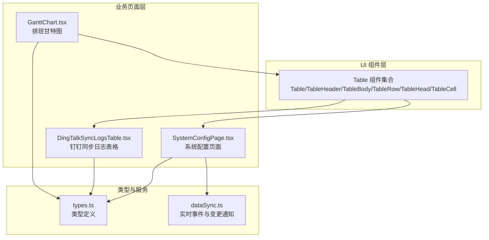
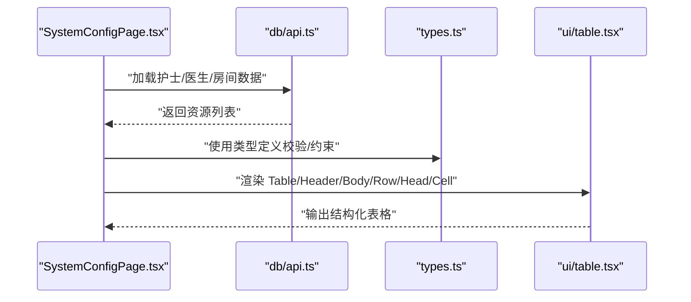
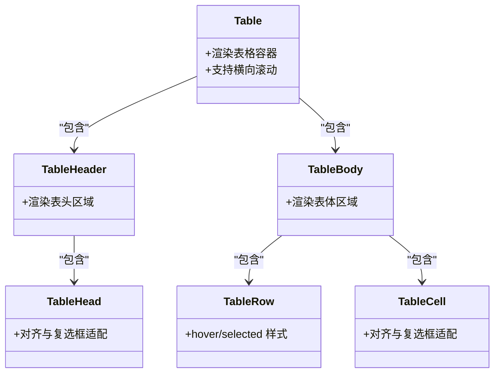
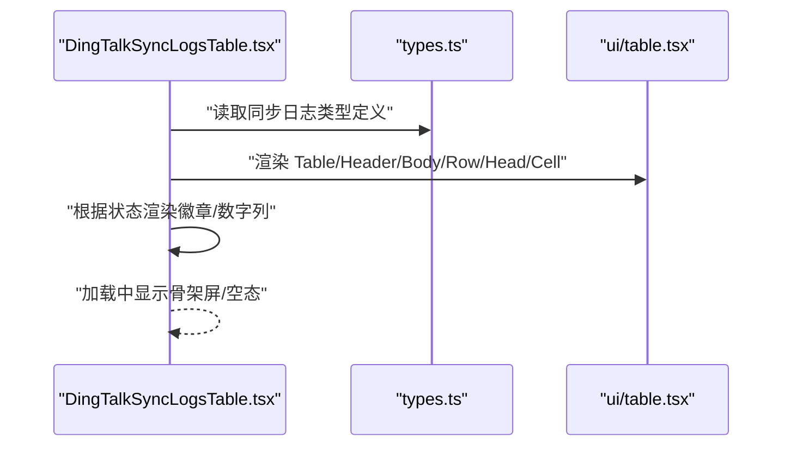
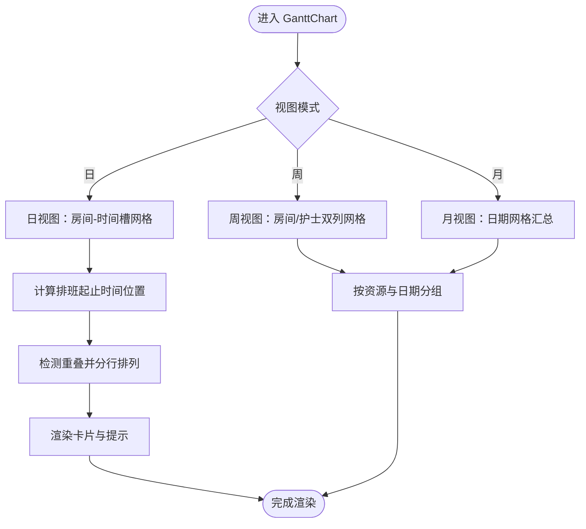
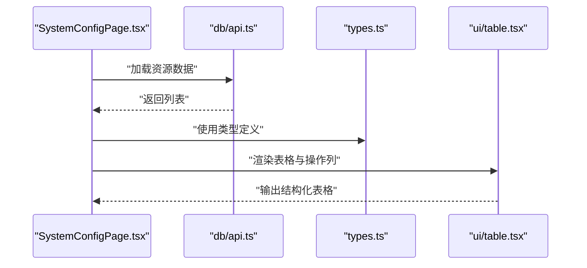
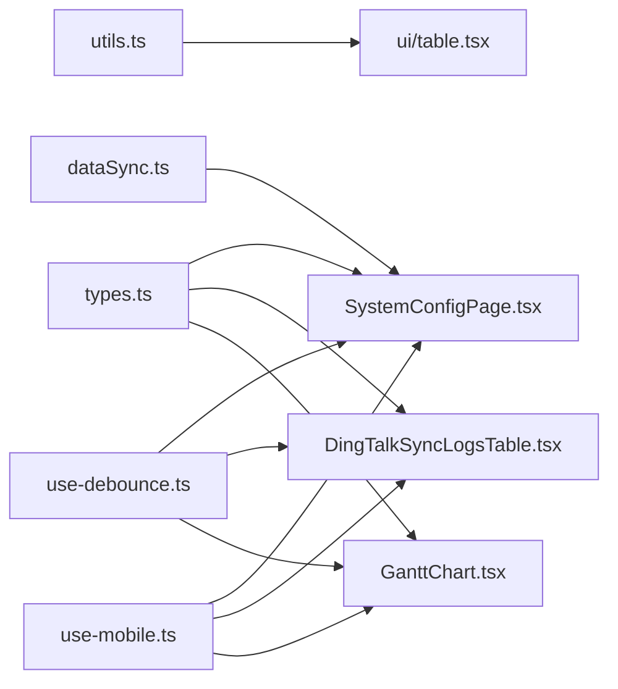

# 表格组件 (Table)

<cite>
**本文引用的文件**
- [src/components/ui/table.tsx](file://src/components/ui/table.tsx)
- [src/components/dingtalk/DingTalkSyncLogsTable.tsx](file://src/components/dingtalk/DingTalkSyncLogsTable.tsx)
- [src/components/appointment/GanttChart.tsx](file://src/components/appointment/GanttChart.tsx)
- [src/types/types.ts](file://src/types/types.ts)
- [src/services/dataSync.ts](file://src/services/dataSync.ts)
- [src/pages/admin/SystemConfigPage.tsx](file://src/pages/admin/SystemConfigPage.tsx)
- [src/hooks/use-debounce.ts](file://src/hooks/use-debounce.ts)
- [src/hooks/use-mobile.ts](file://src/hooks/use-mobile.ts)
- [src/lib/utils.ts](file://src/lib/utils.ts)
- [src/components/ui/pagination.tsx](file://src/components/ui/pagination.tsx)
</cite>

## 目录
1. [引言](#引言)
2. [项目结构](#项目结构)
3. [核心组件](#核心组件)
4. [架构总览](#架构总览)
5. [详细组件分析](#详细组件分析)
6. [依赖关系分析](#依赖关系分析)
7. [性能考虑](#性能考虑)
8. [故障排除指南](#故障排除指南)
9. [结论](#结论)
10. [附录](#附录)

## 引言
本文件围绕仓库中的表格组件体系进行深入文档化，重点覆盖以下方面：
- 结构化组件：Table、TableHeader、TableBody、TableRow、TableHead、TableCell 的使用方式与最佳实践
- 在数据密集型界面中的应用：排班甘特图（GanttChart）与钉钉同步日志（DingTalkSyncLogsTable）
- 高级能力：可排序、可筛选、带分页与虚拟滚动的实现思路
- 性能优化策略：memoization、windowing、防抖、响应式布局
- 无障碍访问支持（ARIA roles）与后端 API 绑定模式

## 项目结构
表格组件位于通用 UI 层，作为可复用的基础构件；业务层通过该组件构建具体页面，如“系统配置”页面与“钉钉同步日志”表格，以及“排班甘特图”的时间轴渲染。

图表来源
- [src/components/ui/table.tsx](file://src/components/ui/table.tsx#L1-L114)
- [src/pages/admin/SystemConfigPage.tsx](file://src/pages/admin/SystemConfigPage.tsx#L1-L200)
- [src/components/dingtalk/DingTalkSyncLogsTable.tsx](file://src/components/dingtalk/DingTalkSyncLogsTable.tsx#L1-L91)
- [src/components/appointment/GanttChart.tsx](file://src/components/appointment/GanttChart.tsx#L1-L200)
- [src/types/types.ts](file://src/types/types.ts#L1-L200)
- [src/services/dataSync.ts](file://src/services/dataSync.ts#L1-L120)

章节来源
- [src/components/ui/table.tsx](file://src/components/ui/table.tsx#L1-L114)
- [src/pages/admin/SystemConfigPage.tsx](file://src/pages/admin/SystemConfigPage.tsx#L1-L200)
- [src/components/dingtalk/DingTalkSyncLogsTable.tsx](file://src/components/dingtalk/DingTalkSyncLogsTable.tsx#L1-L91)
- [src/components/appointment/GanttChart.tsx](file://src/components/appointment/GanttChart.tsx#L1-L200)
- [src/types/types.ts](file://src/types/types.ts#L1-L200)
- [src/services/dataSync.ts](file://src/services/dataSync.ts#L1-L120)

## 核心组件
- Table：外层容器，负责横向滚动与表格尺寸控制
- TableHeader/TableBody/TableFooter：语义化表头、主体与页脚
- TableRow：行级交互态（hover、selected）
- TableHead/TableCell：表头与单元格，内置对复选框的 ARIA 支持与对齐样式

这些组件均通过工具函数合并类名，确保与 Tailwind 主题一致，并提供最小化的语义包装，便于上层业务自由组合。

章节来源
- [src/components/ui/table.tsx](file://src/components/ui/table.tsx#L1-L114)

## 架构总览
下图展示了“系统配置页面”中表格的典型使用路径：页面从数据库加载资源数据，使用基础表格组件渲染，配合表单与对话框完成增删改查。

图表来源
- [src/pages/admin/SystemConfigPage.tsx](file://src/pages/admin/SystemConfigPage.tsx#L1-L200)
- [src/types/types.ts](file://src/types/types.ts#L1-L200)
- [src/components/ui/table.tsx](file://src/components/ui/table.tsx#L1-L114)

## 详细组件分析

### 基础表格组件（Table、TableHeader、TableBody、TableRow、TableHead、TableCell）
- 设计要点
  - 外层容器提供横向滚动，避免内容溢出
  - 行组件提供 hover 与 selected 状态样式，便于交互反馈
  - 表头与单元格对复选框场景提供对齐与间距处理
- 使用建议
  - 在复杂数据场景中，优先将排序、筛选、分页等逻辑置于上层容器，表格组件仅负责结构化渲染
  - 为可排序列提供 ARIA 属性（见无障碍章节）

图表来源
- [src/components/ui/table.tsx](file://src/components/ui/table.tsx#L1-L114)

章节来源
- [src/components/ui/table.tsx](file://src/components/ui/table.tsx#L1-L114)

### 钉钉同步日志表格（DingTalkSyncLogsTable）
- 功能概述
  - 展示同步日志列表：时间、类型、状态、总数/成功/失败/跳过、操作人
  - 支持加载骨架屏与空态提示
  - 提供刷新按钮触发重新拉取
- 数据绑定
  - 通过属性接收日志数组、加载状态与回调函数
  - 日志项来自类型定义中的同步日志结构
- 无障碍与交互
  - 表头与单元格遵循基础样式约定，便于后续扩展 ARIA

图表来源
- [src/components/dingtalk/DingTalkSyncLogsTable.tsx](file://src/components/dingtalk/DingTalkSyncLogsTable.tsx#L1-L91)
- [src/types/types.ts](file://src/types/types.ts#L300-L370)
- [src/components/ui/table.tsx](file://src/components/ui/table.tsx#L1-L114)

章节来源
- [src/components/dingtalk/DingTalkSyncLogsTable.tsx](file://src/components/dingtalk/DingTalkSyncLogsTable.tsx#L1-L91)
- [src/types/types.ts](file://src/types/types.ts#L300-L370)

### 排班甘特图（GanttChart）与时间轴渲染
- 功能概述
  - 支持日/周/月三种视图，按资源（房间/护士）与日期聚合排班
  - 通过颜色与渐变展示资源占用与组合关系
  - 点击单元格弹出详情对话框
- 与表格的关系
  - 甘特图在日视图中采用“房间-时间槽”网格布局，本质上是“时间轴+资源占用”的可视化表格
  - 通过计算每个排班在时间轴上的位置，叠加渲染卡片，形成“虚拟表格”的视觉效果
- 关键算法
  - 时间槽计算与位置换算
  - 重叠排班分行排列（避免遮挡）
  - 日期网格按周/月分组

图表来源
- [src/components/appointment/GanttChart.tsx](file://src/components/appointment/GanttChart.tsx#L1-L200)
- [src/components/appointment/GanttChart.tsx](file://src/components/appointment/GanttChart.tsx#L200-L500)
- [src/components/appointment/GanttChart.tsx](file://src/components/appointment/GanttChart.tsx#L500-L917)

章节来源
- [src/components/appointment/GanttChart.tsx](file://src/components/appointment/GanttChart.tsx#L1-L200)
- [src/components/appointment/GanttChart.tsx](file://src/components/appointment/GanttChart.tsx#L200-L500)
- [src/components/appointment/GanttChart.tsx](file://src/components/appointment/GanttChart.tsx#L500-L917)

### 系统配置页面中的表格（CRUD 场景）
- 功能概述
  - 使用基础表格组件展示资源列表（护士/医生/房间）
  - 配合表单与对话框实现新增、编辑、删除
- 数据绑定
  - 通过异步加载资源数据，渲染表格
  - 类型定义用于字段约束与提示

图表来源
- [src/pages/admin/SystemConfigPage.tsx](file://src/pages/admin/SystemConfigPage.tsx#L1-L200)
- [src/types/types.ts](file://src/types/types.ts#L240-L320)
- [src/components/ui/table.tsx](file://src/components/ui/table.tsx#L1-L114)

章节来源
- [src/pages/admin/SystemConfigPage.tsx](file://src/pages/admin/SystemConfigPage.tsx#L1-L200)
- [src/types/types.ts](file://src/types/types.ts#L240-L320)

## 依赖关系分析
- 组件依赖
  - 表格组件依赖工具函数合并类名，保证样式一致性
  - 业务组件依赖类型定义，确保数据结构正确
- 服务依赖
  - 实时事件服务用于数据变更通知，支撑表格数据的动态更新
- Hook 与工具
  - 防抖 Hook 用于搜索/筛选输入的节流
  - 移动端 Hook 用于响应式布局适配

图表来源
- [src/lib/utils.ts](file://src/lib/utils.ts#L1-L40)
- [src/components/ui/table.tsx](file://src/components/ui/table.tsx#L1-L114)
- [src/types/types.ts](file://src/types/types.ts#L1-L200)
- [src/pages/admin/SystemConfigPage.tsx](file://src/pages/admin/SystemConfigPage.tsx#L1-L200)
- [src/components/dingtalk/DingTalkSyncLogsTable.tsx](file://src/components/dingtalk/DingTalkSyncLogsTable.tsx#L1-L91)
- [src/components/appointment/GanttChart.tsx](file://src/components/appointment/GanttChart.tsx#L1-L200)
- [src/hooks/use-debounce.ts](file://src/hooks/use-debounce.ts#L1-L15)
- [src/hooks/use-mobile.ts](file://src/hooks/use-mobile.ts#L1-L19)
- [src/services/dataSync.ts](file://src/services/dataSync.ts#L1-L120)

章节来源
- [src/lib/utils.ts](file://src/lib/utils.ts#L1-L40)
- [src/hooks/use-debounce.ts](file://src/hooks/use-debounce.ts#L1-L15)
- [src/hooks/use-mobile.ts](file://src/hooks/use-mobile.ts#L1-L19)
- [src/services/dataSync.ts](file://src/services/dataSync.ts#L1-L120)

## 性能考虑
- 渲染性能
  - 使用 React.memo 或类似机制避免不必要的重渲染（参考严格筛选优化文档中的策略）
  - 控制 DOM 节点数量：隐藏未选资源、减少嵌套层级
- 输入处理
  - 使用防抖 Hook 降低高频输入带来的重渲染压力
- 分页与窗口化
  - 对于超大数据集，优先采用后端分页或前端窗口化（windowing）策略，仅渲染可视区域
  - 建议结合虚拟列表库（如 react-window 或 @tanstack/react-virtual）实现高性能滚动
- 响应式设计
  - 使用移动端 Hook 判断断点，动态调整列宽与布局
  - 表格容器提供横向滚动，避免小屏拥挤
- 实时数据
  - 通过实时事件服务推送变更，减少轮询成本，提升交互响应速度

章节来源
- [src/hooks/use-debounce.ts](file://src/hooks/use-debounce.ts#L1-L15)
- [src/hooks/use-mobile.ts](file://src/hooks/use-mobile.ts#L1-L19)
- [src/services/dataSync.ts](file://src/services/dataSync.ts#L1-L120)

## 故障排除指南
- 表格溢出与滚动异常
  - 确认外层容器具备横向滚动能力
  - 检查列宽设置，避免固定宽度导致滚动失效
- 交互态不生效
  - 确保行组件处于可交互上下文（例如包裹在可点击的容器内）
- 数据为空或加载中
  - 针对加载骨架屏与空态进行统一处理，避免误判
- 实时更新不同步
  - 检查实时事件发布与订阅流程，确认事件类型与数据结构一致

章节来源
- [src/components/ui/table.tsx](file://src/components/ui/table.tsx#L1-L114)
- [src/services/dataSync.ts](file://src/services/dataSync.ts#L1-L120)

## 结论
- 表格组件提供了结构化、语义化的基础能力，适合在数据密集型界面中复用
- 通过类型定义与服务层解耦，表格组件可灵活适配多种业务场景
- 在复杂场景（如甘特图、日志表格）中，建议将排序、筛选、分页与窗口化等能力上提至容器组件，表格组件专注于结构化渲染
- 性能优化与无障碍访问应贯穿设计与实现全过程

## 附录

### 可排序、可筛选、带分页与虚拟滚动的实现思路
- 可排序
  - 为表头列添加点击事件，维护排序状态（升/降序）
  - 将排序逻辑置于上层容器，表格组件仅负责渲染
- 可筛选
  - 使用防抖 Hook 处理输入，减少重渲染
  - 上层容器根据筛选条件过滤数据，再传入表格组件
- 分页
  - 建议采用后端分页，表格组件仅渲染当前页数据
  - 若前端分页，注意控制每页条目数量，避免一次性渲染过多
- 虚拟滚动
  - 使用虚拟列表库，仅渲染可视区域内的行
  - 保持行高稳定，避免滚动抖动

章节来源
- [src/hooks/use-debounce.ts](file://src/hooks/use-debounce.ts#L1-L15)
- [src/components/ui/pagination.tsx](file://src/components/ui/pagination.tsx#L1-L66)

### 无障碍访问（ARIA roles）建议
- 表格语义
  - 使用语义化标签（thead、tbody、tr、th、td）确保屏幕阅读器可理解结构
- 排序列
  - 为可排序列添加 aria-sort 属性，指示当前排序状态
- 交互元素
  - 为按钮、链接等交互元素提供合适的 role 与 aria-label
- 状态提示
  - 为加载、空态、错误状态提供可读的文本提示

章节来源
- [src/components/ui/table.tsx](file://src/components/ui/table.tsx#L1-L114)

### 与后端 API 的数据绑定模式
- 数据获取
  - 页面组件统一发起请求，拿到数据后渲染表格
- 类型约束
  - 使用类型定义确保字段一致性，减少运行时错误
- 实时更新
  - 通过实时事件服务推送变更，页面组件订阅并更新本地状态

章节来源
- [src/pages/admin/SystemConfigPage.tsx](file://src/pages/admin/SystemConfigPage.tsx#L1-L200)
- [src/types/types.ts](file://src/types/types.ts#L1-L200)
- [src/services/dataSync.ts](file://src/services/dataSync.ts#L1-L120)