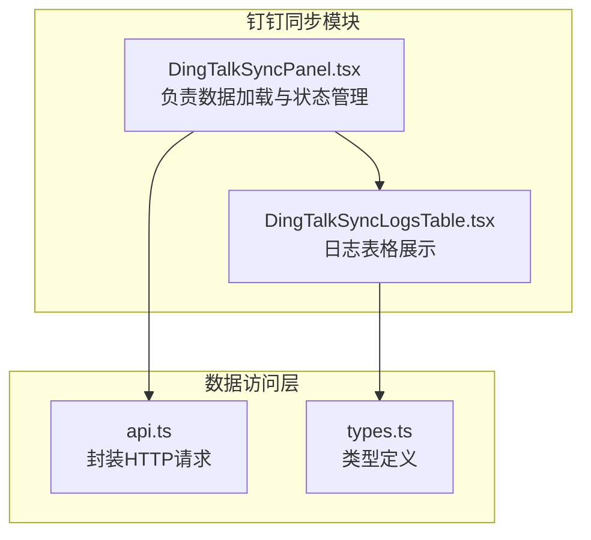
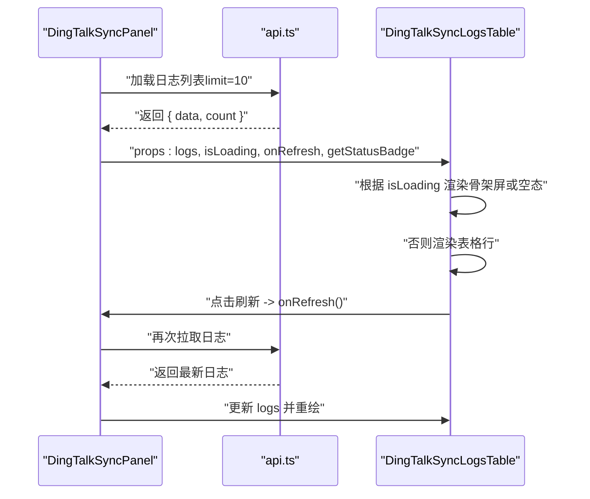
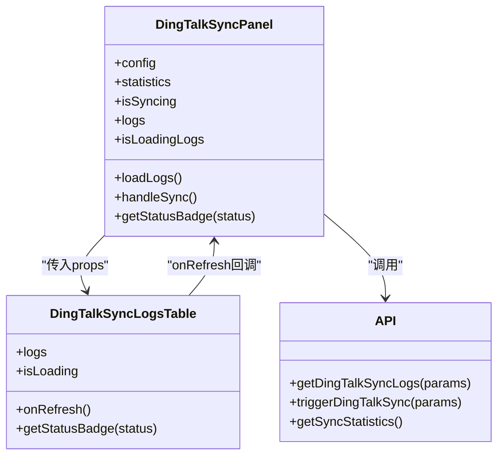

# 同步日志表格

<cite>
**本文引用的文件**
- [DingTalkSyncLogsTable.tsx](file://src/components/dingtalk/DingTalkSyncLogsTable.tsx)
- [DingTalkSyncPanel.tsx](file://src/components/dingtalk/DingTalkSyncPanel.tsx)
- [api.ts](file://src/db/api.ts)
- [types.ts](file://src/types/types.ts)
</cite>

## 目录
1. [简介](#简介)
2. [项目结构](#项目结构)
3. [核心组件](#核心组件)
4. [架构总览](#架构总览)
5. [详细组件分析](#详细组件分析)
6. [依赖关系分析](#依赖关系分析)
7. [性能考量](#性能考量)
8. [故障排查指南](#故障排查指南)
9. [结论](#结论)
10. [附录](#附录)

## 简介
本文件围绕 DingTalkSyncLogsTable 组件展开，系统性地解析其数据展示逻辑与交互设计。重点说明组件如何接收 logs 数组、isLoading 状态与 onRefresh 回调，并实现“加载中”“无数据”“正常展示”的条件渲染；详解表格列含义，尤其是通过 getStatusBadge 函数渲染状态徽章的机制；解释时间格式化处理、操作人信息展示逻辑，以及刷新按钮的交互行为。同时提供在其他组件中正确使用该表格的实践建议，并讨论当前分页缺失的现状与未来扩展建议。

## 项目结构
DingTalkSyncLogsTable 是钉钉同步功能的一部分，通常由上层容器组件（如 DingTalkSyncPanel）负责数据获取与状态管理，并将数据与回调传入该表格组件。

图表来源
- [DingTalkSyncPanel.tsx](file://src/components/dingtalk/DingTalkSyncPanel.tsx#L1-L236)
- [DingTalkSyncLogsTable.tsx](file://src/components/dingtalk/DingTalkSyncLogsTable.tsx#L1-L91)
- [api.ts](file://src/db/api.ts#L1349-L1532)
- [types.ts](file://src/types/types.ts#L277-L380)

章节来源
- [DingTalkSyncPanel.tsx](file://src/components/dingtalk/DingTalkSyncPanel.tsx#L1-L236)
- [DingTalkSyncLogsTable.tsx](file://src/components/dingtalk/DingTalkSyncLogsTable.tsx#L1-L91)
- [api.ts](file://src/db/api.ts#L1349-L1532)
- [types.ts](file://src/types/types.ts#L277-L380)

## 核心组件
- DingTalkSyncLogsTable：接收 logs、isLoading、onRefresh、getStatusBadge 四个属性，根据状态进行条件渲染，展示同步日志表格。
- DingTalkSyncPanel：作为上层容器，负责加载配置、统计数据、日志列表，并向表格传递状态与回调。
- api.ts：封装触发同步、获取日志、获取统计等 HTTP 请求。
- types.ts：定义同步类型、状态、日志结构等类型，确保前后端字段一致。

章节来源
- [DingTalkSyncLogsTable.tsx](file://src/components/dingtalk/DingTalkSyncLogsTable.tsx#L1-L91)
- [DingTalkSyncPanel.tsx](file://src/components/dingtalk/DingTalkSyncPanel.tsx#L1-L236)
- [api.ts](file://src/db/api.ts#L1349-L1532)
- [types.ts](file://src/types/types.ts#L277-L380)

## 架构总览
下图展示了从面板到表格的数据流与交互路径。

图表来源
- [DingTalkSyncPanel.tsx](file://src/components/dingtalk/DingTalkSyncPanel.tsx#L54-L64)
- [DingTalkSyncLogsTable.tsx](file://src/components/dingtalk/DingTalkSyncLogsTable.tsx#L19-L39)
- [api.ts](file://src/db/api.ts#L1383-L1418)

章节来源
- [DingTalkSyncPanel.tsx](file://src/components/dingtalk/DingTalkSyncPanel.tsx#L54-L64)
- [DingTalkSyncLogsTable.tsx](file://src/components/dingtalk/DingTalkSyncLogsTable.tsx#L19-L39)
- [api.ts](file://src/db/api.ts#L1383-L1418)

## 详细组件分析

### 组件接口与职责
- 接口属性
  - logs: 日志数组，每条日志包含同步类型、状态、时间、数量统计、操作人等字段。
  - isLoading: 布尔值，指示是否处于加载中。
  - onRefresh: 刷新回调，用于重新拉取日志。
  - getStatusBadge: 根据状态字符串渲染对应徽章的函数。
- 渲染策略
  - 加载中：渲染若干条骨架屏占位。
  - 无数据：显示提示文案与刷新按钮。
  - 正常展示：渲染带表头与数据行的表格，并在表尾提供刷新按钮。

章节来源
- [DingTalkSyncLogsTable.tsx](file://src/components/dingtalk/DingTalkSyncLogsTable.tsx#L6-L18)
- [DingTalkSyncLogsTable.tsx](file://src/components/dingtalk/DingTalkSyncLogsTable.tsx#L19-L39)
- [DingTalkSyncLogsTable.tsx](file://src/components/dingtalk/DingTalkSyncLogsTable.tsx#L41-L91)

### 表格列与字段语义
- 同步时间：使用本地化时间格式展示 started_at。
- 类型：将 sync_type 映射为“手动同步/自动同步/增量同步”等中文标签。
- 状态：通过 getStatusBadge(status) 动态渲染徽章，支持 success、failed、running、partial、默认等状态。
- 总数：展示本次同步处理的总人数。
- 成功：展示成功人数，使用绿色强调。
- 失败：展示失败人数，使用红色强调。
- 跳过：展示跳过人数，使用黄色强调。
- 操作人：优先展示 full_name，其次展示 username，若均不存在则显示短横线占位。

章节来源
- [DingTalkSyncLogsTable.tsx](file://src/components/dingtalk/DingTalkSyncLogsTable.tsx#L54-L83)
- [DingTalkSyncPanel.tsx](file://src/components/dingtalk/DingTalkSyncPanel.tsx#L105-L118)

### 状态徽章渲染机制（getStatusBadge）
- 设计要点
  - 通过 getStatusBadge(status) 将状态字符串映射为带图标与颜色的徽章组件。
  - 支持多种状态：成功、失败、进行中、部分成功、待处理等。
  - 进行中状态带有旋转动画，直观提示同步进行中。
- 使用方式
  - 上层容器（如 DingTalkSyncPanel）定义 getStatusBadge，并将其作为 prop 传入表格组件。
  - 表格组件仅负责消费该函数，不关心具体实现细节。

章节来源
- [DingTalkSyncLogsTable.tsx](file://src/components/dingtalk/DingTalkSyncLogsTable.tsx#L10-L10)
- [DingTalkSyncPanel.tsx](file://src/components/dingtalk/DingTalkSyncPanel.tsx#L105-L118)

### 时间格式化处理
- 同步时间列使用 new Date(log.started_at).toLocaleString('zh-CN') 进行本地化格式化，确保中文环境下的可读性。
- 建议
  - 若需要更细粒度的时间控制（如时区、日期/时间分离），可在上层统一格式化后再传入表格。

章节来源
- [DingTalkSyncLogsTable.tsx](file://src/components/dingtalk/DingTalkSyncLogsTable.tsx#L67-L70)

### 操作人信息展示逻辑
- 优先级：full_name > username > “-”
- 若 created_by_profile 不存在或字段为空，则回退到短横线占位，避免空白单元格影响可读性。

章节来源
- [DingTalkSyncLogsTable.tsx](file://src/components/dingtalk/DingTalkSyncLogsTable.tsx#L80-L82)

### 刷新按钮交互行为
- 位置：表格上方与下方各有一个刷新按钮，点击后触发 onRefresh 回调。
- onRefresh 的职责：重新拉取日志列表（例如调用 getDingTalkSyncLogs），并更新 logs 状态。
- 上层容器（DingTalkSyncPanel）通常会将 isLoading 与 logs 状态传入表格，从而形成“点击刷新 -> 加载中 -> 展示最新数据”的闭环。

章节来源
- [DingTalkSyncLogsTable.tsx](file://src/components/dingtalk/DingTalkSyncLogsTable.tsx#L43-L48)
- [DingTalkSyncLogsTable.tsx](file://src/components/dingtalk/DingTalkSyncLogsTable.tsx#L33-L37)
- [DingTalkSyncPanel.tsx](file://src/components/dingtalk/DingTalkSyncPanel.tsx#L54-L64)

### 在其他组件中的正确使用方式
- 状态管理
  - 在父组件中维护 logs 与 isLoading 两个状态。
  - 使用异步函数（如 getDingTalkSyncLogs）拉取数据，在请求开始前设置 isLoading=true，结束后设置 isLoading=false 并更新 logs。
- 事件回调
  - 将“刷新”按钮的点击事件绑定到 onRefresh，onRefresh 内部调用上述拉取函数。
- 徽章函数
  - 如需自定义状态徽章样式，可在父组件定义 getStatusBadge，并传入表格组件。
- 示例路径（不直接粘贴代码）
  - 父组件状态与刷新逻辑：[DingTalkSyncPanel.tsx](file://src/components/dingtalk/DingTalkSyncPanel.tsx#L22-L64)
  - 表格渲染与刷新按钮：[DingTalkSyncLogsTable.tsx](file://src/components/dingtalk/DingTalkSyncLogsTable.tsx#L41-L48)
  - 数据获取与转换：[api.ts](file://src/db/api.ts#L1383-L1418)

章节来源
- [DingTalkSyncPanel.tsx](file://src/components/dingtalk/DingTalkSyncPanel.tsx#L22-L64)
- [DingTalkSyncLogsTable.tsx](file://src/components/dingtalk/DingTalkSyncLogsTable.tsx#L41-L48)
- [api.ts](file://src/db/api.ts#L1383-L1418)

### 分页功能现状与扩展建议
- 现状
  - 当前表格未内置分页控件，上层容器通过 limit 参数限制初始加载数量（例如 limit: 10），并在需要时一次性拉取更多数据。
  - 日志列表接口支持 limit/offset/status 查询参数，具备分页基础能力。
- 建议
  - 在表格组件外层增加分页组件（如 Pagination），将当前页码与每页大小作为 props 传入父组件，父组件据此计算 offset 并调用 getDingTalkSyncLogs。
  - 服务端接口已支持 limit/offset，前端可按需扩展为标准分页模式。
- 参考接口
  - 日志列表接口参数与返回结构：[api.ts](file://src/db/api.ts#L1383-L1418)
  - 服务端实现（含分页与过滤）：[server/api-server.js](file://server/server/api-server.js#L621-L645)

章节来源
- [api.ts](file://src/db/api.ts#L1383-L1418)
- [server/api-server.js](file://server/server/api-server.js#L621-L645)

## 依赖关系分析
- 组件耦合
  - DingTalkSyncLogsTable 与 DingTalkSyncPanel 之间通过 props 传递数据与回调，耦合度低，职责清晰。
  - 表格组件不直接依赖具体 API 实现，仅依赖 getStatusBadge 函数签名，便于替换与扩展。
- 外部依赖
  - ui 组件库：Table、Button、Badge、Skeleton 等。
  - 类型定义：DingTalkSyncLogV2、SyncStatus、SyncType 等，保证字段一致性。

图表来源
- [DingTalkSyncPanel.tsx](file://src/components/dingtalk/DingTalkSyncPanel.tsx#L1-L236)
- [DingTalkSyncLogsTable.tsx](file://src/components/dingtalk/DingTalkSyncLogsTable.tsx#L1-L91)
- [api.ts](file://src/db/api.ts#L1349-L1532)

章节来源
- [DingTalkSyncPanel.tsx](file://src/components/dingtalk/DingTalkSyncPanel.tsx#L1-L236)
- [DingTalkSyncLogsTable.tsx](file://src/components/dingtalk/DingTalkSyncLogsTable.tsx#L1-L91)
- [api.ts](file://src/db/api.ts#L1349-L1532)

## 性能考量
- 骨架屏优化：在加载中使用 Skeleton 占位，减少白屏与布局抖动。
- 条件渲染：无数据时直接渲染提示与刷新按钮，避免不必要的表格渲染。
- 列渲染优化：仅渲染必要列，避免复杂子组件在每一行重复创建。
- 分页扩展：当前采用“少量初始数据 + 手动刷新”的方式，建议引入分页组件以降低首屏压力与网络开销。

## 故障排查指南
- 无法显示日志
  - 检查 isLoading 与 logs 的状态是否正确更新。
  - 确认 onRefresh 回调是否被调用且成功拉取数据。
  - 参考：[DingTalkSyncPanel.tsx](file://src/components/dingtalk/DingTalkSyncPanel.tsx#L54-L64)
- 状态徽章不显示
  - 确认 getStatusBadge 函数已正确传入表格组件。
  - 检查状态字符串是否符合预期（success/failed/running/partial/default）。
  - 参考：[DingTalkSyncPanel.tsx](file://src/components/dingtalk/DingTalkSyncPanel.tsx#L105-L118)
- 时间显示异常
  - 确认 started_at 字段为合法时间字符串，且浏览器环境支持本地化格式化。
  - 参考：[DingTalkSyncLogsTable.tsx](file://src/components/dingtalk/DingTalkSyncLogsTable.tsx#L67-L70)
- 操作人显示为“-”
  - created_by_profile 或 full_name/username 字段为空，属预期占位。
  - 参考：[DingTalkSyncLogsTable.tsx](file://src/components/dingtalk/DingTalkSyncLogsTable.tsx#L80-L82)

章节来源
- [DingTalkSyncPanel.tsx](file://src/components/dingtalk/DingTalkSyncPanel.tsx#L54-L64)
- [DingTalkSyncPanel.tsx](file://src/components/dingtalk/DingTalkSyncPanel.tsx#L105-L118)
- [DingTalkSyncLogsTable.tsx](file://src/components/dingtalk/DingTalkSyncLogsTable.tsx#L67-L70)
- [DingTalkSyncLogsTable.tsx](file://src/components/dingtalk/DingTalkSyncLogsTable.tsx#L80-L82)

## 结论
DingTalkSyncLogsTable 以简洁的 props 接口实现了灵活的日志展示：通过 isLoading 与 onRefresh 提供良好的加载与刷新体验；通过 getStatusBadge 将状态可视化；通过本地化时间格式与操作人优先级策略提升可读性。当前未内置分页，但具备良好的扩展空间。建议在上层容器中引入分页组件，并结合服务端 limit/offset 参数实现标准分页。

## 附录
- 关键字段与类型参考
  - 同步类型与状态枚举：[types.ts](file://src/types/types.ts#L277-L380)
  - 日志结构（新版）：[types.ts](file://src/types/types.ts#L306-L321)
  - 日志列表接口参数与返回：[api.ts](file://src/db/api.ts#L1383-L1418)
  - 服务端分页与过滤实现：[server/api-server.js](file://server/server/api-server.js#L621-L645)