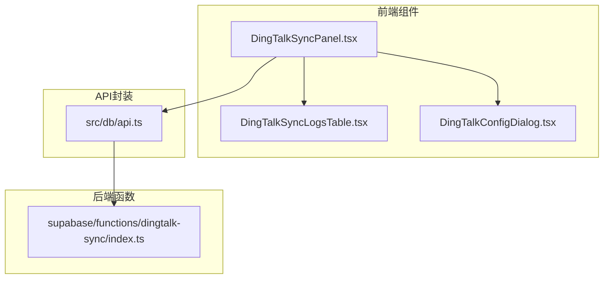
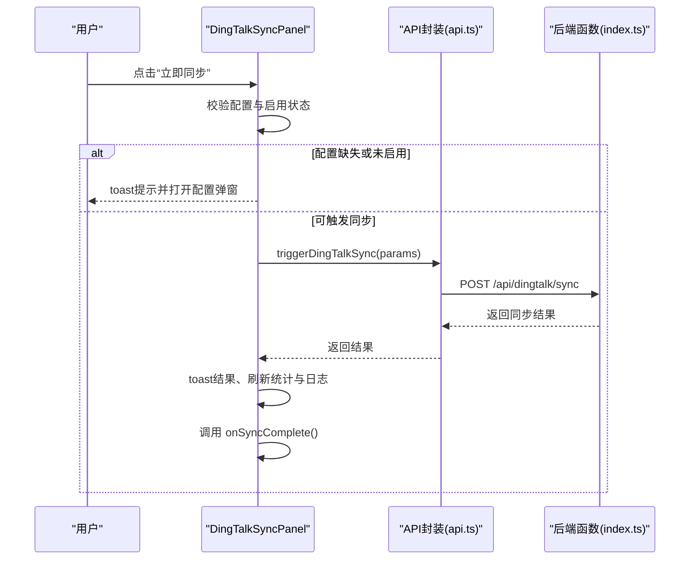
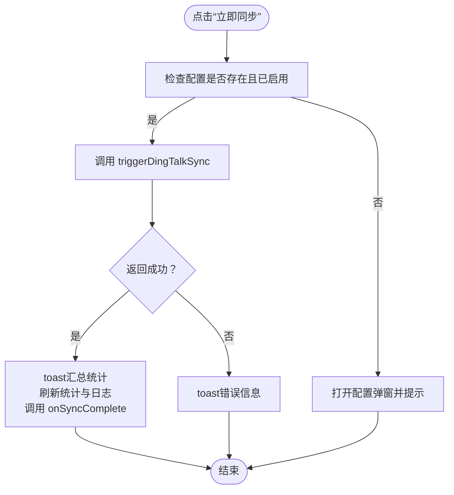
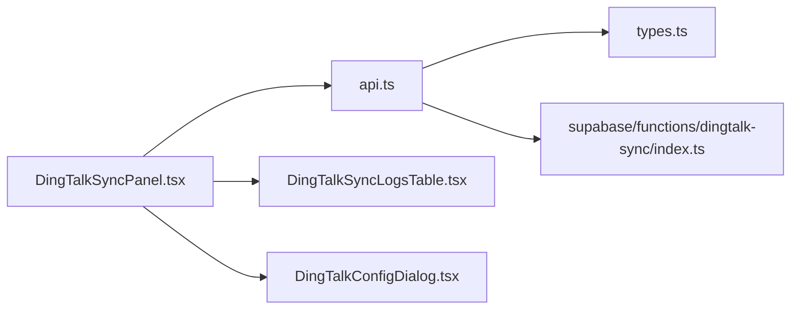

# 同步面板

<cite>
**本文引用的文件**
- [DingTalkSyncPanel.tsx](file://src/components/dingtalk/DingTalkSyncPanel.tsx)
- [DingTalkSyncLogsTable.tsx](file://src/components/dingtalk/DingTalkSyncLogsTable.tsx)
- [DingTalkConfigDialog.tsx](file://src/components/dingtalk/DingTalkConfigDialog.tsx)
- [api.ts](file://src/db/api.ts)
- [types.ts](file://src/types/types.ts)
- [index.ts](file://supabase/functions/dingtalk-sync/index.ts)
- [UserManagementPage.tsx](file://src/pages/admin/UserManagementPage.tsx)
</cite>

## 目录
1. [简介](#简介)
2. [项目结构](#项目结构)
3. [核心组件](#核心组件)
4. [架构总览](#架构总览)
5. [详细组件分析](#详细组件分析)
6. [依赖关系分析](#依赖关系分析)
7. [性能考虑](#性能考虑)
8. [故障排查指南](#故障排查指南)
9. [结论](#结论)
10. [附录](#附录)

## 简介
本文件面向“钉钉组织架构同步”功能中的同步面板组件（DingTalkSyncPanel），系统化阐述其整体布局、操作流程与状态管理机制。文档重点覆盖以下方面：
- 通过 getDingTalkSyncConfig、triggerDingTalkSync、getDingTalkSyncLogs、getSyncStatistics 四个API完成配置读取、触发同步、日志加载与统计展示。
- 同步触发逻辑：配置检查、错误提示、同步结果反馈。
- 统计卡片的数据来源与含义。
- Tabs组件中日志标签页的集成方式。
- onSyncComplete回调机制与用户管理模块的联动。
- 实际使用示例、常见问题排查与性能优化建议。

## 项目结构
同步面板位于前端组件层，配合数据库API封装与后端Edge Function实现完整的同步链路。关键文件与职责如下：
- 组件层：DingTalkSyncPanel.tsx、DingTalkSyncLogsTable.tsx、DingTalkConfigDialog.tsx
- API封装：src/db/api.ts（统一对外暴露getDingTalkSyncConfig、triggerDingTalkSync、getDingTalkSyncLogs、getSyncStatistics等）
- 类型定义：src/types/types.ts（包含DingTalkSyncConfig、DingTalkSyncLogV2、SyncStatistics等）
- 后端同步逻辑：supabase/functions/dingtalk-sync/index.ts（鉴权校验、配置读取、钉钉接口调用、冲突策略处理、日志落库与状态更新）

图表来源
- [DingTalkSyncPanel.tsx](file://src/components/dingtalk/DingTalkSyncPanel.tsx#L1-L237)
- [DingTalkSyncLogsTable.tsx](file://src/components/dingtalk/DingTalkSyncLogsTable.tsx#L1-L91)
- [DingTalkConfigDialog.tsx](file://src/components/dingtalk/DingTalkConfigDialog.tsx#L1-L302)
- [api.ts](file://src/db/api.ts#L1280-L1532)
- [index.ts](file://supabase/functions/dingtalk-sync/index.ts#L1-L384)

章节来源
- [DingTalkSyncPanel.tsx](file://src/components/dingtalk/DingTalkSyncPanel.tsx#L1-L237)
- [DingTalkSyncLogsTable.tsx](file://src/components/dingtalk/DingTalkSyncLogsTable.tsx#L1-L91)
- [DingTalkConfigDialog.tsx](file://src/components/dingtalk/DingTalkConfigDialog.tsx#L1-L302)
- [api.ts](file://src/db/api.ts#L1280-L1532)
- [types.ts](file://src/types/types.ts#L277-L487)
- [index.ts](file://supabase/functions/dingtalk-sync/index.ts#L1-L384)

## 核心组件
- DingTalkSyncPanel：主面板，负责加载配置、统计、触发同步、展示日志与配置弹窗。
- DingTalkSyncLogsTable：日志表格，支持刷新、骨架屏与空态。
- DingTalkConfigDialog：配置表单，支持开关启用、自动同步、冲突策略等。
- API封装：统一暴露 getDingTalkSyncConfig、triggerDingTalkSync、getDingTalkSyncLogs、getSyncStatistics。
- 类型定义：提供DingTalkSyncConfig、DingTalkSyncLogV2、SyncStatistics等强类型支撑。
- 后端函数：鉴权校验、读取配置、拉取钉钉部门/用户、冲突策略处理、写入日志与统计。

章节来源
- [DingTalkSyncPanel.tsx](file://src/components/dingtalk/DingTalkSyncPanel.tsx#L1-L237)
- [DingTalkSyncLogsTable.tsx](file://src/components/dingtalk/DingTalkSyncLogsTable.tsx#L1-L91)
- [DingTalkConfigDialog.tsx](file://src/components/dingtalk/DingTalkConfigDialog.tsx#L1-L302)
- [api.ts](file://src/db/api.ts#L1280-L1532)
- [types.ts](file://src/types/types.ts#L277-L487)
- [index.ts](file://supabase/functions/dingtalk-sync/index.ts#L1-L384)

## 架构总览
同步面板采用“前端组件 + API封装 + 后端函数”的分层设计，数据流自上而下：
- 配置与统计：组件初始化时分别调用 getDingTalkSyncConfig 与 getSyncStatistics，渲染统计卡片与配置状态。
- 日志：默认加载最近若干条日志，支持刷新。
- 触发同步：点击“立即同步”，组件校验配置后调用 triggerDingTalkSync，完成后刷新统计与日志，并通过 onSyncComplete 回调刷新用户列表。
- 后端同步：Edge Function 校验权限、读取配置、调用钉钉API、按策略处理冲突、写入日志与更新配置最后同步时间。

图表来源
- [DingTalkSyncPanel.tsx](file://src/components/dingtalk/DingTalkSyncPanel.tsx#L66-L103)
- [api.ts](file://src/db/api.ts#L1348-L1378)
- [index.ts](file://supabase/functions/dingtalk-sync/index.ts#L53-L120)

章节来源
- [DingTalkSyncPanel.tsx](file://src/components/dingtalk/DingTalkSyncPanel.tsx#L66-L103)
- [api.ts](file://src/db/api.ts#L1348-L1378)
- [index.ts](file://supabase/functions/dingtalk-sync/index.ts#L53-L120)

## 详细组件分析

### DingTalkSyncPanel 组件
- 布局与交互
  - 统计卡片：总同步次数、成功次数、失败次数、已同步用户数，来源于 getSyncStatistics。
  - 主面板：展示配置状态（启用/未启用）、最后同步时间；提供“配置”与“立即同步”两个按钮。
  - Tabs：默认激活“同步日志”，内嵌 DingTalkSyncLogsTable。
- 状态管理
  - config：钉钉同步配置对象，来自 getDingTalkSyncConfig。
  - statistics：同步统计，来自 getSyncStatistics。
  - isSyncing：同步中状态，控制按钮禁用与文案。
  - showConfigDialog：配置弹窗开关。
  - logs：日志列表，来自 getDingTalkSyncLogs。
  - isLoadingLogs：日志加载状态，用于骨架屏。
- 触发同步逻辑
  - 配置检查：若无配置或未启用，toast提示并打开配置弹窗。
  - 参数组装：传入 sync_type、selected_departments、conflict_strategy。
  - 结果处理：成功则toast汇总统计，刷新统计与日志，并调用 onSyncComplete；失败则toast错误信息。
- 日志与统计
  - 日志表格：支持刷新、空态与骨架屏。
  - 统计卡片：展示总次数、成功/失败/已同步用户数。

图表来源
- [DingTalkSyncPanel.tsx](file://src/components/dingtalk/DingTalkSyncPanel.tsx#L66-L103)
- [api.ts](file://src/db/api.ts#L1348-L1378)

章节来源
- [DingTalkSyncPanel.tsx](file://src/components/dingtalk/DingTalkSyncPanel.tsx#L1-L237)
- [api.ts](file://src/db/api.ts#L1280-L1532)

### DingTalkSyncLogsTable 组件
- 功能要点
  - isLoading 为真时渲染骨架屏。
  - logs 为空时显示“暂无同步日志”，提供“刷新”按钮。
  - 展示字段：同步时间、类型、状态、总数、成功、失败、跳过、操作人。
  - 通过 getStatusBadge 将状态映射为带图标的徽章。
- 与父组件的协作
  - 由父组件传入 logs、isLoading、onRefresh、getStatusBadge，实现解耦。

章节来源
- [DingTalkSyncLogsTable.tsx](file://src/components/dingtalk/DingTalkSyncLogsTable.tsx#L1-L91)
- [DingTalkSyncPanel.tsx](file://src/components/dingtalk/DingTalkSyncPanel.tsx#L1-L237)

### DingTalkConfigDialog 组件
- 表单字段
  - app_key、app_secret、agent_id、corp_id：钉钉应用基础信息。
  - sync_enabled、auto_sync_enabled：是否启用同步与自动同步。
  - sync_schedule、sync_time：自动同步周期与时间。
  - conflict_strategy：冲突解决策略（以钉钉为准/保留本地/手动处理）。
- 保存逻辑
  - 调用 upsertDingTalkSyncConfig，保存成功后关闭弹窗并刷新配置。

章节来源
- [DingTalkConfigDialog.tsx](file://src/components/dingtalk/DingTalkConfigDialog.tsx#L1-L302)
- [api.ts](file://src/db/api.ts#L1307-L1346)

### API封装与类型定义
- getDingTalkSyncConfig：获取钉钉同步配置。
- triggerDingTalkSync：触发同步，支持 sync_type、selected_departments、conflict_strategy。
- getDingTalkSyncLogs：获取日志列表，支持 limit/offset/status。
- getSyncStatistics：获取同步统计。
- 类型定义：DingTalkSyncConfig、DingTalkSyncLogV2、SyncStatistics等。

章节来源
- [api.ts](file://src/db/api.ts#L1280-L1532)
- [types.ts](file://src/types/types.ts#L277-L487)

### 后端同步逻辑（Edge Function）
- 鉴权与权限：校验 Authorization，获取用户并验证角色为 super_admin。
- 配置读取与启用检查：读取 dingtalk_sync_config 并校验 sync_enabled。
- 创建同步日志：插入一条 status=running 的日志记录。
- 钉钉接口调用：获取 access_token、部门列表、用户列表。
- 冲突策略：根据 conflict_strategy 决定更新本地数据或跳过。
- 日志与统计更新：根据结果更新日志状态与计数，更新配置 last_sync_at。

章节来源
- [index.ts](file://supabase/functions/dingtalk-sync/index.ts#L53-L120)
- [index.ts](file://supabase/functions/dingtalk-sync/index.ts#L126-L335)
- [index.ts](file://supabase/functions/dingtalk-sync/index.ts#L336-L384)

## 依赖关系分析
- 组件对API的依赖
  - DingTalkSyncPanel 依赖 getDingTalkSyncConfig、getSyncStatistics、getDingTalkSyncLogs、triggerDingTalkSync。
  - DingTalkSyncLogsTable 依赖父组件传入的日志数据与刷新回调。
  - DingTalkConfigDialog 依赖 upsertDingTalkSyncConfig。
- API封装对后端函数的依赖
  - api.ts 的 DingTalk 相关方法最终调用 http://localhost:3001/api/dingtalk/*。
- 类型定义对组件与API的依赖
  - types.ts 中的 DingTalkSyncConfig、DingTalkSyncLogV2、SyncStatistics 为组件与API提供类型约束。

图表来源
- [DingTalkSyncPanel.tsx](file://src/components/dingtalk/DingTalkSyncPanel.tsx#L1-L237)
- [DingTalkSyncLogsTable.tsx](file://src/components/dingtalk/DingTalkSyncLogsTable.tsx#L1-L91)
- [DingTalkConfigDialog.tsx](file://src/components/dingtalk/DingTalkConfigDialog.tsx#L1-L302)
- [api.ts](file://src/db/api.ts#L1280-L1532)
- [types.ts](file://src/types/types.ts#L277-L487)
- [index.ts](file://supabase/functions/dingtalk-sync/index.ts#L1-L384)

章节来源
- [DingTalkSyncPanel.tsx](file://src/components/dingtalk/DingTalkSyncPanel.tsx#L1-L237)
- [DingTalkSyncLogsTable.tsx](file://src/components/dingtalk/DingTalkSyncLogsTable.tsx#L1-L91)
- [DingTalkConfigDialog.tsx](file://src/components/dingtalk/DingTalkConfigDialog.tsx#L1-L302)
- [api.ts](file://src/db/api.ts#L1280-L1532)
- [types.ts](file://src/types/types.ts#L277-L487)
- [index.ts](file://supabase/functions/dingtalk-sync/index.ts#L1-L384)

## 性能考虑
- 请求去抖与并发
  - 组件初始化时三个API并行加载（配置、统计、日志），建议在高频刷新场景下增加防抖。
- 日志加载优化
  - 日志列表支持 limit/offset，建议在大数据量时使用分页加载。
- UI渲染优化
  - 日志表格在加载时使用骨架屏，减少白屏时间。
- 后端同步
  - Edge Function 中按部门循环拉取用户，建议在大量部门场景下评估分批与重试策略。

[本节为通用建议，无需代码引用]

## 故障排查指南
- 同步按钮禁用
  - 可能原因：未配置或未启用。组件会在点击时检测 config 与 sync_enabled，若不满足条件会提示并打开配置弹窗。
  - 排查步骤：确认 DingTalkSyncPanel 是否已加载配置；确认 DingTalkConfigDialog 中已启用 sync_enabled。
- 同步失败
  - 可能原因：钉钉配置错误、网络异常、权限不足（需 super_admin）。
  - 排查步骤：查看 triggerDingTalkSync 返回的错误信息；确认钉钉应用信息正确；确认当前用户角色为 super_admin。
- 日志为空
  - 可能原因：尚未执行过同步或 limit 过小。
  - 排查步骤：点击“刷新”按钮；调整 limit 或查看更早的日志。
- 统计不更新
  - 可能原因：同步完成后未刷新统计。
  - 排查步骤：确认 handleSync 中是否调用了 loadStatistics；确认 getSyncStatistics 能正常返回数据。

章节来源
- [DingTalkSyncPanel.tsx](file://src/components/dingtalk/DingTalkSyncPanel.tsx#L66-L103)
- [api.ts](file://src/db/api.ts#L1348-L1378)
- [index.ts](file://supabase/functions/dingtalk-sync/index.ts#L53-L120)

## 结论
DingTalkSyncPanel 通过清晰的状态管理与API封装，实现了从配置、触发、日志到统计的完整闭环。组件与用户管理模块通过 onSyncComplete 回调实现松耦合集成，确保同步完成后及时刷新用户列表。后端Edge Function承担了严格的鉴权与冲突策略处理，保障数据一致性与可观测性。

[本节为总结，无需代码引用]

## 附录

### 实际使用示例
- 在用户管理页面中，将 onSyncComplete 绑定为 loadUsers，从而在同步完成后自动刷新用户列表。
- 在同步面板中，点击“立即同步”后，toast会显示本次同步的成功/失败/跳过数量，并刷新统计与日志。

章节来源
- [UserManagementPage.tsx](file://src/pages/admin/UserManagementPage.tsx#L479-L482)
- [DingTalkSyncPanel.tsx](file://src/components/dingtalk/DingTalkSyncPanel.tsx#L66-L103)

### 统计卡片数据来源与含义
- 来源：getSyncStatistics
- 字段说明：
  - total_syncs：总同步次数
  - success_count：成功次数
  - failed_count：失败次数
  - total_users_synced：累计已同步用户数
  - last_sync：最后一次同步时间（可选）

章节来源
- [api.ts](file://src/db/api.ts#L1502-L1531)
- [types.ts](file://src/types/types.ts#L478-L487)

### Tabs组件中日志标签页的集成方式
- Tabs默认激活“同步日志”，内容区嵌入 DingTalkSyncLogsTable。
- 日志表格支持 onRefresh 刷新，getStatusBadge 渲染状态徽章。

章节来源
- [DingTalkSyncPanel.tsx](file://src/components/dingtalk/DingTalkSyncPanel.tsx#L205-L221)
- [DingTalkSyncLogsTable.tsx](file://src/components/dingtalk/DingTalkSyncLogsTable.tsx#L1-L91)

### onSyncComplete 回调机制与用户管理集成
- onSyncComplete 是可选回调，用于在同步完成后刷新上游数据。
- 在用户管理页面中，将 onSyncComplete 绑定为 loadUsers，实现“同步完成后刷新用户列表”。

章节来源
- [DingTalkSyncPanel.tsx](file://src/components/dingtalk/DingTalkSyncPanel.tsx#L17-L21)
- [UserManagementPage.tsx](file://src/pages/admin/UserManagementPage.tsx#L479-L482)