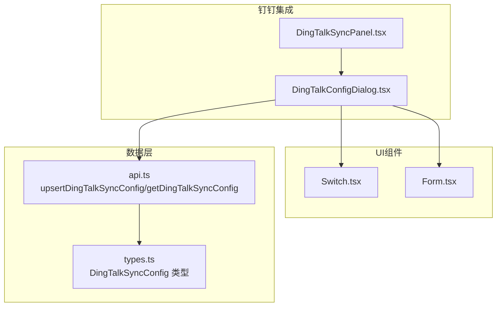
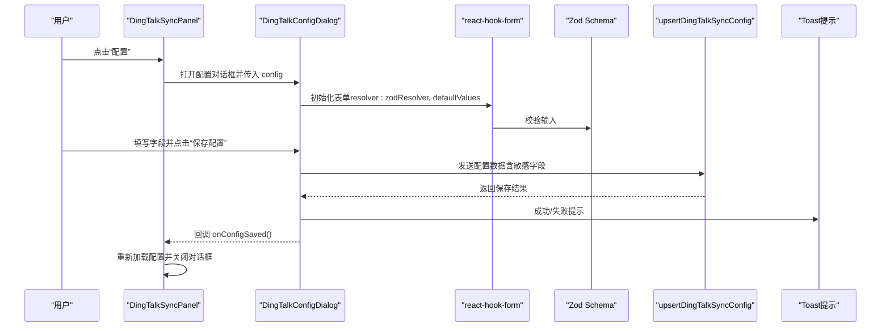
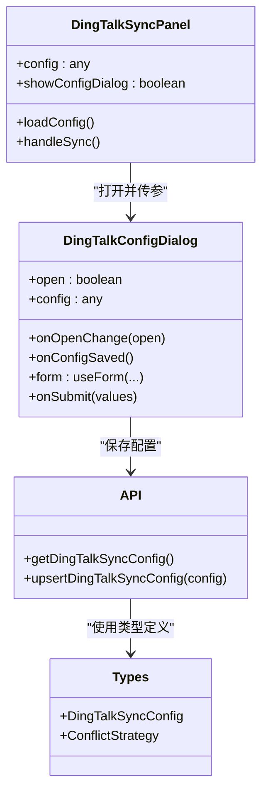

# 配置对话框

<cite>
**本文引用的文件**
- [DingTalkConfigDialog.tsx](file://src/components/dingtalk/DingTalkConfigDialog.tsx)
- [DingTalkSyncPanel.tsx](file://src/components/dingtalk/DingTalkSyncPanel.tsx)
- [api.ts](file://src/db/api.ts)
- [types.ts](file://src/types/types.ts)
- [switch.tsx](file://src/components/ui/switch.tsx)
- [form.tsx](file://src/components/ui/form.tsx)
</cite>

## 目录
1. [简介](#简介)
2. [项目结构](#项目结构)
3. [核心组件](#核心组件)
4. [架构概览](#架构概览)
5. [详细组件分析](#详细组件分析)
6. [依赖关系分析](#依赖关系分析)
7. [性能考量](#性能考量)
8. [故障排除指南](#故障排除指南)
9. [结论](#结论)

## 简介
本文件面向“钉钉同步配置”对话框组件（DingTalkConfigDialog），提供从表单结构、Zod验证模式、react-hook-form集成到保存逻辑的完整说明；解释开关组件对自动同步的控制、条件渲染（当 auto_sync_enabled 为 true 时显示计划设置）、冲突解决策略选项及业务含义；并给出表单验证错误处理、敏感信息掩码显示与保存状态反馈的最佳实践建议。

## 项目结构
- 组件位于 src/components/dingtalk 下，负责钉钉集成的配置与同步面板。
- 配置对话框通过 react-hook-form + Zod 进行表单校验，并通过自定义 UI 组件（Switch、Select、Input、Form 等）构建表单。
- 保存逻辑通过数据库 API 封装函数 upsertDingTalkSyncConfig 发起网络请求。

图表来源
- [DingTalkConfigDialog.tsx](file://src/components/dingtalk/DingTalkConfigDialog.tsx#L1-L301)
- [DingTalkSyncPanel.tsx](file://src/components/dingtalk/DingTalkSyncPanel.tsx#L1-L237)
- [api.ts](file://src/db/api.ts#L1282-L1346)
- [types.ts](file://src/types/types.ts#L277-L304)
- [switch.tsx](file://src/components/ui/switch.tsx#L1-L30)
- [form.tsx](file://src/components/ui/form.tsx#L1-L167)

章节来源
- [DingTalkConfigDialog.tsx](file://src/components/dingtalk/DingTalkConfigDialog.tsx#L1-L301)
- [DingTalkSyncPanel.tsx](file://src/components/dingtalk/DingTalkSyncPanel.tsx#L1-L237)
- [api.ts](file://src/db/api.ts#L1282-L1346)
- [types.ts](file://src/types/types.ts#L277-L304)
- [switch.tsx](file://src/components/ui/switch.tsx#L1-L30)
- [form.tsx](file://src/components/ui/form.tsx#L1-L167)

## 核心组件
- DingTalkConfigDialog：配置对话框，包含 AppKey/AppSecret/AgentId/CorpId、同步开关、自动同步开关、同步计划、同步时间、冲突解决策略等字段。
- DingTalkSyncPanel：同步面板，负责加载配置、触发同步、展示统计与日志，并在必要时打开配置对话框。
- 自定义 UI 组件：
  - Switch：用于布尔型开关（启用同步、启用自动同步）。
  - Form：基于 react-hook-form 的表单容器与字段包装器。
- 数据访问层：
  - upsertDingTalkSyncConfig：保存/更新钉钉同步配置。
  - getDingTalkSyncConfig：读取当前配置。

章节来源
- [DingTalkConfigDialog.tsx](file://src/components/dingtalk/DingTalkConfigDialog.tsx#L1-L301)
- [DingTalkSyncPanel.tsx](file://src/components/dingtalk/DingTalkSyncPanel.tsx#L1-L237)
- [api.ts](file://src/db/api.ts#L1282-L1346)
- [switch.tsx](file://src/components/ui/switch.tsx#L1-L30)
- [form.tsx](file://src/components/ui/form.tsx#L1-L167)

## 架构概览
下图展示了配置对话框与面板、表单、验证、保存流程之间的交互关系。

图表来源
- [DingTalkConfigDialog.tsx](file://src/components/dingtalk/DingTalkConfigDialog.tsx#L43-L96)
- [DingTalkSyncPanel.tsx](file://src/components/dingtalk/DingTalkSyncPanel.tsx#L224-L234)
- [api.ts](file://src/db/api.ts#L1308-L1346)

## 详细组件分析

### 表单结构与字段说明
- 字段清单与用途
  - app_key：钉钉应用 AppKey，必填。
  - app_secret：钉钉应用 AppSecret，必填（密码输入类型）。
  - agent_id：钉钉应用 AgentId，必填。
  - corp_id：企业 CorpId，必填。
  - sync_enabled：启用同步，布尔，默认 true。
  - auto_sync_enabled：启用自动同步，布尔，默认 false。
  - sync_schedule：同步频率，字符串，支持 hourly/daily/weekly。
  - sync_time：同步时间，字符串（HH:mm），默认 02:00。
  - conflict_strategy：冲突解决策略，枚举，支持 dingtalk_first/local_first/manual。
- 默认值与重置
  - 表单初始化时设置默认值。
  - 当外部 config 变化时，通过 reset 将后端配置回填到表单，确保显示与保存一致。
- 条件渲染
  - 当 auto_sync_enabled 为 true 时，显示“同步频率”和“同步时间”两个子字段。

章节来源
- [DingTalkConfigDialog.tsx](file://src/components/dingtalk/DingTalkConfigDialog.tsx#L14-L24)
- [DingTalkConfigDialog.tsx](file://src/components/dingtalk/DingTalkConfigDialog.tsx#L43-L73)
- [DingTalkConfigDialog.tsx](file://src/components/dingtalk/DingTalkConfigDialog.tsx#L216-L255)

### 基于 Zod 的 configSchema 验证规则
- 字段约束
  - app_key、app_secret、agent_id、corp_id：最小长度 1（必填）。
  - sync_enabled、auto_sync_enabled：布尔类型。
  - sync_schedule：字符串（由上层 Select 控制合法值）。
  - sync_time：字符串（由 Input[type=time] 控制格式）。
  - conflict_strategy：枚举 ['dingtalk_first','local_first','manual']。
- 错误消息
  - 每个必填字段均提供中文错误提示，便于用户定位问题。

章节来源
- [DingTalkConfigDialog.tsx](file://src/components/dingtalk/DingTalkConfigDialog.tsx#L14-L24)

### react-hook-form 集成
- 初始化
  - 使用 zodResolver(configSchema) 将 Zod 模式注入表单验证。
  - 设置 defaultValues，保证首次打开时有合理初始值。
- 字段绑定
  - 使用 FormField + 控件（Input/Select/Switch）绑定字段，自动处理 onChange、value、错误信息等。
- 提交处理
  - onSubmit 中将 values 传递给 upsertDingTalkSyncConfig，统一处理成功/失败与提示。
- 表单重置
  - 通过 useEffect + form.reset 将后端配置回填至表单，避免显示与实际不一致。

章节来源
- [DingTalkConfigDialog.tsx](file://src/components/dingtalk/DingTalkConfigDialog.tsx#L43-L73)
- [DingTalkConfigDialog.tsx](file://src/components/dingtalk/DingTalkConfigDialog.tsx#L74-L96)
- [form.tsx](file://src/components/ui/form.tsx#L1-L167)

### 开关组件（Switch）与自动同步交互
- 启用同步（sync_enabled）
  - 影响面板是否允许手动同步。
- 启用自动同步（auto_sync_enabled）
  - 作为条件渲染开关，控制“同步频率”和“同步时间”的显示。
- Switch 组件行为
  - Switch 内部通过 Radix UI 实现，外层组件仅绑定 checked/onCheckedChange 即可。

章节来源
- [DingTalkConfigDialog.tsx](file://src/components/dingtalk/DingTalkConfigDialog.tsx#L174-L214)
- [DingTalkConfigDialog.tsx](file://src/components/dingtalk/DingTalkConfigDialog.tsx#L216-L255)
- [switch.tsx](file://src/components/ui/switch.tsx#L1-L30)

### 条件渲染（自动同步计划）
- 当 auto_sync_enabled 为 true 时，显示：
  - 同步频率（hourly/daily/weekly）
  - 同步时间（HH:mm）
- 当为 false 时，隐藏上述两项，减少界面复杂度。

章节来源
- [DingTalkConfigDialog.tsx](file://src/components/dingtalk/DingTalkConfigDialog.tsx#L216-L255)

### 冲突解决策略及其业务含义
- 以钉钉数据为准（dingtalk_first）
  - 当本地用户与钉钉用户信息冲突时，优先采用钉钉侧数据。
- 保留本地数据（local_first）
  - 优先保留本地已有数据，钉钉侧变更不覆盖本地。
- 手动处理（manual）
  - 冲突交由人工确认后再决定如何处理，适合需要精细管控的场景。

章节来源
- [DingTalkConfigDialog.tsx](file://src/components/dingtalk/DingTalkConfigDialog.tsx#L257-L281)
- [types.ts](file://src/types/types.ts#L283-L287)

### 保存逻辑与后端交互
- 调用 upsertDingTalkSyncConfig
  - 参数包含 app_key、app_secret、agent_id、corp_id、sync_enabled、auto_sync_enabled、sync_schedule、sync_time、conflict_strategy。
  - 注意：sync_time 会在客户端拼接秒数（:00），确保与后端期望格式一致。
- 成功/失败处理
  - 成功：toast.success 并回调 onConfigSaved，面板重新加载配置。
  - 失败：toast.error 并打印错误日志。
- 敏感信息处理
  - 前端日志中会对 app_secret 进行掩码处理，避免泄露。

章节来源
- [DingTalkConfigDialog.tsx](file://src/components/dingtalk/DingTalkConfigDialog.tsx#L74-L96)
- [api.ts](file://src/db/api.ts#L1308-L1346)

### 表单验证错误处理与最佳实践
- 错误显示
  - 使用 FormMessage 自动渲染字段级错误。
  - FormLabel 在存在错误时会高亮提示。
- 用户体验
  - 必填字段提供明确的中文提示，帮助用户快速修正。
  - 提交按钮禁用期间显示“保存中...”，避免重复提交。
- 最佳实践
  - 保持 defaultValues 与后端字段一致，避免默认值与真实值冲突。
  - 对敏感字段（如 AppSecret）始终使用密码输入类型，避免明文显示。
  - 在提交前进行必要的格式校验（如时间格式），减少后端错误。

章节来源
- [DingTalkConfigDialog.tsx](file://src/components/dingtalk/DingTalkConfigDialog.tsx#L110-L141)
- [DingTalkConfigDialog.tsx](file://src/components/dingtalk/DingTalkConfigDialog.tsx#L144-L172)
- [DingTalkConfigDialog.tsx](file://src/components/dingtalk/DingTalkConfigDialog.tsx#L257-L281)
- [form.tsx](file://src/components/ui/form.tsx#L88-L167)

### 保存状态反馈与用户体验
- 保存状态
  - isSaving 控制按钮禁用与文案切换，避免重复点击。
  - 成功/失败分别通过 toast.success/toast.error 提示。
- 面板联动
  - onConfigSaved 回调中重新加载配置，确保面板显示最新状态。
  - 面板根据配置状态启用/禁用“立即同步”按钮。

章节来源
- [DingTalkConfigDialog.tsx](file://src/components/dingtalk/DingTalkConfigDialog.tsx#L41-L42)
- [DingTalkConfigDialog.tsx](file://src/components/dingtalk/DingTalkConfigDialog.tsx#L283-L296)
- [DingTalkSyncPanel.tsx](file://src/components/dingtalk/DingTalkSyncPanel.tsx#L176-L188)

## 依赖关系分析

图表来源
- [DingTalkConfigDialog.tsx](file://src/components/dingtalk/DingTalkConfigDialog.tsx#L28-L40)
- [DingTalkSyncPanel.tsx](file://src/components/dingtalk/DingTalkSyncPanel.tsx#L1-L237)
- [api.ts](file://src/db/api.ts#L1282-L1346)
- [types.ts](file://src/types/types.ts#L277-L304)

章节来源
- [DingTalkConfigDialog.tsx](file://src/components/dingtalk/DingTalkConfigDialog.tsx#L28-L40)
- [DingTalkSyncPanel.tsx](file://src/components/dingtalk/DingTalkSyncPanel.tsx#L1-L237)
- [api.ts](file://src/db/api.ts#L1282-L1346)
- [types.ts](file://src/types/types.ts#L277-L304)

## 性能考量
- 表单渲染
  - 条件渲染仅在 auto_sync_enabled 为 true 时显示计划设置，减少不必要的 DOM 渲染。
- 网络请求
  - 保存配置与触发同步均为异步请求，避免阻塞 UI。
- 错误处理
  - 使用 toast 提示错误，避免抛出异常导致页面崩溃，提升稳定性。

[本节为通用建议，无需特定文件引用]

## 故障排除指南
- AppKey/AppSecret 等字段为空
  - 现象：提交时报错。
  - 处理：检查必填字段是否填写完整，FormMessage 会显示具体错误。
- 自动同步未生效
  - 现象：勾选“启用自动同步”后仍无法触发。
  - 处理：确认已保存配置且面板显示“已启用”；检查 sync_schedule 与 sync_time 是否合理。
- 冲突处理不符合预期
  - 现象：本地与钉钉数据冲突时未按预期合并。
  - 处理：调整 conflict_strategy 为 manual 或其他策略，并结合日志核对。
- 保存失败
  - 现象：toast 显示保存失败。
  - 处理：查看控制台错误日志，确认网络连通性与后端接口状态。

章节来源
- [DingTalkConfigDialog.tsx](file://src/components/dingtalk/DingTalkConfigDialog.tsx#L14-L24)
- [DingTalkConfigDialog.tsx](file://src/components/dingtalk/DingTalkConfigDialog.tsx#L74-L96)
- [DingTalkSyncPanel.tsx](file://src/components/dingtalk/DingTalkSyncPanel.tsx#L66-L103)

## 结论
DingTalkConfigDialog 通过 Zod + react-hook-form 实现强健的表单验证与良好的用户体验；配合 Switch 的条件渲染与冲突策略选择，满足不同业务场景下的同步需求。建议在生产环境中持续关注错误日志与用户反馈，优化默认值与提示文案，进一步提升易用性与可靠性。