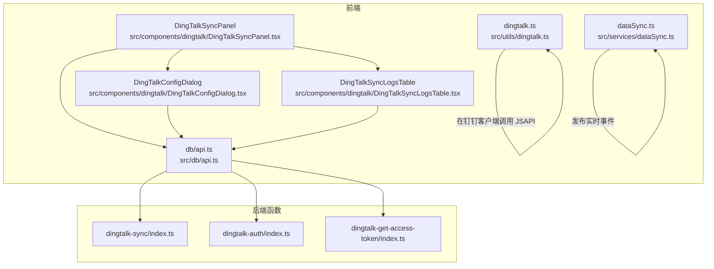
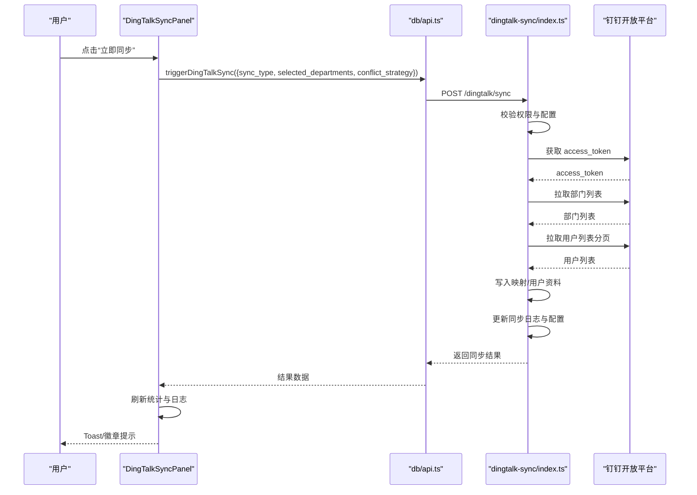
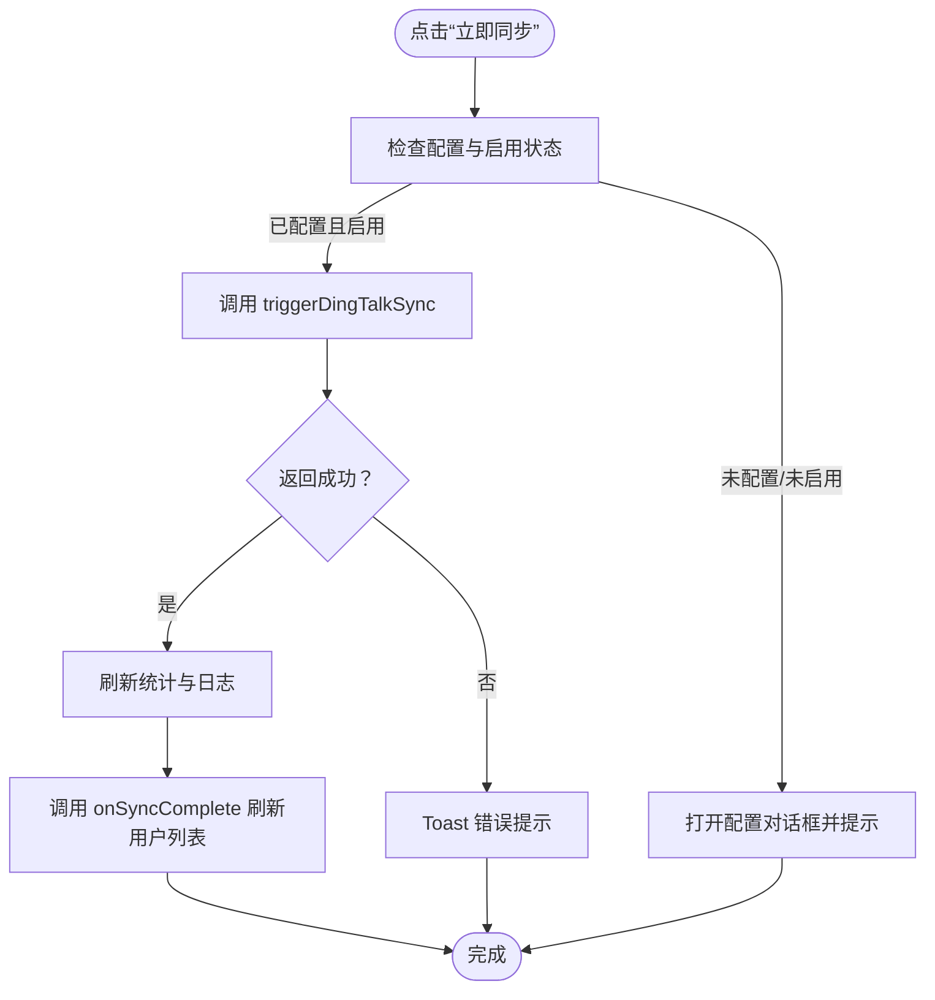
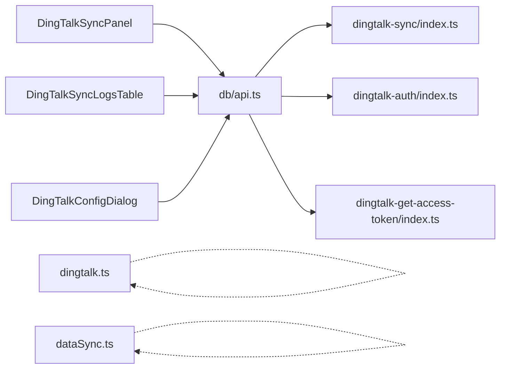

# 钉钉集成组件

<cite>
**本文引用的文件**
- [DingTalkSyncPanel.tsx](file://src/components/dingtalk/DingTalkSyncPanel.tsx)
- [DingTalkSyncLogsTable.tsx](file://src/components/dingtalk/DingTalkSyncLogsTable.tsx)
- [DingTalkConfigDialog.tsx](file://src/components/dingtalk/DingTalkConfigDialog.tsx)
- [dingtalk.ts](file://src/utils/dingtalk.ts)
- [dataSync.ts](file://src/services/dataSync.ts)
- [api.ts](file://src/db/api.ts)
- [index.ts](file://supabase/functions/dingtalk-sync/index.ts)
- [index.ts](file://supabase/functions/dingtalk-auth/index.ts)
- [index.ts](file://supabase/functions/dingtalk-get-access-token/index.ts)
- [types.ts](file://src/types/types.ts)
</cite>

## 目录
1. [简介](#简介)
2. [项目结构](#项目结构)
3. [核心组件](#核心组件)
4. [架构总览](#架构总览)
5. [组件详解](#组件详解)
6. [依赖关系分析](#依赖关系分析)
7. [性能与可用性建议](#性能与可用性建议)
8. [故障排查指南](#故障排查指南)
9. [结论](#结论)
10. [附录](#附录)

## 简介
本文件面向开发者，系统化梳理并讲解 src/components/dingtalk/ 下的钉钉集成组件，包括：
- DingTalkSyncPanel 同步面板：整体布局、操作流程与状态管理（触发同步、进度展示、结果反馈）。
- DingTalkSyncLogsTable 同步日志表格：数据来源、分页与筛选能力。
- DingTalkConfigDialog 配置对话框：表单校验、配置保存与错误处理。
同时，结合 src/utils/dingtalk.ts 工具函数与 src/services/dataSync.ts 服务，说明这些组件如何与钉钉开放平台 API 交互，实现通讯录同步、消息通知等集成功能，并提供配置、测试与故障排查的实际案例。

## 项目结构
钉钉集成相关代码主要分布在以下位置：
- 组件层：src/components/dingtalk/（同步面板、日志表格、配置对话框）
- 工具层：src/utils/dingtalk.ts（钉钉 JSAPI 封装）
- 服务层：src/services/dataSync.ts（实时数据同步服务）
- 数据访问层：src/db/api.ts（前端对后端 API 的封装）
- 后端函数层：supabase/functions/dingtalk-*（钉钉鉴权、获取 access_token、通讯录同步）

图表来源
- [DingTalkSyncPanel.tsx](file://src/components/dingtalk/DingTalkSyncPanel.tsx#L1-L237)
- [DingTalkSyncLogsTable.tsx](file://src/components/dingtalk/DingTalkSyncLogsTable.tsx#L1-L91)
- [DingTalkConfigDialog.tsx](file://src/components/dingtalk/DingTalkConfigDialog.tsx#L1-L302)
- [dingtalk.ts](file://src/utils/dingtalk.ts#L1-L329)
- [dataSync.ts](file://src/services/dataSync.ts#L1-L309)
- [api.ts](file://src/db/api.ts#L1279-L1531)
- [index.ts](file://supabase/functions/dingtalk-sync/index.ts#L1-L384)
- [index.ts](file://supabase/functions/dingtalk-auth/index.ts#L1-L248)
- [index.ts](file://supabase/functions/dingtalk-get-access-token/index.ts#L1-L121)

章节来源
- [DingTalkSyncPanel.tsx](file://src/components/dingtalk/DingTalkSyncPanel.tsx#L1-L237)
- [DingTalkSyncLogsTable.tsx](file://src/components/dingtalk/DingTalkSyncLogsTable.tsx#L1-L91)
- [DingTalkConfigDialog.tsx](file://src/components/dingtalk/DingTalkConfigDialog.tsx#L1-L302)
- [dingtalk.ts](file://src/utils/dingtalk.ts#L1-L329)
- [dataSync.ts](file://src/services/dataSync.ts#L1-L309)
- [api.ts](file://src/db/api.ts#L1279-L1531)
- [index.ts](file://supabase/functions/dingtalk-sync/index.ts#L1-L384)
- [index.ts](file://supabase/functions/dingtalk-auth/index.ts#L1-L248)
- [index.ts](file://supabase/functions/dingtalk-get-access-token/index.ts#L1-L121)

## 核心组件
- 同步面板（DingTalkSyncPanel）
  - 负责加载配置、统计信息与最近日志；提供“立即同步”按钮；根据配置状态禁用/启用按钮；展示同步状态徽章；回调 onSyncComplete 刷新用户列表。
- 同步日志表格（DingTalkSyncLogsTable）
  - 展示最近同步记录，支持刷新；根据状态渲染徽章；显示总数、成功、失败、跳过数量；显示操作人。
- 配置对话框（DingTalkConfigDialog）
  - 使用 react-hook-form + zod 进行表单校验；支持开关式启用/禁用自动同步；选择同步频率与时间；选择冲突解决策略；提交后调用 upsertDingTalkSyncConfig 并提示成功/失败。

章节来源
- [DingTalkSyncPanel.tsx](file://src/components/dingtalk/DingTalkSyncPanel.tsx#L1-L237)
- [DingTalkSyncLogsTable.tsx](file://src/components/dingtalk/DingTalkSyncLogsTable.tsx#L1-L91)
- [DingTalkConfigDialog.tsx](file://src/components/dingtalk/DingTalkConfigDialog.tsx#L1-L302)

## 架构总览
前端组件通过 db/api.ts 封装的 HTTP 接口与后端函数通信。后端函数负责：
- 钉钉鉴权：使用 auth_code 换取用户信息，查找或创建系统用户，生成登录会话。
- 获取 access_token：从钉钉开放平台获取令牌，带缓存策略。
- 通讯录同步：拉取部门与用户列表，写入映射表与用户资料，记录同步日志，更新配置最后同步时间。

图表来源
- [DingTalkSyncPanel.tsx](file://src/components/dingtalk/DingTalkSyncPanel.tsx#L66-L103)
- [api.ts](file://src/db/api.ts#L1348-L1378)
- [index.ts](file://supabase/functions/dingtalk-sync/index.ts#L91-L383)

章节来源
- [DingTalkSyncPanel.tsx](file://src/components/dingtalk/DingTalkSyncPanel.tsx#L66-L103)
- [api.ts](file://src/db/api.ts#L1348-L1378)
- [index.ts](file://supabase/functions/dingtalk-sync/index.ts#L91-L383)

## 组件详解

### DingTalkSyncPanel 同步面板
- 数据加载
  - 组件挂载时加载配置、统计信息与最近日志。
- 同步触发
  - 若未配置或未启用，弹出提示并打开配置对话框；否则进入同步流程。
  - 调用 triggerDingTalkSync，传入 sync_type、selected_departments、conflict_strategy。
  - 根据返回结果更新统计与日志，并调用 onSyncComplete 刷新用户列表。
- 状态展示
  - 使用 getStatusBadge 渲染不同状态徽章（成功/失败/进行中/部分成功/待处理）。
- 交互细节
  - isSyncing 控制按钮禁用与动画；配置状态与最后同步时间显示在描述区。

图表来源
- [DingTalkSyncPanel.tsx](file://src/components/dingtalk/DingTalkSyncPanel.tsx#L66-L103)
- [api.ts](file://src/db/api.ts#L1348-L1378)

章节来源
- [DingTalkSyncPanel.tsx](file://src/components/dingtalk/DingTalkSyncPanel.tsx#L1-L237)
- [api.ts](file://src/db/api.ts#L1279-L1531)

### DingTalkSyncLogsTable 同步日志表格
- 数据来源
  - 由父组件传入 logs、isLoading、getStatusBadge、onRefresh。
- 分页与筛选
  - 当前实现为简单加载最近若干条（默认 10 条），支持手动刷新。
- 展示字段
  - 同步时间、类型（手动/自动/增量）、状态徽章、总数、成功数、失败数、跳过数、操作人。

章节来源
- [DingTalkSyncLogsTable.tsx](file://src/components/dingtalk/DingTalkSyncLogsTable.tsx#L1-L91)
- [api.ts](file://src/db/api.ts#L1380-L1418)

### DingTalkConfigDialog 配置对话框
- 表单校验
  - 使用 zod schema 校验必填项与枚举值；使用 react-hook-form 管理表单状态。
- 配置保存
  - 提交时调用 upsertDingTalkSyncConfig，包含 app_key、app_secret、agent_id、corp_id、sync_enabled、auto_sync_enabled、sync_schedule、sync_time、conflict_strategy、selected_departments 等。
- 自动同步选项
  - 当 auto_sync_enabled 为真时，显示同步频率与时间选择。
- 错误处理
  - try/catch 包裹保存逻辑，统一 toast 提示。

章节来源
- [DingTalkConfigDialog.tsx](file://src/components/dingtalk/DingTalkConfigDialog.tsx#L1-L302)
- [api.ts](file://src/db/api.ts#L1307-L1346)

### 钉钉 JSAPI 工具（dingtalk.ts）
- 能力范围
  - 环境检测、初始化、免登授权码获取、导航栏标题/右键按钮、关闭页面、扫码、Toast、Alert、Confirm、分享、定位、图片预览、打开链接、网络状态。
- 使用场景
  - 在钉钉客户端内调用原生能力，提升用户体验；非钉钉环境时提供降级行为。
- 注意事项
  - 需要正确注入钉钉 JSAPI SDK 并初始化；部分能力需在钉钉环境中调用。

章节来源
- [dingtalk.ts](file://src/utils/dingtalk.ts#L1-L329)

### 实时数据同步服务（dataSync.ts）
- 职责
  - 发布预约、排班、任务执行、用户资料变更的实时事件；支持批量通知与清理旧事件。
- 适用范围
  - 与钉钉同步无直接耦合，但可作为系统内其他模块的通用实时能力。

章节来源
- [dataSync.ts](file://src/services/dataSync.ts#L1-L309)

## 依赖关系分析
- 组件依赖
  - DingTalkSyncPanel 依赖 db/api.ts 的配置、统计、日志与同步触发接口；依赖 DingTalkSyncLogsTable 与 DingTalkConfigDialog。
  - DingTalkSyncLogsTable 依赖 db/api.ts 的日志接口与父组件传入的状态渲染函数。
  - DingTalkConfigDialog 依赖 db/api.ts 的 upsertDingTalkSyncConfig 接口与表单校验。
- 后端函数依赖
  - dingtalk-sync/index.ts 依赖钉钉开放平台 API；读写 Supabase 的 dingtalk_* 表；校验用户权限。
  - dingtalk-auth/index.ts 依赖 dingtalk-get-access-token/index.ts 获取 access_token；与 Supabase auth 与 profiles 协作。
  - dingtalk-get-access-token/index.ts 依赖环境变量与钉钉开放平台 API，提供缓存策略。

图表来源
- [DingTalkSyncPanel.tsx](file://src/components/dingtalk/DingTalkSyncPanel.tsx#L1-L237)
- [DingTalkSyncLogsTable.tsx](file://src/components/dingtalk/DingTalkSyncLogsTable.tsx#L1-L91)
- [DingTalkConfigDialog.tsx](file://src/components/dingtalk/DingTalkConfigDialog.tsx#L1-L302)
- [api.ts](file://src/db/api.ts#L1279-L1531)
- [index.ts](file://supabase/functions/dingtalk-sync/index.ts#L1-L384)
- [index.ts](file://supabase/functions/dingtalk-auth/index.ts#L1-L248)
- [index.ts](file://supabase/functions/dingtalk-get-access-token/index.ts#L1-L121)

章节来源
- [DingTalkSyncPanel.tsx](file://src/components/dingtalk/DingTalkSyncPanel.tsx#L1-L237)
- [DingTalkSyncLogsTable.tsx](file://src/components/dingtalk/DingTalkSyncLogsTable.tsx#L1-L91)
- [DingTalkConfigDialog.tsx](file://src/components/dingtalk/DingTalkConfigDialog.tsx#L1-L302)
- [api.ts](file://src/db/api.ts#L1279-L1531)
- [index.ts](file://supabase/functions/dingtalk-sync/index.ts#L1-L384)
- [index.ts](file://supabase/functions/dingtalk-auth/index.ts#L1-L248)
- [index.ts](file://supabase/functions/dingtalk-get-access-token/index.ts#L1-L121)

## 性能与可用性建议
- 同步并发与分页
  - 钉钉用户列表采用分页拉取，建议在后端函数中控制分页大小与并发度，避免一次性请求过多导致超时。
- 缓存策略
  - access_token 获取后应缓存并在过期前续期，减少重复请求。
- 日志与统计
  - 日志表格默认加载最近若干条，建议在 UI 层增加分页参数传递至后端，或在前端做虚拟滚动优化。
- 错误重试
  - 对于网络波动或钉钉 API 限流，可在前端增加指数退避重试与最大重试次数限制。
- 权限与安全
  - 后端函数严格校验用户角色与认证头，确保只有超级管理员可执行同步。

[本节为通用建议，无需列出具体文件来源]

## 故障排查指南
- 常见问题与定位
  - 未配置或未启用：面板会提示“请先配置钉钉应用信息”或“同步功能未启用”。检查 DingTalkConfigDialog 是否保存成功，以及配置中的 sync_enabled。
  - 同步失败：查看同步日志表格中的状态与失败详情；检查钉钉开放平台返回的错误信息；确认 access_token 获取是否成功。
  - 权限不足：后端函数要求超级管理员身份，若报权限不足，请确认当前登录用户角色。
  - 网络异常：检查本地 API 代理与网络连通性；确认钉钉开放平台可达。
- 具体步骤
  - 在 DingTalkConfigDialog 中填写 AppKey/AppSecret/AgentId/CorpId，保存后确认已启用自动同步（如需）。
  - 在 DingTalkSyncPanel 点击“立即同步”，观察 Toast 与状态徽章变化。
  - 在“同步日志”标签页查看最近记录，必要时刷新。
  - 如失败，复制失败详情并在后端函数日志中定位具体错误码与原因。

章节来源
- [DingTalkSyncPanel.tsx](file://src/components/dingtalk/DingTalkSyncPanel.tsx#L66-L103)
- [DingTalkConfigDialog.tsx](file://src/components/dingtalk/DingTalkConfigDialog.tsx#L74-L96)
- [index.ts](file://supabase/functions/dingtalk-sync/index.ts#L91-L124)

## 结论
钉钉集成组件通过清晰的职责划分与前后端协作，实现了从配置、触发、日志到结果反馈的完整闭环。前端组件负责用户体验与状态管理，后端函数负责与钉钉开放平台的对接与数据持久化。配合工具函数与实时服务，可进一步扩展消息通知与数据同步能力。建议在生产环境中完善分页、缓存与错误重试策略，并持续监控日志与统计指标。

[本节为总结，无需列出具体文件来源]

## 附录

### 类型与数据模型
- 钉钉同步类型与状态
  - SyncType: manual | auto | incremental
  - SyncStatus: pending | running | success | failed | partial
  - ConflictStrategy: dingtalk_first | local_first | manual
- 配置与日志
  - DingTalkSyncConfig：包含 app_key、app_secret、agent_id、corp_id、sync_enabled、auto_sync_enabled、sync_schedule、sync_time、conflict_strategy、selected_departments、last_sync_at 等。
  - DingTalkSyncLogV2：包含 sync_type、status、total_users、success_count、failed_count、skipped_count、error_message、details、started_at、completed_at、created_by 等。
- 钉钉用户与部门
  - DingTalkUser、DingTalkDepartment、DingTalkDepartmentMapping。
- 钉钉 API 响应
  - DingTalkAccessTokenResponse、DingTalkUserInfoResponse、DingTalkDepartmentListResponse、DingTalkUserListResponse。

章节来源
- [types.ts](file://src/types/types.ts#L277-L487)

### API 定义（前端封装）
- 配置与同步
  - getDingTalkSyncConfig、upsertDingTalkSyncConfig、triggerDingTalkSync。
- 日志与统计
  - getDingTalkSyncLogs、getDingTalkSyncLogById、getSyncStatistics。
- 部门映射
  - getDingTalkDepartmentMappings、updateDingTalkDepartmentMapping。

章节来源
- [api.ts](file://src/db/api.ts#L1279-L1531)

### 后端函数要点
- 钉钉同步
  - 校验用户角色与配置；创建同步日志；获取 access_token；拉取部门与用户；写入映射与用户资料；更新日志与配置；返回结果。
- 钉钉鉴权
  - 使用 auth_code 换取 userid 与用户信息；查找或创建系统用户；生成登录会话。
- 获取 access_token
  - 从环境变量读取 AppKey/AppSecret；调用钉钉开放平台；缓存 2 小时（提前过期）。

章节来源
- [index.ts](file://supabase/functions/dingtalk-sync/index.ts#L91-L383)
- [index.ts](file://supabase/functions/dingtalk-auth/index.ts#L32-L247)
- [index.ts](file://supabase/functions/dingtalk-get-access-token/index.ts#L23-L121)