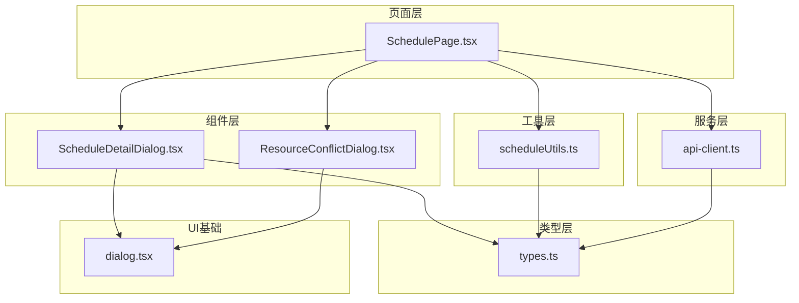
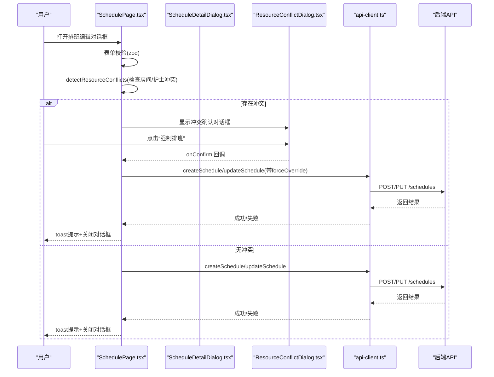
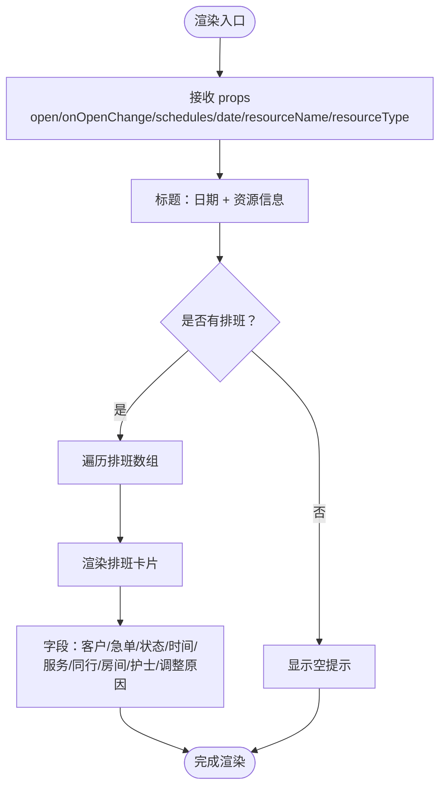
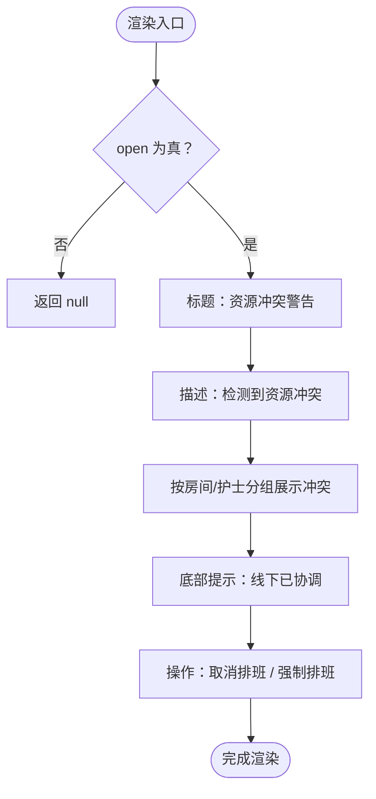
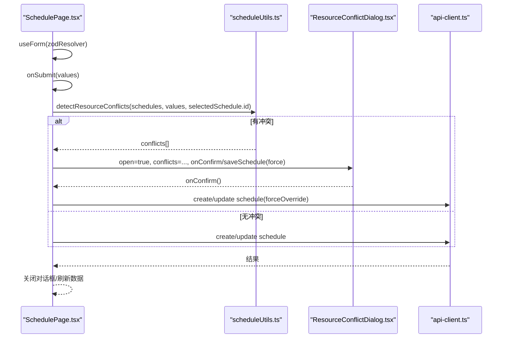
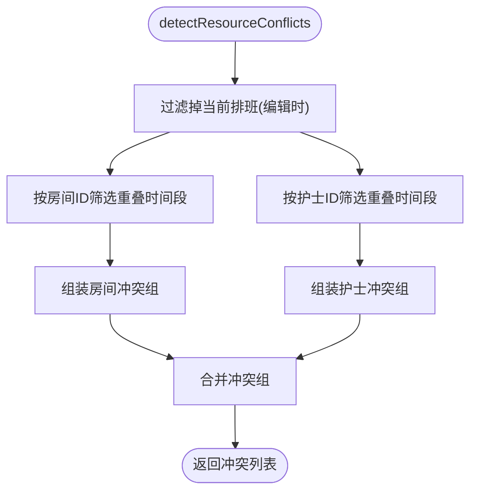
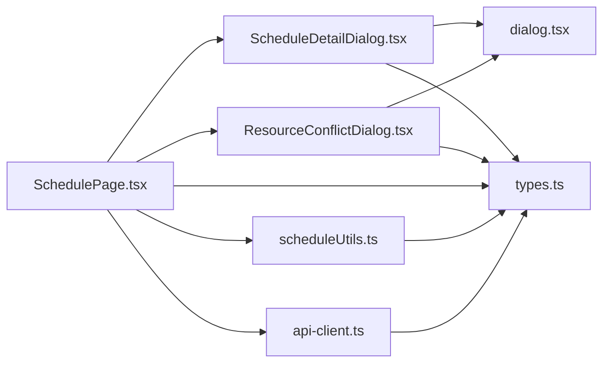

# 排班详情弹窗

<cite>
**本文引用的文件**
- [ScheduleDetailDialog.tsx](file://src/components/appointment/ScheduleDetailDialog.tsx)
- [ResourceConflictDialog.tsx](file://src/components/appointment/ResourceConflictDialog.tsx)
- [SchedulePage.tsx](file://src/pages/head-nurse/SchedulePage.tsx)
- [scheduleUtils.ts](file://src/utils/scheduleUtils.ts)
- [api-client.ts](file://src/services/api-client.ts)
- [types.ts](file://src/types/types.ts)
- [dialog.tsx](file://src/components/ui/dialog.tsx)
</cite>

## 目录
1. [简介](#简介)
2. [项目结构](#项目结构)
3. [核心组件](#核心组件)
4. [架构总览](#架构总览)
5. [详细组件分析](#详细组件分析)
6. [依赖关系分析](#依赖关系分析)
7. [性能考量](#性能考量)
8. [故障排查指南](#故障排查指南)
9. [结论](#结论)
10. [附录](#附录)

## 简介
本文件围绕“排班详情弹窗”展开，重点覆盖两个组件：
- ScheduleDetailDialog：用于展示某一天或某一资源上的排班明细，包含预约信息、资源分配、状态与调整原因等字段的呈现。
- ResourceConflictDialog：用于在编辑排班时检测到资源冲突时，提示用户并允许强制排班。

文档将深入讲解字段展示结构、编辑模式下的表单验证与提交流程、API 客户端交互、资源冲突检测机制、典型业务场景的操作流程、状态管理最佳实践以及常见问题与解决方案。

## 项目结构
与排班详情弹窗直接相关的文件组织如下：
- 组件层：排班详情弹窗与资源冲突弹窗位于 appointment 组件目录
- 页面层：排班页面负责承载表单、冲突检测、调用 API 客户端
- 工具层：冲突检测算法位于 utils/scheduleUtils.ts
- 类型层：统一的数据类型定义位于 types.ts
- UI 基础：对话框基础组件由 ui/dialog.tsx 提供

图表来源
- [SchedulePage.tsx](file://src/pages/head-nurse/SchedulePage.tsx#L1-L695)
- [ScheduleDetailDialog.tsx](file://src/components/appointment/ScheduleDetailDialog.tsx#L1-L175)
- [ResourceConflictDialog.tsx](file://src/components/appointment/ResourceConflictDialog.tsx#L1-L93)
- [scheduleUtils.ts](file://src/utils/scheduleUtils.ts#L1-L112)
- [api-client.ts](file://src/services/api-client.ts#L1-L381)
- [types.ts](file://src/types/types.ts#L1-L487)
- [dialog.tsx](file://src/components/ui/dialog.tsx#L1-L135)

章节来源
- [SchedulePage.tsx](file://src/pages/head-nurse/SchedulePage.tsx#L1-L695)
- [ScheduleDetailDialog.tsx](file://src/components/appointment/ScheduleDetailDialog.tsx#L1-L175)
- [ResourceConflictDialog.tsx](file://src/components/appointment/ResourceConflictDialog.tsx#L1-L93)
- [scheduleUtils.ts](file://src/utils/scheduleUtils.ts#L1-L112)
- [api-client.ts](file://src/services/api-client.ts#L1-L381)
- [types.ts](file://src/types/types.ts#L1-L487)
- [dialog.tsx](file://src/components/ui/dialog.tsx#L1-L135)

## 核心组件
- ScheduleDetailDialog：接收日期、资源名、资源类型与排班集合，渲染每个排班的客户、时间、服务、房间、护士、状态、急单标记与调整原因等字段。
- ResourceConflictDialog：接收冲突列表，逐项展示房间/护士冲突及对应预约信息，并提供“取消排班”和“强制排班”的操作按钮。

章节来源
- [ScheduleDetailDialog.tsx](file://src/components/appointment/ScheduleDetailDialog.tsx#L1-L175)
- [ResourceConflictDialog.tsx](file://src/components/appointment/ResourceConflictDialog.tsx#L1-L93)

## 架构总览
下图展示了从页面发起编辑到提交、再到冲突检测与最终保存的整体流程。

图表来源
- [SchedulePage.tsx](file://src/pages/head-nurse/SchedulePage.tsx#L167-L238)
- [scheduleUtils.ts](file://src/utils/scheduleUtils.ts#L1-L112)
- [ResourceConflictDialog.tsx](file://src/components/appointment/ResourceConflictDialog.tsx#L1-L93)
- [api-client.ts](file://src/services/api-client.ts#L294-L320)

章节来源
- [SchedulePage.tsx](file://src/pages/head-nurse/SchedulePage.tsx#L167-L238)
- [scheduleUtils.ts](file://src/utils/scheduleUtils.ts#L1-L112)
- [ResourceConflictDialog.tsx](file://src/components/appointment/ResourceConflictDialog.tsx#L1-L93)
- [api-client.ts](file://src/services/api-client.ts#L294-L320)

## 详细组件分析

### ScheduleDetailDialog 组件分析
- 输入参数
  - open/onOpenChange：控制弹窗打开/关闭
  - schedules：排班数组，元素包含预约、房间、护士、状态等
  - date：展示用日期
  - resourceName/resourceType：可选，用于标注资源维度
- 字段展示结构
  - 标题区：日期、资源类型与名称
  - 每条排班卡片：
    - 客户名与急单徽章
    - 状态徽章
    - 时间段与时长
    - 服务项目
    - 同行客户（若存在）
    - 房间与护士分配
    - 调整原因（若存在）
- 日期格式化与状态徽章
  - 使用本地化日期格式化函数
  - 状态映射到不同徽章变体
- 滚动区域与高度限制
  - 内容区域设置最大高度与滚动条，避免溢出

图表来源
- [ScheduleDetailDialog.tsx](file://src/components/appointment/ScheduleDetailDialog.tsx#L1-L175)

章节来源
- [ScheduleDetailDialog.tsx](file://src/components/appointment/ScheduleDetailDialog.tsx#L1-L175)

### ResourceConflictDialog 组件分析
- 输入参数
  - open：控制弹窗打开
  - conflicts：冲突列表，按房间/护士分组，每组包含多个冲突的预约信息
  - onConfirm/onCancel：回调函数
- 冲突展示
  - 每个冲突组包含资源类型与名称
  - 列表项包含客户名、服务名、时间段
  - 底部提示“强制排班将导致资源重叠使用”
- 操作按钮
  - 取消排班：关闭弹窗并清空状态
  - 强制排班：触发 onConfirm 回调，通常由页面层保存并忽略冲突

图表来源
- [ResourceConflictDialog.tsx](file://src/components/appointment/ResourceConflictDialog.tsx#L1-L93)

章节来源
- [ResourceConflictDialog.tsx](file://src/components/appointment/ResourceConflictDialog.tsx#L1-L93)

### 编辑模式下的表单验证与提交流程
- 表单定义与验证
  - 使用 react-hook-form + zodResolver
  - 校验字段：开始时间、结束时间、房间、护士、可选调整时长与原因
- 冲突检测
  - 在提交前调用 detectResourceConflicts，传入现有排班、新排班参数与当前编辑排班ID（排除自身）
- 提交策略
  - 若无冲突：直接调用 createSchedule 或 updateSchedule
  - 若有冲突：弹出 ResourceConflictDialog，用户确认后以 forceOverride 方式保存
- API 客户端交互
  - createSchedule：创建排班并更新预约状态为“已排班”
  - updateSchedule：更新排班并置状态为“已发布”
  - 错误处理：toast 提示错误消息
- 关闭与刷新
  - 成功后关闭对话框，清空临时状态，重新拉取数据

图表来源
- [SchedulePage.tsx](file://src/pages/head-nurse/SchedulePage.tsx#L26-L33)
- [SchedulePage.tsx](file://src/pages/head-nurse/SchedulePage.tsx#L167-L238)
- [scheduleUtils.ts](file://src/utils/scheduleUtils.ts#L36-L112)
- [ResourceConflictDialog.tsx](file://src/components/appointment/ResourceConflictDialog.tsx#L1-L93)
- [api-client.ts](file://src/services/api-client.ts#L294-L320)

章节来源
- [SchedulePage.tsx](file://src/pages/head-nurse/SchedulePage.tsx#L26-L33)
- [SchedulePage.tsx](file://src/pages/head-nurse/SchedulePage.tsx#L167-L238)
- [scheduleUtils.ts](file://src/utils/scheduleUtils.ts#L36-L112)
- [ResourceConflictDialog.tsx](file://src/components/appointment/ResourceConflictDialog.tsx#L1-L93)
- [api-client.ts](file://src/services/api-client.ts#L294-L320)

### 资源冲突检测机制
- 时间重叠判断
  - 将字符串时间转换为分钟数进行比较，判断区间是否相交
- 冲突类型
  - 房间冲突：同一房间在同一时间段内已有排班
  - 护士冲突：同一护士在同一时间段内已有排班
- 排除自身
  - 编辑场景下排除当前排班ID，避免自冲突
- 输出结构
  - 每类冲突包含资源ID、资源名与冲突的预约列表（客户名、服务名、时间段）

图表来源
- [scheduleUtils.ts](file://src/utils/scheduleUtils.ts#L16-L112)

章节来源
- [scheduleUtils.ts](file://src/utils/scheduleUtils.ts#L16-L112)

### 实际业务场景示例
- 查看排班详情
  - 在资源看板上点击某排班卡片，打开 ScheduleDetailDialog，查看该排班的客户、服务、房间、护士、状态与调整原因
- 创建排班（无冲突）
  - 在排班待办中选择一个待排班预约，打开编辑对话框，填写时间、房间、护士、可选调整时长与原因，提交后自动创建排班并更新预约状态
- 编辑排班（检测到冲突）
  - 修改时间或资源后提交，若检测到房间/护士冲突，弹出 ResourceConflictDialog，用户确认后强制保存；否则取消并返回
- 拒绝预约
  - 在编辑对话框中点击“拒绝预约”，调用 API 更新预约状态并关闭对话框

章节来源
- [ScheduleDetailDialog.tsx](file://src/components/appointment/ScheduleDetailDialog.tsx#L1-L175)
- [SchedulePage.tsx](file://src/pages/head-nurse/SchedulePage.tsx#L127-L165)
- [SchedulePage.tsx](file://src/pages/head-nurse/SchedulePage.tsx#L239-L279)
- [ResourceConflictDialog.tsx](file://src/components/appointment/ResourceConflictDialog.tsx#L1-L93)

## 依赖关系分析
- 组件依赖
  - ScheduleDetailDialog 依赖 UI 对话框组件与本地化日期格式化
  - ResourceConflictDialog 依赖 UI 警告对话框组件
- 页面依赖
  - SchedulePage 依赖表单验证、冲突检测工具、API 客户端、对话框组件
- 工具依赖
  - scheduleUtils 仅依赖类型定义
- 类型依赖
  - 所有组件与页面均使用 types.ts 中的类型定义

图表来源
- [ScheduleDetailDialog.tsx](file://src/components/appointment/ScheduleDetailDialog.tsx#L1-L175)
- [ResourceConflictDialog.tsx](file://src/components/appointment/ResourceConflictDialog.tsx#L1-L93)
- [SchedulePage.tsx](file://src/pages/head-nurse/SchedulePage.tsx#L1-L695)
- [scheduleUtils.ts](file://src/utils/scheduleUtils.ts#L1-L112)
- [api-client.ts](file://src/services/api-client.ts#L1-L381)
- [types.ts](file://src/types/types.ts#L1-L487)
- [dialog.tsx](file://src/components/ui/dialog.tsx#L1-L135)

章节来源
- [ScheduleDetailDialog.tsx](file://src/components/appointment/ScheduleDetailDialog.tsx#L1-L175)
- [ResourceConflictDialog.tsx](file://src/components/appointment/ResourceConflictDialog.tsx#L1-L93)
- [SchedulePage.tsx](file://src/pages/head-nurse/SchedulePage.tsx#L1-L695)
- [scheduleUtils.ts](file://src/utils/scheduleUtils.ts#L1-L112)
- [api-client.ts](file://src/services/api-client.ts#L1-L381)
- [types.ts](file://src/types/types.ts#L1-L487)
- [dialog.tsx](file://src/components/ui/dialog.tsx#L1-L135)

## 性能考量
- 渲染优化
  - ScheduleDetailDialog 使用滚动区域限制高度，避免大量排班导致滚动卡顿
  - ResourceConflictDialog 仅在存在冲突时渲染，减少不必要的 DOM
- 计算优化
  - 冲突检测对现有排班进行过滤与筛选，复杂度与排班数量线性相关
  - 时间重叠判断为常数时间
- 网络优化
  - 页面使用并发请求加载预约、排班、可用护士与房间，减少等待时间
- 状态管理
  - 使用受控对话框状态，避免重复渲染与内存泄漏

[本节为通用建议，无需特定文件来源]

## 故障排查指南
- 数据未保存
  - 检查 API 客户端返回错误并查看 toast 提示
  - 确认表单已通过 zod 校验且必填字段已填写
  - 确认提交流程中是否正确区分创建与更新分支
- 冲突提示不准确
  - 检查 detectResourceConflicts 是否排除了当前编辑排班ID
  - 确认时间字符串格式一致（HH:mm:ss），避免边界值问题
  - 核对现有排班数据是否包含房间/护士信息
- 强制排班后仍出现重叠
  - 确认前端已传入 forceOverride 标记并正确调用保存流程
  - 检查后端是否正确处理强制保存逻辑
- 内存泄漏与状态残留
  - 确保在对话框关闭时清空 pendingScheduleData、resourceConflicts 等临时状态
  - 确保取消按钮能正确关闭弹窗并清理状态
- 日期/时间显示异常
  - 检查日期格式化函数与本地化配置
  - 确认传入的 date 参数格式正确

章节来源
- [SchedulePage.tsx](file://src/pages/head-nurse/SchedulePage.tsx#L167-L238)
- [scheduleUtils.ts](file://src/utils/scheduleUtils.ts#L36-L112)
- [api-client.ts](file://src/services/api-client.ts#L294-L320)

## 结论
- ScheduleDetailDialog 提供了清晰的排班明细展示，涵盖预约、资源、状态与调整原因等关键字段
- ResourceConflictDialog 与页面层协作，实现了“先检测、后确认、再保存”的安全流程
- 表单验证与 API 客户端交互完善，支持创建与编辑两种模式
- 冲突检测算法简洁高效，适合在中等规模数据下稳定运行
- 建议持续关注状态清理与错误提示，确保用户体验与数据一致性

[本节为总结，无需特定文件来源]

## 附录
- API 客户端关键接口
  - createSchedule：创建排班
  - updateSchedule：更新排班
  - getAppointments/getSchedules：加载数据
- 类型定义关键字段
  - ScheduleWithDetails：包含预约、房间、护士、状态等扩展信息
  - ResourceConflict：冲突类型定义

章节来源
- [api-client.ts](file://src/services/api-client.ts#L294-L320)
- [types.ts](file://src/types/types.ts#L169-L188)