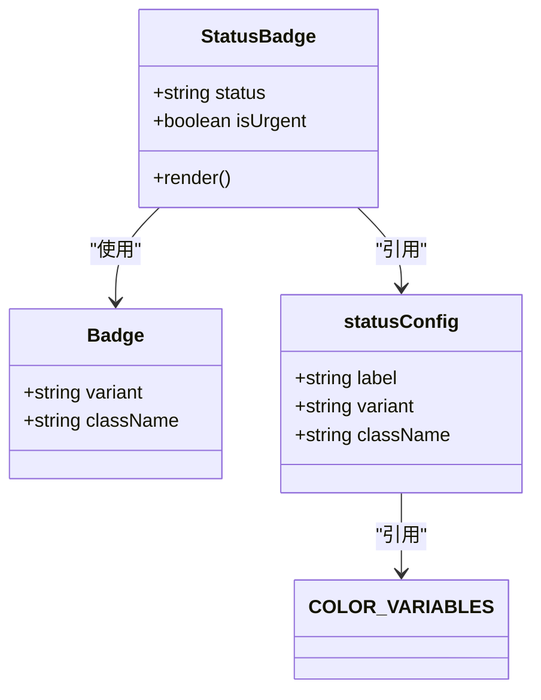
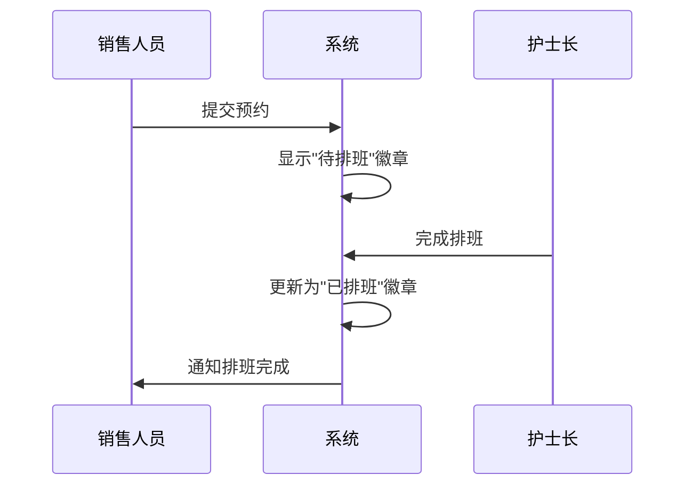
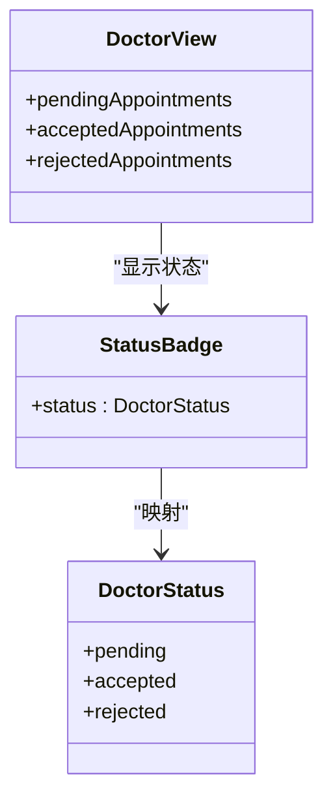
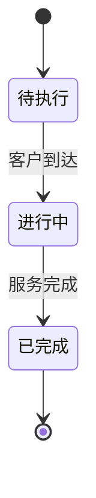
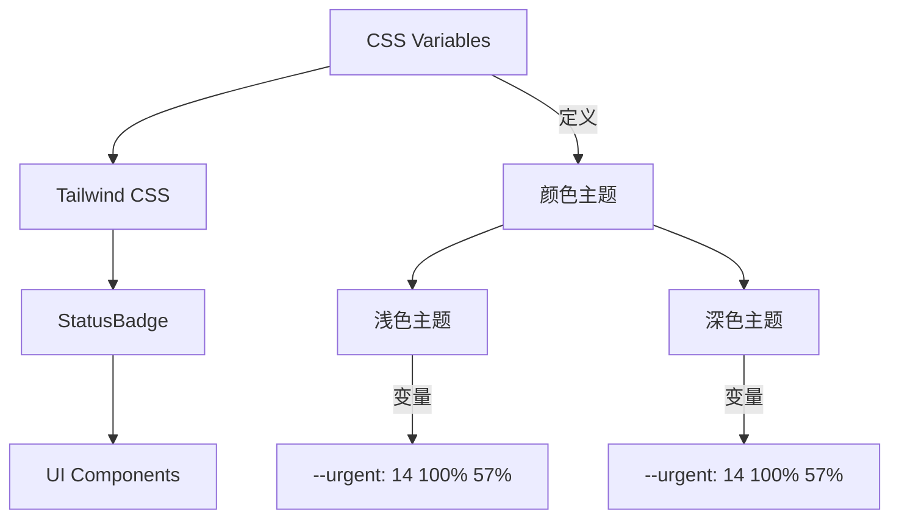

# 状态徽章

<cite>
**本文档引用文件**   
- [StatusBadge.tsx](file://src/components/appointment/StatusBadge.tsx)
- [types.ts](file://src/types/types.ts)
- [badge.tsx](file://src/components/ui/badge.tsx)
- [colorSystem.ts](file://src/utils/colorSystem.ts)
- [tailwind.config.js](file://tailwind.config.js)
- [index.css](file://src/index.css)
- [AppointmentPage.tsx](file://src/pages/sales/AppointmentPage.tsx)
- [AppointmentPage.tsx](file://src/pages/doctor/AppointmentPage.tsx)
- [SchedulePage.tsx](file://src/pages/head-nurse/SchedulePage.tsx)
- [TaskPage.tsx](file://src/pages/nurse/TaskPage.tsx)
- [ColorSystemDemo.tsx](file://src/pages/ColorSystemDemo.tsx)
- [ScheduleDetailDialog.tsx](file://src/components/appointment/ScheduleDetailDialog.tsx)
</cite>

## 目录
1. [简介](#简介)
2. [核心组件](#核心组件)
3. [状态映射逻辑](#状态映射逻辑)
4. [视觉样式规则](#视觉样式规则)
5. [可定制化选项](#可定制化选项)
6. [业务场景使用示例](#业务场景使用示例)
7. [全局颜色系统集成](#全局颜色系统集成)
8. [常见问题与修复方法](#常见问题与修复方法)
9. [结论](#结论)

## 简介
状态徽章（StatusBadge）是Bio-Appointment系统中的核心UI组件，用于直观展示预约、排班、任务执行和医生确认等各类状态。该组件通过颜色编码和标签文本，为不同角色（销售、护士长、医生、护士）提供清晰的状态可视化，支持急单高亮、状态转换和视觉一致性等功能。

**Section sources**
- [StatusBadge.tsx](file://src/components/appointment/StatusBadge.tsx#L1-L51)

## 核心组件

状态徽章组件（StatusBadge）是一个功能丰富的React函数组件，支持多种状态类型和视觉样式。其核心实现基于`Badge`基础组件，并通过`statusConfig`配置对象定义了不同状态的显示规则。

组件接受两个主要属性：
- `status`: 联合类型，支持预约、排班、任务执行和医生状态
- `isUrgent`: 布尔值，用于标记急单状态

当`isUrgent`为`true`时，组件会忽略常规状态配置，直接显示红色"急单"徽章，确保紧急状态得到最高优先级的视觉呈现。

**Section sources**
- [StatusBadge.tsx](file://src/components/appointment/StatusBadge.tsx#L1-L51)
- [types.ts](file://src/types/types.ts#L13-L19)

## 状态映射逻辑

状态徽章组件通过`statusConfig`对象实现后端状态码到前端展示的映射。该配置对象将后端返回的状态字符串转换为用户友好的中文标签和相应的视觉样式。

```mermaid
flowchart TD
A[后端状态码] --> B{isUrgent?}
B --> |是| C[显示"急单"徽章]
B --> |否| D[查找statusConfig]
D --> E{状态存在?}
E --> |是| F[返回配置的标签和样式]
E --> |否| G[返回默认状态]
```

**Diagram sources**
- [StatusBadge.tsx](file://src/components/appointment/StatusBadge.tsx#L9-L29)

### 支持的状态类型

状态徽章支持四种主要状态类型，每种类型都有特定的业务含义：

#### 预约状态
| 状态码 | 标签文本 | 业务含义 |
|--------|----------|----------|
| pending | 待排班 | 客户已提交预约，等待护士长排班 |
| scheduled | 已排班 | 已分配资源，排班已确认 |
| confirmed | 已确认 | 医生已确认预约 |
| in_progress | 进行中 | 服务正在进行中 |
| completed | 已完成 | 服务已完成 |
| cancelled | 已取消 | 预约已被取消 |

**Section sources**
- [types.ts](file://src/types/types.ts#L13)
- [StatusBadge.tsx](file://src/components/appointment/StatusBadge.tsx#L11-L16)

#### 排班状态
| 状态码 | 标签文本 | 业务含义 |
|--------|----------|----------|
| draft | 草稿 | 排班信息正在编辑中 |
| published | 已发布 | 排班已发布，资源已分配 |
| locked | 已锁定 | 排班已锁定，不可修改 |

**Section sources**
- [types.ts](file://src/types/types.ts#L17)
- [StatusBadge.tsx](file://src/components/appointment/StatusBadge.tsx#L19-L21)

#### 任务执行状态
| 状态码 | 标签文本 | 业务含义 |
|--------|----------|----------|
| checked_in | 已到达 | 客户已到达服务地点 |

**Section sources**
- [types.ts](file://src/types/types.ts#L19)
- [StatusBadge.tsx](file://src/components/appointment/StatusBadge.tsx#L24)

#### 医生状态
| 状态码 | 标签文本 | 业务含义 |
|--------|----------|----------|
| accepted | 已接受 | 医生已接受预约 |
| rejected | 已拒绝 | 医生已拒绝预约 |

**Section sources**
- [types.ts](file://src/types/types.ts#L15)
- [StatusBadge.tsx](file://src/components/appointment/StatusBadge.tsx#L27-L28)

## 视觉样式规则

状态徽章的视觉样式遵循系统的颜色编码规范，确保在不同组件和页面中的一致性。样式规则主要通过CSS变量和Tailwind CSS类名实现。

### 颜色配置
状态徽章的颜色配置基于CSS自定义属性（CSS Variables），在`index.css`文件中定义：

```mermaid
erDiagram
COLOR_VARIABLES {
string --urgent
string --urgent-foreground
string --pending
string --pending-foreground
string --scheduled
string --scheduled-foreground
string --confirmed
string --confirmed-foreground
string --completed
string --completed-foreground
}
```

**Diagram sources**
- [index.css](file://src/index.css#L32-L41)
- [tailwind.config.js](file://tailwind.config.js#L62-L81)

### 样式映射
每个状态都有对应的CSS类名，通过`className`属性应用到徽章组件：



**Diagram sources**
- [StatusBadge.tsx](file://src/components/appointment/StatusBadge.tsx#L9-L29)
- [badge.tsx](file://src/components/ui/badge.tsx#L7-L25)

## 可定制化选项

状态徽章组件提供了灵活的配置选项，支持不同业务场景的需求。

### 尺寸配置
虽然状态徽章本身没有直接的尺寸属性，但其尺寸由基础`Badge`组件的样式决定。通过Tailwind CSS的`text-xs`类，徽章保持统一的小尺寸，适合在各种布局中使用。

### 图标支持
状态徽章支持在文本前添加图标，如急单状态中的火焰图标（🔥）。这种设计增强了视觉识别度，特别是在需要快速识别紧急状态的场景中。

### 动画效果
组件通过CSS过渡效果实现平滑的状态变化：

```css
transition-[color,box-shadow] 
```

这种过渡效果确保状态变化时的视觉流畅性，提升用户体验。

**Section sources**
- [badge.tsx](file://src/components/ui/badge.tsx#L8)
- [StatusBadge.tsx](file://src/components/appointment/StatusBadge.tsx#L34-L36)

## 业务场景使用示例

状态徽章在不同角色视图中有特定的使用方式，体现了系统的角色化设计。

### 销售视图
在销售视图中，状态徽章主要用于展示预约状态，帮助销售人员跟踪客户预约进度。



**Section sources**
- [AppointmentPage.tsx](file://src/pages/sales/AppointmentPage.tsx#L228-L449)

### 护士长视图
护士长视图中，状态徽章用于排班待办列表，支持急单高亮显示。

```mermaid
flowchart TD
A[获取待排班预约] --> B{是否为急单?}
B --> |是| C[显示红色"急单"徽章]
B --> |否| D[显示黄色"待排班"徽章]
C --> E[优先处理]
D --> F[按顺序处理]
```

**Section sources**
- [SchedulePage.tsx](file://src/pages/head-nurse/SchedulePage.tsx#L373-L399)

### 医生视图
医生视图中，状态徽章用于展示医生确认状态，帮助医生管理待确认预约。



**Section sources**
- [AppointmentPage.tsx](file://src/pages/doctor/AppointmentPage.tsx#L157-L268)

### 护士视图
护士视图中，状态徽章用于任务状态展示，帮助护士了解任务执行进度。



**Diagram sources**
- [TaskPage.tsx](file://src/pages/nurse/TaskPage.tsx#L110-L112)
- [TaskPage.tsx](file://src/pages/nurse/TaskPage.tsx#L207-L296)

## 全局颜色系统集成

状态徽章与系统的全局颜色系统深度集成，确保视觉一致性。

### 颜色系统架构
系统采用HSL颜色模型，通过CSS变量定义全局颜色：



**Diagram sources**
- [index.css](file://src/index.css#L10-L105)
- [tailwind.config.js](file://tailwind.config.js#L25-L98)

### 颜色一致性
通过`colorSystem.ts`文件中的颜色配置，确保不同组件间的颜色一致性：

```typescript
export const STATUS_COLORS = {
  busy: { bg: '#EF4444', text: '#FFFFFF', label: '忙碌' },
  available: { bg: '#10B981', text: '#FFFFFF', label: '空闲' },
  cleaning: { bg: '#F59E0B', text: '#FFFFFF', label: '清洁中' },
  maintenance: { bg: '#6B7280', text: '#FFFFFF', label: '维护中' },
};
```

这种设计确保了状态徽章的颜色与其他系统组件（如资源状态）保持一致。

**Section sources**
- [colorSystem.ts](file://src/utils/colorSystem.ts#L35-L40)
- [ColorSystemDemo.tsx](file://src/pages/ColorSystemDemo.tsx#L9-L9)

## 常见问题与修复方法

### 状态显示异常
**问题**: 状态徽章显示为原始状态码而非中文标签
**原因**: `statusConfig`中未定义该状态
**修复**: 在`statusConfig`对象中添加对应状态的配置

### 颜色显示不正确
**问题**: 徽章颜色与预期不符
**原因**: CSS变量未正确加载或被覆盖
**修复**: 检查`index.css`中的CSS变量定义，确保Tailwind配置正确

### 急单状态未高亮
**问题**: 急单状态未显示红色徽章
**原因**: `isUrgent`属性未正确传递
**修复**: 确保在需要高亮急单的场景中正确设置`isUrgent`属性

### 响应式问题
**问题**: 在小屏幕上徽章显示不完整
**原因**: 徽章容器宽度不足
**修复**: 使用`w-fit`类确保徽章宽度适应内容

**Section sources**
- [StatusBadge.tsx](file://src/components/appointment/StatusBadge.tsx#L31-L37)
- [index.css](file://src/index.css#L8)

## 结论
状态徽章组件是Bio-Appointment系统中关键的UI元素，通过清晰的状态映射、一致的视觉样式和灵活的配置选项，为不同角色提供了高效的状态可视化。组件与全局颜色系统的深度集成确保了整个应用的视觉一致性，而针对不同业务场景的定制化使用则体现了系统的角色化设计理念。