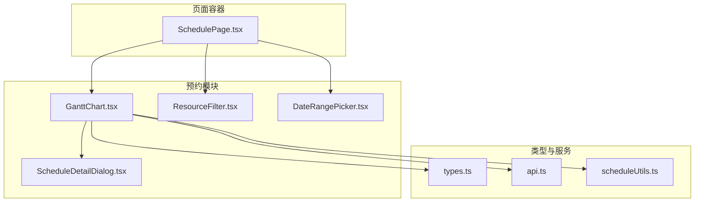
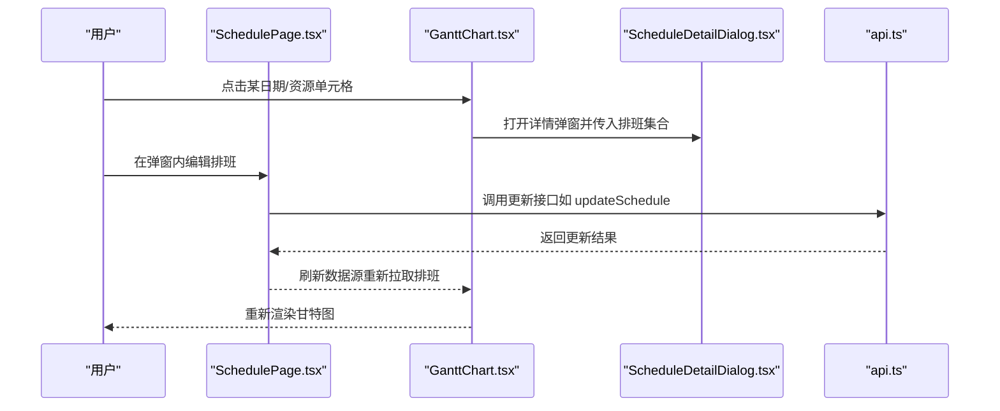
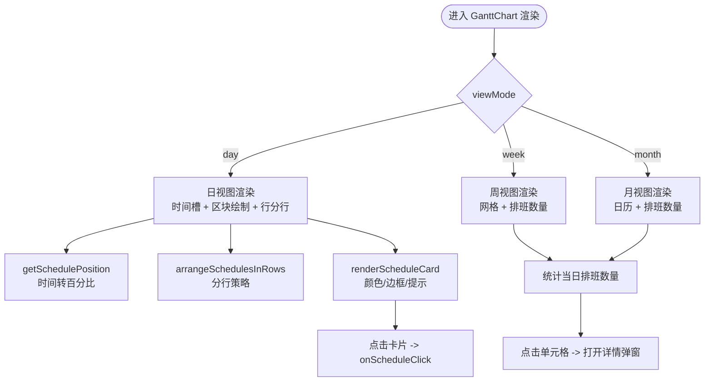
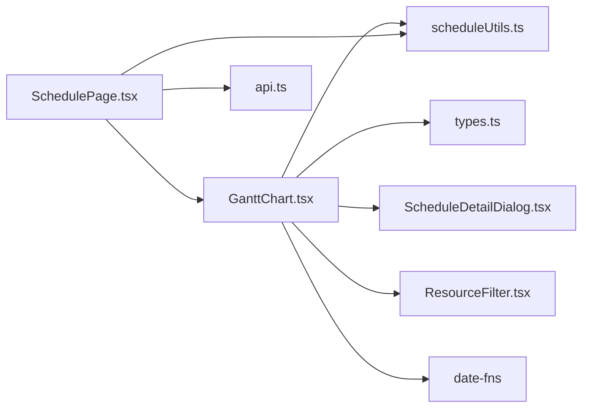
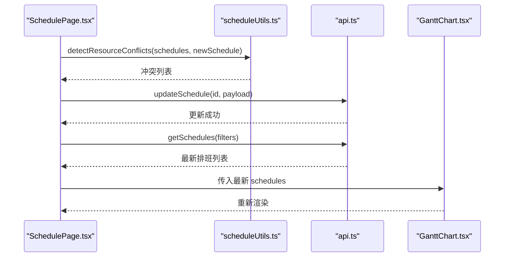

# 甘特图组件

<cite>
**本文引用的文件**
- [GanttChart.tsx](file://src/components/appointment/GanttChart.tsx)
- [ScheduleDetailDialog.tsx](file://src/components/appointment/ScheduleDetailDialog.tsx)
- [ResourceFilter.tsx](file://src/components/appointment/ResourceFilter.tsx)
- [types.ts](file://src/types/types.ts)
- [api.ts](file://src/services/api.ts)
- [scheduleUtils.ts](file://src/utils/scheduleUtils.ts)
- [use-debounce.ts](file://src/hooks/use-debounce.ts)
- [SchedulePage.tsx](file://src/pages/head-nurse/SchedulePage.tsx)
- [DateRangePicker.tsx](file://src/components/appointment/DateRangePicker.tsx)
</cite>

## 目录
1. [简介](#简介)
2. [项目结构](#项目结构)
3. [核心组件](#核心组件)
4. [架构总览](#架构总览)
5. [详细组件分析](#详细组件分析)
6. [依赖关系分析](#依赖关系分析)
7. [性能考虑](#性能考虑)
8. [故障排查指南](#故障排查指南)
9. [结论](#结论)
10. [附录](#附录)

## 简介
本文件面向“甘特图组件”的实现与使用，重点围绕 GanttChart.tsx 的时间轴资源占用可视化机制展开，涵盖：
- 时间刻度渲染与坐标换算
- 资源行布局与重叠排班分行显示
- 预约区块绘制与颜色编码
- 交互与数据更新流程（含拖拽与后端同步思路）
- 组件 props 结构与关键属性使用
- 与 ScheduleService 服务的集成路径与数据绑定
- 性能优化策略（虚拟滚动与防抖）
- 常见问题排查（拖拽错位、时间计算偏差）

## 项目结构
GanttChart 位于预约模块，配合资源筛选、详情对话框、日期选择器等组件共同构成排班可视化与交互入口。

图表来源
- [GanttChart.tsx](file://src/components/appointment/GanttChart.tsx#L1-L120)
- [ScheduleDetailDialog.tsx](file://src/components/appointment/ScheduleDetailDialog.tsx#L1-L60)
- [ResourceFilter.tsx](file://src/components/appointment/ResourceFilter.tsx#L1-L40)
- [DateRangePicker.tsx](file://src/components/appointment/DateRangePicker.tsx#L1-L30)
- [types.ts](file://src/types/types.ts#L139-L183)
- [api.ts](file://src/services/api.ts#L240-L325)
- [scheduleUtils.ts](file://src/utils/scheduleUtils.ts#L1-L40)
- [SchedulePage.tsx](file://src/pages/head-nurse/SchedulePage.tsx#L160-L210)

章节来源
- [GanttChart.tsx](file://src/components/appointment/GanttChart.tsx#L1-L120)
- [ScheduleDetailDialog.tsx](file://src/components/appointment/ScheduleDetailDialog.tsx#L1-L60)
- [ResourceFilter.tsx](file://src/components/appointment/ResourceFilter.tsx#L1-L40)
- [DateRangePicker.tsx](file://src/components/appointment/DateRangePicker.tsx#L1-L30)
- [types.ts](file://src/types/types.ts#L139-L183)
- [api.ts](file://src/services/api.ts#L240-L325)
- [scheduleUtils.ts](file://src/utils/scheduleUtils.ts#L1-L40)
- [SchedulePage.tsx](file://src/pages/head-nurse/SchedulePage.tsx#L160-L210)

## 核心组件
- GanttChart：负责日/周/月视图渲染、资源筛选、排班区块绘制、点击详情弹窗。
- ScheduleDetailDialog：展示某日期/资源下的排班明细。
- ResourceFilter：控制“护士/房间”维度的显示开关。
- DateRangePicker：提供日期与视图模式切换入口。
- types.ts：定义 ScheduleWithDetails、Nurse、Room 等类型。
- api.ts：提供排班查询与更新接口（用于后端同步）。
- scheduleUtils.ts：提供冲突检测与时间重叠判断。
- use-debounce.ts：通用防抖 Hook，可用于输入/筛选防抖。

章节来源
- [GanttChart.tsx](file://src/components/appointment/GanttChart.tsx#L1-L120)
- [ScheduleDetailDialog.tsx](file://src/components/appointment/ScheduleDetailDialog.tsx#L1-L60)
- [ResourceFilter.tsx](file://src/components/appointment/ResourceFilter.tsx#L1-L40)
- [types.ts](file://src/types/types.ts#L139-L183)
- [api.ts](file://src/services/api.ts#L240-L325)
- [scheduleUtils.ts](file://src/utils/scheduleUtils.ts#L1-L40)
- [use-debounce.ts](file://src/hooks/use-debounce.ts#L1-L16)

## 架构总览
GanttChart 以 props 驱动渲染，内部通过筛选与视图模式进行条件渲染；点击单元格触发详情弹窗；与 ScheduleService 的集成通过页面层的表单提交与 API 调用实现。

图表来源
- [GanttChart.tsx](file://src/components/appointment/GanttChart.tsx#L100-L140)
- [ScheduleDetailDialog.tsx](file://src/components/appointment/ScheduleDetailDialog.tsx#L1-L60)
- [api.ts](file://src/services/api.ts#L317-L321)
- [SchedulePage.tsx](file://src/pages/head-nurse/SchedulePage.tsx#L194-L210)

## 详细组件分析

### GanttChart.tsx：时间轴与资源占用可视化
- 视图模式与条件渲染
  - 支持 day/week/month 三种模式，通过 props.viewMode 控制渲染分支。
  - 日视图：横向时间槽（每小时/半小时），纵向房间/护士行，重叠排班分行显示。
  - 周视图：网格布局（资源×日期），单元格显示当天排班数量与简要信息。
  - 月视图：日历布局（7列），单元格显示日期与排班数量，支持跨资源汇总。
- 时间刻度与坐标换算
  - 日视图采用固定起止时间窗口（例如 8:00-19:00），将分钟数线性映射到百分比宽度与左偏移，形成时间轴上的区块定位。
  - 周/月视图通过 date-fns 计算周起止、月起止与日期序列，结合 visibleSchedules 过滤出当日排班并统计数量。
- 资源行布局与重叠排班分行
  - 对同一资源的排班数组，使用“逐行放置”策略：遍历已有行，若与现有排班无重叠则放入，否则新建一行；最终形成多行并列显示。
  - 重叠检测基于时间区间相交判断，确保同一时间资源不会叠加重叠。
- 预约区块绘制与样式
  - 区块位置由 getSchedulePosition 计算，样式由 getScheduleCardStyle 根据状态（急单/锁定）与颜色梯度生成。
  - Tooltip 展示客户名、服务名、护士/房间信息，便于快速识别。
- 交互与详情弹窗
  - 日视图：点击排班卡片可触发 onScheduleClick 回调。
  - 周/月视图：点击单元格打开详情弹窗，传入该日期/资源下的全部排班集合。
  - 详情弹窗由 ScheduleDetailDialog 渲染，包含日期、状态徽章、时间与时长、服务与同行信息、资源信息与调整原因等。
- 资源筛选与严格模式
  - 支持按护士/房间维度显隐，以及按具体 ID 列表进行严格筛选。
  - 资源类型筛选器（ResourceFilter）可单独开启护士或房间维度，实现“仅看护士/仅看房间”的视图。

图表来源
- [GanttChart.tsx](file://src/components/appointment/GanttChart.tsx#L145-L210)
- [GanttChart.tsx](file://src/components/appointment/GanttChart.tsx#L272-L318)
- [GanttChart.tsx](file://src/components/appointment/GanttChart.tsx#L326-L733)
- [GanttChart.tsx](file://src/components/appointment/GanttChart.tsx#L735-L917)

章节来源
- [GanttChart.tsx](file://src/components/appointment/GanttChart.tsx#L145-L210)
- [GanttChart.tsx](file://src/components/appointment/GanttChart.tsx#L272-L318)
- [GanttChart.tsx](file://src/components/appointment/GanttChart.tsx#L326-L733)
- [GanttChart.tsx](file://src/components/appointment/GanttChart.tsx#L735-L917)

### ScheduleDetailDialog.tsx：详情弹窗
- 输入：open/onOpenChange、schedules、date、resourceName/resourceType（可选）。
- 输出：展示排班列表，包含客户名、时间区间、时长、服务、同行、资源、状态徽章与调整原因等。
- 日期格式化与错误兜底：使用 parseISO + isValid + format，避免直接构造 Date 字符串导致的错误。

章节来源
- [ScheduleDetailDialog.tsx](file://src/components/appointment/ScheduleDetailDialog.tsx#L1-L175)

### ResourceFilter.tsx：资源筛选
- 输入：selectedFilters、onFilterChange。
- 行为：勾选“护士（含护士长）”或“房间资源”，支持切换与说明文案提示。
- 与 GanttChart 的协作：通过 props.resourceFilters 控制资源维度显隐。

章节来源
- [ResourceFilter.tsx](file://src/components/appointment/ResourceFilter.tsx#L1-L94)
- [GanttChart.tsx](file://src/components/appointment/GanttChart.tsx#L78-L93)

### DateRangePicker.tsx：日期与视图切换
- 输入：selectedDate、onDateChange、viewMode。
- 行为：提供导航与视图模式切换入口，驱动上层状态更新。

章节来源
- [DateRangePicker.tsx](file://src/components/appointment/DateRangePicker.tsx#L1-L30)

### 类型与服务集成
- 类型定义：ScheduleWithDetails、Nurse、Room 等，用于组件与服务层的数据契约。
- 排班服务：api.ts 提供 getSchedules、updateSchedule 等接口，页面层通过 SchedulePage.tsx 调用，实现排班更新与后端同步。
- 冲突检测：scheduleUtils.ts 提供 isTimeOverlap 与 detectResourceConflicts，用于创建/编辑排班前的冲突预检。

章节来源
- [types.ts](file://src/types/types.ts#L139-L183)
- [api.ts](file://src/services/api.ts#L240-L325)
- [scheduleUtils.ts](file://src/utils/scheduleUtils.ts#L1-L92)
- [SchedulePage.tsx](file://src/pages/head-nurse/SchedulePage.tsx#L160-L210)

## 依赖关系分析
- 组件耦合
  - GanttChart 依赖：types.ts（类型）、scheduleUtils.ts（重叠检测）、ScheduleDetailDialog.tsx（详情弹窗）、ResourceFilter.tsx（筛选）、date-fns（日期计算）。
  - 页面层（SchedulePage.tsx）依赖：api.ts（后端接口）、scheduleUtils.ts（冲突检测）、表单校验与提交逻辑。
- 外部依赖
  - date-fns：提供 parseISO、format、startOfWeek、endOfWeek、eachDayOfInterval、startOfMonth、endOfMonth、isSameDay 等。
  - UI 组件库：Card、ScrollArea、Tooltip、Dialog 等，用于布局与交互。

图表来源
- [GanttChart.tsx](file://src/components/appointment/GanttChart.tsx#L1-L40)
- [SchedulePage.tsx](file://src/pages/head-nurse/SchedulePage.tsx#L160-L210)
- [api.ts](file://src/services/api.ts#L240-L325)
- [scheduleUtils.ts](file://src/utils/scheduleUtils.ts#L1-L40)

## 性能考虑
- 虚拟滚动
  - 日视图已使用 ScrollArea 包裹，适合中等规模数据滚动；对于大规模数据，建议引入虚拟滚动（如 react-window 或类似方案）以减少 DOM 节点数量。
- 防抖重渲染
  - 使用 use-debounce Hook 对高频输入/筛选进行防抖，降低渲染压力。
- 重叠排班分行
  - 通过 arrangeSchedulesInRows 将重叠排班分行，避免过度拥挤；对超大列表可考虑限制每行最大排班数并提供“展开查看更多”。

章节来源
- [GanttChart.tsx](file://src/components/appointment/GanttChart.tsx#L735-L917)
- [use-debounce.ts](file://src/hooks/use-debounce.ts#L1-L16)

## 故障排查指南
- 拖拽错位
  - 现象：拖拽调整时间后，区块位置与时间不一致。
  - 排查要点：
    - 检查时间格式是否为 HH:mm:ss，确保 getSchedulePosition 的起止时间解析正确。
    - 确认时间窗口边界（如 8:00-19:00）与实际数据一致，避免超出范围导致比例计算异常。
    - 若实现拖拽，请确保拖拽结束后的回调能触发数据更新与重新渲染。
- 时间计算偏差
  - 现象：区块宽度或左偏移异常。
  - 排查要点：
    - 使用统一的时间解析（如 parseISO）与格式化（如 format），避免直接构造 Date 字符串。
    - 确保分钟换算与百分比映射公式一致（起始分钟与持续分钟）。
- 重叠检测不生效
  - 现象：重叠排班未分行或冲突检测误判。
  - 排查要点：
    - 检查 isTimeOverlap 的实现与调用参数顺序。
    - 确认 arrangeSchedulesInRows 的比较逻辑是否对齐。
- 详情弹窗日期显示异常
  - 现象：日期显示为无效或错误。
  - 排查要点：
    - 使用 parseISO + isValid + format 的安全格式化流程。
    - 确保传入的 date 字符串格式正确。

章节来源
- [GanttChart.tsx](file://src/components/appointment/GanttChart.tsx#L145-L210)
- [GanttChart.tsx](file://src/components/appointment/GanttChart.tsx#L272-L318)
- [ScheduleDetailDialog.tsx](file://src/components/appointment/ScheduleDetailDialog.tsx#L26-L40)

## 结论
GanttChart 通过清晰的视图模式与筛选机制，实现了对资源占用的直观可视化。日视图的重叠分行与周/月视图的汇总展示，分别满足了细粒度与宏观视角的需求。结合 ScheduleDetailDialog 与 SchedulePage 的后端同步流程，可实现从查看到编辑再到更新的完整闭环。未来可在虚拟滚动与拖拽交互方面进一步优化，以支撑更大规模数据与更丰富的编辑体验。

## 附录

### 组件 Props 结构与使用说明
- GanttChartProps
  - schedules: ScheduleWithDetails[] —— 排班数据源
  - nurses: Nurse[] —— 护士列表
  - rooms: Room[] —— 房间列表
  - selectedDate: string —— 选中日期（YYYY-MM-DD）
  - viewMode: 'day' | 'week' | 'month' —— 视图模式
  - resourceFilters?: ResourceFilterType[] —— 资源维度筛选（'nurse' | 'room'）
  - selectedNurseIds?: string[] —— 严格筛选：仅显示指定护士
  - selectedRoomIds?: string[] —— 严格筛选：仅显示指定房间
  - onScheduleClick?: (schedule: ScheduleWithDetails) => void —— 点击排班卡片回调

章节来源
- [GanttChart.tsx](file://src/components/appointment/GanttChart.tsx#L15-L37)
- [types.ts](file://src/types/types.ts#L139-L183)

### 与 ScheduleService 集成示例（数据绑定流程）
- 页面层（SchedulePage.tsx）
  - 表单初始化与提交：根据 estimated_duration 计算结束时间，调用 api.ts 的 updateSchedule 接口。
  - 冲突检测：使用 scheduleUtils.ts 的 detectResourceConflicts，在提交前进行预检。
- 服务层（api.ts）
  - 提供 getSchedules、updateSchedule 等接口，返回标准化的 Schedule 数据。
- 组件层（GanttChart.tsx）
  - 通过 props.schedules 与 visibleSchedules 过滤逻辑，渲染最新数据。
  - 详情弹窗（ScheduleDetailDialog.tsx）展示更新后的排班详情。

图表来源
- [SchedulePage.tsx](file://src/pages/head-nurse/SchedulePage.tsx#L160-L210)
- [scheduleUtils.ts](file://src/utils/scheduleUtils.ts#L36-L92)
- [api.ts](file://src/services/api.ts#L317-L321)
- [GanttChart.tsx](file://src/components/appointment/GanttChart.tsx#L60-L76)