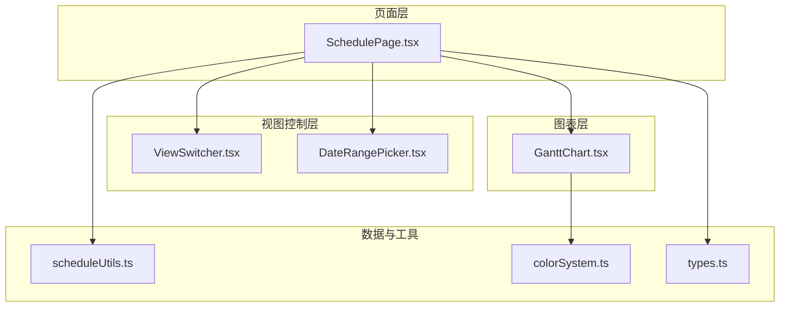
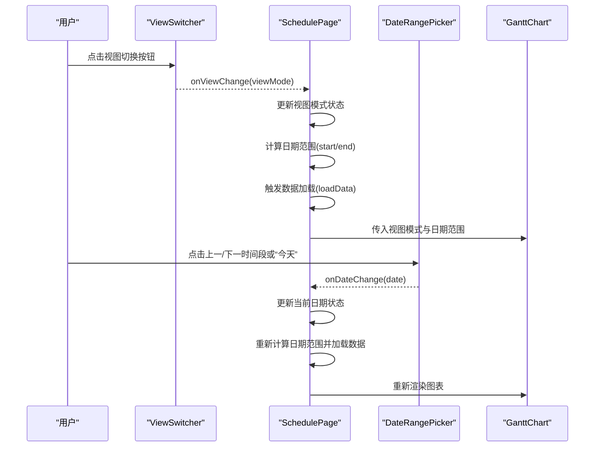
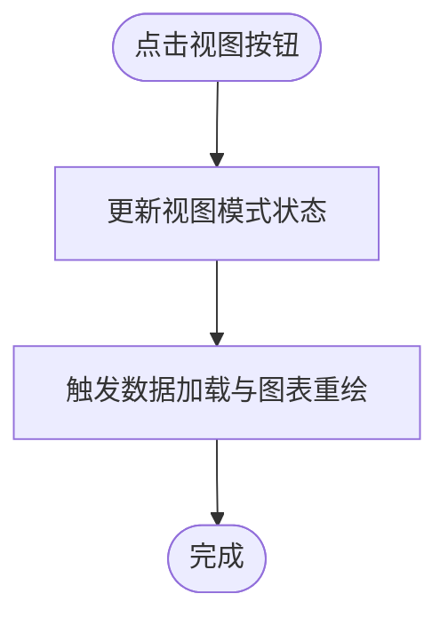
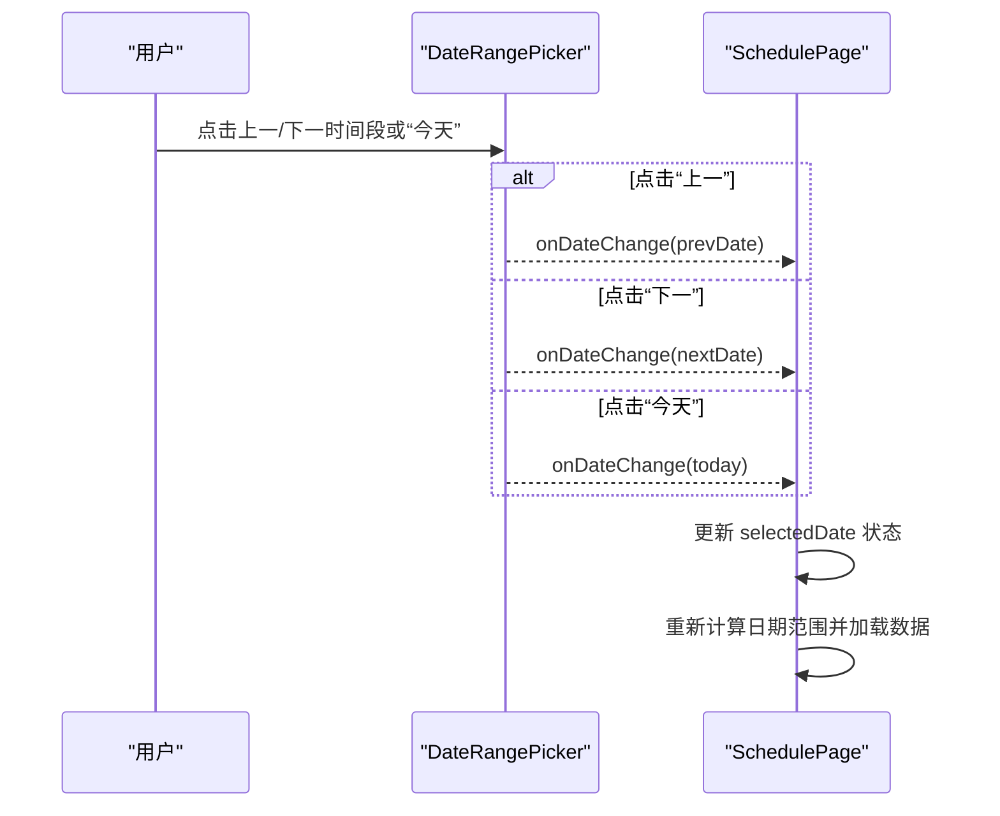
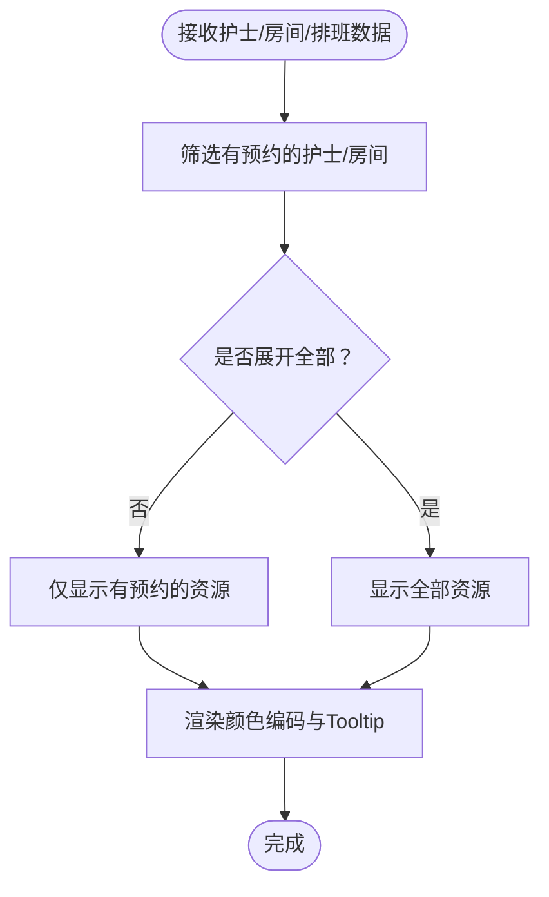
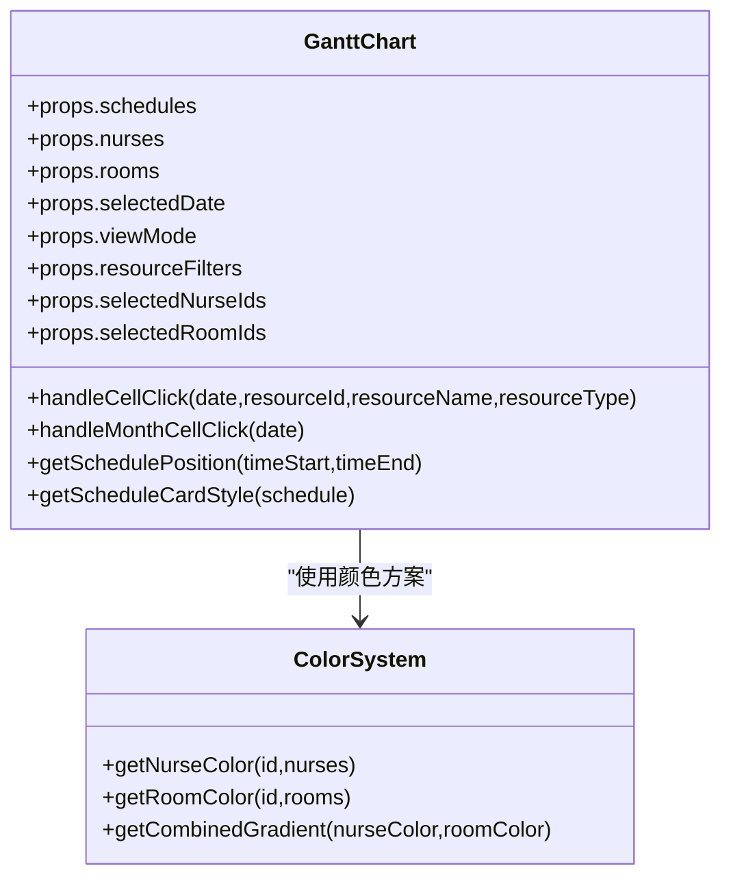
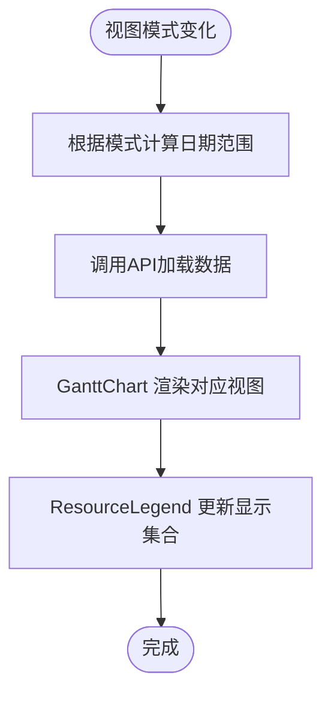
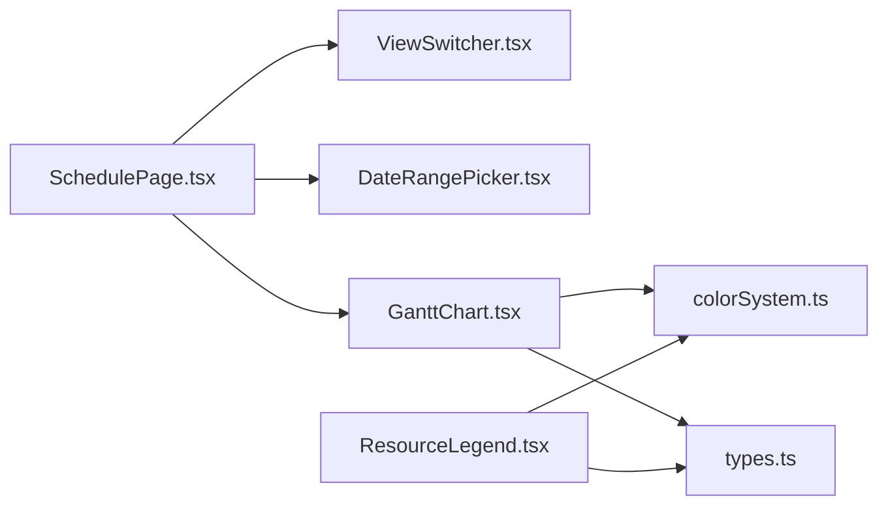

# 视图切换器

<cite>
**本文引用的文件**
- [ViewSwitcher.tsx](file://src/components/appointment/ViewSwitcher.tsx)
- [ResourceLegend.tsx](file://src/components/appointment/ResourceLegend.tsx)
- [DateRangePicker.tsx](file://src/components/appointment/DateRangePicker.tsx)
- [GanttChart.tsx](file://src/components/appointment/GanttChart.tsx)
- [SchedulePage.tsx](file://src/pages/head-nurse/SchedulePage.tsx)
- [scheduleUtils.ts](file://src/utils/scheduleUtils.ts)
- [colorSystem.ts](file://src/utils/colorSystem.ts)
- [types.ts](file://src/types/types.ts)
</cite>

## 目录
1. [简介](#简介)
2. [项目结构](#项目结构)
3. [核心组件](#核心组件)
4. [架构总览](#架构总览)
5. [详细组件分析](#详细组件分析)
6. [依赖关系分析](#依赖关系分析)
7. [性能考量](#性能考量)
8. [故障排查指南](#故障排查指南)
9. [结论](#结论)

## 简介
本文件围绕“视图切换器”主题，聚焦于 ViewSwitcher.tsx 与 ResourceLegend.tsx 的实现，系统阐述周视图与月视图之间的切换逻辑、时间范围计算、数据粒度调整与 UI 布局重构；解释视图状态管理机制与用户偏好的持久化策略；说明 ResourceLegend 如何根据当前视图动态展示资源分类图例；提供与 DateRangePicker 的联动示例；并总结视图切换过程中的性能优化与常见问题的调试方法。

## 项目结构
- 视图切换器位于 appointment 组件目录，配合 GanttChart 与 SchedulePage 页面共同构成排班看板的核心交互层。
- 日期范围选择器 DateRangePicker 与视图模式联动，支持按天/周/月进行导航。
- ResourceLegend 作为资源图例组件，依据当前视图与数据动态呈现护士与房间的颜色编码与数量统计。

**图表来源**
- [SchedulePage.tsx](file://src/pages/head-nurse/SchedulePage.tsx#L453-L486)
- [ViewSwitcher.tsx](file://src/components/appointment/ViewSwitcher.tsx#L12-L38)
- [DateRangePicker.tsx](file://src/components/appointment/DateRangePicker.tsx#L17-L223)
- [GanttChart.tsx](file://src/components/appointment/GanttChart.tsx#L1-L200)
- [scheduleUtils.ts](file://src/utils/scheduleUtils.ts#L1-L112)
- [colorSystem.ts](file://src/utils/colorSystem.ts#L1-L140)
- [types.ts](file://src/types/types.ts#L1-L487)

**章节来源**
- [SchedulePage.tsx](file://src/pages/head-nurse/SchedulePage.tsx#L453-L486)
- [ViewSwitcher.tsx](file://src/components/appointment/ViewSwitcher.tsx#L12-L38)
- [DateRangePicker.tsx](file://src/components/appointment/DateRangePicker.tsx#L17-L223)
- [GanttChart.tsx](file://src/components/appointment/GanttChart.tsx#L1-L200)

## 核心组件
- 视图切换器 ViewSwitcher：提供 day/week/month 三态切换按钮，通过回调通知父组件更新视图模式。
- 日期范围选择器 DateRangePicker：根据当前视图模式计算并展示日期范围文本，提供上一时间段、下一时间段与“今天”导航，并在日/周/月模式下分别提供不同的选择器。
- 资源图例 ResourceLegend：根据当前视图与数据，动态展示护士与房间的颜色编码与数量统计，支持“全部/收起”切换。
- GanttChart：接收视图模式与日期范围，渲染日/周/月视图的排班卡片与布局。

**章节来源**
- [ViewSwitcher.tsx](file://src/components/appointment/ViewSwitcher.tsx#L12-L38)
- [DateRangePicker.tsx](file://src/components/appointment/DateRangePicker.tsx#L17-L223)
- [ResourceLegend.tsx](file://src/components/appointment/ResourceLegend.tsx#L21-L189)
- [GanttChart.tsx](file://src/components/appointment/GanttChart.tsx#L1-L200)

## 架构总览
视图切换器与日期范围选择器在 SchedulePage 中协同工作，通过 useState 管理视图模式与当前日期，触发数据加载与图表渲染。视图模式变化会驱动时间范围计算与数据粒度调整，进而影响 GanttChart 的渲染策略与 ResourceLegend 的展示内容。

**图表来源**
- [SchedulePage.tsx](file://src/pages/head-nurse/SchedulePage.tsx#L37-L121)
- [ViewSwitcher.tsx](file://src/components/appointment/ViewSwitcher.tsx#L12-L38)
- [DateRangePicker.tsx](file://src/components/appointment/DateRangePicker.tsx#L55-L88)
- [GanttChart.tsx](file://src/components/appointment/GanttChart.tsx#L1-L200)

## 详细组件分析

### 视图切换器 ViewSwitcher
- 功能要点
  - 定义 ViewMode 类型：day、week、month。
  - 提供三个按钮，当前激活态使用默认样式与阴影强调。
  - 点击回调通知父组件更新视图模式。
- 交互流程
  - 父组件通过 props.currentView 与 props.onViewChange 控制按钮状态与行为。
  - 在 SchedulePage 中，onViewChange 会更新本地状态，从而触发数据加载与图表重绘。

**图表来源**
- [ViewSwitcher.tsx](file://src/components/appointment/ViewSwitcher.tsx#L12-L38)
- [SchedulePage.tsx](file://src/pages/head-nurse/SchedulePage.tsx#L37-L41)

**章节来源**
- [ViewSwitcher.tsx](file://src/components/appointment/ViewSwitcher.tsx#L12-L38)
- [SchedulePage.tsx](file://src/pages/head-nurse/SchedulePage.tsx#L37-L41)

### 日期范围选择器 DateRangePicker
- 功能要点
  - 根据当前视图模式返回不同的日期范围文本与简短文本。
  - 提供“上一时间段/下一时间段/今天”导航，内部使用 date-fns 计算日期。
  - 日/周/月模式下分别提供日历、周选择与年/月选择器。
- 与视图联动
  - 当视图模式变化时，DateRangePicker 会根据新的模式更新显示文本与交互控件。
  - onDateChange 将日期回传给父组件，父组件更新 selectedDate 并触发数据加载。

**图表来源**
- [DateRangePicker.tsx](file://src/components/appointment/DateRangePicker.tsx#L55-L88)
- [DateRangePicker.tsx](file://src/components/appointment/DateRangePicker.tsx#L108-L200)
- [SchedulePage.tsx](file://src/pages/head-nurse/SchedulePage.tsx#L37-L41)

**章节来源**
- [DateRangePicker.tsx](file://src/components/appointment/DateRangePicker.tsx#L17-L223)
- [SchedulePage.tsx](file://src/pages/head-nurse/SchedulePage.tsx#L37-L121)

### 资源图例 ResourceLegend
- 功能要点
  - 接收护士、房间与排班数据，自动筛选出“有预约”的资源集合。
  - 默认仅展示有预约的资源，支持“全部/收起”切换。
  - 使用 colorSystem.ts 的颜色方案为护士与房间生成颜色编码，并在 Tooltip 中展示资源详情。
- 与视图的关系
  - 当视图模式变化或日期范围变化时，父组件会重新加载数据，ResourceLegend 会基于新数据重新计算显示集合。
  - 在周/月视图中，更多资源可能参与排班，图例会相应扩展显示。

**图表来源**
- [ResourceLegend.tsx](file://src/components/appointment/ResourceLegend.tsx#L28-L189)
- [colorSystem.ts](file://src/utils/colorSystem.ts#L1-L140)

**章节来源**
- [ResourceLegend.tsx](file://src/components/appointment/ResourceLegend.tsx#L21-L189)
- [colorSystem.ts](file://src/utils/colorSystem.ts#L1-L140)

### GanttChart 与视图模式
- 功能要点
  - 接收视图模式与日期范围，决定渲染策略（日/周/月）。
  - 根据资源类型筛选器与用户选择的护士/房间 ID，过滤可见资源与排班。
  - 使用颜色系统为排班卡片生成组合颜色，突出急单与锁定状态。
- 与视图切换的协作
  - 视图模式变化时，父组件重新计算日期范围并加载数据，GanttChart 依据新参数渲染不同粒度的视图。
  - 月视图下，点击单元格会弹出对话框展示当天所有排班，不区分资源。

**图表来源**
- [GanttChart.tsx](file://src/components/appointment/GanttChart.tsx#L1-L200)
- [colorSystem.ts](file://src/utils/colorSystem.ts#L1-L140)

**章节来源**
- [GanttChart.tsx](file://src/components/appointment/GanttChart.tsx#L1-L200)
- [colorSystem.ts](file://src/utils/colorSystem.ts#L1-L140)

### 视图切换逻辑与数据粒度调整
- 时间范围计算
  - day：以 selectedDate 当日为起止。
  - week：以周一开始计算周起止日期。
  - month：以当月第一天与最后一天为起止。
- 数据粒度调整
  - 日视图：按天粒度加载排班与预约。
  - 周/月视图：按周/月区间加载排班，支持多日聚合展示。
- UI 布局重构
  - 日视图：按小时刻度与房间维度渲染排班卡片。
  - 周/月视图：按日期网格渲染排班卡片，支持月视图的“点击当天所有排班”。

**图表来源**
- [SchedulePage.tsx](file://src/pages/head-nurse/SchedulePage.tsx#L63-L121)
- [GanttChart.tsx](file://src/components/appointment/GanttChart.tsx#L724-L883)

**章节来源**
- [SchedulePage.tsx](file://src/pages/head-nurse/SchedulePage.tsx#L63-L121)
- [GanttChart.tsx](file://src/components/appointment/GanttChart.tsx#L724-L883)

### 视图状态管理与用户偏好持久化
- 状态管理
  - 视图模式与当前日期在 SchedulePage 中通过 useState 管理。
  - useEffect 监听视图模式与日期变化，触发数据加载。
- 偏好设置持久化
  - 仓库未见对视图模式与日期的本地持久化实现。建议在现有本地存储方案基础上扩展，例如：
    - 使用 localStorage 存储 lastViewMode 与 lastSelectedDate。
    - 在页面初始化时读取并恢复状态。
    - 注意：需与后端数据一致性校验，避免跨设备/浏览器差异导致的数据错乱。

**章节来源**
- [SchedulePage.tsx](file://src/pages/head-nurse/SchedulePage.tsx#L37-L121)

### 与 DateRangePicker 的联动示例
- 在 SchedulePage 中，ViewSwitcher 与 DateRangePicker 同时受控于同一组状态：
  - ViewSwitcher 的 onViewChange 更新视图模式。
  - DateRangePicker 的 onDateChange 更新当前日期。
- 两者均会触发 useEffect，重新计算日期范围并加载数据，保证视图与日期的一致性。

**章节来源**
- [SchedulePage.tsx](file://src/pages/head-nurse/SchedulePage.tsx#L453-L486)
- [ViewSwitcher.tsx](file://src/components/appointment/ViewSwitcher.tsx#L12-L38)
- [DateRangePicker.tsx](file://src/components/appointment/DateRangePicker.tsx#L17-L223)

### 性能优化措施
- 懒加载与状态缓存
  - 采用分页与按需加载策略，避免一次性拉取大量数据。
  - 缓存最近一次的视图数据，减少重复请求。
- 渲染优化
  - GanttChart 使用绝对定位与固定行高，减少 DOM 重排。
  - ResourceLegend 使用 Tooltip 按需渲染，避免不必要的节点创建。
- 交互优化
  - DateRangePicker 在日/周/月模式下提供不同选择器，降低无效渲染。
  - 使用节流/防抖（如需要）控制高频交互的响应频率。

**章节来源**
- [GanttChart.tsx](file://src/components/appointment/GanttChart.tsx#L1-L200)
- [ResourceLegend.tsx](file://src/components/appointment/ResourceLegend.tsx#L21-L189)
- [DateRangePicker.tsx](file://src/components/appointment/DateRangePicker.tsx#L108-L200)

### 调试方法与常见问题
- 视图错乱或数据不一致
  - 检查视图模式与日期范围计算是否匹配（日/周/月）。
  - 确认 API 请求参数与后端期望一致（按天/按周/按月）。
  - 查看 GanttChart 的资源过滤逻辑，确保护士/房间筛选正确。
- 冲突检测与资源占用
  - 使用 scheduleUtils 的冲突检测函数，确认是否存在资源冲突。
  - 在 ResourceLegend 中观察颜色编码与数量统计，确认资源占用状态。
- 性能问题
  - 大数据量时启用分页与缓存。
  - 减少不必要的 re-render，使用 React.memo 或稳定引用。

**章节来源**
- [scheduleUtils.ts](file://src/utils/scheduleUtils.ts#L1-L112)
- [GanttChart.tsx](file://src/components/appointment/GanttChart.tsx#L1-L200)
- [ResourceLegend.tsx](file://src/components/appointment/ResourceLegend.tsx#L21-L189)

## 依赖关系分析
- 组件依赖
  - SchedulePage 依赖 ViewSwitcher、DateRangePicker、GanttChart。
  - GanttChart 依赖 colorSystem 与 types。
  - ResourceLegend 依赖 colorSystem 与 types。
- 外部库
  - date-fns 用于日期计算与格式化。
  - lucide-react 用于图标。
  - Tailwind CSS 用于样式组织。

**图表来源**
- [SchedulePage.tsx](file://src/pages/head-nurse/SchedulePage.tsx#L453-L486)
- [ViewSwitcher.tsx](file://src/components/appointment/ViewSwitcher.tsx#L12-L38)
- [DateRangePicker.tsx](file://src/components/appointment/DateRangePicker.tsx#L17-L223)
- [GanttChart.tsx](file://src/components/appointment/GanttChart.tsx#L1-L200)
- [ResourceLegend.tsx](file://src/components/appointment/ResourceLegend.tsx#L21-L189)
- [colorSystem.ts](file://src/utils/colorSystem.ts#L1-L140)
- [types.ts](file://src/types/types.ts#L1-L487)

**章节来源**
- [SchedulePage.tsx](file://src/pages/head-nurse/SchedulePage.tsx#L453-L486)
- [GanttChart.tsx](file://src/components/appointment/GanttChart.tsx#L1-L200)
- [ResourceLegend.tsx](file://src/components/appointment/ResourceLegend.tsx#L21-L189)

## 性能考量
- 数据加载
  - 按视图模式选择合适的粒度，避免一次性加载过多数据。
  - 使用并发请求（Promise.all）减少等待时间。
- 渲染
  - 使用虚拟滚动或分页，降低 DOM 节点数量。
  - 对高频交互（拖拽、缩放）采用节流/防抖。
- 缓存
  - 缓存最近一次的视图数据与颜色方案，减少重复计算与网络请求。

[本节为通用指导，无需具体文件来源]

## 故障排查指南
- 视图不更新
  - 确认 useEffect 依赖项包含视图模式与日期。
  - 检查 onViewChange 与 onDateChange 是否正确更新状态。
- 日期范围异常
  - 核对 week 与 month 的起止日期计算逻辑。
  - 确保 selectedDate 与 selectedDate 字符串格式一致。
- 资源图例不显示
  - 检查 schedules 是否为空或字段缺失。
  - 确认 ResourceLegend 的筛选逻辑与数据结构匹配。
- 冲突检测误判
  - 使用 scheduleUtils 的冲突检测函数进行二次验证。
  - 核对时间字符串格式与时区处理。

**章节来源**
- [SchedulePage.tsx](file://src/pages/head-nurse/SchedulePage.tsx#L37-L121)
- [scheduleUtils.ts](file://src/utils/scheduleUtils.ts#L1-L112)
- [ResourceLegend.tsx](file://src/components/appointment/ResourceLegend.tsx#L21-L189)

## 结论
ViewSwitcher 与 DateRangePicker 协同实现了灵活的视图切换与日期导航，SchedulePage 通过统一的状态管理与数据加载流程，确保周/月视图的时间范围计算、数据粒度调整与 UI 布局重构顺畅衔接。ResourceLegend 则在不同视图下动态展示资源分类图例，提升可读性与可用性。结合合理的性能优化与调试手段，可有效避免视图错乱与数据不一致问题，保障用户体验。