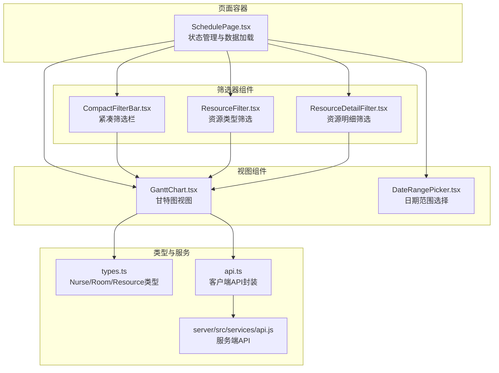
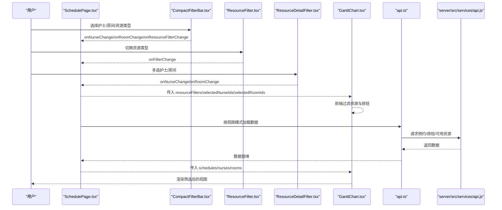
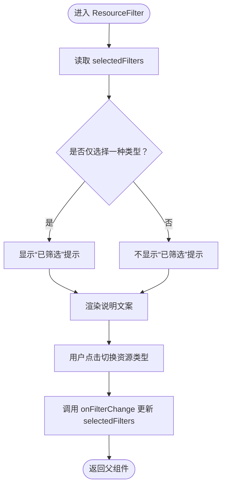
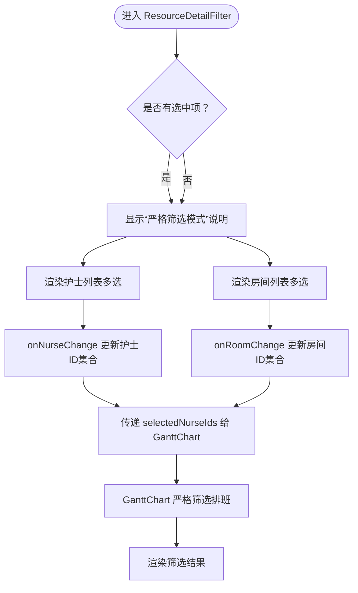
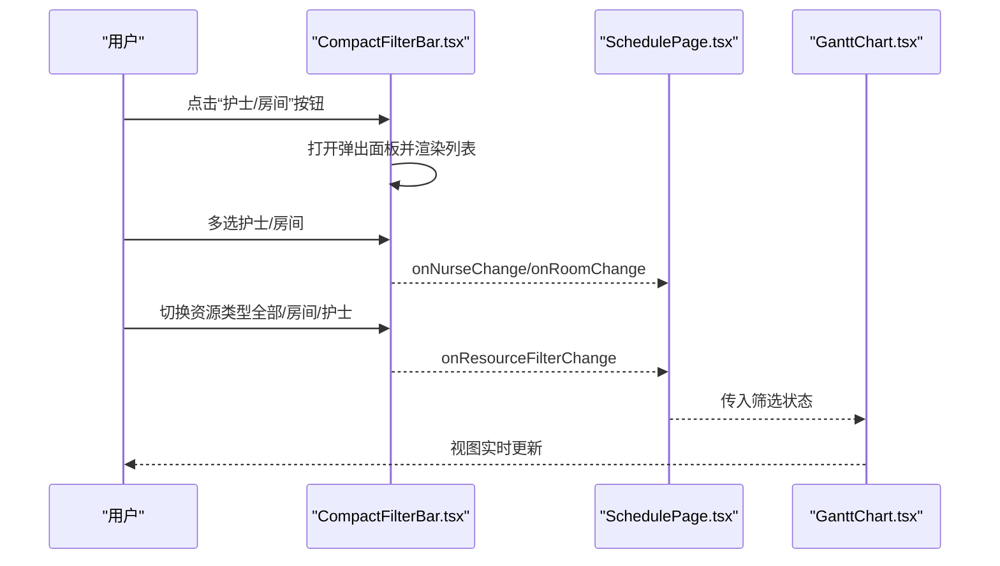
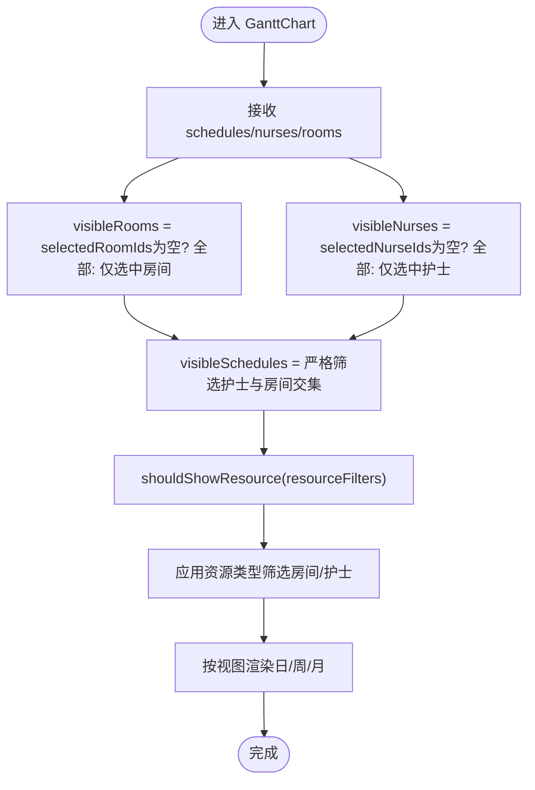
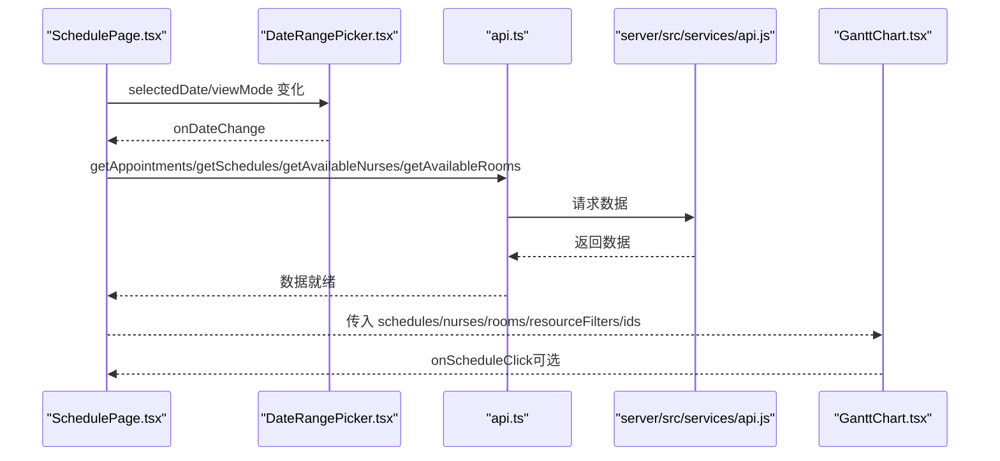
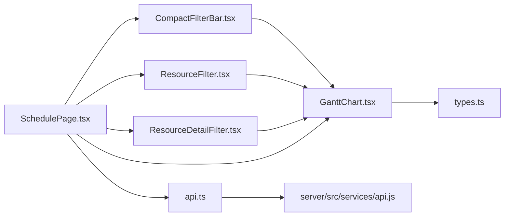

# 资源筛选器

<cite>
**本文引用的文件**
- [ResourceFilter.tsx](file://src/components/appointment/ResourceFilter.tsx)
- [ResourceDetailFilter.tsx](file://src/components/appointment/ResourceDetailFilter.tsx)
- [CompactFilterBar.tsx](file://src/components/appointment/CompactFilterBar.tsx)
- [GanttChart.tsx](file://src/components/appointment/GanttChart.tsx)
- [SchedulePage.tsx](file://src/pages/head-nurse/SchedulePage.tsx)
- [DateRangePicker.tsx](file://src/components/appointment/DateRangePicker.tsx)
- [types.ts](file://src/types/types.ts)
- [use-debounce.ts](file://src/hooks/use-debounce.ts)
- [api.ts](file://src/services/api.ts)
- [api.js](file://server/src/services/api.js)
- [RESOURCE_FILTER_FEATURE.md](file://RESOURCE_FILTER_FEATURE.md)
- [RESOURCE_FILTER_USER_GUIDE.md](file://RESOURCE_FILTER_USER_GUIDE.md)
- [RESOURCE_FILTER_DEMO.md](file://RESOURCE_FILTER_DEMO.md)
</cite>

## 目录
1. [简介](#简介)
2. [项目结构](#项目结构)
3. [核心组件](#核心组件)
4. [架构总览](#架构总览)
5. [组件详解](#组件详解)
6. [依赖关系分析](#依赖关系分析)
7. [性能考量](#性能考量)
8. [故障排查指南](#故障排查指南)
9. [结论](#结论)
10. [附录](#附录)

## 简介
本文件面向“资源筛选器”系列组件，围绕 ResourceFilter、ResourceDetailFilter 与 CompactFilterBar 的多级筛选条件管理机制展开，覆盖资源类型、状态、时间段等维度的过滤逻辑；解释筛选状态如何通过 props 在组件间同步，并与数据层交互；描述响应式设计在不同视图下的表现差异；提供筛选条件组合的使用示例与复杂查询构建思路；分析性能瓶颈与优化方案（如防抖与缓存），并列出常见筛选失效问题的解决方案。

## 项目结构
资源筛选器相关的核心文件集中在 appointment 组件目录与页面容器中，配合类型定义与服务层 API，形成“筛选状态管理 → 视图渲染 → 数据加载”的闭环。

图表来源
- [SchedulePage.tsx](file://src/pages/head-nurse/SchedulePage.tsx#L37-L120)
- [CompactFilterBar.tsx](file://src/components/appointment/CompactFilterBar.tsx#L1-L120)
- [ResourceFilter.tsx](file://src/components/appointment/ResourceFilter.tsx#L1-L94)
- [ResourceDetailFilter.tsx](file://src/components/appointment/ResourceDetailFilter.tsx#L1-L120)
- [GanttChart.tsx](file://src/components/appointment/GanttChart.tsx#L1-L120)
- [DateRangePicker.tsx](file://src/components/appointment/DateRangePicker.tsx#L1-L120)
- [types.ts](file://src/types/types.ts#L248-L276)
- [api.ts](file://src/services/api.ts#L151-L175)
- [api.js](file://server/src/services/api.js#L65-L102)

章节来源
- [SchedulePage.tsx](file://src/pages/head-nurse/SchedulePage.tsx#L37-L120)
- [RESOURCE_FILTER_FEATURE.md](file://RESOURCE_FILTER_FEATURE.md#L1-L71)

## 核心组件
- ResourceFilter：资源类型筛选（护士/房间），支持单选、双选与清空，用于切换“按护士/按房间/全部资源”的视图维度。
- ResourceDetailFilter：资源明细筛选（多选护士、多选房间），提供严格筛选模式说明与清除按钮，强调“仅显示选中资源及其相关排班”。
- CompactFilterBar：紧凑筛选栏，横向布局，包含护士/房间多选弹出面板、资源类型切换下拉与一键清除，适合资源看板上方的轻量化筛选入口。

章节来源
- [ResourceFilter.tsx](file://src/components/appointment/ResourceFilter.tsx#L1-L94)
- [ResourceDetailFilter.tsx](file://src/components/appointment/ResourceDetailFilter.tsx#L1-L120)
- [CompactFilterBar.tsx](file://src/components/appointment/CompactFilterBar.tsx#L1-L120)
- [RESOURCE_FILTER_FEATURE.md](file://RESOURCE_FILTER_FEATURE.md#L71-L121)

## 架构总览
筛选状态在页面容器中集中管理，通过 props 传递至各筛选器与视图组件；视图组件根据筛选状态对资源与排班进行前端过滤与条件渲染；数据加载由页面容器统一发起，筛选不影响数据来源，仅影响展示。

图表来源
- [SchedulePage.tsx](file://src/pages/head-nurse/SchedulePage.tsx#L37-L120)
- [CompactFilterBar.tsx](file://src/components/appointment/CompactFilterBar.tsx#L47-L94)
- [ResourceFilter.tsx](file://src/components/appointment/ResourceFilter.tsx#L8-L30)
- [ResourceDetailFilter.tsx](file://src/components/appointment/ResourceDetailFilter.tsx#L10-L48)
- [GanttChart.tsx](file://src/components/appointment/GanttChart.tsx#L15-L45)
- [api.ts](file://src/services/api.ts#L151-L175)
- [api.js](file://server/src/services/api.js#L65-L102)

## 组件详解

### ResourceFilter 组件
- 功能要点
  - 资源类型维度：护士（含护士长）、房间资源。
  - 交互行为：单选切换，支持清空；当仅选择一种类型时显示“已筛选”提示。
  - 说明文案：根据当前选中状态动态更新，帮助用户理解筛选效果。
- 状态管理
  - 通过 props.selectedFilters 与 onFilterChange 管理资源类型筛选数组。
  - 与 GanttChart 的 resourceFilters prop 对接，实现资源维度切换。
- 与视图的关系
  - 在日/周视图中，仅显示符合资源类型筛选的区域；月视图不区分资源类型，但筛选状态仍可影响提示信息。

图表来源
- [ResourceFilter.tsx](file://src/components/appointment/ResourceFilter.tsx#L13-L30)
- [GanttChart.tsx](file://src/components/appointment/GanttChart.tsx#L78-L98)

章节来源
- [ResourceFilter.tsx](file://src/components/appointment/ResourceFilter.tsx#L1-L94)
- [GanttChart.tsx](file://src/components/appointment/GanttChart.tsx#L78-L98)
- [RESOURCE_FILTER_FEATURE.md](file://RESOURCE_FILTER_FEATURE.md#L36-L71)

### ResourceDetailFilter 组件
- 功能要点
  - 多选护士与多选房间，支持严格筛选模式说明与一键清除。
  - 选中项统计与名称展示，帮助用户确认当前筛选范围。
  - 筛选规则：只选护士→仅显示这些护士的排班；只选房间→仅显示这些房间的排班；同时选→仅显示同时满足两个条件的排班。
- 状态管理
  - 通过 onNurseChange 与 onRoomChange 管理选中资源 ID 列表。
  - 与 GanttChart 的 selectedNurseIds/selectedRoomIds props 对接，实现排班级严格筛选。
- 与视图的关系
  - 严格筛选模式下，GanttChart 会对排班进行交集过滤，仅显示同时匹配护士与房间条件的排班。

图表来源
- [ResourceDetailFilter.tsx](file://src/components/appointment/ResourceDetailFilter.tsx#L10-L48)
- [GanttChart.tsx](file://src/components/appointment/GanttChart.tsx#L60-L77)

章节来源
- [ResourceDetailFilter.tsx](file://src/components/appointment/ResourceDetailFilter.tsx#L1-L217)
- [GanttChart.tsx](file://src/components/appointment/GanttChart.tsx#L60-L77)

### CompactFilterBar 组件
- 功能要点
  - 紧凑横向布局，包含护士/房间多选弹出面板、资源类型切换下拉与清除按钮。
  - 资源类型切换：全部资源、按房间、按护士；支持一键清空筛选。
- 状态管理
  - 通过 onNurseChange/onRoomChange/onResourceFilterChange/onClearFilters 管理筛选状态。
  - 与 GanttChart 的 props 对齐，保证筛选状态在看板上方即可统一控制。
- 响应式表现
  - 在桌面端采用横向布局与弹出面板；在移动端可通过容器宽度自适应，保持关键控件可见。

图表来源
- [CompactFilterBar.tsx](file://src/components/appointment/CompactFilterBar.tsx#L47-L94)
- [SchedulePage.tsx](file://src/pages/head-nurse/SchedulePage.tsx#L333-L346)

章节来源
- [CompactFilterBar.tsx](file://src/components/appointment/CompactFilterBar.tsx#L1-L260)
- [SchedulePage.tsx](file://src/pages/head-nurse/SchedulePage.tsx#L333-L346)

### GanttChart 视图与筛选逻辑
- 资源级过滤
  - visibleRooms/visibleNurses：基于 selectedRoomIds/selectedNurseIds 的前端过滤。
  - resourceFilters：基于 ResourceFilter 的资源类型维度切换（全部/房间/护士）。
- 排班级严格筛选
  - visibleSchedules：当存在护士或房间筛选时，仅保留同时满足护士与房间条件的排班。
- 视图差异
  - 日/周视图：支持资源类型筛选与严格筛选，分别渲染房间/护士区域或网格。
  - 月视图：显示排班汇总，不区分资源类型；若存在资源类型筛选，显示提示信息。
- 无结果提示
  - 当资源与排班均为空时，显示“暂无符合筛选条件的资源”的友好提示。

图表来源
- [GanttChart.tsx](file://src/components/appointment/GanttChart.tsx#L45-L98)
- [GanttChart.tsx](file://src/components/appointment/GanttChart.tsx#L60-L77)
- [GanttChart.tsx](file://src/components/appointment/GanttChart.tsx#L575-L627)

章节来源
- [GanttChart.tsx](file://src/components/appointment/GanttChart.tsx#L45-L98)
- [GanttChart.tsx](file://src/components/appointment/GanttChart.tsx#L575-L627)
- [RESOURCE_FILTER_FEATURE.md](file://RESOURCE_FILTER_FEATURE.md#L36-L71)

### 页面容器与数据流
- SchedulePage 负责：
  - 维护筛选状态：resourceFilters、selectedNurseIds、selectedRoomIds。
  - 统一加载数据：按视图模式计算日期范围并并行请求预约、排班、可用护士与房间。
  - 将筛选状态与视图参数传递给 GanttChart。
- 日期范围选择器 DateRangePicker 与视图切换联动，触发数据重新加载。

图表来源
- [SchedulePage.tsx](file://src/pages/head-nurse/SchedulePage.tsx#L37-L120)
- [DateRangePicker.tsx](file://src/components/appointment/DateRangePicker.tsx#L1-L120)
- [api.ts](file://src/services/api.ts#L151-L175)
- [api.js](file://server/src/services/api.js#L65-L102)

章节来源
- [SchedulePage.tsx](file://src/pages/head-nurse/SchedulePage.tsx#L37-L120)
- [DateRangePicker.tsx](file://src/components/appointment/DateRangePicker.tsx#L1-L120)

## 依赖关系分析
- 组件耦合
  - CompactFilterBar 与 ResourceFilter/ResourceDetailFilter 共同作用于 GanttChart 的筛选状态，耦合度较高但职责清晰。
  - GanttChart 依赖 types.ts 中的 Nurse/Room/Resource 类型定义，确保类型安全。
- 外部依赖
  - 客户端 API 封装 api.ts 与服务端 API server/src/services/api.js，负责数据获取与过滤参数构建。
- 可能的循环依赖
  - 当前文件组织避免了循环依赖；若后续扩展，需确保筛选器与视图组件通过 props 单向传递状态。

图表来源
- [CompactFilterBar.tsx](file://src/components/appointment/CompactFilterBar.tsx#L47-L94)
- [ResourceFilter.tsx](file://src/components/appointment/ResourceFilter.tsx#L8-L30)
- [ResourceDetailFilter.tsx](file://src/components/appointment/ResourceDetailFilter.tsx#L10-L48)
- [GanttChart.tsx](file://src/components/appointment/GanttChart.tsx#L15-L45)
- [SchedulePage.tsx](file://src/pages/head-nurse/SchedulePage.tsx#L333-L346)
- [types.ts](file://src/types/types.ts#L248-L276)
- [api.ts](file://src/services/api.ts#L151-L175)
- [api.js](file://server/src/services/api.js#L65-L102)

章节来源
- [types.ts](file://src/types/types.ts#L248-L276)
- [api.ts](file://src/services/api.ts#L151-L175)
- [api.js](file://server/src/services/api.js#L65-L102)

## 性能考量
- 前端筛选
  - 资源与排班的筛选在前端完成，避免额外网络请求，响应速度快。
- 条件渲染
  - 仅渲染可见资源与排班，减少 DOM 体积与重绘成本。
- 防抖与缓存
  - 若引入搜索关键词或远程筛选，可使用 use-debounce 钩子降低请求频率；当前组件主要依赖本地过滤，无需远程防抖。
- 优化建议
  - 对超大列表的多选面板，可考虑虚拟滚动（如 ScrollArea 已具备滚动能力）。
  - 严格筛选时，先对排班进行预过滤，再按资源维度进一步裁剪，减少重复计算。

章节来源
- [use-debounce.ts](file://src/hooks/use-debounce.ts#L1-L16)
- [GanttChart.tsx](file://src/components/appointment/GanttChart.tsx#L60-L77)
- [RESOURCE_FILTER_DEMO.md](file://RESOURCE_FILTER_DEMO.md#L286-L313)

## 故障排查指南
- 筛选后无结果显示
  - 检查是否同时选择了护士与房间且无交集；或资源列表为空。
  - 使用“清除筛选”恢复默认视图。
- 月视图不支持筛选
  - 月视图为汇总视图，不区分资源类型；切换到日/周视图进行详细筛选。
- 筛选状态未同步
  - 确认筛选器的 onNurseChange/onRoomChange/onResourceFilterChange 是否正确传递至页面容器。
  - 确认 GanttChart 的 resourceFilters/selectedNurseIds/selectedRoomIds 是否正确接收。
- 数据未更新
  - 切换视图或日期范围后，确认页面容器是否重新加载数据。
- 严格筛选模式误解
  - 仅选护士/仅选房间/同时选→分别对应不同筛选效果；确认预期结果与实际一致。

章节来源
- [RESOURCE_FILTER_USER_GUIDE.md](file://RESOURCE_FILTER_USER_GUIDE.md#L158-L176)
- [GanttChart.tsx](file://src/components/appointment/GanttChart.tsx#L575-L627)
- [SchedulePage.tsx](file://src/pages/head-nurse/SchedulePage.tsx#L37-L120)

## 结论
资源筛选器系列组件通过清晰的职责划分与 props 同步机制，实现了资源类型与资源明细的多级筛选。前端严格筛选与条件渲染确保了良好的性能与用户体验；月视图的特殊处理避免了误导。结合使用指南与演示文档，用户可快速掌握筛选组合与复杂查询构建方法。

## 附录

### 筛选状态与 Props 同步路径
- 页面容器维护：resourceFilters、selectedNurseIds、selectedRoomIds。
- 传递至视图：GanttChart 的 resourceFilters、selectedNurseIds、selectedRoomIds。
- 传递至筛选器：CompactFilterBar、ResourceFilter、ResourceDetailFilter 的 onNurseChange/onRoomChange/onResourceFilterChange/onClearFilters。

章节来源
- [SchedulePage.tsx](file://src/pages/head-nurse/SchedulePage.tsx#L333-L346)
- [CompactFilterBar.tsx](file://src/components/appointment/CompactFilterBar.tsx#L47-L94)
- [ResourceFilter.tsx](file://src/components/appointment/ResourceFilter.tsx#L8-L30)
- [ResourceDetailFilter.tsx](file://src/components/appointment/ResourceDetailFilter.tsx#L10-L48)
- [GanttChart.tsx](file://src/components/appointment/GanttChart.tsx#L15-L45)

### 使用示例与复杂查询构建
- 仅查看护士排班：勾选“护士（含护士长）”，日/周视图仅显示护士区域；月视图显示汇总。
- 仅查看房间排班：勾选“房间资源”，日/周视图仅显示房间区域；月视图显示汇总。
- 同时查看：勾选两者或不选，显示全部资源。
- 严格筛选：在 ResourceDetailFilter 中多选多个护士与房间，仅显示同时满足条件的排班。
- 组合策略：先用 ResourceFilter 切换资源维度，再用 ResourceDetailFilter 进行细粒度筛选，最后在 GanttChart 中观察结果。

章节来源
- [RESOURCE_FILTER_USER_GUIDE.md](file://RESOURCE_FILTER_USER_GUIDE.md#L22-L111)
- [RESOURCE_FILTER_DEMO.md](file://RESOURCE_FILTER_DEMO.md#L138-L189)
- [GanttChart.tsx](file://src/components/appointment/GanttChart.tsx#L60-L77)