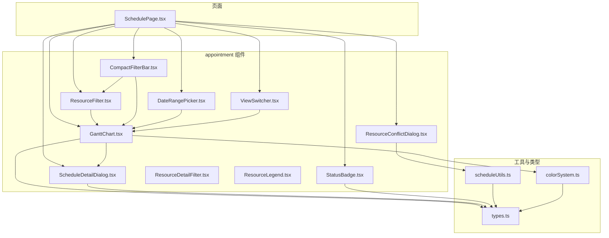
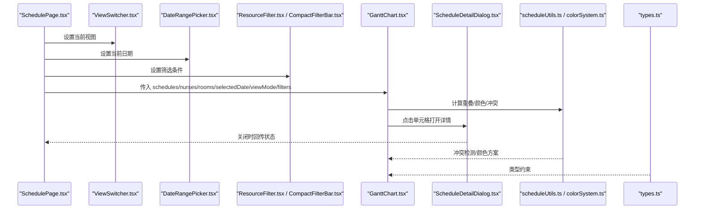
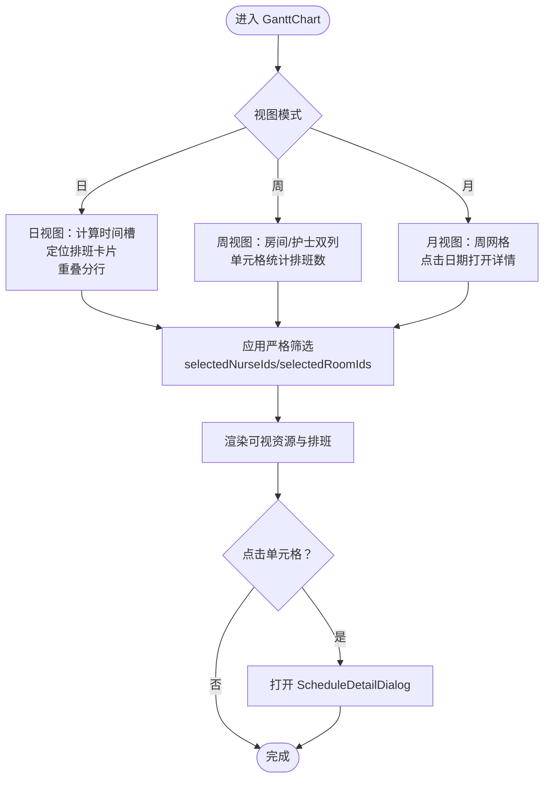
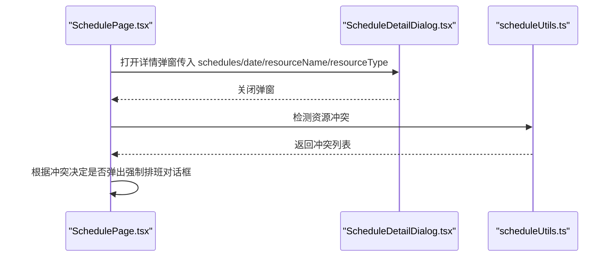
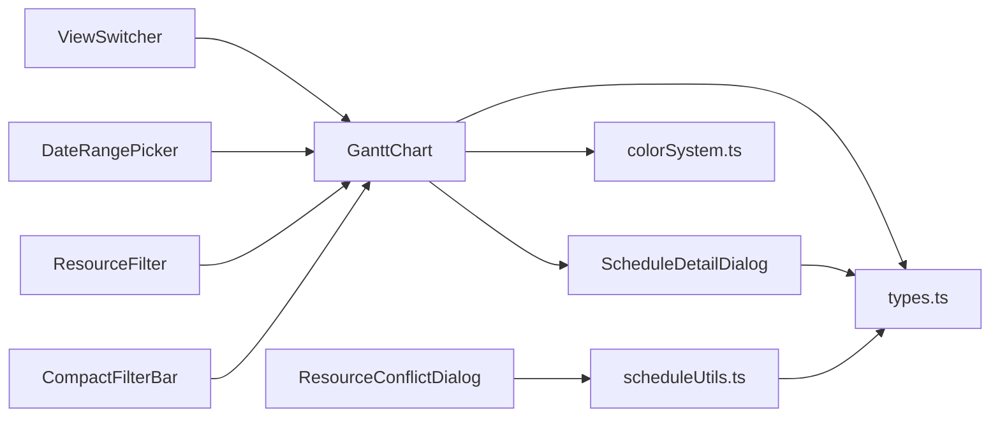

# 预约业务组件

<cite>
**本文引用的文件**
- [GanttChart.tsx](file://src/components/appointment/GanttChart.tsx)
- [ResourceFilter.tsx](file://src/components/appointment/ResourceFilter.tsx)
- [ViewSwitcher.tsx](file://src/components/appointment/ViewSwitcher.tsx)
- [ScheduleDetailDialog.tsx](file://src/components/appointment/ScheduleDetailDialog.tsx)
- [StatusBadge.tsx](file://src/components/appointment/StatusBadge.tsx)
- [CompactFilterBar.tsx](file://src/components/appointment/CompactFilterBar.tsx)
- [DateRangePicker.tsx](file://src/components/appointment/DateRangePicker.tsx)
- [ResourceDetailFilter.tsx](file://src/components/appointment/ResourceDetailFilter.tsx)
- [ResourceLegend.tsx](file://src/components/appointment/ResourceLegend.tsx)
- [ResourceConflictDialog.tsx](file://src/components/appointment/ResourceConflictDialog.tsx)
- [scheduleUtils.ts](file://src/utils/scheduleUtils.ts)
- [colorSystem.ts](file://src/utils/colorSystem.ts)
- [types.ts](file://src/types/types.ts)
- [SchedulePage.tsx](file://src/pages/head-nurse/SchedulePage.tsx)
</cite>

## 目录
1. [简介](#简介)
2. [项目结构](#项目结构)
3. [核心组件](#核心组件)
4. [架构总览](#架构总览)
5. [组件详解](#组件详解)
6. [依赖关系分析](#依赖关系分析)
7. [性能考量](#性能考量)
8. [故障排查指南](#故障排查指南)
9. [结论](#结论)
10. [附录](#附录)

## 简介
本文件聚焦于 src/components/appointment/ 目录下的预约业务组件，围绕以下目标展开：
- 深入讲解 GanttChart 甘特图组件的数据绑定方式、时间轴渲染逻辑和拖拽交互实现
- 解析 ResourceFilter 资源筛选器的筛选条件管理与状态同步机制
- 说明 ViewSwitcher 视图切换器在周/月视图间的切换逻辑与用户体验优化
- 详述 ScheduleDetailDialog 排班详情弹窗的字段展示、编辑流程和数据提交方式
- 解释 StatusBadge 状态徽章的多种状态映射规则
- 提供真实业务场景的使用示例，说明这些组件如何协同工作以实现智能排班功能，并解释其与后端 API 的数据交互模式

## 项目结构
appointment 目录下包含一组业务级组件，围绕“排班可视化与筛选”这一核心主题构建，配合工具函数与类型定义，形成完整的前端排班界面与交互闭环。

图表来源
- [GanttChart.tsx](file://src/components/appointment/GanttChart.tsx#L1-L917)
- [ResourceFilter.tsx](file://src/components/appointment/ResourceFilter.tsx#L1-L94)
- [ViewSwitcher.tsx](file://src/components/appointment/ViewSwitcher.tsx#L1-L39)
- [ScheduleDetailDialog.tsx](file://src/components/appointment/ScheduleDetailDialog.tsx#L1-L175)
- [StatusBadge.tsx](file://src/components/appointment/StatusBadge.tsx#L1-L51)
- [CompactFilterBar.tsx](file://src/components/appointment/CompactFilterBar.tsx#L1-L260)
- [DateRangePicker.tsx](file://src/components/appointment/DateRangePicker.tsx#L1-L223)
- [ResourceDetailFilter.tsx](file://src/components/appointment/ResourceDetailFilter.tsx#L1-L217)
- [ResourceLegend.tsx](file://src/components/appointment/ResourceLegend.tsx#L1-L189)
- [ResourceConflictDialog.tsx](file://src/components/appointment/ResourceConflictDialog.tsx#L1-L93)
- [scheduleUtils.ts](file://src/utils/scheduleUtils.ts#L1-L112)
- [colorSystem.ts](file://src/utils/colorSystem.ts#L1-L140)
- [types.ts](file://src/types/types.ts#L1-L200)
- [SchedulePage.tsx](file://src/pages/head-nurse/SchedulePage.tsx#L1-L200)

章节来源
- [GanttChart.tsx](file://src/components/appointment/GanttChart.tsx#L1-L917)
- [SchedulePage.tsx](file://src/pages/head-nurse/SchedulePage.tsx#L1-L200)

## 核心组件
- GanttChart：基于视图模式（日/周/月）渲染排班卡片，支持严格筛选与重叠排班自动分行，提供点击进入详情弹窗的能力。
- ResourceFilter：按资源类型（护士/房间）进行维度切换，配合 GanttChart 的资源类型筛选逻辑。
- ViewSwitcher：提供日/周/月三种视图的切换按钮，驱动 GanttChart 的渲染分支。
- ScheduleDetailDialog：展示某一天/某资源上的排班明细，支持状态徽章与急单标记。
- StatusBadge：统一的状态徽章映射，支持“急单”特殊态。
- CompactFilterBar：紧凑型筛选栏，支持按护士/房间多选与资源类型切换，与 GanttChart 的严格筛选联动。
- DateRangePicker：根据当前视图模式提供日期导航与选择能力。
- ResourceDetailFilter：详细筛选面板，说明严格筛选规则与选中项。
- ResourceLegend：颜色图例，按护士/房间展示颜色编码，支持“仅显示有预约的资源”。
- ResourceConflictDialog：检测资源冲突后的确认对话框，支持强制排班。

章节来源
- [GanttChart.tsx](file://src/components/appointment/GanttChart.tsx#L1-L917)
- [ResourceFilter.tsx](file://src/components/appointment/ResourceFilter.tsx#L1-L94)
- [ViewSwitcher.tsx](file://src/components/appointment/ViewSwitcher.tsx#L1-L39)
- [ScheduleDetailDialog.tsx](file://src/components/appointment/ScheduleDetailDialog.tsx#L1-L175)
- [StatusBadge.tsx](file://src/components/appointment/StatusBadge.tsx#L1-L51)
- [CompactFilterBar.tsx](file://src/components/appointment/CompactFilterBar.tsx#L1-L260)
- [DateRangePicker.tsx](file://src/components/appointment/DateRangePicker.tsx#L1-L223)
- [ResourceDetailFilter.tsx](file://src/components/appointment/ResourceDetailFilter.tsx#L1-L217)
- [ResourceLegend.tsx](file://src/components/appointment/ResourceLegend.tsx#L1-L189)
- [ResourceConflictDialog.tsx](file://src/components/appointment/ResourceConflictDialog.tsx#L1-L93)

## 架构总览
从页面层到组件层再到工具与类型层，形成清晰的职责边界：
- 页面层负责数据加载与状态管理（如 SchedulePage.tsx），通过 props 将数据与回调传递给 appointment 组件。
- appointment 组件负责 UI 渲染与交互，内部通过工具函数与颜色系统增强可读性与无障碍体验。
- 类型定义与工具函数提供跨组件共享的类型与算法，保证一致性与可维护性。

图表来源
- [SchedulePage.tsx](file://src/pages/head-nurse/SchedulePage.tsx#L1-L200)
- [ViewSwitcher.tsx](file://src/components/appointment/ViewSwitcher.tsx#L1-L39)
- [DateRangePicker.tsx](file://src/components/appointment/DateRangePicker.tsx#L1-L223)
- [ResourceFilter.tsx](file://src/components/appointment/ResourceFilter.tsx#L1-L94)
- [CompactFilterBar.tsx](file://src/components/appointment/CompactFilterBar.tsx#L1-L260)
- [GanttChart.tsx](file://src/components/appointment/GanttChart.tsx#L1-L917)
- [ScheduleDetailDialog.tsx](file://src/components/appointment/ScheduleDetailDialog.tsx#L1-L175)
- [scheduleUtils.ts](file://src/utils/scheduleUtils.ts#L1-L112)
- [colorSystem.ts](file://src/utils/colorSystem.ts#L1-L140)
- [types.ts](file://src/types/types.ts#L1-L200)

## 组件详解

### GanttChart 甘特图组件
- 数据绑定方式
  - 输入属性：schedules、nurses、rooms、selectedDate、viewMode、resourceFilters、selectedNurseIds、selectedRoomIds、onScheduleClick。
  - 输出回调：onScheduleClick 用于外部处理排班点击事件。
- 严格筛选模式
  - 当存在 selectedNurseIds 或 selectedRoomIds 时，仅显示匹配的排班；当两者同时存在时取交集。
  - resourceFilters 控制“按护士/房间”维度的显示开关，配合 GanttChart 的 shouldShowResource 判断。
- 时间轴渲染逻辑
  - 日视图：固定 8:00–19:00 的时间槽，使用分钟换算计算 left/width 百分比定位排班卡片；对重叠排班进行分行排列。
  - 周视图：按周起止渲染房间与护士两块区域，每个单元格统计当天排班数量与部分客户名称，点击进入详情。
  - 月视图：按周网格渲染，空白处填充占位符，点击日期进入详情；当存在资源类型筛选时提示“不区分资源类型”。
- 拖拽交互
  - 代码中未实现拖拽调整时间的交互逻辑；若需实现，可在排班卡片上增加可拖拽句柄与时间更新回调，并结合冲突检测与后端提交。
- 颜色与样式
  - 使用 colorSystem.ts 的 getNurseColor/getRoomColor 与 getCombinedGradient 生成组合渐变色，突出护士-房间组合；急单与锁定状态通过边框样式标识。

图表来源
- [GanttChart.tsx](file://src/components/appointment/GanttChart.tsx#L1-L917)
- [colorSystem.ts](file://src/utils/colorSystem.ts#L1-L140)

章节来源
- [GanttChart.tsx](file://src/components/appointment/GanttChart.tsx#L1-L917)

### ResourceFilter 资源筛选器
- 功能概述
  - 提供“护士（含护士长）”与“房间资源”的维度切换，支持选中/取消选中，配合 GanttChart 的 shouldShowResource 实现资源维度显示控制。
- 状态同步机制
  - 通过 onFilterChange 回调将选中状态同步给父组件，父组件再将其透传给 GanttChart 的 resourceFilters。
- 与 GanttChart 的协作
  - 当 resourceFilters 为空或包含两项时，显示全部资源；否则仅显示对应维度。

章节来源
- [ResourceFilter.tsx](file://src/components/appointment/ResourceFilter.tsx#L1-L94)
- [GanttChart.tsx](file://src/components/appointment/GanttChart.tsx#L1-L917)

### ViewSwitcher 视图切换器
- 切换逻辑
  - 提供“日/周/月”三档视图，点击后通过 onViewChange 回调更新父组件状态，进而驱动 GanttChart 的渲染分支。
- 用户体验优化
  - 当前视图使用默认样式并带阴影，其他视图使用幽灵样式，视觉反馈明确。

章节来源
- [ViewSwitcher.tsx](file://src/components/appointment/ViewSwitcher.tsx#L1-L39)
- [GanttChart.tsx](file://src/components/appointment/GanttChart.tsx#L1-L917)

### ScheduleDetailDialog 排班详情弹窗
- 字段展示
  - 日期标题、资源类型/名称（可选）、客户名称、状态徽章、时间区间与时长、服务项目、同行客户、房间/护士、调整原因等。
- 编辑流程
  - 在页面层（如 SchedulePage.tsx）通过表单收集排班信息，提交前调用冲突检测；通过 ResourceConflictDialog 确认后保存。
- 数据提交方式
  - 采用异步请求提交，成功后刷新数据并提示用户。

图表来源
- [ScheduleDetailDialog.tsx](file://src/components/appointment/ScheduleDetailDialog.tsx#L1-L175)
- [scheduleUtils.ts](file://src/utils/scheduleUtils.ts#L1-L112)
- [SchedulePage.tsx](file://src/pages/head-nurse/SchedulePage.tsx#L1-L200)

章节来源
- [ScheduleDetailDialog.tsx](file://src/components/appointment/ScheduleDetailDialog.tsx#L1-L175)
- [SchedulePage.tsx](file://src/pages/head-nurse/SchedulePage.tsx#L1-L200)

### StatusBadge 状态徽章
- 状态映射规则
  - 预约状态：pending/scheduled/confirmed/in_progress/completed/cancelled
  - 排班状态：draft/published/locked
  - 任务执行状态：checked_in
  - 医生状态：accepted/rejected
  - 特殊态：isUrgent 为真时显示“急单”徽章。
- 设计要点
  - 通过配置表集中管理标签文本、样式变体与类名，便于统一视觉规范。

章节来源
- [StatusBadge.tsx](file://src/components/appointment/StatusBadge.tsx#L1-L51)
- [types.ts](file://src/types/types.ts#L1-L200)

### CompactFilterBar 紧凑筛选栏
- 多选筛选
  - 支持按护士/房间多选，提供清空按钮与“已启用”徽章提示。
- 资源类型切换
  - 通过 Select 控制“全部资源/按房间/按护士”，与 GanttChart 的资源类型筛选联动。
- 严格筛选说明
  - 明确提示“严格筛选模式：仅显示选中的资源及其相关排班”。

章节来源
- [CompactFilterBar.tsx](file://src/components/appointment/CompactFilterBar.tsx#L1-L260)
- [GanttChart.tsx](file://src/components/appointment/GanttChart.tsx#L1-L917)

### DateRangePicker 日期范围选择器
- 导航与选择
  - 根据视图模式提供“上一个/下一个/今天”导航与日期选择器；日视图选择单日，周视图选择周，月视图选择年/月。
- 文本提示
  - 根据视图模式输出相应的时间范围文本，提升可读性。

章节来源
- [DateRangePicker.tsx](file://src/components/appointment/DateRangePicker.tsx#L1-L223)

### ResourceDetailFilter 详细筛选面板
- 多选与说明
  - 提供护士/房间多选列表与“已选数量”徽章；在启用筛选时给出“严格筛选模式”说明与筛选规则。
- 选中项展示
  - 以“护士: … + 房间: …”形式直观呈现当前筛选条件。

章节来源
- [ResourceDetailFilter.tsx](file://src/components/appointment/ResourceDetailFilter.tsx#L1-L217)

### ResourceLegend 颜色图例
- 展示策略
  - 默认仅展示“有预约的资源”，支持“全部/收起”切换；通过 Tooltip 提供资源详情。
- 颜色系统
  - 使用 colorSystem.ts 的 getNurseColor/getRoomColor 生成颜色与边框，组合色用于排班卡片。

章节来源
- [ResourceLegend.tsx](file://src/components/appointment/ResourceLegend.tsx#L1-L189)
- [colorSystem.ts](file://src/utils/colorSystem.ts#L1-L140)

### ResourceConflictDialog 资源冲突对话框
- 冲突检测
  - 基于 scheduleUtils.ts 的 isTimeOverlap 与 detectResourceConflicts，分别检测房间与护士冲突。
- 用户确认
  - 展示冲突详情与风险提示，支持取消或强制排班。

章节来源
- [ResourceConflictDialog.tsx](file://src/components/appointment/ResourceConflictDialog.tsx#L1-L93)
- [scheduleUtils.ts](file://src/utils/scheduleUtils.ts#L1-L112)

## 依赖关系分析
- 组件耦合
  - GanttChart 与 ScheduleDetailDialog 存在直接的父子交互（打开/关闭与数据传递）。
  - ResourceFilter 与 CompactFilterBar 共同承担筛选入口，前者偏维度切换，后者偏具体资源多选。
  - ViewSwitcher 与 DateRangePicker 与 GanttChart 形成“视图+时间”的控制链路。
- 外部依赖
  - 日期处理依赖 date-fns；颜色系统依赖 colorSystem.ts；冲突检测依赖 scheduleUtils.ts；类型约束来自 types.ts。
- 循环依赖
  - 未发现循环依赖；组件间通过 props 与回调解耦。

图表来源
- [GanttChart.tsx](file://src/components/appointment/GanttChart.tsx#L1-L917)
- [ViewSwitcher.tsx](file://src/components/appointment/ViewSwitcher.tsx#L1-L39)
- [DateRangePicker.tsx](file://src/components/appointment/DateRangePicker.tsx#L1-L223)
- [ResourceFilter.tsx](file://src/components/appointment/ResourceFilter.tsx#L1-L94)
- [CompactFilterBar.tsx](file://src/components/appointment/CompactFilterBar.tsx#L1-L260)
- [ScheduleDetailDialog.tsx](file://src/components/appointment/ScheduleDetailDialog.tsx#L1-L175)
- [ResourceConflictDialog.tsx](file://src/components/appointment/ResourceConflictDialog.tsx#L1-L93)
- [scheduleUtils.ts](file://src/utils/scheduleUtils.ts#L1-L112)
- [colorSystem.ts](file://src/utils/colorSystem.ts#L1-L140)
- [types.ts](file://src/types/types.ts#L1-L200)

章节来源
- [GanttChart.tsx](file://src/components/appointment/GanttChart.tsx#L1-L917)
- [ScheduleDetailDialog.tsx](file://src/components/appointment/ScheduleDetailDialog.tsx#L1-L175)
- [scheduleUtils.ts](file://src/utils/scheduleUtils.ts#L1-L112)
- [colorSystem.ts](file://src/utils/colorSystem.ts#L1-L140)
- [types.ts](file://src/types/types.ts#L1-L200)

## 性能考量
- 渲染复杂度
  - 日视图对重叠排班进行分行，最坏情况下分行数与重叠排班数量相关；建议在大数据量场景下限制时间窗口或启用虚拟滚动。
- 重叠检测
  - isTimeOverlap 与 arrangeSchedulesInRows 的时间复杂度为 O(n^2)，在大量排班时应考虑分页或按天拆分。
- 颜色计算
  - getNurseColor/getRoomColor 与 getCombinedGradient 为 O(1) 操作，成本较低。
- 筛选与渲染
  - 严格筛选会减少渲染节点数量，提高交互流畅度；但筛选条件过多可能影响首屏渲染，建议延迟加载或分批渲染。

## 故障排查指南
- 日期格式异常
  - ScheduleDetailDialog 中对日期解析与格式化做了安全处理；若出现“日期格式错误”，检查传入的 date 字符串是否为 ISO 格式。
- 筛选无结果
  - 若 GanttChart 显示“暂无符合筛选条件的资源”，检查 selectedNurseIds/selectedRoomIds 与 resourceFilters 是否同时限制了资源维度。
- 冲突检测未生效
  - 确保在提交前调用 detectResourceConflicts 并正确处理返回的冲突列表；若未弹出 ResourceConflictDialog，检查 isConflictDialogOpen 与 setResourceConflicts 的状态同步。
- 颜色对比度不足
  - 使用 colorSystem.ts 的 hasGoodContrast 辅助校验，必要时调整配色方案或为色盲用户提供额外标识。

章节来源
- [ScheduleDetailDialog.tsx](file://src/components/appointment/ScheduleDetailDialog.tsx#L1-L175)
- [GanttChart.tsx](file://src/components/appointment/GanttChart.tsx#L1-L917)
- [ResourceConflictDialog.tsx](file://src/components/appointment/ResourceConflictDialog.tsx#L1-L93)
- [colorSystem.ts](file://src/utils/colorSystem.ts#L1-L140)

## 结论
appointment 目录下的组件围绕“可视化排班 + 严格筛选 + 冲突检测 + 状态管理”构建，形成了高内聚、低耦合的业务组件体系。通过统一的颜色系统与状态映射，提升了界面的可读性与一致性；通过工具函数与类型定义，保障了跨组件的一致性与可维护性。在实际业务中，建议结合页面层的数据加载与提交流程，进一步完善拖拽调整、批量操作与实时同步等高级交互。

## 附录
- 业务场景示例
  - 护士/房间多选筛选：在 CompactFilterBar 中勾选多个护士与房间，GanttChart 仅显示交集条件下的排班，提升聚焦度。
  - 月视图汇总：在月视图下点击日期，打开 ScheduleDetailDialog 查看当日所有排班摘要，便于宏观掌握。
  - 冲突规避：在创建/编辑排班前调用冲突检测，避免资源重叠导致的线下协调问题。
- 与后端 API 的数据交互模式
  - 页面层通过 clientApi 获取待排班预约、排班列表、可用护士与房间；提交时先做冲突检测，再发起保存请求并刷新数据。

章节来源
- [SchedulePage.tsx](file://src/pages/head-nurse/SchedulePage.tsx#L1-L200)
- [scheduleUtils.ts](file://src/utils/scheduleUtils.ts#L1-L112)