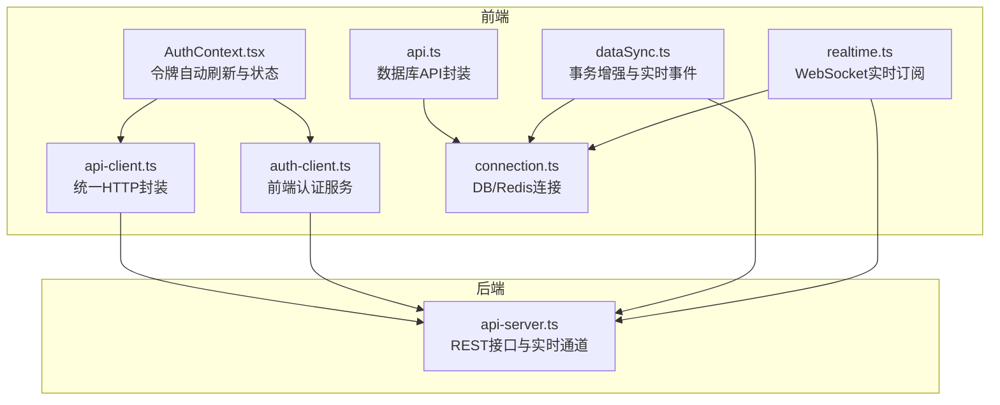
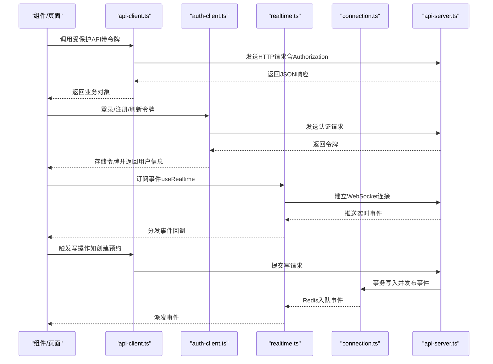
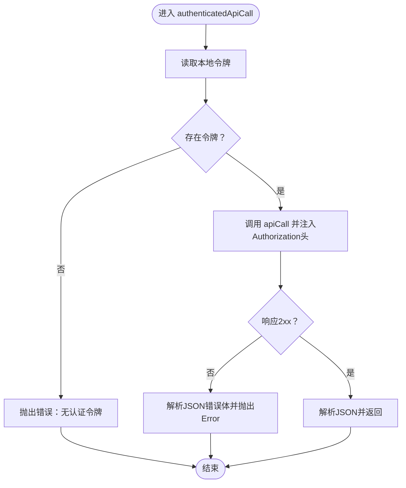
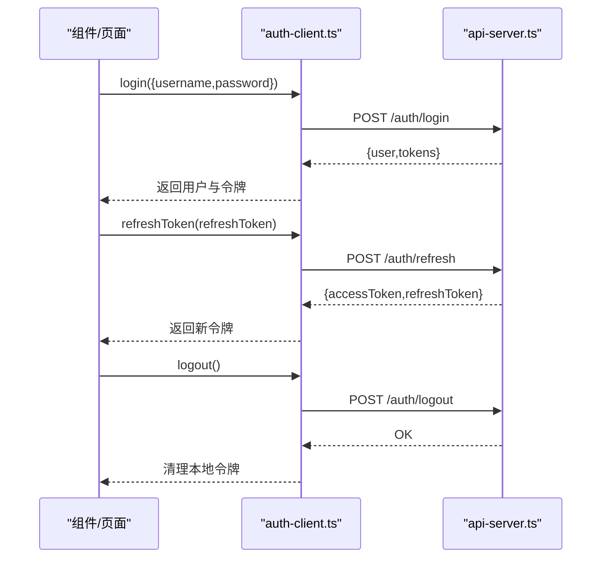
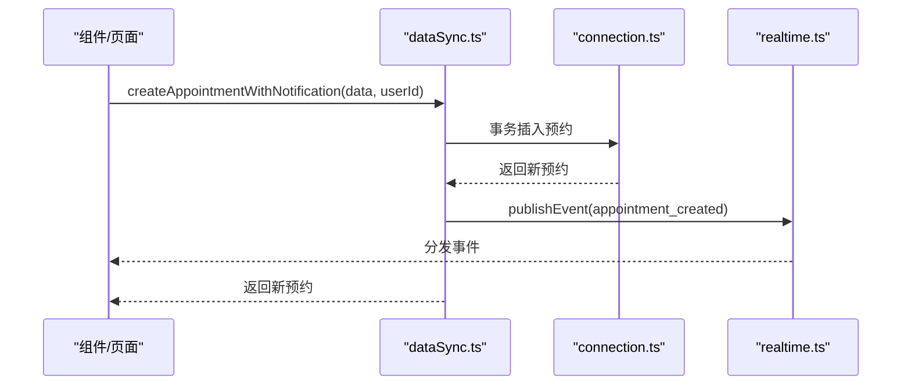
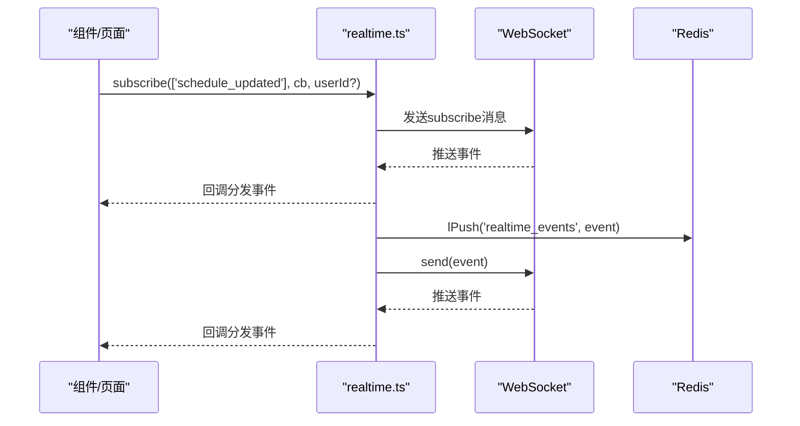
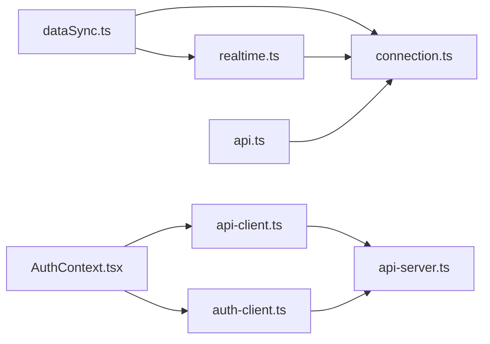

# API客户端

<cite>
**本文引用的文件**
- [api-client.ts](file://src/services/api-client.ts)
- [auth-client.ts](file://src/services/auth-client.ts)
- [dataSync.ts](file://src/services/dataSync.ts)
- [realtime.ts](file://src/services/realtime.ts)
- [api.ts](file://src/services/api.ts)
- [auth.ts](file://src/services/auth.ts)
- [types.ts](file://src/types/types.ts)
- [AuthContext.tsx](file://src/contexts/AuthContext.tsx)
- [connection.ts](file://src/db/connection.ts)
- [api-server.ts](file://server/api-server.ts)
</cite>

## 目录
1. [简介](#简介)
2. [项目结构](#项目结构)
3. [核心组件](#核心组件)
4. [架构总览](#架构总览)
5. [详细组件分析](#详细组件分析)
6. [依赖关系分析](#依赖关系分析)
7. [性能考量](#性能考量)
8. [故障排查指南](#故障排查指南)
9. [结论](#结论)
10. [附录](#附录)

## 简介
本文件面向前端开发者，系统化梳理 Bio-Appointment 前端 API 客户端的实现与使用方式，重点覆盖以下方面：
- api-client.ts 如何基于原生 Fetch 实现统一 HTTP 请求封装，包括请求/响应处理、错误处理与本地令牌存储。
- auth-client.ts 在用户登录、注册、登出、密码修改以及令牌刷新中的职责与流程。
- dataSync.ts 的数据库事务增强与实时事件发布，以及离线变更同步能力。
- realtime.ts 如何建立 WebSocket 连接并实现排班变更等事件的实时通知，包含重连与回放策略。
- 各服务的调用示例路径、参数配置、返回类型与异常处理模式。
- 性能优化建议（请求缓存、批量处理）与最佳实践。

## 项目结构
前端服务位于 src/services 下，围绕“客户端 API 封装”“认证服务”“数据同步与实时”三大模块组织；数据库连接与 Redis 缓存由 src/db/connection.ts 提供；后端 API 服务器位于 server/api-server.ts，提供 REST 接口与实时通道。

图表来源
- [api-client.ts](file://src/services/api-client.ts#L1-L381)
- [auth-client.ts](file://src/services/auth-client.ts#L1-L235)
- [dataSync.ts](file://src/services/dataSync.ts#L1-L309)
- [realtime.ts](file://src/services/realtime.ts#L1-L345)
- [api.ts](file://src/services/api.ts#L1-L483)
- [connection.ts](file://src/db/connection.ts#L23-L75)
- [api-server.ts](file://server/api-server.ts#L405-L454)

章节来源
- [api-client.ts](file://src/services/api-client.ts#L1-L381)
- [auth-client.ts](file://src/services/auth-client.ts#L1-L235)
- [dataSync.ts](file://src/services/dataSync.ts#L1-L309)
- [realtime.ts](file://src/services/realtime.ts#L1-L345)
- [api.ts](file://src/services/api.ts#L1-L483)
- [connection.ts](file://src/db/connection.ts#L23-L75)
- [api-server.ts](file://server/api-server.ts#L405-L454)

## 核心组件
- 统一 HTTP 客户端：api-client.ts
  - 基于 fetch 的 apiCall 与 authenticatedApiCall，自动注入 Authorization 头与 Content-Type。
  - 统一错误处理：非 2xx 响应抛出带错误信息的 Error。
  - 令牌存储：localStorage 中读取/写入 bio_appointment_access_token 与 bio_appointment_refresh_token。
  - 导出 clientApi 对象，封装认证、预约、服务、资源、排班、任务执行、仪表盘统计、资源可用性、钉钉配置与同步等 API。
- 前端认证服务：auth-client.ts
  - 登录/注册/登出/改密/刷新令牌。
  - 本地 JWT 解码（支持开发环境 mock token）。
  - 令牌持久化与清理。
- 数据同步与实时：dataSync.ts
  - 事务内创建/更新预约与排班，完成后发布实时事件。
  - 支持按时间戳增量拉取变更，用于离线客户端同步。
  - 批量事件发布与清理过期事件。
- 实时订阅：realtime.ts
  - 单例 RealtimeService，负责 WebSocket 初始化、重连、订阅/退订、事件分发与回放。
  - 通过 Redis 列表作为回放队列，轮询消费并派发事件。
  - 提供 React Hook useRealtime 以便页面组件订阅。
- 数据库 API 封装：api.ts
  - 对 profiles、services、resources、appointments、schedules、task_executions 等表提供 CRUD 与聚合查询。
  - 内部使用 DatabaseHelper 与 query，屏蔽 SQL 细节。
- 类型定义：types.ts
  - 定义用户、角色、状态、预约、排班、任务执行、资源、钉钉同步相关类型与枚举。
- 认证上下文：AuthContext.tsx
  - 自动检测令牌有效期，必要时尝试刷新；刷新失败则清空令牌并重置用户状态。
- 数据库连接：connection.ts
  - 初始化 PostgreSQL 连接池与 Redis 客户端，提供 getPool 与 getRedisClient。

章节来源
- [api-client.ts](file://src/services/api-client.ts#L1-L381)
- [auth-client.ts](file://src/services/auth-client.ts#L1-L235)
- [dataSync.ts](file://src/services/dataSync.ts#L1-L309)
- [realtime.ts](file://src/services/realtime.ts#L1-L345)
- [api.ts](file://src/services/api.ts#L1-L483)
- [types.ts](file://src/types/types.ts#L1-L487)
- [AuthContext.tsx](file://src/contexts/AuthContext.tsx#L89-L248)
- [connection.ts](file://src/db/connection.ts#L23-L75)

## 架构总览
前端通过 api-client.ts 发起 REST 请求，认证流程由 auth-client.ts 与 AuthContext.tsx 协同完成；业务侧（如预约、排班、任务）可直接调用 api-client.ts；复杂写操作采用 dataSync.ts 的事务增强以保证一致性并触发实时事件；实时通知通过 realtime.ts 的 WebSocket 与 Redis 回放实现。

图表来源
- [api-client.ts](file://src/services/api-client.ts#L1-L381)
- [auth-client.ts](file://src/services/auth-client.ts#L1-L235)
- [realtime.ts](file://src/services/realtime.ts#L1-L345)
- [connection.ts](file://src/db/connection.ts#L23-L75)
- [api-server.ts](file://server/api-server.ts#L405-L454)

## 详细组件分析

### 组件A：api-client.ts（统一HTTP客户端）
- 设计要点
  - 统一基地址与 Content-Type，避免重复设置。
  - authenticatedApiCall 自动从 localStorage 读取令牌并注入 Authorization。
  - 非 2xx 响应统一解析 JSON 错误体并抛出 Error，便于上层捕获。
  - 导出 clientApi 对象，涵盖认证、预约、服务、资源、排班、任务执行、仪表盘统计、资源可用性、钉钉配置与同步等方法。
- 关键流程
  - 登录：POST /auth/login，返回用户与令牌。
  - 注销：POST /auth/logout（携带令牌），随后清除本地令牌。
  - 受保护资源：自动附加 Bearer 令牌。
  - 钉钉配置：GET /dingtalk/config 与 POST /dingtalk/config。
  - 钉钉同步：POST /dingtalk/sync，GET /dingtalk/sync/logs。
- 参数与返回
  - 登录：入参为 { username, password }，返回 { user, tokens }。
  - 注销：无返回值，副作用为清除本地令牌。
  - 钉钉配置保存：入参为配置对象（包含 app_key、app_secret、agent_id、corp_id、sync_enabled、auto_sync_enabled、sync_schedule、sync_time、conflict_strategy、selected_departments），返回保存后的配置。
  - 触发同步：入参为 { sync_type?, selected_departments?, conflict_strategy? }，返回同步结果。
  - 同步日志：入参为 { limit?, offset?, status? }，返回日志数组。
- 错误处理
  - 非 2xx 响应抛出 Error，错误信息来自后端 JSON 的 error 字段或默认 HTTP 状态文本。
  - 无令牌时 authenticatedApiCall 抛出错误，需先登录。
- 使用示例（路径）
  - 登录：[login](file://src/services/api-client.ts#L149-L157)
  - 注销：[logout](file://src/services/api-client.ts#L159-L176)
  - 获取预约列表：[getAppointments](file://src/services/api-client.ts#L179-L189)
  - 创建预约：[createAppointment](file://src/services/api-client.ts#L192-L204)
  - 更新排班：[updateSchedule](file://src/services/api-client.ts#L309-L319)
  - 获取资源可用性：[getResourceAvailability](file://src/services/api-client.ts#L288-L291)
  - 钉钉配置保存：[saveDingTalkConfig](file://src/services/api-client.ts#L348-L352)
  - 触发同步：[triggerSync](file://src/services/api-client.ts#L360-L364)
  - 获取同步日志：[getSyncLogs](file://src/services/api-client.ts#L366-L378)

图表来源
- [api-client.ts](file://src/services/api-client.ts#L1-L42)

章节来源
- [api-client.ts](file://src/services/api-client.ts#L1-L381)

### 组件B：auth-client.ts（前端认证服务）
- 设计要点
  - 前端 JWT 解码（支持开发环境 mock token）。
  - 登录/注册/刷新令牌/登出/改密均通过 fetch 调用后端接口。
  - 令牌持久化到 localStorage，提供 clearTokens 清理。
- 关键流程
  - 登录：POST /auth/login，返回 { user, tokens }。
  - 注册：POST /auth/register，返回新用户。
  - 刷新令牌：POST /auth/refresh，传入 refreshToken。
  - 获取用户：GET /profiles/{id}，需要 Authorization。
  - 修改密码：POST /auth/change-password，需要 Authorization。
  - 登出：POST /auth/logout，需要 Authorization。
- 参数与返回
  - 登录：入参 { username, password }，返回 { user, tokens }。
  - 注册：入参 { username, password, full_name?, email? }，返回用户。
  - 刷新：入参 { refreshToken }，返回新令牌。
  - 获取用户：入参 userId，返回用户或 null。
  - 修改密码：入参 { userId, currentPassword, newPassword }。
  - 登出：无返回值。
- 错误处理
  - 非 2xx 响应抛出 Error，错误信息来自后端 JSON 的 message 字段或默认提示。
  - 401 时 getUserById 返回 null 或抛出错误，视后端行为而定。
- 使用示例（路径）
  - 登录：[login](file://src/services/auth-client.ts#L60-L81)
  - 注册：[register](file://src/services/auth-client.ts#L84-L109)
  - 刷新令牌：[refreshToken](file://src/services/auth-client.ts#L112-L126)
  - 获取用户：[getUserById](file://src/services/auth-client.ts#L129-L153)
  - 修改密码：[changePassword](file://src/services/auth-client.ts#L156-L179)
  - 登出：[logout](file://src/services/auth-client.ts#L214-L231)

图表来源
- [auth-client.ts](file://src/services/auth-client.ts#L60-L126)
- [api-server.ts](file://server/api-server.ts#L405-L454)

章节来源
- [auth-client.ts](file://src/services/auth-client.ts#L1-L235)
- [AuthContext.tsx](file://src/contexts/AuthContext.tsx#L89-L248)

### 组件C：dataSync.ts（事务增强与实时事件）
- 设计要点
  - 通过事务封装写操作，确保一致性后再发布实时事件。
  - 提供多种通知方法：预约创建/更新、排班创建/更新、任务状态变更、用户资料变更。
  - 支持按时间戳增量拉取变更，用于离线客户端同步。
  - 支持批量事件发布与清理过期事件。
- 关键流程
  - createAppointmentWithNotification：插入预约并发布 appointment_created 事件。
  - updateScheduleWithNotification：更新排班并发布 schedule_updated 事件。
  - updateTaskExecutionWithNotification：更新任务并发布 task_updated 事件（仅当 status 变更时）。
  - getChangesSince：按表与时间戳增量拉取变更。
  - syncOfflineChanges：组合三类表的增量结果。
  - notifyBatchChanges：顺序发布多个事件。
  - cleanupOldEvents：预留清理 Redis 事件的入口。
- 参数与返回
  - createAppointmentWithNotification：入参 appointmentData 与 userId，返回新预约。
  - updateScheduleWithNotification：入参 scheduleId、updates、userId，返回更新后的排班。
  - updateTaskExecutionWithNotification：入参 taskExecutionId、updates、userId，返回更新后的任务。
  - getChangesSince：入参 table、sinceTimestamp、userId，返回 rows。
  - syncOfflineChanges：入参 lastSyncTimestamp、userId，返回 { changes, timestamp }。
  - notifyBatchChanges：入参 events 数组。
  - cleanupOldEvents：入参 olderThanHours。
- 错误处理
  - 未找到记录时抛出 Error。
  - 事务中任一步失败会回滚并抛出错误。
- 使用示例（路径）
  - 创建预约并通知：[createAppointmentWithNotification](file://src/services/dataSync.ts#L107-L154)
  - 更新排班并通知：[updateScheduleWithNotification](file://src/services/dataSync.ts#L159-L194)
  - 更新任务并通知：[updateTaskExecutionWithNotification](file://src/services/dataSync.ts#L199-L236)
  - 拉取增量变更：[getChangesSince](file://src/services/dataSync.ts#L241-L258)
  - 离线同步：[syncOfflineChanges](file://src/services/dataSync.ts#L263-L278)
  - 批量通知：[notifyBatchChanges](file://src/services/dataSync.ts#L283-L287)
  - 清理过期事件：[cleanupOldEvents](file://src/services/dataSync.ts#L292-L306)

图表来源
- [dataSync.ts](file://src/services/dataSync.ts#L107-L154)
- [realtime.ts](file://src/services/realtime.ts#L258-L281)

章节来源
- [dataSync.ts](file://src/services/dataSync.ts#L1-L309)

### 组件D：realtime.ts（WebSocket实时订阅）
- 设计要点
  - 单例 RealtimeService，内部维护订阅集合与 WebSocket 连接。
  - 初始化时根据当前协议选择 ws/wss，连接后自动 resubscribe。
  - 重连策略：指数退避，最多尝试固定次数。
  - 回放机制：通过 Redis 列表存储事件，轮询消费并派发。
  - 提供 subscribe/unsubscribe 与 React Hook useRealtime。
- 关键流程
  - initializeWebSocket：建立连接、处理 open/message/close/error。
  - attemptReconnect：指数退避重连。
  - setupDatabaseListeners：尝试 LISTEN，失败则启动轮询。
  - startChangePolling：每 5 秒轮询 Redis 队列。
  - handleRealtimeEvent：匹配订阅并回调。
  - publishEvent：写入 Redis 并通过 WebSocket 推送。
- 参数与返回
  - subscribe(eventTypes, callback, userId?)：返回 subscriptionId。
  - unsubscribe(subscriptionId)：移除订阅。
  - getConnectionStatus()：返回 'connected' | 'connecting' | 'disconnected'。
  - useRealtime(eventTypes, callback, userId?)：React Hook，自动订阅与清理。
- 错误处理
  - 连接失败/解析失败/回调异常均有日志输出。
  - 轮询过程中忽略单条事件解析错误，继续处理后续事件。
- 使用示例（路径）
  - 订阅事件：[subscribe](file://src/services/realtime.ts#L195-L222)
  - 退订事件：[unsubscribe](file://src/services/realtime.ts#L227-L237)
  - 发布事件：[publishEvent](file://src/services/realtime.ts#L258-L281)
  - 轮询回放：[startChangePolling](file://src/services/realtime.ts#L140-L171)
  - React Hook：[useRealtime](file://src/services/realtime.ts#L309-L332)

图表来源
- [realtime.ts](file://src/services/realtime.ts#L195-L281)
- [connection.ts](file://src/db/connection.ts#L23-L75)

章节来源
- [realtime.ts](file://src/services/realtime.ts#L1-L345)
- [connection.ts](file://src/db/connection.ts#L23-L75)

### 组件E：api.ts（数据库API封装）
- 设计要点
  - 对 profiles、services、resources、appointments、schedules、task_executions 提供 CRUD 与聚合查询。
  - 动态构建 WHERE 条件与排序，支持复杂过滤。
  - 聚合查询使用 Promise.all 并行执行，提升性能。
- 关键流程
  - getAppointments：动态拼接条件，支持客户名、状态、医生/销售、日期范围等。
  - getSchedules：支持房间、护士、状态、日期范围等。
  - getTaskExecutions：支持按排班、护士、状态、日期等。
  - getResourceAvailability：并行查询可用房间与护士。
  - getDashboardStats：并行查询多项统计指标。
- 参数与返回
  - getAppointments(filters)：filters 为对象，返回预约数组。
  - getSchedules(filters)：filters 为对象，返回排班数组（含关联字段）。
  - getTaskExecutions(filters)：filters 为对象，返回任务执行数组（含关联字段）。
  - getResourceAvailability(date, time_start, time_end)：返回 { available_rooms, available_nurses }。
  - getDashboardStats(date)：返回统计对象。
- 使用示例（路径）
  - 获取预约列表：[getAppointments](file://src/services/api.ts#L151-L215)
  - 获取排班列表：[getSchedules](file://src/services/api.ts#L240-L303)
  - 获取任务执行列表：[getTaskExecutions](file://src/services/api.ts#L328-L377)
  - 资源可用性：[getResourceAvailability](file://src/services/api.ts#L400-L452)
  - 仪表盘统计：[getDashboardStats](file://src/services/api.ts#L455-L480)

章节来源
- [api.ts](file://src/services/api.ts#L1-L483)

### 组件F：AuthContext.tsx（令牌自动刷新与状态）
- 设计要点
  - 登录成功后存储令牌并设置用户状态。
  - 令牌过期时尝试刷新，若刷新失败则清空令牌并重置用户状态。
  - 支持修改密码与登出。
- 关键流程
  - 登录：调用 ClientAuthService.login，存储令牌并获取用户资料。
  - 刷新：verifyToken 后调用 refreshToken，存储新令牌并重新获取用户资料。
  - 登出：clearTokens，调用后端 logout，重置状态。
- 使用示例（路径）
  - 登录：[login](file://src/contexts/AuthContext.tsx#L160-L176)
  - 刷新与登出：[logout](file://src/contexts/AuthContext.tsx#L178-L192)
  - 自动刷新：[checkTokenExpiry](file://src/contexts/AuthContext.tsx#L233-L260)

章节来源
- [AuthContext.tsx](file://src/contexts/AuthContext.tsx#L89-L248)

## 依赖关系分析
- 组件耦合
  - api-client.ts 依赖 localStorage 与 fetch，导出 clientApi。
  - auth-client.ts 依赖 api-client.ts 的基础请求封装与后端认证接口。
  - dataSync.ts 依赖 connection.ts 的事务与 Redis 客户端，依赖 realtime.ts 发布事件。
  - realtime.ts 依赖 connection.ts 的 Redis 客户端，内部维护 WebSocket。
  - api.ts 依赖 connection.ts 的 query 与 DatabaseHelper。
  - AuthContext.tsx 依赖 auth-client.ts 与 api-client.ts。
- 外部依赖
  - 后端 api-server.ts 提供 REST 与实时接口。
  - Redis 用于事件回放与过期控制。
- 循环依赖
  - 当前文件间未见循环导入；realtime.ts 与 dataSync.ts 通过 publishEvent 间接交互，属于单向依赖。

图表来源
- [api-client.ts](file://src/services/api-client.ts#L1-L381)
- [auth-client.ts](file://src/services/auth-client.ts#L1-L235)
- [dataSync.ts](file://src/services/dataSync.ts#L1-L309)
- [realtime.ts](file://src/services/realtime.ts#L1-L345)
- [api.ts](file://src/services/api.ts#L1-L483)
- [connection.ts](file://src/db/connection.ts#L23-L75)
- [api-server.ts](file://server/api-server.ts#L405-L454)

章节来源
- [api-client.ts](file://src/services/api-client.ts#L1-L381)
- [auth-client.ts](file://src/services/auth-client.ts#L1-L235)
- [dataSync.ts](file://src/services/dataSync.ts#L1-L309)
- [realtime.ts](file://src/services/realtime.ts#L1-L345)
- [api.ts](file://src/services/api.ts#L1-L483)
- [connection.ts](file://src/db/connection.ts#L23-L75)
- [api-server.ts](file://server/api-server.ts#L405-L454)

## 性能考量
- 请求缓存
  - 可在 api-client.ts 层引入内存缓存（Map）或 localStorage 缓存，对 GET 请求进行去重与缓存，设置 TTL。
  - 对高频读取的静态数据（如服务列表、资源列表）可启用缓存。
- 批量处理
  - 对多条写操作（如批量创建任务）可合并为事务，减少往返与锁竞争。
  - 批量事件发布（notifyBatchChanges）可降低实时推送开销。
- 轮询与长连接
  - realtime.ts 的轮询间隔为 5 秒，可根据业务压力调整；在高并发场景下优先使用 WebSocket。
- 并行查询
  - api.ts 的并行查询（Promise.all）已有效利用网络与数据库资源，建议保持。
- 令牌刷新
  - AuthContext.tsx 在接近过期时自动刷新，避免频繁 401 导致的重试风暴。

[本节为通用指导，无需列出章节来源]

## 故障排查指南
- 认证相关
  - 无令牌：authenticatedApiCall 会抛出错误，需先登录。
  - 令牌过期：AuthContext.tsx 会尝试刷新，若失败需重新登录。
  - 登录失败：auth-client.ts 会在非 2xx 时抛出错误，查看后端返回的 message。
- 实时订阅
  - WebSocket 连接断开：realtime.ts 会指数退避重连，观察控制台日志。
  - 事件未到达：确认订阅事件类型与 userId 是否匹配；检查 Redis 队列是否被消费。
- 数据同步
  - 事务失败：dataSync.ts 会在任一步失败时回滚并抛错，检查输入参数与约束。
  - 离线同步：syncOfflineChanges 返回的 changes 为空可能表示无增量或时间戳未更新。
- 后端接口
  - 400 缺少参数：检查必填参数（如 date、time_start、time_end）。
  - 500 服务器错误：查看后端日志与数据库连接状态。

章节来源
- [api-client.ts](file://src/services/api-client.ts#L1-L42)
- [auth-client.ts](file://src/services/auth-client.ts#L60-L126)
- [realtime.ts](file://src/services/realtime.ts#L140-L171)
- [dataSync.ts](file://src/services/dataSync.ts#L107-L154)
- [AuthContext.tsx](file://src/contexts/AuthContext.tsx#L89-L248)

## 结论
本项目前端 API 客户端以简洁的 fetch 封装为基础，结合前端认证服务、事务增强的数据同步与 WebSocket 实时订阅，形成了稳定可靠的前后端交互体系。通过合理的错误处理、重连与回放机制，以及对性能的优化建议，可在复杂业务场景下保持良好的用户体验与系统稳定性。

[本节为总结性内容，无需列出章节来源]

## 附录
- 类型定义概览（部分）
  - 用户角色与状态：UserRole、UserStatus、AppointmentStatus、ScheduleStatus、TaskExecutionStatus。
  - 预约、排班、任务执行、资源等实体类型。
  - 钉钉同步类型：SyncType、ConflictStrategy、DingTalkSyncConfig、DingTalkSyncLogV2、DingTalkUser、DingTalkDepartment。
- 调用示例路径（摘要）
  - 登录：[login](file://src/services/api-client.ts#L149-L157)
  - 注册：[register](file://src/services/auth-client.ts#L84-L109)
  - 刷新令牌：[refreshToken](file://src/services/auth-client.ts#L112-L126)
  - 获取预约列表：[getAppointments](file://src/services/api-client.ts#L179-L189)
  - 创建排班：[createSchedule](file://src/services/api-client.ts#L294-L307)
  - 更新任务：[updateTaskExecution](file://src/services/api-client.ts#L252-L257)
  - 获取资源可用性：[getResourceAvailability](file://src/services/api-client.ts#L288-L291)
  - 钉钉配置保存：[saveDingTalkConfig](file://src/services/api-client.ts#L348-L352)
  - 触发同步：[triggerSync](file://src/services/api-client.ts#L360-L364)
  - 获取同步日志：[getSyncLogs](file://src/services/api-client.ts#L366-L378)
  - 订阅事件：[subscribe](file://src/services/realtime.ts#L195-L222)
  - 发布事件：[publishEvent](file://src/services/realtime.ts#L258-L281)
  - 创建预约并通知：[createAppointmentWithNotification](file://src/services/dataSync.ts#L107-L154)
  - 更新排班并通知：[updateScheduleWithNotification](file://src/services/dataSync.ts#L159-L194)
  - 更新任务并通知：[updateTaskExecutionWithNotification](file://src/services/dataSync.ts#L199-L236)
  - 拉取增量变更：[getChangesSince](file://src/services/dataSync.ts#L241-L258)
  - 离线同步：[syncOfflineChanges](file://src/services/dataSync.ts#L263-L278)

章节来源
- [types.ts](file://src/types/types.ts#L1-L487)
- [api-client.ts](file://src/services/api-client.ts#L149-L381)
- [auth-client.ts](file://src/services/auth-client.ts#L60-L231)
- [realtime.ts](file://src/services/realtime.ts#L195-L345)
- [dataSync.ts](file://src/services/dataSync.ts#L107-L309)