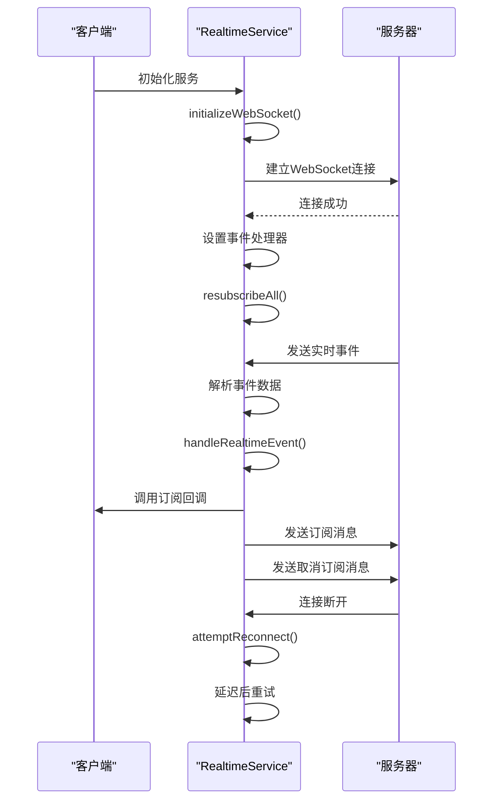
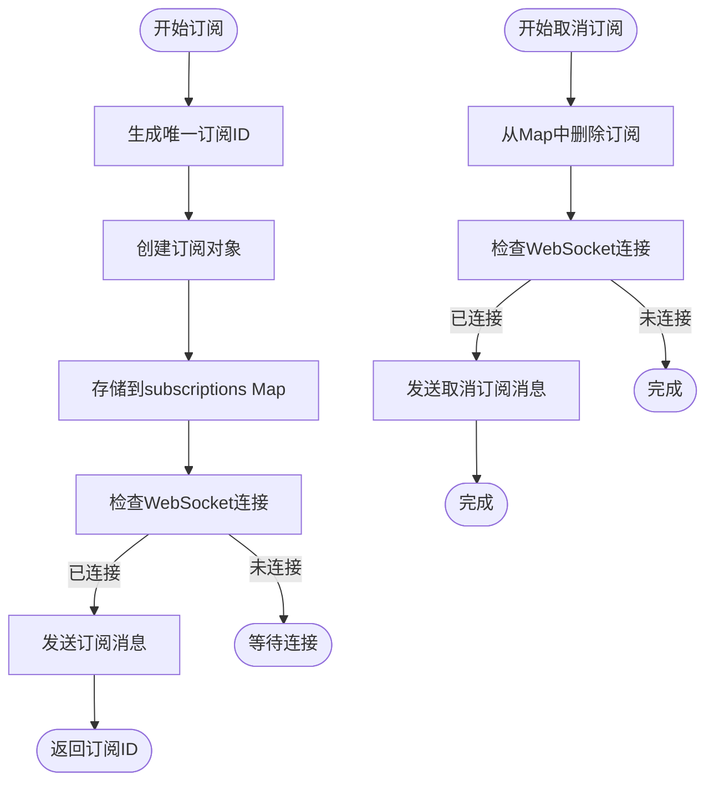
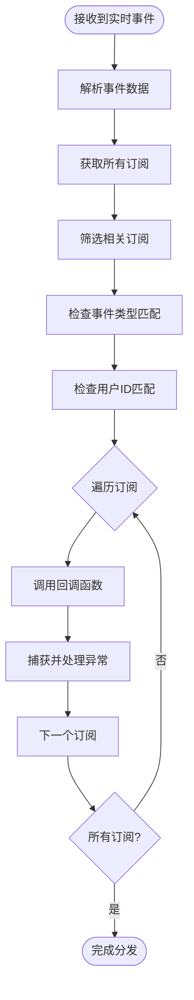
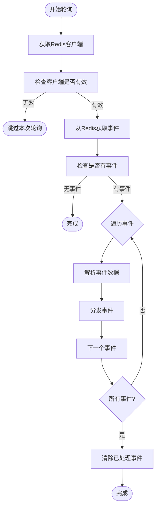
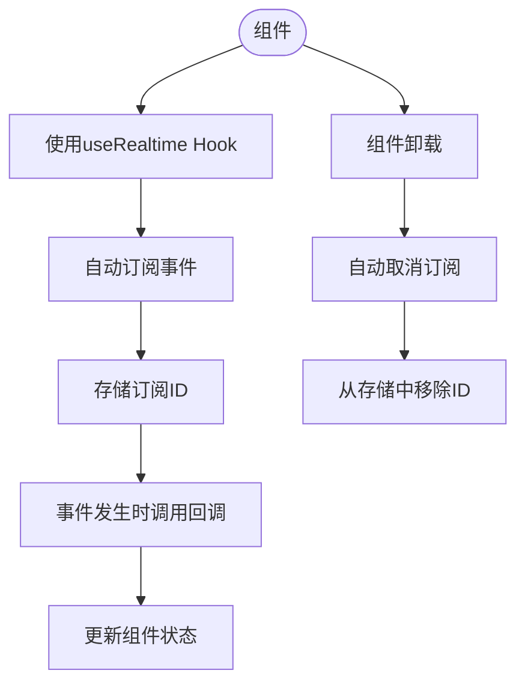

# 实时服务

<cite>
**本文档引用的文件**   
- [realtime.ts](file://src/services/realtime.ts#L1-L345)
- [connection.ts](file://src/db/connection.ts#L23-L75)
- [dataSync.ts](file://src/services/dataSync.ts#L55-L102)
</cite>

## 目录
1. [简介](#简介)
2. [实时通信机制](#实时通信机制)
3. [事件订阅管理](#事件订阅管理)
4. [事件分发逻辑](#事件分发逻辑)
5. [降级方案](#降级方案)
6. [React Hook 使用示例](#react-hook-使用示例)
7. [结论](#结论)

## 简介
Bio-Appointment系统的实时服务提供了一个基于WebSocket的实时通信机制，用于在客户端和服务器之间同步数据变更。该服务通过RealtimeService类实现，支持预约变更、排班更新、任务状态更新等多种实时事件的推送。当WebSocket不可用时，系统会自动降级到基于Redis的轮询机制，确保实时功能的可靠性。

**Section sources**
- [realtime.ts](file://src/services/realtime.ts#L1-L345)

## 实时通信机制
RealtimeService类实现了基于WebSocket的实时通信机制，包括连接管理、重连策略和消息收发流程。服务在初始化时会自动建立WebSocket连接，并在连接断开时尝试重新连接。

连接管理通过`initializeWebSocket`方法实现，该方法会检查当前连接状态，避免重复连接。连接成功后，会触发`resubscribeAll`方法，重新订阅所有事件，确保客户端不会错过任何消息。

重连策略采用指数退避算法，最大重连次数为5次。每次重连的延迟时间会逐渐增加，从1秒开始，每次乘以2。这种策略可以避免在网络不稳定时频繁重连，减轻服务器压力。

消息收发流程包括消息接收和发送两个方向。接收消息时，服务会解析WebSocket消息，将其转换为RealtimeEvent对象，然后分发给相应的订阅者。发送消息时，服务会将事件通过WebSocket发送给服务器，同时存储到Redis中作为备份。

**Diagram sources **
- [realtime.ts](file://src/services/realtime.ts#L46-L90)
- [realtime.ts](file://src/services/realtime.ts#L104-L118)

**Section sources**
- [realtime.ts](file://src/services/realtime.ts#L46-L118)

## 事件订阅管理
RealtimeService类提供了`subscribe`和`unsubscribe`方法来管理事件订阅。这些方法允许客户端订阅特定类型的实时事件，并在不需要时取消订阅。

`subscribe`方法接受事件类型数组、回调函数和可选的用户ID作为参数。它会创建一个唯一的订阅ID，将订阅信息存储在内部的Map中，并在WebSocket连接可用时向服务器发送订阅消息。订阅支持按事件类型和用户ID进行过滤，确保客户端只接收到相关的事件。

`unsubscribe`方法接受订阅ID作为参数，从内部存储中删除对应的订阅，并在WebSocket连接可用时向服务器发送取消订阅消息。这种方法可以有效管理客户端的内存使用，避免不必要的事件处理。

**Diagram sources **
- [realtime.ts](file://src/services/realtime.ts#L195-L237)

**Section sources**
- [realtime.ts](file://src/services/realtime.ts#L195-L237)

## 事件分发逻辑
`handleRealtimeEvent`方法负责处理接收到的实时事件，并将其分发给相应的订阅者。该方法会根据事件类型和用户ID筛选出相关的订阅，然后调用每个订阅的回调函数。

事件分发逻辑首先获取所有订阅，然后通过过滤器找出与当前事件匹配的订阅。匹配条件包括事件类型匹配和用户ID匹配（如果订阅指定了用户ID）。对于每个匹配的订阅，服务会调用其回调函数，并捕获可能的异常，避免一个订阅的错误影响其他订阅。

这种设计模式实现了发布-订阅模式，解耦了事件发布者和订阅者，使得系统更加灵活和可扩展。不同的组件可以独立地订阅感兴趣的事件，而不需要知道事件的来源。

**Diagram sources **
- [realtime.ts](file://src/services/realtime.ts#L176-L189)

**Section sources**
- [realtime.ts](file://src/services/realtime.ts#L176-L189)

## 降级方案
当WebSocket连接不可用时，RealtimeService会自动降级到基于Redis的轮询机制。`startChangePolling`方法实现了这一降级方案，它会定期从Redis中拉取事件并处理。

轮询机制每5秒执行一次，从Redis的`realtime_events`列表中获取所有事件。获取到事件后，服务会逐个解析并分发给订阅者，然后从列表中移除已处理的事件。为了防止事件积压，Redis列表设置了24小时的过期时间。

这种降级方案确保了即使在WebSocket不可用的情况下，客户端仍然能够接收到实时事件，只是有一定的延迟。系统会优先使用WebSocket，只有在连接失败时才会启用轮询，从而在性能和可靠性之间取得平衡。

**Diagram sources **
- [realtime.ts](file://src/services/realtime.ts#L140-L171)
- [connection.ts](file://src/db/connection.ts#L73-L75)

**Section sources**
- [realtime.ts](file://src/services/realtime.ts#L140-L171)

## React Hook 使用示例
`useRealtime`是一个React Hook，用于在函数组件中方便地使用实时服务。它封装了订阅和取消订阅的逻辑，确保在组件卸载时自动清理订阅，避免内存泄漏。

使用示例展示了如何在组件中监听预约变更和排班更新等实时事件。通过传入事件类型数组和回调函数，组件可以订阅感兴趣的事件。Hook会返回当前的连接状态，便于显示连接状态指示器。

**Diagram sources **
- [realtime.ts](file://src/services/realtime.ts#L311-L328)

**Section sources**
- [realtime.ts](file://src/services/realtime.ts#L311-L328)

## 结论
Bio-Appointment的实时服务通过WebSocket和Redis轮询的组合方案，实现了可靠的实时通信机制。服务提供了完整的连接管理、重连策略和事件分发功能，确保客户端能够及时收到数据变更通知。通过`useRealtime` Hook，开发者可以方便地在React组件中集成实时功能，提升用户体验。