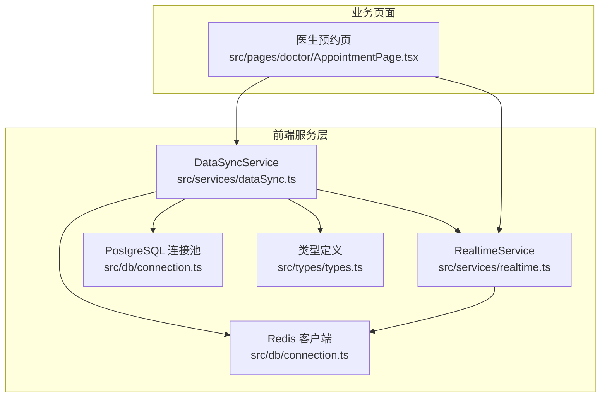
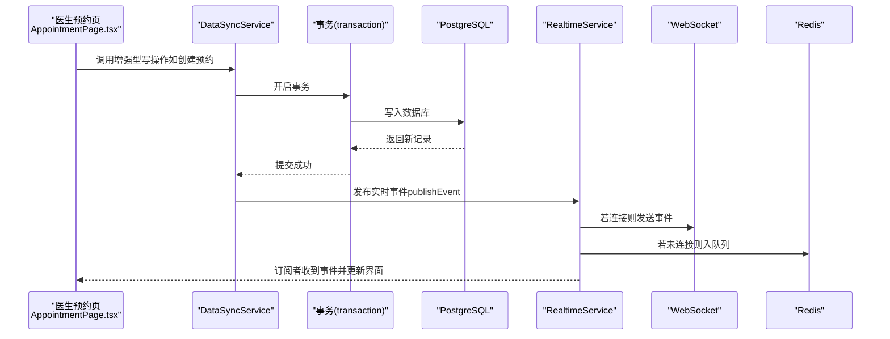
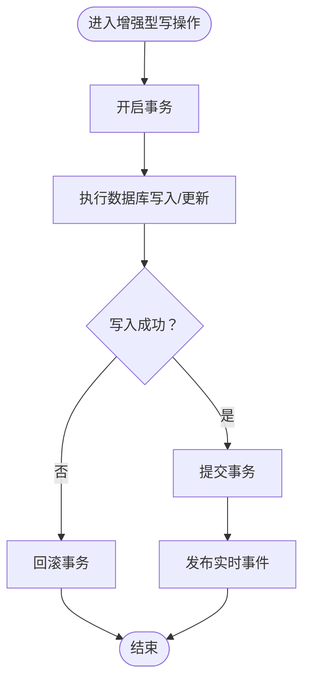
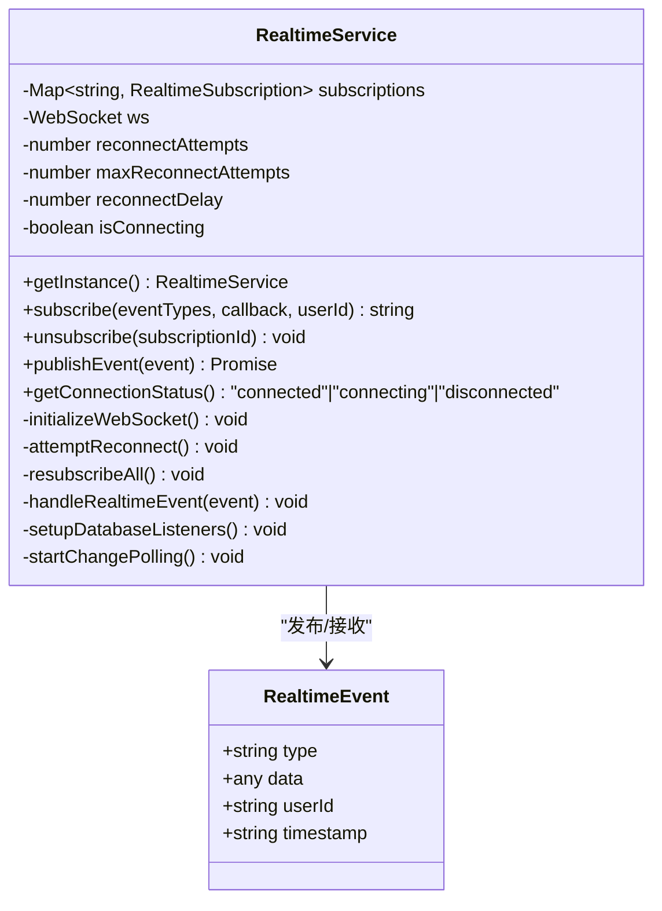
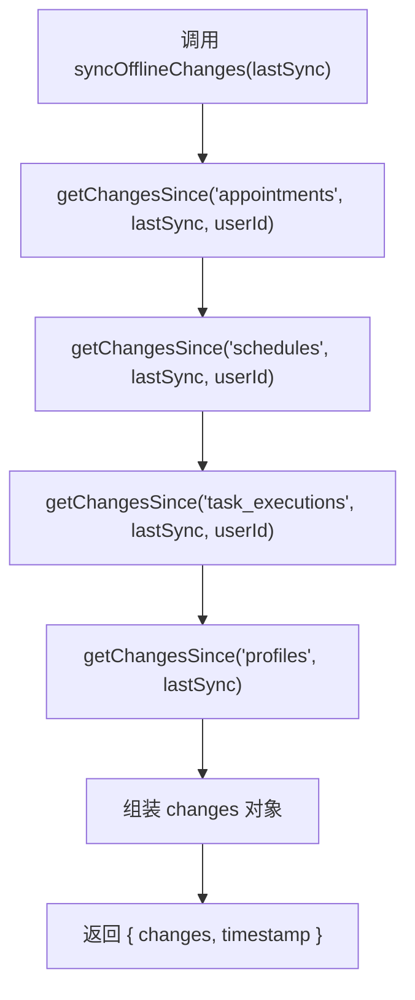
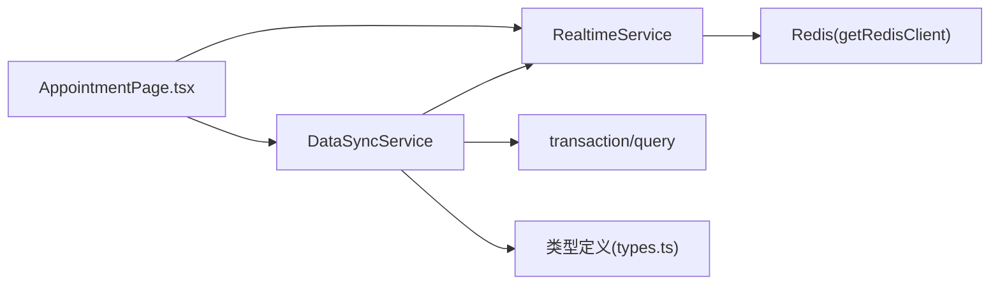

# 数据同步服务

<cite>
**本文引用的文件**
- [dataSync.ts](file://src/services/dataSync.ts)
- [realtime.ts](file://src/services/realtime.ts)
- [connection.ts](file://src/db/connection.ts)
- [types.ts](file://src/types/types.ts)
- [AppointmentPage.tsx](file://src/pages/doctor/AppointmentPage.tsx)
</cite>

## 目录
1. [简介](#简介)
2. [项目结构](#项目结构)
3. [核心组件](#核心组件)
4. [架构总览](#架构总览)
5. [详细组件分析](#详细组件分析)
6. [依赖关系分析](#依赖关系分析)
7. [性能考量](#性能考量)
8. [故障排查指南](#故障排查指南)
9. [结论](#结论)
10. [附录](#附录)

## 简介
本文件面向Bio-Appointment系统的“数据同步服务”，聚焦于DataSyncService类中实时通知方法（如notifyAppointmentChange、notifyScheduleChange）的实现机制，以及增强型数据操作方法（如createAppointmentWithNotification、updateScheduleWithNotification）如何结合事务处理与实时通知。同时阐述离线数据同步场景下getChangesSince、syncOfflineChanges的使用逻辑，并给出与realtimeService集成的代码示例，展示数据变更事件的发布与处理流程。

## 项目结构
围绕数据同步服务的关键文件组织如下：
- 实时服务：src/services/realtime.ts
- 数据同步服务：src/services/dataSync.ts
- 数据库连接与事务：src/db/connection.ts
- 类型定义：src/types/types.ts
- 使用示例页面：src/pages/doctor/AppointmentPage.tsx

图表来源
- [dataSync.ts](file://src/services/dataSync.ts#L1-L309)
- [realtime.ts](file://src/services/realtime.ts#L1-L345)
- [connection.ts](file://src/db/connection.ts#L1-L166)
- [types.ts](file://src/types/types.ts#L1-L233)
- [AppointmentPage.tsx](file://src/pages/doctor/AppointmentPage.tsx#L1-L395)

章节来源
- [dataSync.ts](file://src/services/dataSync.ts#L1-L309)
- [realtime.ts](file://src/services/realtime.ts#L1-L345)
- [connection.ts](file://src/db/connection.ts#L1-L166)
- [types.ts](file://src/types/types.ts#L1-L233)
- [AppointmentPage.tsx](file://src/pages/doctor/AppointmentPage.tsx#L1-L395)

## 核心组件
- DataSyncService：封装实时通知与增强型数据操作，确保数据库事务与事件发布的原子性。
- RealtimeService：负责事件发布、订阅、WebSocket连接与重连、Redis回退轮询。
- DatabaseHelper/transaction：提供事务封装，保证写入与通知的一致性。
- 类型定义：统一事件类型、实体模型，便于前后端契约一致。

章节来源
- [dataSync.ts](file://src/services/dataSync.ts#L1-L309)
- [realtime.ts](file://src/services/realtime.ts#L1-L345)
- [connection.ts](file://src/db/connection.ts#L77-L114)
- [types.ts](file://src/types/types.ts#L1-L233)

## 架构总览
数据同步采用“事务内写入+事件发布”的模式，优先通过WebSocket推送，回退到Redis队列轮询，最终由订阅者消费并更新UI。

图表来源
- [dataSync.ts](file://src/services/dataSync.ts#L104-L154)
- [realtime.ts](file://src/services/realtime.ts#L255-L281)
- [connection.ts](file://src/db/connection.ts#L77-L114)
- [AppointmentPage.tsx](file://src/pages/doctor/AppointmentPage.tsx#L1-L395)

## 详细组件分析

### DataSyncService 实时通知与增强型操作
- notifyAppointmentChange / notifyScheduleChange
  - 作用：根据变更类型生成事件，填充数据与时间戳，调用realtimeService.publishEvent进行发布。
  - 关键点：事件类型命名规范（appointment_* / schedule_*），携带userId与业务数据快照。
- createAppointmentWithNotification
  - 作用：在事务内插入预约记录，成功后触发“created”事件。
  - 关键点：参数化SQL，返回新记录；事务失败自动回滚，不会产生半写事件。
- updateScheduleWithNotification
  - 作用：动态构建SET子句，更新排班并触发“updated”事件。
  - 关键点：未找到记录时抛错；仅在更新成功后发布事件。
- notifyTaskChange / notifyUserChange
  - 作用：分别针对任务执行与用户资料变更发布事件。
- notifyBatchChanges
  - 作用：批量发布多个事件，逐个调用publishEvent。
- getChangesSince / syncOfflineChanges
  - 作用：按updated_at过滤增量数据；聚合多表增量并返回时间戳，供离线客户端拉取。

图表来源
- [dataSync.ts](file://src/services/dataSync.ts#L104-L194)
- [connection.ts](file://src/db/connection.ts#L96-L114)

章节来源
- [dataSync.ts](file://src/services/dataSync.ts#L1-L309)

### RealtimeService 事件发布与订阅
- 事件模型：RealtimeEvent接口定义了type、data、userId、timestamp。
- 发布策略：优先通过WebSocket发送；若未连接，则将事件序列化后写入Redis队列，供轮询消费。
- 订阅管理：subscribe/unsubscribe维护订阅集合；连接恢复后重发订阅消息。
- 连接与重连：初始化WebSocket，onclose触发指数退避重连；提供getConnectionStatus用于UI反馈。
- 回退机制：setupDatabaseListeners尝试LISTEN，失败则启动每5秒轮询Redis队列的定时器。

图表来源
- [realtime.ts](file://src/services/realtime.ts#L1-L345)

章节来源
- [realtime.ts](file://src/services/realtime.ts#L1-L345)

### 离线数据同步 getChangesSince / syncOfflineChanges
- getChangesSince(table, sinceTimestamp, userId?)
  - 作用：按updated_at > sinceTimestamp筛选增量记录，支持按用户过滤（created_by或updated_by）。
  - 限制：默认最多100条，避免一次性拉取过多数据。
- syncOfflineChanges(lastSyncTimestamp, userId?)
  - 作用：聚合多表增量（appointments、schedules、task_executions、profiles），返回changes与当前时间戳。
  - 应用：离线客户端定期拉取增量，合并本地缓存，最后更新lastSyncTimestamp。

图表来源
- [dataSync.ts](file://src/services/dataSync.ts#L238-L278)

章节来源
- [dataSync.ts](file://src/services/dataSync.ts#L238-L278)

### 与realtimeService集成的代码示例
以下为在业务页面中订阅与处理事件的典型流程（路径引用，不直接展示代码内容）：
- 订阅事件
  - 在组件挂载时调用订阅函数，传入事件类型数组与回调。
  - 参考路径：[useRealtime订阅钩子](file://src/services/realtime.ts#L309-L331)
- 处理事件
  - 在回调中根据event.type分派到对应UI更新逻辑。
  - 参考路径：[RealtimeEvents常量](file://src/services/realtime.ts#L333-L344)
- 页面侧使用
  - 医生预约页通过周期性拉取与事件订阅共同保障数据一致性。
  - 参考路径：[医生预约页](file://src/pages/doctor/AppointmentPage.tsx#L1-L395)

章节来源
- [realtime.ts](file://src/services/realtime.ts#L309-L344)
- [AppointmentPage.tsx](file://src/pages/doctor/AppointmentPage.tsx#L1-L395)

## 依赖关系分析
- DataSyncService依赖
  - realtimeService：事件发布入口。
  - transaction/query：事务与查询封装，保证写入与通知的原子性。
  - 类型定义：约束事件与实体字段。
- RealtimeService依赖
  - getRedisClient：Redis队列回退。
  - WebSocket：实时推送。
  - 类型定义：事件结构约束。
- 页面依赖
  - DataSyncService：用于增强写操作并触发实时通知。
  - RealtimeService：用于订阅事件并更新UI。

图表来源
- [dataSync.ts](file://src/services/dataSync.ts#L1-L309)
- [realtime.ts](file://src/services/realtime.ts#L1-L345)
- [connection.ts](file://src/db/connection.ts#L1-L166)
- [types.ts](file://src/types/types.ts#L1-L233)
- [AppointmentPage.tsx](file://src/pages/doctor/AppointmentPage.tsx#L1-L395)

章节来源
- [dataSync.ts](file://src/services/dataSync.ts#L1-L309)
- [realtime.ts](file://src/services/realtime.ts#L1-L345)
- [connection.ts](file://src/db/connection.ts#L1-L166)
- [types.ts](file://src/types/types.ts#L1-L233)
- [AppointmentPage.tsx](file://src/pages/doctor/AppointmentPage.tsx#L1-L395)

## 性能考量
- 事务与事件顺序
  - 先写数据库，再发布事件，确保事件消费者看到一致的数据快照。
  - 事务失败自动回滚，避免事件与数据不一致。
- Redis回退轮询
  - 默认每5秒轮询一次，适合弱网或断线场景；可根据业务负载调整轮询间隔。
- 事件存储与清理
  - Redis事件设置过期时间（24小时），避免无限增长；可扩展为基于时间窗口的清理策略。
- 离线同步批大小
  - getChangesSince默认限制100条，防止大批次拉取造成内存压力；可按需调整或分页多次拉取。

[本节为通用性能建议，不直接分析具体文件]

## 故障排查指南
- WebSocket无法连接
  - 检查RealtimeService.getConnectionStatus，观察是否处于connecting/disconnected。
  - 查看控制台错误日志，确认URL协议与主机配置。
  - 参考路径：[连接状态与重连](file://src/services/realtime.ts#L283-L303)
- 事件未到达
  - 确认订阅的eventTypes是否匹配；检查userId过滤条件。
  - 观察Redis队列是否积压，必要时手动清理或增加轮询频率。
  - 参考路径：[订阅与回退轮询](file://src/services/realtime.ts#L192-L210)
- 事务未生效
  - 确认写操作包裹在transaction中；异常时会自动回滚。
  - 参考路径：[事务封装](file://src/db/connection.ts#L96-L114)
- 离线同步遗漏
  - 检查lastSyncTimestamp是否正确推进；确认getChangesSince的过滤条件。
  - 参考路径：[离线同步](file://src/services/dataSync.ts#L238-L278)

章节来源
- [realtime.ts](file://src/services/realtime.ts#L192-L210)
- [realtime.ts](file://src/services/realtime.ts#L283-L303)
- [connection.ts](file://src/db/connection.ts#L96-L114)
- [dataSync.ts](file://src/services/dataSync.ts#L238-L278)

## 结论
DataSyncService通过“事务内写入+实时事件发布”的设计，实现了高可靠的数据变更通知；配合RealtimeService的WebSocket与Redis回退机制，兼顾实时性与稳定性。离线同步能力通过增量拉取与时间戳推进，满足弱网与断线场景下的数据一致性需求。建议在生产环境中结合监控指标（连接状态、事件延迟、轮询耗时）持续优化。

[本节为总结性内容，不直接分析具体文件]

## 附录
- 事件类型清单
  - appointment_created / appointment_updated / appointment_deleted
  - schedule_created / schedule_updated / schedule_deleted
  - task_updated
  - user_updated
  - 参考路径：[事件类型定义](file://src/services/realtime.ts#L333-L344)
- 常用调用路径
  - 创建预约并通知：[createAppointmentWithNotification](file://src/services/dataSync.ts#L104-L154)
  - 更新排班并通知：[updateScheduleWithNotification](file://src/services/dataSync.ts#L156-L194)
  - 获取增量数据：[getChangesSince](file://src/services/dataSync.ts#L238-L258)
  - 离线同步：[syncOfflineChanges](file://src/services/dataSync.ts#L260-L278)
  - 订阅事件：[useRealtime](file://src/services/realtime.ts#L309-L331)

章节来源
- [realtime.ts](file://src/services/realtime.ts#L333-L344)
- [dataSync.ts](file://src/services/dataSync.ts#L104-L194)
- [dataSync.ts](file://src/services/dataSync.ts#L238-L278)
- [realtime.ts](file://src/services/realtime.ts#L309-L331)