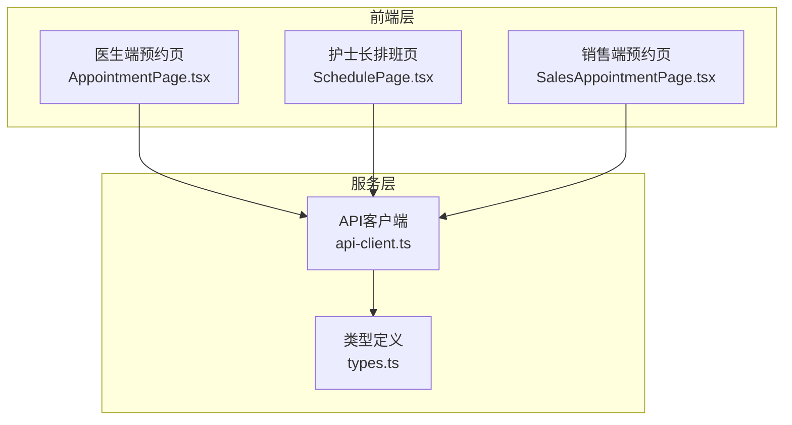
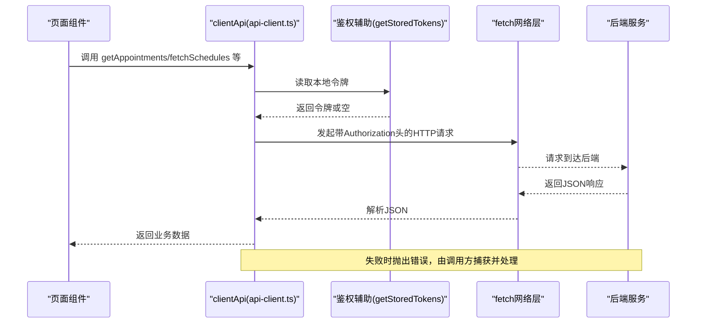
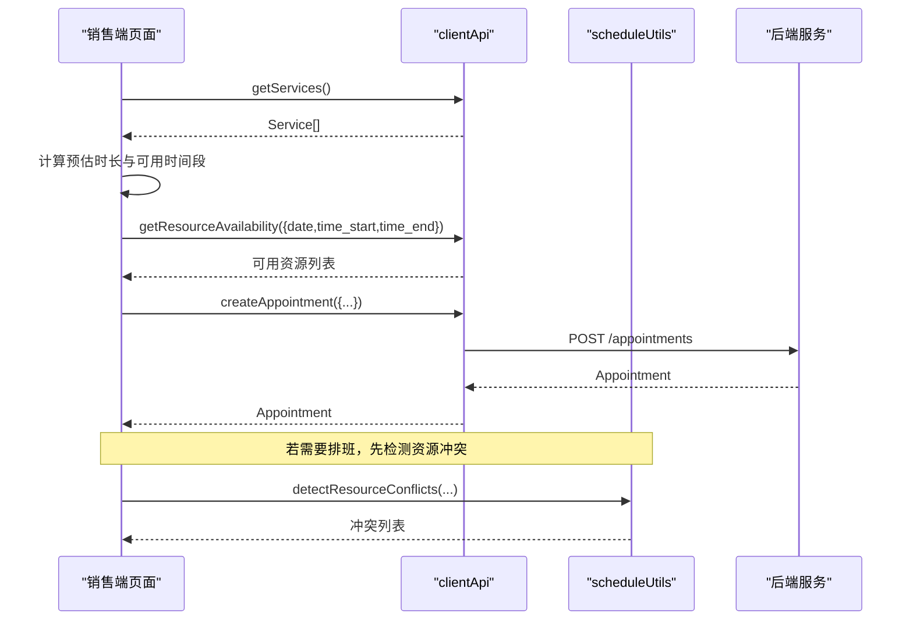
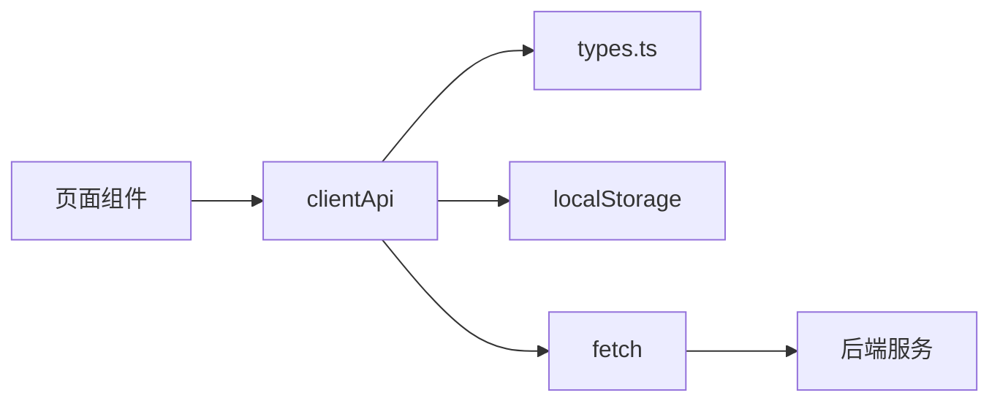

# 核心API客户端

<cite>
**本文引用的文件**
- [api-client.ts](file://src/services/api-client.ts)
- [api.ts](file://src/services/api.ts)
- [types.ts](file://src/types/types.ts)
- [AppointmentPage.tsx](file://src/pages/doctor/AppointmentPage.tsx)
- [SchedulePage.tsx](file://src/pages/head-nurse/SchedulePage.tsx)
- [SalesAppointmentPage.tsx](file://src/pages/sales/AppointmentPage.tsx)
- [scheduleUtils.ts](file://src/utils/scheduleUtils.ts)
- [utils.ts](file://src/lib/utils.ts)
</cite>

## 目录
1. [简介](#简介)
2. [项目结构](#项目结构)
3. [核心组件](#核心组件)
4. [架构总览](#架构总览)
5. [详细组件分析](#详细组件分析)
6. [依赖关系分析](#依赖关系分析)
7. [性能考量](#性能考量)
8. [故障排查指南](#故障排查指南)
9. [结论](#结论)
10. [附录](#附录)

## 简介
本文件面向Bio-Appointment前端团队与集成方，系统化梳理核心API客户端的HTTP请求封装、鉴权与错误处理机制，以及clientApi对象中关键方法（如 getAppointments、createAppointment、getSchedules 等）的实现细节、参数类型、返回值结构与异常处理模式。同时，文档阐述API_BASE_URL配置、认证头自动注入、查询参数序列化等关键能力，并结合预约管理、排班查询等典型场景给出调用示例路径与最佳实践，最后提供性能优化建议（如请求缓存与批量处理思路）。

## 项目结构
- API客户端位于 src/services/api-client.ts，提供统一的HTTP封装与鉴权逻辑。
- 类型定义位于 src/types/types.ts，涵盖预约、排班、资源、任务执行等核心实体与输入输出类型。
- 页面组件通过导入 clientApi 使用API，例如医生端预约页、护士长排班页、销售端预约页。
- 工具函数 src/utils/scheduleUtils.ts 提供资源冲突检测；src/lib/utils.ts 提供通用查询串构建工具。

图表来源
- [api-client.ts](file://src/services/api-client.ts#L1-L381)
- [types.ts](file://src/types/types.ts#L1-L200)
- [AppointmentPage.tsx](file://src/pages/doctor/AppointmentPage.tsx#L1-L120)
- [SchedulePage.tsx](file://src/pages/head-nurse/SchedulePage.tsx#L1-L120)
- [SalesAppointmentPage.tsx](file://src/pages/sales/AppointmentPage.tsx#L1-L120)

章节来源
- [api-client.ts](file://src/services/api-client.ts#L1-L381)
- [types.ts](file://src/types/types.ts#L1-L200)

## 核心组件
- API基础封装与鉴权
  - API_BASE_URL：统一的后端API根地址，便于切换环境。
  - apiCall：通用fetch封装，负责Content-Type设置、响应状态判断、JSON解析与错误抛出。
  - authenticatedApiCall：在apiCall基础上自动注入Authorization头（Bearer令牌），并确保Content-Type不被覆盖。
  - getStoredTokens：从localStorage读取访问令牌与刷新令牌，若缺失则抛出错误。
- clientApi对象
  - 认证：login、logout
  - 预约：getAppointments、createAppointment、updateAppointment、deleteAppointment
  - 服务：getServices
  - 资源：getResources
  - 排班：getSchedules、createSchedule、updateSchedule、deleteSchedule
  - 任务执行：getTaskExecutions、createTaskExecution、updateTaskExecution
  - 个人资料：getProfiles、getProfile
  - 仪表盘：getDashboardStats
  - 资源可用性：getResourceAvailability
  - 护士/房间：getAvailableNurses、getAvailableRooms
  - 钉钉集成：getDingTalkConfig、saveDingTalkConfig、triggerSync、getSyncLogs
- 类型体系
  - Appointment、Service、Resource、Schedule、TaskExecution、Profile等接口与枚举类型，确保前后端契约一致。

章节来源
- [api-client.ts](file://src/services/api-client.ts#L1-L381)
- [types.ts](file://src/types/types.ts#L90-L200)

## 架构总览
下图展示了前端页面组件与API客户端之间的交互关系，以及API客户端与后端服务的调用链路。

图表来源
- [api-client.ts](file://src/services/api-client.ts#L1-L120)
- [AppointmentPage.tsx](file://src/pages/doctor/AppointmentPage.tsx#L33-L60)
- [SchedulePage.tsx](file://src/pages/head-nurse/SchedulePage.tsx#L90-L120)

## 详细组件分析

### API客户端封装与鉴权
- API_BASE_URL
  - 定义统一的后端API根路径，便于开发/生产环境切换。
- apiCall
  - 职责：统一设置Content-Type、调用fetch、校验response.ok、解析JSON、捕获异常并抛出。
  - 异常处理：当response非ok时，尝试解析后端错误体，否则回退HTTP状态描述；统一记录错误并抛出。
- authenticatedApiCall
  - 职责：在apiCall基础上注入Authorization: Bearer <accessToken>，并确保Content-Type不被覆盖。
  - 异常处理：若本地无令牌，直接抛出“无认证令牌”错误。
- getStoredTokens
  - 职责：从localStorage读取访问令牌与刷新令牌；异常兜底返回空。
- 查询参数序列化
  - 对象到URLSearchParams：遍历过滤undefined/null键，统一转换为字符串拼接到查询串。
  - 与URLSearchParams.toString()配合，形成标准查询串。
- 类型与输入输出
  - Appointment、Service、Resource、Schedule、TaskExecution、Profile等接口定义，确保调用侧参数与返回值类型安全。

章节来源
- [api-client.ts](file://src/services/api-client.ts#L1-L120)
- [api-client.ts](file://src/services/api-client.ts#L147-L381)
- [types.ts](file://src/types/types.ts#L90-L200)

### clientApi对象方法详解

#### getAppointments(filters?)
- 参数
  - filters: Record<string, any>，支持customer_name、status、requested_date、requested_date_from、requested_date_to等键。
- 返回
  - Promise<Appointment[]>，返回预约列表。
- 关键点
  - 使用URLSearchParams序列化filters，自动过滤空值。
  - 通过authenticatedApiCall发起请求，自动注入Authorization头。
- 典型调用场景
  - 医生端：筛选doctor_status为pending/accepted/rejected的预约。
  - 护士长端：按日期范围筛选待排班预约。

章节来源
- [api-client.ts](file://src/services/api-client.ts#L178-L190)
- [AppointmentPage.tsx](file://src/pages/doctor/AppointmentPage.tsx#L37-L60)

#### createAppointment(data)
- 参数
  - data: CreateAppointmentInput，包含customer_name、service_id、requested_date、requested_time_start、requested_time_end、total_people、estimated_duration、is_urgent、notes、companion_names等。
- 返回
  - Promise<Appointment>，返回新创建的预约对象。
- 关键点
  - 通过authenticatedApiCall发起POST请求，body为JSON序列化后的data。
- 典型调用场景
  - 销售端发起预约申请，系统自动计算人数与预估时长。

章节来源
- [api-client.ts](file://src/services/api-client.ts#L192-L204)
- [SalesAppointmentPage.tsx](file://src/pages/sales/AppointmentPage.tsx#L164-L219)
- [types.ts](file://src/types/types.ts#L192-L203)

#### updateAppointment(id, data)
- 参数
  - id: string，预约ID。
  - data: Partial<Appointment>，允许部分字段更新。
- 返回
  - Promise<Appointment>，返回更新后的预约对象。
- 关键点
  - authenticatedApiCall发起PUT请求，body为JSON序列化后的data。

章节来源
- [api-client.ts](file://src/services/api-client.ts#L199-L204)
- [AppointmentPage.tsx](file://src/pages/doctor/AppointmentPage.tsx#L55-L70)

#### deleteAppointment(id)
- 参数
  - id: string，预约ID。
- 返回
  - Promise<void>。
- 关键点
  - authenticatedApiCall发起DELETE请求。

章节来源
- [api-client.ts](file://src/services/api-client.ts#L206-L210)

#### getServices(category?)
- 参数
  - category?: string，可选的服务分类过滤。
- 返回
  - Promise<Service[]>。
- 关键点
  - 通过URLSearchParams拼接查询串，非鉴权接口。

章节来源
- [api-client.ts](file://src/services/api-client.ts#L213-L216)
- [SalesAppointmentPage.tsx](file://src/pages/sales/AppointmentPage.tsx#L90-L97)

#### getResources(filters?)
- 参数
  - filters?: { type?: string; status?: string }。
- 返回
  - Promise<Resource[]>。
- 关键点
  - URLSearchParams序列化filters，非鉴权接口。

章节来源
- [api-client.ts](file://src/services/api-client.ts#L219-L225)

#### getSchedules(filters?)
- 参数
  - filters?: { date?: string; start_date?: string; end_date?: string; nurse_id?: string }。
- 返回
  - Promise<Schedule[]>。
- 关键点
  - URLSearchParams序列化filters，非鉴权接口。
- 典型调用场景
  - 护士长排班页按日/周/月视图筛选排班。

章节来源
- [api-client.ts](file://src/services/api-client.ts#L228-L241)
- [SchedulePage.tsx](file://src/pages/head-nurse/SchedulePage.tsx#L94-L103)

#### createSchedule(data)
- 参数
  - data: { appointment_id, scheduled_date, scheduled_time_start, scheduled_time_end, room_id?, nurse_id?, notes? }。
- 返回
  - Promise<Schedule>。
- 关键点
  - authenticatedApiCall发起POST请求。

章节来源
- [api-client.ts](file://src/services/api-client.ts#L294-L307)
- [SchedulePage.tsx](file://src/pages/head-nurse/SchedulePage.tsx#L194-L238)

#### updateSchedule(id, data)
- 参数
  - id: string，排班ID。
  - data: Partial<Schedule>，允许部分字段更新。
- 返回
  - Promise<Schedule>。
- 关键点
  - authenticatedApiCall发起PUT请求。

章节来源
- [api-client.ts](file://src/services/api-client.ts#L309-L314)
- [SchedulePage.tsx](file://src/pages/head-nurse/SchedulePage.tsx#L194-L212)

#### deleteSchedule(id)
- 参数
  - id: string，排班ID。
- 返回
  - Promise<void>。
- 关键点
  - authenticatedApiCall发起DELETE请求。

章节来源
- [api-client.ts](file://src/services/api-client.ts#L316-L320)

#### getTaskExecutions(filters?)
- 参数
  - filters?: { status?: string; assigned_to?: string }。
- 返回
  - Promise<TaskExecution[]>。
- 关键点
  - URLSearchParams序列化filters，非鉴权接口。

章节来源
- [api-client.ts](file://src/services/api-client.ts#L244-L249)

#### createTaskExecution(data)
- 参数
  - data: { schedule_id?, title, description?, status?, assigned_to? }。
- 返回
  - Promise<TaskExecution>。
- 关键点
  - authenticatedApiCall发起POST请求。

章节来源
- [api-client.ts](file://src/services/api-client.ts#L259-L269)

#### updateTaskExecution(id, data)
- 参数
  - id: string，任务执行ID。
  - data: Partial<TaskExecution>。
- 返回
  - Promise<TaskExecution>。
- 关键点
  - authenticatedApiCall发起PUT请求。

章节来源
- [api-client.ts](file://src/services/api-client.ts#L252-L257)

#### getProfiles()
- 返回
  - Promise<Profile[]>。
- 关键点
  - authenticatedApiCall，用于获取用户列表。

章节来源
- [api-client.ts](file://src/services/api-client.ts#L273-L275)

#### getProfile(id)
- 参数
  - id: string，用户ID。
- 返回
  - Promise<Profile>。
- 关键点
  - authenticatedApiCall。

章节来源
- [api-client.ts](file://src/services/api-client.ts#L277-L279)

#### getDashboardStats(date?)
- 参数
  - date?: string，可选的统计日期。
- 返回
  - Promise<any>，返回仪表盘统计数据。
- 关键点
  - URLSearchParams序列化date，非鉴权接口。

章节来源
- [api-client.ts](file://src/services/api-client.ts#L282-L285)

#### getResourceAvailability(params)
- 参数
  - params: { date, time_start, time_end }。
- 返回
  - Promise<any>，返回可用房间与护士列表。
- 关键点
  - URLSearchParams序列化params，非鉴权接口。

章节来源
- [api-client.ts](file://src/services/api-client.ts#L288-L291)
- [SalesAppointmentPage.tsx](file://src/pages/sales/AppointmentPage.tsx#L21-L35)

#### getAvailableNurses() / getAvailableRooms()
- 返回
  - Promise<any[]>，分别返回可用护士与房间列表。
- 关键点
  - 非鉴权接口。

章节来源
- [api-client.ts](file://src/services/api-client.ts#L323-L329)

#### 钉钉集成相关
- getDingTalkConfig/saveDingTalkConfig/triggerSync/getSyncLogs
  - 通过authenticatedApiCall发起请求，支持配置读取、保存、触发同步与查询同步日志。
- 关键点
  - 配置与同步均需鉴权。

章节来源
- [api-client.ts](file://src/services/api-client.ts#L332-L379)

### 类型与数据模型
- Appointment
  - 字段：id、customer_name、service_id、requested_date、requested_time_start、requested_time_end、total_people、estimated_duration、is_urgent、status、notes、created_at、updated_at等。
- Service
  - 字段：id、name、category、base_duration、requires_doctor、allow_companions、is_active等。
- Resource
  - 字段：id、name、type、category、status等。
- Schedule
  - 字段：id、appointment_id、scheduled_date、scheduled_time_start、scheduled_time_end、room_id、nurse_id、status、created_at、updated_at等。
- TaskExecution
  - 字段：id、schedule_id、title、description、status、assigned_to、created_at、updated_at等。
- Profile
  - 字段：id、email、full_name、role、phone、department、created_at、updated_at等。
- CreateAppointmentInput
  - 字段：customer_name、service_id、requested_date、requested_time_start、requested_time_end、total_people、estimated_duration、is_urgent、notes、companion_names等。

章节来源
- [types.ts](file://src/types/types.ts#L90-L200)
- [types.ts](file://src/types/types.ts#L192-L203)

### API工作流与调用示例路径
- 医生端处理预约
  - 加载待处理预约：useEffect中调用 getAppointments({})，随后按doctor_status过滤。
  - 接受/拒绝预约：调用 updateAppointment 更新状态。
  - 示例路径：[AppointmentPage.tsx](file://src/pages/doctor/AppointmentPage.tsx#L37-L101)
- 护士长排班
  - 加载待排班预约与排班：Promise.all 并发调用 getAppointments、getSchedules、getAvailableNurses、getAvailableRooms。
  - 创建/更新排班：createSchedule/updateSchedule，同时更新对应预约状态。
  - 冲突检测：使用 scheduleUtils.detectResourceConflicts。
  - 示例路径：[SchedulePage.tsx](file://src/pages/head-nurse/SchedulePage.tsx#L94-L120)，[scheduleUtils.ts](file://src/utils/scheduleUtils.ts#L1-L112)
- 销售端发起预约
  - 加载服务：getServices。
  - 计算预估时长与可用时间段：根据服务基础时长与同行人数推导。
  - 提交预约：createAppointment。
  - 示例路径：[SalesAppointmentPage.tsx](file://src/pages/sales/AppointmentPage.tsx#L90-L219)

图表来源
- [SalesAppointmentPage.tsx](file://src/pages/sales/AppointmentPage.tsx#L90-L219)
- [scheduleUtils.ts](file://src/utils/scheduleUtils.ts#L1-L112)
- [api-client.ts](file://src/services/api-client.ts#L288-L291)

## 依赖关系分析
- 组件耦合
  - 页面组件仅依赖clientApi，避免直接耦合到fetch或后端细节。
  - clientApi内部依赖localStorage与URLSearchParams，对外暴露清晰的方法签名。
- 类型耦合
  - types.ts集中定义数据模型，clientApi与页面组件共享类型，降低契约变更成本。
- 外部依赖
  - fetch为浏览器内置API，无需额外安装。
  - URLSearchParams用于查询参数序列化，兼容性良好。

图表来源
- [api-client.ts](file://src/services/api-client.ts#L1-L120)
- [types.ts](file://src/types/types.ts#L90-L200)

章节来源
- [api-client.ts](file://src/services/api-client.ts#L1-L120)
- [types.ts](file://src/types/types.ts#L90-L200)

## 性能考量
- 请求并发
  - 护士长排班页使用 Promise.all 并发拉取预约、排班、可用护士与房间，减少总等待时间。
  - 示例路径：[SchedulePage.tsx](file://src/pages/head-nurse/SchedulePage.tsx#L94-L103)
- 查询参数序列化
  - 使用URLSearchParams对filters进行序列化，避免手动拼接字符串，提升可维护性与正确性。
  - 示例路径：[api-client.ts](file://src/services/api-client.ts#L178-L190)、[api-client.ts](file://src/services/api-client.ts#L228-L241)
- 本地存储与鉴权
  - 令牌读取与注入在本地完成，避免重复网络往返。
  - 示例路径：[api-client.ts](file://src/services/api-client.ts#L45-L57)、[api-client.ts](file://src/services/api-client.ts#L28-L42)
- 缓存与批量处理建议
  - 当前实现未内置HTTP缓存，可在上层引入轻量缓存策略（如内存缓存或基于URL+参数的LRU缓存）以减少重复请求。
  - 对高频读取的静态数据（如服务列表、可用护士/房间）可考虑短期缓存。
  - 批量写入（如批量创建任务执行）可合并为单次请求，减少网络开销。
- 时区与日期格式
  - 页面组件统一使用日期格式化工具，避免跨时区问题导致的查询偏差。
  - 示例路径：[SchedulePage.tsx](file://src/pages/head-nurse/SchedulePage.tsx#L1-L40)

章节来源
- [SchedulePage.tsx](file://src/pages/head-nurse/SchedulePage.tsx#L94-L103)
- [api-client.ts](file://src/services/api-client.ts#L178-L190)
- [api-client.ts](file://src/services/api-client.ts#L228-L241)
- [utils.ts](file://src/lib/utils.ts#L1-L39)

## 故障排查指南
- 无认证令牌
  - 现象：调用authenticatedApiCall时抛出“无认证令牌”错误。
  - 排查：确认localStorage中是否存在 bio_appointment_access_token 与 bio_appointment_refresh_token。
  - 参考路径：[api-client.ts](file://src/services/api-client.ts#L28-L42)、[api-client.ts](file://src/services/api-client.ts#L45-L57)
- HTTP响应非OK
  - 现象：apiCall抛出错误，包含后端错误体或HTTP状态描述。
  - 排查：检查后端返回的错误体字段，定位具体业务错误。
  - 参考路径：[api-client.ts](file://src/services/api-client.ts#L5-L25)
- 查询参数为空
  - 现象：getAppointments/getSchedules等方法传入filters为空，导致查询串为空。
  - 排查：确保filters中非空键才参与序列化。
  - 参考路径：[api-client.ts](file://src/services/api-client.ts#L178-L190)、[api-client.ts](file://src/services/api-client.ts#L228-L241)
- 资源冲突导致排班失败
  - 现象：创建/更新排班时报冲突。
  - 排查：使用 scheduleUtils.detectResourceConflicts 检测冲突，必要时强制覆盖或调整时间。
  - 参考路径：[scheduleUtils.ts](file://src/utils/scheduleUtils.ts#L1-L112)、[SchedulePage.tsx](file://src/pages/head-nurse/SchedulePage.tsx#L170-L193)

章节来源
- [api-client.ts](file://src/services/api-client.ts#L5-L25)
- [api-client.ts](file://src/services/api-client.ts#L28-L42)
- [scheduleUtils.ts](file://src/utils/scheduleUtils.ts#L1-L112)

## 结论
本API客户端以简洁的fetch封装为基础，提供了统一的鉴权注入、查询参数序列化与错误处理机制。clientApi对象覆盖了预约、排班、资源、任务执行等核心业务场景，类型定义保证了调用的安全性。页面组件通过导入clientApi即可完成常见业务操作，降低了耦合度与维护成本。建议在上层引入轻量缓存与批量处理策略，进一步提升用户体验与系统吞吐。

## 附录
- API基线与鉴权
  - API_BASE_URL：统一后端根路径。
  - 鉴权头：Authorization: Bearer <accessToken>。
  - 令牌来源：localStorage。
  - 参考路径：[api-client.ts](file://src/services/api-client.ts#L1-L42)
- 查询参数序列化
  - URLSearchParams：对filters进行序列化，自动过滤空值。
  - 参考路径：[api-client.ts](file://src/services/api-client.ts#L178-L190)、[api-client.ts](file://src/services/api-client.ts#L228-L241)
- 场景调用示例路径
  - 医生端处理预约：[AppointmentPage.tsx](file://src/pages/doctor/AppointmentPage.tsx#L37-L101)
  - 护士长排班：[SchedulePage.tsx](file://src/pages/head-nurse/SchedulePage.tsx#L94-L120)
  - 销售端发起预约：[SalesAppointmentPage.tsx](file://src/pages/sales/AppointmentPage.tsx#L90-L219)