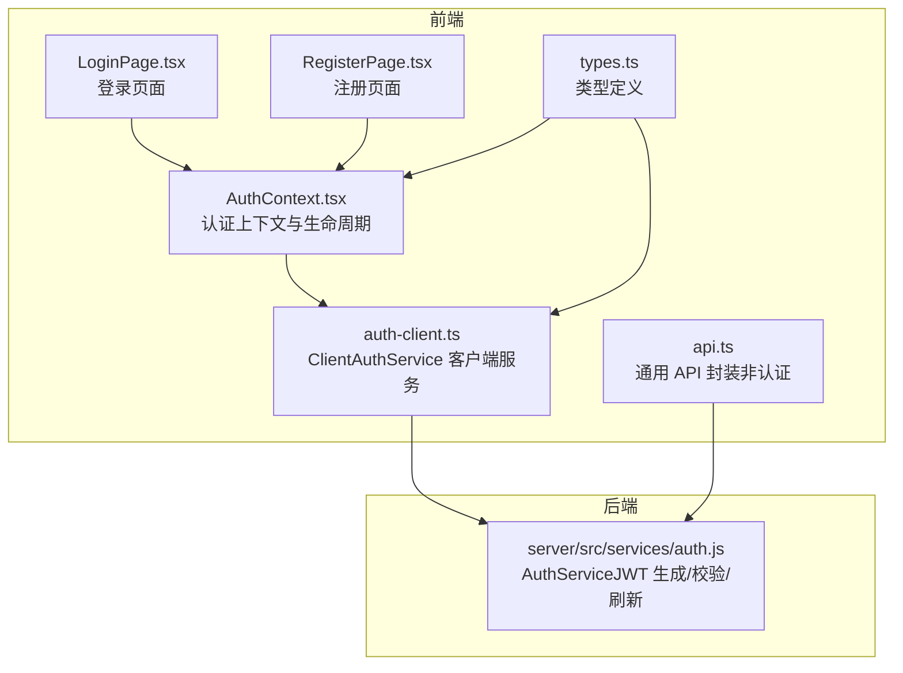
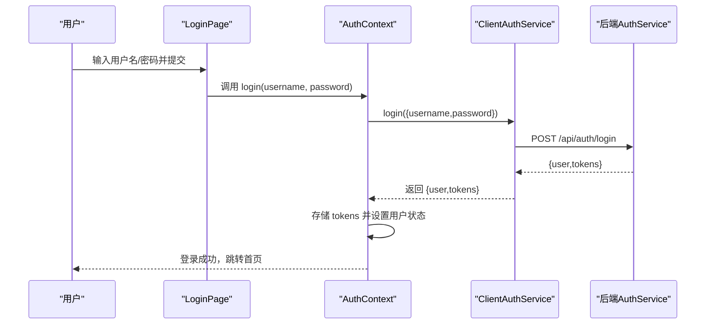
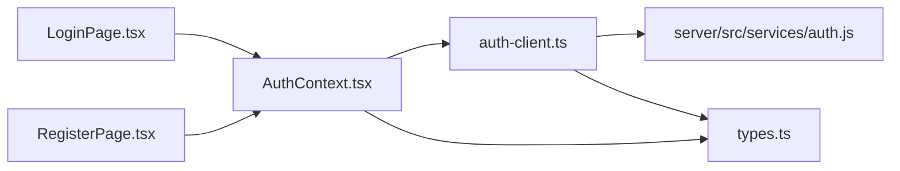

# 认证客户端

<cite>
**本文引用的文件**
- [src/services/auth-client.ts](file://src/services/auth-client.ts)
- [src/contexts/AuthContext.tsx](file://src/contexts/AuthContext.tsx)
- [src/pages/auth/LoginPage.tsx](file://src/pages/auth/LoginPage.tsx)
- [src/pages/auth/RegisterPage.tsx](file://src/pages/auth/RegisterPage.tsx)
- [src/services/api.ts](file://src/services/api.ts)
- [src/types/types.ts](file://src/types/types.ts)
- [server/src/services/auth.js](file://server/src/services/auth.js)
- [AUTH_IMPLEMENTATION_SUMMARY.md](file://AUTH_IMPLEMENTATION_SUMMARY.md)
- [AUTH_TESTING_GUIDE.md](file://AUTH_TESTING_GUIDE.md)
- [USER_AUTH_GUIDE.md](file://USER_AUTH_GUIDE.md)
</cite>

## 目录
1. [简介](#简介)
2. [项目结构](#项目结构)
3. [核心组件](#核心组件)
4. [架构总览](#架构总览)
5. [详细组件分析](#详细组件分析)
6. [依赖关系分析](#依赖关系分析)
7. [性能考虑](#性能考虑)
8. [故障排除指南](#故障排除指南)
9. [结论](#结论)
10. [附录](#附录)

## 简介
本文件面向前端开发者与产品/测试人员，系统性梳理 Bio-Appointment 认证客户端的实现与使用，重点覆盖：
- ClientAuthService 类在用户认证流程中的职责与方法（login、register、refreshToken、getUserById、changePassword、logout）
- JWT 令牌的客户端验证逻辑，特别是 verifyToken 对“mock-开发令牌”的特殊处理
- 本地存储辅助方法（getStoredTokens、storeTokens、clearTokens）在 localStorage 中的令牌管理策略
- 登录、注册、密码修改等关键流程的调用示例与异常处理
- 安全最佳实践与常见问题排查

## 项目结构
认证客户端位于前端 src/services 与 src/contexts 目录中，配合后端 AuthService 提供统一的认证与授权能力；类型定义集中在 src/types/types.ts。

图表来源
- [src/contexts/AuthContext.tsx](file://src/contexts/AuthContext.tsx#L1-L308)
- [src/services/auth-client.ts](file://src/services/auth-client.ts#L1-L235)
- [src/pages/auth/LoginPage.tsx](file://src/pages/auth/LoginPage.tsx#L1-L158)
- [src/pages/auth/RegisterPage.tsx](file://src/pages/auth/RegisterPage.tsx#L1-L209)
- [src/services/api.ts](file://src/services/api.ts#L1-L483)
- [src/types/types.ts](file://src/types/types.ts#L1-L487)
- [server/src/services/auth.js](file://server/src/services/auth.js#L1-L284)

章节来源
- [src/services/auth-client.ts](file://src/services/auth-client.ts#L1-L235)
- [src/contexts/AuthContext.tsx](file://src/contexts/AuthContext.tsx#L1-L308)
- [src/pages/auth/LoginPage.tsx](file://src/pages/auth/LoginPage.tsx#L1-L158)
- [src/pages/auth/RegisterPage.tsx](file://src/pages/auth/RegisterPage.tsx#L1-L209)
- [src/services/api.ts](file://src/services/api.ts#L1-L483)
- [src/types/types.ts](file://src/types/types.ts#L1-L487)
- [server/src/services/auth.js](file://server/src/services/auth.js#L1-L284)

## 核心组件
- ClientAuthService：负责与后端 API 交互、令牌管理与 JWT 客户端解码/校验。
- AuthContext：应用级认证状态管理，负责初始化、自动刷新、登出、用户资料拉取与变更。
- LoginPage/ RegisterPage：认证入口页面，调用 AuthContext 的 login/register 方法。
- AuthService（后端）：负责 JWT 签发、校验、刷新、用户信息读取与密码变更等业务逻辑。

章节来源
- [src/services/auth-client.ts](file://src/services/auth-client.ts#L1-L235)
- [src/contexts/AuthContext.tsx](file://src/contexts/AuthContext.tsx#L1-L308)
- [server/src/services/auth.js](file://server/src/services/auth.js#L1-L284)

## 架构总览
认证客户端采用“前端上下文 + 客户端服务 + 后端服务”的分层架构：
- 前端通过 AuthContext 管理认证状态与生命周期
- ClientAuthService 负责与后端 API 通信与令牌管理
- 后端 AuthService 提供 JWT 生成、校验、刷新与用户业务操作

图表来源
- [src/pages/auth/LoginPage.tsx](file://src/pages/auth/LoginPage.tsx#L1-L158)
- [src/contexts/AuthContext.tsx](file://src/contexts/AuthContext.tsx#L154-L176)
- [src/services/auth-client.ts](file://src/services/auth-client.ts#L59-L109)
- [server/src/services/auth.js](file://server/src/services/auth.js#L118-L146)

## 详细组件分析

### ClientAuthService 类
- 职责
  - 与后端 API 交互：login、register、refreshToken、getUserById、changePassword、logout
  - 令牌管理：getStoredTokens、storeTokens、clearTokens
  - JWT 客户端解码与校验：verifyToken（含 mock- 开发令牌的特殊处理）

- 关键方法与交互
  - login(credentials)
    - 请求后端 /api/auth/login
    - 成功返回 {user, tokens}
    - 失败抛出错误（包含后端 message）
  - register(credentials)
    - 请求后端 /api/auth/register
    - 成功返回 user
    - 失败抛出错误
  - refreshToken(refreshToken)
    - 请求后端 /api/auth/refresh
    - 成功返回新的 {accessToken, refreshToken}
    - 失败抛出错误
  - getUserById(userId)
    - 从 localStorage 读取 accessToken
    - 以 Bearer 方式携带 Authorization 头请求 /api/profiles/{userId}
    - 401 抛出“认证失败”，404 返回 null，其他错误抛出“获取用户失败”
  - changePassword(userId, currentPassword, newPassword)
    - 从 localStorage 读取 accessToken
    - 以 Bearer 方式携带 Authorization 头请求 /api/auth/change-password
    - 失败抛出错误
  - logout()
    - 若存在 tokens，先调用后端 /api/auth/logout（Bearer）
    - 清空本地 tokens
  - verifyToken(token)
    - 若 token 以 “mock-” 开头，构造模拟 payload（长期有效，用于开发）
    - 否则客户端 base64 解码中间段 payload，返回 JwtPayload
    - 异常时抛出“无效 token 格式”
  - 令牌存储辅助
    - getStoredTokens：从 localStorage 读取 access/refresh
    - storeTokens：写入 localStorage
    - clearTokens：移除 localStorage 中的 tokens
    - 异常捕获与日志输出

- 复杂度与性能
  - verifyToken 为 O(1)，字符串拆分与 base64 解码
  - 令牌读写为 O(1)，受 localStorage 性能影响
  - API 调用为网络 IO，受后端响应时间影响

- 错误处理
  - 所有 API 调用均检查 response.ok，失败时读取后端 message 并抛出
  - 令牌校验失败或格式错误时抛出明确错误
  - 令牌存储/清除异常时记录日志

章节来源
- [src/services/auth-client.ts](file://src/services/auth-client.ts#L1-L235)

### AuthContext 上下文
- 职责
  - 初始化认证状态：启动时读取本地 tokens，尝试解码并拉取用户资料
  - 自动刷新：在 access token 即将过期前，使用 refresh token 刷新并更新本地 tokens
  - 登录/注册/登出：调用 ClientAuthService 并维护用户状态
  - 用户资料刷新：主动拉取最新 profile

- 生命周期与自动刷新
  - 初始化：若存在 tokens，优先尝试 verifyToken 并 getUserById；若 access token 无效，则尝试 refreshToken；失败则清空 tokens
  - 自动刷新：每分钟检查一次 access token 的 exp，提前 5 分钟刷新；过期则登出
  - 开发模式：若 access token 以 “mock-” 开头，跳过过期检查

- 登录/注册/登出流程
  - login：调用 ClientAuthService.login，成功后设置用户状态并存储 tokens
  - register：调用 ClientAuthService.register，随后自动 login
  - logout：清空本地 tokens，设置用户状态为空，调用 ClientAuthService.logout

- 与 ClientAuthService 的协作
  - 使用 getStoredTokens/storeTokens/clearTokens 管理本地令牌
  - 使用 verifyToken/getUserById/refreshToken 管理会话有效性

章节来源
- [src/contexts/AuthContext.tsx](file://src/contexts/AuthContext.tsx#L1-L308)

### 前端页面与调用示例
- 登录页面 LoginPage
  - 使用 react-hook-form + zod 校验
  - 调用 useAuth().login(email, password)
  - 成功 toast 提示并跳转首页
  - 失败捕获错误并提示

- 注册页面 RegisterPage
  - 使用 react-hook-form + zod 校验
  - 调用 register API（db/api.ts 中的 register）
  - 成功提示并跳转登录页

- 调用路径参考
  - 登录：LoginPage -> AuthContext.login -> ClientAuthService.login -> 后端 AuthService.login
  - 注册：RegisterPage -> ClientAuthService.register -> 后端 AuthService.register
  - 刷新：AuthContext 自动刷新 -> ClientAuthService.refreshToken -> 后端 AuthService.refreshToken

章节来源
- [src/pages/auth/LoginPage.tsx](file://src/pages/auth/LoginPage.tsx#L1-L158)
- [src/pages/auth/RegisterPage.tsx](file://src/pages/auth/RegisterPage.tsx#L1-L209)
- [src/services/api.ts](file://src/services/api.ts#L1-L120)
- [src/services/auth-client.ts](file://src/services/auth-client.ts#L59-L109)
- [server/src/services/auth.js](file://server/src/services/auth.js#L118-L146)

### JWT 客户端验证与开发令牌
- verifyToken(token)
  - 开发环境支持以 “mock-” 开头的令牌，返回固定 payload（长期有效），便于本地调试
  - 生产环境走标准 JWT 解码流程：base64 解码中间段 payload，返回 JwtPayload
  - 异常处理：格式不合法或解码失败时抛出“无效 token 格式”

- 与后端 AuthService 的差异
  - 后端使用 jsonwebtoken.verify，严格校验签发方、受众、过期时间等
  - 前端 verifyToken 仅做基础解码与 mock 特判，不进行签名验证

章节来源
- [src/services/auth-client.ts](file://src/services/auth-client.ts#L32-L57)
- [server/src/services/auth.js](file://server/src/services/auth.js#L64-L83)

### 令牌存储策略（localStorage）
- 存储键
  - bio_appointment_access_token
  - bio_appointment_refresh_token
- 读取/写入/清除
  - getStoredTokens：读取两个键，若都存在则返回对象，否则返回 null
  - storeTokens：写入两个键
  - clearTokens：移除两个键
- 异常处理
  - 任何异常均记录日志并静默处理，避免阻断主流程

章节来源
- [src/services/auth-client.ts](file://src/services/auth-client.ts#L182-L212)
- [src/contexts/AuthContext.tsx](file://src/contexts/AuthContext.tsx#L42-L72)

### 后端 AuthService（补充理解）
- 生成/校验/刷新
  - generateAccessToken/generateRefreshToken：使用 VITE_JWT_SECRET 签发，分别设置过期时间
  - verifyToken：使用 jsonwebtoken.verify 校验签名、issuer、audience、exp
  - refreshToken：校验 refresh token，查询用户并重新签发新 tokens
- 用户相关
  - login：校验用户名/密码、账户状态，签发 tokens
  - changePassword：校验当前密码，更新为新密码哈希
  - getUserById：按 id 查询用户（去除敏感字段）

章节来源
- [server/src/services/auth.js](file://server/src/services/auth.js#L1-L284)

## 依赖关系分析
- 前端依赖
  - AuthContext 依赖 ClientAuthService 进行令牌管理与 API 调用
  - ClientAuthService 依赖后端 AuthService（通过 /api/auth/*）
  - 类型定义来自 src/types/types.ts
- 后端依赖
  - AuthService 依赖数据库连接与 profiles 表，提供用户、角色、状态等业务能力

图表来源
- [src/contexts/AuthContext.tsx](file://src/contexts/AuthContext.tsx#L1-L308)
- [src/services/auth-client.ts](file://src/services/auth-client.ts#L1-L235)
- [server/src/services/auth.js](file://server/src/services/auth.js#L1-L284)
- [src/types/types.ts](file://src/types/types.ts#L1-L487)
- [src/pages/auth/LoginPage.tsx](file://src/pages/auth/LoginPage.tsx#L1-L158)
- [src/pages/auth/RegisterPage.tsx](file://src/pages/auth/RegisterPage.tsx#L1-L209)

章节来源
- [src/contexts/AuthContext.tsx](file://src/contexts/AuthContext.tsx#L1-L308)
- [src/services/auth-client.ts](file://src/services/auth-client.ts#L1-L235)
- [server/src/services/auth.js](file://server/src/services/auth.js#L1-L284)
- [src/types/types.ts](file://src/types/types.ts#L1-L487)

## 性能考虑
- 令牌刷新频率
  - 前端每分钟检查一次，提前 5 分钟刷新，避免频繁刷新造成抖动
- 网络请求
  - 登录/注册/刷新/获取用户资料均为网络 IO，建议在 UI 层增加加载态与节流
- 本地存储
  - localStorage 为同步 API，避免在主线程中进行大量读写
- 开发令牌
  - “mock-” 令牌绕过过期检查，提升开发效率，但不应在生产使用

[本节为通用指导，无需列出具体文件来源]

## 故障排除指南
- 登录失败
  - 检查后端 /api/auth/login 返回的 message
  - 确认用户名/密码正确且账户状态为 active
- 令牌无效或过期
  - 前端 verifyToken 抛出“无效 token 格式”或“认证失败”
  - 检查 localStorage 中 tokens 是否存在且未被篡改
  - 若 access token 过期，前端会尝试 refreshToken；若失败则登出并清空 tokens
- 刷新失败
  - 检查 refresh token 是否有效、用户状态是否仍为 active
  - 后端 AuthService.refreshToken 会在校验失败时抛出“无效 refresh token”
- 获取用户失败
  - 401：认证失败，建议重新登录
  - 404：用户不存在，建议清理 tokens 并重新登录
  - 其他：网络或后端异常，重试或检查后端日志
- 密码修改失败
  - 确认当前密码正确
  - 检查后端返回的错误信息（如“当前密码不正确”）

章节来源
- [src/services/auth-client.ts](file://src/services/auth-client.ts#L111-L179)
- [src/contexts/AuthContext.tsx](file://src/contexts/AuthContext.tsx#L80-L137)
- [server/src/services/auth.js](file://server/src/services/auth.js#L148-L168)

## 结论
- ClientAuthService 与 AuthContext 构成了认证客户端的核心：前者负责与后端 API 交互与令牌管理，后者负责状态生命周期与自动刷新
- verifyToken 的 mock- 特殊处理提升了开发体验，但需注意仅用于开发环境
- 通过 localStorage 管理 tokens，结合前端自动刷新与登出清理，形成闭环的安全会话管理
- 建议在生产环境中严格区分开发/生产环境，避免使用 mock 令牌

[本节为总结性内容，无需列出具体文件来源]

## 附录

### 调用示例与最佳实践
- 登录
  - 路径参考：LoginPage -> AuthContext.login -> ClientAuthService.login -> 后端 AuthService.login
  - 建议：表单校验 + 加载态 + 错误提示；成功后立即存储 tokens 并跳转
- 注册
  - 路径参考：RegisterPage -> ClientAuthService.register -> 后端 AuthService.register
  - 建议：注册成功后自动 login，减少用户操作步骤
- 密码修改
  - 路径参考：AuthContext.changePassword -> ClientAuthService.changePassword -> 后端 AuthService.changePassword
  - 建议：前后端均进行强校验，修改成功后提示并可选择重新登录

章节来源
- [src/pages/auth/LoginPage.tsx](file://src/pages/auth/LoginPage.tsx#L1-L158)
- [src/pages/auth/RegisterPage.tsx](file://src/pages/auth/RegisterPage.tsx#L1-L209)
- [src/contexts/AuthContext.tsx](file://src/contexts/AuthContext.tsx#L194-L231)
- [src/services/auth-client.ts](file://src/services/auth-client.ts#L155-L179)
- [server/src/services/auth.js](file://server/src/services/auth.js#L196-L216)

### 安全最佳实践
- 仅在开发环境使用 mock 令牌，生产环境必须使用后端签发的真实 tokens
- 令牌存储在 localStorage，注意 XSS 防护与 HTTPS 传输
- 前端仅做基础解码与 mock 特判，不替代后端签名验证
- 自动刷新与登出清理应完善，避免长时间持有无效 tokens
- 密码修改流程需严格校验当前密码，防止误操作

章节来源
- [src/services/auth-client.ts](file://src/services/auth-client.ts#L32-L57)
- [src/contexts/AuthContext.tsx](file://src/contexts/AuthContext.tsx#L232-L276)
- [AUTH_IMPLEMENTATION_SUMMARY.md](file://AUTH_IMPLEMENTATION_SUMMARY.md#L228-L248)
- [AUTH_TESTING_GUIDE.md](file://AUTH_TESTING_GUIDE.md#L1-L180)
- [USER_AUTH_GUIDE.md](file://USER_AUTH_GUIDE.md#L1-L148)