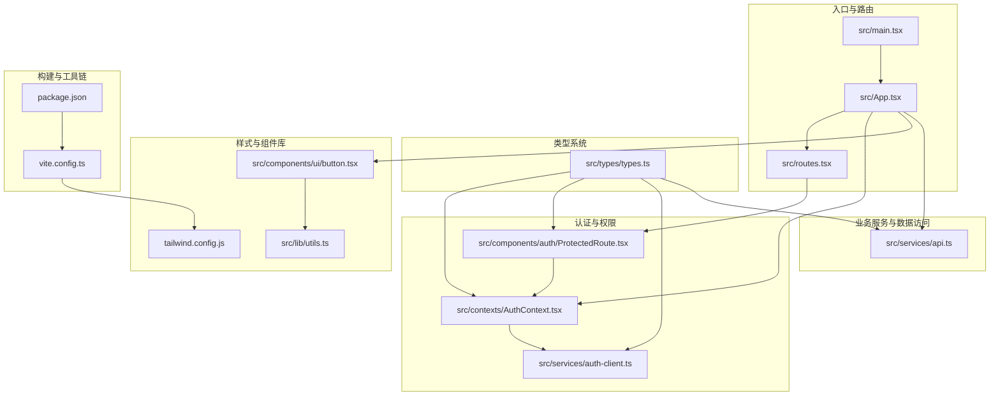
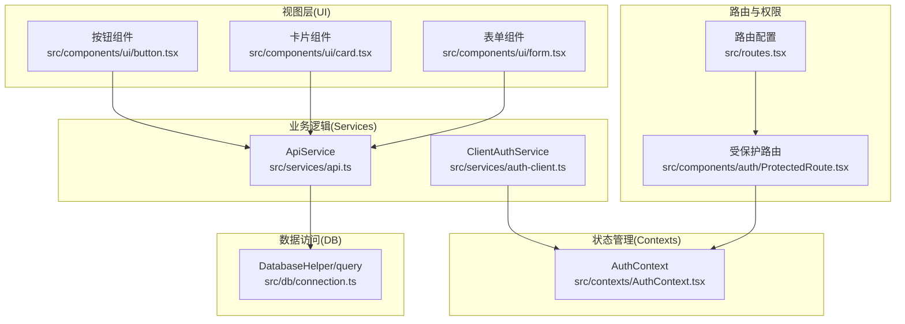
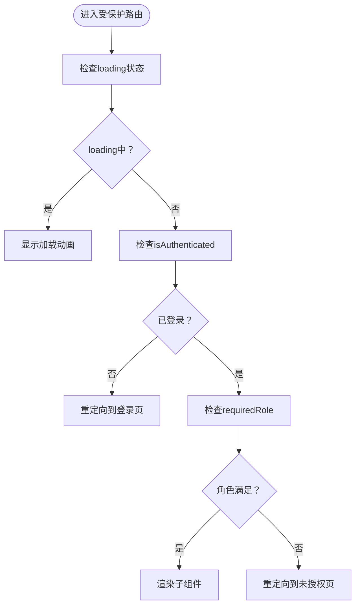
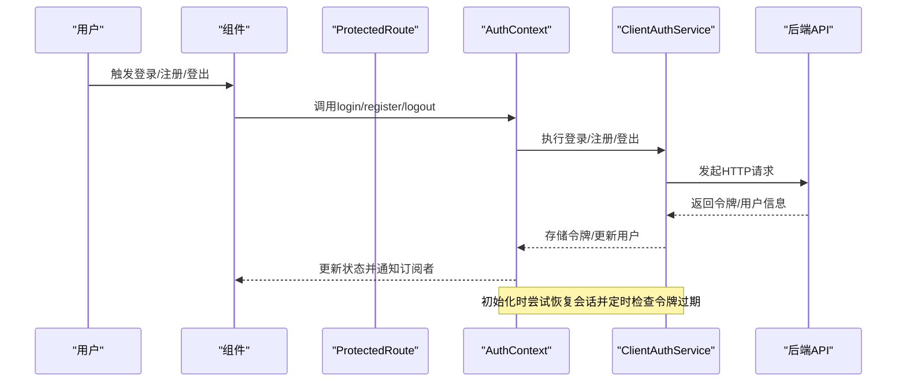
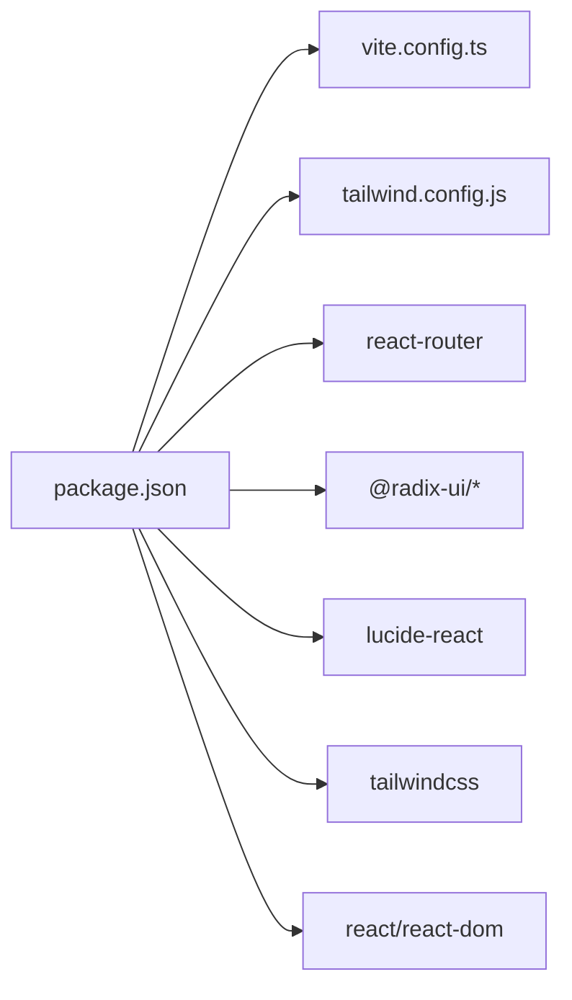

# 前端架构

<cite>
**本文引用的文件**
- [main.tsx](file://src/main.tsx)
- [App.tsx](file://src/App.tsx)
- [routes.tsx](file://src/routes.tsx)
- [ProtectedRoute.tsx](file://src/components/auth/ProtectedRoute.tsx)
- [AuthContext.tsx](file://src/contexts/AuthContext.tsx)
- [auth-client.ts](file://src/services/auth-client.ts)
- [types.ts](file://src/types/types.ts)
- [vite.config.ts](file://vite.config.ts)
- [tailwind.config.js](file://tailwind.config.js)
- [button.tsx](file://src/components/ui/button.tsx)
- [utils.ts](file://src/lib/utils.ts)
- [api.ts](file://src/services/api.ts)
- [package.json](file://package.json)
</cite>

## 目录
1. [引言](#引言)
2. [项目结构](#项目结构)
3. [核心组件](#核心组件)
4. [架构总览](#架构总览)
5. [详细组件分析](#详细组件分析)
6. [依赖分析](#依赖分析)
7. [性能考虑](#性能考虑)
8. [故障排除指南](#故障排除指南)
9. [结论](#结论)
10. [附录](#附录)

## 引言
本文件面向Bio-Appointment前端团队与协作方，系统化梳理基于React 18与TypeScript的现代前端架构。重点覆盖以下方面：
- Vite构建工具的配置优势与开发体验
- Tailwind CSS的原子化样式方案与主题扩展
- 应用主入口与路由系统设计
- 基于角色的页面访问控制与全局状态管理
- 组件库（src/components/ui）的原子化设计原则与复用模式
- 前端分层架构图：UI组件、业务逻辑（services）、数据访问（db）、状态管理（contexts）之间的数据流与依赖关系

## 项目结构
前端采用“按功能域+分层”的组织方式：
- 入口与路由：src/main.tsx、src/App.tsx、src/routes.tsx
- 认证与权限：src/contexts/AuthContext.tsx、src/components/auth/ProtectedRoute.tsx、src/services/auth-client.ts
- 类型系统：src/types/types.ts
- 样式与组件库：src/components/ui/*、src/lib/utils.ts、tailwind.config.js
- 构建与工具链：vite.config.ts、package.json
- 业务服务与数据访问：src/services/api.ts、src/db/*

图表来源
- [main.tsx](file://src/main.tsx#L1-L14)
- [App.tsx](file://src/App.tsx#L1-L62)
- [routes.tsx](file://src/routes.tsx#L1-L135)
- [ProtectedRoute.tsx](file://src/components/auth/ProtectedRoute.tsx#L1-L49)
- [AuthContext.tsx](file://src/contexts/AuthContext.tsx#L1-L308)
- [auth-client.ts](file://src/services/auth-client.ts#L1-L235)
- [types.ts](file://src/types/types.ts#L1-L487)
- [button.tsx](file://src/components/ui/button.tsx#L1-L58)
- [utils.ts](file://src/lib/utils.ts#L1-L40)
- [api.ts](file://src/services/api.ts#L1-L483)
- [vite.config.ts](file://vite.config.ts#L1-L90)
- [package.json](file://package.json#L1-L103)

章节来源
- [main.tsx](file://src/main.tsx#L1-L14)
- [App.tsx](file://src/App.tsx#L1-L62)
- [routes.tsx](file://src/routes.tsx#L1-L135)
- [vite.config.ts](file://vite.config.ts#L1-L90)
- [tailwind.config.js](file://tailwind.config.js#L1-L184)
- [package.json](file://package.json#L1-L103)

## 核心组件
- 主入口与外壳包装：src/main.tsx负责挂载根节点，并通过AppWrapper包裹应用；App.tsx作为顶层容器，注入路由、头部、全局提示等。
- 路由系统：src/routes.tsx集中声明路由配置，支持requireAuth与requiredRole字段，统一交由App.tsx渲染。
- 权限控制：src/components/auth/ProtectedRoute.tsx在渲染受保护页面前校验登录态与角色；src/contexts/AuthContext.tsx提供全局认证上下文与自动刷新令牌能力。
- 组件库：src/components/ui/*采用原子化设计与CVA变体，结合src/lib/utils.ts的cn合并工具，形成可复用、可组合的UI基础构件。
- 样式体系：tailwind.config.js扩展颜色、圆角、阴影、动画与容器查询插件，配合content扫描路径确保产物体积可控。
- 构建工具：vite.config.ts启用React插件、SVGR、路径别名@、开发服务器与构建外置策略，提升开发效率与打包质量。

章节来源
- [main.tsx](file://src/main.tsx#L1-L14)
- [App.tsx](file://src/App.tsx#L1-L62)
- [routes.tsx](file://src/routes.tsx#L1-L135)
- [ProtectedRoute.tsx](file://src/components/auth/ProtectedRoute.tsx#L1-L49)
- [AuthContext.tsx](file://src/contexts/AuthContext.tsx#L1-L308)
- [button.tsx](file://src/components/ui/button.tsx#L1-L58)
- [utils.ts](file://src/lib/utils.ts#L1-L40)
- [tailwind.config.js](file://tailwind.config.js#L1-L184)
- [vite.config.ts](file://vite.config.ts#L1-L90)

## 架构总览
前端采用“入口—路由—权限—组件—服务—数据库”的分层架构。数据流自上而下：用户交互触发组件事件，组件调用服务层API，服务层封装HTTP或本地DB访问，返回数据回传至组件并更新状态；权限控制贯穿路由与组件层，确保访问安全。

图表来源
- [button.tsx](file://src/components/ui/button.tsx#L1-L58)
- [api.ts](file://src/services/api.ts#L1-L483)
- [auth-client.ts](file://src/services/auth-client.ts#L1-L235)
- [AuthContext.tsx](file://src/contexts/AuthContext.tsx#L1-L308)
- [routes.tsx](file://src/routes.tsx#L1-L135)
- [ProtectedRoute.tsx](file://src/components/auth/ProtectedRoute.tsx#L1-L49)

## 详细组件分析

### 主入口与外壳包装（main.tsx）
- 职责：创建根DOM节点，挂载App与AppWrapper，引入全局样式。
- 关键点：严格模式、根节点挂载、AppWrapper用于页面元信息注入。

章节来源
- [main.tsx](file://src/main.tsx#L1-L14)

### 应用外壳与路由装配（App.tsx）
- 职责：BrowserRouter包裹、AuthProvider提供者、根据路由配置动态渲染；Header条件显示、全局提示器。
- 关键点：通过routes数组遍历生成Route；非requireAuth直接渲染；requireAuth通过ProtectedRoute包装；通配符重定向至首页。

章节来源
- [App.tsx](file://src/App.tsx#L1-L62)
- [routes.tsx](file://src/routes.tsx#L1-L135)

### 路由系统（routes.tsx）
- 职责：集中定义路由表，含名称、路径、元素、可见性、是否需要认证、所需角色等。
- 关键点：支持多角色requiredRole；未授权跳转至/unauthorized；通配符重定向。

章节来源
- [routes.tsx](file://src/routes.tsx#L1-L135)

### 基于角色的页面访问控制（ProtectedRoute）
- 职责：在渲染受保护页面前检查loading、isAuthenticated与角色权限；超级管理员放行；否则跳转未授权页。
- 关键点：角色匹配支持数组与单值；加载态显示旋转图标；未登录重定向登录页。

图表来源
- [ProtectedRoute.tsx](file://src/components/auth/ProtectedRoute.tsx#L1-L49)

章节来源
- [ProtectedRoute.tsx](file://src/components/auth/ProtectedRoute.tsx#L1-L49)

### 全局状态管理（AuthContext）
- 职责：提供用户信息、认证状态、登录/注册/登出/改密、令牌存储与刷新、自动过期检测。
- 关键点：初始化时尝试恢复会话；access token失效时尝试refresh token；定时每分钟检查过期并自动刷新；超级管理员角色判定；提供useAuth Hook。

图表来源
- [AuthContext.tsx](file://src/contexts/AuthContext.tsx#L1-L308)
- [auth-client.ts](file://src/services/auth-client.ts#L1-L235)

章节来源
- [AuthContext.tsx](file://src/contexts/AuthContext.tsx#L1-L308)
- [auth-client.ts](file://src/services/auth-client.ts#L1-L235)

### 组件库（src/components/ui）
- 设计原则：原子化类名、CVA变体、Slot组合、clsx/tailwind-merge合并。
- 复用模式：Button、Card、Form等组件通过variants/size组合，配合cn工具实现一致风格与灵活定制。
- 示例：Button组件定义了variant与size变体，支持asChild透传，便于与Radix UI组合。

章节来源
- [button.tsx](file://src/components/ui/button.tsx#L1-L58)
- [utils.ts](file://src/lib/utils.ts#L1-L40)

### 样式与主题（tailwind.config.js）
- 内容扫描：覆盖pages、components、app、src目录，确保按需生成样式。
- 主题扩展：颜色系统（primary/secondary/辅助色、状态色）、圆角、背景图、阴影、动画keyframes与animation。
- 插件：tailwindcss-animate、container-queries、自定义边框样式工具类。

章节来源
- [tailwind.config.js](file://tailwind.config.js#L1-L184)

### 构建与开发体验（vite.config.ts）
- 插件：@vitejs/plugin-react、vite-plugin-svgr（icon导出）、miaodaDevPlugin。
- 路径别名：@指向src，简化导入。
- 优化：optimizeDeps排除大量Node原生模块与特定包，避免打包进浏览器；define注入环境变量；开发服务器host/port与HMR设置；构建rollupOptions external外置部分Node模块。
- 影响：显著减少首屏体积与冷启动时间，提升热更新稳定性。

章节来源
- [vite.config.ts](file://vite.config.ts#L1-L90)
- [package.json](file://package.json#L1-L103)

### 业务服务与数据访问（ApiService）
- 职责：封装profiles、services、resources、appointments、schedules、task_executions等CRUD与聚合查询。
- 特性：动态WHERE构建、联表查询、并发查询（Promise.all）、资源可用性计算、仪表盘统计。
- 适用场景：DashboardPage等页面通过clientApi调用ApiService方法获取数据。

章节来源
- [api.ts](file://src/services/api.ts#L1-L483)

## 依赖分析
- 运行时依赖：React 18、React Router、Radix UI、Lucide Icons、Tailwind相关、Recharts、Axios、日期处理、QRCode、视频播放等。
- 开发依赖：Vite、@vitejs/plugin-react、Tailwind CSS、PostCSS、Biome、Playwright等。
- 构建与运行脚本：dev、dev:local、api、dev:full、build、preview、lint等。

图表来源
- [package.json](file://package.json#L1-L103)
- [vite.config.ts](file://vite.config.ts#L1-L90)
- [tailwind.config.js](file://tailwind.config.js#L1-L184)

章节来源
- [package.json](file://package.json#L1-L103)

## 性能考虑
- 构建优化：optimizeDeps排除Node原生模块，减少浏览器bundle体积；rollupOptions external外置部分依赖，降低重复打包风险。
- 样式体积：content扫描精准覆盖src目录，避免无用样式进入产物；原子化类名减少重复定义。
- 开发体验：HMR关闭overlay，减少编译错误遮挡；host绑定127.0.0.1，避免网络解析开销。
- 组件复用：CVA变体与cn合并工具减少重复样式计算，提升渲染性能。
- 并发查询：ApiService中多查询使用Promise.all并行执行，缩短等待时间。

[本节为通用指导，无需列出具体文件来源]

## 故障排除指南
- 登录/注册失败：检查ClientAuthService的login/register错误处理与返回消息；确认API_BASE_URL与后端接口一致。
- 令牌过期：AuthContext定时检查access token剩余有效期，即将过期或已过期时尝试refresh token并自动登出；开发环境支持mock token。
- 角色访问被拒：ProtectedRoute要求角色必须在requiredRole范围内，超级管理员可绕过；检查types.ts中的UserRole定义与路由配置。
- 样式异常：tailwind.config.js内容扫描路径需包含当前组件目录；如新增组件未生效，检查content路径或清理缓存。
- 构建报错：vite.config.ts中external与optimizeDeps排除项需与实际依赖一致；开发脚本dev:full需同时启动API服务。

章节来源
- [auth-client.ts](file://src/services/auth-client.ts#L1-L235)
- [AuthContext.tsx](file://src/contexts/AuthContext.tsx#L1-L308)
- [ProtectedRoute.tsx](file://src/components/auth/ProtectedRoute.tsx#L1-L49)
- [types.ts](file://src/types/types.ts#L1-L487)
- [tailwind.config.js](file://tailwind.config.js#L1-L184)
- [vite.config.ts](file://vite.config.ts#L1-L90)

## 结论
本前端架构以React 18与TypeScript为基础，借助Vite与Tailwind CSS实现高效开发与一致视觉体验；通过集中路由配置与受保护路由实现细粒度权限控制；组件库采用原子化与CVA变体设计，提升复用性与一致性；服务层与数据访问层职责清晰，便于扩展与维护。建议持续关注构建优化、样式按需生成与权限模型演进，以支撑业务迭代。

[本节为总结性内容，无需列出具体文件来源]

## 附录
- 类型系统：src/types/types.ts定义了用户角色、状态枚举、实体与输入输出类型，贯穿认证、路由、服务与组件层。
- 工具函数：src/lib/utils.ts提供类名合并与查询字符串构造等常用工具。
- 业务页面示例：DashboardPage演示了如何在组件中调用服务API并渲染统计卡片与快捷入口。

章节来源
- [types.ts](file://src/types/types.ts#L1-L487)
- [utils.ts](file://src/lib/utils.ts#L1-L40)
- [api.ts](file://src/services/api.ts#L1-L483)
- [DashboardPage.tsx](file://src/pages/DashboardPage.tsx#L1-L157)