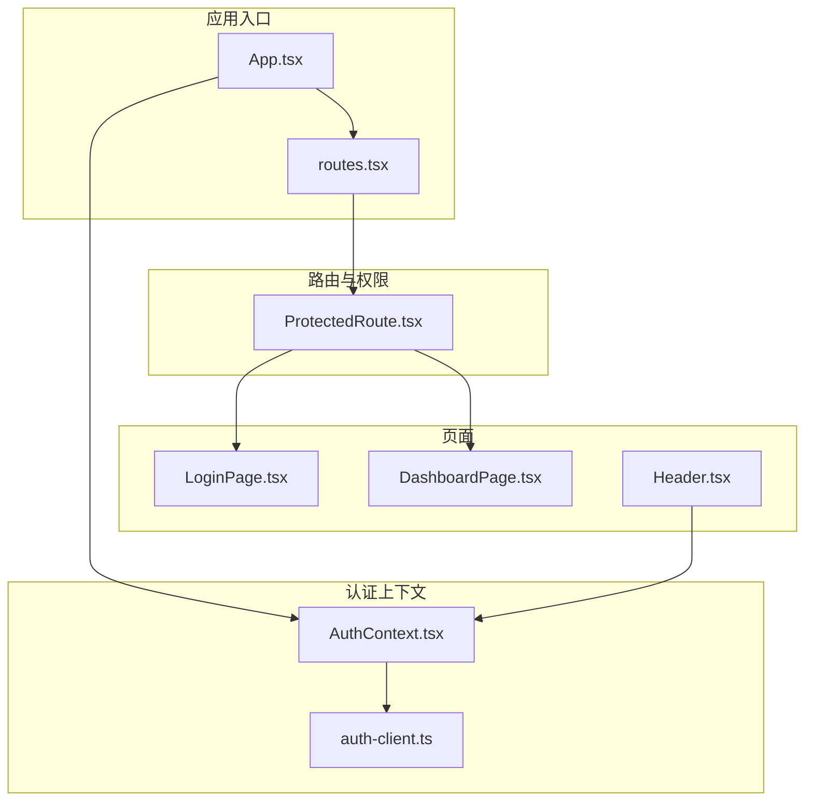
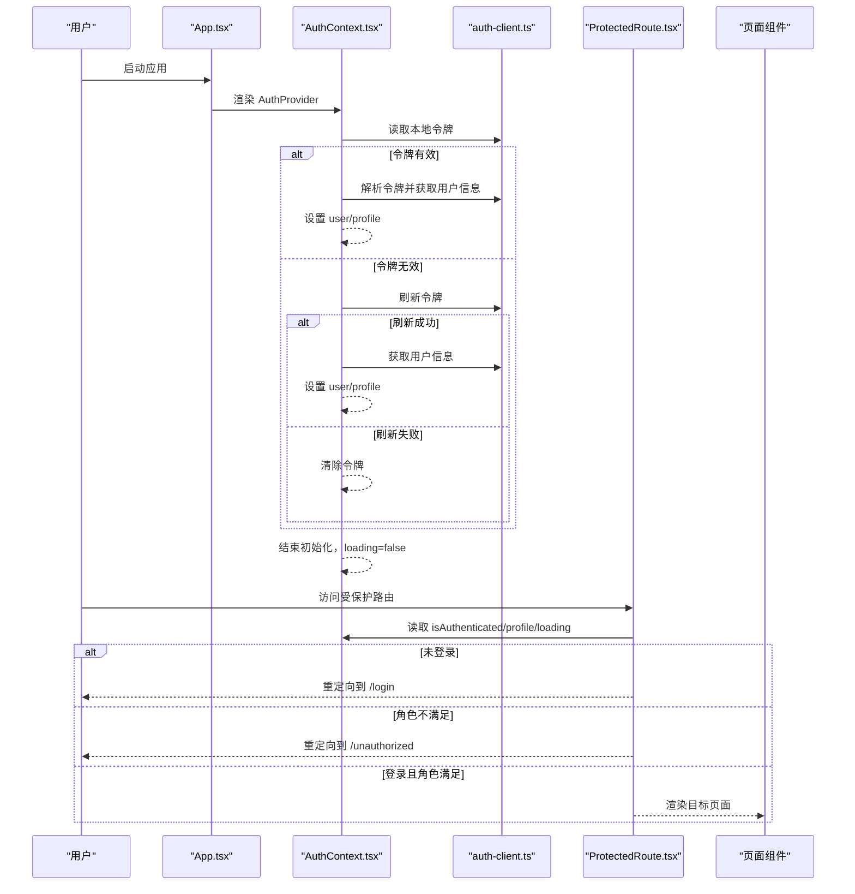
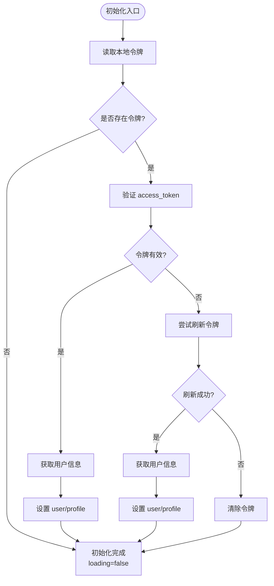
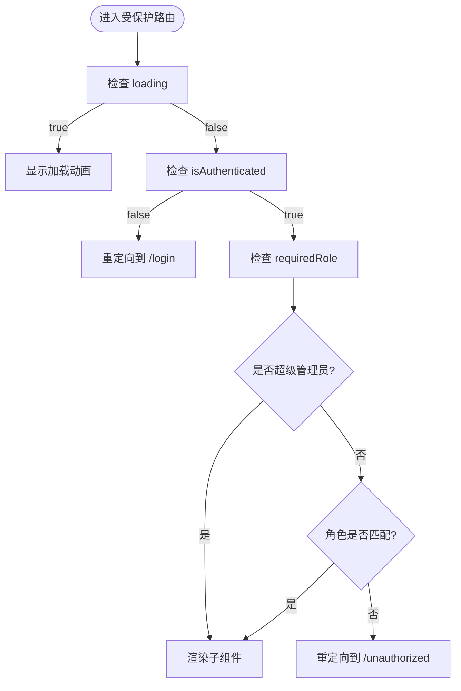
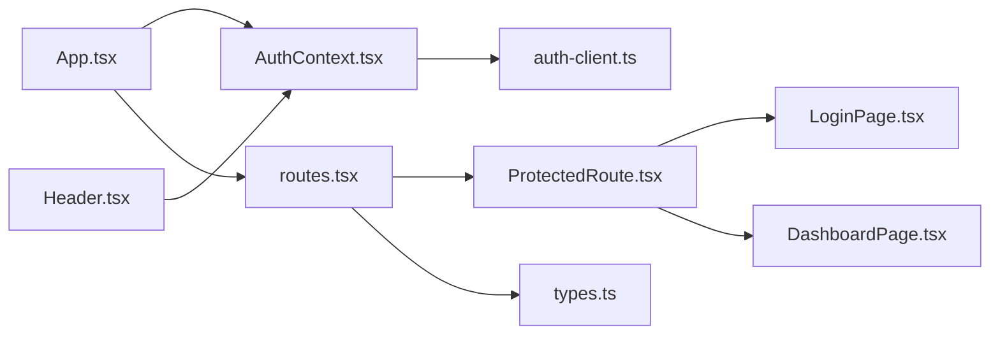

# 全局状态管理

<cite>
**本文引用的文件**
- [AuthContext.tsx](file://src/contexts/AuthContext.tsx)
- [ProtectedRoute.tsx](file://src/components/auth/ProtectedRoute.tsx)
- [LoginPage.tsx](file://src/pages/auth/LoginPage.tsx)
- [DashboardPage.tsx](file://src/pages/DashboardPage.tsx)
- [App.tsx](file://src/App.tsx)
- [routes.tsx](file://src/routes.tsx)
- [auth-client.ts](file://src/services/auth-client.ts)
- [types.ts](file://src/types/types.ts)
- [Header.tsx](file://src/components/common/Header.tsx)
</cite>

## 目录
1. [简介](#简介)
2. [项目结构](#项目结构)
3. [核心组件](#核心组件)
4. [架构总览](#架构总览)
5. [详细组件分析](#详细组件分析)
6. [依赖关系分析](#依赖关系分析)
7. [性能考量](#性能考量)
8. [故障排查指南](#故障排查指南)
9. [结论](#结论)
10. [附录](#附录)

## 简介
本文件围绕 Bio-Appointment 项目中的基于 React Context 的全局状态管理展开，重点解析 AuthContext 的实现机制与使用方式，涵盖以下方面：
- 用户认证状态的存储、更新与跨组件共享
- 在 ProtectedRoute 组件中的路由权限控制与登录状态检测
- Context Provider 的初始化流程、状态更新逻辑与消费者组件的订阅模式
- 与前端页面（如 LoginPage、DashboardPage）的集成方式
- 常见问题（状态丢失、重渲染优化）的解决方案
- 与 TypeScript 类型系统的集成实践

## 项目结构
本项目的认证与路由权限控制主要分布在以下模块：
- 上下文层：AuthContext 提供认证状态与操作方法
- 路由层：App 与 routes 定义路由配置；ProtectedRoute 实现权限校验
- 页面层：LoginPage、DashboardPage 等页面消费认证状态
- 服务层：auth-client 封装与后端交互的认证 API

图表来源
- [App.tsx](file://src/App.tsx#L1-L62)
- [routes.tsx](file://src/routes.tsx#L1-L135)
- [AuthContext.tsx](file://src/contexts/AuthContext.tsx#L1-L308)
- [auth-client.ts](file://src/services/auth-client.ts#L1-L235)
- [ProtectedRoute.tsx](file://src/components/auth/ProtectedRoute.tsx#L1-L49)
- [LoginPage.tsx](file://src/pages/auth/LoginPage.tsx#L1-L158)
- [DashboardPage.tsx](file://src/pages/DashboardPage.tsx#L1-L157)
- [Header.tsx](file://src/components/common/Header.tsx#L1-L196)

章节来源
- [App.tsx](file://src/App.tsx#L1-L62)
- [routes.tsx](file://src/routes.tsx#L1-L135)

## 核心组件
- AuthContext：提供认证状态与操作方法，封装本地令牌存储、用户资料拉取、登录/登出/注册、密码修改、令牌自动续期等能力
- ProtectedRoute：在路由层对登录态与角色权限进行校验，未登录或无权限时进行重定向
- LoginPage：调用 AuthContext 的 login 方法完成登录，并在成功后跳转
- DashboardPage：作为受保护页面之一，展示工作台内容
- Header：根据认证状态与角色动态渲染导航与用户信息
- auth-client：封装与后端 API 的交互，包括登录、注册、令牌刷新、用户信息获取、密码修改、登出等

章节来源
- [AuthContext.tsx](file://src/contexts/AuthContext.tsx#L1-L308)
- [ProtectedRoute.tsx](file://src/components/auth/ProtectedRoute.tsx#L1-L49)
- [LoginPage.tsx](file://src/pages/auth/LoginPage.tsx#L1-L158)
- [DashboardPage.tsx](file://src/pages/DashboardPage.tsx#L1-L157)
- [Header.tsx](file://src/components/common/Header.tsx#L1-L196)
- [auth-client.ts](file://src/services/auth-client.ts#L1-L235)

## 架构总览
整体认证与权限控制流程如下：
- 应用启动时，App 包裹 AuthProvider，初始化认证状态
- 初始化阶段尝试读取本地存储的令牌，验证或刷新后设置用户状态
- 用户访问受保护路由时，ProtectedRoute 读取认证状态并进行登录态与角色校验
- 页面组件通过 useAuth 订阅认证上下文，实现跨组件共享与状态更新

图表来源
- [App.tsx](file://src/App.tsx#L1-L62)
- [AuthContext.tsx](file://src/contexts/AuthContext.tsx#L74-L138)
- [auth-client.ts](file://src/services/auth-client.ts#L182-L232)
- [ProtectedRoute.tsx](file://src/components/auth/ProtectedRoute.tsx#L12-L49)

## 详细组件分析

### AuthContext 实现机制
- 状态与类型
  - user：包含用户标识与可选的 profile
  - profile：后端返回的用户资料（含角色等）
  - loading：初始化阶段的加载状态
  - 计算属性：isAuthenticated、isAdmin
  - 方法：login、logout、register、refreshUser、changePassword
- 令牌管理
  - 本地存储键：access_token 与 refresh_token
  - 支持开发环境的 mock 令牌（不严格过期）
- 初始化流程
  - 启动时读取本地令牌
  - 若 access_token 有效则直接拉取用户信息
  - 若无效则尝试使用 refresh_token 刷新并重试
  - 失败则清除令牌，结束初始化
- 自动续期
  - 每分钟检查 access_token 剩余有效期
  - 距离过期 5 分钟内自动刷新
  - 已过期或验证失败则触发登出
- 登录/注册/登出/改密
  - login：调用后端登录接口，成功后写入令牌并设置状态
  - register：先注册再自动登录
  - logout：清理本地令牌与状态，并调用后端登出
  - changePassword：在有用户态时调用后端修改密码
- 订阅与错误处理
  - useAuth：在 AuthProvider 外使用会抛错，确保上下文包裹
  - 对令牌读取、刷新、用户拉取过程均做异常捕获与清理

图表来源
- [AuthContext.tsx](file://src/contexts/AuthContext.tsx#L74-L138)
- [auth-client.ts](file://src/services/auth-client.ts#L182-L232)

章节来源
- [AuthContext.tsx](file://src/contexts/AuthContext.tsx#L1-L308)
- [auth-client.ts](file://src/services/auth-client.ts#L1-L235)

### ProtectedRoute 路由权限控制
- 功能要点
  - 读取 loading、isAuthenticated、profile
  - loading 期间显示加载动画
  - 未登录重定向至 /login
  - 存在 requiredRole 时，若用户角色不在允许列表则重定向至 /unauthorized
  - 超级管理员拥有全部权限
- 与路由配置的关系
  - routes.tsx 中为每个路由声明 requireAuth 与 requiredRole
  - App.tsx 将受保护路由包装在 ProtectedRoute 下

图表来源
- [ProtectedRoute.tsx](file://src/components/auth/ProtectedRoute.tsx#L12-L49)
- [routes.tsx](file://src/routes.tsx#L39-L135)
- [App.tsx](file://src/App.tsx#L16-L49)

章节来源
- [ProtectedRoute.tsx](file://src/components/auth/ProtectedRoute.tsx#L1-L49)
- [routes.tsx](file://src/routes.tsx#L1-L135)
- [App.tsx](file://src/App.tsx#L1-L62)

### Context Provider 初始化流程与状态更新逻辑
- 初始化阶段
  - 读取本地令牌
  - 验证 access_token 并拉取用户信息
  - 若 access_token 无效，尝试 refresh_token 刷新
  - 失败则清除令牌，最终结束 loading
- 状态更新
  - login：设置 user/profile，存储令牌
  - logout：清除令牌与状态，调用后端登出
  - register：注册后自动 login
  - changePassword：在有用户态时调用后端修改密码
  - refreshUser：按需刷新用户资料
- 订阅模式
  - useAuth 返回上下文值，消费者组件在渲染时订阅状态变化
  - 由于 Provider 仅在 App.tsx 顶层包裹一次，所有受保护路由下的组件均可共享同一上下文实例

章节来源
- [AuthContext.tsx](file://src/contexts/AuthContext.tsx#L74-L297)
- [App.tsx](file://src/App.tsx#L52-L61)

### 与前端页面的集成方式
- LoginPage
  - 使用 useForm 与 Zod 校验表单
  - 调用 useAuth().login 完成登录
  - 成功后提示并跳转到首页
- DashboardPage
  - 作为受保护路由下的页面，可直接使用后端 API 获取统计数据
  - 与认证上下文无直接耦合，但依赖 ProtectedRoute 的保护
- Header
  - 使用 useAuth() 读取 profile 与 isAuthenticated
  - 根据角色过滤可访问的导航项
  - 提供退出登录按钮，调用后端登出并跳转

章节来源
- [LoginPage.tsx](file://src/pages/auth/LoginPage.tsx#L1-L158)
- [DashboardPage.tsx](file://src/pages/DashboardPage.tsx#L1-L157)
- [Header.tsx](file://src/components/common/Header.tsx#L1-L196)

### 与 TypeScript 类型系统的集成实践
- 类型定义
  - UserRole、UserStatus、ServiceCategory、ResourceType、AppointmentStatus、ScheduleStatus、TaskExecutionStatus 等基础类型
  - Profile、PublicProfile、AuthUser、LoginCredentials、RegisterCredentials 等认证相关类型
- 在上下文中
  - AuthContextType 明确导出 user、profile、loading、isAuthenticated、isAdmin 与各方法签名
  - ClientAuthService 的静态方法返回 Promise<T>，便于在上下文中统一处理异步结果
- 在路由与页面
  - routes.tsx 中的 requiredRole 使用 UserRole 或 UserRole[]，与类型定义一致
  - ProtectedRoute 使用 UserRole 类型进行角色判断

章节来源
- [types.ts](file://src/types/types.ts#L1-L120)
- [AuthContext.tsx](file://src/contexts/AuthContext.tsx#L17-L33)
- [auth-client.ts](file://src/services/auth-client.ts#L1-L60)
- [routes.tsx](file://src/routes.tsx#L1-L38)

## 依赖关系分析
- App.tsx 依赖 AuthProvider 与 routes.tsx，负责路由与认证上下文的组合
- ProtectedRoute 依赖 useAuth 与路由配置，实现权限控制
- LoginPage 依赖 useAuth 与路由跳转
- Header 依赖 useAuth 与路由配置，动态渲染导航
- AuthContext 依赖 auth-client.ts 进行后端交互
- routes.tsx 与 types.ts 为路由与类型契约

图表来源
- [App.tsx](file://src/App.tsx#L1-L62)
- [AuthContext.tsx](file://src/contexts/AuthContext.tsx#L1-L308)
- [ProtectedRoute.tsx](file://src/components/auth/ProtectedRoute.tsx#L1-L49)
- [LoginPage.tsx](file://src/pages/auth/LoginPage.tsx#L1-L158)
- [DashboardPage.tsx](file://src/pages/DashboardPage.tsx#L1-L157)
- [Header.tsx](file://src/components/common/Header.tsx#L1-L196)
- [routes.tsx](file://src/routes.tsx#L1-L135)
- [types.ts](file://src/types/types.ts#L1-L120)
- [auth-client.ts](file://src/services/auth-client.ts#L1-L235)

章节来源
- [App.tsx](file://src/App.tsx#L1-L62)
- [routes.tsx](file://src/routes.tsx#L1-L135)

## 性能考量
- 令牌自动续期
  - 每分钟检查一次令牌有效期，提前 5 分钟刷新，避免频繁刷新导致的抖动
  - 对于开发环境的 mock 令牌，跳过过期检查，提升开发体验
- 初始化阶段
  - 仅在首次挂载时执行初始化逻辑，避免重复请求
  - 初始化完成后设置 loading=false，减少不必要的重渲染
- 订阅粒度
  - useAuth 返回整个上下文对象，消费者组件应尽量只读取所需字段，避免不必要的重渲染
  - 如需细粒度订阅，可在上层拆分多个 Context 或使用 useMemo/useCallback 优化

[本节为通用性能建议，无需列出具体文件来源]

## 故障排查指南
- 状态丢失
  - 现象：刷新页面后登录状态消失
  - 排查：确认本地存储键是否正确，检查初始化流程是否成功读取并验证令牌
  - 参考路径：[AuthContext.tsx](file://src/contexts/AuthContext.tsx#L74-L138)、[auth-client.ts](file://src/services/auth-client.ts#L182-L232)
- 登录成功但未跳转
  - 现象：登录成功后仍停留在登录页
  - 排查：确认 ProtectedRoute 的 requireAuth 与 requiredRole 配置，检查 App.tsx 的路由包装
  - 参考路径：[LoginPage.tsx](file://src/pages/auth/LoginPage.tsx#L34-L70)、[App.tsx](file://src/App.tsx#L16-L49)、[routes.tsx](file://src/routes.tsx#L39-L135)
- 角色权限不生效
  - 现象：超级管理员无法访问某些路由
  - 排查：确认 profile.role 是否正确，ProtectedRoute 是否正确识别 super_admin
  - 参考路径：[ProtectedRoute.tsx](file://src/components/auth/ProtectedRoute.tsx#L12-L49)、[types.ts](file://src/types/types.ts#L1-L120)
- 令牌过期导致频繁登出
  - 现象：页面频繁被重定向到登录页
  - 排查：检查令牌有效期与自动续期逻辑，确认 refresh_token 是否有效
  - 参考路径：[AuthContext.tsx](file://src/contexts/AuthContext.tsx#L232-L276)、[auth-client.ts](file://src/services/auth-client.ts#L112-L126)
- 重渲染优化
  - 建议：在消费者组件中仅读取必要字段，避免将整个上下文对象作为依赖传入高阶组件或 Effect
  - 参考路径：[AuthContext.tsx](file://src/contexts/AuthContext.tsx#L283-L297)

章节来源
- [AuthContext.tsx](file://src/contexts/AuthContext.tsx#L74-L297)
- [auth-client.ts](file://src/services/auth-client.ts#L112-L232)
- [ProtectedRoute.tsx](file://src/components/auth/ProtectedRoute.tsx#L12-L49)
- [routes.tsx](file://src/routes.tsx#L39-L135)
- [App.tsx](file://src/App.tsx#L16-L49)
- [types.ts](file://src/types/types.ts#L1-L120)

## 结论
本项目采用 React Context 实现全局认证状态管理，配合自定义 Hook 与路由守卫，实现了：
- 令牌持久化与自动续期
- 登录态与角色权限的统一校验
- 页面间的状态共享与订阅
- 与 TypeScript 类型系统的良好集成

通过 Provider 的初始化流程与消费者组件的订阅模式，系统在保证安全性的同时，提供了良好的用户体验与可维护性。

[本节为总结性内容，无需列出具体文件来源]

## 附录
- 关键流程路径参考
  - 初始化与令牌续期：[AuthContext.tsx](file://src/contexts/AuthContext.tsx#L74-L276)
  - 登录/注册/登出/改密：[AuthContext.tsx](file://src/contexts/AuthContext.tsx#L154-L213)
  - 路由权限控制：[ProtectedRoute.tsx](file://src/components/auth/ProtectedRoute.tsx#L12-L49)、[routes.tsx](file://src/routes.tsx#L39-L135)
  - 页面集成：[LoginPage.tsx](file://src/pages/auth/LoginPage.tsx#L34-L70)、[DashboardPage.tsx](file://src/pages/DashboardPage.tsx#L1-L157)、[Header.tsx](file://src/components/common/Header.tsx#L1-L196)
  - 类型定义：[types.ts](file://src/types/types.ts#L1-L120)
  - 后端交互：[auth-client.ts](file://src/services/auth-client.ts#L1-L235)

[本节为补充参考，无需列出具体文件来源]