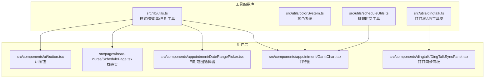
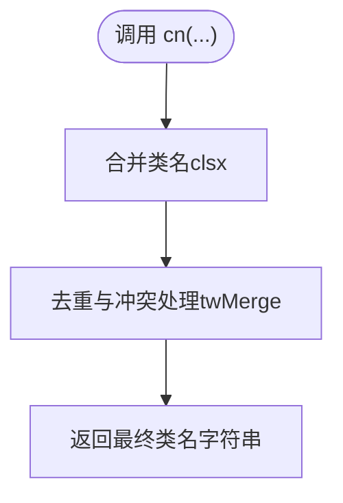
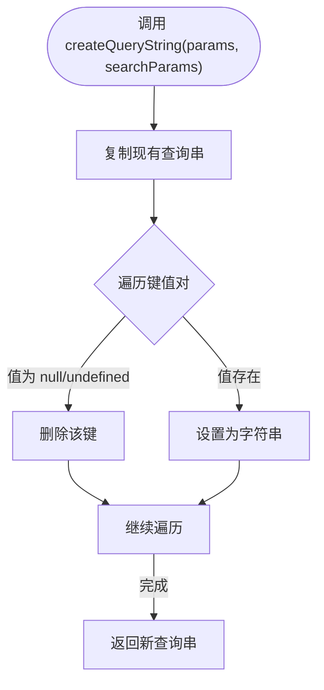
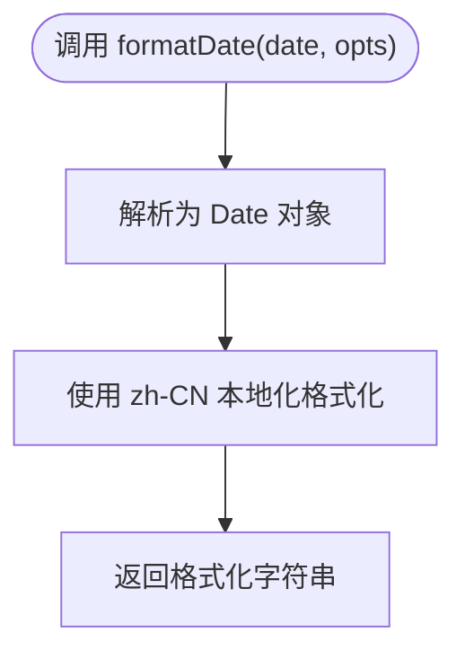
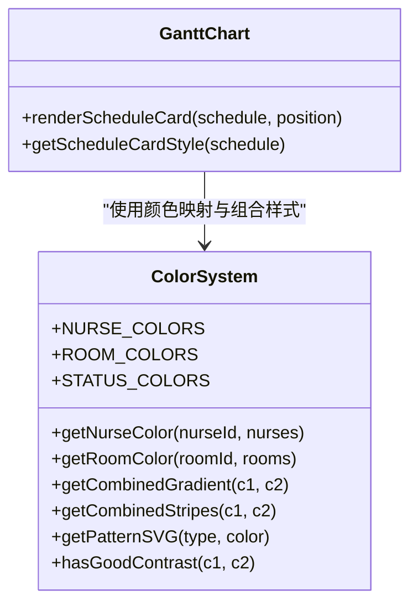
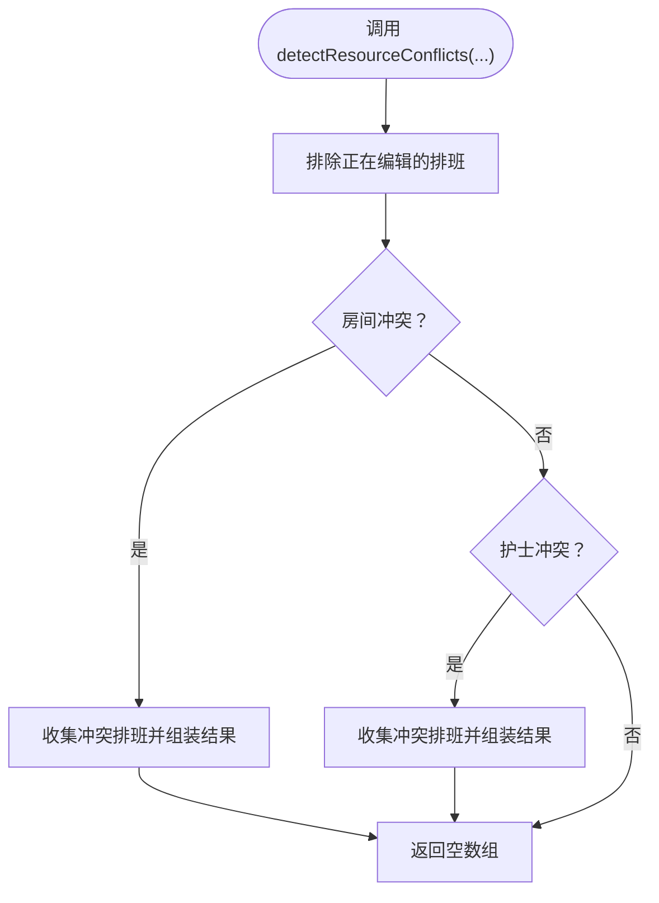
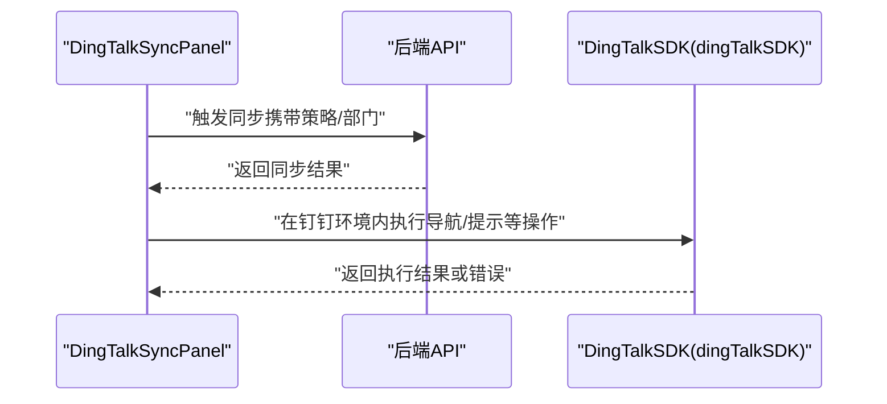
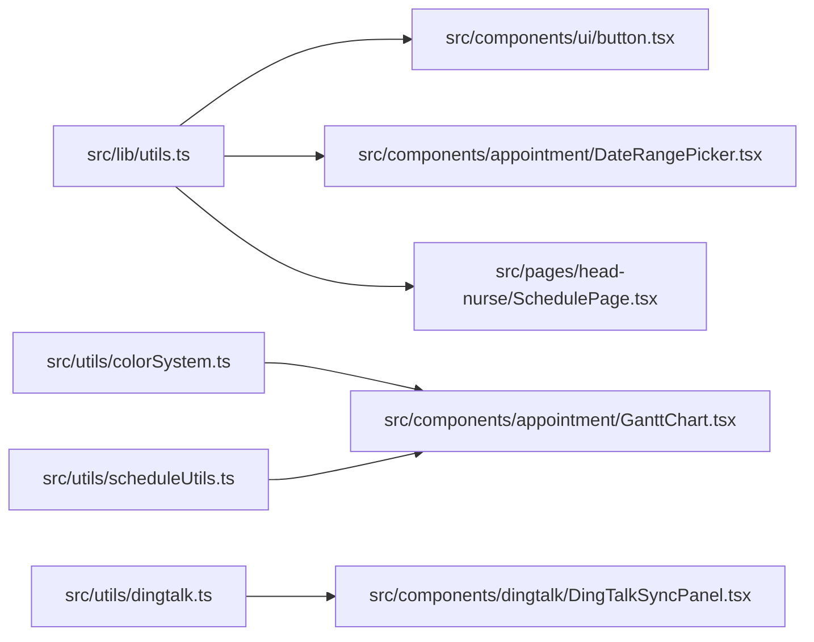

# 工具函数库

<cite>
**本文引用的文件**
- [src/lib/utils.ts](file://src/lib/utils.ts)
- [src/utils/colorSystem.ts](file://src/utils/colorSystem.ts)
- [src/utils/scheduleUtils.ts](file://src/utils/scheduleUtils.ts)
- [src/utils/dingtalk.ts](file://src/utils/dingtalk.ts)
- [src/components/appointment/GanttChart.tsx](file://src/components/appointment/GanttChart.tsx)
- [src/components/dingtalk/DingTalkSyncPanel.tsx](file://src/components/dingtalk/DingTalkSyncPanel.tsx)
- [src/components/appointment/DateRangePicker.tsx](file://src/components/appointment/DateRangePicker.tsx)
- [src/pages/head-nurse/SchedulePage.tsx](file://src/pages/head-nurse/SchedulePage.tsx)
- [src/components/ui/button.tsx](file://src/components/ui/button.tsx)
- [src/types/types.ts](file://src/types/types.ts)
</cite>

## 目录
1. [简介](#简介)
2. [项目结构](#项目结构)
3. [核心组件](#核心组件)
4. [架构总览](#架构总览)
5. [详细组件分析](#详细组件分析)
6. [依赖分析](#依赖分析)
7. [性能考虑](#性能考虑)
8. [故障排查指南](#故障排查指南)
9. [结论](#结论)
10. [附录](#附录)

## 简介
本文件面向 src/lib/utils.ts 工具函数库进行全面技术文档梳理，系统化说明其封装的通用工具方法，包括：
- 样式类名合并工具：cn
- URL 查询串构建工具：createQueryString
- 日期格式化工具：formatDate
- 颜色系统处理函数：护士/房间颜色映射、组合渐变、图案SVG、对比度校验
- 排班时间计算辅助函数：时间重叠检测、资源冲突检测
- 钉钉集成相关格式化工具：基于钉钉JSAPI的工具类与单例

文档将详细说明每个函数的输入参数、返回值、业务逻辑及调用场景，并结合前端各模块（如 appointment、dingtalk）中的依赖关系与调用链路，提供使用示例、边界情况处理说明，强调其在保持代码整洁性和避免重复逻辑中的关键作用。

## 项目结构
工具函数库位于 src/lib/utils.ts，同时颜色系统、排班时间工具、钉钉集成工具分别位于 src/utils/ 下，前端组件在 appointment、dingtalk 等目录中按需调用。

图表来源
- [src/lib/utils.ts](file://src/lib/utils.ts#L1-L39)
- [src/utils/colorSystem.ts](file://src/utils/colorSystem.ts#L1-L140)
- [src/utils/scheduleUtils.ts](file://src/utils/scheduleUtils.ts#L1-L112)
- [src/utils/dingtalk.ts](file://src/utils/dingtalk.ts#L1-L329)
- [src/components/appointment/GanttChart.tsx](file://src/components/appointment/GanttChart.tsx#L1-L120)
- [src/components/dingtalk/DingTalkSyncPanel.tsx](file://src/components/dingtalk/DingTalkSyncPanel.tsx#L1-L84)
- [src/components/appointment/DateRangePicker.tsx](file://src/components/appointment/DateRangePicker.tsx#L1-L52)
- [src/pages/head-nurse/SchedulePage.tsx](file://src/pages/head-nurse/SchedulePage.tsx#L59-L89)
- [src/components/ui/button.tsx](file://src/components/ui/button.tsx#L1-L58)

章节来源
- [src/lib/utils.ts](file://src/lib/utils.ts#L1-L39)
- [src/utils/colorSystem.ts](file://src/utils/colorSystem.ts#L1-L140)
- [src/utils/scheduleUtils.ts](file://src/utils/scheduleUtils.ts#L1-L112)
- [src/utils/dingtalk.ts](file://src/utils/dingtalk.ts#L1-L329)

## 核心组件
本节聚焦 src/lib/utils.ts 的三个导出函数及其在项目中的应用。

- 样式类名合并工具 cn
  - 作用：合并多个类名，解决 Tailwind CSS 类名冲突问题
  - 调用方：UI 组件（如 Button）
  - 示例路径：[src/components/ui/button.tsx](file://src/components/ui/button.tsx#L1-L58)

- URL 查询串构建工具 createQueryString
  - 作用：基于现有 URLSearchParams，按键值对更新查询参数，支持删除/设置
  - 调用方：日期范围选择器（构建视图切换的查询串）
  - 示例路径：[src/components/appointment/DateRangePicker.tsx](file://src/components/appointment/DateRangePicker.tsx#L1-L52)

- 日期格式化工具 formatDate
  - 作用：以“zh-CN”本地化格式输出日期字符串
  - 调用方：排班页、日期范围选择器等
  - 示例路径：[src/pages/head-nurse/SchedulePage.tsx](file://src/pages/head-nurse/SchedulePage.tsx#L59-L89)、[src/components/appointment/DateRangePicker.tsx](file://src/components/appointment/DateRangePicker.tsx#L20-L52)

章节来源
- [src/lib/utils.ts](file://src/lib/utils.ts#L1-L39)
- [src/components/ui/button.tsx](file://src/components/ui/button.tsx#L1-L58)
- [src/components/appointment/DateRangePicker.tsx](file://src/components/appointment/DateRangePicker.tsx#L1-L52)
- [src/pages/head-nurse/SchedulePage.tsx](file://src/pages/head-nurse/SchedulePage.tsx#L59-L89)

## 架构总览
工具函数库在前端模块中的职责划分如下：
- 样式与类名：统一由 cn 处理，避免重复拼接与冲突
- URL 参数：统一由 createQueryString 处理，保证路由/筛选参数的一致性
- 日期格式化：统一由 formatDate 处理，确保本地化与一致性
- 颜色系统：独立于 UI 组件，提供护士/房间颜色映射与组合样式
- 排班时间：独立于 UI 组件，提供时间重叠与资源冲突检测
- 钉钉集成：独立于 UI 组件，提供 JSAPI 封装与单例管理

```mermaid
graph TB
subgraph "样式与类名"
CN["cn(...inputs)"]
end
subgraph "URL参数"
CQS["createQueryString(params, searchParams)"]
end
subgraph "日期格式化"
FD["formatDate(date, opts)"]
end
subgraph "颜色系统"
NCS["NURSE_COLORS"]
RCS["ROOM_COLORS"]
GNC["getNurseColor(nurseId, nurses)"]
GRC["getRoomColor(roomId, rooms)"]
CG["getCombinedGradient(c1, c2)"]
PSVG["getPatternSVG(type, color)"]
WC["hasGoodContrast(c1, c2)"]
end
subgraph "排班时间"
OVL["isTimeOverlap(start1, end1, start2, end2)"]
CRC["detectResourceConflicts(existing, new, excludeId)"]
end
subgraph "钉钉集成"
DTS["DingTalkSDK 类"]
DSI["dingTalkSDK 单例"]
end
CN --> |"UI组件"| UI["UI组件"]
CQS --> |"路由/筛选"| UI
FD --> |"日期显示"| UI
GNC --> |"护士颜色"| UI
GRC --> |"房间颜色"| UI
CG --> |"组合样式"| UI
PSVG --> |"辅助识别"| UI
WC --> |"对比度校验"| UI
OVL --> |"时间重叠"| UI
CRC --> |"冲突检测"| UI
DTS --> |"JSAPI封装"| DTP["钉钉同步面板"]
DSI --> |"单例"| DTP
```

图表来源
- [src/lib/utils.ts](file://src/lib/utils.ts#L1-L39)
- [src/utils/colorSystem.ts](file://src/utils/colorSystem.ts#L1-L140)
- [src/utils/scheduleUtils.ts](file://src/utils/scheduleUtils.ts#L1-L112)
- [src/utils/dingtalk.ts](file://src/utils/dingtalk.ts#L1-L329)
- [src/components/appointment/GanttChart.tsx](file://src/components/appointment/GanttChart.tsx#L1-L120)
- [src/components/dingtalk/DingTalkSyncPanel.tsx](file://src/components/dingtalk/DingTalkSyncPanel.tsx#L1-L84)

## 详细组件分析

### 样式类名合并工具：cn
- 函数签名与行为
  - 输入：可变参数，接受任意数量的类名或条件类名
  - 输出：合并后的类名字符串，自动处理冲突
  - 依赖：clsx、tailwind-merge
- 调用场景
  - UI 组件（如 Button）通过 cn 统一合并变体与自定义类名
- 使用示例（路径）
  - [src/components/ui/button.tsx](file://src/components/ui/button.tsx#L1-L58)

图表来源
- [src/lib/utils.ts](file://src/lib/utils.ts#L1-L6)
- [src/components/ui/button.tsx](file://src/components/ui/button.tsx#L1-L58)

章节来源
- [src/lib/utils.ts](file://src/lib/utils.ts#L1-L6)
- [src/components/ui/button.tsx](file://src/components/ui/button.tsx#L1-L58)

### URL 查询串构建工具：createQueryString
- 函数签名与行为
  - 输入：params（部分键值对）、searchParams（现有查询串）
  - 输出：新的查询串字符串
  - 逻辑：遍历键值对，若值为 null 或 undefined 则删除该键；否则设置为字符串
- 调用场景
  - 日期范围选择器根据视图模式动态构建查询串，实现视图切换
- 使用示例（路径）
  - [src/components/appointment/DateRangePicker.tsx](file://src/components/appointment/DateRangePicker.tsx#L1-L52)

图表来源
- [src/lib/utils.ts](file://src/lib/utils.ts#L12-L27)
- [src/components/appointment/DateRangePicker.tsx](file://src/components/appointment/DateRangePicker.tsx#L1-L52)

章节来源
- [src/lib/utils.ts](file://src/lib/utils.ts#L12-L27)
- [src/components/appointment/DateRangePicker.tsx](file://src/components/appointment/DateRangePicker.tsx#L1-L52)

### 日期格式化工具：formatDate
- 函数签名与行为
  - 输入：日期（Date | string | number）、格式化选项（Intl.DateTimeFormatOptions）
  - 输出：本地化日期字符串（zh-CN）
- 调用场景
  - 排班页根据视图模式计算日期范围并格式化显示
  - 日期范围选择器根据视图模式显示不同粒度的日期文本
- 使用示例（路径）
  - [src/pages/head-nurse/SchedulePage.tsx](file://src/pages/head-nurse/SchedulePage.tsx#L59-L89)
  - [src/components/appointment/DateRangePicker.tsx](file://src/components/appointment/DateRangePicker.tsx#L20-L52)

图表来源
- [src/lib/utils.ts](file://src/lib/utils.ts#L29-L39)
- [src/pages/head-nurse/SchedulePage.tsx](file://src/pages/head-nurse/SchedulePage.tsx#L59-L89)
- [src/components/appointment/DateRangePicker.tsx](file://src/components/appointment/DateRangePicker.tsx#L20-L52)

章节来源
- [src/lib/utils.ts](file://src/lib/utils.ts#L29-L39)
- [src/pages/head-nurse/SchedulePage.tsx](file://src/pages/head-nurse/SchedulePage.tsx#L59-L89)
- [src/components/appointment/DateRangePicker.tsx](file://src/components/appointment/DateRangePicker.tsx#L20-L52)

### 颜色系统处理函数
- 护士/房间颜色方案
  - NURSE_COLORS：暖色调与明亮色系，用于护士
  - ROOM_COLORS：冷色调与中性色系，用于房间
- 颜色映射
  - getNurseColor(nurseId, nurses)：根据护士ID映射到固定颜色
  - getRoomColor(roomId, rooms)：根据房间ID映射到固定颜色
- 组合样式
  - getCombinedGradient(nurseColor, roomColor)：生成护士-房间组合渐变
  - getCombinedStripes(nurseColor, roomColor)：生成双色条纹
- 图案与对比度
  - getPatternSVG(patternType, color)：生成SVG图案定义（辅助色盲识别）
  - hasGoodContrast(color1, color2)：检查对比度是否满足WCAG AA标准
- 调用场景
  - 甘特图组件使用 getNurseColor/getRoomColor 为排班卡片生成组合颜色样式
  - 颜色系统演示页面展示颜色方案与组合效果
- 使用示例（路径）
  - [src/components/appointment/GanttChart.tsx](file://src/components/appointment/GanttChart.tsx#L1-L120)
  - [src/utils/colorSystem.ts](file://src/utils/colorSystem.ts#L1-L140)

图表来源
- [src/utils/colorSystem.ts](file://src/utils/colorSystem.ts#L1-L140)
- [src/components/appointment/GanttChart.tsx](file://src/components/appointment/GanttChart.tsx#L1-L120)

章节来源
- [src/utils/colorSystem.ts](file://src/utils/colorSystem.ts#L1-L140)
- [src/components/appointment/GanttChart.tsx](file://src/components/appointment/GanttChart.tsx#L1-L120)

### 排班时间计算辅助函数
- 时间重叠检测
  - isTimeOverlap(start1, end1, start2, end2)：判断两个时间段是否重叠
- 资源冲突检测
  - detectResourceConflicts(existingSchedules, newSchedule, excludeScheduleId?)：检测房间/护士冲突
- 调用场景
  - 甘特图组件内部使用 isTimeOverlap 对重叠排班进行分行排列
  - 排班管理流程中用于冲突检测与提示
- 使用示例（路径）
  - [src/utils/scheduleUtils.ts](file://src/utils/scheduleUtils.ts#L1-L112)
  - [src/components/appointment/GanttChart.tsx](file://src/components/appointment/GanttChart.tsx#L271-L318)

图表来源
- [src/utils/scheduleUtils.ts](file://src/utils/scheduleUtils.ts#L36-L111)
- [src/components/appointment/GanttChart.tsx](file://src/components/appointment/GanttChart.tsx#L271-L318)

章节来源
- [src/utils/scheduleUtils.ts](file://src/utils/scheduleUtils.ts#L1-L112)
- [src/components/appointment/GanttChart.tsx](file://src/components/appointment/GanttChart.tsx#L271-L318)

### 钉钉集成相关格式化工具
- DingTalkSDK 类
  - 提供环境检测、初始化、免登授权码获取、导航栏控制、页面关闭、扫码、Toast/Alert/Confirm、分享、地理位置、图片预览、打开链接、网络状态等能力
  - 通过单例 dingTalkSDK 在组件中使用
- 调用场景
  - 钉钉同步面板通过 API 调用触发同步、加载配置与日志
- 使用示例（路径）
  - [src/utils/dingtalk.ts](file://src/utils/dingtalk.ts#L1-L329)
  - [src/components/dingtalk/DingTalkSyncPanel.tsx](file://src/components/dingtalk/DingTalkSyncPanel.tsx#L1-L84)

图表来源
- [src/components/dingtalk/DingTalkSyncPanel.tsx](file://src/components/dingtalk/DingTalkSyncPanel.tsx#L1-L84)
- [src/utils/dingtalk.ts](file://src/utils/dingtalk.ts#L1-L329)

章节来源
- [src/utils/dingtalk.ts](file://src/utils/dingtalk.ts#L1-L329)
- [src/components/dingtalk/DingTalkSyncPanel.tsx](file://src/components/dingtalk/DingTalkSyncPanel.tsx#L1-L84)

## 依赖分析
- 内部依赖
  - GanttChart 组件依赖颜色系统与日期工具（通过导入使用）
  - UI Button 组件依赖 cn 工具
  - 日期范围选择器依赖 createQueryString/formatDate
  - 排班页依赖 formatDate
- 外部依赖
  - 样式类名合并：clsx、tailwind-merge
  - 日期格式化：Intl.DateTimeFormat（浏览器原生）
  - 钉钉 JSAPI：dingtalk-jsapi
- 耦合与内聚
  - 工具函数库保持低耦合、高内聚，便于跨模块复用
  - 颜色系统与排班时间工具与 UI 组件解耦，仅通过函数调用交互
  - 钉钉工具类通过单例对外暴露，避免重复初始化

图表来源
- [src/lib/utils.ts](file://src/lib/utils.ts#L1-L39)
- [src/utils/colorSystem.ts](file://src/utils/colorSystem.ts#L1-L140)
- [src/utils/scheduleUtils.ts](file://src/utils/scheduleUtils.ts#L1-L112)
- [src/utils/dingtalk.ts](file://src/utils/dingtalk.ts#L1-L329)
- [src/components/appointment/GanttChart.tsx](file://src/components/appointment/GanttChart.tsx#L1-L120)
- [src/components/dingtalk/DingTalkSyncPanel.tsx](file://src/components/dingtalk/DingTalkSyncPanel.tsx#L1-L84)
- [src/components/appointment/DateRangePicker.tsx](file://src/components/appointment/DateRangePicker.tsx#L1-L52)
- [src/pages/head-nurse/SchedulePage.tsx](file://src/pages/head-nurse/SchedulePage.tsx#L59-L89)
- [src/components/ui/button.tsx](file://src/components/ui/button.tsx#L1-L58)

章节来源
- [src/lib/utils.ts](file://src/lib/utils.ts#L1-L39)
- [src/utils/colorSystem.ts](file://src/utils/colorSystem.ts#L1-L140)
- [src/utils/scheduleUtils.ts](file://src/utils/scheduleUtils.ts#L1-L112)
- [src/utils/dingtalk.ts](file://src/utils/dingtalk.ts#L1-L329)
- [src/components/appointment/GanttChart.tsx](file://src/components/appointment/GanttChart.tsx#L1-L120)
- [src/components/dingtalk/DingTalkSyncPanel.tsx](file://src/components/dingtalk/DingTalkSyncPanel.tsx#L1-L84)
- [src/components/appointment/DateRangePicker.tsx](file://src/components/appointment/DateRangePicker.tsx#L1-L52)
- [src/pages/head-nurse/SchedulePage.tsx](file://src/pages/head-nurse/SchedulePage.tsx#L59-L89)
- [src/components/ui/button.tsx](file://src/components/ui/button.tsx#L1-L58)

## 性能考虑
- 样式类名合并
  - cn 仅在组件渲染时进行类名合并，开销极小
  - 建议在组件外部缓存静态类名，减少重复计算
- URL 查询串构建
  - createQueryString 为 O(k)（k 为键数），在高频筛选场景下仍高效
  - 建议配合防抖策略，避免频繁重建查询串
- 日期格式化
  - formatDate 为纯本地化格式化，开销很小
  - 建议在组件外层缓存常用格式化结果，减少重复调用
- 颜色系统
  - 颜色映射为 O(n) 查找（n 为资源数量），可通过哈希表优化至 O(1)
  - 组合样式与 SVG 图案生成在渲染时进行，建议按需生成
- 排班时间工具
  - isTimeOverlap 为 O(1)，detectResourceConflicts 为 O(m)（m 为待比较排班数）
  - 建议在大规模数据时采用索引或分段存储优化
- 钉钉集成
  - JSAPI 调用为异步，注意错误处理与降级方案
  - 避免在非钉钉环境重复初始化

[本节为通用指导，无需列出具体文件来源]

## 故障排查指南
- 样式类名冲突
  - 症状：Tailwind 类名覆盖异常
  - 处理：使用 cn 合并类名，避免手动拼接
  - 参考：[src/components/ui/button.tsx](file://src/components/ui/button.tsx#L1-L58)
- URL 查询串异常
  - 症状：筛选参数丢失或重复
  - 处理：使用 createQueryString 统一更新查询串
  - 参考：[src/components/appointment/DateRangePicker.tsx](file://src/components/appointment/DateRangePicker.tsx#L1-L52)
- 日期格式化错误
  - 症状：Invalid time value 或格式不一致
  - 处理：使用 formatDate 或 date-fns 的 parseISO + isValid 组合
  - 参考：[src/pages/head-nurse/SchedulePage.tsx](file://src/pages/head-nurse/SchedulePage.tsx#L59-L89)
- 颜色对比度不足
  - 症状：文字难以辨识
  - 处理：使用 hasGoodContrast 检查，必要时调整配色
  - 参考：[src/utils/colorSystem.ts](file://src/utils/colorSystem.ts#L121-L139)
- 排班冲突误判
  - 症状：重叠判定错误
  - 处理：核对 isTimeOverlap 的时间格式与边界条件
  - 参考：[src/utils/scheduleUtils.ts](file://src/utils/scheduleUtils.ts#L16-L34)
- 钉钉环境异常
  - 症状：在非钉钉环境报错或行为异常
  - 处理：使用 isDingTalk 检测环境，提供降级方案
  - 参考：[src/utils/dingtalk.ts](file://src/utils/dingtalk.ts#L13-L18)

章节来源
- [src/components/ui/button.tsx](file://src/components/ui/button.tsx#L1-L58)
- [src/components/appointment/DateRangePicker.tsx](file://src/components/appointment/DateRangePicker.tsx#L1-L52)
- [src/pages/head-nurse/SchedulePage.tsx](file://src/pages/head-nurse/SchedulePage.tsx#L59-L89)
- [src/utils/colorSystem.ts](file://src/utils/colorSystem.ts#L121-L139)
- [src/utils/scheduleUtils.ts](file://src/utils/scheduleUtils.ts#L16-L34)
- [src/utils/dingtalk.ts](file://src/utils/dingtalk.ts#L13-L18)

## 结论
src/lib/utils.ts 工具函数库通过简洁而强大的通用工具，显著提升了前端模块的可维护性与一致性：
- 样式类名合并、URL 查询串构建、日期格式化三大基础工具，覆盖 UI 与路由/筛选的核心需求
- 颜色系统与排班时间工具，为可视化与业务逻辑提供稳定支撑
- 钉钉集成工具，为移动端与企业环境提供统一接入方式

建议在新增功能时优先复用这些工具，避免重复造轮子，保持代码整洁与可扩展性。

[本节为总结，无需列出具体文件来源]

## 附录
- 类型定义参考
  - 排班与资源类型定义：[src/types/types.ts](file://src/types/types.ts#L139-L183)

章节来源
- [src/types/types.ts](file://src/types/types.ts#L139-L183)