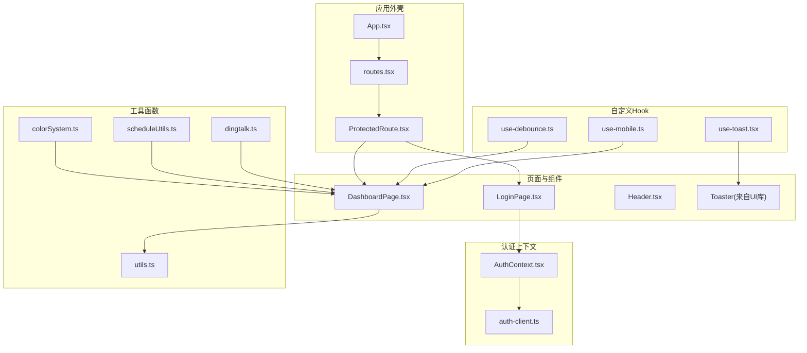
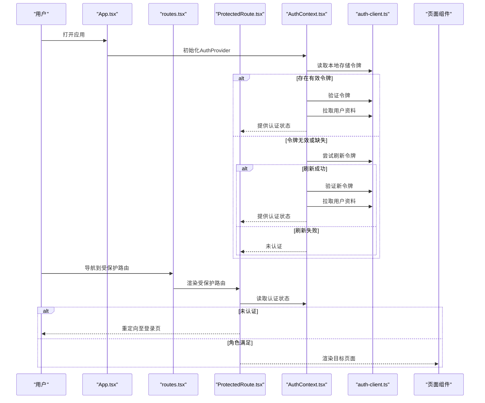
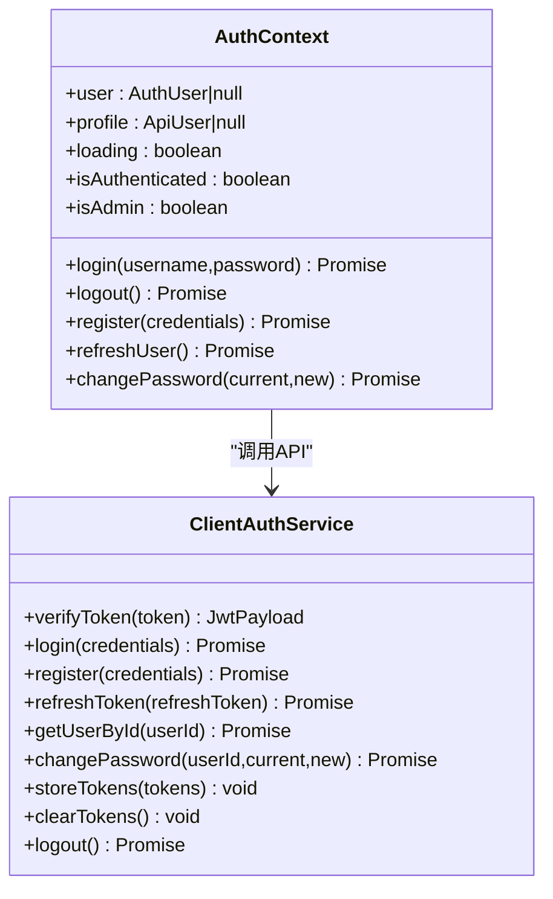
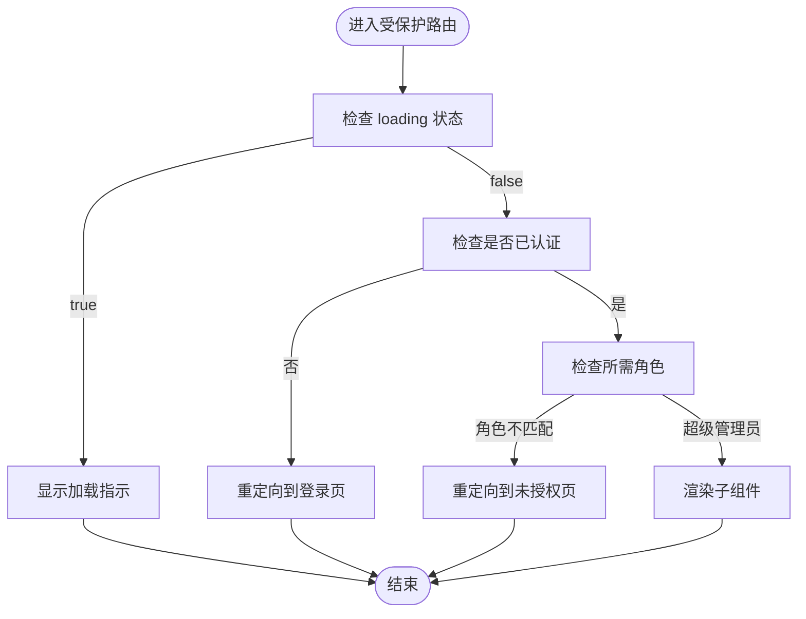
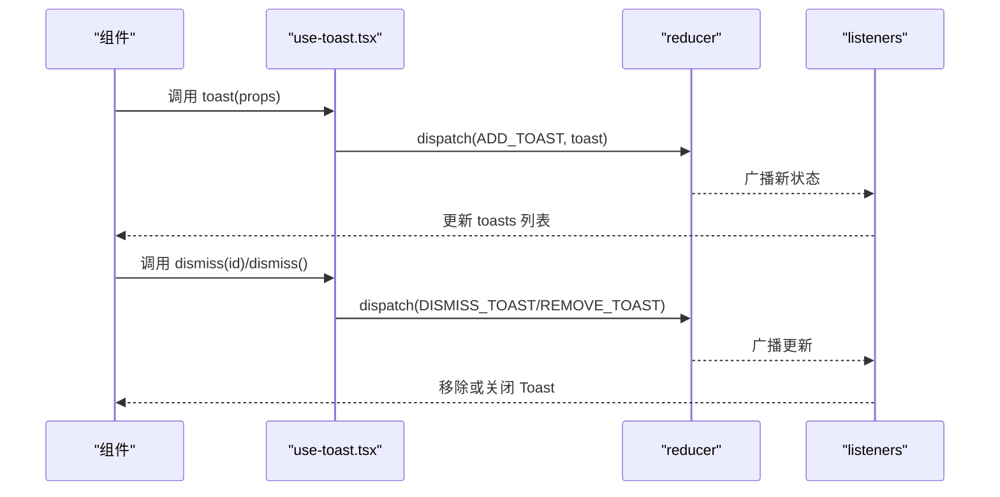
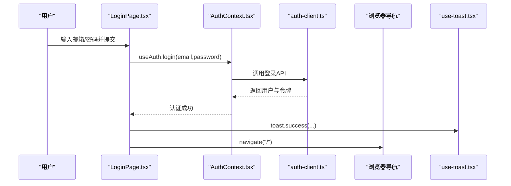
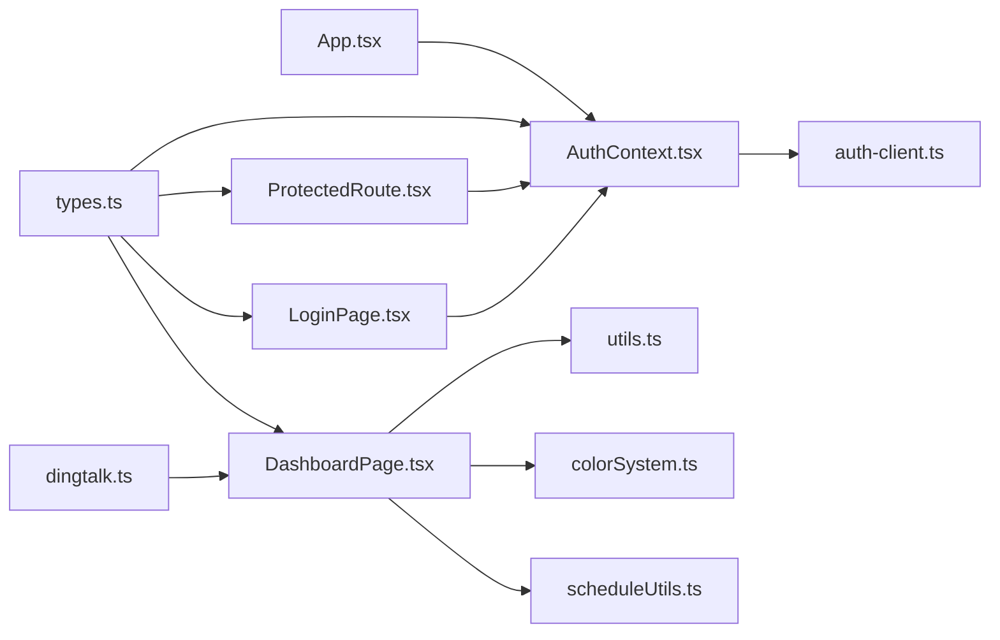

# 状态管理

<cite>
**本文引用的文件**
- [AuthContext.tsx](file://src/contexts/AuthContext.tsx)
- [auth-client.ts](file://src/services/auth-client.ts)
- [ProtectedRoute.tsx](file://src/components/auth/ProtectedRoute.tsx)
- [App.tsx](file://src/App.tsx)
- [routes.tsx](file://src/routes.tsx)
- [LoginPage.tsx](file://src/pages/auth/LoginPage.tsx)
- [DashboardPage.tsx](file://src/pages/DashboardPage.tsx)
- [use-toast.tsx](file://src/hooks/use-toast.tsx)
- [use-debounce.ts](file://src/hooks/use-debounce.ts)
- [use-mobile.ts](file://src/hooks/use-mobile.ts)
- [utils.ts](file://src/lib/utils.ts)
- [colorSystem.ts](file://src/utils/colorSystem.ts)
- [scheduleUtils.ts](file://src/utils/scheduleUtils.ts)
- [dingtalk.ts](file://src/utils/dingtalk.ts)
- [types.ts](file://src/types/types.ts)
</cite>

## 目录
1. [简介](#简介)
2. [项目结构](#项目结构)
3. [核心组件](#核心组件)
4. [架构总览](#架构总览)
5. [详细组件分析](#详细组件分析)
6. [依赖关系分析](#依赖关系分析)
7. [性能考量](#性能考量)
8. [故障排查指南](#故障排查指南)
9. [结论](#结论)
10. [附录](#附录)

## 简介
本文件系统化梳理 Bio-Appointment 前端的状态管理机制，围绕基于 React Context 的全局状态设计展开，重点覆盖：
- AuthContext 如何在多页面间共享用户认证状态并实现路由保护
- 自定义 Hook（useToast、useDebounce、useIsMobile）的设计模式与复用价值
- 工具函数库（utils.ts、colorSystem.ts、scheduleUtils.ts、dingtalk.ts）在颜色系统、排班计算与钉钉集成中的支撑作用
- 状态流图示，展示从用户交互到状态更新的完整数据流
- 常见状态管理问题的调试策略与最佳实践

## 项目结构
前端采用“上下文 + 自定义 Hook + 工具函数”的分层组织方式：
- 上下文层：集中管理认证状态与会话生命周期
- 组件层：通过上下文与 Hook 实现跨页面状态共享与行为封装
- 工具层：提供通用格式化、颜色系统、排班冲突检测与钉钉 SDK 封装

图表来源
- [App.tsx](file://src/App.tsx#L1-L62)
- [routes.tsx](file://src/routes.tsx#L1-L135)
- [ProtectedRoute.tsx](file://src/components/auth/ProtectedRoute.tsx#L1-L49)
- [AuthContext.tsx](file://src/contexts/AuthContext.tsx#L1-L308)
- [auth-client.ts](file://src/services/auth-client.ts#L1-L235)
- [LoginPage.tsx](file://src/pages/auth/LoginPage.tsx#L1-L158)
- [DashboardPage.tsx](file://src/pages/DashboardPage.tsx#L1-L157)
- [use-toast.tsx](file://src/hooks/use-toast.tsx#L1-L189)
- [use-debounce.ts](file://src/hooks/use-debounce.ts#L1-L16)
- [use-mobile.ts](file://src/hooks/use-mobile.ts#L1-L20)
- [utils.ts](file://src/lib/utils.ts#L1-L40)
- [colorSystem.ts](file://src/utils/colorSystem.ts#L1-L140)
- [scheduleUtils.ts](file://src/utils/scheduleUtils.ts#L1-L112)
- [dingtalk.ts](file://src/utils/dingtalk.ts#L1-L329)

章节来源
- [App.tsx](file://src/App.tsx#L1-L62)
- [routes.tsx](file://src/routes.tsx#L1-L135)

## 核心组件
- 认证上下文（AuthContext）：提供用户信息、认证状态、登录/注册/登出、密码修改、令牌刷新与过期自动处理
- 路由保护组件（ProtectedRoute）：根据认证状态与角色权限控制页面访问
- 自定义 Hook：
  - useToast：集中管理 Toast 队列与去重，支持批量关闭与定时移除
  - useDebounce：防抖值缓存，适用于搜索、筛选等高频输入场景
  - useIsMobile：响应式断点检测，便于移动端适配
- 工具函数库：
  - utils.ts：类名合并、查询串构建、日期格式化
  - colorSystem.ts：医疗资源颜色编码、状态色、对比度校验与 SVG 图案
  - scheduleUtils.ts：时间重叠判断与资源冲突检测
  - dingtalk.ts：钉钉 JSAPI 封装，提供免登授权、导航、扫码、位置、分享等能力

章节来源
- [AuthContext.tsx](file://src/contexts/AuthContext.tsx#L1-L308)
- [ProtectedRoute.tsx](file://src/components/auth/ProtectedRoute.tsx#L1-L49)
- [use-toast.tsx](file://src/hooks/use-toast.tsx#L1-L189)
- [use-debounce.ts](file://src/hooks/use-debounce.ts#L1-L16)
- [use-mobile.ts](file://src/hooks/use-mobile.ts#L1-L20)
- [utils.ts](file://src/lib/utils.ts#L1-L40)
- [colorSystem.ts](file://src/utils/colorSystem.ts#L1-L140)
- [scheduleUtils.ts](file://src/utils/scheduleUtils.ts#L1-L112)
- [dingtalk.ts](file://src/utils/dingtalk.ts#L1-L329)

## 架构总览
认证与路由保护的整体流程如下：
- 应用启动时，App 包裹 AuthProvider，初始化认证状态
- ProtectedRoute 在渲染前读取认证上下文，决定是否放行或重定向
- 页面通过 useAuth 获取认证状态，驱动 UI 与业务逻辑
- 自定义 Hook 与工具函数贯穿于页面与上下文中，提升可复用性与一致性

图表来源
- [App.tsx](file://src/App.tsx#L1-L62)
- [routes.tsx](file://src/routes.tsx#L1-L135)
- [ProtectedRoute.tsx](file://src/components/auth/ProtectedRoute.tsx#L1-L49)
- [AuthContext.tsx](file://src/contexts/AuthContext.tsx#L1-L308)
- [auth-client.ts](file://src/services/auth-client.ts#L1-L235)

## 详细组件分析

### 认证上下文（AuthContext）与客户端服务
- 设计要点
  - 使用本地存储保存访问令牌与刷新令牌，避免每次刷新丢失状态
  - 初始化阶段尝试验证现有令牌；若失效则尝试刷新；均失败则清理令牌
  - 定时器每分钟检查令牌有效期，提前 5 分钟自动刷新，过期则登出
  - 提供登录、注册、登出、密码修改与用户资料刷新接口
  - 暴露 useAuth Hook，确保在 Provider 外部抛出明确错误
- 与客户端服务协作
  - ClientAuthService 封装了与后端 API 的交互，包括登录、注册、刷新、获取用户资料、修改密码与登出
  - 在开发模式下支持 mock 令牌，便于本地调试
- 路由保护联动
  - ProtectedRoute 通过 useAuth 读取 isAuthenticated 与 profile，结合 requiredRole 实现细粒度权限控制

图表来源
- [AuthContext.tsx](file://src/contexts/AuthContext.tsx#L1-L308)
- [auth-client.ts](file://src/services/auth-client.ts#L1-L235)

章节来源
- [AuthContext.tsx](file://src/contexts/AuthContext.tsx#L1-L308)
- [auth-client.ts](file://src/services/auth-client.ts#L1-L235)

### 路由保护（ProtectedRoute）
- 功能概述
  - 在加载中显示加载指示
  - 未认证重定向至登录页
  - 检查角色权限，超级管理员拥有所有权限，否则要求角色匹配
- 与认证上下文耦合
  - 依赖 useAuth 返回的 isAuthenticated、profile、loading
  - 结合 routes.tsx 中的 requiredRole 字段实现按角色放行

图表来源
- [ProtectedRoute.tsx](file://src/components/auth/ProtectedRoute.tsx#L1-L49)
- [routes.tsx](file://src/routes.tsx#L1-L135)

章节来源
- [ProtectedRoute.tsx](file://src/components/auth/ProtectedRoute.tsx#L1-L49)
- [routes.tsx](file://src/routes.tsx#L1-L135)

### 自定义 Hook 设计与复用
- useToast（集中式 Toast 管理）
  - 采用 reducer 管理内存状态，监听器广播变更
  - 支持添加、更新、批量关闭与定时移除
  - 通过 useToast 暴露 toast 方法与 dismiss 控制
  - 适合统一提示风格与避免重复弹窗
- useDebounce（输入防抖）
  - 将输入值延迟到指定时间后生效，减少高频请求与重渲染
  - 适合搜索、筛选、实时建议等场景
- useIsMobile（响应式断点）
  - 基于媒体查询监听窗口宽度变化，返回布尔值
  - 便于在组件内切换移动端布局与交互

图表来源
- [use-toast.tsx](file://src/hooks/use-toast.tsx#L1-L189)

章节来源
- [use-toast.tsx](file://src/hooks/use-toast.tsx#L1-L189)
- [use-debounce.ts](file://src/hooks/use-debounce.ts#L1-L16)
- [use-mobile.ts](file://src/hooks/use-mobile.ts#L1-L20)

### 工具函数库支撑
- utils.ts
  - 类名合并与查询串构建：简化样式拼接与参数传递
  - 日期格式化：统一本地化日期显示
- colorSystem.ts
  - 护士与房间颜色方案、状态色、渐变与图案生成、对比度校验
  - 为可视化资源与排班提供一致的色彩语义
- scheduleUtils.ts
  - 时间重叠判断与资源冲突检测，支持排除当前编辑项
  - 为排班页面提供冲突提示与可视化反馈
- dingtalk.ts
  - 钉钉 JSAPI 封装：免登授权、导航、扫码、位置、分享、通知等
  - 在非钉钉环境提供降级行为，保证跨平台可用性

章节来源
- [utils.ts](file://src/lib/utils.ts#L1-L40)
- [colorSystem.ts](file://src/utils/colorSystem.ts#L1-L140)
- [scheduleUtils.ts](file://src/utils/scheduleUtils.ts#L1-L112)
- [dingtalk.ts](file://src/utils/dingtalk.ts#L1-L329)

### 页面与状态流示例
- 登录页（LoginPage）
  - 使用 react-hook-form + zodResolver 进行表单校验
  - 调用 useAuth.login 发起登录，成功后通过 toast 提示并跳转首页
  - 失败时捕获错误并通过 toast 展示
- 仪表盘（DashboardPage）
  - 使用 utils.ts 的日期格式化与查询串构建
  - 使用 scheduleUtils.ts 的冲突检测辅助排班视图
  - 使用 colorSystem.ts 的颜色方案增强可视化

图表来源
- [LoginPage.tsx](file://src/pages/auth/LoginPage.tsx#L1-L158)
- [AuthContext.tsx](file://src/contexts/AuthContext.tsx#L1-L308)
- [auth-client.ts](file://src/services/auth-client.ts#L1-L235)
- [use-toast.tsx](file://src/hooks/use-toast.tsx#L1-L189)

章节来源
- [LoginPage.tsx](file://src/pages/auth/LoginPage.tsx#L1-L158)
- [DashboardPage.tsx](file://src/pages/DashboardPage.tsx#L1-L157)
- [utils.ts](file://src/lib/utils.ts#L1-L40)
- [scheduleUtils.ts](file://src/utils/scheduleUtils.ts#L1-L112)
- [colorSystem.ts](file://src/utils/colorSystem.ts#L1-L140)

## 依赖关系分析
- 组件与上下文
  - App.tsx 作为根组件包裹 AuthProvider，使整个应用树共享认证状态
  - ProtectedRoute 依赖 useAuth 读取认证状态，实现路由级权限控制
- 上下文与服务
  - AuthContext 通过 ClientAuthService 与后端交互，负责令牌存储与刷新
- 页面与工具
  - DashboardPage 与 LoginPage 使用工具函数与 Hook，提升可维护性
- 类型系统
  - types.ts 定义了用户角色、状态枚举与 API 数据模型，为上下文与页面提供类型保障

图表来源
- [App.tsx](file://src/App.tsx#L1-L62)
- [AuthContext.tsx](file://src/contexts/AuthContext.tsx#L1-L308)
- [auth-client.ts](file://src/services/auth-client.ts#L1-L235)
- [ProtectedRoute.tsx](file://src/components/auth/ProtectedRoute.tsx#L1-L49)
- [LoginPage.tsx](file://src/pages/auth/LoginPage.tsx#L1-L158)
- [DashboardPage.tsx](file://src/pages/DashboardPage.tsx#L1-L157)
- [utils.ts](file://src/lib/utils.ts#L1-L40)
- [colorSystem.ts](file://src/utils/colorSystem.ts#L1-L140)
- [scheduleUtils.ts](file://src/utils/scheduleUtils.ts#L1-L112)
- [dingtalk.ts](file://src/utils/dingtalk.ts#L1-L329)
- [types.ts](file://src/types/types.ts#L1-L487)

章节来源
- [types.ts](file://src/types/types.ts#L1-L487)

## 性能考量
- 令牌刷新与过期
  - 每分钟检查一次令牌有效期，提前 5 分钟刷新，避免频繁失败
  - 过期或验证失败时自动登出，减少无效请求
- Toast 管理
  - 限制队列长度与定时移除，避免大量提示堆积
- 防抖与响应式
  - useDebounce 减少高频输入带来的重渲染与请求压力
  - useIsMobile 仅在断点变化时更新，避免不必要的布局计算
- 工具函数
  - 查询串构建与日期格式化为纯函数，避免副作用，利于缓存与测试

[本节为通用指导，无需列出具体文件来源]

## 故障排查指南
- 认证初始化失败
  - 检查本地存储是否存在有效令牌
  - 若令牌无效，确认刷新令牌是否可用
  - 查看控制台错误日志，定位 API 返回的错误信息
- 登录/注册失败
  - 确认表单校验通过
  - 捕获异常并使用 toast 展示错误消息
- 路由保护不生效
  - 确保 ProtectedRoute 包裹在路由配置中
  - 检查 requiredRole 与 profile.role 是否匹配
  - 超级管理员应拥有所有权限
- Toast 不显示或重复
  - 检查 useToast 的 listeners 是否正确订阅
  - 确认 TOAST_LIMIT 与定时移除逻辑
- 钉钉环境检测
  - 非钉钉环境会触发降级行为，确保在浏览器中也能正常运行
- 颜色对比度与可访问性
  - 使用 hasGoodContrast 校验文本与背景对比度
  - 为色盲用户提供 SVG 图案辅助识别

章节来源
- [AuthContext.tsx](file://src/contexts/AuthContext.tsx#L1-L308)
- [auth-client.ts](file://src/services/auth-client.ts#L1-L235)
- [ProtectedRoute.tsx](file://src/components/auth/ProtectedRoute.tsx#L1-L49)
- [use-toast.tsx](file://src/hooks/use-toast.tsx#L1-L189)
- [dingtalk.ts](file://src/utils/dingtalk.ts#L1-L329)
- [colorSystem.ts](file://src/utils/colorSystem.ts#L1-L140)

## 结论
本项目通过 React Context 实现了清晰的全局认证状态管理，配合自定义 Hook 与工具函数，实现了：
- 跨页面的认证状态共享与路由保护
- 可复用的用户体验组件（Toast、防抖、响应式断点）
- 颜色系统、排班冲突检测与钉钉集成的实用支撑
在实践中，建议持续关注令牌生命周期、权限控制与可访问性，并通过类型系统与工具函数提升代码质量与可维护性。

[本节为总结性内容，无需列出具体文件来源]

## 附录
- 最佳实践
  - 在 Provider 外部使用 useAuth 时，确保已包裹在 AuthProvider 中
  - 使用 ProtectedRoute 统一处理认证与角色权限
  - 对高频输入使用 useDebounce，对提示使用 useToast
  - 使用 colorSystem.ts 与 scheduleUtils.ts 提升可视化与交互体验
  - 在钉钉环境中使用 dingtalk.ts，非钉钉环境采用降级策略
- 常见问题
  - 令牌过期导致页面空白：检查 AuthContext 的定时刷新与登出逻辑
  - 角色权限不生效：核对 routes.tsx 中 requiredRole 与 profile.role
  - Toast 堆积：调整 TOAST_LIMIT 或手动关闭

[本节为补充内容，无需列出具体文件来源]