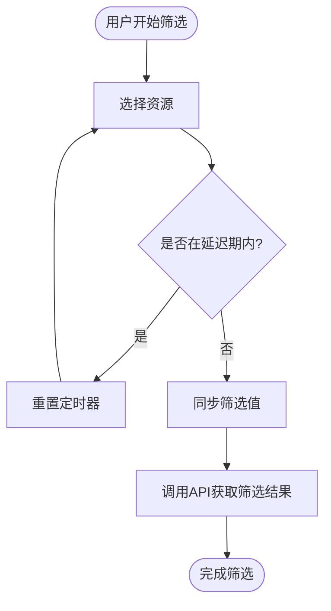
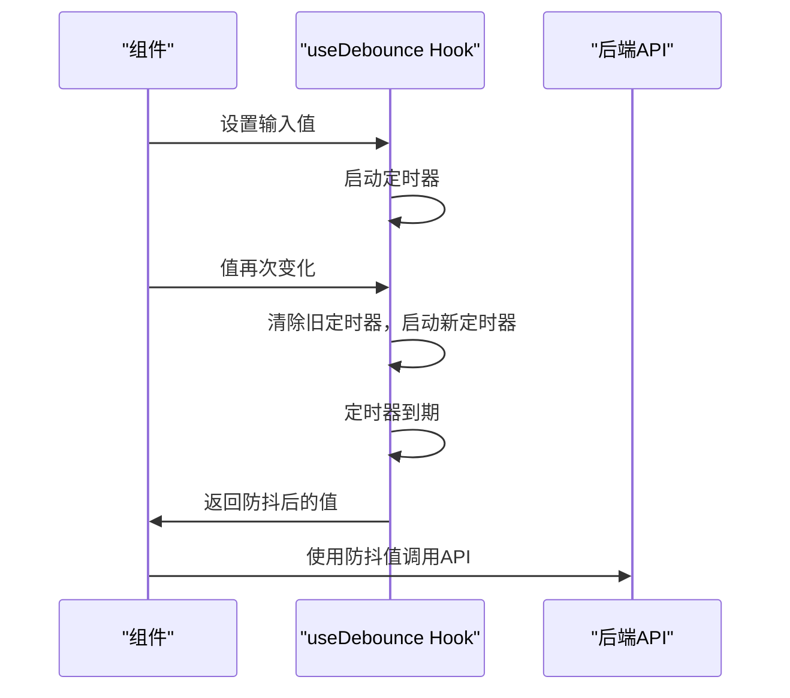

# useDebounce - 防抖Hook

<cite>
**本文档引用的文件**  
- [use-debounce.ts](file://src/hooks/use-debounce.ts#L1-L15)
- [CompactFilterBar.tsx](file://src/components/appointment/CompactFilterBar.tsx#L1-L260)
- [ResourceFilter.tsx](file://src/components/appointment/ResourceFilter.tsx#L1-L94)
</cite>

## 目录
1. [实现原理](#实现原理)
2. [delay参数设计考量](#delay参数设计考量)
3. [应用场景与案例](#应用场景与案例)
4. [最佳实践](#最佳实践)
5. [常见错误与调试](#常见错误与调试)
6. [性能监控](#性能监控)

## 实现原理

useDebounce泛型Hook基于React的useEffect和setTimeout机制实现值的延迟同步。其核心原理是通过useEffect监听输入值的变化，当值发生变化时启动一个定时器，在指定延迟时间后将当前值同步到状态中。如果在延迟期间输入值再次发生变化，则清除之前的定时器并重新开始计时。

该Hook使用泛型T确保类型安全，可以处理任何类型的值。通过依赖数组[value, delay]确保只有当输入值或延迟时间发生变化时才会触发useEffect。在useEffect的清理函数中调用clearTimeout(timer)，确保组件卸载或值更新时能正确清理定时器，避免内存泄漏。

**Section sources**
- [use-debounce.ts](file://src/hooks/use-debounce.ts#L1-L15)

## delay参数设计考量

delay参数的默认值设置为500ms是经过精心考虑的设计决策。500ms的延迟时间在用户体验和性能优化之间取得了良好平衡：既足够长以有效过滤高频输入事件，又足够短以保证用户操作的响应性。

在搜索输入场景中，500ms允许用户完成一个单词的输入而不会被过早触发搜索请求。对于表单筛选等场景，这个时间足够用户完成一次完整的筛选操作，避免在用户连续调整筛选条件时产生不必要的API调用。过短的延迟（如100ms）可能无法有效减少请求频率，而过长的延迟（如1000ms）则会让用户感觉系统响应迟缓。

**Section sources**
- [use-debounce.ts](file://src/hooks/use-debounce.ts#L7-L8)

## 应用场景与案例

### CompactFilterBar中的资源筛选

在CompactFilterBar组件中，useDebounce Hook可用于包装输入值以减少API请求频率。当用户在筛选资源时，组件可以使用useDebounce来延迟同步筛选条件，避免在用户快速切换筛选选项时频繁调用后端API。

例如，在筛选护士或房间时，可以将选中的ID数组通过useDebounce进行包装，设置适当的延迟时间。这样只有当用户停止选择操作一段时间后，才会触发实际的筛选请求，有效减少了不必要的网络通信。

**Diagram sources**
- [CompactFilterBar.tsx](file://src/components/appointment/CompactFilterBar.tsx#L47-L94)
- [ResourceFilter.tsx](file://src/components/appointment/ResourceFilter.tsx#L1-L94)

## 最佳实践

### 受控组件集成

在受控组件中集成useDebounce Hook时，需要正确配置依赖数组。依赖数组应包含所有影响防抖行为的变量，通常是输入值和延迟时间。确保在组件卸载时能正确清理定时器，这通过useEffect的返回函数自动完成。

**Diagram sources**
- [use-debounce.ts](file://src/hooks/use-debounce.ts#L6-L12)

### 清理机制

useDebounce Hook通过useEffect的清理函数实现了自动的clearTimeout机制。当依赖数组中的值发生变化或组件卸载时，清理函数会被调用，确保不会产生"zombie"定时器。这种设计使得开发者无需手动管理定时器的生命周期，降低了出错的可能性。

**Section sources**
- [use-debounce.ts](file://src/hooks/use-debounce.ts#L9-L11)

## 常见错误与调试

### 未正确传递delay参数

一个常见错误是未正确传递delay参数，导致防抖失效。如果delay参数为0或undefined且没有提供默认值，定时器会立即执行，失去了防抖的意义。确保在调用useDebounce时正确传递delay参数，或依赖Hook内部的默认值（500ms）。

### 非受控组件中的误用

在非受控组件中误用useDebounce可能导致状态不一致。由于非受控组件的值由DOM直接管理，useDebounce可能无法正确跟踪值的变化。建议在受控组件中使用useDebounce，确保React能完全控制组件的状态。

**Section sources**
- [use-debounce.ts](file://src/hooks/use-debounce.ts#L7-L8)

## 性能监控

为了监控useDebounce的性能，可以添加简单的日志记录或使用React DevTools的Profiler。通过记录防抖前后API调用的频率，可以量化其性能优化效果。例如，对比使用防抖前后的网络请求次数，评估其在减少API调用方面的实际价值。

在生产环境中，可以通过埋点统计防抖节省的请求数量，为后续优化提供数据支持。同时，监控因防抖导致的用户操作延迟，确保用户体验不受负面影响。