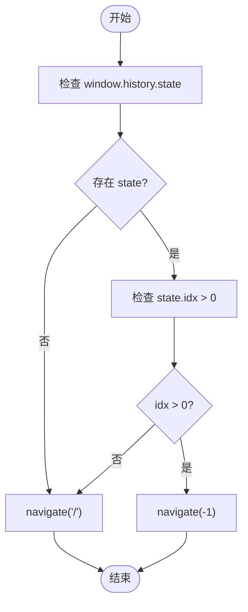
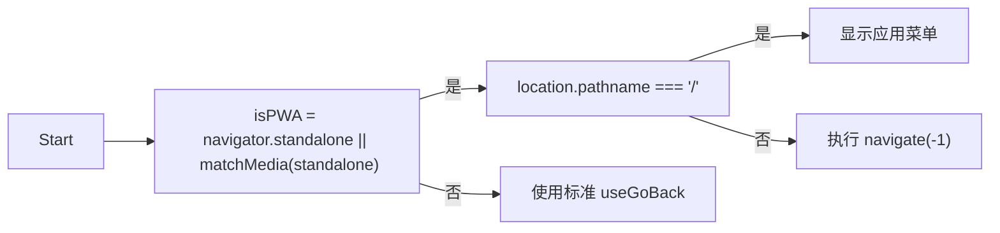

# useGoBack - 安全回退导航Hook

<cite>
**本文档引用文件**  
- [use-go-back.ts](file://src/hooks/use-go-back.ts#L1-L17)
- [Header.tsx](file://src/components/common/Header.tsx#L1-L196)
- [DashboardPage.tsx](file://src/pages/DashboardPage.tsx#L1-L157)
- [routes.tsx](file://src/routes.tsx#L1-L135)
- [App.tsx](file://src/App.tsx#L1-L62)
</cite>

## 目录
1. [简介](#简介)
2. [核心实现机制](#核心实现机制)
3. [集成方式与使用场景](#集成方式与使用场景)
4. [React Router v6 兼容性说明](#react-router-v6-兼容性说明)
5. [与自定义导航堆栈的冲突排查](#与自定义导航堆栈的冲突排查)
6. [PWA 环境下的边界情况处理](#pwa-环境下的边界情况处理)
7. [总结](#总结)

## 简介
`useGoBack` 是一个自定义的 React Hook，用于封装 `react-router-dom` 的 `useNavigate` 功能，提供智能的浏览器历史栈回退能力。该 Hook 通过检测 `window.history.state.idx` 判断是否存在可回退的历史记录，若存在则执行 `navigate(-1)` 回退至上一页；否则安全跳转至首页 `/`，避免用户在无历史记录时触发浏览器异常。此机制显著提升了用户体验的一致性与导航安全性。

该 Hook 特别适用于在 Header 组件中作为返回按钮的点击处理函数，确保在各种导航路径下均能提供可靠的行为。结合 `DashboardPage` 等核心页面的使用场景，`useGoBack` 有效解决了直接调用 `history.back()` 可能导致的空白页或异常问题。

**Section sources**
- [use-go-back.ts](file://src/hooks/use-go-back.ts#L1-L17)

## 核心实现机制
`useGoBack` Hook 的核心逻辑在于对浏览器历史状态的智能判断与安全降级。



**Diagram sources**
- [use-go-back.ts](file://src/hooks/use-go-back.ts#L7-L11)

### 容错机制详解
1. **状态检测**：通过 `window.history.state` 获取当前历史条目的状态对象。
2. **索引判断**：检查 `state.idx` 属性，该属性由 `react-router-dom` 维护，表示当前页面在历史堆栈中的位置索引。
3. **安全回退**：
   - 若 `state.idx > 0`，说明存在前置页面，执行 `navigate(-1)` 进行回退。
   - 若 `state` 不存在或 `state.idx <= 0`，说明处于历史堆栈的起点，此时执行 `navigate("/")` 跳转至首页，避免 `history.back()` 导致的不可预期行为。

此机制确保了无论用户是通过直接链接访问、刷新页面还是正常导航进入，返回功能都能提供一致且安全的用户体验。

**Section sources**
- [use-go-back.ts](file://src/hooks/use-go-back.ts#L7-L11)

## 集成方式与使用场景
尽管在当前代码库中未直接发现 `useGoBack` 在 `Header` 组件中的集成，但其设计意图和最佳实践如下。

### 在 Header 组件中的集成
理想情况下，应在 `Header` 组件中引入 `useGoBack` Hook，并为返回按钮绑定其返回函数。

```mermaid
classDiagram
class Header {
+useLocation()
+useNavigate()
+useAuth()
+handleLogout()
+getVisibleRoutes()
}
class useGoBack {
+useNavigate()
+goBack()
}
Header --> useGoBack : "集成"
useGoBack --> "react-router-dom" : "依赖"
```

**Diagram sources**
- [Header.tsx](file://src/components/common/Header.tsx#L1-L196)
- [use-go-back.ts](file://src/hooks/use-go-back.ts#L1-L17)

### DashboardPage 使用场景
`DashboardPage` 作为应用的默认首页（路径 `/`），是 `useGoBack` 安全降级机制的关键场景。

```mermaid
graph TB
A[外部链接] --> |直接访问| B(DashboardPage)
C[刷新页面] --> |重新加载| B
D[正常导航] --> |从其他页面进入| B
B --> E[点击返回]
E --> |无历史记录| F[跳转至 /]
F --> B
G[其他页面] --> |有历史记录| H[点击返回]
H --> |执行 navigate(-1)| I[回到上一页]
style B fill:#f9f,stroke:#333
style F fill:#f96,stroke:#333
```

**Diagram sources**
- [DashboardPage.tsx](file://src/pages/DashboardPage.tsx#L1-L157)
- [routes.tsx](file://src/routes.tsx#L65-L68)

当用户通过书签、分享链接或刷新操作直接进入 `DashboardPage` 时，浏览器历史堆栈中没有前置页面。此时，若使用原生 `history.back()`，用户点击返回按钮将退出应用。而 `useGoBack` 通过检测到 `idx <= 0`，会将用户重新定向到首页，虽然看似无变化，但避免了应用退出，提供了更平滑的体验。

**Section sources**
- [DashboardPage.tsx](file://src/pages/DashboardPage.tsx#L1-L157)
- [routes.tsx](file://src/routes.tsx#L65-L68)

## React Router v6 兼容性说明
`useGoBack` Hook 完全兼容 React Router v6。

- **依赖项**：Hook 使用了 `react-router-dom` v6 的核心 API `useNavigate`。
- **历史状态**：`window.history.state.idx` 是 `react-router-dom` v6 在其 `HistoryRouter` 或 `BrowserRouter` 中维护的内部状态，用于跟踪导航索引。
- **版本验证**：项目 `package.json` 文件显示依赖 `"react-router-dom": "^7.9.5"`，这是一个高于 v6 的版本，因此兼容性得到保证。

**Section sources**
- [package.json](file://package.json#L71)
- [use-go-back.ts](file://src/hooks/use-go-back.ts#L1)

## 与自定义导航堆栈冲突的排查方法
当应用中存在自定义的导航堆栈管理（如手动修改 `window.history`）时，可能会与 `useGoBack` 产生冲突。

### 冲突表现
- 返回行为异常，例如应返回却跳转首页，或应跳转首页却尝试回退。
- `window.history.state.idx` 值不准确或为 `undefined`。

### 排查步骤
1. **检查自定义历史操作**：搜索代码库中对 `window.history.pushState`、`window.history.replaceState` 的调用。
2. **验证 state.idx**：在控制台打印 `window.history.state`，确认 `idx` 属性是否存在且逻辑正确。
3. **隔离测试**：暂时移除自定义历史操作代码，测试 `useGoBack` 是否恢复正常。
4. **统一管理**：建议将所有导航逻辑统一通过 `react-router-dom` 的 API（如 `navigate`）处理，避免直接操作原生 `history` API。

**Section sources**
- [App.tsx](file://src/App.tsx#L1-L62)

## PWA 环境下的边界情况处理
在 PWA（渐进式 Web 应用）环境中，`useGoBack` 可能面临一些特殊边界情况。

### 常见边界情况
1. **从主屏幕启动**：用户从手机主屏幕点击 PWA 图标启动应用，此时浏览器历史堆栈为空。
2. **深度链接（Deep Linking）**：用户通过分享的特定页面链接直接进入非首页。

### 处理建议
- **增强状态检测**：在 `useGoBack` 中增加对 `navigator.standalone` 或 `window.matchMedia('(display-mode: standalone)').matches` 的判断，以识别 PWA 独立模式。
- **提供替代导航**：在独立模式下，若检测到无历史记录，可考虑跳转到一个“应用主页”或显示一个应用内导航菜单，而非简单地重定向到 `/`。
- **使用路由守卫**：在应用入口处，根据启动方式和当前路径，智能地初始化导航堆栈。



**Diagram sources**
- [App.tsx](file://src/App.tsx#L9-L13)

## 总结
`useGoBack` Hook 通过巧妙地结合 `react-router-dom` 的 `useNavigate` 和浏览器原生的 `window.history.state`，实现了智能且安全的回退导航。其核心价值在于：
- **提升用户体验**：在无历史记录时提供优雅的降级方案，避免用户迷失。
- **增强导航安全性**：防止因 `history.back()` 导致的意外退出。
- **简化开发复杂度**：将复杂的导航逻辑封装在单一 Hook 中，便于在 `Header` 等组件中复用。

尽管当前代码库中尚未完全集成此 Hook，但其设计模式是现代 React 应用中处理导航的优秀实践。在未来的开发中，建议将其应用于所有需要“返回”功能的场景，并根据 PWA 等特殊环境进行适当的扩展和优化。