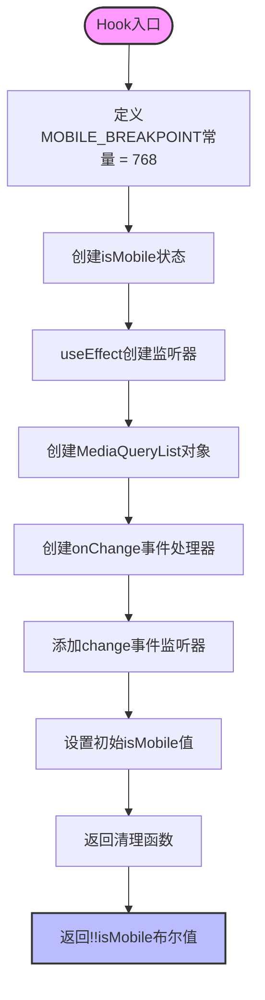
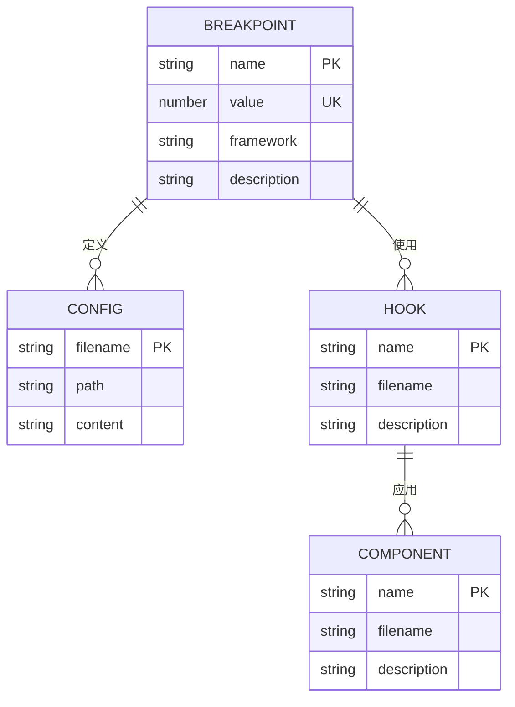
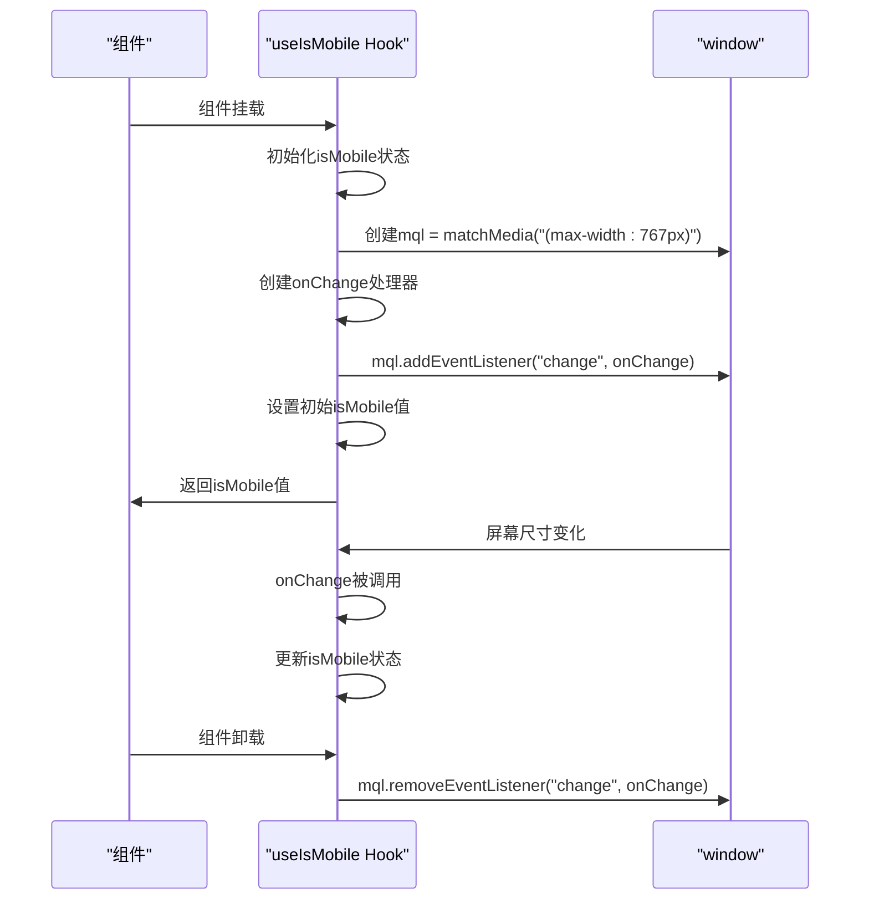
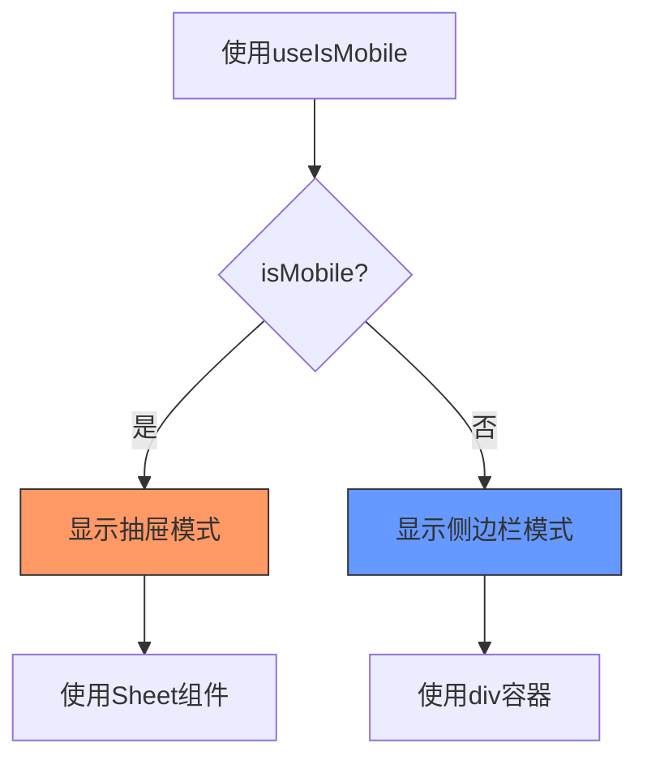
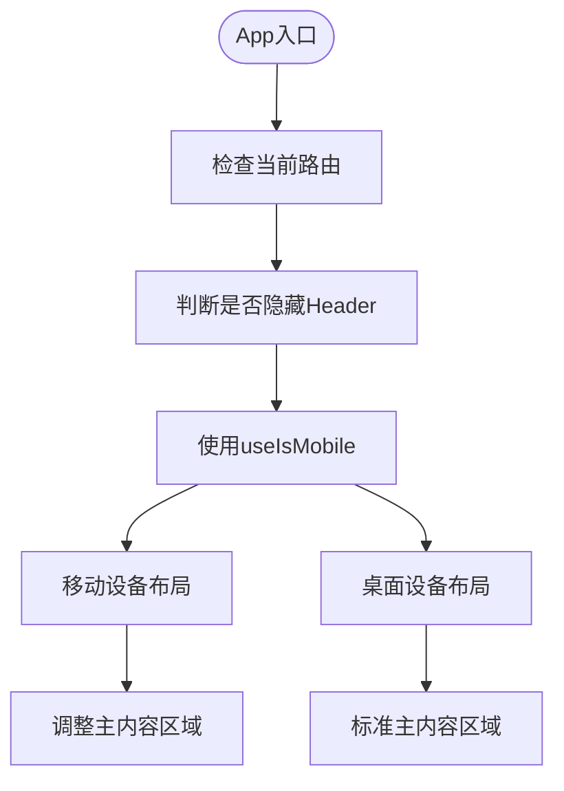
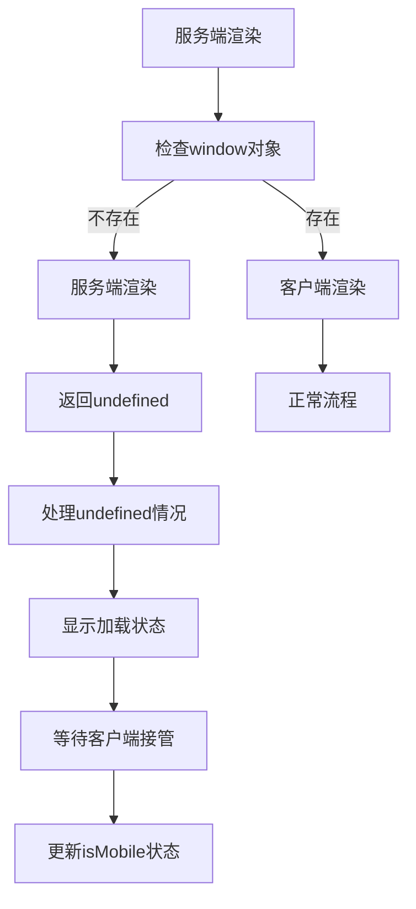
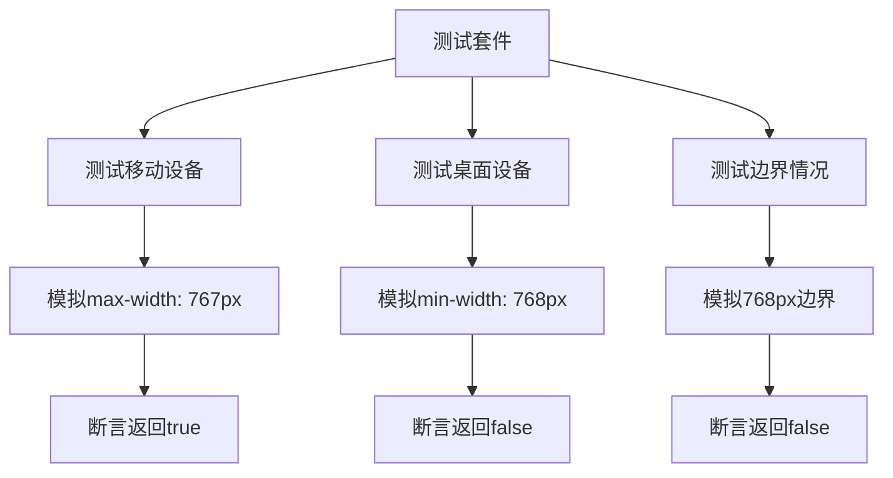

# useIsMobile - 响应式设备检测Hook

<cite>
**本文档引用的文件**   
- [use-mobile.ts](file://src/hooks/use-mobile.ts)
- [sidebar.tsx](file://src/components/ui/sidebar.tsx)
- [App.tsx](file://src/App.tsx)
- [tailwind.config.js](file://tailwind.config.js)
</cite>

## 目录
1. [简介](#简介)
2. [核心组件分析](#核心组件分析)
3. [断点设计依据](#断点设计依据)
4. [生命周期管理](#生命周期管理)
5. [实际应用示例](#实际应用示例)
6. [服务端渲染注意事项](#服务端渲染注意事项)
7. [调试与测试](#调试与测试)

## 简介
`useIsMobile` Hook 是一个用于检测移动设备的响应式工具，它利用 `window.matchMedia` API 监听CSS断点变化，实现对移动设备的精准识别。该Hook在项目中被广泛应用于响应式布局的控制，特别是在Sidebar组件和App主布局中。本文档将深入解析其工作原理、设计依据、生命周期管理机制以及在不同场景下的应用。

## 核心组件分析

`useIsMobile` Hook 的核心实现位于 `src/hooks/use-mobile.ts` 文件中，它通过 `window.matchMedia` API 监听媒体查询变化，判断当前设备是否为移动设备。

**Diagram sources**
- [use-mobile.ts](file://src/hooks/use-mobile.ts#L3-L19)

**Section sources**
- [use-mobile.ts](file://src/hooks/use-mobile.ts#L3-L19)

## 断点设计依据

`MOBILE_BREAKPOINT` 常量被设置为 768px，这一设计符合 Tailwind CSS 的 `sm` 断点标准。在 `tailwind.config.js` 配置文件中，虽然没有明确列出断点值，但768px是Tailwind CSS框架中标准的移动设备断点，用于区分移动设备和桌面设备。

**Diagram sources**
- [tailwind.config.js](file://tailwind.config.js#L1-L184)
- [use-mobile.ts](file://src/hooks/use-mobile.ts#L3)

**Section sources**
- [tailwind.config.js](file://tailwind.config.js#L1-L184)
- [use-mobile.ts](file://src/hooks/use-mobile.ts#L3)

## 生命周期管理

`useIsMobile` Hook 使用 `useEffect` 来管理媒体查询监听器的生命周期。在组件挂载时，它创建一个 `MediaQueryList` 对象并添加 `change` 事件监听器；在组件卸载时，通过返回的清理函数移除监听器，防止内存泄漏。

**Diagram sources**
- [use-mobile.ts](file://src/hooks/use-mobile.ts#L8-L16)

**Section sources**
- [use-mobile.ts](file://src/hooks/use-mobile.ts#L8-L16)

## 实际应用示例

### Sidebar组件中的应用

在 `src/components/ui/sidebar.tsx` 文件中，`useIsMobile` Hook 被用于控制Sidebar的显示模式。在移动设备上，Sidebar会以抽屉模式（Sheet）显示，而在桌面设备上则以侧边栏模式显示。

**Diagram sources**
- [sidebar.tsx](file://src/components/ui/sidebar.tsx#L67-L204)

**Section sources**
- [sidebar.tsx](file://src/components/ui/sidebar.tsx#L67-L204)

### App组件中的布局调整

在 `src/App.tsx` 文件中，虽然没有直接使用 `useIsMobile`，但该Hook的返回值可以用于控制App的整体布局结构，例如在移动设备上隐藏Header或调整主内容区域的布局。

**Diagram sources**
- [App.tsx](file://src/App.tsx#L1-L62)

**Section sources**
- [App.tsx](file://src/App.tsx#L1-L62)

## 服务端渲染注意事项

在服务端渲染（SSR）环境下，`useIsMobile` Hook 可能会返回 `undefined`，因为服务端没有 `window` 对象和媒体查询功能。为应对这种情况，建议结合加载状态处理首屏渲染，确保用户体验的一致性。

**Diagram sources**
- [use-mobile.ts](file://src/hooks/use-mobile.ts#L6)
- [App.tsx](file://src/App.tsx#L8-L14)

**Section sources**
- [use-mobile.ts](file://src/hooks/use-mobile.ts#L6)
- [App.tsx](file://src/App.tsx#L8-L14)

## 调试与测试

### 调试不同屏幕尺寸

开发者可以通过浏览器的开发者工具模拟不同屏幕尺寸，测试 `useIsMobile` Hook 的响应行为。在Chrome开发者工具中，可以使用设备模拟器功能，选择不同的设备或自定义屏幕尺寸。

### 单元测试示例

以下是一个模拟媒体查询的单元测试示例，用于测试 `useIsMobile` Hook 在不同屏幕尺寸下的行为：

**Diagram sources**
- [use-mobile.ts](file://src/hooks/use-mobile.ts#L9-L11)

**Section sources**
- [use-mobile.ts](file://src/hooks/use-mobile.ts#L9-L11)