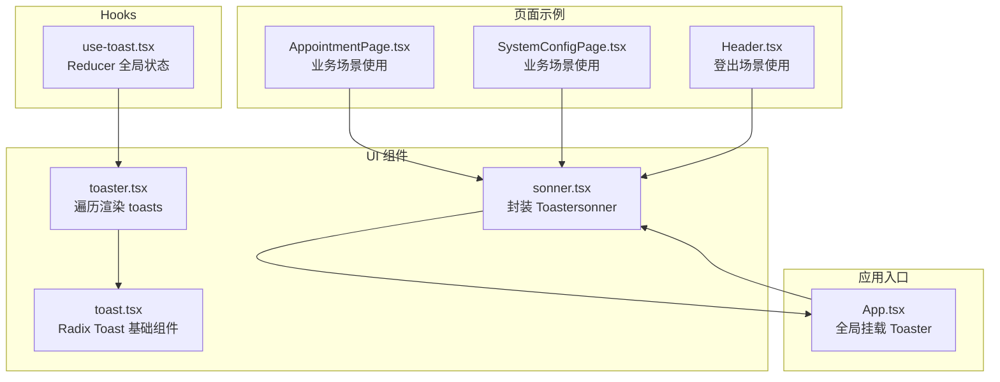
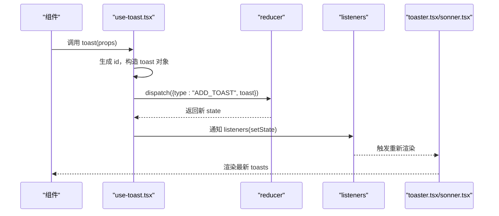
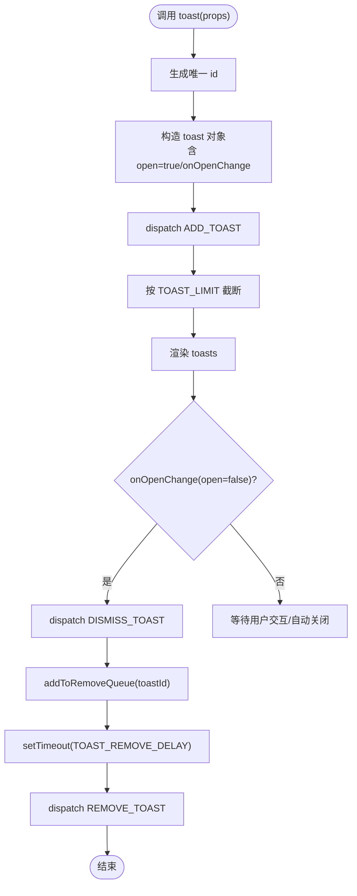
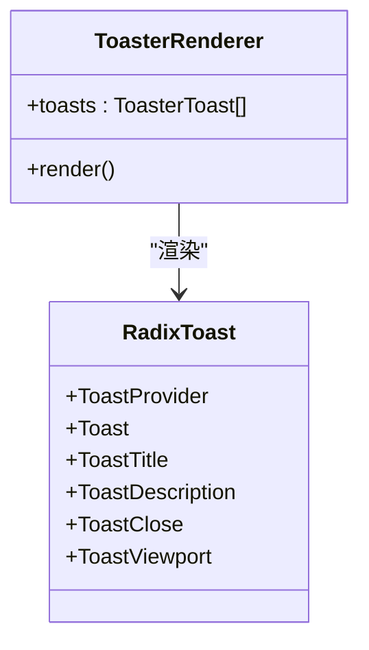
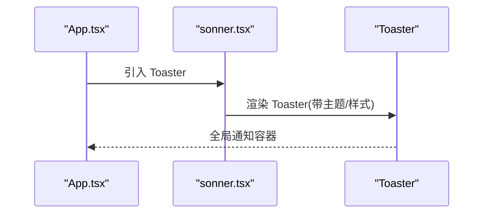
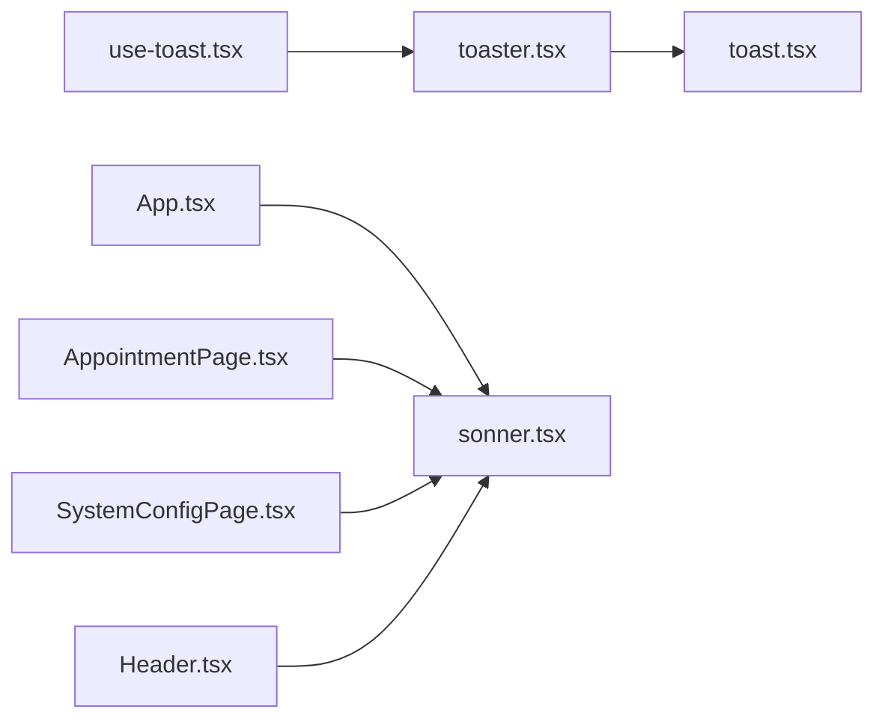

# useToast - 全局通知Hook

<cite>
**本文引用的文件**
- [use-toast.tsx](file://src/hooks/use-toast.tsx)
- [toast.tsx](file://src/components/ui/toast.tsx)
- [toaster.tsx](file://src/components/ui/toaster.tsx)
- [sonner.tsx](file://src/components/ui/sonner.tsx)
- [App.tsx](file://src/App.tsx)
- [AppointmentPage.tsx](file://src/pages/doctor/AppointmentPage.tsx)
- [SystemConfigPage.tsx](file://src/pages/admin/SystemConfigPage.tsx)
- [Header.tsx](file://src/components/common/Header.tsx)
</cite>

## 目录
1. [简介](#简介)
2. [项目结构](#项目结构)
3. [核心组件](#核心组件)
4. [架构总览](#架构总览)
5. [详细组件分析](#详细组件分析)
6. [依赖关系分析](#依赖关系分析)
7. [性能考量](#性能考量)
8. [故障排查指南](#故障排查指南)
9. [结论](#结论)
10. [附录](#附录)

## 简介
本篇文档围绕 useToast Hook 展开，系统性阐述其基于 Reducer 模式的全局状态管理机制，以及与 sonner 库的集成方式。重点说明：
- TOAST_LIMIT 和 TOAST_REMOVE_DELAY 的作用与影响
- addToRemoveQueue 对自动清理的控制逻辑
- useToast 返回的 state（toasts 数组）与 toast、dismiss 方法的使用方式
- 在“预约创建成功”“排班冲突提示”等场景下的调用示例
- 结合 AppointmentPage 与 SystemConfigPage 的实际用法，讲解如何自定义 title、description、action 按钮及超时行为
- 常见问题排查与性能优化建议

## 项目结构
useToast 的实现位于 hooks 层，UI 组件位于 components/ui 层，应用入口在 App.tsx 中挂载 Toaster。页面组件通过直接调用第三方库（如 sonner）或 useToast 来展示通知。

图表来源
- [use-toast.tsx](file://src/hooks/use-toast.tsx#L1-L188)
- [toast.tsx](file://src/components/ui/toast.tsx#L1-L129)
- [toaster.tsx](file://src/components/ui/toaster.tsx#L1-L33)
- [sonner.tsx](file://src/components/ui/sonner.tsx#L1-L23)
- [App.tsx](file://src/App.tsx#L1-L62)
- [AppointmentPage.tsx](file://src/pages/doctor/AppointmentPage.tsx#L1-L395)
- [SystemConfigPage.tsx](file://src/pages/admin/SystemConfigPage.tsx#L1-L776)
- [Header.tsx](file://src/components/common/Header.tsx#L60-L196)

章节来源
- [use-toast.tsx](file://src/hooks/use-toast.tsx#L1-L188)
- [App.tsx](file://src/App.tsx#L1-L62)

## 核心组件
- useToast/use：基于 Redux 风格的 Reducer 实现全局通知状态管理，提供 toast、dismiss、state.toasts。
- Radix Toast 基础组件：ToastProvider、Toast、ToastTitle、ToastDescription、ToastClose 等。
- Toaster 渲染器：遍历 state.toasts 并渲染具体 Toast。
- Sonner Toaster：封装第三方库的 Toaster，统一主题与样式。
- App.tsx：在根节点挂载 Toaster，确保全局可见。

章节来源
- [use-toast.tsx](file://src/hooks/use-toast.tsx#L1-L188)
- [toast.tsx](file://src/components/ui/toast.tsx#L1-L129)
- [toaster.tsx](file://src/components/ui/toaster.tsx#L1-L33)
- [sonner.tsx](file://src/components/ui/sonner.tsx#L1-L23)
- [App.tsx](file://src/App.tsx#L1-L62)

## 架构总览
useToast 采用“内存状态 + 订阅者模式”的 Reducer 架构：
- 内存状态 memoryState 作为全局 Store
- dispatch 将 Action 交给 reducer 更新 memoryState，并广播给所有订阅者 listeners
- useToast 返回当前 state 与 toast/dismiss 工具，组件通过订阅实时获取 toasts

图表来源
- [use-toast.tsx](file://src/hooks/use-toast.tsx#L137-L166)
- [toaster.tsx](file://src/components/ui/toaster.tsx#L11-L33)
- [sonner.tsx](file://src/components/ui/sonner.tsx#L1-L23)

## 详细组件分析

### useToast Hook 与 Reducer 状态机
- 状态结构
  - state: { toasts: ToasterToast[] }
  - ToasterToast 扩展了 ToastProps，新增 id、title、description、action 字段
- 动作类型
  - ADD_TOAST：向 toasts 头部插入新 toast，并按 TOAST_LIMIT 截断
  - UPDATE_TOAST：按 id 合并更新指定 toast
  - DISMISS_TOAST：触发 onOpenChange 关闭动画；若未传 id 则批量关闭；同时将对应 toast 加入移除队列
  - REMOVE_TOAST：从 toasts 移除指定 id 或清空
- 自动清理
  - addToRemoveQueue 使用 Map 存储定时器，延迟 TOAST_REMOVE_DELAY 后发送 REMOVE_TOAST
  - 若同一 toast 多次加入队列，会去重，避免重复定时器
- 事件绑定
  - toast.onOpenChange 会在关闭动画结束后触发 dismiss，从而进入移除流程
- 返回值
  - useToast 返回 state（toasts）、toast 工厂函数、dismiss 函数

图表来源
- [use-toast.tsx](file://src/hooks/use-toast.tsx#L55-L69)
- [use-toast.tsx](file://src/hooks/use-toast.tsx#L71-L124)
- [use-toast.tsx](file://src/hooks/use-toast.tsx#L137-L166)

章节来源
- [use-toast.tsx](file://src/hooks/use-toast.tsx#L1-L188)

### 与 Radix Toast 的集成
- Toaster 渲染器遍历 state.toasts，将 title/description/action 注入到 Toast 组件
- ToastViewport 控制通知区域位置与尺寸
- ToastClose 提供手动关闭入口

图表来源
- [toaster.tsx](file://src/components/ui/toaster.tsx#L11-L33)
- [toast.tsx](file://src/components/ui/toast.tsx#L1-L129)

章节来源
- [toaster.tsx](file://src/components/ui/toaster.tsx#L1-L33)
- [toast.tsx](file://src/components/ui/toast.tsx#L1-L129)

### 与 Sonner 的集成
- App.tsx 在根节点挂载 Toaster，确保全局可用
- sonner.tsx 封装第三方 Toaster，注入主题变量与样式，保证与设计系统一致
- 页面组件可直接使用第三方库的 toast.success/error 等便捷方法

图表来源
- [App.tsx](file://src/App.tsx#L48-L48)
- [sonner.tsx](file://src/components/ui/sonner.tsx#L1-L23)

章节来源
- [App.tsx](file://src/App.tsx#L1-L62)
- [sonner.tsx](file://src/components/ui/sonner.tsx#L1-L23)

### 配置项与行为说明
- TOAST_LIMIT
  - 限制同时存在的通知数量，默认为 1，确保只保留最新一条
  - 影响 ADD_TOAST 的截断策略
- TOAST_REMOVE_DELAY
  - 自动移除延迟（毫秒），默认非常大，用于防止自动关闭
  - 实际使用中通常由 onOpenChange 或用户交互触发关闭，再由 addToRemoveQueue 安排移除
- addToRemoveQueue
  - 去重逻辑：同一 toastId 多次加入队列仅保留一个定时器
  - 定时器到期后发送 REMOVE_TOAST，最终从 toasts 中移除

章节来源
- [use-toast.tsx](file://src/hooks/use-toast.tsx#L5-L7)
- [use-toast.tsx](file://src/hooks/use-toast.tsx#L55-L69)
- [use-toast.tsx](file://src/hooks/use-toast.tsx#L71-L124)

### useToast 返回的 state 与方法
- state.toasts
  - 当前显示的通知数组，每个元素包含 id、title、description、action 等字段
- toast(props)
  - 创建并显示一条通知，返回 { id, dismiss, update }
  - 支持传入 title、description、action、duration 等属性
- dismiss(toastId?)
  - 关闭指定 toast 或全部 toast（不传 id）

章节来源
- [use-toast.tsx](file://src/hooks/use-toast.tsx#L168-L186)

### 场景化调用示例（基于现有页面）
- 预约创建成功
  - 在 AppointmentPage.tsx 中，当医生接受预约或拒绝预约后，调用第三方库的 toast.success/toast.error 进行反馈
  - 示例路径：[AppointmentPage.tsx](file://src/pages/doctor/AppointmentPage.tsx#L55-L70)
- 系统配置变更
  - 在 SystemConfigPage.tsx 中，增删改护士/医生/房间后，调用 toast.success/toast.error
  - 示例路径：[SystemConfigPage.tsx](file://src/pages/admin/SystemConfigPage.tsx#L136-L166)
- 登出成功/失败
  - 在 Header.tsx 中，登出后调用 toast.success/toast.error
  - 示例路径：[Header.tsx](file://src/components/common/Header.tsx#L67-L76)

章节来源
- [AppointmentPage.tsx](file://src/pages/doctor/AppointmentPage.tsx#L55-L70)
- [SystemConfigPage.tsx](file://src/pages/admin/SystemConfigPage.tsx#L136-L166)
- [Header.tsx](file://src/components/common/Header.tsx#L67-L76)

### 自定义 title、description、action 按钮与超时行为
- 自定义 title/description
  - 通过 toast(props) 传入 title/description 字段，Toaster 渲染器会自动显示
  - 示例路径：[toaster.tsx](file://src/components/ui/toaster.tsx#L16-L29)
- 自定义 action 按钮
  - 通过 toast(props) 传入 action，Toaster 渲染器会将其渲染在 Toast 内
  - 示例路径：[toaster.tsx](file://src/components/ui/toaster.tsx#L24-L26)
- 超时行为
  - 默认情况下，onOpenChange 会在关闭动画结束后触发 dismiss，进而安排移除
  - 若需要更短的自动关闭，可在 props 中传入合适的 duration（第三方库支持）
  - 示例路径：[use-toast.tsx](file://src/hooks/use-toast.tsx#L149-L166)

章节来源
- [toaster.tsx](file://src/components/ui/toaster.tsx#L16-L29)
- [use-toast.tsx](file://src/hooks/use-toast.tsx#L149-L166)

## 依赖关系分析
- useToast 依赖
  - toast.tsx：提供 Toast 基础组件与 Provider/Viewport
  - toaster.tsx：消费 useToast 的 toasts 并渲染
  - sonner.tsx：封装第三方 Toaster，注入主题与样式
  - App.tsx：全局挂载 Toaster
- 页面组件依赖
  - AppointmentPage.tsx、SystemConfigPage.tsx、Header.tsx：直接使用第三方库的 toast 方法进行通知
  - 若需统一管理全局状态，也可在这些页面中引入 useToast

图表来源
- [use-toast.tsx](file://src/hooks/use-toast.tsx#L1-L188)
- [toaster.tsx](file://src/components/ui/toaster.tsx#L1-L33)
- [toast.tsx](file://src/components/ui/toast.tsx#L1-L129)
- [sonner.tsx](file://src/components/ui/sonner.tsx#L1-L23)
- [App.tsx](file://src/App.tsx#L1-L62)
- [AppointmentPage.tsx](file://src/pages/doctor/AppointmentPage.tsx#L1-L395)
- [SystemConfigPage.tsx](file://src/pages/admin/SystemConfigPage.tsx#L1-L776)
- [Header.tsx](file://src/components/common/Header.tsx#L60-L196)

章节来源
- [use-toast.tsx](file://src/hooks/use-toast.tsx#L1-L188)
- [toaster.tsx](file://src/components/ui/toaster.tsx#L1-L33)
- [toast.tsx](file://src/components/ui/toast.tsx#L1-L129)
- [sonner.tsx](file://src/components/ui/sonner.tsx#L1-L23)
- [App.tsx](file://src/App.tsx#L1-L62)

## 性能考量
- 避免在渲染中频繁调用 toast
  - 将 toast 调用放入事件处理器或 useEffect 中，减少不必要的重渲染
- 合理设置 TOAST_LIMIT
  - 默认 1 已能保证只保留最新通知，避免过多通知堆积
- 控制自动关闭时机
  - 通过 onOpenChange 或用户交互触发关闭，减少不必要的定时器
- 仅在必要时引入 useToast
  - 若仅需简单提示，优先使用第三方库的 toast 方法，减少全局状态复杂度

[本节为通用指导，无需列出章节来源]

## 故障排查指南
- 通知不显示
  - 确认 App.tsx 是否挂载了 Toaster
    - 路径参考：[App.tsx](file://src/App.tsx#L48-L48)
  - 确认页面是否正确引入第三方库的 toast 或 useToast
    - 示例路径：[AppointmentPage.tsx](file://src/pages/doctor/AppointmentPage.tsx#L12-L12)
- 重复触发导致多条通知
  - 检查是否在循环或高频事件中多次调用 toast
  - 使用 TOAST_LIMIT 限制数量，或在调用前判断已有通知
- 通知无法自动关闭
  - onOpenChange 会在关闭动画结束后触发 dismiss，进而安排移除
  - 若使用第三方库，确认是否传入了合适的 duration
  - 参考路径：[use-toast.tsx](file://src/hooks/use-toast.tsx#L149-L166)
- 重复触发 addToRemoveQueue
  - addToRemoveQueue 已具备去重逻辑，避免重复定时器
  - 参考路径：[use-toast.tsx](file://src/hooks/use-toast.tsx#L55-L69)

章节来源
- [App.tsx](file://src/App.tsx#L48-L48)
- [AppointmentPage.tsx](file://src/pages/doctor/AppointmentPage.tsx#L12-L12)
- [use-toast.tsx](file://src/hooks/use-toast.tsx#L55-L69)
- [use-toast.tsx](file://src/hooks/use-toast.tsx#L149-L166)

## 结论
useToast 通过 Reducer 模式实现了轻量级的全局通知状态管理，配合 Radix Toast 与第三方 Toaster，既能满足简单提示需求，也能在需要时统一管理全局通知流。TOAST_LIMIT 与 TOAST_REMOVE_DELAY 提供了灵活的容量与生命周期控制，addToRemoveQueue 则保障了自动清理的稳定性。在实际业务中，建议根据场景选择第三方库的 toast 方法或 useToast，以获得最佳的用户体验与维护性。

[本节为总结性内容，无需列出章节来源]

## 附录
- 常见调用位置参考
  - 预约相关：[AppointmentPage.tsx](file://src/pages/doctor/AppointmentPage.tsx#L55-L70)
  - 系统配置：[SystemConfigPage.tsx](file://src/pages/admin/SystemConfigPage.tsx#L136-L166)
  - 登出流程：[Header.tsx](file://src/components/common/Header.tsx#L67-L76)
- 全局挂载 Toaster：[App.tsx](file://src/App.tsx#L48-L48)