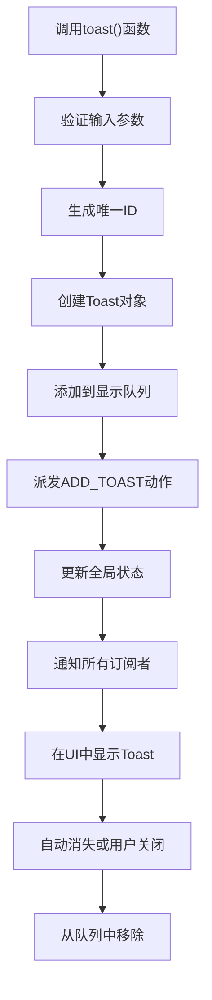
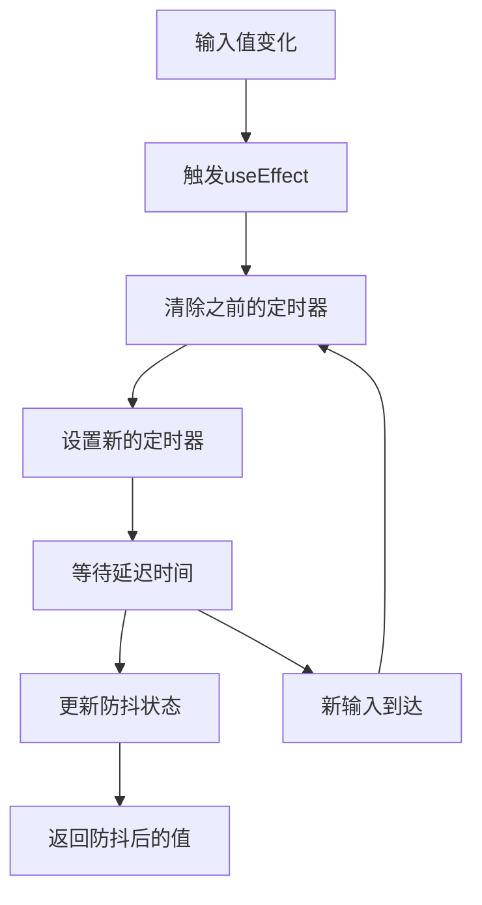
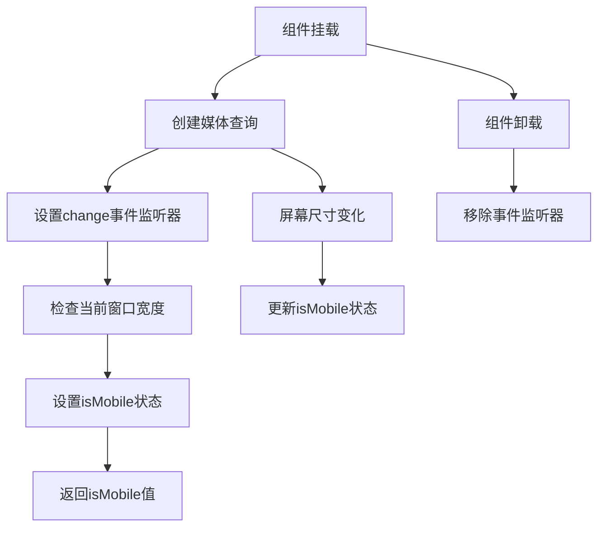
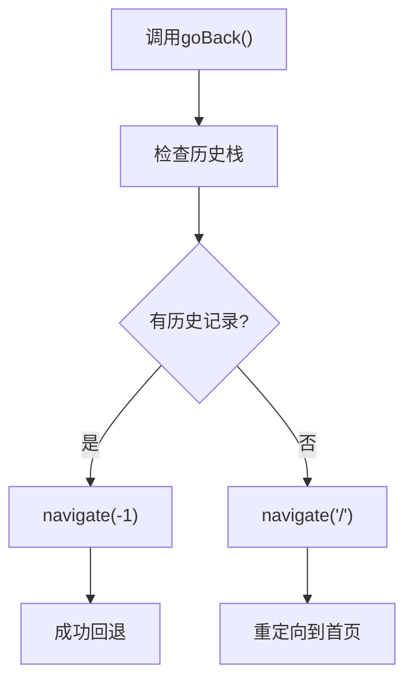

# 自定义Hook

<cite>
**本文档引用的文件**   
- [use-toast.tsx](file://src/hooks/use-toast.tsx)
- [use-debounce.ts](file://src/hooks/use-debounce.ts)
- [use-mobile.ts](file://src/hooks/use-mobile.ts)
- [use-go-back.ts](file://src/hooks/use-go-back.ts)
- [AppointmentPage.tsx](file://src/pages/doctor/AppointmentPage.tsx)
- [SchedulePage.tsx](file://src/pages/head-nurse/SchedulePage.tsx)
- [sonner.tsx](file://src/components/ui/sonner.tsx)
- [sidebar.tsx](file://src/components/ui/sidebar.tsx)
</cite>

## 目录
1. [简介](#简介)
2. [核心Hook分析](#核心Hook分析)
3. [useToast实现与应用](#useToast实现与应用)
4. [useDebounce实现与应用](#useDebounce实现与应用)
5. [useMobile实现与应用](#useMobile实现与应用)
6. [useGoBack实现与应用](#useGoBack实现与应用)
7. [性能优化建议](#性能优化建议)
8. [常见错误处理](#常见错误处理)
9. [总结](#总结)

## 简介
本项目通过创建一系列自定义Hook来提升代码的复用性和可维护性。这些Hook封装了常见的业务逻辑和UI交互模式，使得在不同页面和组件中能够一致地使用相同的功能。四个核心Hook包括：useToast用于全局通知系统，useDebounce用于输入防抖控制，useMobile用于响应式设备检测，以及useGoBack用于浏览器历史栈的安全回退。这些Hook在AppointmentPage、SchedulePage等关键页面中得到了广泛应用，有效提升了开发效率和用户体验。

## 核心Hook分析
项目中的自定义Hook设计遵循React最佳实践，通过封装复杂逻辑提供简洁的API接口。每个Hook都针对特定的使用场景进行了优化，同时保持了良好的类型安全性和可测试性。这些Hook不仅提高了代码复用率，还降低了组件间的耦合度，使得应用架构更加清晰和易于维护。

**Section sources**
- [use-toast.tsx](file://src/hooks/use-toast.tsx)
- [use-debounce.ts](file://src/hooks/use-debounce.ts)
- [use-mobile.ts](file://src/hooks/use-mobile.ts)
- [use-go-back.ts](file://src/hooks/use-go-back.ts)

## useToast实现与应用

### 实现逻辑
useToast Hook基于sonner库实现了全局通知系统。它通过一个中央状态管理器来处理toast消息的添加、更新和移除操作。核心实现包括：

1. 定义了TOAST_LIMIT常量限制同时显示的toast数量
2. 使用reducer模式管理toast状态，支持ADD_TOAST、UPDATE_TOAST、DISMISS_TOAST和REMOVE_TOAST四种操作
3. 维护一个listeners数组，允许多个组件订阅toast状态变化
4. 提供toast函数作为主要API，支持标题、描述、操作按钮等丰富配置



**Diagram sources**
- [use-toast.tsx](file://src/hooks/use-toast.tsx#L1-L188)

### 使用场景
useToast在多个页面中用于提供用户操作反馈。例如在AppointmentPage中，当医生接受或拒绝预约时，系统会显示相应的成功或错误通知：

```typescript
// 在AppointmentPage中的使用示例
toast.success('预约已接受');
toast.error(error.message || '操作失败');
```

在SchedulePage中，排班操作的结果也会通过toast通知用户：

```typescript
toast.success('排班已创建');
toast.error(`加载数据失败: ${errorMessage}`);
```

**Section sources**
- [use-toast.tsx](file://src/hooks/use-toast.tsx#L1-L188)
- [AppointmentPage.tsx](file://src/pages/doctor/AppointmentPage.tsx#L62-L66)
- [SchedulePage.tsx](file://src/pages/head-nurse/SchedulePage.tsx#L118-L119)

## useDebounce实现与应用

### 实现逻辑
useDebounce Hook实现了标准的防抖功能，用于减少频繁的状态更新。其核心实现非常简洁：

1. 接收一个泛型值和可选的延迟时间参数
2. 使用useState创建一个防抖后的状态
3. 在useEffect中设置定时器，在指定延迟后更新防抖状态
4. 清理函数确保在组件卸载或值变化时清除之前的定时器



**Diagram sources**
- [use-debounce.ts](file://src/hooks/use-debounce.ts#L1-L15)

### 使用场景
虽然在当前分析的文件中没有直接看到useDebounce的使用，但根据其设计目的，它非常适合用于以下场景：

1. 表单输入：在搜索框或输入字段中防止频繁的API调用
2. 实时搜索：在用户输入时延迟发送搜索请求
3. 窗口大小调整：避免在resize事件中频繁执行昂贵的计算

典型的使用方式如下：
```typescript
const debouncedSearchTerm = useDebounce(searchTerm, 500);
```

**Section sources**
- [use-debounce.ts](file://src/hooks/use-debounce.ts#L1-L15)

## useMobile实现与应用

### 实现逻辑
useMobile Hook基于CSS媒体查询实现了响应式设备检测。其实现特点包括：

1. 定义MOBILE_BREAKPOINT为768px作为移动设备断点
2. 使用window.matchMedia监听媒体查询变化
3. 在useEffect中设置事件监听器，确保组件卸载时正确清理
4. 返回布尔值表示当前是否为移动设备



**Diagram sources**
- [use-mobile.ts](file://src/hooks/use-mobile.ts#L1-L19)

### 使用场景
useMobile在sidebar组件中被用来实现响应式侧边栏：

```typescript
const isMobile = useIsMobile();
```

根据设备类型，侧边栏会呈现不同的交互模式：
- 在移动设备上：使用Sheet组件作为抽屉式导航
- 在桌面设备上：使用固定宽度的侧边栏

这种设计确保了在不同设备上都能提供最佳的用户体验。

**Section sources**
- [use-mobile.ts](file://src/hooks/use-mobile.ts#L1-L19)
- [sidebar.tsx](file://src/components/ui/sidebar.tsx#L67)

## useGoBack实现与应用

### 实现逻辑
useGoBack Hook提供了安全的浏览器历史回退功能。其实现考虑了边界情况：

1. 使用react-router-dom的useNavigate获取导航函数
2. 检查window.history.state.idx > 0来判断是否有历史记录
3. 如果有历史记录，则使用navigate(-1)回退
4. 如果没有历史记录，则导航到首页



**Diagram sources**
- [use-go-back.ts](file://src/hooks/use-go-back.ts#L1-L17)

### 使用场景
useGoBack可以用于各种需要返回上一页的场景，例如：
- 表单取消操作
- 对话框关闭后返回原页面
- 详情页返回列表页

典型的使用方式：
```typescript
const goBack = useGoBack();
// 在按钮点击事件中
goBack();
```

**Section sources**
- [use-go-back.ts](file://src/hooks/use-go-back.ts#L1-L17)

## 性能优化建议
1. **useToast优化**：当前TOAST_LIMIT设置为1，可以考虑增加以支持多个通知同时显示，但需注意用户体验
2. **useDebounce配置**：提供默认延迟时间的配置选项，便于在不同场景下调整
3. **useMobile缓存**：可以添加localStorage缓存机制，记住用户设备偏好
4. **useGoBack增强**：可以添加返回指定路径的功能，提供更多导航灵活性

## 常见错误处理
1. **useToast内存泄漏**：确保在组件卸载时正确清理listeners，当前实现已处理此问题
2. **useDebounce竞态条件**：通过useEffect的清理函数避免，当前实现正确
3. **useMobile SSR问题**：在服务端渲染时window对象不存在，需要添加安全检查
4. **useGoBack历史栈为空**：已通过条件判断处理，避免无效导航

## 总结
这四个自定义Hook有效地解决了项目中的常见需求，体现了良好的代码组织和复用原则。useToast提供了统一的通知系统，useDebounce优化了性能敏感的操作，useMobile支持响应式设计，useGoBack确保了导航的安全性。这些Hook的设计简洁而强大，为项目的可维护性和扩展性奠定了坚实基础。