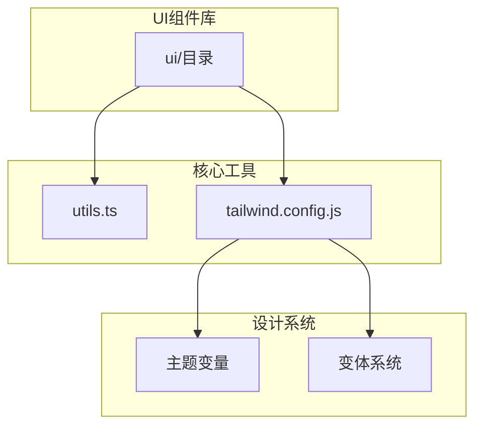
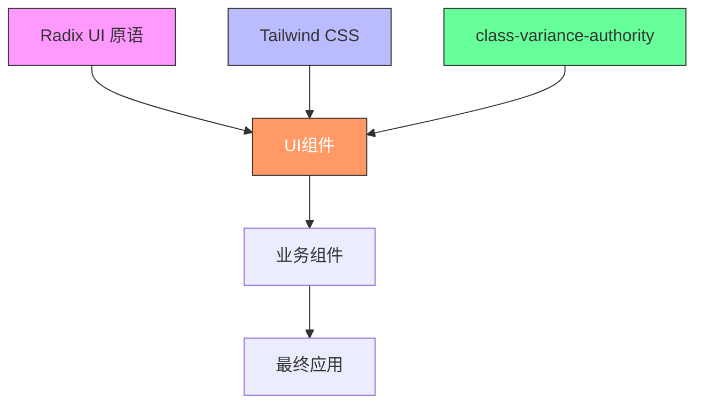
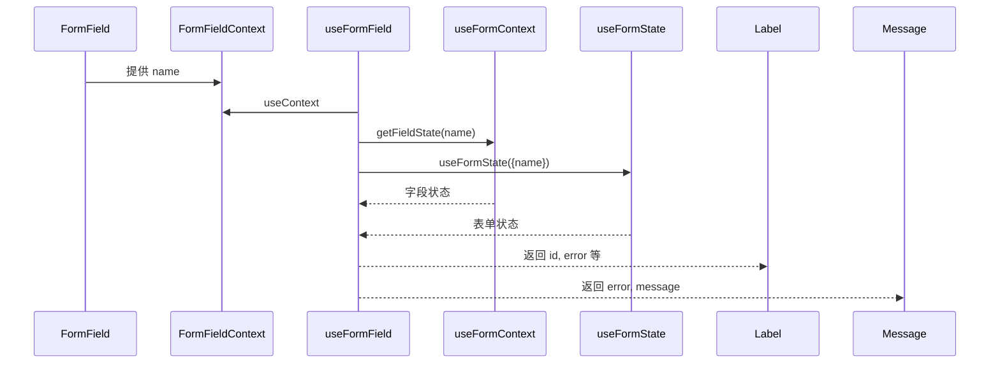
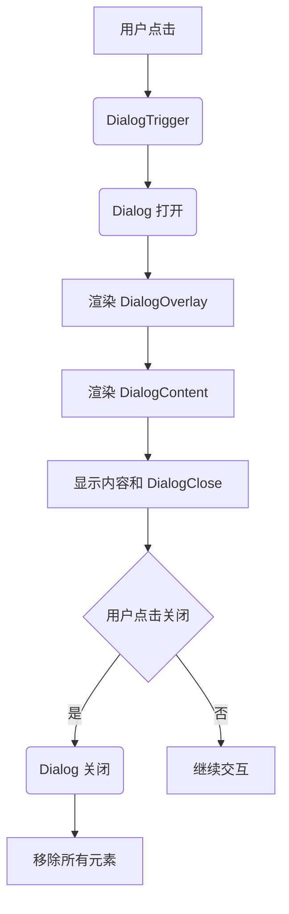
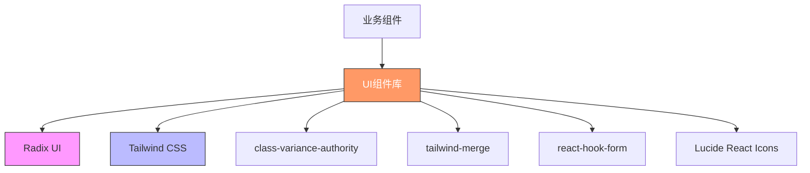

# UI组件库

<cite>
**本文档中引用的文件**  
- [button.tsx](file://src/components/ui/button.tsx)
- [input.tsx](file://src/components/ui/input.tsx)
- [dialog.tsx](file://src/components/ui/dialog.tsx)
- [form.tsx](file://src/components/ui/form.tsx)
- [select.tsx](file://src/components/ui/select.tsx)
- [checkbox.tsx](file://src/components/ui/checkbox.tsx)
- [toast.tsx](file://src/components/ui/toast.tsx)
- [badge.tsx](file://src/components/ui/badge.tsx)
- [card.tsx](file://src/components/ui/card.tsx)
- [table.tsx](file://src/components/ui/table.tsx)
- [tabs.tsx](file://src/components/ui/tabs.tsx)
- [alert.tsx](file://src/components/ui/alert.tsx)
- [textarea.tsx](file://src/components/ui/textarea.tsx)
- [utils.ts](file://src/lib/utils.ts)
- [tailwind.config.js](file://tailwind.config.js)
</cite>

## 目录
1. [简介](#简介)
2. [项目结构](#项目结构)
3. [核心组件](#核心组件)
4. [架构概述](#架构概述)
5. [详细组件分析](#详细组件分析)
6. [依赖分析](#依赖分析)
7. [性能考虑](#性能考虑)
8. [故障排除指南](#故障排除指南)
9. [结论](#结论)

## 简介
Bio-Appointment UI组件库是一个基于Radix UI原语和Tailwind CSS构建的现代化、可访问性强的组件系统。该组件库为预约管理系统提供了统一的设计语言和交互模式，确保跨角色（医生、护士、销售、管理员）的一致用户体验。组件库采用原子化设计理念，将界面分解为可复用的基础元素，并通过TypeScript接口明确定义Props和事件处理机制。所有组件都遵循无障碍访问标准（a11y），支持键盘导航和屏幕阅读器，并通过Tailwind CSS实现灵活的样式定制和响应式设计。

## 项目结构
UI组件库位于`src/components/ui/`目录下，采用原子化设计原则组织。每个组件都是一个独立的TSX文件，封装了Radix UI的底层原语，并通过Tailwind CSS进行样式定义。组件库通过`class-variance-authority`（cva）管理变体（如按钮的variant和size），并通过`tailwind-merge`和`clsx`工具函数处理类名合并，确保样式覆盖的灵活性。`src/lib/utils.ts`文件提供了`cn`工具函数，是所有组件样式合并的核心。`tailwind.config.js`定义了设计系统的核心变量，包括颜色、圆角、阴影等，通过CSS自定义属性（如`hsl(var(--primary))`）实现主题继承。



**图示来源**
- [tailwind.config.js](file://tailwind.config.js#L25-L98)
- [utils.ts](file://src/lib/utils.ts#L4-L6)

**本节来源**
- [src/components/ui/](file://src/components/ui/)

## 核心组件
核心组件包括基础、表单、反馈和布局四大类。基础组件如Button、Input、Badge提供基本的UI元素；表单组件如Form、Select、Checkbox构建复杂的用户输入界面；反馈组件如Dialog、Toast、Alert向用户传达信息；布局组件如Card、Table、Tabs组织内容结构。所有组件都通过`data-slot`属性进行语义化标记，增强可访问性。组件的Props接口扩展自原生HTML属性，并通过`VariantProps<typeof componentVariants>`集成变体系统，实现类型安全的配置。

**本节来源**
- [button.tsx](file://src/components/ui/button.tsx#L37-L41)
- [input.tsx](file://src/components/ui/input.tsx#L5-L6)
- [dialog.tsx](file://src/components/ui/dialog.tsx#L9-L13)
- [form.tsx](file://src/components/ui/form.tsx#L17-L167)

## 架构概述
UI组件库的架构建立在Radix UI和Tailwind CSS的坚实基础之上。Radix UI提供无样式的、可访问性优先的原语组件（如`@radix-ui/react-dialog`），确保所有交互组件（对话框、下拉菜单等）都符合WAI-ARIA标准。Tailwind CSS则负责视觉呈现，通过实用类（utility classes）实现快速、一致的样式设计。`class-variance-authority`（cva）作为中间层，将设计系统的变体（variants）如`default`、`destructive`、`outline`等映射为一组Tailwind类名，使组件变体的管理更加系统化和可维护。



**图示来源**
- [button.tsx](file://src/components/ui/button.tsx#L7-L35)
- [dialog.tsx](file://src/components/ui/dialog.tsx#L4-L5)
- [utils.ts](file://src/lib/utils.ts#L4-L6)

## 详细组件分析
本节将深入分析几类关键组件的实现细节，包括其Props接口、事件处理机制和样式定制方式。

### 基础组件分析
基础组件是构建用户界面的基石，提供一致的视觉语言和交互模式。

#### Button组件
Button组件是典型的原子化组件，封装了`<button>`元素和Radix UI的`Slot`原语。其`ButtonProps`接口扩展了`React.ButtonHTMLAttributes<HTMLButtonElement>`，继承了所有原生按钮属性（如`onClick`、`disabled`）。通过`VariantProps<typeof buttonVariants>`，它集成了预定义的`variant`（default, destructive, outline等）和`size`（default, sm, lg等）变体。`asChild`属性允许将样式应用到子组件上，实现更灵活的组合。样式通过`cn`函数合并`buttonVariants`生成的类名和用户传入的`className`，支持Tailwind类的覆盖。

```mermaid
classDiagram
class ButtonProps {
+variant : "default" | "destructive" | "outline" | "secondary" | "ghost" | "link"
+size : "default" | "sm" | "lg" | "icon"
+asChild? : boolean
+className? : string
}
class buttonVariants {
+variants : { variant : {...}, size : {...} }
+defaultVariants : { variant : "default", size : "default" }
}
ButtonProps --> buttonVariants : "使用"
```

**图示来源**
- [button.tsx](file://src/components/ui/button.tsx#L7-L58)

**本节来源**
- [button.tsx](file://src/components/ui/button.tsx#L37-L58)
- [badge.tsx](file://src/components/ui/badge.tsx#L7-L47)

#### Input组件
Input组件直接封装了原生`<input>`元素，专注于提供一致的输入体验。它通过`React.ComponentProps<"input">`继承所有原生输入属性。组件内部应用了大量Tailwind类，定义了边框、阴影、焦点状态和无效状态的样式。`data-slot="input"`属性增强了组件的可访问性语义。`cn`函数用于合并基础样式、焦点样式、无效状态样式和用户传入的`className`，确保样式定制的灵活性。

**本节来源**
- [input.tsx](file://src/components/ui/input.tsx#L5-L27)
- [textarea.tsx](file://src/components/ui/textarea.tsx#L5-L17)

### 表单组件分析
表单组件利用`react-hook-form`库管理复杂的表单状态和验证逻辑。

#### Form组件
Form组件是一个复合组件，由`Form`、`FormField`、`FormItem`、`FormLabel`、`FormControl`、`FormDescription`和`FormMessage`等多个部分组成。它通过`react-hook-form`的`Controller`和`useFormContext`与表单状态集成。`FormField`使用React Context（`FormFieldContext`）将字段名传递给其子组件。`useFormField`钩子是连接上下文和表单状态的桥梁，它获取字段的错误状态并生成用于ARIA属性的ID。`FormLabel`根据`error`状态动态应用`text-destructive`类，`FormMessage`则只在有错误时渲染，提供即时的反馈。



**图示来源**
- [form.tsx](file://src/components/ui/form.tsx#L26-L64)

**本节来源**
- [form.tsx](file://src/components/ui/form.tsx#L17-L167)
- [select.tsx](file://src/components/ui/select.tsx#L1-L160)

#### Select组件
Select组件完全基于`@radix-ui/react-select`构建，展示了如何封装复杂的交互原语。它暴露了`Select`、`SelectTrigger`、`SelectContent`、`SelectItem`等子组件，形成一个声明式的API。`SelectTrigger`的样式定义了下拉箭头（`ChevronDown`图标），`SelectContent`则处理下拉菜单的定位和滚动。`SelectItem`通过`SelectPrimitive.ItemIndicator`在选中项前显示一个`Check`图标。整个组件通过`data-[state=checked]`等Radix UI的状态属性实现动态样式。

**本节来源**
- [select.tsx](file://src/components/ui/select.tsx#L1-L160)
- [checkbox.tsx](file://src/components/ui/checkbox.tsx#L1-L31)

### 反馈组件分析
反馈组件用于向用户展示信息、警告或进行关键操作。

#### Dialog组件
Dialog组件是Radix UI原语的直接封装，由多个部分组成：`Dialog`（根组件）、`DialogTrigger`（触发器）、`DialogContent`（内容）、`DialogOverlay`（遮罩层）和`DialogClose`（关闭按钮）。`DialogContent`使用`DialogPortal`确保其渲染在DOM树的顶层，避免z-index问题。`DialogOverlay`应用了半透明黑色背景和淡入淡出动画。`DialogContent`本身具有居中定位、圆角、阴影和缩放动画。`DialogClose`按钮内嵌了一个`XIcon`，并带有`sr-only`的“Close”文本，确保屏幕阅读器可以识别。



**图示来源**
- [dialog.tsx](file://src/components/ui/dialog.tsx#L9-L73)

**本节来源**
- [dialog.tsx](file://src/components/ui/dialog.tsx#L1-L136)
- [alert.tsx](file://src/components/ui/alert.tsx#L1-L67)

#### Toast组件
Toast组件用于显示短暂的非模态消息。`ToastProvider`是所有Toast的容器，`ToastViewport`定义了Toast出现的位置（默认在屏幕右下角）。`Toast`组件本身通过`toastVariants`管理`default`和`destructive`两种变体。它支持`ToastTitle`、`ToastDescription`和可选的`ToastAction`（一个操作按钮）和`ToastClose`（关闭按钮）。动画通过Radix UI的状态属性（`data-[state=open]`）和自定义的`slide-in-from-bottom-full`等类实现。

**本节来源**
- [toast.tsx](file://src/components/ui/toast.tsx#L1-L130)
- [alert.tsx](file://src/components/ui/alert.tsx#L1-L67)

### 布局组件分析
布局组件用于组织和呈现内容，构建页面的整体结构。

#### Card组件
Card组件是一个复合布局组件，由`Card`、`CardHeader`、`CardTitle`、`CardDescription`、`CardAction`、`CardContent`和`CardFooter`组成。`CardHeader`使用CSS Grid布局，通过`has-data-[slot=card-action]`选择器在存在`CardAction`时创建两列布局，使操作按钮（如“编辑”）可以右对齐。`Card`本身应用了`bg-card`和`border`等类，提供卡片的视觉基础。

**本节来源**
- [card.tsx](file://src/components/ui/card.tsx#L1-L93)
- [table.tsx](file://src/components/ui/table.tsx#L1-L115)

#### Table组件
Table组件封装了原生`<table>`元素，并通过`data-slot`属性为每个部分（表头、表体、行、单元格）提供语义化标记。`Table`组件的容器是一个`overflow-x-auto`的`div`，确保在小屏幕上可以横向滚动。`TableRow`通过`hover:bg-muted/50`实现悬停效果，并通过`data-[state=selected]`支持选中状态。`TableHead`和`TableCell`都应用了`whitespace-nowrap`防止文本换行。

**本节来源**
- [table.tsx](file://src/components/ui/table.tsx#L1-L115)
- [tabs.tsx](file://src/components/ui/tabs.tsx#L1-L65)

## 依赖分析
UI组件库的依赖关系清晰且分层明确。核心依赖是Radix UI系列包（如`@radix-ui/react-dialog`、`@radix-ui/react-slot`），它们提供无样式的、可访问性优先的交互原语。样式依赖是Tailwind CSS及其生态系统，包括`class-variance-authority`（用于管理组件变体）和`tailwind-merge`（用于安全地合并类名）。`react-hook-form`是表单组件的关键依赖，用于管理表单状态。所有组件都通过`src/lib/utils.ts`中的`cn`函数统一处理类名合并，这减少了重复代码并确保了样式合并逻辑的一致性。



**图示来源**
- [tailwind.config.js](file://tailwind.config.js#L1-L3)
- [package.json](file://package.json)

**本节来源**
- [tailwind.config.js](file://tailwind.config.js#L1-L3)
- [button.tsx](file://src/components/ui/button.tsx#L2-L3)
- [form.tsx](file://src/components/ui/form.tsx#L5-L12)

## 性能考虑
该UI组件库在性能方面表现良好。由于组件大多是轻量级的函数组件，且主要依赖于Tailwind CSS的原子化类，渲染开销很小。Radix UI原语经过优化，确保了高效的DOM操作和事件处理。`class-variance-authority`在构建时生成静态的类名映射，运行时开销极低。`cn`工具函数的性能也经过优化，能够快速合并和去重类名。对于复杂的列表渲染（如`Table`中的多行数据），开发者应结合React的`key`属性和可能的虚拟滚动技术来优化性能，但组件库本身不强制要求这些。

## 故障排除指南
当遇到UI组件问题时，首先检查控制台是否有错误信息。对于样式问题，检查`className`是否被正确传递，以及`cn`函数是否正常工作。对于交互问题（如Dialog无法打开），检查`DialogTrigger`和`DialogContent`是否正确配对，并确保没有z-index冲突。对于表单验证问题，确认`react-hook-form`的`Controller`是否正确包裹了`FormField`，并且`name`属性是否唯一。对于无障碍访问问题，使用浏览器的开发者工具检查`aria-*`属性和`role`是否正确应用。最后，查阅`tailwind.config.js`中的设计变量，确保自定义样式与主题一致。

**本节来源**
- [form.tsx](file://src/components/ui/form.tsx#L43-L64)
- [dialog.tsx](file://src/components/ui/dialog.tsx#L66-L68)
- [tailwind.config.js](file://tailwind.config.js#L25-L98)

## 结论
Bio-Appointment UI组件库是一个设计精良、功能完备的前端解决方案。它成功地将Radix UI的强大功能与Tailwind CSS的灵活性相结合，创建了一个既可访问又可高度定制的组件系统。通过原子化设计和清晰的组件分类，它极大地提高了开发效率和用户体验的一致性。开发者可以通过`asChild`属性和`className`轻松扩展和覆盖组件样式，同时依赖`react-hook-form`和Radix UI确保了复杂交互的健壮性。该组件库为Bio-Appointment应用的持续发展奠定了坚实的基础。