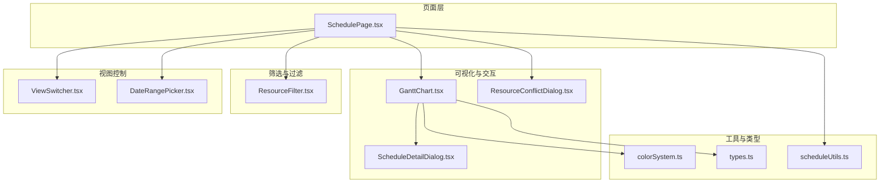
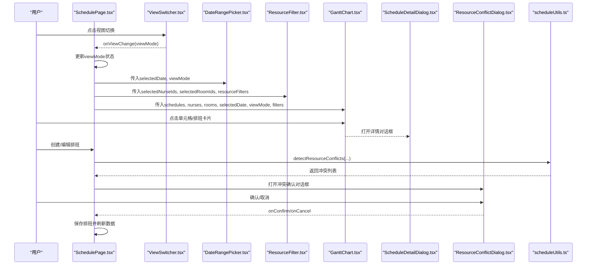
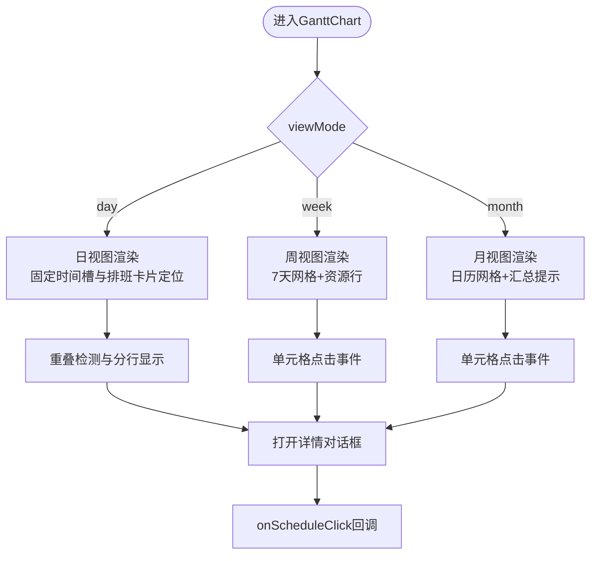
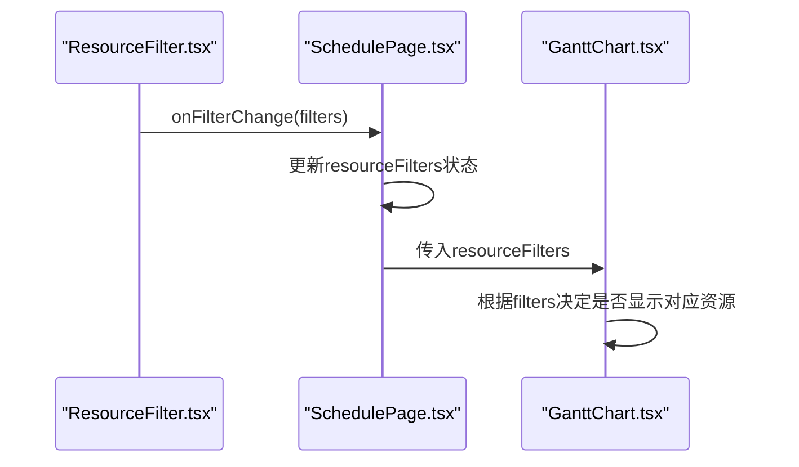
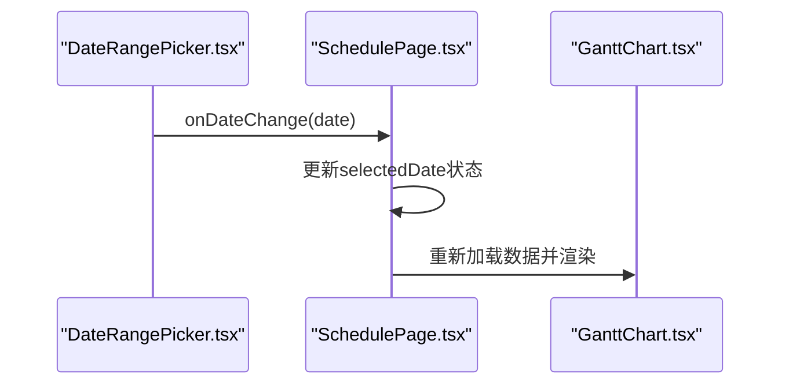
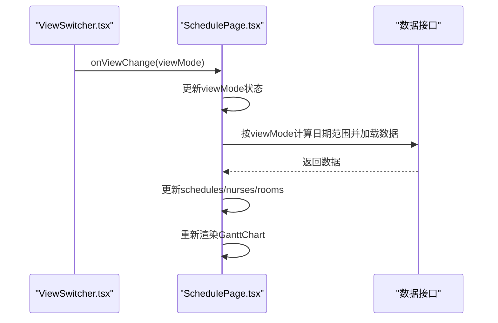
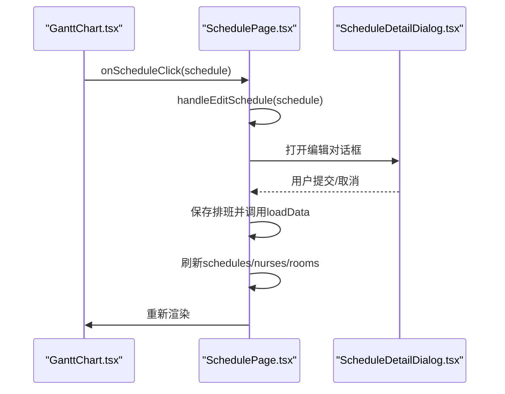
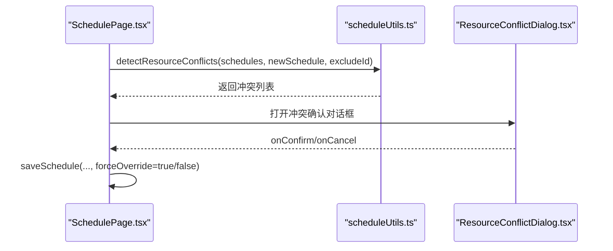
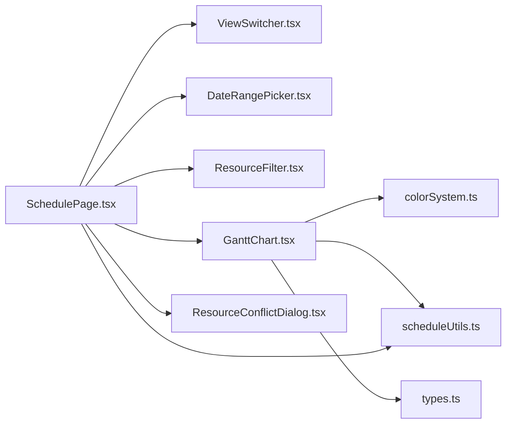

# 业务组件

<cite>
**本文引用的文件**
- [GanttChart.tsx](file://src/components/appointment/GanttChart.tsx)
- [ResourceFilter.tsx](file://src/components/appointment/ResourceFilter.tsx)
- [DateRangePicker.tsx](file://src/components/appointment/DateRangePicker.tsx)
- [ViewSwitcher.tsx](file://src/components/appointment/ViewSwitcher.tsx)
- [ScheduleDetailDialog.tsx](file://src/components/appointment/ScheduleDetailDialog.tsx)
- [ResourceConflictDialog.tsx](file://src/components/appointment/ResourceConflictDialog.tsx)
- [scheduleUtils.ts](file://src/utils/scheduleUtils.ts)
- [colorSystem.ts](file://src/utils/colorSystem.ts)
- [types.ts](file://src/types/types.ts)
- [SchedulePage.tsx](file://src/pages/head-nurse/SchedulePage.tsx)
</cite>

## 目录
1. [简介](#简介)
2. [项目结构](#项目结构)
3. [核心组件](#核心组件)
4. [架构总览](#架构总览)
5. [详细组件分析](#详细组件分析)
6. [依赖关系分析](#依赖关系分析)
7. [性能考量](#性能考量)
8. [故障排查指南](#故障排查指南)
9. [结论](#结论)

## 简介
本文件聚焦于Bio-Appointment中的核心业务组件，围绕资源调度可视化与筛选交互展开，重点解析：
- GanttChart组件如何通过自定义渲染实现资源调度可视化，覆盖时间轴计算、重叠排班分行显示、点击详情对话框联动等。
- ResourceFilter与DateRangePicker的筛选状态管理机制及与父组件的数据同步方式。
- ViewSwitcher在日/周/月视图切换时的状态传递与持久化策略。
- 组件间通信示例：ScheduleDetailDialog如何通过回调更新排班数据。
- 性能优化建议（如虚拟滚动）与常见使用错误排查。

## 项目结构
本项目采用按功能域划分的组件组织方式，业务看板位于appointment目录下，配合页面级容器组件进行状态管理与数据加载。

图表来源
- [SchedulePage.tsx](file://src/pages/head-nurse/SchedulePage.tsx#L453-L486)
- [ViewSwitcher.tsx](file://src/components/appointment/ViewSwitcher.tsx#L1-L39)
- [DateRangePicker.tsx](file://src/components/appointment/DateRangePicker.tsx#L1-L223)
- [ResourceFilter.tsx](file://src/components/appointment/ResourceFilter.tsx#L1-L94)
- [GanttChart.tsx](file://src/components/appointment/GanttChart.tsx#L1-L917)
- [ScheduleDetailDialog.tsx](file://src/components/appointment/ScheduleDetailDialog.tsx#L1-L175)
- [ResourceConflictDialog.tsx](file://src/components/appointment/ResourceConflictDialog.tsx#L1-L93)
- [scheduleUtils.ts](file://src/utils/scheduleUtils.ts#L1-L112)
- [colorSystem.ts](file://src/utils/colorSystem.ts#L1-L140)
- [types.ts](file://src/types/types.ts#L1-L487)

章节来源
- [SchedulePage.tsx](file://src/pages/head-nurse/SchedulePage.tsx#L453-L486)

## 核心组件
- GanttChart：资源调度可视化主组件，支持日/周/月视图，内置重叠排班分行显示与点击详情对话框联动。
- ResourceFilter：资源维度筛选（护士/房间），与父组件双向同步状态。
- DateRangePicker：日期范围选择与导航，按视图模式动态展示。
- ViewSwitcher：日/周/月视图切换按钮，驱动SchedulePage状态更新。
- ScheduleDetailDialog：排班详情弹窗，承载排班信息与状态展示。
- ResourceConflictDialog：资源冲突确认对话框，配合scheduleUtils进行冲突检测。
- scheduleUtils：时间重叠检测与资源冲突检测工具函数。
- colorSystem：护士/房间颜色编码与组合渐变，用于可视化区分。
- types：排班与资源类型定义，支撑组件间数据契约。

章节来源
- [GanttChart.tsx](file://src/components/appointment/GanttChart.tsx#L1-L917)
- [ResourceFilter.tsx](file://src/components/appointment/ResourceFilter.tsx#L1-L94)
- [DateRangePicker.tsx](file://src/components/appointment/DateRangePicker.tsx#L1-L223)
- [ViewSwitcher.tsx](file://src/components/appointment/ViewSwitcher.tsx#L1-L39)
- [ScheduleDetailDialog.tsx](file://src/components/appointment/ScheduleDetailDialog.tsx#L1-L175)
- [ResourceConflictDialog.tsx](file://src/components/appointment/ResourceConflictDialog.tsx#L1-L93)
- [scheduleUtils.ts](file://src/utils/scheduleUtils.ts#L1-L112)
- [colorSystem.ts](file://src/utils/colorSystem.ts#L1-L140)
- [types.ts](file://src/types/types.ts#L1-L487)

## 架构总览
下图展示了从页面容器到各业务组件的调用链路与数据流向。

图表来源
- [SchedulePage.tsx](file://src/pages/head-nurse/SchedulePage.tsx#L453-L486)
- [ViewSwitcher.tsx](file://src/components/appointment/ViewSwitcher.tsx#L1-L39)
- [DateRangePicker.tsx](file://src/components/appointment/DateRangePicker.tsx#L1-L223)
- [ResourceFilter.tsx](file://src/components/appointment/ResourceFilter.tsx#L1-L94)
- [GanttChart.tsx](file://src/components/appointment/GanttChart.tsx#L1-L917)
- [ScheduleDetailDialog.tsx](file://src/components/appointment/ScheduleDetailDialog.tsx#L1-L175)
- [ResourceConflictDialog.tsx](file://src/components/appointment/ResourceConflictDialog.tsx#L1-L93)
- [scheduleUtils.ts](file://src/utils/scheduleUtils.ts#L1-L112)

## 详细组件分析

### GanttChart组件：资源调度可视化
- 视图模式与时间轴
  - 支持日/周/月三种视图，通过viewMode参数驱动渲染分支。
  - 日视图采用固定时间槽（每小时半点），通过起止时间计算left与width百分比定位排班卡片。
  - 周/月视图通过date-fns计算周起止/月起止，并以网格形式展示。
- 筛选与可见性
  - 支持基于selectedNurseIds与selectedRoomIds的严格筛选；当任一为空时显示全部。
  - 支持resourceFilters对资源维度（护士/房间）进行显隐控制。
- 重叠检测与分行显示
  - 使用时间重叠算法判断两段区间是否相交。
  - 对同一资源的排班集合进行分行布局，避免重叠遮挡，动态计算行高并提示重叠数量。
- 交互与对话框
  - 单元格点击触发详情对话框，支持按日期与资源类型聚合展示。
  - 排班卡片支持点击回调onScheduleClick，便于打开编辑对话框。
- 颜色与样式
  - 使用colorSystem为护士与房间生成颜色，并通过组合渐变实现“护士-房间”双色视觉编码。
  - 急单与锁定状态通过边框样式突出显示。

图表来源
- [GanttChart.tsx](file://src/components/appointment/GanttChart.tsx#L1-L917)
- [colorSystem.ts](file://src/utils/colorSystem.ts#L1-L140)
- [scheduleUtils.ts](file://src/utils/scheduleUtils.ts#L1-L112)

章节来源
- [GanttChart.tsx](file://src/components/appointment/GanttChart.tsx#L1-L917)
- [colorSystem.ts](file://src/utils/colorSystem.ts#L1-L140)
- [scheduleUtils.ts](file://src/utils/scheduleUtils.ts#L1-L112)

### ResourceFilter：资源筛选状态管理
- 状态来源
  - 由父组件SchedulePage维护selectedNurseIds与selectedRoomIds，并通过props传入。
- 交互行为
  - 通过复选框切换资源维度（护士/房间）的显隐，onFilterChange回调向上同步。
- 与父组件的数据同步
  - 父组件在onFilterChange中更新本地状态，进而影响GanttChart的visibleNurses与visibleRooms，实现严格筛选。

图表来源
- [ResourceFilter.tsx](file://src/components/appointment/ResourceFilter.tsx#L1-L94)
- [SchedulePage.tsx](file://src/pages/head-nurse/SchedulePage.tsx#L333-L346)
- [GanttChart.tsx](file://src/components/appointment/GanttChart.tsx#L1-L917)

章节来源
- [ResourceFilter.tsx](file://src/components/appointment/ResourceFilter.tsx#L1-L94)
- [SchedulePage.tsx](file://src/pages/head-nurse/SchedulePage.tsx#L333-L346)
- [GanttChart.tsx](file://src/components/appointment/GanttChart.tsx#L1-L917)

### DateRangePicker：日期范围选择与导航
- 视图适配
  - 根据viewMode动态展示不同选择器：日视图单日选择、周视图周选择、月视图年/月选择。
- 导航与快捷
  - 提供上一时间段、下一时间段与“今天”快捷入口，onDateChange回调更新父组件selectedDate。
- 文本提示
  - 根据当前视图生成日期范围文本与简短文本，提升可读性。

图表来源
- [DateRangePicker.tsx](file://src/components/appointment/DateRangePicker.tsx#L1-L223)
- [SchedulePage.tsx](file://src/pages/head-nurse/SchedulePage.tsx#L453-L486)
- [GanttChart.tsx](file://src/components/appointment/GanttChart.tsx#L1-L917)

章节来源
- [DateRangePicker.tsx](file://src/components/appointment/DateRangePicker.tsx#L1-L223)
- [SchedulePage.tsx](file://src/pages/head-nurse/SchedulePage.tsx#L453-L486)

### ViewSwitcher：视图切换与状态持久化
- 视图切换
  - 提供日/周/月三态按钮，点击后通过onViewChange回调更新父组件viewMode。
- 状态持久化策略
  - 通过父组件SchedulePage维护viewMode与selectedDate，二者共同决定数据加载与渲染范围。
  - 在SchedulePage中，useEffect监听viewMode与selectedDate变化，触发数据拉取与组件重渲染，从而实现“视图模式+日期”的状态持久化。

图表来源
- [ViewSwitcher.tsx](file://src/components/appointment/ViewSwitcher.tsx#L1-L39)
- [SchedulePage.tsx](file://src/pages/head-nurse/SchedulePage.tsx#L59-L120)
- [GanttChart.tsx](file://src/components/appointment/GanttChart.tsx#L1-L917)

章节来源
- [ViewSwitcher.tsx](file://src/components/appointment/ViewSwitcher.tsx#L1-L39)
- [SchedulePage.tsx](file://src/pages/head-nurse/SchedulePage.tsx#L59-L120)

### ScheduleDetailDialog：排班详情与回调更新
- 详情展示
  - 展示日期、资源名称与类型、排班状态、时间与时长、服务信息、同行客户、护士/房间等。
- 回调更新
  - GanttChart通过onScheduleClick回调将选中排班传递给父组件，父组件打开编辑对话框并进行更新。
  - 更新成功后，父组件调用loadData刷新数据，确保GanttChart重新渲染。

图表来源
- [GanttChart.tsx](file://src/components/appointment/GanttChart.tsx#L1-L917)
- [SchedulePage.tsx](file://src/pages/head-nurse/SchedulePage.tsx#L148-L238)
- [ScheduleDetailDialog.tsx](file://src/components/appointment/ScheduleDetailDialog.tsx#L1-L175)

章节来源
- [GanttChart.tsx](file://src/components/appointment/GanttChart.tsx#L1-L917)
- [SchedulePage.tsx](file://src/pages/head-nurse/SchedulePage.tsx#L148-L238)
- [ScheduleDetailDialog.tsx](file://src/components/appointment/ScheduleDetailDialog.tsx#L1-L175)

### ResourceConflictDialog：冲突检测与强制排班
- 冲突检测
  - 通过scheduleUtils的detectResourceConflicts检测房间与护士冲突，返回冲突列表。
- 对话框交互
  - 展示冲突详情与风险提示，提供“取消/强制排班”两种选择。
  - 父组件在用户确认后调用saveSchedule并传入forceOverride标志，实现强制排班。

图表来源
- [SchedulePage.tsx](file://src/pages/head-nurse/SchedulePage.tsx#L167-L193)
- [scheduleUtils.ts](file://src/utils/scheduleUtils.ts#L1-L112)
- [ResourceConflictDialog.tsx](file://src/components/appointment/ResourceConflictDialog.tsx#L1-L93)

章节来源
- [SchedulePage.tsx](file://src/pages/head-nurse/SchedulePage.tsx#L167-L193)
- [scheduleUtils.ts](file://src/utils/scheduleUtils.ts#L1-L112)
- [ResourceConflictDialog.tsx](file://src/components/appointment/ResourceConflictDialog.tsx#L1-L93)

## 依赖关系分析
- 组件耦合
  - GanttChart依赖colorSystem进行颜色编码，依赖scheduleUtils进行重叠检测。
  - SchedulePage作为容器，聚合ViewSwitcher、DateRangePicker、ResourceFilter、GanttChart等组件，负责状态管理与数据加载。
  - ResourceConflictDialog与SchedulePage通过回调进行交互。
- 外部依赖
  - date-fns用于日期计算与格式化。
  - shadcn/ui组件库提供基础UI控件（Button、Dialog、Calendar、Select等）。

图表来源
- [SchedulePage.tsx](file://src/pages/head-nurse/SchedulePage.tsx#L453-L486)
- [GanttChart.tsx](file://src/components/appointment/GanttChart.tsx#L1-L917)
- [ResourceConflictDialog.tsx](file://src/components/appointment/ResourceConflictDialog.tsx#L1-L93)
- [scheduleUtils.ts](file://src/utils/scheduleUtils.ts#L1-L112)
- [colorSystem.ts](file://src/utils/colorSystem.ts#L1-L140)
- [types.ts](file://src/types/types.ts#L1-L487)

章节来源
- [SchedulePage.tsx](file://src/pages/head-nurse/SchedulePage.tsx#L453-L486)
- [GanttChart.tsx](file://src/components/appointment/GanttChart.tsx#L1-L917)

## 性能考量
- 渲染优化
  - 日视图采用绝对定位与百分比left/width，减少DOM层级嵌套，提高渲染效率。
  - 重叠排班分行显示时，按资源分组后逐行渲染，避免大规模重绘。
- 数据过滤
  - 严格筛选模式下先缩小visibleNurses与visibleRooms集合，再进行visibleSchedules过滤，降低后续渲染与计算量。
- 大数据量建议
  - 虚拟滚动：对日视图的长时段与大量排班，建议采用虚拟滚动仅渲染可视区域内的排班卡片，显著降低DOM节点数量。
  - 分页加载：对周/月视图，可按周/月分页加载排班数据，避免一次性渲染过多数据。
  - 事件节流：对频繁的日期/视图切换，可在父组件中对onDateChange与onViewChange进行防抖/节流，减少重复请求。
- 计算优化
  - 重叠检测与分行算法在大数据量时可能成为瓶颈，建议：
    - 对同一资源的排班先按起始时间排序，再进行分行，降低比较次数。
    - 使用索引或哈希表加速查找（例如按日期/资源ID建立索引）。
- 图形与样式
  - 组合渐变与阴影等样式在移动端可能造成性能压力，建议在低端设备上适当简化样式或延迟应用。

[本节为通用性能建议，不直接分析具体文件，故无章节来源]

## 故障排查指南
- 冲突检测不生效
  - 检查：schedules数据是否正确加载；时间格式是否为HH:mm:ss；excludeScheduleId是否正确传递。
  - 参考路径：[SchedulePage.tsx](file://src/pages/head-nurse/SchedulePage.tsx#L167-L193)，[scheduleUtils.ts](file://src/utils/scheduleUtils.ts#L1-L112)
- 分行显示异常
  - 检查：是否存在时间重叠；行高计算是否正确；arrangeSchedulesInRows算法是否被调用。
  - 参考路径：[GanttChart.tsx](file://src/components/appointment/GanttChart.tsx#L271-L318)
- 视图切换无响应
  - 检查：viewMode状态是否更新；GanttChart是否接收到新的viewMode；父组件useEffect是否触发数据加载。
  - 参考路径：[ViewSwitcher.tsx](file://src/components/appointment/ViewSwitcher.tsx#L1-L39)，[SchedulePage.tsx](file://src/pages/head-nurse/SchedulePage.tsx#L59-L120)
- 日期范围选择不匹配
  - 检查：DateRangePicker的viewMode与selectedDate是否一致；周/月选择器的年/月选择是否正确更新。
  - 参考路径：[DateRangePicker.tsx](file://src/components/appointment/DateRangePicker.tsx#L1-L223)
- 详情对话框不显示或内容为空
  - 检查：GanttChart的handleCellClick是否正确设置selectedSchedules与dialogDate；ScheduleDetailDialog的schedules/date是否传入。
  - 参考路径：[GanttChart.tsx](file://src/components/appointment/GanttChart.tsx#L103-L134)，[ScheduleDetailDialog.tsx](file://src/components/appointment/ScheduleDetailDialog.tsx#L1-L175)

章节来源
- [SchedulePage.tsx](file://src/pages/head-nurse/SchedulePage.tsx#L167-L193)
- [GanttChart.tsx](file://src/components/appointment/GanttChart.tsx#L271-L318)
- [ViewSwitcher.tsx](file://src/components/appointment/ViewSwitcher.tsx#L1-L39)
- [DateRangePicker.tsx](file://src/components/appointment/DateRangePicker.tsx#L1-L223)
- [ScheduleDetailDialog.tsx](file://src/components/appointment/ScheduleDetailDialog.tsx#L1-L175)

## 结论
本文件系统梳理了Bio-Appointment中资源调度看板的核心组件与交互链路。GanttChart通过自定义渲染实现高效、直观的排班可视化，结合重叠检测与分行显示提升可读性；ResourceFilter与DateRangePicker提供灵活的筛选与导航能力；ViewSwitcher与SchedulePage共同实现视图模式与日期状态的持久化；ScheduleDetailDialog与ResourceConflictDialog完善了排班编辑与冲突处理闭环。建议在大数据量场景引入虚拟滚动与分页加载等优化手段，持续提升用户体验与系统性能。