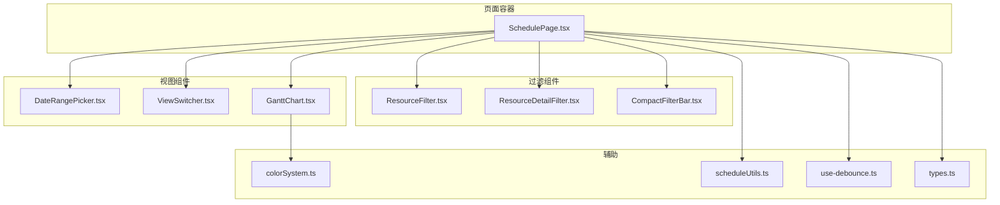
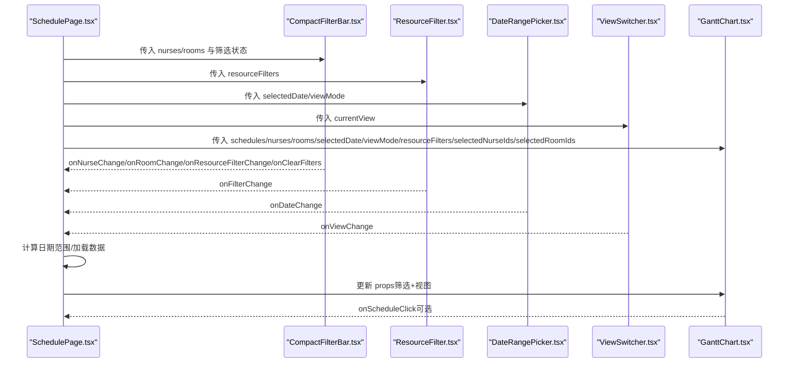
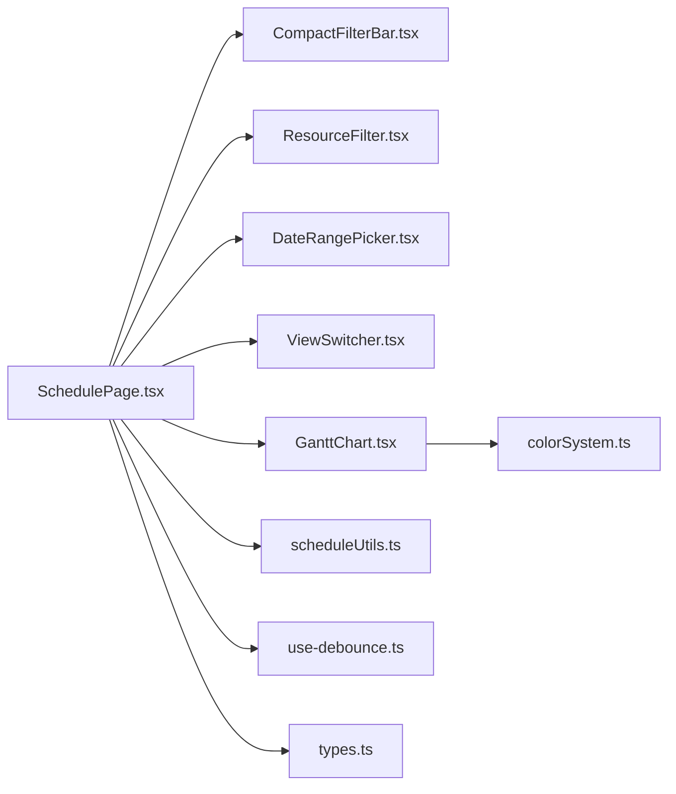
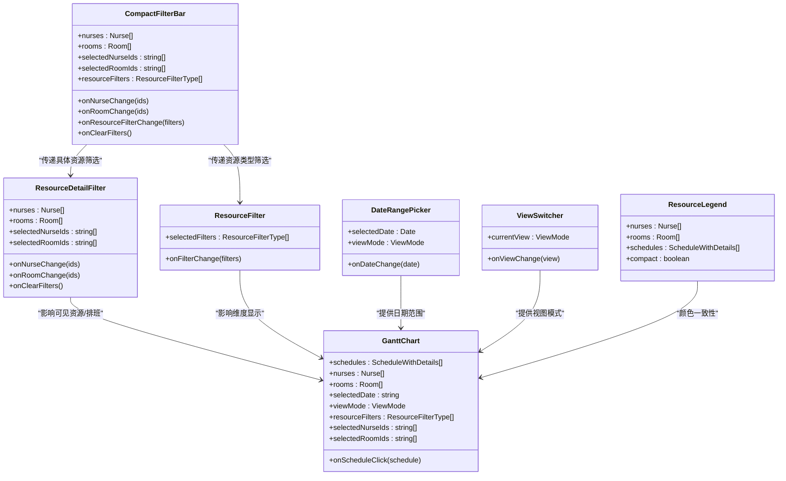
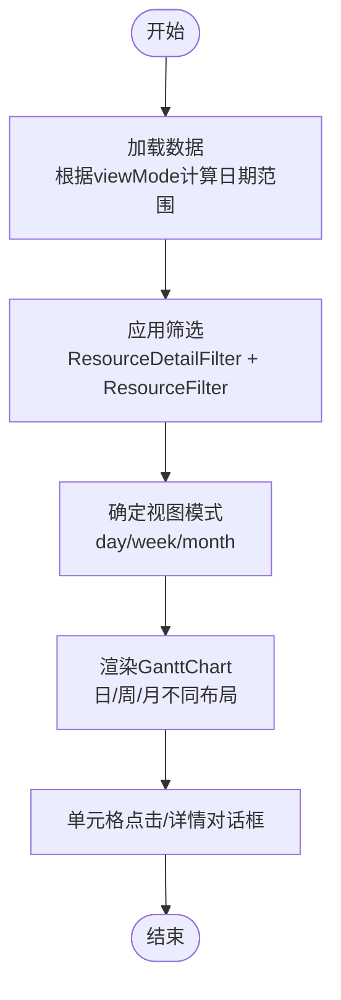

# 过滤与视图组件

<cite>
**本文引用的文件**
- [ResourceFilter.tsx](file://src/components/appointment/ResourceFilter.tsx)
- [ResourceDetailFilter.tsx](file://src/components/appointment/ResourceDetailFilter.tsx)
- [DateRangePicker.tsx](file://src/components/appointment/DateRangePicker.tsx)
- [GanttChart.tsx](file://src/components/appointment/GanttChart.tsx)
- [ViewSwitcher.tsx](file://src/components/appointment/ViewSwitcher.tsx)
- [CompactFilterBar.tsx](file://src/components/appointment/CompactFilterBar.tsx)
- [ResourceLegend.tsx](file://src/components/appointment/ResourceLegend.tsx)
- [SchedulePage.tsx](file://src/pages/head-nurse/SchedulePage.tsx)
- [use-debounce.ts](file://src/hooks/use-debounce.ts)
- [colorSystem.ts](file://src/utils/colorSystem.ts)
- [scheduleUtils.ts](file://src/utils/scheduleUtils.ts)
- [types.ts](file://src/types/types.ts)
</cite>

## 目录
1. [简介](#简介)
2. [项目结构](#项目结构)
3. [核心组件](#核心组件)
4. [架构总览](#架构总览)
5. [详细组件分析](#详细组件分析)
6. [依赖关系分析](#依赖关系分析)
7. [性能考量](#性能考量)
8. [故障排查指南](#故障排查指南)
9. [结论](#结论)
10. [附录](#附录)

## 简介
本文件面向“Bio-Appointment”中的“过滤与视图控制”组件体系，系统性解析以下能力：
- 多级筛选：ResourceFilter（资源类型维度）与ResourceDetailFilter（具体资源维度）的组合与交互
- 全局筛选上下文同步：如何在页面级状态中统一驱动视图与图表
- 时间范围选择：DateRangePicker如何支持灵活的时间范围切换并与视图联动
- 视图切换：ViewSwitcher在日/周/月视图下的布局适配、状态持久化与体验优化
- 简洁操作：CompactFilterBar如何整合多筛选器，降低操作成本
- 视觉辅助：ResourceLegend如何帮助用户理解颜色编码与资源状态
- 最佳实践：响应式设计、状态共享、性能优化（防抖请求）、常见集成问题的解决方案

## 项目结构
围绕“过滤与视图控制”，关键文件分布如下：
- 页面容器：SchedulePage.tsx（承载全局状态与组件编排）
- 过滤组件：ResourceFilter、ResourceDetailFilter、CompactFilterBar
- 视图组件：DateRangePicker、ViewSwitcher、GanttChart
- 辅助工具：colorSystem.ts（颜色编码）、scheduleUtils.ts（冲突检测）、use-debounce.ts（防抖）

图表来源
- [SchedulePage.tsx](file://src/pages/head-nurse/SchedulePage.tsx#L37-L120)
- [ResourceFilter.tsx](file://src/components/appointment/ResourceFilter.tsx#L1-L94)
- [ResourceDetailFilter.tsx](file://src/components/appointment/ResourceDetailFilter.tsx#L1-L217)
- [CompactFilterBar.tsx](file://src/components/appointment/CompactFilterBar.tsx#L1-L260)
- [DateRangePicker.tsx](file://src/components/appointment/DateRangePicker.tsx#L1-L223)
- [ViewSwitcher.tsx](file://src/components/appointment/ViewSwitcher.tsx#L1-L39)
- [GanttChart.tsx](file://src/components/appointment/GanttChart.tsx#L1-L120)
- [colorSystem.ts](file://src/utils/colorSystem.ts#L1-L140)
- [scheduleUtils.ts](file://src/utils/scheduleUtils.ts#L1-L112)
- [use-debounce.ts](file://src/hooks/use-debounce.ts#L1-L16)
- [types.ts](file://src/types/types.ts#L1-L120)

章节来源
- [SchedulePage.tsx](file://src/pages/head-nurse/SchedulePage.tsx#L37-L120)

## 核心组件
- ResourceFilter：提供“护士/房间”资源类型的二选一或全选切换，用于快速切换视图维度
- ResourceDetailFilter：提供“具体护士/房间”的多选筛选，进入“严格筛选模式”
- CompactFilterBar：紧凑型筛选栏，整合护士/房间/资源类型三类筛选，适合顶部横栏
- DateRangePicker：支持日/周/月三种模式的时间范围选择与导航
- ViewSwitcher：在日/周/月之间切换视图模式
- GanttChart：根据筛选与视图模式渲染甘特看板，支持日/周/月不同布局
- ResourceLegend：展示颜色编码与资源图例，支持“仅显示有预约的资源”折叠

章节来源
- [ResourceFilter.tsx](file://src/components/appointment/ResourceFilter.tsx#L1-L94)
- [ResourceDetailFilter.tsx](file://src/components/appointment/ResourceDetailFilter.tsx#L1-L217)
- [CompactFilterBar.tsx](file://src/components/appointment/CompactFilterBar.tsx#L1-L260)
- [DateRangePicker.tsx](file://src/components/appointment/DateRangePicker.tsx#L1-L223)
- [ViewSwitcher.tsx](file://src/components/appointment/ViewSwitcher.tsx#L1-L39)
- [GanttChart.tsx](file://src/components/appointment/GanttChart.tsx#L1-L120)
- [ResourceLegend.tsx](file://src/components/appointment/ResourceLegend.tsx#L1-L189)

## 架构总览
下图展示了从页面容器到各子组件的数据流与交互关系，以及筛选与视图如何共同驱动图表渲染。

图表来源
- [SchedulePage.tsx](file://src/pages/head-nurse/SchedulePage.tsx#L37-L120)
- [CompactFilterBar.tsx](file://src/components/appointment/CompactFilterBar.tsx#L1-L260)
- [ResourceFilter.tsx](file://src/components/appointment/ResourceFilter.tsx#L1-L94)
- [DateRangePicker.tsx](file://src/components/appointment/DateRangePicker.tsx#L1-L223)
- [ViewSwitcher.tsx](file://src/components/appointment/ViewSwitcher.tsx#L1-L39)
- [GanttChart.tsx](file://src/components/appointment/GanttChart.tsx#L1-L120)

## 详细组件分析

### ResourceFilter（资源类型筛选）
- 功能要点
  - 提供“护士（含护士长）”与“房间资源”二选一或全选的切换
  - 当仅选其一时，提示“已筛选”，用于引导用户进一步细化
  - 与GanttChart的shouldShowResource配合，决定房间/护士维度是否显示
- 状态管理
  - 通过父组件传入的selectedFilters与onFilterChange进行双向绑定
  - 与ResourceDetailFilter的“严格筛选模式”互补：前者控制维度，后者控制具体资源
- 与全局上下文同步
  - 在SchedulePage中以resourceFilters形式传递给GanttChart

章节来源
- [ResourceFilter.tsx](file://src/components/appointment/ResourceFilter.tsx#L1-L94)
- [GanttChart.tsx](file://src/components/appointment/GanttChart.tsx#L78-L98)
- [SchedulePage.tsx](file://src/pages/head-nurse/SchedulePage.tsx#L37-L120)

### ResourceDetailFilter（具体资源筛选）
- 功能要点
  - 支持“护士多选”“房间多选”，进入“严格筛选模式”
  - 提供“已选人数/房间数”徽章与“当前筛选：…”说明
  - 支持“清除筛选”按钮，一键清空
- 策略规则
  - 无筛选：显示所有资源与排班
  - 仅选护士：仅显示这些护士的所有排班
  - 仅选房间：仅显示这些房间的所有排班
  - 同时选护士与房间：仅显示同时满足两个条件的排班（交集）
- 与GanttChart联动
  - 通过selectedNurseIds/selectedRoomIds影响visibleRooms/visibleNurses/visibleSchedules
  - 与ResourceFilter的shouldShowResource叠加，先做“严格筛选”，再做“维度切换”

章节来源
- [ResourceDetailFilter.tsx](file://src/components/appointment/ResourceDetailFilter.tsx#L1-L217)
- [GanttChart.tsx](file://src/components/appointment/GanttChart.tsx#L46-L98)
- [SchedulePage.tsx](file://src/pages/head-nurse/SchedulePage.tsx#L333-L346)

### CompactFilterBar（紧凑筛选栏）
- 功能要点
  - 横向布局，顶部放置于资源看板之上
  - 内置“护士/房间/资源类型”三类筛选入口，支持“清除筛选”
  - “视图”下拉用于切换ResourceFilter的维度（全部/按房间/按护士）
- 与全局上下文同步
  - 通过onNurseChange/onRoomChange/onResourceFilterChange/onClearFilters回调，统一更新SchedulePage的状态

章节来源
- [CompactFilterBar.tsx](file://src/components/appointment/CompactFilterBar.tsx#L1-L260)
- [SchedulePage.tsx](file://src/pages/head-nurse/SchedulePage.tsx#L333-L346)

### DateRangePicker（时间范围选择）
- 功能要点
  - 根据viewMode动态呈现“日/周/月”三种选择器
  - 支持“上一个/下一个/回到今天”导航
  - 顶部显示当前日期范围文本，便于用户确认
- 与视图联动
  - 与ViewSwitcher配合，改变viewMode时，DateRangePicker会自动切换对应的选择器
  - 通过onDateChange将新的日期传递回父组件，父组件据此计算startDate/endDate并重新加载数据

章节来源
- [DateRangePicker.tsx](file://src/components/appointment/DateRangePicker.tsx#L1-L223)
- [SchedulePage.tsx](file://src/pages/head-nurse/SchedulePage.tsx#L63-L120)

### ViewSwitcher（视图切换）
- 功能要点
  - 在“日/周/月”之间切换视图模式
  - 通过currentView与onViewChange与父组件同步
- 布局适配与体验
  - 日视图：按小时/半小时网格渲染，支持重叠排班分行
  - 周视图：按房间/护士分别展示，支持点击单元格查看当天排班
  - 月视图：按周网格展示，强调“汇总”特性（不区分资源类型）

章节来源
- [ViewSwitcher.tsx](file://src/components/appointment/ViewSwitcher.tsx#L1-L39)
- [GanttChart.tsx](file://src/components/appointment/GanttChart.tsx#L326-L733)

### GanttChart（甘特看板）
- 多级筛选与可见性计算
  - 严格筛选：基于selectedNurseIds/selectedRoomIds过滤可见资源与排班
  - 维度切换：基于resourceFilters决定是否显示房间/护士维度
- 视图差异
  - 日视图：房间维度，按时间槽绘制排班卡片，支持重叠排班分行
  - 周视图：房间/护士两块看板，单元格内展示排班数量与部分客户名
  - 月视图：按周网格展示，不区分资源类型，仅显示汇总
- 颜色系统
  - 使用colorSystem.ts为护士/房间生成颜色，排班卡片采用“护士-房间”组合渐变
  - 急单与锁定状态以边框标识，提升可读性
- 交互
  - 单元格点击打开详情对话框，展示该资源/日期的排班集合

章节来源
- [GanttChart.tsx](file://src/components/appointment/GanttChart.tsx#L1-L120)
- [GanttChart.tsx](file://src/components/appointment/GanttChart.tsx#L120-L260)
- [GanttChart.tsx](file://src/components/appointment/GanttChart.tsx#L260-L573)
- [GanttChart.tsx](file://src/components/appointment/GanttChart.tsx#L573-L917)
- [colorSystem.ts](file://src/utils/colorSystem.ts#L1-L140)

### ResourceLegend（资源图例）
- 功能要点
  - 展示护士与房间的颜色编码，支持“仅显示有预约的资源”折叠
  - 提供“全部/收起”按钮，便于在大量资源场景下聚焦
- 与GanttChart协作
  - 通过颜色编码与卡片一致，帮助用户快速识别资源身份与状态

章节来源
- [ResourceLegend.tsx](file://src/components/appointment/ResourceLegend.tsx#L1-L189)

## 依赖关系分析
- 组件耦合
  - SchedulePage是全局状态中心，向下传递nurses/rooms/schedules等数据与筛选/视图状态
  - GanttChart对筛选与视图参数高度敏感，是数据-视图的唯一出口
  - ResourceDetailFilter与ResourceFilter在“严格筛选模式”与“维度切换”上互补
- 外部依赖
  - date-fns用于日期计算与格式化
  - colorSystem.ts提供颜色与图案，增强可读性与无障碍
  - scheduleUtils.ts提供冲突检测，保障排班质量

图表来源
- [SchedulePage.tsx](file://src/pages/head-nurse/SchedulePage.tsx#L37-L120)
- [GanttChart.tsx](file://src/components/appointment/GanttChart.tsx#L1-L120)
- [colorSystem.ts](file://src/utils/colorSystem.ts#L1-L140)
- [scheduleUtils.ts](file://src/utils/scheduleUtils.ts#L1-L112)
- [use-debounce.ts](file://src/hooks/use-debounce.ts#L1-L16)
- [types.ts](file://src/types/types.ts#L1-L120)

## 性能考量
- 防抖请求
  - 使用use-debounce在高频筛选时延缓请求，减少网络压力与重复渲染
  - 建议在SchedulePage中对筛选变更与日期切换使用防抖，避免频繁调用API
- 可视化渲染优化
  - GanttChart在日视图对重叠排班进行分行，避免过度拥挤
  - 月视图强调“汇总”，避免在小尺寸下渲染过多卡片
- 计算复杂度
  - 严格筛选采用线性过滤（visibleRooms/visibleNurses/visibleSchedules），在资源规模可控时性能稳定
  - 若资源规模扩大，建议在服务端侧增加索引与分页

章节来源
- [use-debounce.ts](file://src/hooks/use-debounce.ts#L1-L16)
- [GanttChart.tsx](file://src/components/appointment/GanttChart.tsx#L260-L573)

## 故障排查指南
- 筛选无效或显示异常
  - 检查ResourceDetailFilter的selectedNurseIds/selectedRoomIds是否为空数组
  - 确认GanttChart的visibleRooms/visibleNurses/visibleSchedules计算逻辑是否被覆盖
- 视图切换后日期未更新
  - 确认ViewSwitcher的onViewChange是否正确触发DateRangePicker的onDateChange
  - 父组件是否根据viewMode重新计算startDate/endDate并加载数据
- 颜色不清晰或对比度不足
  - 使用colorSystem.ts提供的hasGoodContrast进行校验，必要时调整配色方案
- 冲突检测误报
  - 检查scheduleUtils.ts的isTimeOverlap与detectResourceConflicts逻辑，确保排除正在编辑的排班

章节来源
- [ResourceDetailFilter.tsx](file://src/components/appointment/ResourceDetailFilter.tsx#L1-L217)
- [GanttChart.tsx](file://src/components/appointment/GanttChart.tsx#L46-L98)
- [DateRangePicker.tsx](file://src/components/appointment/DateRangePicker.tsx#L1-L223)
- [ViewSwitcher.tsx](file://src/components/appointment/ViewSwitcher.tsx#L1-L39)
- [scheduleUtils.ts](file://src/utils/scheduleUtils.ts#L1-L112)
- [colorSystem.ts](file://src/utils/colorSystem.ts#L120-L140)

## 结论
本组件体系通过“资源类型筛选 + 具体资源筛选 + 视图切换 + 时间范围选择”的组合，实现了灵活、直观且高性能的排班可视化。ResourceDetailFilter的“严格筛选模式”与ResourceFilter的“维度切换”相辅相成，DateRangePicker与ViewSwitcher保证了时间与空间维度的一致性，GanttChart在不同视图下提供一致的交互体验。ResourceLegend与颜色系统提升了可读性与无障碍体验。结合use-debounce与服务端优化，可在大规模数据下保持流畅。

## 附录

### 组件类图（代码级）

图表来源
- [ResourceFilter.tsx](file://src/components/appointment/ResourceFilter.tsx#L1-L94)
- [ResourceDetailFilter.tsx](file://src/components/appointment/ResourceDetailFilter.tsx#L1-L217)
- [CompactFilterBar.tsx](file://src/components/appointment/CompactFilterBar.tsx#L1-L260)
- [DateRangePicker.tsx](file://src/components/appointment/DateRangePicker.tsx#L1-L223)
- [ViewSwitcher.tsx](file://src/components/appointment/ViewSwitcher.tsx#L1-L39)
- [GanttChart.tsx](file://src/components/appointment/GanttChart.tsx#L1-L120)
- [ResourceLegend.tsx](file://src/components/appointment/ResourceLegend.tsx#L1-L189)

### 关键流程图（筛选与视图联动）

图表来源
- [SchedulePage.tsx](file://src/pages/head-nurse/SchedulePage.tsx#L63-L120)
- [GanttChart.tsx](file://src/components/appointment/GanttChart.tsx#L326-L733)

### 最佳实践清单
- 响应式设计
  - 在移动端优先的布局中，优先使用CompactFilterBar，避免遮挡主看板
  - 月视图下适当缩小字体与间距，确保滚动体验
- 状态共享
  - 将筛选与视图状态集中于SchedulePage，避免跨组件重复状态
  - 使用use-debounce对筛选变更进行节流
- 性能优化
  - 对大列表使用虚拟滚动（如ScrollArea）与懒加载
  - 在服务端侧增加索引与分页，减少前端过滤压力
- 集成问题
  - 确保selectedNurseIds/selectedRoomIds与nurses/rooms的ID集合一致
  - 在切换视图时，DateRangePicker与ViewSwitcher需同步更新，避免日期与模式不一致
  - 颜色系统需与UI主题一致，必要时提供暗色/高对比度模式