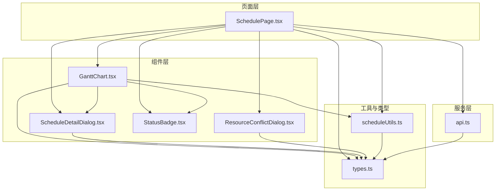
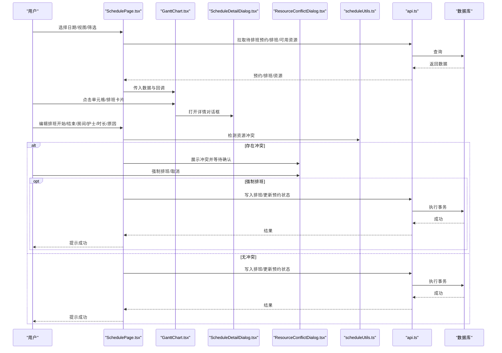
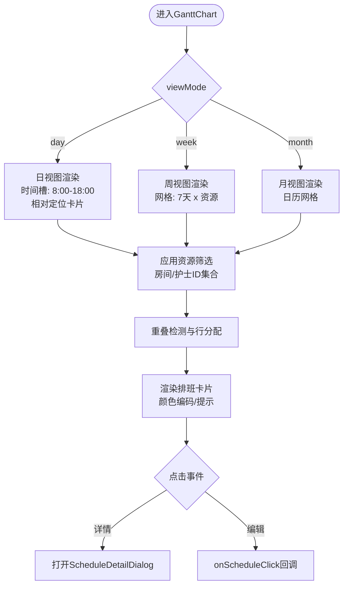
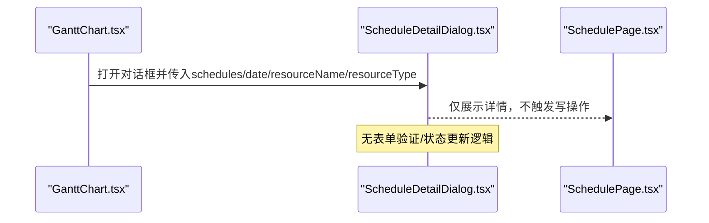
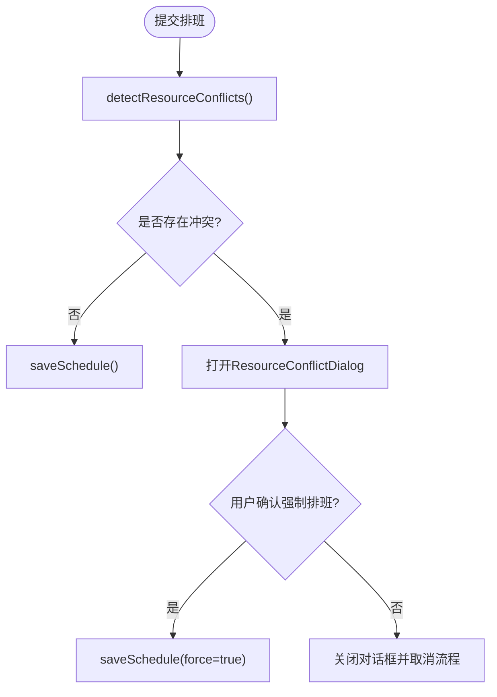
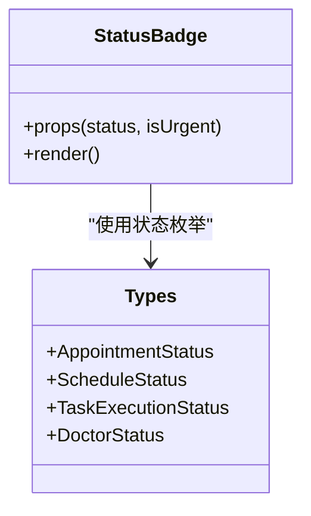
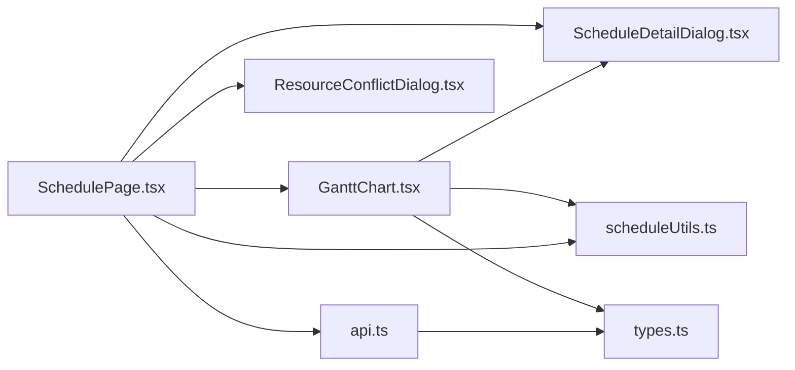

# 预约管理组件

<cite>
**本文引用的文件**
- [GanttChart.tsx](file://src/components/appointment/GanttChart.tsx)
- [ScheduleDetailDialog.tsx](file://src/components/appointment/ScheduleDetailDialog.tsx)
- [ResourceConflictDialog.tsx](file://src/components/appointment/ResourceConflictDialog.tsx)
- [StatusBadge.tsx](file://src/components/appointment/StatusBadge.tsx)
- [scheduleUtils.ts](file://src/utils/scheduleUtils.ts)
- [types.ts](file://src/types/types.ts)
- [api.ts](file://src/services/api.ts)
- [SchedulePage.tsx](file://src/pages/head-nurse/SchedulePage.tsx)
</cite>

## 目录
1. [简介](#简介)
2. [项目结构](#项目结构)
3. [核心组件](#核心组件)
4. [架构总览](#架构总览)
5. [组件详解](#组件详解)
6. [依赖关系分析](#依赖关系分析)
7. [性能考量](#性能考量)
8. [可访问性设计](#可访问性设计)
9. [故障排查指南](#故障排查指南)
10. [结论](#结论)

## 简介
本文件聚焦Bio-Appointment系统中的预约管理核心组件，围绕以下目标展开：
- GanttChart组件如何基于React实现可视化资源调度，涵盖时间轴渲染、拖拽排班交互、资源占用计算与冲突检测机制，并阐明其与后端API的数据同步策略。
- ScheduleDetailDialog在编辑排班时的表单验证流程、状态更新机制与错误处理方式。
- ResourceConflictDialog如何检测并提示资源冲突，支持用户重新调度。
- StatusBadge组件如何根据预约/排班/任务状态动态渲染不同视觉样式。
- 提供性能优化建议（虚拟滚动、防抖更新）、可访问性设计以及常见使用问题的排查方法，并结合实际代码示例展示组件集成方式。

## 项目结构
预约管理相关组件位于src/components/appointment目录，配合页面层SchedulePage进行数据拉取、状态管理与交互编排；工具函数位于src/utils；类型定义位于src/types；后端API封装位于src/services。

图表来源
- [SchedulePage.tsx](file://src/pages/head-nurse/SchedulePage.tsx#L1-L695)
- [GanttChart.tsx](file://src/components/appointment/GanttChart.tsx#L1-L917)
- [ScheduleDetailDialog.tsx](file://src/components/appointment/ScheduleDetailDialog.tsx#L1-L175)
- [ResourceConflictDialog.tsx](file://src/components/appointment/ResourceConflictDialog.tsx#L1-L93)
- [StatusBadge.tsx](file://src/components/appointment/StatusBadge.tsx#L1-L51)
- [scheduleUtils.ts](file://src/utils/scheduleUtils.ts#L1-L112)
- [types.ts](file://src/types/types.ts#L1-L487)
- [api.ts](file://src/services/api.ts#L1-L483)

章节来源
- [SchedulePage.tsx](file://src/pages/head-nurse/SchedulePage.tsx#L1-L695)
- [GanttChart.tsx](file://src/components/appointment/GanttChart.tsx#L1-L917)
- [ScheduleDetailDialog.tsx](file://src/components/appointment/ScheduleDetailDialog.tsx#L1-L175)
- [ResourceConflictDialog.tsx](file://src/components/appointment/ResourceConflictDialog.tsx#L1-L93)
- [StatusBadge.tsx](file://src/components/appointment/StatusBadge.tsx#L1-L51)
- [scheduleUtils.ts](file://src/utils/scheduleUtils.ts#L1-L112)
- [types.ts](file://src/types/types.ts#L1-L487)
- [api.ts](file://src/services/api.ts#L1-L483)

## 核心组件
- GanttChart：提供日/周/月三种视图的资源排班可视化，支持按房间/护士维度查看，内置排班卡片渲染、颜色编码、重叠排班行分配与点击查看详情。
- ScheduleDetailDialog：以对话框形式展示某一天/资源下的排班明细，包含客户、服务、时间、时长、资源与调整原因等信息。
- ResourceConflictDialog：检测并提示资源冲突（房间/护士），允许用户强制排班或取消。
- StatusBadge：根据状态（预约/排班/任务/医生）动态渲染不同视觉样式，支持“急单”特殊标记。

章节来源
- [GanttChart.tsx](file://src/components/appointment/GanttChart.tsx#L1-L917)
- [ScheduleDetailDialog.tsx](file://src/components/appointment/ScheduleDetailDialog.tsx#L1-L175)
- [ResourceConflictDialog.tsx](file://src/components/appointment/ResourceConflictDialog.tsx#L1-L93)
- [StatusBadge.tsx](file://src/components/appointment/StatusBadge.tsx#L1-L51)

## 架构总览
下图展示了从页面到组件再到服务层的数据流与交互路径，体现“前端组件 -> 工具函数/类型 -> 服务层API -> 数据库”的闭环。

图表来源
- [SchedulePage.tsx](file://src/pages/head-nurse/SchedulePage.tsx#L1-L695)
- [GanttChart.tsx](file://src/components/appointment/GanttChart.tsx#L1-L917)
- [ScheduleDetailDialog.tsx](file://src/components/appointment/ScheduleDetailDialog.tsx#L1-L175)
- [ResourceConflictDialog.tsx](file://src/components/appointment/ResourceConflictDialog.tsx#L1-L93)
- [scheduleUtils.ts](file://src/utils/scheduleUtils.ts#L1-L112)
- [api.ts](file://src/services/api.ts#L1-L483)

## 组件详解

### GanttChart：可视化资源调度
- 视图模式与时间轴渲染
  - 支持日/周/月三种视图，依据selectedDate与viewMode动态生成时间轴。
  - 日视图采用固定8点至18点的时间槽，使用相对定位与百分比宽度计算排班卡片位置。
  - 周/月视图以网格呈现，单元格内显示排班数量与部分客户名称，支持点击进入详情。
- 资源筛选与可见性
  - 支持按房间/护士ID集合进行严格筛选；当同时选择护士与房间时，仅显示同时满足条件的排班。
  - 支持资源类型切换（房间/护士）的过滤器，用于控制显示维度。
- 排班卡片与颜色编码
  - 使用护士与房间颜色组合生成渐变背景，急单与锁定状态分别以边框样式突出。
  - Tooltip展示客户名、服务名、护士/房间信息等关键摘要。
- 重叠排班与行分配
  - 通过时间重叠检测算法对同一资源的排班进行行级分配，避免视觉重叠。
- 点击交互与详情对话框
  - 日/周/月视图均支持点击进入详情对话框，传递所选日期、资源名称与类型。
- 数据来源与同步策略
  - 页面层SchedulePage根据当前视图计算日期范围，调用服务层API批量拉取预约、排班与可用资源，随后传入GanttChart渲染。
  - 由于GanttChart本身不直接发起网络请求，其数据同步遵循“页面拉取 -> 组件渲染”的单向数据流，保证一致性与可维护性。

图表来源
- [GanttChart.tsx](file://src/components/appointment/GanttChart.tsx#L1-L917)

章节来源
- [GanttChart.tsx](file://src/components/appointment/GanttChart.tsx#L1-L917)
- [SchedulePage.tsx](file://src/pages/head-nurse/SchedulePage.tsx#L1-L695)
- [api.ts](file://src/services/api.ts#L240-L325)

### ScheduleDetailDialog：排班详情对话框
- 表单验证与状态更新
  - 该组件本身不负责表单验证与状态更新，而是作为只读详情展示。
  - 表单验证与状态更新由SchedulePage中的表单与提交逻辑负责，见下文“编辑排班流程”。
- 错误处理
  - 若传入的排班数组为空，组件显示“该日期暂无排班”的提示，避免空渲染。
- 信息完整性
  - 展示客户名、服务名、时间区间、时长、房间/护士、急单标记与调整原因等关键字段。

图表来源
- [GanttChart.tsx](file://src/components/appointment/GanttChart.tsx#L563-L571)
- [ScheduleDetailDialog.tsx](file://src/components/appointment/ScheduleDetailDialog.tsx#L1-L175)

章节来源
- [ScheduleDetailDialog.tsx](file://src/components/appointment/ScheduleDetailDialog.tsx#L1-L175)
- [GanttChart.tsx](file://src/components/appointment/GanttChart.tsx#L563-L571)

### ResourceConflictDialog：资源冲突提示
- 冲突检测
  - 由工具函数detectResourceConflicts完成，比较新排班与现有排班的时间段重叠情况，分别统计房间与护士冲突。
- 对话框交互
  - 展示冲突资源类型、资源名称与冲突排班列表（客户名、服务名、时间区间）。
  - 提供“取消排班”与“强制排班”两种操作，前者关闭流程，后者允许用户强制写入。
- 与页面协作
  - SchedulePage在提交排班前调用冲突检测，若存在冲突则弹出对话框；用户确认后调用保存逻辑。

图表来源
- [SchedulePage.tsx](file://src/pages/head-nurse/SchedulePage.tsx#L167-L238)
- [scheduleUtils.ts](file://src/utils/scheduleUtils.ts#L1-L112)
- [ResourceConflictDialog.tsx](file://src/components/appointment/ResourceConflictDialog.tsx#L1-L93)

章节来源
- [scheduleUtils.ts](file://src/utils/scheduleUtils.ts#L1-L112)
- [SchedulePage.tsx](file://src/pages/head-nurse/SchedulePage.tsx#L167-L238)
- [ResourceConflictDialog.tsx](file://src/components/appointment/ResourceConflictDialog.tsx#L1-L93)

### StatusBadge：状态徽章
- 状态映射
  - 预约状态：待排班、已排班、已确认、进行中、已完成、已取消。
  - 排班状态：草稿、已发布、已锁定。
  - 任务执行状态：待到达、已到达、进行中、已完成。
  - 医生状态：待接受、已接受、已拒绝。
- 视觉样式
  - 通过variant与className实现不同主题色与前景色，支持“急单”特殊样式。
- 与组件集成
  - 在SchedulePage中用于展示待办列表与统计卡片中的状态标识。

图表来源
- [StatusBadge.tsx](file://src/components/appointment/StatusBadge.tsx#L1-L51)
- [types.ts](file://src/types/types.ts#L1-L487)

章节来源
- [StatusBadge.tsx](file://src/components/appointment/StatusBadge.tsx#L1-L51)
- [types.ts](file://src/types/types.ts#L1-L487)

## 依赖关系分析
- 组件间依赖
  - GanttChart依赖ScheduleDetailDialog进行详情展示；依赖scheduleUtils进行冲突检测；依赖types定义数据结构。
  - SchedulePage作为容器，聚合数据、表单验证、冲突检测与API调用，驱动GanttChart与对话框。
  - ResourceConflictDialog独立于业务逻辑，仅负责冲突提示与用户确认。
- 服务层依赖
  - api.ts提供统一的CRUD接口，SchedulePage通过client封装调用，实现与后端的解耦。
- 类型系统
  - types.ts集中定义预约、排班、资源、状态等类型，确保组件间契约一致。

图表来源
- [SchedulePage.tsx](file://src/pages/head-nurse/SchedulePage.tsx#L1-L695)
- [GanttChart.tsx](file://src/components/appointment/GanttChart.tsx#L1-L917)
- [ScheduleDetailDialog.tsx](file://src/components/appointment/ScheduleDetailDialog.tsx#L1-L175)
- [ResourceConflictDialog.tsx](file://src/components/appointment/ResourceConflictDialog.tsx#L1-L93)
- [scheduleUtils.ts](file://src/utils/scheduleUtils.ts#L1-L112)
- [types.ts](file://src/types/types.ts#L1-L487)
- [api.ts](file://src/services/api.ts#L1-L483)

章节来源
- [SchedulePage.tsx](file://src/pages/head-nurse/SchedulePage.tsx#L1-L695)
- [GanttChart.tsx](file://src/components/appointment/GanttChart.tsx#L1-L917)
- [ScheduleDetailDialog.tsx](file://src/components/appointment/ScheduleDetailDialog.tsx#L1-L175)
- [ResourceConflictDialog.tsx](file://src/components/appointment/ResourceConflictDialog.tsx#L1-L93)
- [scheduleUtils.ts](file://src/utils/scheduleUtils.ts#L1-L112)
- [types.ts](file://src/types/types.ts#L1-L487)
- [api.ts](file://src/services/api.ts#L1-L483)

## 性能考量
- 虚拟滚动
  - 日视图已使用滚动容器承载大量排班卡片，建议在排班数量较多时引入虚拟滚动（如react-window或@react-aria/virtualizer）以减少DOM节点数量，提升渲染性能。
- 防抖更新
  - 页面层在日期/视图/筛选变化时会触发多次数据拉取，可在SchedulePage中对loadData进行防抖（如延迟200-300ms），避免频繁请求与重复渲染。
- 计算复杂度
  - 重叠检测算法在最坏情况下为O(n^2)，建议在数据量较大时：
    - 先按资源分组，再在组内进行重叠检测；
    - 或使用区间树/扫描线算法优化重叠判定。
- 图像与颜色
  - 渐变色与阴影在大量元素同时渲染时可能造成GPU压力，建议在移动端适当降低阴影强度或禁用。
- 数据缓存
  - 对于同一天/同一筛选条件的排班数据，可在SchedulePage中加入内存缓存，减少重复请求。

[本节为通用性能建议，不直接分析具体文件，故无章节来源]

## 可访问性设计
- 键盘导航
  - 确保GanttChart中的可点击单元格与排班卡片具备tab索引与键盘激活能力（Enter/Space）。
- 屏幕阅读器
  - Tooltip内容应通过aria-describedby或title属性辅助说明，避免仅依赖视觉提示。
- 对比度
  - 确保状态徽章与背景对比度满足WCAG AA标准，必要时调整颜色或添加边框。
- 描述性文本
  - 在ScheduleDetailDialog中为每个字段提供清晰的标签与描述，便于读屏器朗读。
- 动画与过渡
  - 减少不必要的动画与过渡，为偏好低动画的用户提供关闭选项。

[本节为通用可访问性建议，不直接分析具体文件，故无章节来源]

## 故障排查指南
- 无法切换视图
  - 现象：点击周/月视图按钮后仍显示日视图。
  - 原因：GanttChart未根据viewMode分支渲染对应视图。
  - 处理：确认GanttChart内部已实现week/month分支渲染逻辑，并在SchedulePage正确传递viewMode。
  - 参考：WEEK_MONTH_VIEW_IMPLEMENTATION.md中关于周/月视图实现的说明。
- 冲突检测无效
  - 现象：提交排班时未提示冲突。
  - 原因：未调用detectResourceConflicts或未传入排除ID。
  - 处理：在SchedulePage的onSubmit中调用冲突检测，并传入当前编辑排班的ID以排除自身。
- 详情对话框不显示
  - 现象：点击单元格后未出现详情。
  - 原因：传入的schedules为空或日期参数不匹配。
  - 处理：在GanttChart中确保筛选后的visibleSchedules非空且日期匹配，再打开对话框。
- 状态徽章样式异常
  - 现象：状态颜色不符合预期。
  - 原因：状态值不在映射表中或isUrgent优先级未生效。
  - 处理：检查StatusBadge的映射表与isUrgent分支，确保状态值与枚举一致。
- API调用失败
  - 现象：创建/更新排班失败。
  - 原因：网络错误、权限不足或参数校验失败。
  - 处理：在SchedulePage中捕获错误并toast提示，必要时回滚本地状态。

章节来源
- [WEEK_MONTH_VIEW_IMPLEMENTATION.md](file://WEEK_MONTH_VIEW_IMPLEMENTATION.md#L1-L52)
- [SchedulePage.tsx](file://src/pages/head-nurse/SchedulePage.tsx#L167-L238)
- [GanttChart.tsx](file://src/components/appointment/GanttChart.tsx#L563-L571)
- [StatusBadge.tsx](file://src/components/appointment/StatusBadge.tsx#L1-L51)
- [scheduleUtils.ts](file://src/utils/scheduleUtils.ts#L1-L112)

## 结论
本文件系统梳理了Bio-Appointment预约管理核心组件的职责边界、数据流与交互链路。GanttChart承担资源调度的可视化职责，ScheduleDetailDialog提供详情展示，ResourceConflictDialog负责冲突提示与用户决策，StatusBadge统一状态视觉表达。页面层SchedulePage整合数据、表单与冲突检测，形成完整的编辑闭环。通过合理的性能优化与可访问性设计，可进一步提升用户体验与系统稳定性。