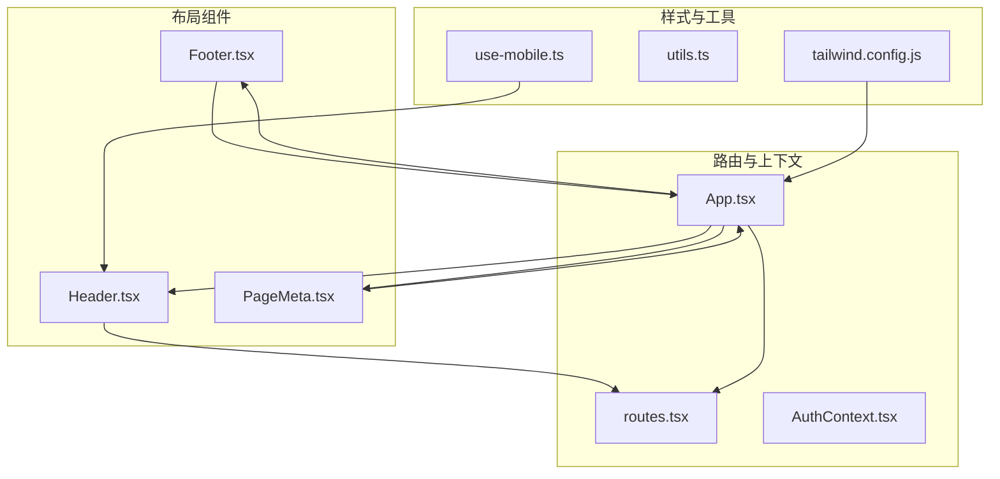
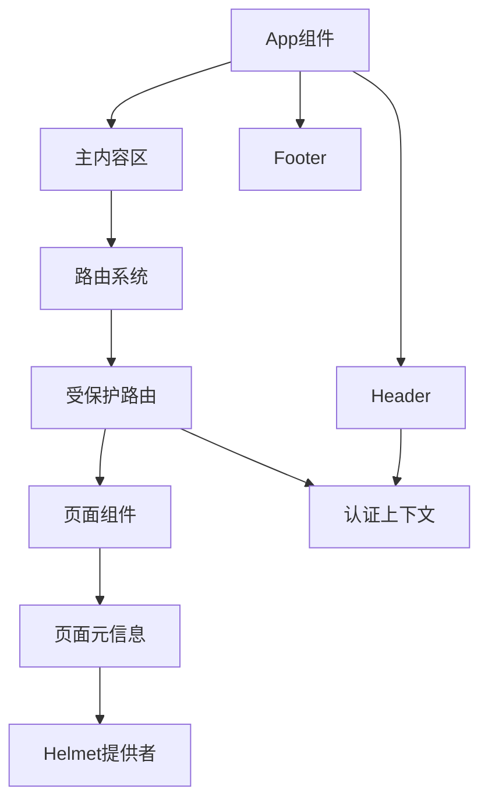
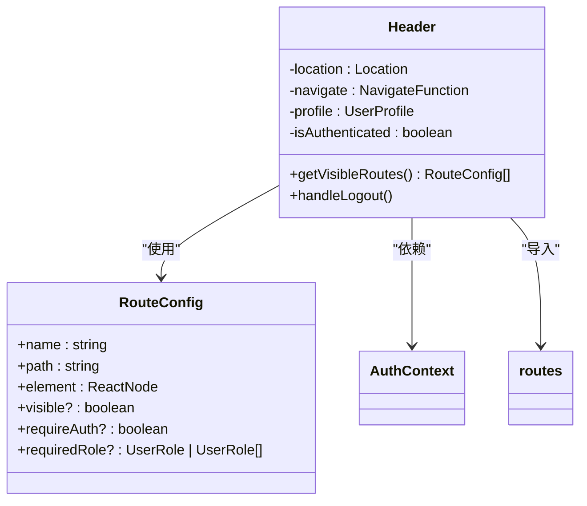
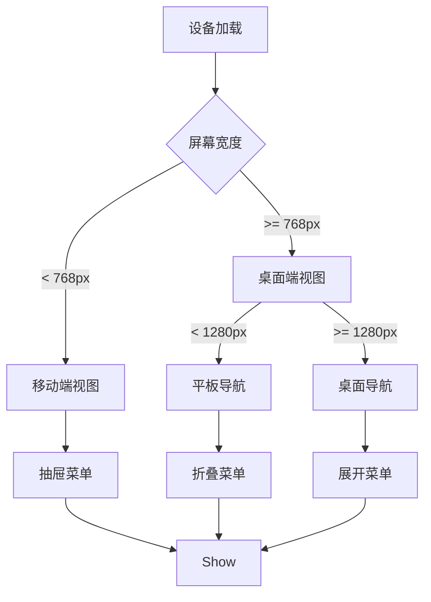
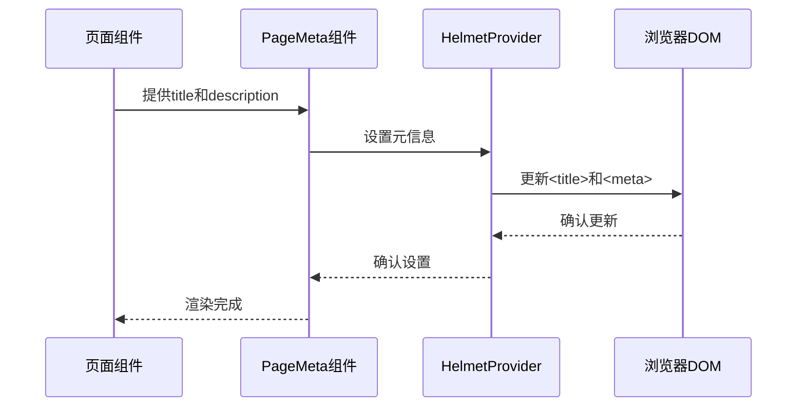
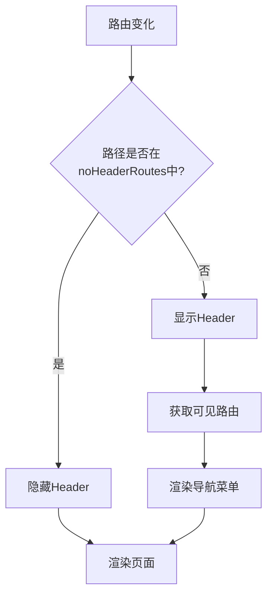
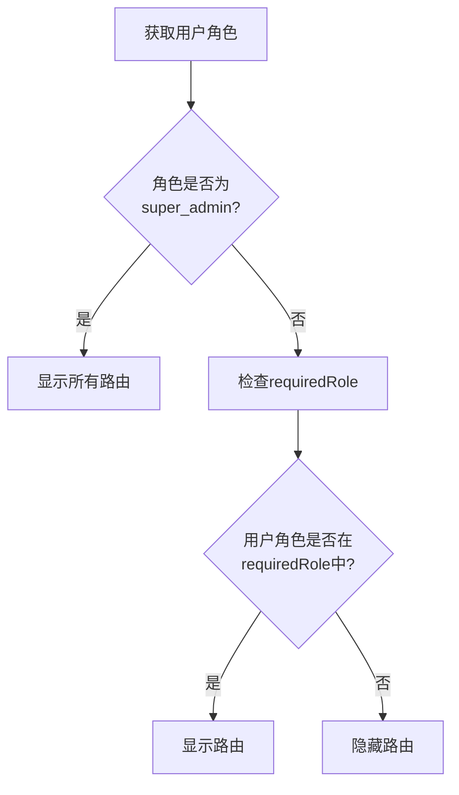
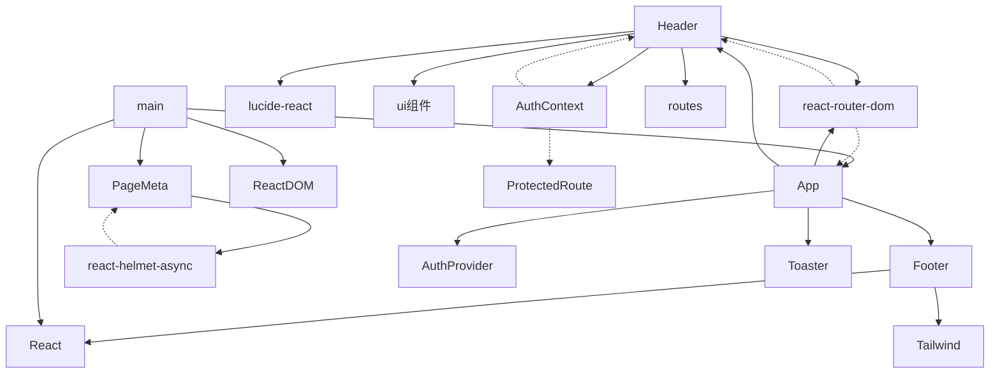

# 布局组件

<cite>
**本文档引用文件**  
- [Header.tsx](file://src/components/common/Header.tsx)
- [Footer.tsx](file://src/components/common/Footer.tsx)
- [PageMeta.tsx](file://src/components/common/PageMeta.tsx)
- [routes.tsx](file://src/routes.tsx)
- [App.tsx](file://src/App.tsx)
- [tailwind.config.js](file://tailwind.config.js)
- [use-mobile.ts](file://src/hooks/use-mobile.ts)
</cite>

## 目录
1. [简介](#简介)
2. [项目结构](#项目结构)
3. [核心组件](#核心组件)
4. [架构概览](#架构概览)
5. [详细组件分析](#详细组件分析)
6. [依赖分析](#依赖分析)
7. [性能考虑](#性能考虑)
8. [故障排除指南](#故障排除指南)
9. [结论](#结论)

## 简介
Bio-Appointment系统采用现代化的React组件化架构，实现了灵活的布局管理系统。本系统通过Header、Footer和PageMeta等核心布局组件，结合路由系统和响应式设计，为用户提供一致且高效的用户体验。系统支持角色基础的导航控制、动态页面元信息管理和多端适配，确保在不同设备和用户角色下都能提供最佳的交互体验。

## 项目结构
Bio-Appointment项目的布局组件主要位于`src/components/common/`目录下，包括Header、Footer和PageMeta三个核心组件。这些组件与路由系统（routes.tsx）紧密集成，通过App.tsx进行整体布局编排。系统采用Tailwind CSS进行样式管理，支持响应式设计和主题定制。



**图示来源**  
- [Header.tsx](file://src/components/common/Header.tsx)
- [Footer.tsx](file://src/components/common/Footer.tsx)
- [PageMeta.tsx](file://src/components/common/PageMeta.tsx)
- [routes.tsx](file://src/routes.tsx)
- [App.tsx](file://src/App.tsx)
- [tailwind.config.js](file://tailwind.config.js)
- [use-mobile.ts](file://src/hooks/use-mobile.ts)

**本节来源**  
- [src/components/common/](file://src/components/common/)
- [src/routes.tsx](file://src/routes.tsx)
- [src/App.tsx](file://src/App.tsx)

## 核心组件
Bio-Appointment系统的布局组件设计围绕用户体验和系统可维护性展开。Header组件提供全局导航和用户状态展示，Footer组件包含系统信息和版权说明，PageMeta组件负责页面SEO元信息的动态管理。这些组件通过模块化设计，实现了高内聚低耦合的架构特性，便于系统的扩展和维护。

**本节来源**  
- [Header.tsx](file://src/components/common/Header.tsx#L1-L196)
- [Footer.tsx](file://src/components/common/Footer.tsx#L1-L72)
- [PageMeta.tsx](file://src/components/common/PageMeta.tsx#L1-L21)

## 架构概览
Bio-Appointment系统的布局架构采用分层设计模式，从外到内分别为：应用容器层、布局组件层、路由控制层和页面内容层。App组件作为最外层容器，负责整体布局的编排；Header和Footer组件提供全局一致的界面元素；路由系统根据用户角色和权限动态生成导航菜单；PageMeta组件确保每个页面都有正确的SEO元信息。



**图示来源**  
- [App.tsx](file://src/App.tsx#L1-L62)
- [Header.tsx](file://src/components/common/Header.tsx#L1-L196)
- [routes.tsx](file://src/routes.tsx#L1-L135)
- [PageMeta.tsx](file://src/components/common/PageMeta.tsx#L1-L21)

## 详细组件分析

### Header组件分析
Header组件是Bio-Appointment系统的全局导航中心，负责品牌标识展示、导航菜单提供和用户状态管理。组件根据用户角色动态过滤可见的路由，确保用户只能访问其权限范围内的功能模块。

#### 导航结构与品牌标识
Header组件采用响应式设计，在桌面端（≥1280px）显示水平导航菜单，在移动端（<768px）通过抽屉式菜单提供导航功能。品牌标识位于左侧，包含Bio-Appointment的logo和系统名称，点击可返回首页。



**图示来源**  
- [Header.tsx](file://src/components/common/Header.tsx#L38-L195)
- [routes.tsx](file://src/routes.tsx#L30-L135)

#### 响应式断点设置
系统采用多级响应式断点策略，确保在不同设备上都有良好的用户体验。通过`use-mobile.ts`中的`MOBILE_BREAKPOINT`常量（768px）定义移动设备断点，利用Tailwind CSS的`xl:flex`类（1280px）控制桌面端导航的显示。



**图示来源**  
- [Header.tsx](file://src/components/common/Header.tsx#L88-L102)
- [use-mobile.ts](file://src/hooks/use-mobile.ts#L3-L19)
- [tailwind.config.js](file://tailwind.config.js#L1-L184)

**本节来源**  
- [Header.tsx](file://src/components/common/Header.tsx#L1-L196)
- [use-mobile.ts](file://src/hooks/use-mobile.ts#L1-L19)
- [tailwind.config.js](file://tailwind.config.js#L1-L184)

### Footer组件分析
Footer组件提供系统的辅助信息展示，包括关于系统、联系方式和营业时间等信息。虽然当前实现中包含占位文本，但其结构设计为多栏布局，支持在不同屏幕尺寸下的自适应显示。

```mermaid
classDiagram
class Footer {
+currentYear : number
+render()
}
Footer --> Grid[网格布局]
Grid --> About[关于系统]
Grid --> Contact[联系方式]
Grid --> Hours[营业时间]
Grid --> Copyright[版权信息]
```

**图示来源**  
- [Footer.tsx](file://src/components/common/Footer.tsx#L1-L72)

**本节来源**  
- [Footer.tsx](file://src/components/common/Footer.tsx#L1-L72)

### PageMeta组件分析
PageMeta组件负责动态管理页面的SEO元信息，包括页面标题和描述。组件基于react-helmet-async库实现，确保在客户端和服务端渲染时都能正确设置页面元数据。

#### 动态元信息管理
PageMeta组件通过props接收标题和描述信息，在页面渲染时动态更新HTML文档的`<title>`和`<meta name="description">`标签。AppWrapper提供者组件确保整个应用的元信息管理一致性。



**图示来源**  
- [PageMeta.tsx](file://src/components/common/PageMeta.tsx#L1-L21)
- [main.tsx](file://src/main.tsx#L1-L14)

**本节来源**  
- [PageMeta.tsx](file://src/components/common/PageMeta.tsx#L1-L21)
- [main.tsx](file://src/main.tsx#L1-L14)

### 路由系统集成
布局组件与路由系统深度集成，实现不同页面的布局切换和权限控制。App组件根据当前路由决定是否显示Header，而Header组件则根据用户角色和路由配置动态生成导航菜单。

#### 布局切换机制
系统通过`noHeaderRoutes`数组定义不需要显示Header的路由（如登录、注册页面），在AppContent组件中根据当前路径决定是否渲染Header组件。这种设计确保了认证页面的简洁性，同时保持应用内页面的一致性布局。



**图示来源**  
- [App.tsx](file://src/App.tsx#L8-L51)
- [routes.tsx](file://src/routes.tsx#L40-L61)

#### 权限控制集成
Header组件的`getVisibleRoutes`方法与路由系统的`requiredRole`配置协同工作，实现基于角色的导航过滤。超级管理员拥有所有权限，其他角色只能访问其被授权的页面。



**图示来源**  
- [Header.tsx](file://src/components/common/Header.tsx#L44-L63)
- [routes.tsx](file://src/routes.tsx#L77-L118)

**本节来源**  
- [App.tsx](file://src/App.tsx#L1-L62)
- [Header.tsx](file://src/components/common/Header.tsx#L1-L196)
- [routes.tsx](file://src/routes.tsx#L1-L135)

### 自定义布局扩展指南
系统设计考虑了未来的扩展性，提供了清晰的自定义布局接口。开发者可以轻松添加新的导航项、修改配色方案或支持多语言布局。

#### 添加新导航项
要添加新的导航项，需要在`routes.tsx`中定义新的路由配置，包括名称、路径、组件、可见性和角色权限等属性。系统会自动在Header组件中显示符合条件的导航项。

#### 修改配色方案
配色方案主要通过Tailwind CSS配置和`colorSystem.ts`工具函数管理。开发者可以修改`tailwind.config.js`中的颜色变量或扩展`NURSE_COLORS`、`ROOM_COLORS`等颜色数组来定制视觉风格。

#### 多语言布局支持
虽然当前系统主要使用中文，但其组件设计支持国际化扩展。通过引入i18n库并重构文本内容为翻译键，可以实现多语言支持。路由名称、页面标题和描述等文本内容都应通过翻译函数获取。

**本节来源**  
- [routes.tsx](file://src/routes.tsx#L39-L135)
- [tailwind.config.js](file://tailwind.config.js#L25-L98)
- [colorSystem.ts](file://src/utils/colorSystem.ts)

## 依赖分析
布局组件系统依赖于多个核心库和自定义模块，形成了稳定的依赖关系网络。主要依赖包括React Router进行路由管理、Tailwind CSS进行样式控制、react-helmet-async进行SEO管理，以及自定义的认证上下文进行权限控制。



**图示来源**  
- [Header.tsx](file://src/components/common/Header.tsx#L1-L196)
- [Footer.tsx](file://src/components/common/Footer.tsx#L1-L72)
- [PageMeta.tsx](file://src/components/common/PageMeta.tsx#L1-L21)
- [App.tsx](file://src/App.tsx#L1-L62)
- [main.tsx](file://src/main.tsx#L1-L14)

**本节来源**  
- [package.json](file://package.json)
- 各组件文件的导入语句

## 性能考虑
布局组件系统在设计时充分考虑了性能优化，采用了多种技术手段确保快速响应和流畅体验。

### 懒加载策略
虽然当前实现中未显式使用懒加载，但系统架构支持通过React的`lazy`和`Suspense`组件实现路由级别的代码分割。建议对非核心页面（如管理页面）实施懒加载，减少初始包大小。

### 渲染优化
Header组件通过`useLocation`和`useAuth`的精确依赖管理，避免不必要的重新渲染。`getVisibleRoutes`方法的计算结果虽然未缓存，但在用户会话期间相对稳定，不会造成显著性能影响。

### 可访问性最佳实践
系统遵循Web内容可访问性指南（WCAG），在布局组件中实施了多项可访问性最佳实践。包括使用语义化HTML元素、提供足够的颜色对比度、支持键盘导航和屏幕阅读器友好设计。

**本节来源**  
- [Header.tsx](file://src/components/common/Header.tsx)
- [App.tsx](file://src/App.tsx)
- [tailwind.config.js](file://tailwind.config.js)

## 故障排除指南
当布局组件出现问题时，可按照以下步骤进行排查：

1. **检查路由配置**：确保`routes.tsx`中的路径、组件和权限设置正确
2. **验证认证状态**：确认`AuthContext`提供的用户信息和认证状态准确
3. **审查样式冲突**：检查Tailwind CSS类名是否正确应用，避免样式覆盖
4. **调试响应式行为**：使用浏览器开发者工具模拟不同设备尺寸，验证响应式断点
5. **监控性能指标**：使用React DevTools分析组件渲染性能，识别不必要的重新渲染

**本节来源**  
- [ProtectedRoute.tsx](file://src/components/auth/ProtectedRoute.tsx#L1-L49)
- [AuthContext.tsx](file://src/contexts/AuthContext.tsx)
- [Header.tsx](file://src/components/common/Header.tsx)

## 结论
Bio-Appointment系统的布局组件设计体现了现代化Web应用的最佳实践。通过模块化、响应式和权限感知的设计，系统为不同角色的用户提供了高效、一致的用户体验。Header、Footer和PageMeta组件的协同工作，结合灵活的路由系统，构成了一个可扩展、易维护的布局架构。未来可通过实施懒加载、增强国际化支持和优化渲染性能，进一步提升系统的用户体验和可维护性。