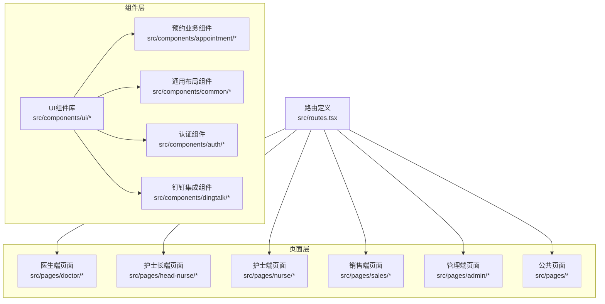
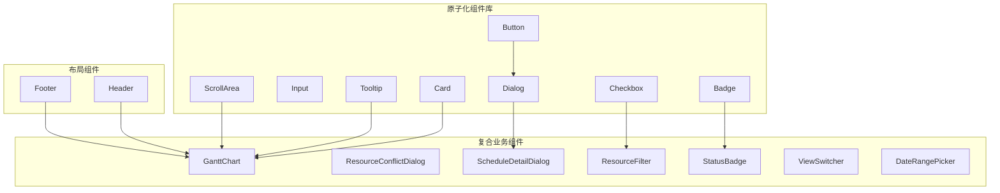
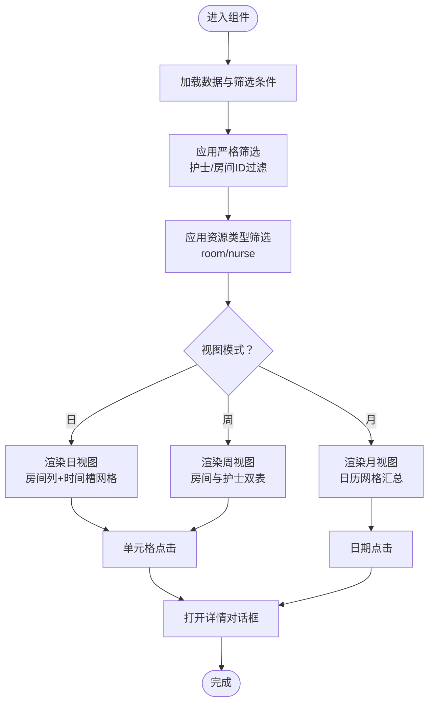
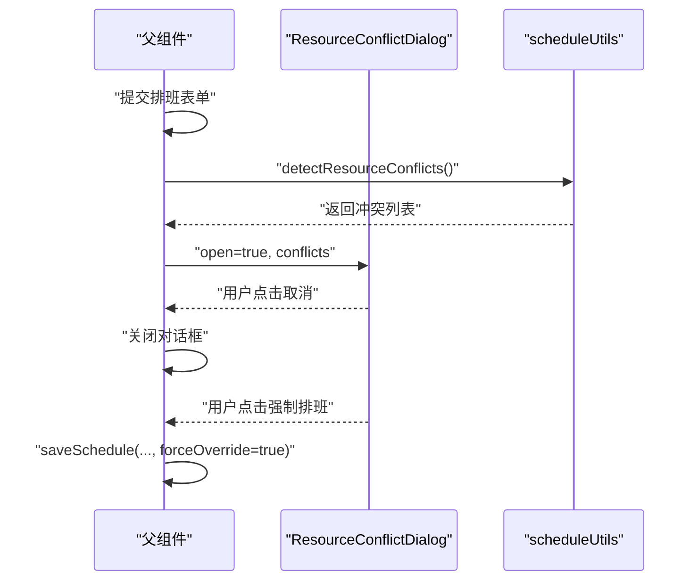

# 组件系统

<cite>
**本文引用的文件**
- [src/components/ui/button.tsx](file://src/components/ui/button.tsx)
- [src/components/ui/dialog.tsx](file://src/components/ui/dialog.tsx)
- [src/components/ui/input.tsx](file://src/components/ui/input.tsx)
- [src/components/ui/card.tsx](file://src/components/ui/card.tsx)
- [src/components/ui/checkbox.tsx](file://src/components/ui/checkbox.tsx)
- [src/components/ui/tooltip.tsx](file://src/components/ui/tooltip.tsx)
- [src/components/ui/scroll-area.tsx](file://src/components/ui/scroll-area.tsx)
- [src/components/ui/badge.tsx](file://src/components/ui/badge.tsx)
- [src/components/ui/alert-dialog.tsx](file://src/components/ui/alert-dialog.tsx)
- [src/components/ui/form.tsx](file://src/components/ui/form.tsx)
- [src/components/ui/calendar.tsx](file://src/components/ui/calendar.tsx)
- [src/components/ui/popover.tsx](file://src/components/ui/popover.tsx)
- [src/components/ui/textarea.tsx](file://src/components/ui/textarea.tsx)
- [src/components/ui/select.tsx](file://src/components/ui/select.tsx)
- [src/components/ui/label.tsx](file://src/components/ui/label.tsx)
- [src/components/ui/sheet.tsx](file://src/components/ui/sheet.tsx)
- [src/components/ui/separator.tsx](file://src/components/ui/separator.tsx)
- [src/components/ui/toast.tsx](file://src/components/ui/toast.tsx)
- [src/components/ui/toaster.tsx](file://src/components/ui/toaster.tsx)
- [src/components/ui/sonner.tsx](file://src/components/ui/sonner.tsx)
- [src/components/ui/table.tsx](file://src/components/ui/table.tsx)
- [src/components/ui/tabs.tsx](file://src/components/ui/tabs.tsx)
- [src/components/ui/navigation-menu.tsx](file://src/components/ui/navigation-menu.tsx)
- [src/components/ui/sidebar.tsx](file://src/components/ui/sidebar.tsx)
- [src/components/ui/carousel.tsx](file://src/components/ui/carousel.tsx)
- [src/components/ui/chart.tsx](file://src/components/ui/chart.tsx)
- [src/components/ui/map.tsx](file://src/components/ui/map.tsx)
- [src/components/ui/video.tsx](file://src/components/ui/video.tsx)
- [src/components/ui/qrcodedataurl.tsx](file://src/components/ui/qrcodedataurl.tsx)
- [src/components/ui/multi-select.tsx](file://src/components/ui/multi-select.tsx)
- [src/components/ui/radio-group.tsx](file://src/components/ui/radio-group.tsx)
- [src/components/ui/slider.tsx](file://src/components/ui/slider.tsx)
- [src/components/ui/switch.tsx](file://src/components/ui/switch.tsx)
- [src/components/ui/toggle.tsx](file://src/components/ui/toggle.tsx)
- [src/components/ui/toggle-group.tsx](file://src/components/ui/toggle-group.tsx)
- [src/components/ui/dropdown-menu.tsx](file://src/components/ui/dropdown-menu.tsx)
- [src/components/ui/drawer.tsx](file://src/components/ui/drawer.tsx)
- [src/components/ui/aspect-ratio.tsx](file://src/components/ui/aspect-ratio.tsx)
- [src/components/ui/avatar.tsx](file://src/components/ui/avatar.tsx)
- [src/components/ui/breadcrumb.tsx](file://src/components/ui/breadcrumb.tsx)
- [src/components/ui/pagination.tsx](file://src/components/ui/pagination.tsx)
- [src/components/ui/progress.tsx](file://src/components/ui/progress.tsx)
- [src/components/ui/resizable.tsx](file://src/components/ui/resizable.tsx)
- [src/components/ui/skeleton.tsx](file://src/components/ui/skeleton.tsx)
- [src/components/ui/menubar.tsx](file://src/components/ui/menubar.tsx)
- [src/components/ui/collapsible.tsx](file://src/components/ui/collapsible.tsx)
- [src/components/ui/command.tsx](file://src/components/ui/command.tsx)
- [src/components/ui/input-otp.tsx](file://src/components/ui/input-otp.tsx)
- [src/components/ui/accordion.tsx](file://src/components/ui/accordion.tsx)
- [src/components/ui/alert.tsx](file://src/components/ui/alert.tsx)
- [src/components/ui/separator.tsx](file://src/components/ui/separator.tsx)
- [src/components/ui/sheet.tsx](file://src/components/ui/sheet.tsx)
- [src/components/ui/sidebar.tsx](file://src/components/ui/sidebar.tsx)
- [src/components/ui/skeleton.tsx](file://src/components/ui/skeleton.tsx)
- [src/components/ui/video.tsx](file://src/components/ui/video.tsx)
- [src/components/ui/qrcodedataurl.tsx](file://src/components/ui/qrcodedataurl.tsx)
- [src/components/ui/multi-select.tsx](file://src/components/ui/multi-select.tsx)
- [src/components/ui/radio-group.tsx](file://src/components/ui/radio-group.tsx)
- [src/components/ui/slider.tsx](file://src/components/ui/slider.tsx)
- [src/components/ui/switch.tsx](file://src/components/ui/switch.tsx)
- [src/components/ui/toggle.tsx](file://src/components/ui/toggle.tsx)
- [src/components/ui/toggle-group.tsx](file://src/components/ui/toggle-group.tsx)
- [src/components/ui/dropdown-menu.tsx](file://src/components/ui/dropdown-menu.tsx)
- [src/components/ui/drawer.tsx](file://src/components/ui/drawer.tsx)
- [src/components/ui/aspect-ratio.tsx](file://src/components/ui/aspect-ratio.tsx)
- [src/components/ui/avatar.tsx](file://src/components/ui/avatar.tsx)
- [src/components/ui/breadcrumb.tsx](file://src/components/ui/breadcrumb.tsx)
- [src/components/ui/pagination.tsx](file://src/components/ui/pagination.tsx)
- [src/components/ui/progress.tsx](file://src/components/ui/progress.tsx)
- [src/components/ui/resizable.tsx](file://src/components/ui/resizable.tsx)
- [src/components/ui/skeleton.tsx](file://src/components/ui/skeleton.tsx)
- [src/components/ui/menubar.tsx](file://src/components/ui/menubar.tsx)
- [src/components/ui/collapsible.tsx](file://src/components/ui/collapsible.tsx)
- [src/components/ui/command.tsx](file://src/components/ui/command.tsx)
- [src/components/ui/input-otp.tsx](file://src/components/ui/input-otp.tsx)
- [src/components/ui/accordion.tsx](file://src/components/ui/accordion.tsx)
- [src/components/ui/alert.tsx](file://src/components/ui/alert.tsx)
- [src/components/appointment/GanttChart.tsx](file://src/components/appointment/GanttChart.tsx)
- [src/components/appointment/ResourceConflictDialog.tsx](file://src/components/appointment/ResourceConflictDialog.tsx)
- [src/components/appointment/ScheduleDetailDialog.tsx](file://src/components/appointment/ScheduleDetailDialog.tsx)
- [src/components/appointment/ResourceFilter.tsx](file://src/components/appointment/ResourceFilter.tsx)
- [src/components/appointment/StatusBadge.tsx](file://src/components/appointment/StatusBadge.tsx)
- [src/components/appointment/ViewSwitcher.tsx](file://src/components/appointment/ViewSwitcher.tsx)
- [src/components/appointment/DateRangePicker.tsx](file://src/components/appointment/DateRangePicker.tsx)
- [src/components/appointment/CompactFilterBar.tsx](file://src/components/appointment/CompactFilterBar.tsx)
- [src/components/appointment/ResourceDetailFilter.tsx](file://src/components/appointment/ResourceDetailFilter.tsx)
- [src/components/appointment/ResourceLegend.tsx](file://src/components/appointment/ResourceLegend.tsx)
- [src/components/common/Header.tsx](file://src/components/common/Header.tsx)
- [src/components/common/Footer.tsx](file://src/components/common/Footer.tsx)
- [src/components/common/PageMeta.tsx](file://src/components/common/PageMeta.tsx)
- [src/components/auth/ProtectedRoute.tsx](file://src/components/auth/ProtectedRoute.tsx)
- [src/components/dingtalk/DingTalkConfigDialog.tsx](file://src/components/dingtalk/DingTalkConfigDialog.tsx)
- [src/components/dingtalk/DingTalkSyncLogsTable.tsx](file://src/components/dingtalk/DingTalkSyncLogsTable.tsx)
- [src/components/dingtalk/DingTalkSyncPanel.tsx](file://src/components/dingtalk/DingTalkSyncPanel.tsx)
- [src/lib/utils.ts](file://src/lib/utils.ts)
- [src/utils/scheduleUtils.ts](file://src/utils/scheduleUtils.ts)
- [src/routes.tsx](file://src/routes.tsx)
- [src/pages/doctor/AppointmentPage.tsx](file://src/pages/doctor/AppointmentPage.tsx)
- [src/pages/head-nurse/SchedulePage.tsx](file://src/pages/head-nurse/SchedulePage.tsx)
- [src/pages/nurse/TaskPage.tsx](file://src/pages/nurse/TaskPage.tsx)
- [src/pages/sales/AppointmentPage.tsx](file://src/pages/sales/AppointmentPage.tsx)
- [src/pages/admin/SystemConfigPage.tsx](file://src/pages/admin/SystemConfigPage.tsx)
- [src/pages/admin/UserManagementPage.tsx](file://src/pages/admin/UserManagementPage.tsx)
- [src/pages/DashboardPage.tsx](file://src/pages/DashboardPage.tsx)
- [src/pages/ColorSystemDemo.tsx](file://src/pages/ColorSystemDemo.tsx)
- [src/pages/SamplePage.tsx](file://src/pages/SamplePage.tsx)
- [src/pages/NotFound.tsx](file://src/pages/NotFound.tsx)
- [src/contexts/AuthContext.tsx](file://src/contexts/AuthContext.tsx)
- [src/hooks/use-debounce.ts](file://src/hooks/use-debounce.ts)
- [src/hooks/use-go-back.ts](file://src/hooks/use-go-back.ts)
- [src/hooks/use-mobile.ts](file://src/hooks/use-mobile.ts)
- [src/hooks/use-toast.tsx](file://src/hooks/use-toast.tsx)
- [src/services/api-client.ts](file://src/services/api-client.ts)
- [src/services/api.ts](file://src/services/api.ts)
- [src/services/auth-client.ts](file://src/services/auth-client.ts)
- [src/services/auth.ts](file://src/services/auth.ts)
- [src/services/dataSync.ts](file://src/services/dataSync.ts)
- [src/services/realtime.ts](file://src/services/realtime.ts)
- [src/types/index.ts](file://src/types/index.ts)
- [src/types/types.ts](file://src/types/types.ts)
- [src/utils/colorSystem.ts](file://src/utils/colorSystem.ts)
- [src/utils/dingtalk.ts](file://src/utils/dingtalk.ts)
- [src/main.tsx](file://src/main.tsx)
- [src/App.tsx](file://src/App.tsx)
- [src/index.css](file://src/index.css)
- [tailwind.config.js](file://tailwind.config.js)
- [components.json](file://components.json)
- [package.json](file://package.json)
</cite>

## 目录
1. [简介](#简介)
2. [项目结构](#项目结构)
3. [核心组件](#核心组件)
4. [架构总览](#架构总览)
5. [详细组件分析](#详细组件分析)
6. [依赖分析](#依赖分析)
7. [性能考虑](#性能考虑)
8. [故障排除指南](#故障排除指南)
9. [结论](#结论)
10. [附录](#附录)

## 简介
本文件面向Bio-Appointment组件系统的使用者与维护者，系统性梳理基于React的组件分层架构，覆盖原子化UI组件（如按钮、输入、对话框等）、复合业务组件（如甘特图、资源筛选、冲突对话框等）以及布局组件（头部、页脚）。文档重点阐释组件库（src/components/ui）的设计原则与实现方式，说明其基于Radix UI与Tailwind CSS的封装机制；深入解析预约模块的核心组件（如GanttChart、ResourceConflictDialog）的交互逻辑与状态管理；提供组件使用示例路径，展示如何在不同角色页面中复用组件；并给出组件依赖关系图、Props传递、事件回调与样式继承机制说明，最后指导开发者如何扩展或自定义现有组件。

## 项目结构
项目采用按功能域划分的目录组织方式，核心组件集中在src/components下，按领域拆分为common（通用布局）、ui（原子化组件库）、appointment（预约业务组件）、auth（认证）、dingtalk（钉钉集成）等子目录。页面位于src/pages，路由定义于src/routes.tsx，全局样式与Tailwind配置位于src/index.css与tailwind.config.js，工具函数与类型定义分别位于src/utils与src/types。

图表来源
- [src/routes.tsx](file://src/routes.tsx#L1-L135)
- [src/components/ui/button.tsx](file://src/components/ui/button.tsx#L1-L58)
- [src/components/appointment/GanttChart.tsx](file://src/components/appointment/GanttChart.tsx#L1-L200)
- [src/components/common/Header.tsx](file://src/components/common/Header.tsx#L1-L196)

章节来源
- [src/routes.tsx](file://src/routes.tsx#L1-L135)

## 核心组件
本节聚焦组件库与业务组件的关键实现，解释其设计原则与封装策略。

- 组件库（src/components/ui）设计原则
  - 基于Radix UI：通过@radix-ui/react-*系列包实现无障碍、可组合的语义化基础组件，保证键盘导航、焦点管理与可访问性。
  - 基于Tailwind CSS：统一的className拼接与合并（cn），结合cva（class-variance-authority）实现变体与尺寸控制，确保主题一致性与可定制性。
  - Slot模式：通过@radix-ui/react-slot支持asChild属性，允许上层以语义化标签包裹基础组件，保持语义与样式一致。
  - 数据槽（data-slot）：为调试与测试提供稳定的选择器标识，便于定位组件内部元素。
  - 变体与尺寸：通过cva定义variant与size两类变体，配合cn合并默认类名与传入类名，实现灵活的样式组合。

- 关键组件示例
  - Button：支持variant（default/destructive/outline/secondary/ghost/link）与size（default/sm/lg/icon），支持asChild包裹。
  - Dialog：封装Root、Trigger、Portal、Overlay、Content、Header、Footer、Title、Description等子组件，提供动画与可访问性。
  - Input：标准化输入框外观与交互，支持aria-invalid与焦点环样式。
  - Card：卡片容器与标题、描述、内容、底部等子组件，支持数据槽标识。
  - Checkbox、Select、Textarea、Label等：均遵循相同封装模式，统一className与数据槽。

章节来源
- [src/components/ui/button.tsx](file://src/components/ui/button.tsx#L1-L58)
- [src/components/ui/dialog.tsx](file://src/components/ui/dialog.tsx#L1-L136)
- [src/components/ui/input.tsx](file://src/components/ui/input.tsx#L1-L27)
- [src/components/ui/card.tsx](file://src/components/ui/card.tsx#L1-L93)
- [src/components/ui/checkbox.tsx](file://src/components/ui/checkbox.tsx#L1-L31)
- [src/lib/utils.ts](file://src/lib/utils.ts#L1-L40)

## 架构总览
组件系统采用“原子化组件库 + 复合业务组件 + 布局组件”的三层结构：
- 原子化组件库：提供可复用的基础UI能力，统一风格与可访问性。
- 复合业务组件：围绕预约与排班场景构建，如GanttChart、ResourceConflictDialog、ScheduleDetailDialog等。
- 布局组件：Header、Footer等，负责页面骨架与导航。

图表来源
- [src/components/ui/button.tsx](file://src/components/ui/button.tsx#L1-L58)
- [src/components/ui/dialog.tsx](file://src/components/ui/dialog.tsx#L1-L136)
- [src/components/ui/input.tsx](file://src/components/ui/input.tsx#L1-L27)
- [src/components/ui/card.tsx](file://src/components/ui/card.tsx#L1-L93)
- [src/components/ui/checkbox.tsx](file://src/components/ui/checkbox.tsx#L1-L31)
- [src/components/ui/badge.tsx](file://src/components/ui/badge.tsx#L1-L200)
- [src/components/ui/tooltip.tsx](file://src/components/ui/tooltip.tsx#L1-L200)
- [src/components/ui/scroll-area.tsx](file://src/components/ui/scroll-area.tsx#L1-L200)
- [src/components/appointment/GanttChart.tsx](file://src/components/appointment/GanttChart.tsx#L1-L200)
- [src/components/appointment/ResourceConflictDialog.tsx](file://src/components/appointment/ResourceConflictDialog.tsx#L1-L93)
- [src/components/appointment/ScheduleDetailDialog.tsx](file://src/components/appointment/ScheduleDetailDialog.tsx#L1-L175)
- [src/components/appointment/ResourceFilter.tsx](file://src/components/appointment/ResourceFilter.tsx#L1-L94)
- [src/components/appointment/StatusBadge.tsx](file://src/components/appointment/StatusBadge.tsx#L1-L51)
- [src/components/appointment/ViewSwitcher.tsx](file://src/components/appointment/ViewSwitcher.tsx#L1-L200)
- [src/components/appointment/DateRangePicker.tsx](file://src/components/appointment/DateRangePicker.tsx#L1-L200)
- [src/components/common/Header.tsx](file://src/components/common/Header.tsx#L1-L196)
- [src/components/common/Footer.tsx](file://src/components/common/Footer.tsx#L1-L72)

## 详细组件分析

### 原子化组件库（UI组件）
- 设计要点
  - 通过cn与twMerge合并类名，避免重复与冲突。
  - 使用cva定义变体与尺寸，支持默认值与传入参数的组合。
  - 通过Slot与data-slot增强可组合性与可测试性。
  - 与Radix UI协作，确保可访问性与键盘交互。

- 示例路径
  - Button变体与尺寸：[src/components/ui/button.tsx](file://src/components/ui/button.tsx#L1-L58)
  - Dialog子组件体系：[src/components/ui/dialog.tsx](file://src/components/ui/dialog.tsx#L1-L136)
  - Input样式与焦点环：[src/components/ui/input.tsx](file://src/components/ui/input.tsx#L1-L27)
  - Card容器与子组件：[src/components/ui/card.tsx](file://src/components/ui/card.tsx#L1-L93)
  - Checkbox可访问性与指示器：[src/components/ui/checkbox.tsx](file://src/components/ui/checkbox.tsx#L1-L31)

章节来源
- [src/components/ui/button.tsx](file://src/components/ui/button.tsx#L1-L58)
- [src/components/ui/dialog.tsx](file://src/components/ui/dialog.tsx#L1-L136)
- [src/components/ui/input.tsx](file://src/components/ui/input.tsx#L1-L27)
- [src/components/ui/card.tsx](file://src/components/ui/card.tsx#L1-L93)
- [src/components/ui/checkbox.tsx](file://src/components/ui/checkbox.tsx#L1-L31)
- [src/lib/utils.ts](file://src/lib/utils.ts#L1-L40)

### 复合业务组件

#### GanttChart（甘特图）
- 功能概述
  - 支持日/周/月三种视图，按房间与护士维度展示排班。
  - 内置严格筛选：当存在护士或房间筛选条件时，仅显示匹配资源；资源类型筛选器可切换显示房间或护士。
  - 重叠排班自动分行排列，避免视觉重叠。
  - 单元格点击打开详情对话框，支持按日期与资源类型聚合查看。
  - 颜色系统：基于护士与房间ID生成组合渐变色，急单与锁定状态以边框标识。

- 关键交互与状态
  - 本地状态：对话框开关、选中排班集合、当前日期、资源名称与类型。
  - 输入Props：schedules、nurses、rooms、selectedDate、viewMode、resourceFilters、selectedNurseIds、selectedRoomIds、onScheduleClick。
  - 事件回调：onScheduleClick用于外部处理排班点击。

- 状态管理流程（简化）

图表来源
- [src/components/appointment/GanttChart.tsx](file://src/components/appointment/GanttChart.tsx#L1-L200)
- [src/components/appointment/ScheduleDetailDialog.tsx](file://src/components/appointment/ScheduleDetailDialog.tsx#L1-L175)

- Props与事件
  - Props：schedules、nurses、rooms、selectedDate、viewMode、resourceFilters、selectedNurseIds、selectedRoomIds、onScheduleClick。
  - 事件：onScheduleClick用于外部处理排班点击。

- 样式与颜色
  - 使用颜色系统工具生成护士与房间颜色，组合为渐变背景；急单与锁定状态以边框标识。

- 使用示例路径
  - 在护士长排班页中使用：[src/pages/head-nurse/SchedulePage.tsx](file://src/pages/head-nurse/SchedulePage.tsx#L1-L200)
  - 在医生预约页中作为排班预览：[src/pages/doctor/AppointmentPage.tsx](file://src/pages/doctor/AppointmentPage.tsx#L1-L200)

章节来源
- [src/components/appointment/GanttChart.tsx](file://src/components/appointment/GanttChart.tsx#L1-L200)
- [src/components/appointment/ScheduleDetailDialog.tsx](file://src/components/appointment/ScheduleDetailDialog.tsx#L1-L175)
- [src/pages/head-nurse/SchedulePage.tsx](file://src/pages/head-nurse/SchedulePage.tsx#L1-L200)
- [src/pages/doctor/AppointmentPage.tsx](file://src/pages/doctor/AppointmentPage.tsx#L1-L200)

#### ResourceConflictDialog（资源冲突对话框）
- 功能概述
  - 当新增或修改排班触发资源冲突检测时弹出，列出冲突的房间/护士及其对应冲突排班明细。
  - 提供“取消排班”与“强制排班”两种操作，强制排班会绕过冲突但需线下协调。

- 关键交互与状态
  - Props：open、conflicts、onConfirm、onCancel。
  - 内部状态：无（受控组件）。
  - 事件：onConfirm与onCancel由父组件传入，用于处理强制排班与取消。

- 交互序列

图表来源
- [src/components/appointment/ResourceConflictDialog.tsx](file://src/components/appointment/ResourceConflictDialog.tsx#L1-L93)
- [src/utils/scheduleUtils.ts](file://src/utils/scheduleUtils.ts#L1-L112)
- [src/pages/head-nurse/SchedulePage.tsx](file://src/pages/head-nurse/SchedulePage.tsx#L160-L220)

- Props与事件
  - Props：open、conflicts、onConfirm、onCancel。
  - 事件：onConfirm用于强制保存，onCancel用于取消。

- 使用示例路径
  - 在护士长排班页中调用：[src/pages/head-nurse/SchedulePage.tsx](file://src/pages/head-nurse/SchedulePage.tsx#L160-L220)

章节来源
- [src/components/appointment/ResourceConflictDialog.tsx](file://src/components/appointment/ResourceConflictDialog.tsx#L1-L93)
- [src/utils/scheduleUtils.ts](file://src/utils/scheduleUtils.ts#L1-L112)
- [src/pages/head-nurse/SchedulePage.tsx](file://src/pages/head-nurse/SchedulePage.tsx#L160-L220)

#### ScheduleDetailDialog（排班详情对话框）
- 功能概述
  - 展示某一天或某一资源下的所有排班详情，包含客户、时间、服务、房间与护士等信息。
  - 支持按日期与资源类型显示标题，滚动区域适配长列表。

- 关键交互与状态
  - Props：open、onOpenChange、schedules、date、resourceName、resourceType。
  - 事件：onOpenChange用于外部控制对话框开关。

- 使用示例路径
  - 在GanttChart中作为详情弹窗：[src/components/appointment/GanttChart.tsx](file://src/components/appointment/GanttChart.tsx#L560-L575)

章节来源
- [src/components/appointment/ScheduleDetailDialog.tsx](file://src/components/appointment/ScheduleDetailDialog.tsx#L1-L175)
- [src/components/appointment/GanttChart.tsx](file://src/components/appointment/GanttChart.tsx#L560-L575)

#### ResourceFilter（资源筛选）
- 功能概述
  - 提供“护士（含护士长）”与“房间资源”两个筛选项，支持切换选中状态。
  - 与GanttChart的严格筛选配合，实现资源维度的显隐控制。

- 关键交互与状态
  - Props：selectedFilters、onFilterChange。
  - 事件：onFilterChange用于父组件更新筛选状态。

- 使用示例路径
  - 在护士长排班页中使用：[src/pages/head-nurse/SchedulePage.tsx](file://src/pages/head-nurse/SchedulePage.tsx#L1-L200)

章节来源
- [src/components/appointment/ResourceFilter.tsx](file://src/components/appointment/ResourceFilter.tsx#L1-L94)
- [src/pages/head-nurse/SchedulePage.tsx](file://src/pages/head-nurse/SchedulePage.tsx#L1-L200)

#### StatusBadge（状态徽章）
- 功能概述
  - 根据不同状态（预约、排班、任务、医生）映射不同标签样式与文案。
  - 支持急单特殊标识。

- 使用示例路径
  - 在医生预约页中展示状态：[src/pages/doctor/AppointmentPage.tsx](file://src/pages/doctor/AppointmentPage.tsx#L1-L200)

章节来源
- [src/components/appointment/StatusBadge.tsx](file://src/components/appointment/StatusBadge.tsx#L1-L51)
- [src/pages/doctor/AppointmentPage.tsx](file://src/pages/doctor/AppointmentPage.tsx#L1-L200)

### 布局组件

#### Header（头部导航）
- 功能概述
  - 根据用户角色动态过滤可见路由，支持移动端抽屉菜单与用户信息弹出层。
  - 提供登出功能与Toast反馈。

- 关键交互与状态
  - 依赖AuthContext获取用户信息，根据角色过滤路由。
  - 使用Sheet与Popover实现移动端与桌面端的差异化交互。

- 使用示例路径
  - 在各页面中引入：[src/components/common/Header.tsx](file://src/components/common/Header.tsx#L1-L196)

章节来源
- [src/components/common/Header.tsx](file://src/components/common/Header.tsx#L1-L196)
- [src/routes.tsx](file://src/routes.tsx#L1-L135)

#### Footer（页脚）
- 功能概述
  - 提供公司信息、联系方式与营业时间等区块，支持响应式布局。

- 使用示例路径
  - 在各页面中引入：[src/components/common/Footer.tsx](file://src/components/common/Footer.tsx#L1-L72)

章节来源
- [src/components/common/Footer.tsx](file://src/components/common/Footer.tsx#L1-L72)

## 依赖分析
- 组件库依赖Radix UI与Tailwind CSS，通过@radix-ui/react-*与cva/twMerge实现可访问性与样式一致性。
- 页面层通过路由与上下文（AuthContext）驱动组件渲染与权限控制。
- 工具函数（cn、createQueryString、formatDate）与颜色系统（getNurseColor、getRoomColor、getCombinedGradient）贯穿组件库与业务组件，保证样式与视觉的一致性。

```mermaid
graph LR
PKG["package.json 依赖"] --> RADIX["@radix-ui/*"]
PKG --> TWCSS["tailwind-*"]
PKG --> DATEFNS["date-fns"]
PKG --> SONNER["sonner"]
PKG --> REACT["react/react-router"]
UI["UI组件库"] --> RADIX
UI --> TWCSS
UI --> DATEFNS
APPT["业务组件"] --> UI
APPT --> DATEFNS
APPT --> UTILS["utils/*"]
PAGES["页面"] --> APPT
PAGES --> UI
PAGES --> ROUTES["routes.tsx"]
PAGES --> CTX["AuthContext"]
```

图表来源
- [package.json](file://package.json#L1-L103)
- [src/components/ui/button.tsx](file://src/components/ui/button.tsx#L1-L58)
- [src/components/appointment/GanttChart.tsx](file://src/components/appointment/GanttChart.tsx#L1-L200)
- [src/routes.tsx](file://src/routes.tsx#L1-L135)
- [src/contexts/AuthContext.tsx](file://src/contexts/AuthContext.tsx#L1-L200)

章节来源
- [package.json](file://package.json#L1-L103)
- [src/lib/utils.ts](file://src/lib/utils.ts#L1-L40)
- [src/utils/colorSystem.ts](file://src/utils/colorSystem.ts#L1-L200)

## 性能考虑
- 列表渲染优化
  - GanttChart在日视图中对重叠排班进行分行排列，避免大量DOM节点重叠导致的绘制压力。
  - 使用固定宽度网格与绝对定位减少重排与重绘。
- 日期与格式化
  - 使用date-fns进行日期计算与格式化，避免频繁字符串解析。
- 对话框与弹层
  - Dialog与AlertDialog采用Portal挂载，减少层级嵌套带来的渲染成本。
- 筛选与渲染
  - 严格筛选在组件内部完成，避免向子组件传递过多无关数据，降低渲染负担。
- 样式合并
  - 通过cn与twMerge合并类名，避免重复样式与冲突，提升渲染效率。

## 故障排除指南
- 对话框无法关闭
  - 检查Dialog/AlertDialog的open与onOpenChange是否正确绑定，确保受控状态一致。
  - 参考：[src/components/ui/dialog.tsx](file://src/components/ui/dialog.tsx#L1-L136)，[src/components/appointment/ResourceConflictDialog.tsx](file://src/components/appointment/ResourceConflictDialog.tsx#L1-L93)
- 筛选无效
  - 确认ResourceFilter的selectedFilters与onFilterChange是否正确传递至GanttChart。
  - 参考：[src/components/appointment/ResourceFilter.tsx](file://src/components/appointment/ResourceFilter.tsx#L1-L94)，[src/components/appointment/GanttChart.tsx](file://src/components/appointment/GanttChart.tsx#L1-L200)
- 日期格式异常
  - 使用formatDate或date-fns的format方法，确保输入为有效日期对象或可解析字符串。
  - 参考：[src/lib/utils.ts](file://src/lib/utils.ts#L1-L40)，[src/components/appointment/ScheduleDetailDialog.tsx](file://src/components/appointment/ScheduleDetailDialog.tsx#L1-L175)
- 资源冲突误判
  - 检查detectResourceConflicts的起止时间格式与排除ID逻辑，确保与现有排班一致。
  - 参考：[src/utils/scheduleUtils.ts](file://src/utils/scheduleUtils.ts#L1-L112)

章节来源
- [src/components/ui/dialog.tsx](file://src/components/ui/dialog.tsx#L1-L136)
- [src/components/appointment/ResourceConflictDialog.tsx](file://src/components/appointment/ResourceConflictDialog.tsx#L1-L93)
- [src/components/appointment/ResourceFilter.tsx](file://src/components/appointment/ResourceFilter.tsx#L1-L94)
- [src/components/appointment/GanttChart.tsx](file://src/components/appointment/GanttChart.tsx#L1-L200)
- [src/components/appointment/ScheduleDetailDialog.tsx](file://src/components/appointment/ScheduleDetailDialog.tsx#L1-L175)
- [src/lib/utils.ts](file://src/lib/utils.ts#L1-L40)
- [src/utils/scheduleUtils.ts](file://src/utils/scheduleUtils.ts#L1-L112)

## 结论
Bio-Appointment组件系统以“原子化组件库 + 复合业务组件 + 布局组件”的分层架构为核心，通过Radix UI与Tailwind CSS实现高可访问性与一致的视觉风格，结合严格的筛选与颜色系统，为预约与排班场景提供了清晰、可扩展的前端解决方案。开发者可在现有组件基础上通过Props扩展、事件回调与样式覆盖实现二次开发，同时遵循组件库的设计原则与封装模式，确保一致的用户体验与可维护性。

## 附录

### 组件使用示例路径
- 在医生端页面中使用状态徽章与对话框：
  - [src/pages/doctor/AppointmentPage.tsx](file://src/pages/doctor/AppointmentPage.tsx#L1-L200)
- 在护士长端页面中使用甘特图与冲突对话框：
  - [src/pages/head-nurse/SchedulePage.tsx](file://src/pages/head-nurse/SchedulePage.tsx#L1-L200)
- 在护士端与销售端页面中复用UI组件：
  - [src/pages/nurse/TaskPage.tsx](file://src/pages/nurse/TaskPage.tsx#L1-L200)
  - [src/pages/sales/AppointmentPage.tsx](file://src/pages/sales/AppointmentPage.tsx#L1-L200)

### Props传递、事件回调与样式继承机制
- Props传递
  - 从页面到业务组件：通过路由参数与状态管理传递数据（如selectedDate、viewMode、resourceFilters等）。
  - 从业务组件到UI组件：通过Button、Dialog、Card等原子组件的Props传递className与变体。
- 事件回调
  - onOpenChange、onConfirm、onCancel等回调由父组件实现，子组件仅负责触发。
- 样式继承
  - 通过cn与twMerge合并类名，cva定义的默认样式与传入className叠加，保证样式一致性与可定制性。

### 扩展与自定义指南
- 新增原子化组件
  - 基于现有组件（如Button、Dialog、Input）的封装模式，使用cva定义变体，使用cn合并类名，使用data-slot标注内部元素。
  - 参考：[src/components/ui/button.tsx](file://src/components/ui/button.tsx#L1-L58)，[src/components/ui/dialog.tsx](file://src/components/ui/dialog.tsx#L1-L136)，[src/components/ui/input.tsx](file://src/components/ui/input.tsx#L1-L27)
- 新增业务组件
  - 在src/components/appointment下新增tsx文件，复用UI组件与工具函数，通过Props与事件回调与页面解耦。
  - 参考：[src/components/appointment/GanttChart.tsx](file://src/components/appointment/GanttChart.tsx#L1-L200)，[src/components/appointment/ResourceConflictDialog.tsx](file://src/components/appointment/ResourceConflictDialog.tsx#L1-L93)
- 自定义样式
  - 通过Tailwind类名覆盖默认样式，或在cva中新增变体，确保与主题一致。
  - 参考：[src/lib/utils.ts](file://src/lib/utils.ts#L1-L40)