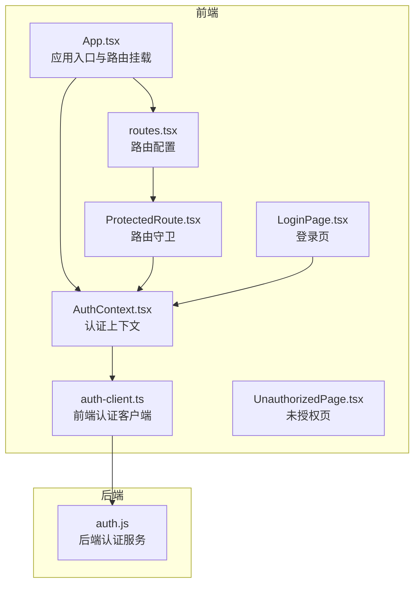
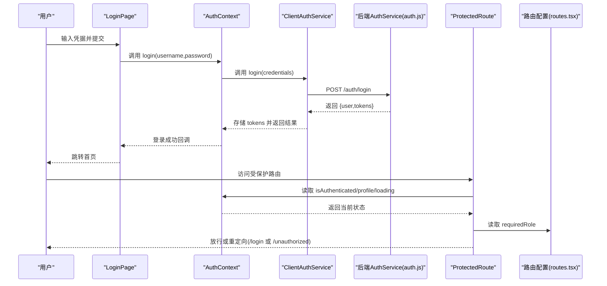
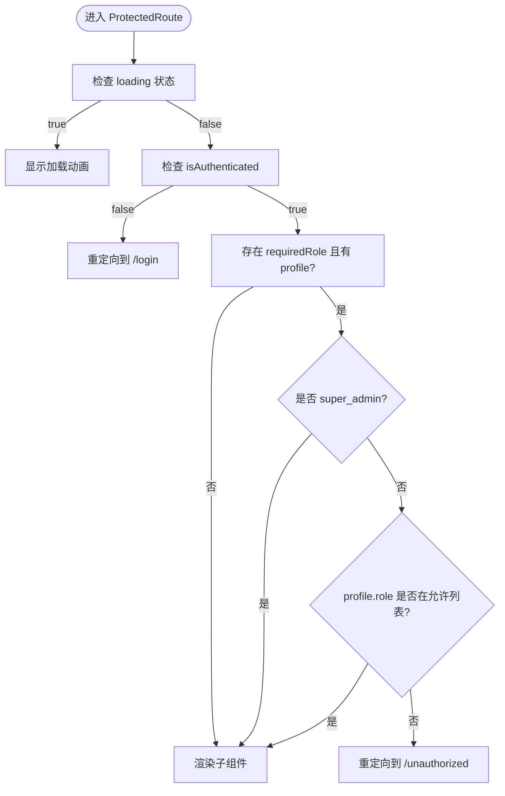
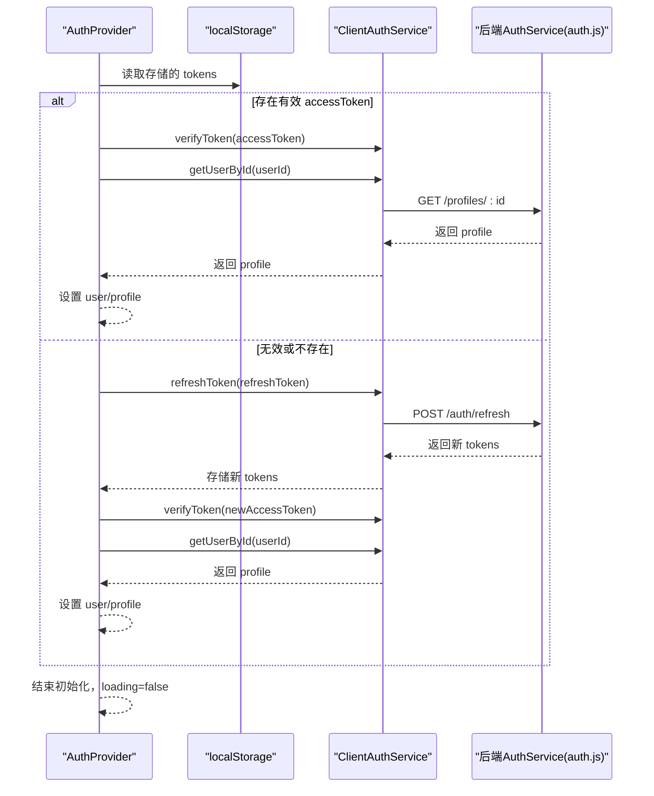
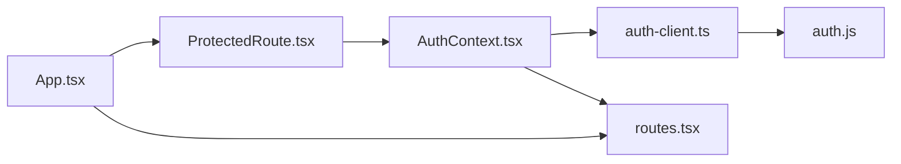

# 认证组件

<cite>
**本文引用的文件**
- [ProtectedRoute.tsx](file://src/components/auth/ProtectedRoute.tsx)
- [AuthContext.tsx](file://src/contexts/AuthContext.tsx)
- [auth-client.ts](file://src/services/auth-client.ts)
- [auth.ts](file://src/services/auth.ts)
- [routes.tsx](file://src/routes.tsx)
- [App.tsx](file://src/App.tsx)
- [LoginPage.tsx](file://src/pages/auth/LoginPage.tsx)
- [UnauthorizedPage.tsx](file://src/pages/auth/UnauthorizedPage.tsx)
- [types.ts](file://src/types/types.ts)
- [auth.js](file://server/src/services/auth.js)
- [AUTH_IMPLEMENTATION_SUMMARY.md](file://AUTH_IMPLEMENTATION_SUMMARY.md)
- [AUTH_TESTING_GUIDE.md](file://AUTH_TESTING_GUIDE.md)
</cite>

## 目录
1. [简介](#简介)
2. [项目结构](#项目结构)
3. [核心组件](#核心组件)
4. [架构总览](#架构总览)
5. [详细组件分析](#详细组件分析)
6. [依赖关系分析](#依赖关系分析)
7. [性能考量](#性能考量)
8. [故障排查指南](#故障排查指南)
9. [结论](#结论)
10. [附录](#附录)

## 简介
本文件聚焦于认证相关组件，系统性解析 ProtectedRoute 路由守卫的实现机制，说明其如何结合 AuthContext 进行路由守卫、拦截未授权访问并重定向至登录页；阐述其与 JWT 令牌验证、角色权限（销售、护士长、医生等）的集成方式；提供在不同页面（管理页面、医生页面）中使用 ProtectedRoute 的配置示例；并覆盖登录状态同步、会话过期处理与 SSR 兼容性考虑，最后指导开发者如何扩展自定义权限校验逻辑。

## 项目结构
认证体系由前端上下文、客户端认证服务、路由守卫、路由配置与页面组成，配合后端认证服务共同完成端到端的认证与权限控制。

图表来源
- [App.tsx](file://src/App.tsx#L1-L61)
- [AuthContext.tsx](file://src/contexts/AuthContext.tsx#L74-L138)
- [ProtectedRoute.tsx](file://src/components/auth/ProtectedRoute.tsx#L12-L48)
- [auth-client.ts](file://src/services/auth-client.ts#L1-L235)
- [routes.tsx](file://src/routes.tsx#L39-L135)
- [LoginPage.tsx](file://src/pages/auth/LoginPage.tsx#L1-L158)
- [UnauthorizedPage.tsx](file://src/pages/auth/UnauthorizedPage.tsx#L1-L39)
- [auth.js](file://server/src/services/auth.js#L1-L284)

章节来源
- [App.tsx](file://src/App.tsx#L1-L61)
- [routes.tsx](file://src/routes.tsx#L39-L135)

## 核心组件
- ProtectedRoute：基于角色的路由守卫，负责拦截未登录与无权限访问，统一重定向至登录页或未授权页。
- AuthContext：提供登录、登出、注册、令牌刷新、用户信息拉取等能力，封装本地存储与后端交互。
- ClientAuthService：前端侧认证客户端，负责与后端 API 通信、令牌存储与解码。
- AuthService（后端）：后端认证服务，负责 JWT 生成/验证、用户注册/登录、刷新令牌、权限矩阵等。
- routes：集中声明路由、是否需要认证、所需角色等元信息，供 App 与 ProtectedRoute 使用。
- LoginPage/UnauthorizedPage：认证相关页面，分别用于登录与权限不足提示。

章节来源
- [ProtectedRoute.tsx](file://src/components/auth/ProtectedRoute.tsx#L12-L48)
- [AuthContext.tsx](file://src/contexts/AuthContext.tsx#L74-L138)
- [auth-client.ts](file://src/services/auth-client.ts#L1-L235)
- [auth.js](file://server/src/services/auth.js#L1-L284)
- [routes.tsx](file://src/routes.tsx#L39-L135)
- [LoginPage.tsx](file://src/pages/auth/LoginPage.tsx#L1-L158)
- [UnauthorizedPage.tsx](file://src/pages/auth/UnauthorizedPage.tsx#L1-L39)

## 架构总览
认证流程从登录开始，前端通过 ClientAuthService 调用后端接口获取访问令牌与刷新令牌，保存到本地存储；随后 AuthContext 初始化时读取令牌并验证有效性，拉取用户资料，建立登录状态；路由渲染时，App 将需要保护的路由包裹在 ProtectedRoute 中，依据路由配置与用户角色决定放行或重定向。

图表来源
- [LoginPage.tsx](file://src/pages/auth/LoginPage.tsx#L34-L70)
- [AuthContext.tsx](file://src/contexts/AuthContext.tsx#L154-L176)
- [auth-client.ts](file://src/services/auth-client.ts#L60-L81)
- [auth.js](file://server/src/services/auth.js#L121-L146)
- [ProtectedRoute.tsx](file://src/components/auth/ProtectedRoute.tsx#L12-L48)
- [routes.tsx](file://src/routes.tsx#L39-L135)

## 详细组件分析

### ProtectedRoute 组件
- 作用：对受保护路由进行守卫，处理加载态、未登录与角色权限不足三种情况。
- 关键逻辑：
  - loading 期间显示加载动画；
  - 未登录则重定向到登录页；
  - 若路由声明 requiredRole，则与用户角色比对；超级管理员拥有全部权限；
  - 角色不在允许列表则重定向到未授权页。
- 与 AuthContext 的协作：通过 useAuth 获取 isAuthenticated、profile、loading 状态，确保守卫逻辑与全局认证状态一致。

图表来源
- [ProtectedRoute.tsx](file://src/components/auth/ProtectedRoute.tsx#L12-L48)

章节来源
- [ProtectedRoute.tsx](file://src/components/auth/ProtectedRoute.tsx#L12-L48)

### AuthContext 上下文
- 初始化流程：启动时读取本地存储的令牌，优先尝试使用 accessToken 解码并拉取用户资料；若无效则尝试使用 refreshToken 刷新并重新拉取；失败则清空令牌。
- 登录/注册：调用 ClientAuthService 完成登录/注册，成功后写入令牌并设置用户状态。
- 令牌刷新：定时检查 accessToken 过期时间，提前 5 分钟自动刷新并更新本地存储；过期或验证失败时自动登出。
- 登出：清除本地令牌与用户状态，并调用后端登出接口。
- 提供属性：user、profile、loading、isAuthenticated、isAdmin、login、logout、register、refreshUser、changePassword。

图表来源
- [AuthContext.tsx](file://src/contexts/AuthContext.tsx#L80-L138)
- [auth-client.ts](file://src/services/auth-client.ts#L112-L126)
- [auth.js](file://server/src/services/auth.js#L148-L168)

章节来源
- [AuthContext.tsx](file://src/contexts/AuthContext.tsx#L74-L138)
- [AuthContext.tsx](file://src/contexts/AuthContext.tsx#L232-L276)
- [AuthContext.tsx](file://src/contexts/AuthContext.tsx#L178-L192)
- [AuthContext.tsx](file://src/contexts/AuthContext.tsx#L194-L213)
- [AuthContext.tsx](file://src/contexts/AuthContext.tsx#L215-L231)

### ClientAuthService 前端认证客户端
- 令牌验证：支持 mock 令牌（开发环境），普通令牌通过 base64 解码 payload 获取 userId、role、exp 等。
- 登录/注册/刷新/登出：与后端 API 对接，携带 Authorization 头，处理响应与错误。
- 令牌存储：localStorage 中以固定键名存储 accessToken 与 refreshToken。

章节来源
- [auth-client.ts](file://src/services/auth-client.ts#L31-L57)
- [auth-client.ts](file://src/services/auth-client.ts#L60-L81)
- [auth-client.ts](file://src/services/auth-client.ts#L83-L109)
- [auth-client.ts](file://src/services/auth-client.ts#L112-L126)
- [auth-client.ts](file://src/services/auth-client.ts#L128-L153)
- [auth-client.ts](file://src/services/auth-client.ts#L156-L179)
- [auth-client.ts](file://src/services/auth-client.ts#L182-L212)
- [auth-client.ts](file://src/services/auth-client.ts#L215-L231)

### 后端 AuthService（JWT 与权限）
- JWT 生成/验证：签发 accessToken/refreshToken，设置过期时间与受众；验证时区分过期与非法令牌。
- 登录/注册/刷新：校验用户状态、密码、用户是否存在；刷新时再次校验用户状态。
- 权限矩阵：按角色返回可执行的操作集合，支持 hasPermission 查询。

章节来源
- [auth.js](file://server/src/services/auth.js#L34-L60)
- [auth.js](file://server/src/services/auth.js#L48-L60)
- [auth.js](file://server/src/services/auth.js#L64-L83)
- [auth.js](file://server/src/services/auth.js#L121-L146)
- [auth.js](file://server/src/services/auth.js#L148-L168)
- [auth.js](file://server/src/services/auth.js#L246-L280)

### 路由配置与守卫集成
- routes.tsx：集中声明路由、requireAuth、requiredRole 等元信息；App.tsx 将需要认证的路由包裹在 ProtectedRoute 中。
- App.tsx：在根组件中注入 AuthProvider，渲染受保护路由时传入 requiredRole，实现“按角色放行”。

章节来源
- [routes.tsx](file://src/routes.tsx#L39-L135)
- [App.tsx](file://src/App.tsx#L1-L61)

### 登录页与未授权页
- LoginPage：表单校验、调用 AuthContext.login、成功后跳转首页。
- UnauthorizedPage：提示权限不足并提供返回首页按钮。

章节来源
- [LoginPage.tsx](file://src/pages/auth/LoginPage.tsx#L34-L70)
- [UnauthorizedPage.tsx](file://src/pages/auth/UnauthorizedPage.tsx#L1-L39)

## 依赖关系分析
- ProtectedRoute 依赖 AuthContext 提供的认证状态与 profile。
- AuthContext 依赖 ClientAuthService 与后端 AuthService 协同完成令牌管理与用户信息拉取。
- App 依赖 routes.tsx 的路由配置，将受保护路由交由 ProtectedRoute 守卫。
- ClientAuthService 与后端 auth.js 通过 HTTP API 交互。

图表来源
- [ProtectedRoute.tsx](file://src/components/auth/ProtectedRoute.tsx#L12-L48)
- [AuthContext.tsx](file://src/contexts/AuthContext.tsx#L74-L138)
- [auth-client.ts](file://src/services/auth-client.ts#L1-L235)
- [routes.tsx](file://src/routes.tsx#L39-L135)
- [App.tsx](file://src/App.tsx#L1-L61)
- [auth.js](file://server/src/services/auth.js#L1-L284)

章节来源
- [ProtectedRoute.tsx](file://src/components/auth/ProtectedRoute.tsx#L12-L48)
- [AuthContext.tsx](file://src/contexts/AuthContext.tsx#L74-L138)
- [auth-client.ts](file://src/services/auth-client.ts#L1-L235)
- [routes.tsx](file://src/routes.tsx#L39-L135)
- [App.tsx](file://src/App.tsx#L1-L61)
- [auth.js](file://server/src/services/auth.js#L1-L284)

## 性能考量
- 令牌刷新策略：在 accessToken 剩余有效期小于 5 分钟时触发刷新，避免频繁刷新造成抖动；过期或验证失败时自动登出，减少无效请求。
- 初始化开销：首次加载时可能需要一次或两次网络请求（验证令牌或刷新令牌），建议在 App.tsx 中尽早挂载 AuthProvider，缩短白屏时间。
- 路由守卫成本：ProtectedRoute 仅做轻量判断（loading、isAuthenticated、requiredRole），不会引入额外昂贵计算。
- 建议：在高并发场景下，可考虑对刷新令牌接口增加幂等与去重策略，避免短时间内多次刷新。

[本节为通用性能讨论，无需列出具体文件来源]

## 故障排查指南
- 登录后仍被重定向到登录页
  - 检查本地存储是否正确写入 accessToken/refreshToken；
  - 确认初始化流程是否成功解码并拉取用户资料；
  - 如令牌无效，确认后端是否返回合法 tokens。
- 角色权限不足被重定向到未授权页
  - 确认 routes.tsx 中 requiredRole 配置是否正确；
  - 确认 profile.role 是否为预期角色；
  - 超级管理员可访问所有页面，确认是否被错误识别为非管理员。
- 会话过期自动登出
  - 检查定时刷新逻辑是否触发；
  - 确认刷新失败时是否正确清理令牌并登出；
  - 开发环境 mock 令牌不会过期，注意区分。
- 登出后状态未清除
  - 确认 ClientAuthService.clearTokens 是否被调用；
  - 确认 AuthContext 中 user/profile 是否被置空；
  - 确认后端登出接口是否成功。

章节来源
- [AuthContext.tsx](file://src/contexts/AuthContext.tsx#L232-L276)
- [AuthContext.tsx](file://src/contexts/AuthContext.tsx#L178-L192)
- [auth-client.ts](file://src/services/auth-client.ts#L182-L212)
- [auth-client.ts](file://src/services/auth-client.ts#L215-L231)
- [ProtectedRoute.tsx](file://src/components/auth/ProtectedRoute.tsx#L12-L48)
- [routes.tsx](file://src/routes.tsx#L39-L135)

## 结论
该认证体系通过 ProtectedRoute 与 AuthContext 的协同，实现了基于角色的路由守卫；借助 ClientAuthService 与后端 AuthService 的配合，完成了 JWT 令牌的签发、验证与刷新；配合 routes.tsx 的集中配置，开发者可以轻松地为不同页面设置访问权限。系统具备完善的登录状态同步、会话过期处理与错误重定向机制，适合在多角色业务场景中稳定运行。

[本节为总结性内容，无需列出具体文件来源]

## 附录

### 角色与权限矩阵（来自后端权限矩阵）
- 超级管理员：拥有所有权限（用户、预约、排班、系统配置等）。
- 销售：可创建/查看/更新预约。
- 护士长：可查看/更新预约与排班，可创建/查看/更新任务。
- 护士：可查看/更新任务。
- 医生：可查看/更新预约。

章节来源
- [auth.js](file://server/src/services/auth.js#L246-L280)

### 在不同页面使用 ProtectedRoute 的配置示例
- 管理页面（用户管理、系统配置）
  - routes.tsx 中将路径与 requiredRole 设为 super_admin；
  - App.tsx 将该路由包裹在 ProtectedRoute 中，传入 requiredRole。
- 医生页面（预约待办）
  - routes.tsx 中将路径与 requiredRole 设为 doctor；
  - App.tsx 将该路由包裹在 ProtectedRoute 中，传入 requiredRole。
- 销售页面（预约发起）
  - routes.tsx 中将路径与 requiredRole 设为 sales；
  - App.tsx 将该路由包裹在 ProtectedRoute 中，传入 requiredRole。

章节来源
- [routes.tsx](file://src/routes.tsx#L71-L118)
- [App.tsx](file://src/App.tsx#L32-L43)

### 登录状态同步与会话过期处理
- 登录状态同步：AuthContext 初始化时读取本地存储令牌并验证，成功后设置 user/profile；登录成功后写入令牌并设置状态。
- 会话过期处理：定时检查令牌剩余有效期，提前刷新；过期或验证失败时自动登出并清理令牌。
- SSR 兼容性：当前实现为客户端认证，不涉及 SSR；如需 SSR，可在服务端渲染前预取用户信息并通过 Context 注入，或采用服务端 Cookie/JWT 方案。

章节来源
- [AuthContext.tsx](file://src/contexts/AuthContext.tsx#L80-L138)
- [AuthContext.tsx](file://src/contexts/AuthContext.tsx#L232-L276)
- [auth-client.ts](file://src/services/auth-client.ts#L182-L212)

### 扩展自定义权限校验逻辑
- 方法一：在 ProtectedRoute 中扩展校验逻辑
  - 在现有角色校验基础上，增加自定义权限判断（例如某模块的细粒度操作权限）。
  - 可结合后端 hasPermission 接口或前端 AuthService.getUserPermissions 返回的权限集合进行判断。
- 方法二：在路由配置中增加自定义字段
  - 在 routes.tsx 中为路由新增自定义字段（如 requiredPermission），在 ProtectedRoute 中读取并校验。
- 方法三：在 AuthContext 中暴露权限查询方法
  - 通过 AuthService.hasPermission 或 ClientAuthService 与后端交互，返回布尔值供守卫使用。

章节来源
- [ProtectedRoute.tsx](file://src/components/auth/ProtectedRoute.tsx#L32-L45)
- [routes.tsx](file://src/routes.tsx#L39-L135)
- [auth.js](file://server/src/services/auth.js#L246-L280)
- [auth.ts](file://src/services/auth.ts#L301-L338)

### 开发与测试建议
- 首次使用：通过注册页面创建第一个账号（自动成为超级管理员），再创建其他角色账号并分配角色。
- 权限测试：针对每个角色验证菜单显示、路由访问、数据访问权限。
- 安全测试：验证未登录访问保护、越权访问防护、禁用用户无法登录。

章节来源
- [AUTH_IMPLEMENTATION_SUMMARY.md](file://AUTH_IMPLEMENTATION_SUMMARY.md#L249-L284)
- [AUTH_TESTING_GUIDE.md](file://AUTH_TESTING_GUIDE.md#L1-L180)