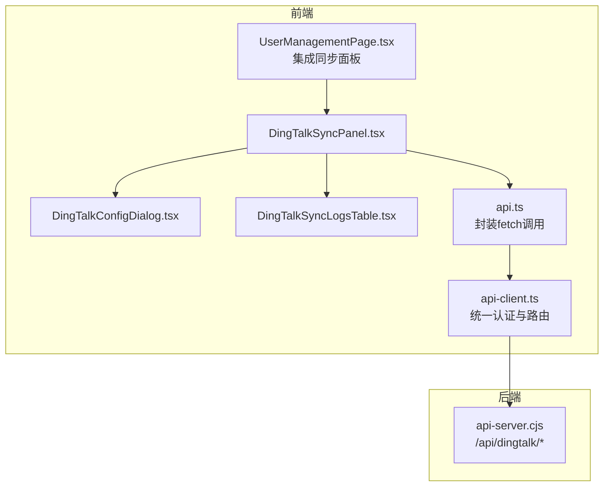
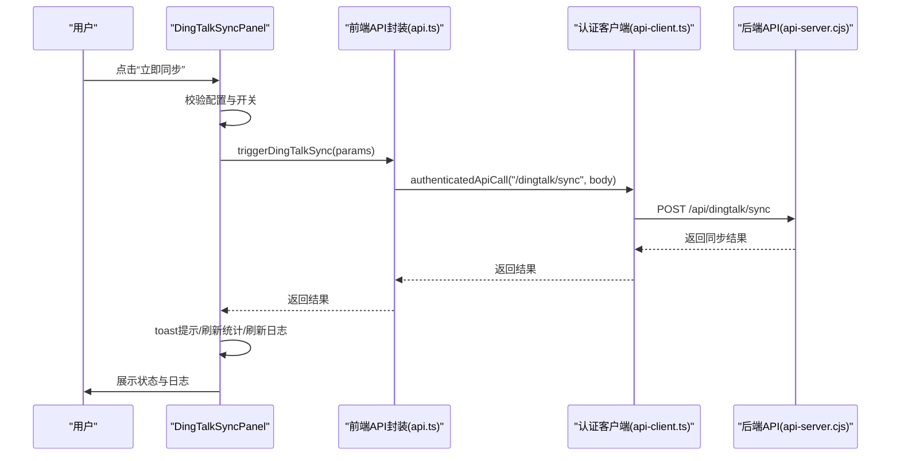
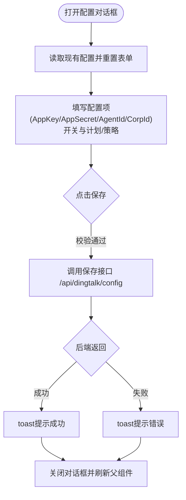
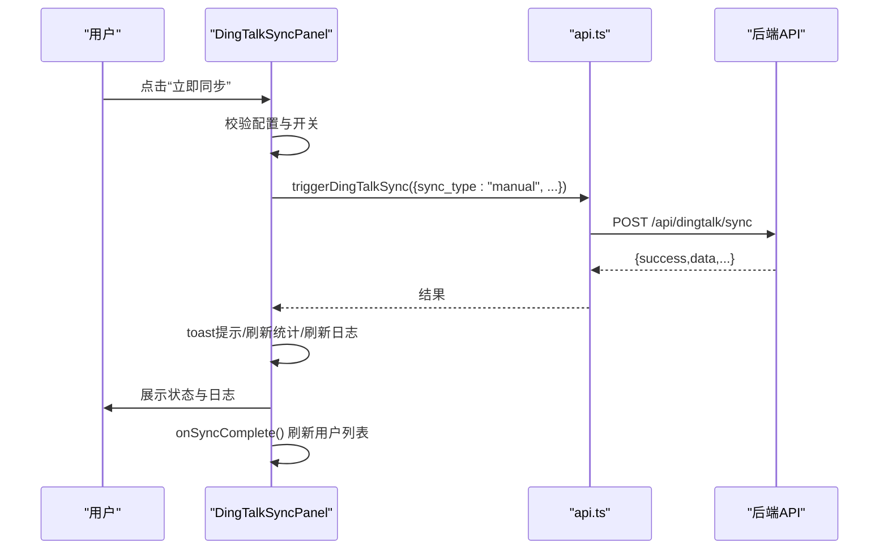
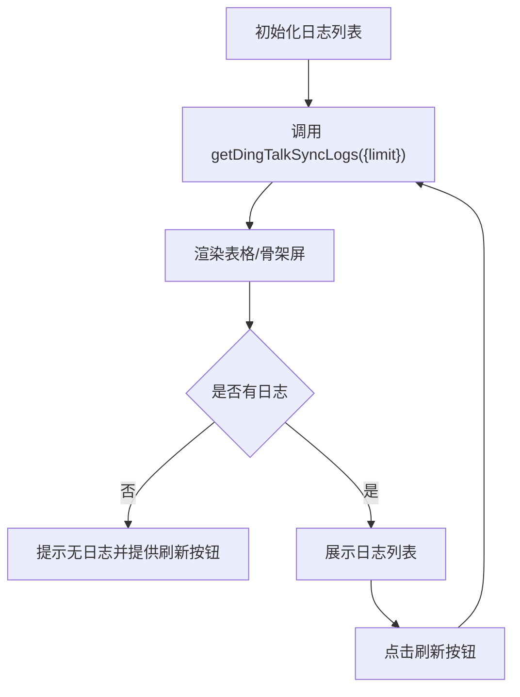
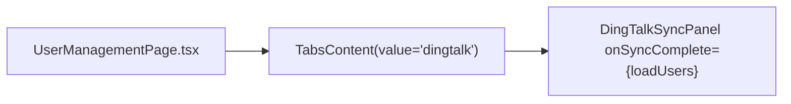
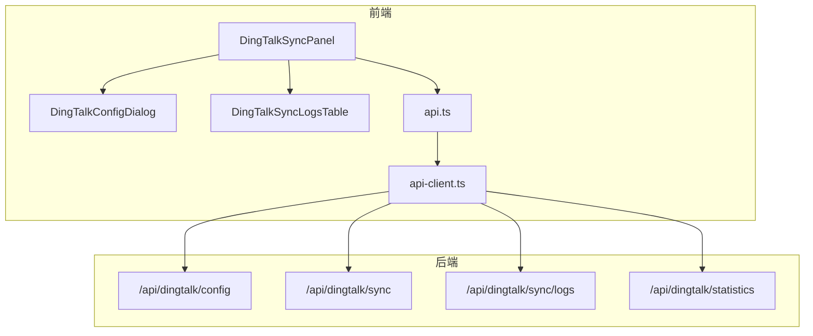

# 钉钉集成组件

<cite>
**本文引用的文件**
- [DingTalkConfigDialog.tsx](file://src/components/dingtalk/DingTalkConfigDialog.tsx)
- [DingTalkSyncPanel.tsx](file://src/components/dingtalk/DingTalkSyncPanel.tsx)
- [DingTalkSyncLogsTable.tsx](file://src/components/dingtalk/DingTalkSyncLogsTable.tsx)
- [api.ts](file://src/db/api.ts)
- [api-client.ts](file://src/services/api-client.ts)
- [UserManagementPage.tsx](file://src/pages/admin/UserManagementPage.tsx)
- [SystemConfigPage.tsx](file://src/pages/admin/SystemConfigPage.tsx)
- [dingtalk.ts](file://src/utils/dingtalk.ts)
- [api-server.cjs](file://server/api-server.cjs)
- [钉钉同步功能说明.md](file://钉钉同步功能说明.md)
</cite>

## 目录
1. [简介](#简介)
2. [项目结构](#项目结构)
3. [核心组件](#核心组件)
4. [架构总览](#架构总览)
5. [组件详解](#组件详解)
6. [依赖关系分析](#依赖关系分析)
7. [性能与可用性建议](#性能与可用性建议)
8. [故障排查指南](#故障排查指南)
9. [结论](#结论)
10. [附录](#附录)

## 简介
本文件面向管理员与开发人员，系统化梳理钉钉集成相关的UI组件实现，包括：
- 配置收集与存储：DingTalkConfigDialog 如何收集并加密存储钉钉企业ID、应用密钥等配置信息
- 同步触发与交互：DingTalkSyncPanel 的同步触发机制及其与后端API（/api/dingtalk/sync）的交互流程
- 日志展示与筛选：DingTalkSyncLogsTable 的日志分页、筛选与状态标记能力
- 管理界面集成：如何在管理员界面集成这些组件，以及错误处理与安全最佳实践

## 项目结构
钉钉集成相关代码主要位于以下位置：
- 组件层：src/components/dingtalk 下的三个组件
- 页面层：src/pages/admin 下的用户管理页面集成钉钉同步面板
- 服务层：src/db/api.ts 与 src/services/api-client.ts 提供对后端API的封装
- 后端：server/api-server.cjs 提供 /api/dingtalk/* 接口
- 工具：src/utils/dingtalk.ts 提供钉钉JSAPI工具类（与前端页面内嵌钉钉环境相关）

图表来源
- [DingTalkConfigDialog.tsx](file://src/components/dingtalk/DingTalkConfigDialog.tsx#L1-L302)
- [DingTalkSyncPanel.tsx](file://src/components/dingtalk/DingTalkSyncPanel.tsx#L1-L237)
- [DingTalkSyncLogsTable.tsx](file://src/components/dingtalk/DingTalkSyncLogsTable.tsx#L1-L91)
- [api.ts](file://src/db/api.ts#L1320-L1532)
- [api-client.ts](file://src/services/api-client.ts#L331-L381)
- [UserManagementPage.tsx](file://src/pages/admin/UserManagementPage.tsx#L479-L481)
- [api-server.cjs](file://server/api-server.cjs#L1036-L1158)

章节来源
- [DingTalkConfigDialog.tsx](file://src/components/dingtalk/DingTalkConfigDialog.tsx#L1-L302)
- [DingTalkSyncPanel.tsx](file://src/components/dingtalk/DingTalkSyncPanel.tsx#L1-L237)
- [DingTalkSyncLogsTable.tsx](file://src/components/dingtalk/DingTalkSyncLogsTable.tsx#L1-L91)
- [api.ts](file://src/db/api.ts#L1320-L1532)
- [api-client.ts](file://src/services/api-client.ts#L331-L381)
- [UserManagementPage.tsx](file://src/pages/admin/UserManagementPage.tsx#L479-L481)
- [api-server.cjs](file://server/api-server.cjs#L1036-L1158)

## 核心组件
- DingTalkConfigDialog：表单收集钉钉配置（AppKey/AppSecret/AgentId/CorpId）、同步开关、自动同步计划、冲突策略；提交时调用保存接口并提示结果
- DingTalkSyncPanel：加载配置、统计、日志；提供“立即同步”按钮；支持刷新日志与回调刷新用户列表
- DingTalkSyncLogsTable：展示同步日志列表，支持刷新、空态与骨架屏；根据状态生成徽章

章节来源
- [DingTalkConfigDialog.tsx](file://src/components/dingtalk/DingTalkConfigDialog.tsx#L1-L302)
- [DingTalkSyncPanel.tsx](file://src/components/dingtalk/DingTalkSyncPanel.tsx#L1-L237)
- [DingTalkSyncLogsTable.tsx](file://src/components/dingtalk/DingTalkSyncLogsTable.tsx#L1-L91)

## 架构总览
前端通过封装的API函数调用后端 /api/dingtalk/* 接口，完成配置保存、同步触发与日志查询。同步完成后，面板会刷新统计数据与日志，并可通过回调通知上层刷新用户列表。

图表来源
- [DingTalkSyncPanel.tsx](file://src/components/dingtalk/DingTalkSyncPanel.tsx#L66-L103)
- [api.ts](file://src/db/api.ts#L1351-L1378)
- [api-client.ts](file://src/services/api-client.ts#L355-L364)
- [api-server.cjs](file://server/api-server.cjs#L1133-L1158)

## 组件详解

### DingTalkConfigDialog：配置收集与加密存储
- 表单字段与校验
  - AppKey/AppSecret/AgentId/CorpId 必填校验
  - sync_enabled/auto_sync_enabled 开关
  - sync_schedule/sync_time 自动同步计划
  - conflict_strategy 冲突策略枚举
- 提交流程
  - 使用 upsertDingTalkSyncConfig（封装于 api.ts）提交配置
  - 后端接口 /api/dingtalk/config 支持新增或更新配置
  - 后端返回时对敏感字段进行脱敏（如 AppSecret 显示为占位符）
- 安全与体验
  - AppSecret 输入框类型为 password
  - 保存成功提示，失败捕获错误消息
  - 关闭对话框后刷新父组件配置

图表来源
- [DingTalkConfigDialog.tsx](file://src/components/dingtalk/DingTalkConfigDialog.tsx#L14-L96)
- [api.ts](file://src/db/api.ts#L1320-L1346)
- [api-server.cjs](file://server/api-server.cjs#L1036-L1131)

章节来源
- [DingTalkConfigDialog.tsx](file://src/components/dingtalk/DingTalkConfigDialog.tsx#L1-L302)
- [api.ts](file://src/db/api.ts#L1320-L1346)
- [api-server.cjs](file://server/api-server.cjs#L1036-L1131)

### DingTalkSyncPanel：同步触发机制与交互
- 生命周期
  - 首次渲染加载配置、统计、最近日志
- 同步触发
  - 校验是否存在配置且已启用同步
  - 调用 triggerDingTalkSync，携带 sync_type、selected_departments、conflict_strategy
  - 成功后刷新统计与日志，并通过 onSyncComplete 回调刷新用户列表
- 状态徽章
  - 根据状态生成不同徽章：成功/失败/进行中/部分成功/待处理

图表来源
- [DingTalkSyncPanel.tsx](file://src/components/dingtalk/DingTalkSyncPanel.tsx#L66-L103)
- [api.ts](file://src/db/api.ts#L1351-L1378)
- [api-server.cjs](file://server/api-server.cjs#L1133-L1158)
- [UserManagementPage.tsx](file://src/pages/admin/UserManagementPage.tsx#L479-L481)

章节来源
- [DingTalkSyncPanel.tsx](file://src/components/dingtalk/DingTalkSyncPanel.tsx#L1-L237)
- [api.ts](file://src/db/api.ts#L1351-L1378)
- [UserManagementPage.tsx](file://src/pages/admin/UserManagementPage.tsx#L479-L481)
- [api-server.cjs](file://server/api-server.cjs#L1133-L1158)

### DingTalkSyncLogsTable：日志分页、筛选与状态标记
- 数据加载
  - 支持传入 logs、isLoading、onRefresh、getStatusBadge
  - 空态与骨架屏优化用户体验
- 列展示
  - 同步时间、类型、状态、总数、成功数、失败数、跳过数、操作人
- 筛选与分页
  - 前端表格本身不直接做分页/筛选，但 getDingTalkSyncLogs 支持 limit/offset/status 查询参数
  - 建议在上层组件（如 DingTalkSyncPanel）维护分页参数并调用 getDingTalkSyncLogs

图表来源
- [DingTalkSyncLogsTable.tsx](file://src/components/dingtalk/DingTalkSyncLogsTable.tsx#L1-L91)
- [api.ts](file://src/db/api.ts#L1383-L1418)

章节来源
- [DingTalkSyncLogsTable.tsx](file://src/components/dingtalk/DingTalkSyncLogsTable.tsx#L1-L91)
- [api.ts](file://src/db/api.ts#L1383-L1418)

### 管理员界面集成示例
- 在用户管理页面的“钉钉同步”标签页中集成同步面板
- 通过 onSyncComplete 回调刷新用户列表，确保同步后用户数据最新

图表来源
- [UserManagementPage.tsx](file://src/pages/admin/UserManagementPage.tsx#L479-L481)

章节来源
- [UserManagementPage.tsx](file://src/pages/admin/UserManagementPage.tsx#L479-L481)

## 依赖关系分析
- 组件依赖
  - DingTalkSyncPanel 依赖 DingTalkConfigDialog 与 DingTalkSyncLogsTable
  - 通过 api.ts 封装 fetch 调用后端接口
  - 通过 api-client.ts 进行统一认证与路由
- 后端接口
  - /api/dingtalk/config：GET/POST 配置
  - /api/dingtalk/sync：POST 触发同步
  - /api/dingtalk/sync/logs：GET 日志列表（支持 limit/offset/status）
  - /api/dingtalk/statistics：GET 统计信息
- 安全与脱敏
  - 后端在返回配置时对敏感字段进行脱敏显示
  - 前端保存配置时避免明文泄露

图表来源
- [DingTalkSyncPanel.tsx](file://src/components/dingtalk/DingTalkSyncPanel.tsx#L1-L237)
- [DingTalkConfigDialog.tsx](file://src/components/dingtalk/DingTalkConfigDialog.tsx#L1-L302)
- [DingTalkSyncLogsTable.tsx](file://src/components/dingtalk/DingTalkSyncLogsTable.tsx#L1-L91)
- [api.ts](file://src/db/api.ts#L1320-L1532)
- [api-client.ts](file://src/services/api-client.ts#L331-L381)
- [api-server.cjs](file://server/api-server.cjs#L1036-L1158)

章节来源
- [DingTalkSyncPanel.tsx](file://src/components/dingtalk/DingTalkSyncPanel.tsx#L1-L237)
- [DingTalkConfigDialog.tsx](file://src/components/dingtalk/DingTalkConfigDialog.tsx#L1-L302)
- [DingTalkSyncLogsTable.tsx](file://src/components/dingtalk/DingTalkSyncLogsTable.tsx#L1-L91)
- [api.ts](file://src/db/api.ts#L1320-L1532)
- [api-client.ts](file://src/services/api-client.ts#L331-L381)
- [api-server.cjs](file://server/api-server.cjs#L1036-L1158)

## 性能与可用性建议
- 前端
  - 日志列表使用骨架屏提升加载体验
  - 同步按钮禁用逻辑避免重复触发
  - 统计信息与日志异步加载，减少首屏压力
- 后端
  - 日志接口支持 limit/offset/status，便于前端实现分页与筛选
  - 配置返回时进行敏感字段脱敏，降低泄露风险

[本节为通用建议，无需特定文件引用]

## 故障排查指南
- 网络超时/连接失败
  - 检查后端服务是否运行与端口可达
  - 前端 fetch 返回非 2xx 时会抛出错误，可在调用处捕获并提示
- 权限不足
  - 确认当前用户具备管理员权限
  - 后端接口均需要 Authorization 头（Bearer Token）
- 配置缺失
  - 未配置或未启用同步会导致触发失败，面板会提示“请先配置钉钉应用信息”或“同步功能未启用”
- AppSecret 泄露
  - 后端返回配置时会对敏感字段脱敏；前端保存时避免在日志中打印明文

章节来源
- [DingTalkSyncPanel.tsx](file://src/components/dingtalk/DingTalkSyncPanel.tsx#L66-L103)
- [api.ts](file://src/db/api.ts#L1320-L1378)
- [api-server.cjs](file://server/api-server.cjs#L1036-L1131)

## 结论
本文档系统梳理了钉钉集成UI组件的实现与交互，明确了配置收集、同步触发、日志展示与管理界面集成的关键路径，并提供了错误处理与安全最佳实践建议。基于现有实现，管理员可便捷地在用户管理界面中完成钉钉配置与同步操作，同时获得清晰的状态反馈与日志追踪。

[本节为总结，无需特定文件引用]

## 附录

### 后端接口一览（与前端对接）
- GET /api/dingtalk/config
  - 功能：获取钉钉配置（敏感字段脱敏）
  - 参数：无
- POST /api/dingtalk/config
  - 功能：保存/更新钉钉配置
  - 请求体：包含 app_key、app_secret、agent_id、corp_id、sync_enabled、auto_sync_enabled、sync_schedule、sync_time、conflict_strategy、selected_departments
- POST /api/dingtalk/sync
  - 功能：触发同步
  - 请求体：sync_type、selected_departments、conflict_strategy
- GET /api/dingtalk/sync/logs
  - 功能：获取同步日志列表
  - 查询参数：limit、offset、status
- GET /api/dingtalk/statistics
  - 功能：获取同步统计信息

章节来源
- [api-server.cjs](file://server/api-server.cjs#L1036-L1158)
- [api.ts](file://src/db/api.ts#L1380-L1532)

### 安全最佳实践
- 敏感信息脱敏
  - 后端返回配置时对敏感字段进行脱敏
  - 前端保存配置时避免在日志中打印明文
- 权限控制
  - 仅管理员可配置与触发同步
- 传输安全
  - 使用 HTTPS 与 Bearer Token

章节来源
- [钉钉同步功能说明.md](file://钉钉同步功能说明.md#L203-L231)
- [api-server.cjs](file://server/api-server.cjs#L1036-L1131)