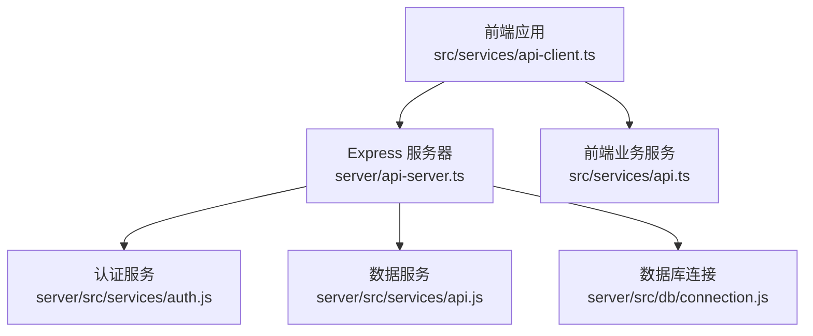
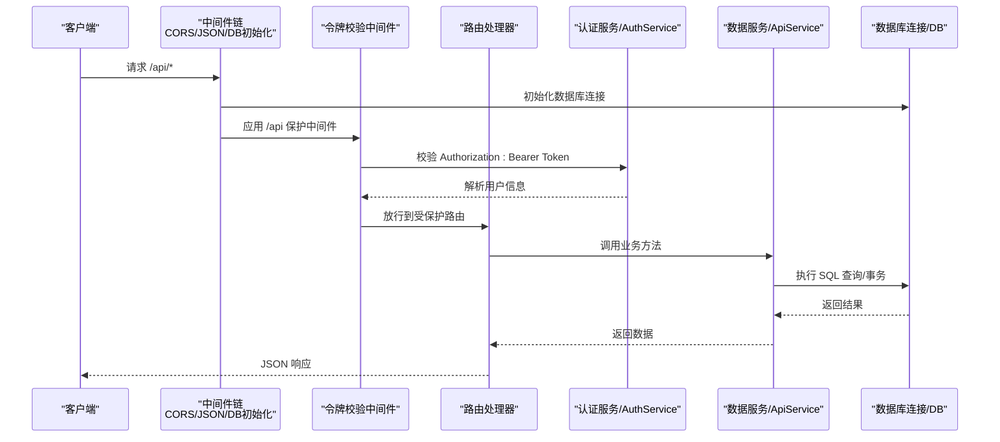
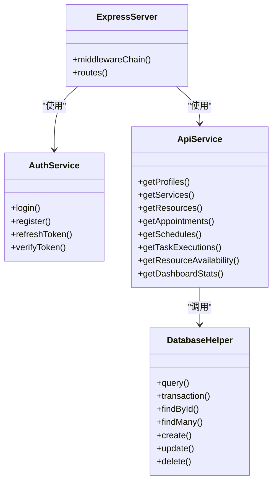

# API端点

<cite>
**本文引用的文件**
- [server/api-server.ts](file://server/api-server.ts)
- [server/src/services/auth.js](file://server/src/services/auth.js)
- [server/src/services/api.js](file://server/src/services/api.js)
- [server/src/db/connection.js](file://server/src/db/connection.js)
- [src/services/api.ts](file://src/services/api.ts)
- [src/services/api-client.ts](file://src/services/api-client.ts)
- [DINGTALK_SYNC_IMPLEMENTATION.md](file://DINGTALK_SYNC_IMPLEMENTATION.md)
- [docs/prd.md](file://docs/prd.md)
</cite>

## 目录
1. [简介](#简介)
2. [项目结构](#项目结构)
3. [核心组件](#核心组件)
4. [架构总览](#架构总览)
5. [详细组件分析](#详细组件分析)
6. [依赖关系分析](#依赖关系分析)
7. [性能考虑](#性能考虑)
8. [故障排除指南](#故障排除指南)
9. [结论](#结论)
10. [附录](#附录)

## 简介
本文件面向前端开发者，系统性梳理 Bio-Appointment 基于 Express.js 的 RESTful API 路由结构与调用规范，覆盖健康检查、认证鉴权、用户管理、资源调度、钉钉集成等核心接口。文档重点解析以下关键端点：
- /api/health：健康检查
- /api/auth/*：登录、注册、刷新、登出
- /api/users：超级管理员用户管理（增删改查）
- /api/dingtalk/config、/api/dingtalk/sync、/api/dingtalk/sync/logs：钉钉配置、触发同步、同步日志
- /api/filters/options、/api/filters/apply：筛选选项与应用筛选（以 PRD 文档为准）

同时，文档说明路由分发机制、中间件链执行顺序、错误处理规范、请求频率限制与安全防护策略，帮助前后端协同对接。

## 项目结构
后端采用 Express.js 提供 RESTful API，核心文件组织如下：
- 服务器入口与路由：server/api-server.ts
- 认证服务：server/src/services/auth.js
- 数据服务（CRUD/聚合）：server/src/services/api.js
- 数据库连接与事务：server/src/db/connection.js
- 前端 API 客户端封装：src/services/api-client.ts
- 前端业务服务（同名类）：src/services/api.ts
- 钉钉同步接口说明：DINGTALK_SYNC_IMPLEMENTATION.md
- PRD 中的筛选接口定义：docs/prd.md

图表来源
- [server/api-server.ts](file://server/api-server.ts#L1-L120)
- [server/src/services/auth.js](file://server/src/services/auth.js#L1-L120)
- [server/src/services/api.js](file://server/src/services/api.js#L1-L120)
- [server/src/db/connection.js](file://server/src/db/connection.js#L1-L120)
- [src/services/api-client.ts](file://src/services/api-client.ts#L331-L381)
- [src/services/api.ts](file://src/services/api.ts#L1-L120)

章节来源
- [server/api-server.ts](file://server/api-server.ts#L1-L120)
- [server/src/db/connection.js](file://server/src/db/connection.js#L1-L120)

## 核心组件
- Express 服务器与中间件链
  - CORS 与 JSON 解析中间件
  - 数据库初始化中间件
  - 统一错误处理中间件
  - 令牌校验中间件（保护 /api 路由）
- 认证服务（JWT）
  - 登录、注册、刷新、登出
  - 密码哈希与校验
  - 角色权限模型
- 数据服务（CRUD/聚合）
  - 用户、服务、资源、预约、排班、任务执行、可用性、仪表盘统计
- 钉钉集成
  - 配置读写、触发同步、同步日志查询
- 前端 API 客户端
  - 封装 /dingtalk/* 与 /users* 等调用

章节来源
- [server/api-server.ts](file://server/api-server.ts#L1-L120)
- [server/src/services/auth.js](file://server/src/services/auth.js#L1-L120)
- [server/src/services/api.js](file://server/src/services/api.js#L1-L120)
- [src/services/api-client.ts](file://src/services/api-client.ts#L331-L381)

## 架构总览
下图展示 API 服务器的路由与中间件链路，以及与认证、数据服务、数据库的交互。

图表来源
- [server/api-server.ts](file://server/api-server.ts#L1-L120)
- [server/src/services/auth.js](file://server/src/services/auth.js#L1-L120)
- [server/src/services/api.js](file://server/src/services/api.js#L1-L120)
- [server/src/db/connection.js](file://server/src/db/connection.js#L1-L120)

## 详细组件分析

### 健康检查 /api/health
- 方法与路径：GET /api/health
- 功能：检查服务与数据库健康状态
- 成功响应：包含状态、数据库健康、时间戳
- 失败响应：状态 unhealthy 及错误信息
- 状态码：200（健康），500（异常）

章节来源
- [server/api-server.ts](file://server/api-server.ts#L39-L54)
- [server/src/db/connection.js](file://server/src/db/connection.js#L112-L141)

### 认证与授权
- 中间件链
  - CORS 与 JSON 解析
  - 数据库初始化
  - 统一错误处理
  - 令牌校验中间件（对 /api 前缀生效）
- 令牌校验中间件
  - 从 Authorization 头提取 Bearer Token
  - 调用 AuthService.verifyToken 校验
  - 通过后将用户信息挂载到 req.user 并放行
- 登录 /api/auth/login
  - 方法与路径：POST /api/auth/login
  - 请求体：用户名、密码
  - 成功：返回用户信息与访问/刷新令牌
  - 失败：401，错误信息
- 注册 /api/auth/register
  - 方法与路径：POST /api/auth/register
  - 请求体：用户名、密码、全名、邮箱（可选）
  - 成功：返回新建用户（不含密码哈希）
  - 失败：400，错误信息
- 刷新 /api/auth/refresh
  - 方法与路径：POST /api/auth/refresh
  - 请求体：refreshToken
  - 成功：返回新的访问/刷新令牌
  - 失败：401，错误信息
- 登出 /api/auth/logout
  - 方法与路径：POST /api/auth/logout
  - 成功：返回 { success: true }

章节来源
- [server/api-server.ts](file://server/api-server.ts#L1-L120)
- [server/api-server.ts](file://server/api-server.ts#L118-L149)
- [server/src/services/auth.js](file://server/src/services/auth.js#L1-L120)
- [server/src/services/auth.js](file://server/src/services/auth.js#L120-L200)

### 受保护路由与中间件链
- 中间件顺序（自上而下）
  1) CORS 与 JSON 解析
  2) 数据库初始化
  3) 统一错误处理
  4) 令牌校验中间件（对 /api 前缀生效）
- 说明
  - /api/* 路由均受中间件保护
  - 未携带有效 Bearer Token 将返回 401

章节来源
- [server/api-server.ts](file://server/api-server.ts#L1-L120)
- [server/api-server.ts](file://server/api-server.ts#L150-L152)

### 用户管理（超级管理员）
- 获取用户列表 /api/users
  - 方法与路径：GET /api/users
  - 权限：仅超级管理员
  - 成功：返回 profiles 列表（按创建时间倒序）
  - 失败：401/403/500
- 创建用户 /api/users
  - 方法与路径：POST /api/users
  - 权限：仅超级管理员
  - 请求体：username、password、full_name、role、department
  - 成功：201，返回新建用户
  - 失败：400/401/403/500
- 更新用户 /api/users/:id
  - 方法与路径：PUT /api/users/:id
  - 权限：仅超级管理员
  - 请求体：可选字段 full_name、role、department、status
  - 成功：返回更新后的用户
  - 失败：400/401/403/404/500
- 删除用户（软删除）/api/users/:id
  - 方法与路径：DELETE /api/users/:id
  - 权限：仅超级管理员
  - 行为：禁止自我删除；将 status 设为 disabled
  - 成功：返回被软删除用户
  - 失败：400/401/403/404/500

章节来源
- [server/api-server.ts](file://server/api-server.ts#L905-L1174)

### 资源与预约调度
- 服务列表 /api/services
  - 方法与路径：GET /api/services?category=...
  - 成功：返回激活的服务列表（按分类与名称排序）
- 资源列表 /api/resources
  - 方法与路径：GET /api/resources?type=&status=
  - 成功：返回激活的资源列表（按类型与名称排序）
- 预约列表 /api/appointments
  - 方法与路径：GET /api/appointments?customer_name=&status=&sales_id=&doctor_id=&requested_date=&requested_date_from=&requested_date_to=
  - 成功：返回按日期与创建时间倒序的预约集合
- 排班列表 /api/schedules
  - 方法与路径：GET /api/schedules?scheduled_date=&scheduled_date_from=&scheduled_date_to=&room_id=&nurse_id=&status=
  - 成功：返回带关联信息的排班集合
- 任务执行列表 /api/task-executions
  - 方法与路径：GET /api/task-executions?schedule_id=&nurse_id=&status=&date=
  - 成功：返回带关联信息的任务执行集合
- 仪表盘统计 /api/dashboard/stats?date=
  - 方法与路径：GET /api/dashboard/stats
  - 成功：返回当日预约/排班/任务统计
- 资源可用性 /api/resources/availability?date=&time_start=&time_end=
  - 方法与路径：GET /api/resources/availability
  - 成功：返回可用房间与可用护士列表
- 护士列表（活跃）/api/profiles/nurses/available
  - 方法与路径：GET /api/profiles/nurses/available
  - 成功：返回角色为护士/护士长且状态为活跃的用户列表
- 医生列表（活跃）/api/doctors/available
  - 方法与路径：GET /api/doctors/available
  - 成功：返回角色为医生且状态为活跃的用户列表

章节来源
- [server/api-server.ts](file://server/api-server.ts#L188-L475)
- [server/src/services/api.js](file://server/src/services/api.js#L1-L374)

### 钉钉集成
- 获取配置 /api/dingtalk/config
  - 方法与路径：GET /api/dingtalk/config
  - 成功：返回最近一条配置记录
  - 失败：500
- 保存/更新配置 /api/dingtalk/config
  - 方法与路径：POST /api/dingtalk/config
  - 权限：仅超级管理员
  - 请求体：app_key、app_secret、agent_id、corp_id、sync_enabled、auto_sync_enabled、sync_schedule、sync_time、conflict_strategy、selected_departments[]
  - 成功：返回保存/更新后的配置
  - 失败：401/403/500
- 触发同步 /api/dingtalk/sync
  - 方法与路径：POST /api/dingtalk/sync
  - 权限：仅超级管理员
  - 请求体：sync_type（manual/auto/incremental）、selected_departments[]、conflict_strategy（dingtalk_first/local_first/manual）
  - 流程要点：
    - 校验配置存在且启用
    - 写入同步日志（running）
    - 获取钉钉 access_token
    - 拉取部门列表并写入映射表
    - 按部门拉取用户，处理冲突策略（本地/钉钉优先/手动）
    - 更新同步日志状态（success/partial/failed）
  - 成功：返回同步结果与统计
  - 失败：400/401/403/500
- 同步日志列表 /api/dingtalk/sync/logs
  - 方法与路径：GET /api/dingtalk/sync/logs?limit=&offset=&status=
  - 成功：返回日志列表与总数
  - 失败：500

章节来源
- [server/api-server.ts](file://server/api-server.ts#L477-L903)
- [DINGTALK_SYNC_IMPLEMENTATION.md](file://DINGTALK_SYNC_IMPLEMENTATION.md#L8-L13)

### 筛选接口（PRD 定义）
- 获取筛选选项 /api/filters/options
  - 返回可选的护士、护士长、房间资源列表
- 应用筛选条件 /api/filters/apply
  - 接收筛选条件参数，返回筛选后的资源看板数据

章节来源
- [docs/prd.md](file://docs/prd.md#L709-L710)

### 前端调用封装
- 钉钉配置与同步
  - getDingTalkConfig/saveDingTalkConfig/triggerSync/getSyncLogs
- 用户管理
  - 前端未直接暴露 /api/users*，但可通过后端代理或内部服务调用

章节来源
- [src/services/api-client.ts](file://src/services/api-client.ts#L331-L381)

## 依赖关系分析
- 服务器入口依赖
  - 认证服务：用于登录、注册、刷新、令牌校验
  - 数据服务：提供 CRUD 与聚合查询
  - 数据库连接：提供连接池、事务、健康检查
- 前端依赖
  - api-client.ts 封装 /dingtalk/* 与 /users* 调用
  - api.ts 提供前端侧 ApiService 类（与后端同名类对应）

图表来源
- [server/api-server.ts](file://server/api-server.ts#L1-L120)
- [server/src/services/auth.js](file://server/src/services/auth.js#L1-L120)
- [server/src/services/api.js](file://server/src/services/api.js#L1-L120)
- [server/src/db/connection.js](file://server/src/db/connection.js#L160-L271)

章节来源
- [server/src/db/connection.js](file://server/src/db/connection.js#L160-L271)

## 性能考虑
- 数据库连接池与事务
  - 使用连接池减少连接开销
  - 事务封装保证一致性
- 查询优化
  - ApiService 对多表联结与动态 WHERE 子句进行参数化拼接，避免 SQL 注入
- 并发与可用性
  - 可用性查询使用并发查询，缩短等待时间
- 建议
  - 对高频查询增加索引（如预约日期、状态、用户角色）
  - 对大结果集分页（limit/offset）或游标分页
  - 对钉钉同步设置合理的并发与重试策略

章节来源
- [server/src/db/connection.js](file://server/src/db/connection.js#L1-L120)
- [server/src/services/api.js](file://server/src/services/api.js#L1-L120)

## 故障排除指南
- 常见错误与处理
  - 401 未授权：检查 Authorization 头是否包含有效的 Bearer Token
  - 403 权限不足：确认当前用户角色为超级管理员（仅 /api/users 与 /api/dingtalk/config）
  - 500 服务器错误：统一错误中间件会捕获并返回通用错误信息
- 日志与诊断
  - 服务器端打印数据库查询耗时与错误
  - 钉钉同步过程中记录详细日志与失败明细
- 建议排查步骤
  - 先调用 /api/health 确认服务与数据库健康
  - 检查 JWT 密钥与过期时间配置
  - 核对钉钉配置项（app_key、app_secret、agent_id、corp_id）与同步开关

章节来源
- [server/api-server.ts](file://server/api-server.ts#L1-L120)
- [server/api-server.ts](file://server/api-server.ts#L477-L903)
- [server/src/db/connection.js](file://server/src/db/connection.js#L1-L120)

## 结论
本文件系统性梳理了 Bio-Appointment 的 RESTful API 路由与调用规范，明确了中间件链、认证鉴权、用户管理、资源调度与钉钉集成的关键端点。建议在生产环境中：
- 明确 API 版本策略（如 /v1/ 前缀）
- 引入速率限制与 IP 白名单
- 加强敏感字段脱敏与审计日志
- 对高频接口引入缓存与索引优化

## 附录

### API 版本控制策略
- 当前仓库未显式实现版本前缀（如 /v1）。建议在路由层添加版本前缀，便于后续演进与向后兼容。

### 错误处理规范
- 统一错误中间件返回 { error, message }，状态码遵循语义化约定（4xx/5xx）
- 认证失败返回 401，权限不足返回 403，业务异常返回 4xx/5xx

### 请求频率限制与安全防护
- 速率限制：建议在网关或中间件层引入限流（如基于 IP 或用户）
- CORS：当前允许特定来源，生产环境建议限定来源并开启凭证
- JWT：建议使用 HTTPS 传输，短令牌+刷新令牌轮换，严格校验签发方与受众
- 输入校验：对请求体与查询参数进行白名单校验与长度/范围限制

### 前端调用指南
- 使用 api-client.ts 封装的 /dingtalk/* 与 /users* 接口
- 对受保护接口在请求头添加 Authorization: Bearer <token>
- 对 /api/dingtalk/sync 请求体包含必要的同步参数与冲突策略

章节来源
- [src/services/api-client.ts](file://src/services/api-client.ts#L331-L381)
- [server/api-server.ts](file://server/api-server.ts#L1-L120)