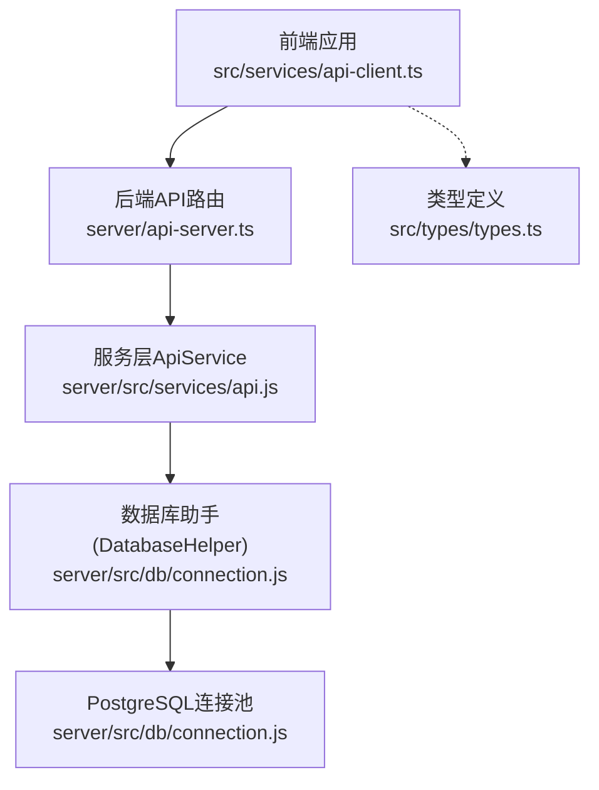
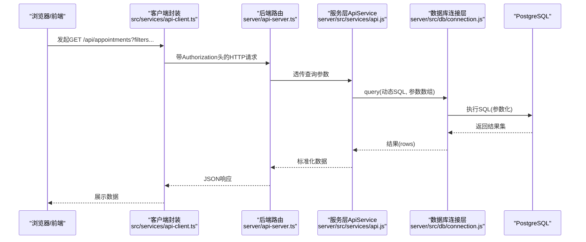
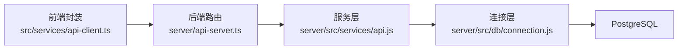

# 数据查询接口

<cite>
**本文引用的文件**
- [server/api-server.ts](file://server/api-server.ts)
- [server/src/services/api.js](file://server/src/services/api.js)
- [server/src/db/connection.js](file://server/src/db/connection.js)
- [src/services/api-client.ts](file://src/services/api-client.ts)
- [src/db/api.ts](file://src/db/api.ts)
- [src/types/types.ts](file://src/types/types.ts)
</cite>

## 目录
1. [简介](#简介)
2. [项目结构](#项目结构)
3. [核心组件](#核心组件)
4. [架构总览](#架构总览)
5. [详细组件分析](#详细组件分析)
6. [依赖关系分析](#依赖关系分析)
7. [性能考量](#性能考量)
8. [故障排查指南](#故障排查指南)
9. [结论](#结论)

## 简介
本文件面向Bio-Appointment系统的前端与集成方，提供“数据查询接口”的权威说明。围绕基础数据实体，重点覆盖以下四个核心端点：
- 获取用户档案：/api/profiles/:id
- 获取服务项目：/api/services
- 获取资源配置：/api/resources
- 获取预约记录：/api/appointments

同时，深入解析预约查询接口的复杂过滤逻辑（支持客户姓名模糊搜索、状态精确匹配、销售/医生ID关联查询以及日期范围筛选），并说明动态WHERE子句构建机制与SQL注入防护（参数化查询）。最后，结合代码示例展示服务层(ApiService)与数据库连接层的协作模式，以及错误处理与日志记录的最佳实践。

## 项目结构
系统采用前后端分离架构：
- 前端通过统一的客户端封装发起REST请求，自动附加认证头并处理响应。
- 后端Express服务暴露受保护的API路由，路由层负责鉴权与参数透传。
- 服务层封装业务查询，构建动态WHERE子句并执行参数化查询。
- 数据库连接层提供连接池、事务与健康检查，并统一记录查询耗时与错误。

图表来源
- [server/api-server.ts](file://server/api-server.ts#L1-L120)
- [server/src/services/api.js](file://server/src/services/api.js#L1-L120)
- [server/src/db/connection.js](file://server/src/db/connection.js#L1-L120)
- [src/services/api-client.ts](file://src/services/api-client.ts#L1-L120)
- [src/types/types.ts](file://src/types/types.ts#L1-L120)

章节来源
- [server/api-server.ts](file://server/api-server.ts#L1-L120)
- [src/services/api-client.ts](file://src/services/api-client.ts#L1-L120)

## 核心组件
- 后端API路由（受保护）：负责鉴权、参数校验与错误处理，将查询参数传递给服务层。
- 服务层ApiService：根据查询参数动态拼接WHERE子句，使用参数化查询执行SQL，返回标准化数据。
- 数据库连接层：提供连接池、事务、健康检查；统一记录查询耗时与错误。
- 前端客户端封装：统一构造URL、附加认证头、序列化查询参数、处理响应与错误。

章节来源
- [server/api-server.ts](file://server/api-server.ts#L118-L231)
- [server/src/services/api.js](file://server/src/services/api.js#L98-L164)
- [server/src/db/connection.js](file://server/src/db/connection.js#L77-L120)
- [src/services/api-client.ts](file://src/services/api-client.ts#L178-L225)

## 架构总览
下图展示了从浏览器到数据库的完整调用链路，以及服务层与数据库层的协作方式。

图表来源
- [src/services/api-client.ts](file://src/services/api-client.ts#L178-L225)
- [server/api-server.ts](file://server/api-server.ts#L218-L231)
- [server/src/services/api.js](file://server/src/services/api.js#L98-L164)
- [server/src/db/connection.js](file://server/src/db/connection.js#L77-L120)

## 详细组件分析

### 1) 获取用户档案 /api/profiles/:id
- 方法与路径
  - GET /api/profiles/:id
- 认证
  - 受保护路由，需携带Bearer Token。
- 查询参数
  - 无查询参数。
- 响应
  - 成功：返回Profile对象（已移除敏感字段password_hash）。
  - 失败：返回错误信息与HTTP状态码。
- 服务层与数据库协作
  - 服务层通过DatabaseHelper.findById定位用户，再剔除password_hash返回。
- 前端调用
  - 前端封装中对应getProfile(id)方法，自动附加Authorization头。

章节来源
- [server/api-server.ts](file://server/api-server.ts#L153-L186)
- [server/src/services/api.js](file://server/src/services/api.js#L10-L27)
- [src/services/api-client.ts](file://src/services/api-client.ts#L273-L279)

### 2) 获取服务项目 /api/services
- 方法与路径
  - GET /api/services
- 认证
  - 受保护路由。
- 查询参数
  - category：可选，按分类过滤。
- 响应
  - 成功：返回Service数组（仅返回is_active=true的服务）。
  - 失败：返回错误信息。
- 服务层与数据库协作
  - 服务层根据category构造条件，使用DatabaseHelper.findMany查询并过滤is_active。
- 前端调用
  - 前端封装中对应getServices(category?)方法。

章节来源
- [server/api-server.ts](file://server/api-server.ts#L188-L201)
- [server/src/services/api.js](file://server/src/services/api.js#L49-L71)
- [src/services/api-client.ts](file://src/services/api-client.ts#L212-L216)

### 3) 获取资源配置 /api/resources
- 方法与路径
  - GET /api/resources
- 认证
  - 受保护路由。
- 查询参数
  - type：可选，按类型过滤。
  - status：可选，按状态过滤。
- 响应
  - 成功：返回Resource数组（仅返回is_active=true的资源）。
  - 失败：返回错误信息。
- 服务层与数据库协作
  - 服务层根据type/status构造条件，使用DatabaseHelper.findMany查询并过滤is_active。
- 前端调用
  - 前端封装中对应getResources({type?, status?})方法。

章节来源
- [server/api-server.ts](file://server/api-server.ts#L203-L216)
- [server/src/services/api.js](file://server/src/services/api.js#L72-L97)
- [src/services/api-client.ts](file://src/services/api-client.ts#L219-L225)

### 4) 获取预约记录 /api/appointments
- 方法与路径
  - GET /api/appointments
- 认证
  - 受保护路由。
- 查询参数
  - customer_name：可选，支持模糊搜索（ILIKE）。
  - status：可选，精确匹配。
  - sales_id：可选，精确匹配。
  - doctor_id：可选，精确匹配。
  - requested_date：可选，精确匹配。
  - requested_date_from：可选，日期下限。
  - requested_date_to：可选，日期上限。
- 响应
  - 成功：返回Appointment数组，按requested_date降序、created_at降序排序。
  - 失败：返回错误信息。
- 动态WHERE子句与SQL注入防护
  - 服务层逐项判断查询参数，动态拼接whereClause并以$1、$2…顺序追加参数，最终以参数化查询执行，避免SQL注入。
- 日期范围筛选逻辑
  - requested_date_from与requested_date_to分别生成>=与<=条件，形成闭区间。
- 前端调用
  - 前端封装中对应getAppointments(filters?)方法，将filters转换为URL查询字符串。

```mermaid
flowchart TD
Start(["进入ApiService.getAppointments"]) --> Init["初始化whereClause='1=1'<br/>params=[]<br/>paramIndex=1"]
Init --> CheckCN{"customer_name存在？"}
CheckCN --> |是| AddCN["whereClause+= AND customer_name ILIKE $paramIndex<br/>params.push('%'+name+'%')<br/>paramIndex++"]
CheckCN --> |否| CheckStatus{"status存在？"}
AddCN --> CheckStatus
CheckStatus --> |是| AddStatus["whereClause+= AND status=$paramIndex<br/>params.push(status)<br/>paramIndex++"]
CheckStatus --> |否| CheckSales{"sales_id存在？"}
AddStatus --> CheckSales
CheckSales --> |是| AddSales["whereClause+= AND sales_id=$paramIndex<br/>params.push(sales_id)<br/>paramIndex++"]
CheckSales --> |否| CheckDoc{"doctor_id存在？"}
AddSales --> CheckDoc
CheckDoc --> |是| AddDoc["whereClause+= AND doctor_id=$paramIndex<br/>params.push(doctor_id)<br/>paramIndex++"]
CheckDoc --> |否| CheckDate{"requested_date存在？"}
AddDoc --> CheckDate
CheckDate --> |是| AddDate["whereClause+= AND requested_date=$paramIndex<br/>params.push(date)<br/>paramIndex++"]
CheckDate --> |否| CheckFrom{"requested_date_from存在？"}
AddDate --> CheckFrom
CheckFrom --> |是| AddFrom["whereClause+= AND requested_date >=$paramIndex<br/>params.push(from)<br/>paramIndex++"]
CheckFrom --> |否| CheckTo{"requested_date_to存在？"}
AddFrom --> CheckTo
CheckTo --> |是| AddTo["whereClause+= AND requested_date <=$paramIndex<br/>params.push(to)<br/>paramIndex++"]
CheckTo --> |否| Build["拼装最终SQL并执行参数化查询"]
AddTo --> Build
Build --> Order["ORDER BY requested_date DESC, created_at DESC"]
Order --> Return["返回结果rows"]
```

图表来源
- [server/src/services/api.js](file://server/src/services/api.js#L98-L164)

章节来源
- [server/api-server.ts](file://server/api-server.ts#L218-L231)
- [server/src/services/api.js](file://server/src/services/api.js#L98-L164)
- [src/services/api-client.ts](file://src/services/api-client.ts#L179-L190)

## 依赖关系分析
- 组件耦合
  - 路由层仅负责鉴权与参数透传，不直接操作数据库，耦合度低。
  - 服务层集中封装查询逻辑，便于复用与扩展。
  - 数据库连接层提供统一的query与事务接口，屏蔽底层细节。
- 关键依赖链
  - 前端封装 -> 后端路由 -> 服务层 -> 数据库连接层 -> PostgreSQL
- 潜在风险
  - 动态WHERE子句需确保所有外部输入均通过参数绑定，避免拼接字符串。
  - 日期范围参数需注意边界值与时区一致性。

图表来源
- [src/services/api-client.ts](file://src/services/api-client.ts#L178-L225)
- [server/api-server.ts](file://server/api-server.ts#L118-L231)
- [server/src/services/api.js](file://server/src/services/api.js#L1-L120)
- [server/src/db/connection.js](file://server/src/db/connection.js#L77-L120)

章节来源
- [src/services/api-client.ts](file://src/services/api-client.ts#L1-L225)
- [server/api-server.ts](file://server/api-server.ts#L118-L231)
- [server/src/services/api.js](file://server/src/services/api.js#L1-L164)
- [server/src/db/connection.js](file://server/src/db/connection.js#L77-L120)

## 性能考量
- 参数化查询
  - 全部使用$1、$2…占位符绑定参数，提升缓存命中率与安全性。
- 索引建议
  - 在appointments表上为status、sales_id、doctor_id、requested_date建立复合索引，可显著提升过滤性能。
- 分页与排序
  - 当前实现未内置分页，建议在查询参数中增加limit/offset或使用游标分页。
- 连接池
  - 连接池大小与超时参数可根据并发量调整，避免连接争用。

## 故障排查指南
- 常见错误与处理
  - 401 未授权：确认Authorization头是否正确携带，Token是否过期。
  - 500 服务器内部错误：查看后端日志中的错误堆栈，定位服务层或数据库层异常。
  - 400 缺少必要参数：例如资源可用性接口需要date、time_start、time_end。
- 日志与监控
  - 数据库层在执行query时会输出执行耗时与影响行数，便于定位慢查询。
  - 建议在路由层与服务层增加结构化日志，记录请求ID、用户ID、SQL片段与耗时。
- 前端错误处理
  - 前端封装统一捕获HTTP错误并抛出，调用方可捕获并提示用户。

章节来源
- [server/api-server.ts](file://server/api-server.ts#L28-L54)
- [server/src/db/connection.js](file://server/src/db/connection.js#L77-L120)
- [src/services/api-client.ts](file://src/services/api-client.ts#L1-L42)

## 结论
本文档系统梳理了Bio-Appointment的数据查询接口，明确了各端点的HTTP方法、路径、查询参数、响应结构与状态码，并重点解析了预约查询的复杂过滤逻辑与SQL注入防护机制。通过服务层与数据库连接层的清晰分工，系统实现了高内聚、低耦合的查询架构。建议后续引入索引优化、分页策略与更完善的日志监控体系，持续提升性能与可观测性。